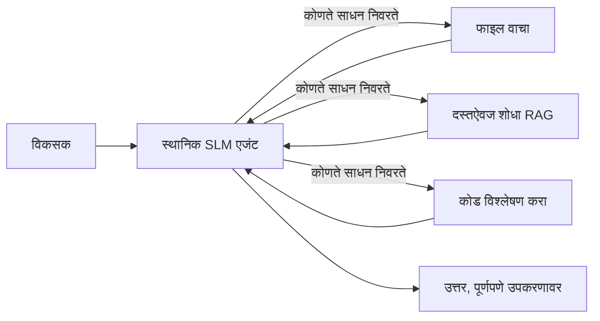
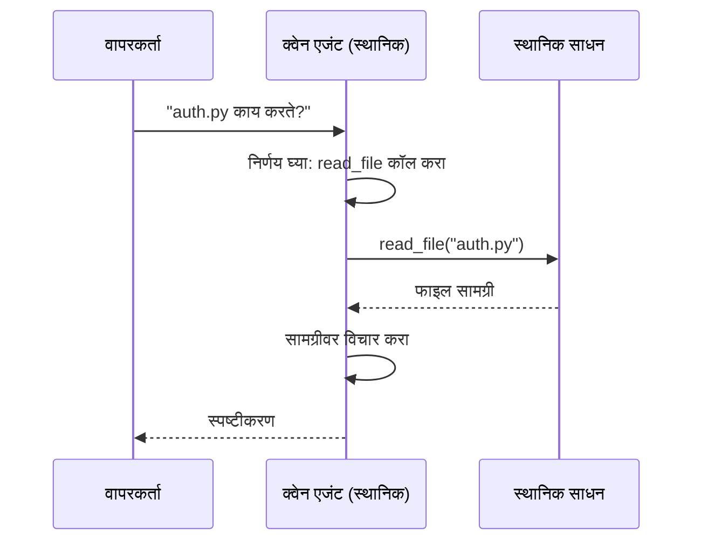
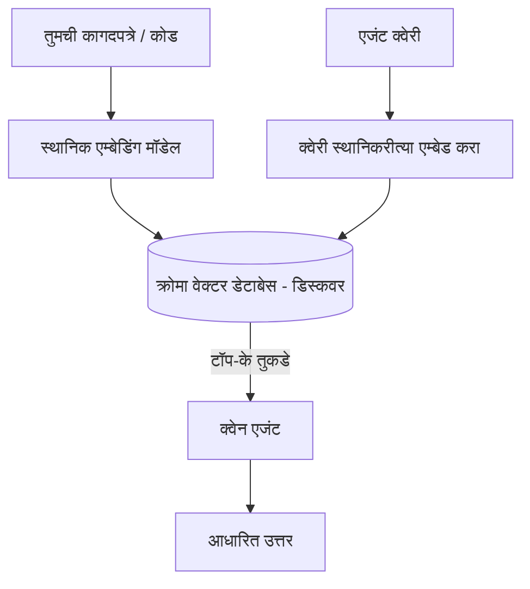
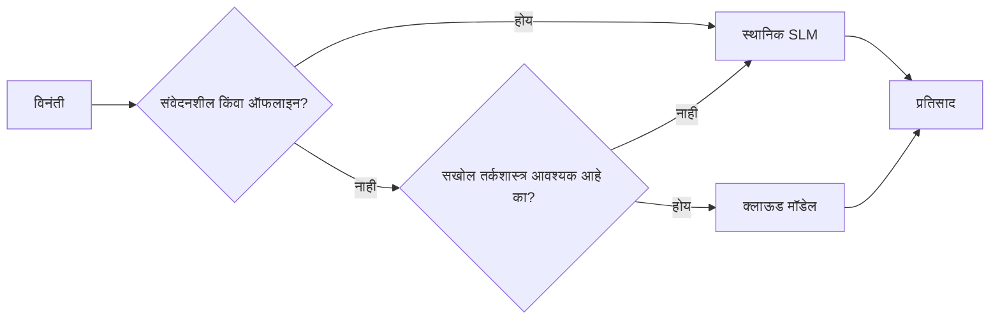

# Microsoft Foundry Local आणि Qwen वापरून स्थानिक AI एजंट तयार करणे


मागील धडा एजंटना क्लाउडमध्ये *स्टेप अप* करायचा होता. हा धडा त्यांना एका मशीनवर *डाउन* आणतो. शेवटी तुमच्याकडे एक कार्यशील अभियांत्रिकी सहाय्यक असेल जो विचार करतो, साधने कॉल करतो, तुमची फाइल्स वाचतो आणि तुमची कागदपत्रे शोधतो — **एकाही क्लाउड इन्फरन्स कॉलशिवाय.**

तुम्हाला असे का हवे? प्रत्यक्ष अभियांत्रिकी कामात सतत येणाऱ्या तीन कारणे:

- **गोपनीयता.** कोड आणि कागदपत्रे मशीन सोडत नाहीत. कोणताही प्रॉम्प्ट, स्निपेट किंवा ग्राहक डेटा नेटवर्क मर्यादेबाहेर जात नाही.
- **खर्च.** स्थानिक इन्फरन्सकरिता प्रति-टोकन बिल लागत नाही. तुम्ही दिवसभरास बर्यासाठी वापरू शकता फक्त विजेचा खर्च.
- **ऑफलाइन.** विमानात, सुरक्षित ठिकाणी किंवा आउटेज दरम्यान, एजंट अजूनही कार्यरत राहतो.

अडथळा असा की तुम्ही एका अग्रगण्य क्लाउड मॉडेलच्या बदल्यात **लहान भाषा मॉडेल (SLM)** वापरत आहात जे तुमच्या CPU, GPU किंवा NPU वर चालते. हा धडा या अडथळ्याच्या आत *चांगल्या* एजंट्स तयार करण्याबद्दल आहे, जणू काही अडथळा अस्तित्वातच नाही.

## परिचय

हा धडा खालील विषयांवर आहे:

- **लहान भाषा मॉडेल्स (SLMs)** — काय आहेत, कुठे चमकतात आणि कुठे नाहीत.
- **Microsoft Foundry Local** — एक रनटाइम जो डिव्हाइसवर मॉडेल्स डाउनलोड करतो आणि सेवा पुरवतो, जो एक **OpenAI-सुसंगत API** आहे.
- **Qwen फंक्शन-कॉलिंग मॉडेल्स** — SLM जी साधने कॉल विश्वासार्हपणे तयार करतात, जे स्थानिक *एजंट्स* (फक्त स्थानिक चॅट नाही) शक्य करतात.
- **स्थानिक साधने, स्थानिक RAG, आणि स्थानिक MCP** — एजंटला क्लाउड शिवाय क्षमता देणे.
- **हायब्रिड पॅटर्न** — कधी स्थानिक ठेवायचे आणि कधी क्लाउडकडे जायचे.

## शिकण्याची उद्दिष्टे

हा धडा पूर्ण केल्यानंतर, तुम्हाला कसे कळेल:

- SLMs चे फायदे आणि तोटे समजावून घेणे आणि योग्य स्थानिक एजंट उपयोगपत्रे निवडणे.
- Foundry Local सह स्थानिक Qwen मॉडेल सेवा देणे आणि OpenAI-सुसंगत एंडपॉइंटद्वारे जोडणे.
- पूर्णपणे तुमच्या वर्कस्टेशनवर चालणाऱ्या साधन-कॉलिंग एजंट तयार करणे.
- स्थानिक व्हेक्टर डेटाबेस (Chroma) वापरून तुमच्या कागदपत्रांवर स्थानिक RAG जोडणे.
- एजंटला स्थानिक MCP सर्व्हरशी जोडणे आणि हायब्रिड स्थानिक/क्लाउड डिझाइनवर विचार करणे.

## पूर्वआवश्यकता

हा धडा येथे पूर्ण केला असल्याचा गृहित धरतो आणि तुम्हाला सवय आहे:

- [साधन वापर](../04-tool-use/README.md) (धडा 4) आणि [Agentic RAG](../05-agentic-rag/README.md) (धडा 5).
- [Agentic प्रोटोकॉल / MCP](../11-agentic-protocols/README.md) (धडा 11).
- [Microsoft एजंट फ्रेमवर्क](../14-microsoft-agent-framework/README.md) (धडा 14).

तुम्हाला खालील गोष्टी देखील हव्या:

- डेव्हलपर वर्कस्टेशन. **8 GB RAM हा वास्तविक किमान आहे**; 16 GB+ आरामदायक आहे. GPU किंवा NPU उपयोगी आहे पण आवश्यक नाही.
- **Microsoft Foundry Local** स्थापित (खाली सेटअप विभाग पहा).
- Python 3.12+ आणि रेपॉजिटरीतील [`requirements.txt`](../../../requirements.txt) पॅकेजेस, तसेच `foundry-local-sdk`, `openai`, आणि `chromadb` या धड्यासाठी.

## लहान भाषा मॉडेल्स: स्थानिक कामासाठी योग्य साधन

अग्रगण्य क्लाउड मॉडेलमध्ये शेकडो अब्ज पॅरामीटर्स आणि डेटा सेंटर असतो. SLM मध्ये काही अब्ज पॅरामीटर्स असतात आणि ते तुमच्या लॅपटॉपच्या RAM मध्ये फिट व्हावे लागतात. हा फरक स्पष्ट अपेक्षा ठरवतो.

**SLMs चांगले आहेत:**

- संरचित, मर्यादित कामे — वर्गीकरण, माहिती काढणे, ज्ञात दस्तऐवजाचे सारांश.
- **साधने कॉल करणे** — कोणती फंक्शन कॉल करायची आणि कोणते आर्ग्युमेंट वापरायचे हे ठरविणे.
- तुमच्या स्वतःच्या डेटावर जलद, स्वस्त, आणि खाजगी पुनरावृत्ती.

**SLMs कमकुवत आहेत:**

- मोठ्या संदर्भावर मुक्त आणि बहु-टप्पा विचार करणे.
- व्यापक जगातील ज्ञान (त्यांनी कमी पाहिले आहे आणि जास्त विसरतात).

त्यामुळे स्थानिक एजंटसाठी जिंकणारी रणनीती आहे: **SLM ऑर्केस्ट्रेट करेल, आणि साधने भारी काम करतील.** मॉडेलला तुमचा कोडबेस *माहित* असण्याची गरज नाही — त्याला फक्त कळायला हवे कधी `read_file` आणि `search_docs` कॉल करायचे. हे थेट SLM च्या ताकदीशी खेळते.



## Microsoft Foundry Local

**Microsoft Foundry Local** एक हलके रनटाइम आहे जे पूर्णपणे तुमच्या मशीनवर मॉडेल डाउनलोड, व्यवस्थापन आणि सेवा पुरवते. त्याचा सर्वात महत्त्वाचा वैशिष्ट्य म्हणजे तो एक **OpenAI-सुसंगत HTTP एंडपॉइंट** उघडतो — म्हणजे OpenAI SDK आणि Microsoft Agent Framework चा OpenAI क्लाएंट फक्त `base_url` बदलून त्याच्याशी कार्य करू शकतात. एजंट तयार करण्याबाबत सर्वकाही थेट क्लाउडकडून `localhost` कडे स्थानांतरित होते.

Foundry Local तुमच्या हार्डवेअरसाठी सर्वोत्तम मॉडेल बिल्ड स्वयंचलितपणे निवडतो — CPU बिल्ड, CUDA/GPU बिल्ड किंवा NPU बिल्ड — जेणेकरून तुम्हाला प्रत्येक मशीनसाठी विशेष ऑप्टिमायझेशन करावे लागणार नाही.

### सेटअप

Foundry Local स्थापित करा (तुमच्या OS साठी [प्रलेखन](https://learn.microsoft.com/azure/ai-foundry/foundry-local/) पहा), नंतर ते कार्य करत असल्याची पुष्टी करा:

```bash
# स्थापित करा (उदाहरणार्थ; आपल्या प्लॅटफॉर्मसाठी दस्तऐवजांचे पालन करा)
winget install Microsoft.FoundryLocal      # विंडोज
# brew install microsoft/foundrylocal/foundrylocal   # macOS

# Qwen मॉडेल डाउनलोड करा आणि चालवा, नंतर स्थानिक सेवा सुरू करा
foundry model run qwen2.5-7b-instruct
foundry service status
```

सेवा चालू झाल्यावर, तुमच्याकडे एक स्थानिक, OpenAI-सुसंगत एंडपॉइंट असतो (साधारणपणे `http://localhost:PORT/v1`). नोटबुक `foundry-local-sdk` वापरून एंडपॉइंट आपोआप शोधतो, त्यामुळे तुम्हाला पोर्ट हार्ड-कोड करावे लागत नाही.

## Qwen फंक्शन कॉलिंग: का महत्त्वाचे आहे

एजंट केवळ एजंट आहे जेव्हा तो साधने कॉल करू शकतो. अनेक SLM चॅट करू शकतात पण गैरविश्वसनीय, विकृत साधन कॉल तयार करतात. **Qwen** मॉडेल्स फंक्शन कॉलिंगसाठी प्रशिक्षित आहेत आणि नेहमी व्यवस्थित टूल-कॉल स्ट्रक्चर्स तयार करतात — जे स्थानिक चॅट मॉडेलला स्थानिक *एजंट* बनवते.

फ्लो हा तुमच्या माहित असलेल्या साधन कॉलिंग लूपसारखा आहे, फक्त डिव्हाइसवर चालतो:



## स्थानिक RAG

कागदपत्रांची शोधणे म्हणजे जिथे स्थानिक एजंट्सचं महत्त्व येते. SLM ने तुमचा फ्रेमवर्क दस्तऐवज मनात केले आहेत, अशी अपेक्षा न ठेवता, तुम्ही ते दस्तऐवज **स्थानिक व्हेक्टर डेटाबेस** मध्ये एम्बेड करता आणि एजंटला आवश्यकता असताना संबंधित भाग मिळवू देता.

आम्ही **Chroma** वापरतो, एक एम्बेडेड व्हेक्टर स्टोअर जे प्रोसेसमध्ये चालते आणि कोणताही सर्व्हर व्यवस्थापनाची गरज नाही. पाईपलाइन पूर्णपणे स्थानिक आहे: स्थानिक एम्बेडिंग मॉडेल → स्थानिक व्हेक्टर → स्थानिक पुनर्चढणी → स्थानिक SLM.



हा धडा Lesson 5 मधून Agentic RAG पॅटर्न आहे — फक्त फरक असा की प्रत्येक घटक तुमच्या मशीनवर चालतो.

## स्थानिक MCP सर्व्हर्स

[MCP](../11-agentic-protocols/README.md) ही सेवा नव्हे, एक ट्रान्सपोर्ट आहे. MCP सर्व्हर स्थानिक प्रक्रियेप्रमाणे `stdio` वर चालू होऊ शकतो, आणि एजंटला मानक प्रोटोकॉलद्वारे साधने उपलब्ध करतो. त्यामुळे तुम्ही वाढणाऱ्या MCP सर्व्हर इकोसिस्टमचा वापर करू शकतो — फाइलसिस्टम प्रवेश, Git क्रिया, डेटाबेस क्वेरी — पूर्णपणे ऑफलाइन.

सुरक्षा धोरण क्लाउडपेक्षा वेगळे आहे, पण अस्तित्वात आहे: स्थानिक MCP सर्व्हर तुमच्या वापरकर्त्याच्या परवान्यांवर चालतो, म्हणून त्याला काय वापरायचे हे मर्यादित करा (उदा. प्रोजेक्ट डायरेक्टरी, संपूर्ण होम फोल्डर नाही) आणि त्याच्या आउटपुटला इनपुट म्हणून तपसा.

## हायब्रिड क्लाउड आणि स्थानिक पॅटर्न्स

स्थानिक-प्रथम म्हणजे फक्त स्थानिक नाही. प्रगल्भ सिस्टम संवेदनशीलता आणि कठीणीनुसार मार्गक्रमण करतात:

| परिस्थिती | कुठे चालते |
| --- | --- |
| संवेदनशील कोड / डेटा, किंवा ऑफलाइन | **स्थानिक SLM** |
| सोपे, मर्यादित काम | **स्थानिक SLM** (स्वस्त, वेगवान) |
| कठीण बहु-टप्पा विचार नॉन-सेंसिटिव्ह डेटावर | **क्लाउड मॉडेल** |
| आउटेज दरम्यान सर्व काही | **स्थानिक SLM** (ग्रेसफुल डिग्रेडेशन) |

हा सिध्दांत धडा 16 मधील **मॉडेल राउटिंग** सारखा आहे — फक्त एक "मॉडेल" आता तुमचा स्वतःचा मशीन आहे. मजबूत डिझाइनमध्ये क्लाउड उपलब्ध नसल्यास स्थानिक वापरला जातो, जेणेकरून एजंट गुणवत्ता कमी करतो पण थेट अपयशी होत नाही.



## प्रत्यक्ष प्रयोगशाळा: स्थानिक अभियांत्रिकी सहाय्यक

[`code_samples/17-local-agent-foundry-local.ipynb`](./code_samples/17-local-agent-foundry-local.ipynb) उघडा आणि त्यावर काम करा. तुम्ही एक **स्थानिक अभियांत्रिकी सहाय्यक** तयार कराल जो पूर्णपणे तुमच्या वर्कस्टेशनवर चालेल आणि:

1. **साधने कॉल करेल** — Foundry Local मधून Qwen फंक्शन कॉलिंग वापरून.
2. **स्थानिक फाइल ऑपरेशन्स करेल** — प्रोजेक्ट डायरेक्टरीतील फाइल्स लिस्ट आणि वाचेल.
3. **कोड विश्लेषण करेल** — स्रोत फाईलवर मूलभूत मीट्रिक्स रिपोर्ट करेल.
4. **दस्तऐवज शोधेल** — Chroma सह दस्तऐवज फोल्डरवर स्थानिक RAG.
5. **MCP वापरेल** — स्थानिक MCP सर्व्हरशी कनेक्ट होईल (जर सेट नसेल तर सुंदररीत्या स्किप करेल).

कोणताही क्लाउड इन्फरन्स वापरला जात नाही.

### वॉकथ्रू

सहाय्यक OpenAI-सुसंगत एंडपॉइंटद्वारे Foundry Local शी जोडला जातो, त्यामुळे एजंट कोड क्लाउड धड्यासारखा दिसतो — फक्त क्लाएंट बदलतो:

```python
from foundry_local import FoundryLocalManager
from openai import OpenAI

# Foundry Local मॉडेल शोधतो / डाउनलोड करतो आणि आपल्याला स्थानिय एंडपॉइंट देतो.
manager = FoundryLocalManager(\"qwen2.5-7b-instruct\")
client = OpenAI(base_url=manager.endpoint, api_key=manager.api_key)  # api_key हा एक स्थानिक प्लेसहोल्डर आहे
```

साधने सामान्य Python फंक्शन्स आहेत ज्यांना एक प्रोजेक्ट डायरेक्टरीमध्ये मर्यादित केले आहे:

```python
def read_file(path: str) -> str:
    \"\"\"Read a file, but only inside the sandboxed project directory.\"\"\"
    full = (PROJECT_ROOT / path).resolve()
    if PROJECT_ROOT not in full.parents and full != PROJECT_ROOT:
        return \"Access denied: path is outside the project directory.\"
    return full.read_text(encoding=\"utf-8\")
```

सॅंडबॉक्स तपासणी लक्षात ठेवा — अगदी स्थानिक असला तरी, कोणतीही साधन अनधिकृत पथ वाचू शकते हे धोकादायक आहे. नोटबुक प्रत्येक साधन एका प्रोजेक्टच्या मुळेपुरती मर्यादित ठेवतो.

## ज्ञान तपासणी

असाईनमेंट करण्यापूर्वी तुमची समज तपासा.

**1. एजंट क्लाउड मध्ये न चालवता स्थानिक चालवण्याची दोन ठोस कारणे सांगा.**

<details>
<summary>उत्तर</summary>

खालीलपैकी कोणतीही दोन: **गोपनीयता** (कोड आणि डेटा कधीही मशीन सोडत नाही), **खर्च** (प्रति-टोकन इन्फरन्स बिल लागत नाही), आणि **ऑफलाइन क्षमता** (नेटवर्कशिवाय कार्यरत — विमानात, सुरक्षित ठिकाणी किंवा आउटेज दरम्यान). डिव्हाइसबाहेर डेटा पाठवण्यावर निर्बंध असणे ही गोपनीयतेची मुख्य कारणे आहेत.
</details>

**2. स्थानिक एजंटमध्ये SLM आणि त्याच्या साधनांमध्ये कामाचा शिफारस केलेला विभाग काय असावा, आणि का?**

<details>
<summary>उत्तर</summary>

SLM ला **ऑर्केस्ट्रेट** करु द्या (कोणती साधन कॉल करायची आणि कोणते आर्ग्युमेंट्स वापरायचे ठरवणे) आणि **साधनांना भारी काम करु द्या** (फायली वाचणे, कागदपत्रे मिळवणे, निकाल गणना करणे). SLM मर्यादित निर्णयांमध्ये ताकदवान आहे पण व्यापक ज्ञान आणि दीर्घ बहु-टप्पा विचारात कमजोर आहे, त्यामुळे साधनांवर अवलंबून राहणे त्याच्या सामर्थ्यांना चालना देते.
</details>

**3. Foundry Local सह क्लाउड एजंट कोड पुन्हा वापरता येण्यास काय कारण आहे?**

<details>
<summary>उत्तर</summary>

Foundry Local एक **OpenAI-सुसंगत HTTP एंडपॉइंट** उघडतो. OpenAI SDK आणि एजंट फ्रेमवर्कचा OpenAI क्लाएंट फक्त `base_url` बदलून आणि स्थानिक प्लेसहोल्डर API की वापरून त्याच्याशी काम करतात. एजंट कोडमधील इतर सर्व काही सारखेच राहते.
</details>

**4. आपण फक्त कोणतेही SLM न वापरता विशेषतः Qwen फंक्शन कॉलिंग मॉडेल का वापरतो?**

<details>
<summary>उत्तर</summary>

कारण एजंटला विश्वासार्ह, व्यवस्थित तयार केलेले **टूल कॉल्स** करणे आवश्यक आहे. अनेक SLM चॅट करू शकतात पण विकृत किंवा विसंगत टूल कॉल स्ट्रक्चर्स निर्माण करतात. Qwen मॉडेल फंक्शन कॉलिंगसाठी प्रशिक्षित आहेत आणि नियमित टूल कॉल्स तयार करतात, हे स्थानिक चॅट मॉडेलला कार्यशील स्थानिक एजंट बनवते.
</details>

**5. स्थानिक RAG पाईपलाइनमध्ये कोणते घटक मशीनवर चालतात?**

<details>
<summary>उत्तर</summary>

सर्व: एम्बेडिंग मॉडेल, व्हेक्टर डेटाबेस (Chroma, डिस्कवर), पुनर्चढणी टप्पा, आणि SLM. कागदपत्रे स्थानिकपणे एम्बेड केली जातात, स्थानिकपणे साठवली जातात, स्थानिकपणे मिळवली जातात आणि स्थानिक मॉडेलद्वारे विचारल्या जातात — कोणताही घटक क्लाउडशी संपर्क करत नाही.
</details>

**6. स्थानिक MCP सर्व्हर तुमच्या मशीनवर चालतो. याचा अर्थ तो आपोआप सुरक्षित आहे का? कोणती काळजी तुम्हाला घ्यावी लागेल?**

<details>
<summary>उत्तर</summary>

नाही. स्थानिक MCP सर्व्हर तुमच्या वापरकर्त्याच्या परवान्यांवर चालतो, म्हणून तो तुम्ही करू शकता तेच करू शकतो. त्याला आवश्यक असलेल्या मर्यादित क्षेत्रावर मर्यादित करा (उदा. एक प्रोजेक्ट डायरेक्टरी, संपूर्ण होम फोल्डर नाही) आणि त्याच्या आउटपुटला कार्य करण्यापूर्वी इनपुट म्हणून तपासा.
</details>

**7. स्थानिक मॉडेलचा समावेश असलेले एक समजूतदार हायब्रिड मार्गक्रमण नियम वर्णन करा.**

<details>
<summary>उत्तर</summary>

संवेदनशील किंवा ऑफलाइन विनंत्या स्थानिक SLM कडे राऊट करा; सोपी मर्यादित कामे जलद आणि स्वस्त म्हणून स्थानिक SLM कडे राऊट करा; गैर-संवेदनशील डेटावर कठीण बहु-टप्पा विचार करण्यासाठी क्लाउड मॉडेल कडे राऊट करा; आणि जर क्लाउड उपलब्ध नसेल तर स्थानिक SLM कडे परत चला जेणेकरून एजंट ग्रेसफुल डिग्रेडेशनमध्ये जाईल आणि थेट अपयशी होणार नाही. हे मॉडेल राऊटिंग आहे (धडा 16) ज्यात स्थानिक मशीन एक मॉडेल आहे.
</details>

**8. या धड्यात स्थानिक एजंट चालवण्यासाठी वास्तविक किमान RAM संख्या काय आहे आणि अधिक RAM काय देते?**

<details>
<summary>उत्तर</summary>

सुमारे **8 GB** हे वास्तविक किमान आहे; 16 GB+ आरामदायक आहे. अधिक RAM मोठी आणि अधिक सक्षम मॉडेल्स चालवायला आणि अधिक संदर्भ स्मृतीत ठेवायला मदत करते. GPU किंवा NPU इन्फरन्स जलद करतो पण आवश्यक नाही — Foundry Local कोणतीही ऍक्सेलेरेटर नसेल तर CPU बिल्ड निवडतो.
</details>

## असाइनमेंट

स्थानिक अभियांत्रिकी सहाय्यकाचा विस्तार करा आणि एक **लहान प्रोजेक्टसाठी स्थानिक दस्तऐवज पुनरावलोकक** तयार करा (जर आवडल्यास या रिपॉची कोणतीही धडा फोल्डर वापरा).

तुमचा सबमिशन खालीलप्रमाणे असावा:

1. **खऱ्या दस्तऐवज/कोड फोल्डरला Chroma मध्ये अनुक्रमित करा** (किमान पाच फायली).
2. **`find_todos` साधन जोडा** जे प्रोजेक्टमधील `TODO`/`FIXME` टिप्पण्या स्कॅन करेल आणि फाइल व लाइन नंबरसह परत करेल — `read_file` प्रमाणेच सॅंडबॉक्स तपासणी राखून.

3. **एजंटला तीन प्रश्न विचारा** जे त्याला साधने एकत्र करण्यास भाग पाडतील: एक शुद्ध RAG प्रश्न, एक ज्यासाठी विशिष्ट फाइल वाचणे आवश्यक आहे, आणि एक ज्यासाठी TODOs शोधणे आवश्यक आहे.
4. **ते मोजा**: प्रत्येक तीन प्रतिसादांची वेळ मोजा आणि ती markdown सेलमध्ये नोंदवा. तुमच्या हेतूच्या कार्यप्रवाहासाठी विलंब स्वीकार्य आहे की नाही, यावर टिप्पणी करा.

नंतर या पुनरावलोकनकर्त्यासाठी **काय तुम्ही क्लाऊडवर हलवाल आणि काय स्थानिक ठेवाल** यावर एक लहान परिच्छेद लिहा, आणि का. तुमचं मूल्यमापन स्थानिक घटक योग्यरित्या कनेक्ट आहेत की नाही आणि तुमचं संकरित तर्कशास्त्र योग्य आहे की नाही यावर होईल — मॉडेलच्या गुणवत्तेवर नाही.

## सारांश

या धड्यात तुम्ही एक एजंट तयार केला आहे जो पूर्णपणे तुमच्या स्वतःच्या मशीनवर चालतो:

- **SLMs** गोपनीयता, खर्च आणि ऑफलाइन ऑपरेशनसाठी व्यापकतेची देवाणघेवाण करतात — आणि तेव्हा चमकतात जेव्हा ते स्वतः सर्व ज्ञान घेऊन जाण्याऐवजी **साधने नियोजन करतात**.
- **Foundry Local** मॉडेल्स डिव्हाइसवर **OpenAI-संगत एंडपॉइंट** मागे चालवतो, त्यामुळे तुमचा क्लाऊड एजंट कोड एका ओळीत बदलून ट्रान्सफर होतो.
- **Qwen function-calling मॉडेल्स** विश्वसनीय लोकल टूल कॉलिंग — आणि म्हणून स्थानिक *एजंट* — शक्य करतात.
- **Local RAG** (Chroma) आणि **local MCP** एजंटला मशीन सोडल्याशिवाय क्षमता देतात.
- **Hybrid patterns** तुम्हाला संवेदनशीलता आणि कठीणाईनुसार मार्गदर्शन करण्याची परवानगी देतात, स्थानिक fallback म्हणून.

हे वितरण चक्र पूर्ण करते: धडा 16 एजंट्सना Microsoft Foundry मध्ये स्केल केला, आणि हा धडा त्यांना एकच कार्यस्थानावर कमी करतो. पुढचा धडा तैनात एजंट्स सुरक्षित ठेवण्याकडे वळतो.

## अतिरिक्त स्त्रोत

- <a href="https://learn.microsoft.com/azure/ai-foundry/foundry-local/" target="_blank">Microsoft Foundry Local दस्तऐवज</a>
- <a href="https://learn.microsoft.com/azure/ai-foundry/what-is-azure-ai-foundry" target="_blank">Microsoft Foundry दस्तऐवज</a>
- <a href="https://learn.microsoft.com/en-us/agent-framework/overview/?wt.mc_id=youtube_26688_organicsocial_reactor&pivots=programming-language-python" target="_blank">Microsoft Agent Framework</a>
- <a href="https://qwen.readthedocs.io/en/latest/framework/function_call.html" target="_blank">Qwen फंक्शन कॉलिंग दस्तऐवज</a>
- <a href="https://modelcontextprotocol.io/" target="_blank">Model Context Protocol (MCP)</a>
- <a href="https://docs.trychroma.com/" target="_blank">Chroma वेक्टर डेटाबेस</a>

## मागील धडा

[स्केलेबल एजंट्स तैनात करणे](../16-deploying-scalable-agents/README.md)

## पुढचा धडा

[AI एजंट्स सुरक्षित करणे](../18-securing-ai-agents/README.md)

---

<!-- CO-OP TRANSLATOR DISCLAIMER START -->
**अस्वीकरण**:
हा दस्तऐवज AI भाषांतर सेवा [Co-op Translator](https://github.com/Azure/co-op-translator) चा वापर करून अनुवादित केला आहे. जरी आम्ही अचूकतेसाठी प्रयत्न करतो, तरी कृपया लक्षात घ्या की स्वयंचलित भाषांतरांमध्ये त्रुटी किंवा अचूकतेची कमतरता असू शकते. मूळ दस्तऐवज त्याच्या मूळ भाषेत अधिकृत स्रोत मानला पाहिजे. महत्त्वाची माहिती असल्यास, व्यावसायिक मानवी भाषांतराची शिफारस केली जाते. या भाषांतराच्या वापरामुळे उद्भवणाऱ्या कोणत्याही गैरसमज किंवा चुकीच्या अर्थलावणीसाठी आम्ही जबाबदार नाही.
<!-- CO-OP TRANSLATOR DISCLAIMER END -->