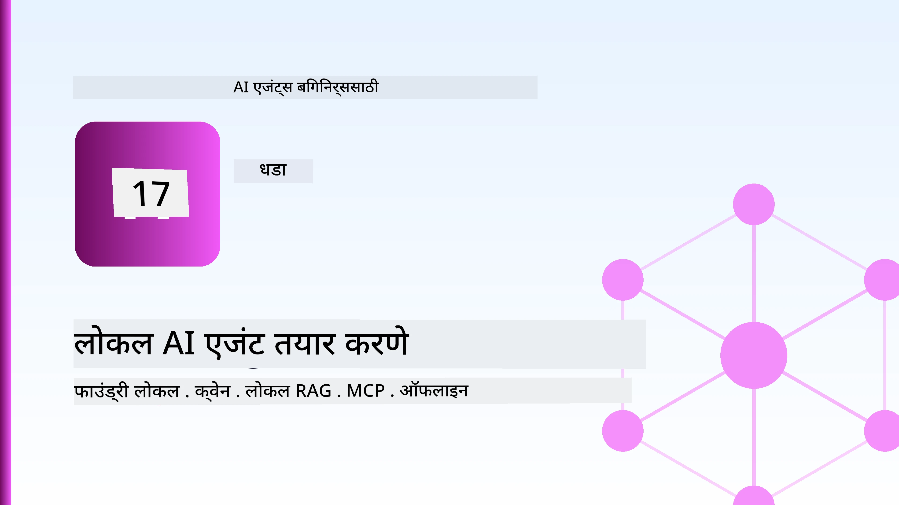
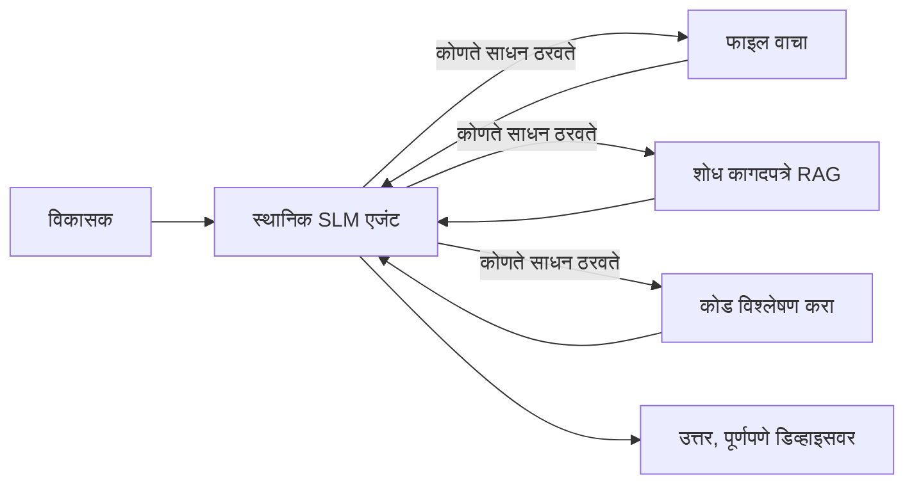
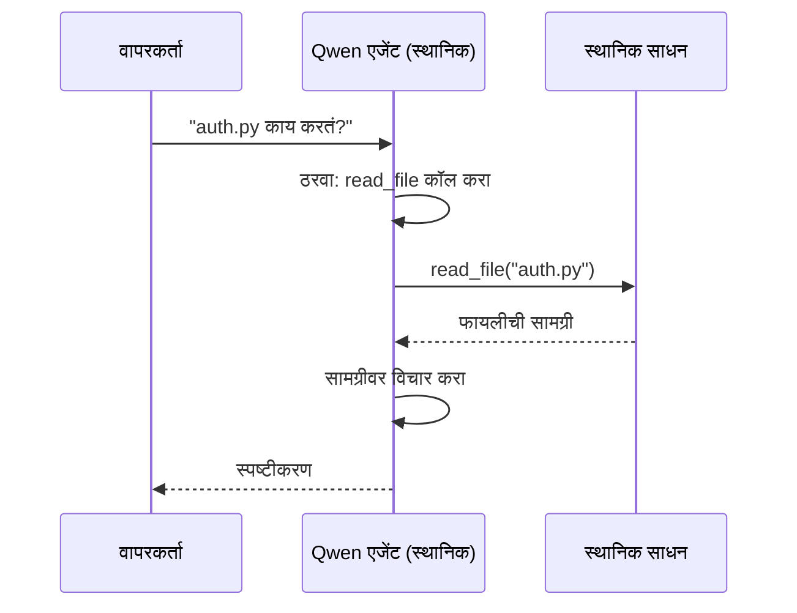
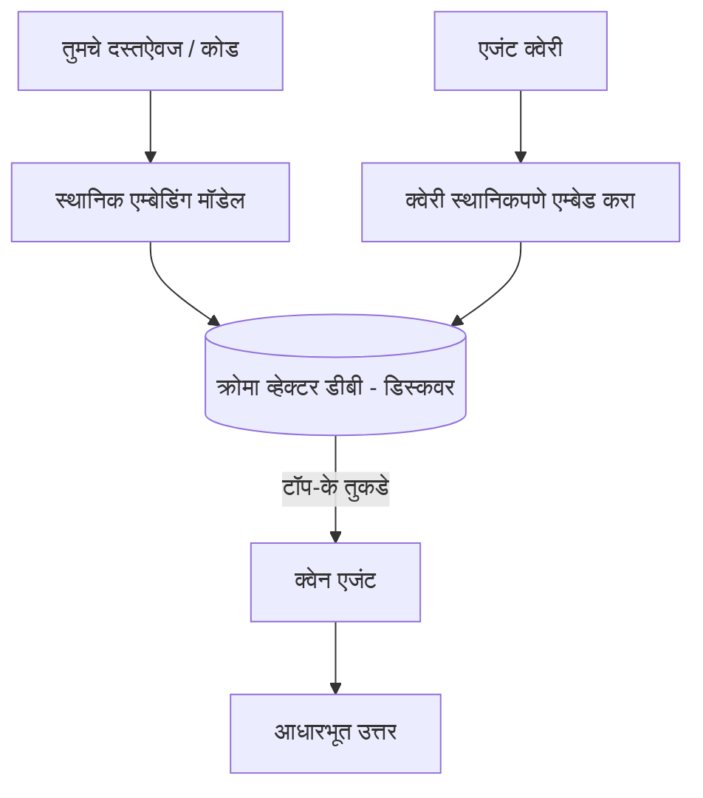
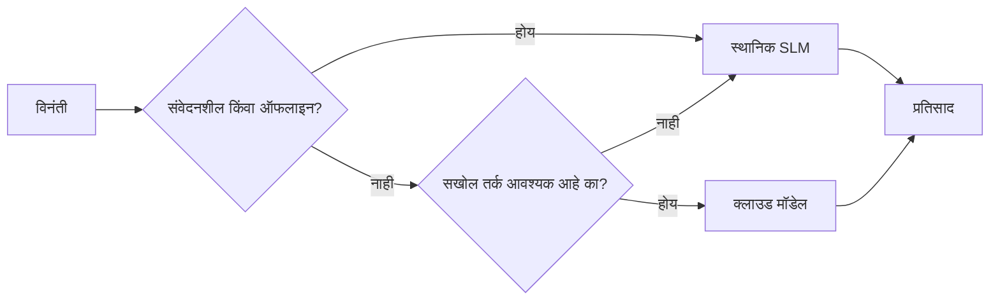

# Microsoft Foundry Local आणि Qwen वापरून स्थानिक AI एजंट तयार करणे



मागील धडा एजंट्सना क्लाउडमध्ये *वाढवला* होता. हा एकतर त्यांना एका एकेरी संगणकावर *कोणत्या* आणतो. शेवटी तुमच्याकडे एक कार्यरत अभियांत्रिकी सहाय्यक असेल जो विचार करू शकतो, साधने कॉल करू शकतो, तुमची फाइल वाचू शकतो आणि तुमची दस्तऐवज शोधू शकतो — **एका पण क्लाउड इनफेरन्स कॉलशिवाय.**

तुम्हाला ते का हवे असेल? मूळ अभियांत्रिकी कामात सतत येणारी तीन कारणे:

- **गोपनीयता.** कोड आणि दस्तऐवज मशीनवरून कधीही बाहेर जात नाहीत. कोणताही प्रॉम्प्ट, कोणताही स्निपेट, कोणतेही ग्राहक डेटा नेटवर्क सीमा ओलांडत नाही.
- **खर्च.** स्थानिक इनफेरन्सवर प्रति-टोकन बिल नाही. तुम्ही पूर्ण दिवस चालू शकता केवळ विजेच्या किंमतीत.
- **ऑफलाइन.** विमानात, सुरक्षित सुविधा मध्ये, किंवा आउटेज दरम्यान एजंट अजूनही कार्यरत आहे.

अडचण अशी आहे की तुम्ही फ्रंटियर क्लाउड मॉडेल बदलून **स्मॉल लँग्वेज मॉडेल (SLM)** चालवत आहात जे तुमच्या CPU, GPU, किंवा NPU वर चालते. हा धडा अशा एजंट तयार करण्याबद्दल आहे जे त्या मर्यादेत चांगले आहेत, मर्यादा नाहीशी असल्यासारखे वागत नाहीत.

## परिचय

हा धडा मोकळा करील:

- **स्मॉल लँग्वेज मॉडेल्स (SLMs)** — काय आहेत, कुठे उत्कृष्ठ आहेत, आणि कुठे नाहीत.
- **Microsoft Foundry Local** — एक रनटाइम जो मॉडेल्स डिव्हाइसवर डाउनलोड आणि सर्व्ह करतो **OpenAI-संगत API** द्वारे.
- **Qwen फंक्शन-कॉलिंग मॉडेल्स** — SLMs जे विश्वसनीयपणे टूल कॉल्स तयार करतात, जे स्थानिक *एजंट्स* (फक्त स्थानिक चॅट नाही) शक्य करतात.
- **स्थानिक साधने, स्थानिक RAG, आणि स्थानिक MCP** — क्लाउडशिवाय एजंटला क्षमता देणे.
- **हायब्रिड पॅटर्न्स** — कधी स्थानिक ठेवायचे आणि कधी क्लाउडकडे जायचे.

## शिक्षणाचे उद्दिष्टे

हा धडा पूर्ण केल्यावर, तुम्हाला माहित असेल की:

- SLMs चे व्यापार आणि योग्य स्थानिक एजंट वापर प्रकरणे कशी निवडायची ते समजवा.
- Foundry Local सह Qwen मॉडेल स्थानिकपणे सर्व्ह करा आणि OpenAI-संगत API द्वारे त्याला कनेक्ट करा.
- पूर्णपणे तुमच्या वर्कस्टेशनवर चालणारा टूल-कॉलिंग एजंट तयार करा.
- स्थानिक वेक्टर डेटाबेस (Chroma) वापरून तुमच्या स्वतःच्या दस्तऐवजांवर स्थानिक RAG जोडा.
- एजंटला स्थानिक MCP सर्व्हरशी जोडा आणि हायब्रिड स्थानिक/क्लाउड डिझाइन्सची मांडणी करा.

## पूर्व आवश्यकताः

हा धडा गृहित धरतो की तुम्ही आधीचे धडे पूर्ण केले आहेत आणि खालील बाबींमध्ये सोप्या आहात:

- [Tool Use](../04-tool-use/README.md) (धडा 4) आणि [Agentic RAG](../05-agentic-rag/README.md) (धडा 5).
- [Agentic Protocols / MCP](../11-agentic-protocols/README.md) (धडा 11).
- [Microsoft Agent Framework](../14-microsoft-agent-framework/README.md) (धडा 14).

तुम्हाला खालील गोष्टींचीही गरज आहे:

- विकासक वर्कस्टेशन. **8 GB RAM हा वास्तविक किमान आहे**; 16 GB+ आरामदायक आहे. GPU किंवा NPU मदत करतात पण आवश्यक नाही.
- **Microsoft Foundry Local** इंस्टॉल झालेले असणे (खालील सेटअप विभाग पहा).
- Python 3.12+ आणि रेपॉजिटरीमधील पॅकेजेस [`requirements.txt`](../../../requirements.txt), तसेच या धड्यासाठी `foundry-local-sdk`, `openai` आणि `chromadb`.

## स्मॉल लँग्वेज मॉडेल्स: स्थानिक कामासाठी योग्य साधन

फ्रंटियर क्लाउड मॉडेलमध्ये शेकडो अब्ज पॅरामीटर्स आणि एका डेटा सेंटरचा आधार असतो. SLM मध्ये कुछ अब्ज पॅरामीटर्स असतात आणि ते तुमच्या लॅपटॉपच्या RAM मध्ये बसतात. हा फरक स्पष्ट अपेक्षा निर्माण करतो.

**SLMs चांगले आहेत:**

- संरचित, मर्यादित कार्ये — वर्गीकरण, एक्स्ट्रॅक्शन, ओळखलेल्या दस्तऐवजांचे सारांश करणे.
- **टूल कॉलिंग** — कोणते फंक्शन कॉल करायचे ते ठरवणे आणि कोणते आर्ग्युमेंट वापरायचे ते.
- तुमच्या स्वतःच्या डेटावर जलद, स्वस्त, खासगी पुनरावृत्ती.

**SLMs कमजोर आहेत:**

- मोठ्या संदर्भावर मुक्त-एन्डेड, मल्टी-हॉप विचार करणे.
- व्यापक जागतिक ज्ञान (ते कमी पाहतात आणि जास्त विसरतात).

म्हणून स्थानिक एजंटसाठी जिंकण्याची रणनीती: **SLM ऑर्केस्ट्रेट करेल आणि साधने महत्त्वाचे काम करतील.** मॉडेलला तुमचा कोडबेस जाणून घेण्याची गरज नाही — फक्त `read_file` आणि `search_docs` कॉल कधी करायचा हे माहित असायला हवे. हे थेट SLM च्या ताकदीशी जुळते.



## Microsoft Foundry Local

**Microsoft Foundry Local** एक हलके रनटाइम आहे जे मॉडेल्स संपूर्णपणे तुमच्या मशीनवर डाउनलोड, व्यवस्थापित आणि सर्व्ह करते. त्याचा मुख्य वैशिष्ट्य म्हणजे तो एक **OpenAI-संगत HTTP एंडपॉइंट** उघडतो — म्हणजे OpenAI SDK आणि Microsoft Agent Framework चे OpenAI क्लायंट `base_url` बदलून वापरू शकतात. एजंट तयार करण्याबाबत जे काही शिकलात ते थेट लागू होते; फक्त एंडपॉइंट क्लाउडवरून `localhost` वर बदलले.

Foundry Local तुमच्या हार्डवेअरला अनुकूल सर्वोत्तम मॉडेल बिल्ड आपोआप निवडतो — CPU बिल्ड, CUDA/GPU बिल्ड किंवा NPU बिल्ड — त्यामुळे तुम्हाला प्रत्येक मशीनसाठी हाताने ऑप्टिमाइझ करावे लागत नाही.

### सेटअप

Foundry Local इंस्टॉल करा (तुमच्या OS साठी [डॉक्युमेंटेशन](https://learn.microsoft.com/azure/ai-foundry/foundry-local/) पहा), नंतर त्याचा कार्यप्रदर्शन तपासा:

```bash
# प्रतिष्ठापित करा (उदाहरणार्थ; आपल्या प्लॅटफॉर्मसाठी डॉक्युमेंट्स अनुसरा)
winget install Microsoft.FoundryLocal      # विंडोज
# brew install microsoft/foundrylocal/foundrylocal   # macOS

# Qwen मॉडेल डाउनलोड करा आणि चालवा, नंतर स्थानिक सेवा सुरू करा
foundry model run qwen2.5-7b-instruct
foundry service status
```

सेवा चालू झाल्यावर तुमच्याकडे स्थानिक OpenAI-संगत एंडपॉइंट (सामान्यतः `http://localhost:PORT/v1`) असेल. नोटबुक `foundry-local-sdk` वापरून एंडपॉइंट आपोआप शोधते, त्यामुळे तुम्हाला पोर्ट हार्डकोड करण्याची गरज नाही.

## Qwen फंक्शन कॉलिंग: का महत्त्वाचा आहे

एजंट एजंटच असतो जर तो साधने कॉल करू शकतो. अनेक SLMs गप्पा मारू शकतात पण अप्रमाणित, त्रुटीपूर्ण टूल कॉल तयार करतात. **Qwen** मॉडेल फंक्शन कॉलिंगसाठी प्रशिक्षण घेतले आहेत आणि सातत्यपूर्ण सुयोग्य टूल कॉल संरचना तयार करतात — हेच स्थानिक चॅट मॉडेल स्थानिक *एजंट* मध्ये परिवर्तित करते.

फ्लो तुम्हाला माहीत असलेल्या सामान्य टूल कॉलिंग लूपप्रमाणेच आहे, फक्त डिव्हाइसवर चालतो:



## स्थानिक RAG

दस्तऐवज शोध येथे स्थानिक एजंटची खरी ताकद आहे. SLM ने तुमचा फ्रेमवर्कचा दस्तऐवज साठवला आहे अशी आशा ठेवण्याऐवजी, तुम्ही ते दस्तऐवज **स्थानिक वेक्टर डेटाबेस** मध्ये एम्बेड करता आणि एजंट त्यातून संबंधित भाग मागवतो.

आम्ही **Chroma** वापरतो, एक एम्बेड केलेला वेक्टर स्टोअर जो प्रक्रियेमध्ये चालतो आणि कोणताही सर्व्हर व्यवस्थापित करणे आवश्यक नाही. संपूर्ण पाइपलाइन स्थानिक आहे: स्थानिक एम्बेडिंग मॉडेल → स्थानिक वेक्टर → स्थानिक पुनरावृत्ती → स्थानिक SLM.



हा धडा 5 मधील Agentic RAG पॅटर्नसारखा आहे — फरक एवढाच की प्रत्येक घटक तुमच्या मशीनवर चालतो.

## स्थानिक MCP सर्व्हर

[MCP](../11-agentic-protocols/README.md) हा एक ट्रान्सपोर्ट आहे, क्लाउड सेवा नाही. MCP सर्व्हर `stdio` वर स्थानिक प्रक्रिये म्हणून चालू शकतो, जे तुम्हाला तुमच्या एजंटला साधने उपलब्ध करून देतो मानक प्रोटोकॉलवरून. त्यामुळे तुम्ही वाढत्या MCP सर्व्हर्सचा लाभ घेऊ शकता — फाइलसिस्टम प्रवेश, git ऑपरेशन्स, डेटाबेस क्वेरीज — पूर्णपणे ऑफलाइन.

सुरक्षात्मक स्थिती क्लाउडपेक्षा वेगळी आहे पण अनुपस्थित नाही: स्थानिक MCP सर्व्हर तुमच्या युजरच्या परवानग्यांवर चालतो, त्यामुळे त्याला काय स्पर्श करता येते ते मर्यादित करा (प्रोजेक्ट डायरेक्टरी, तुमचा संपूर्ण होम फोल्डर नाही) आणि त्याचे आउटपुट्स इनपुट्स प्रमाणे तपासा.

## हायब्रिड क्लाउड-आणि-स्थानिक पॅटर्न्स

स्थानिक-प्रथम म्हणजे फक्त स्थानिक नाही. प्रगत प्रणाली संवेदनशीलतेनुसार आणि कामाच्या कठीणीनुसार मार्गक्रमण करतात:

| परिस्थिती | कुठे चालते |
| --- | --- |
| संवेदनशील कोड / डेटा, किंवा ऑफलाइन | **स्थानिक SLM** |
| सोपे, मर्यादित कार्य | **स्थानिक SLM** (स्वस्त, जलद) |
| कठीण मल्टी-हॉप विचार नॉन-संवेदनशील डेटावर | **क्लाउड मॉडेल** |
| सर्वकाही, आउटेज दरम्यान | **स्थानिक SLM** (सौम्य अपघटन) |

हे धडा 16 मधील **मॉडेल राऊटिंग** कल्पनेचे प्रतिबिंब आहे — फक्त एक "मॉडेल" आता तुमचा स्वतःचा मशीन आहे. एक मजबूत डिझाइन क्लाउड अनुपलब्ध असताना स्थानिकवर परत येते, त्यामुळे एजंट गुणवत्ता कमी होते पण पूर्णपणे अपयशी होत नाही.



## प्रायोगिक प्रयोग: स्थानिक अभियांत्रिकी सहाय्यक

[`code_samples/17-local-agent-foundry-local.ipynb`](./code_samples/17-local-agent-foundry-local.ipynb) उघडा आणि त्यावर काम करा. तुम्ही एक **स्थानिक अभियांत्रिकी सहाय्यक** तयार कराल जो तुमच्या वर्कस्टेशनवर पूर्णपणे चालतो आणि खालील गोष्टी करू शकतो:

1. **साधने कॉल करा** — Foundry Local द्वारे Qwen फंक्शन कॉलिंग वापरून.
2. **स्थानिक फाइल ऑपरेशन्स करा** — प्रोजेक्ट डायरेक्टरीतील फाइल्सची यादी बनवा आणि वाचा.
3. **कोडचे विश्लेषण करा** — स्रोत फाईलवरील मूलभूत मेट्रिक्स रिपोर्ट करा.
4. **दस्तऐवज शोधा** — Chroma सह स्थानिक RAG दस्तऐवज फोल्डरवर.
5. **MCP वापरा** — स्थानिक MCP सर्व्हरशी कनेक्ट करा (जर कॉन्फिगर केलेले नसेल तर सौम्य रीत्या वगळा).

कोणताही क्लाउड इनफेरन्स वापरला जात नाही.

### मार्गदर्शन

सहाय्यक OpenAI-संगत एंडपॉइंटमार्फत Foundry Local शी जोडतो, त्यामुळे एजंट कोड जवळजवळ क्लाउड धड्यांप्रमाणेच दिसतो — फक्त क्लायंट बदलतो:

```python
from foundry_local import FoundryLocalManager
from openai import OpenAI

# फाउंड्री लोकल मॉडेल शोधते/डाउनलोड करते आणि आम्हाला एक स्थानिक एंडपॉइंट देते.
manager = FoundryLocalManager(\"qwen2.5-7b-instruct\")
client = OpenAI(base_url=manager.endpoint, api_key=manager.api_key)  # api_key ही एक स्थानिक प्लेसहोल्डर आहे.
```

साधने सामान्य Python फंक्शन्स आहेत जे प्रोजेक्ट डायरेक्टरीपर्यंत मर्यादित आहेत:

```python
def read_file(path: str) -> str:
    \"\"\"Read a file, but only inside the sandboxed project directory.\"\"\"
    full = (PROJECT_ROOT / path).resolve()
    if PROJECT_ROOT not in full.parents and full != PROJECT_ROOT:
        return \"Access denied: path is outside the project directory.\"
    return full.read_text(encoding=\"utf-8\")
```

सॅंडबॉक्स तपासणी लक्षात घ्या — अगदी स्थानिक असेही, एक अशी साधन जी कोणतेही पाथ वाचते ती जबाबदारी आहे. नोटबुक दर साधनाला एक प्रोजेक्ट रूट पर्यंत मर्यादित ठेवतो.

## ज्ञान तपासणी

असाइनमेंट सुरू करण्यापूर्वी तुमचे समज तपासा.

**1. एजंट स्थानिकपणे चालवण्यामागचे दोन ठोस कारणे सांगा, क्लाउडमध्ये नाही.**

<details>
<summary>उत्तर</summary>

कोणतेही दोन: **गोपनीयता** (कोड आणि डेटा मशीनला कधीही बाहेर जात नाही), **खर्च** (प्रति-टोकन इनफेरन्स बिल नाही), आणि **ऑफलाइन क्षमता** (नेटवर्कशिवाय कार्य करते — विमानात, सुरक्षित सुविधेत किंवा आउटेज दरम्यान). नियमांचे/अनुकरणाची अडचणी जे डेटा डिव्हाइसमधून पाठवण्यास मनाही करतात, गोपनीयतेचे सामान्य कारण आहे.
</details>

**2. SLM आणि त्याच्या साधनांमध्ये स्थानिक एजंटमध्ये श्रमाचे शिफारस केलेले विभागणी काय आहे, आणि का?**

<details>
<summary>उत्तर</summary>

SLM **ऑर्केस्ट्रेट करेल** (कोणते साधन कॉल करायचे आणि कोणते आर्ग्युमेंट वापरायचे ठरवेल) आणि **साधने महत्त्वाचे काम करतील** (फाइल्स वाचणे, दस्तऐवज मिळवणे, निकालांची गणना करणे). SLMs साधनांच्या निवडीत मोठ्या निर्णयांमध्ये ताकदवान पण व्यापक ज्ञान आणि लांब कोप-कोप विचारात कमी सामर्थ्यवान आहेत, त्यामुळे साधनांवर अवलंबून राहणे त्यांना सशक्त करते.
</details>

**3. Foundry Local सह क्लाउड एजंट कोड पुन्हा वापरणे शक्य काय करते?**

<details>
<summary>उत्तर</summary>

Foundry Local एक **OpenAI-संगत HTTP एंडपॉइंट** उघडतो. OpenAI SDK आणि एजंट फ्रेमवर्कचा OpenAI क्लायंट फक्त `base_url` (आणि स्थानिक प्लेसहोल्डर API की वापरून) बदलून याचा वापर करतात. एजंट कोडचे इतर सर्व काही सारखेच राहते.
</details>

**4. आम्ही कोणतेही SLM न घेता विशेषतः Qwen फंक्शन-कॉलिंग मॉडेल का वापरतो?**

<details>
<summary>उत्तर</summary>

कारण एजंटला विश्वसनीय, सुयोग्य **टूल कॉल्स** तयार करणे आवश्यक आहे. अनेक SLMs गप्पा मारू शकतात पण चुकीचा किंवा असमरस टूल कॉल स्ट्रक्चर्स बनवतात. Qwen मॉडेल्स फंक्शन कॉलिंगसाठी प्रशिक्षण घेतात आणि सातत्यपूर्ण टूल कॉल तयार करतात, ज्यामुळे स्थानिक चॅट मॉडेल कार्यरत स्थानिक एजंट बनते.
</details>

**5. स्थानिक RAG पाइपलाइनमध्ये, कोणकोणते घटक मशीनवर चालतात?**

<details>
<summary>उत्तर</summary>

सर्वच: एम्बेडिंग मॉडेल, वेक्टर डेटाबेस (Chroma, डिस्कवर), पुनरावृत्ती चरण, आणि SLM. दस्तऐवज स्थानिकपणे एम्बेड केले जातात, स्थानिकपणे संग्रहित केले जातात, स्थानिकपणे पुनःप्राप्त केले जातात, आणि स्थानिक मॉडेलवर विचार केला जातो — कोणताही घटक क्लाउड स्पर्श करत नाही.
</details>

**6. स्थानिक MCP सर्व्हर तुमच्या मशीनवर चालतो. त्यामुळे तो आपोआप सुरक्षित होतो का? तुम्ही कोणती दक्षता घ्यायला हवी?**

<details>
<summary>उत्तर</summary>

नाही. स्थानिक MCP सर्व्हर तुमच्या युजरच्या परवानग्यांवर चालतो, त्यामुळे ते तुमच्या ज्या गोष्टीत हात घालू शकतो तोच स्पर्श करू शकतो. त्याला आवश्यक त्या मर्यादित ठेवा (उदाहरणार्थ, एकाच प्रोजेक्ट डायरेक्टरी, संपूर्ण होम फोल्डर नाही) आणि त्याचे आउटपुट इनपुट प्रमाणे तपासा अगोदर उपयोग करताना.
</details>

**7. स्थानिक मॉडेलचा समावेश असलेला समंजस हायब्रिड राऊटिंग नियम सांगा.**

<details>
<summary>उत्तर</summary>

संवेदनशील किंवा ऑफलाइन विनंत्या स्थानिक SLM कडे पाठवा; सोपे मर्यादित कार्य जलद आणि स्वस्त म्हणून स्थानिक SLM कडे; कठीण मल्टी-हॉप विचार नॉन-संवेदनशील डेटावर क्लाउड मॉडेल कडे; आणि क्लाउड अनुपलब्ध असल्यास स्थानिक SLM कडे परत जा म्हणजे एजंट सौम्य रित्या कमी गुणवत्ता होतो, पूर्णपणे अपयशी होत नाही. हा मॉडेल राऊटिंग (धडा 16) आहे जिथे स्थानिक मशीन एक मॉडेल आहे.
</details>

**8. या धड्यातील स्थानिक एजंट चालविण्यासाठी वास्तववादी किमान RAM आकडा काय आहे, आणि अधिक RAM तुम्हाला काय देतो?**

<details>
<summary>उत्तर</summary>

सुमारे **8 GB** हा वास्तविक किमान आहे; 16 GB+ आरामदायक आहे. अधिक RAM तुम्हाला मोठ्या, अधिक सक्षम मॉडेल चालवायला आणि अधिक संदर्भ स्मरणात ठेवायला मदत करतो. GPU किंवा NPU इनफेरन्स वेगाने करतात पण आवश्यक नाही — Foundry Local जेव्हा कोणताही एक्सेलेरेटर उपलब्ध नाही तेव्हा CPU बिल्ड निवडतो.
</details>

## असाइनमेंट

स्थानिक अभियांत्रिकी सहाय्यकाला विस्तारित करा **स्थानिक दस्तऐवज पुनरावलोकक** मध्ये तुमच्या मनाप्रमाणे लहान प्रोजेक्टसाठी (या रेपोतील कोणत्याही धड्याच्या फोल्डरचा वापर करा).

तुमचे सबमिशन असावे:

1. खराखुरा दस्तऐवज/कोड फोल्डर Chroma मध्ये अनुक्रमित करा (किमान पाच फाइल्स).
2. `find_todos` साधन जोडा जे प्रोजेक्टमधील `TODO`/`FIXME` टिप्पणी शोधतो आणि फाइल व लाइन नंबरसह परत करतो — `read_file` सारखा सॅंडबॉक्स तपासणी ठेवून.

3. **एजंटला तीन प्रश्न विचारा** जे त्याला साधने एकत्र करण्यास भाग पाडतील: एक पूर्ण RAG प्रश्न, एक ज्यासाठी विशिष्ट फाईल वाचणे आवश्यक आहे, आणि एक ज्यासाठी TODOs शोधणे आवश्यक आहे.
4. **त्याचे मापन करा**: तीन प्रतिसादांच्या प्रत्येकासाठी वेळ नोंदवा आणि ते markdown सेलमध्ये नमूद करा. आपल्या अपेक्षित कार्यप्रवाहासाठी विलंब स्वीकार्य आहे का ते टिपा.

नंतर एक लहान परिच्छेद लिहा की **आपण या पुनरावलोकनासाठी काय क्लाउडमध्ये हलवाल आणि काय स्थानिक ठेवाल**, आणि का. आपले मूल्यांकन स्थानिक घटक योग्यरित्या कसे जोडलेले आहेत आणि आपले संकरित विचारप्रणाली सुसंगत आहे की नाही यावर होते — मॉडेल गुणवत्ता नाही.

## सारांश

या धड्यात आपण असा एजंट तयार केला जो पूर्णपणे आपल्या स्वत:च्या संगणकावर चालतो:

- **SLMs** गोपनीयता, खर्च, आणि ऑफलाइन ऑपरेशनसाठी विस्तार trade करतात — आणि जेव्हा ते स्वतः सर्व ज्ञान वाहत नाहीत तर **साधने संयोजीत करतात** तेव्हा ते चमकतात.
- **Foundry Local** मॉडेल्सना उपकरणावर **OpenAI-सुसंगत एंडपॉइंट**च्या मागे सेवा देतो, त्यामुळे आपला क्लाउड एजंट कोड एका ओळीच्या बदलाने हस्तांतरित होतो.
- **Qwen फंक्शन-कॉलिंग मॉडेल्स** विश्वसनीय स्थानिक साधन कॉलिंग – आणि त्यामुळे स्थानिक *एजंट्स* – शक्य करतात.
- **स्थानिक RAG** (Chroma) आणि **स्थानिक MCP** एजंटला संगणक सोडता कार्यक्षमतेसाठी देतात.
- **संकरित नमुने** आपल्याला संवेदनशीलता आणि कठीणीनुसार मार्गदर्शन करण्यास परवानगी देतात, स्थानिक एक नाजूक पर्याय म्हणून.

यामुळे तैनातीचा प्रवास पूर्ण होतो: धडा 16 मध्ये एजंट्स Microsoft Foundry मध्ये वाढवण्यात आले, आणि हा धडा त्यांना एका कार्यस्थानावर कमी करतो. पुढचा धडा तैनात एजंट्स सुरक्षित ठेवण्यावर लक्ष केंद्रित करतो.

## अतिरिक्त संसाधने

- <a href="https://learn.microsoft.com/azure/ai-foundry/foundry-local/" target="_blank">Microsoft Foundry Local माहितीपत्रक</a>
- <a href="https://learn.microsoft.com/azure/ai-foundry/what-is-azure-ai-foundry" target="_blank">Microsoft Foundry माहितीपत्रक</a>
- <a href="https://learn.microsoft.com/en-us/agent-framework/overview/?wt.mc_id=youtube_26688_organicsocial_reactor&pivots=programming-language-python" target="_blank">Microsoft एजंट फ्रेमवर्क</a>
- <a href="https://qwen.readthedocs.io/en/latest/framework/function_call.html" target="_blank">Qwen फंक्शन कॉलिंग माहितीपत्रक</a>
- <a href="https://modelcontextprotocol.io/" target="_blank">मॉडेल संदर्भ प्रोटोकॉल (MCP)</a>
- <a href="https://docs.trychroma.com/" target="_blank">Chroma व्हेक्टर डेटाबेस</a>

## मागील धडा

[स्केलेबल एजंट्स तैनात करणे](../16-deploying-scalable-agents/README.md)

## पुढील धडा

[AI एजंट्स सुरक्षित करणे](../18-securing-ai-agents/README.md)

---

<!-- CO-OP TRANSLATOR DISCLAIMER START -->
**अस्वीकरण**:
हा दस्तऐवज AI भाषांतर सेवा [Co-op Translator](https://github.com/Azure/co-op-translator) चा वापर करून अनुवादित केला आहे. जरी आम्ही अचूकतेसाठी प्रयत्न करतो, तरी कृपया लक्षात घ्या की स्वयंचलित भाषांतरांमध्ये त्रुटी किंवा अचूकतेची कमतरता असू शकते. मूळ दस्तऐवज त्याच्या मूळ भाषेत अधिकृत स्रोत मानला पाहिजे. महत्त्वाची माहिती असल्यास, व्यावसायिक मानवी भाषांतराची शिफारस केली जाते. या भाषांतराच्या वापरामुळे उद्भवणाऱ्या कोणत्याही गैरसमज किंवा चुकीच्या अर्थलावणीसाठी आम्ही जबाबदार नाही.
<!-- CO-OP TRANSLATOR DISCLAIMER END -->