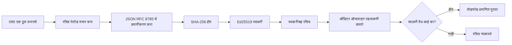
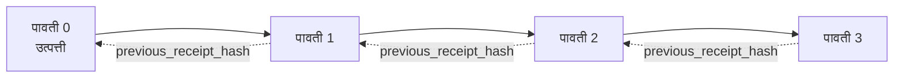

[धडा व्हिडिओ पहा: क्रिप्टोग्राफिक रसीदांसह AI एजंट सुरक्षित करणे](https://youtu.be/PLACEHOLDER_VIDEO_ID)

> _(धडा व्हिडिओ आणि थंबनेल Microsoft सामग्री टीमद्वारे विलीन झाल्यानंतर जोडले जातील, धडा 14 / 15 च्या नमुन्याशी सुसंगत.)_

# क्रिप्टोग्राफिक रसीदांसह AI एजंट सुरक्षित करणे

## परिचय

हा धडा खालील विषयांचा समावेश करेल:

- अनुपालन, डीबगिंग, आणि विश्वासासाठी AI एजंटसाठी ऑडिट ट्रेल का महत्वाचे आहेत.
- क्रिप्टोग्राफिक रसीद म्हणजे काय आणि ती असह्य स्वाक्षरी नसलेल्या लॉग ओळींपेक्षा कशी वेगळी आहे.
- एक एजंटच्या टूल कॉलसाठी स्वाक्षरी केलेली रसीद साध्या पाइथन मध्ये कशी तयार करायची.
- रसीद ऑफलाइन कशी पडताळायची आणि छेडछाड कशी ओळखायची.
- रसीद कशा प्रकारे साखळीबद्ध करायची ज्यामुळे एखादी काढल्यास किंवा पुनर्रचना केल्यास साखळी खंडित होते.
- रसीद काय सिद्ध करतात आणि काय स्पष्टपणे सिद्ध करत नाहीत.

## शिक्षण उद्दिष्टे

हा धडा पूर्ण केल्यावर, तुम्हाला माहित असेल की:

- एजंट क्रियांकरिता क्रिप्टोग्राफिक प्रमाणपत्रासाठी प्रेरित अपयशाचे प्रकार ओळखणे.
- एक Canonical JSON पेलोडवर Ed25519 स्वाक्षरी केलेली रसीद तयार करणे.
- फक्त स्वाक्षरी करणाऱ्याच्या सार्वजनिक कीचा वापर करून स्वतंत्रपणे रसीद पडताळणे.
- सुधारित रसीदवर पुनःपडताळणी करून छेडछाड ओळखणे.
- रसीदांची हॅश-साखळी तयार करणे आणि साखळी का महत्त्वाची आहे हे समजावणे.
- रसीद काय सिद्ध करतात (मालकी, अखंडता, क्रमवारी) आणि काय सिद्ध करत नाहीत (क्रियेसंबंधी बरोबरी, धोरणाचा साउंडनेस) यातील सीमा ओळखणे.

## समस्या: तुमच्या एजंटचा ऑडिट ट्रेल

समजा तुम्ही Contoso Travel साठी AI एजंट तैनात केला आहे. एजंट ग्राहक विनंत्या वाचतो, एक फलाईट API कॉल करतो, आणि ग्राहकाच्या वतीने आसनांची नोंदणी करतो. मागील तिमाहीत, एजंटने 50,000 बुकिंग्स प्रक्रियेत आणले.

आज एक ऑडिटर येतो. तो एक सोपा प्रश्न विचारतो: "तुमचा एजंट काय केला ते दाखवा."

तुम्ही लॉग फायली देत आहात. ऑडिटर त्यांना पाहतो आणि कठीण प्रश्न विचारतो: "मी कसं जाणून घेऊ की हे लॉग्स संपादित केलेले नाहीत?"

ही ऑडिट-ट्रेल समस्या आहे. आजच्या अनेक एजंट तैनाती खालीलवर अवलंबून असतात:

- **अॅप्लिकेशन लॉग्स**: एजंटने स्वतः लिहलेले, फाइल-सिस्टम प्रवेश असलेल्या कोणालाही संपादित करता येणारे.
- **क्लाउड लॉगिंग सेवा**: प्लॅटफॉर्म स्तरावर छेडछाड दिसते, पण केवळ ऑडिटर प्लॅटफॉर्म ऑपरेटरवर विश्वास ठेवल्यास.
- **डेटाबेस ट्रान्झॅक्शन लॉग्स**: डेटाबेस बदलांसाठी योग्य, पण मनमानी टूल कॉलसाठी नाहीत.

हेपैकी कोणतेही ऑडिटरचा प्रश्न उत्तरे देऊ शकत नाहीत जोपर्यंत ऑडिटर तुम्हाला (तुमच्यावर, तुमच्या क्लाउड प्रदात्यावर, तुमच्या डेटाबेस विक्रेत्यावर) विश्वास ठेवत नाही. अंतर्गत वापरासाठी, तो विश्वास सहसा स्वीकार्य असतो. नियमन केलेल्या कामांसाठी (वित्त, आरोग्यसेवा, EU AI कायद्यांतर्गत काहीही), तो स्वीकार्य नाही.

क्रिप्टोग्राफिक रसीद ही समस्या सुटवते कारण ती प्रत्येक एजंट क्रिया स्वतंत्रपणे पडताळणीयोग्य करते. ऑडिटरला तुमच्यावर विश्वास ठेवण्याची गरज नाही. त्यांना फक्त तुमची सार्वजनिक की आणि रसीद हवी.

## क्रिप्टोग्राफिक रसीद म्हणजे काय?

रसीद म्हणजे JSON ऑब्जेक्ट जो एजंटने काय केले ते नोंदवितो, आणि डिजिटल स्वाक्षरीने स्वाक्षरी केलेला.



एक किमान रसीद अशी दिसते:

```json
{
  "type": "agent.tool_call.v1",
  "agent_id": "contoso-travel-bot",
  "tool_name": "lookup_flights",
  "tool_args_hash": "sha256:a3f9c1...",
  "result_hash": "sha256:7b2e1d...",
  "policy_id": "contoso-travel-policy-v3",
  "timestamp": "2026-04-25T14:30:00Z",
  "sequence": 47,
  "previous_receipt_hash": "sha256:9d4e6a...",
  "signature": {
    "alg": "EdDSA",
    "sig": "c5af83...",
    "public_key": "8f3b2c..."
  }
}
```

तीन गुणधर्म काम करतात:

1. **स्वाक्षरी**. रसीद एजंटच्या गेटवेने Ed25519 खाजगी कीने स्वाक्षरी केली आहे. सार्वजनिक की असलेला कोणताही व्यक्ती ऑफलाइन स्वाक्षरी पडताळू शकतो. कोणत्याही क्षेत्रात छेडछाड केल्यास स्वाक्षरी अमान्य होते.

2. **कॅनॉनिकल एन्कोडिंग**. स्वाक्षरीपूर्वी, रसीद JSON Canonicalization Scheme (JCS, RFC 8785) वापरून सिरीअलाइझ केली जाते. हे दोन वेगवेगळे अमलकारक एकच तात्त्विक रसीद तयार करताना बाइट-ओळखीचे आउटपुट तयार करतात याची खात्री देते. कॅनॉनिकलाइझेशनशिवाय, भिन्न JSON सिरीअलायझरने वेगवेगळ्या सामग्रीसाठी वेगवेगळ्या स्वाक्षऱ्या तयार केल्या असतील.

3. **हॅश साखळी**. `previous_receipt_hash` फील्ड प्रत्येक रसीद मागील रसीदमध्ये लिंक करते. एक रसीद काढल्यास किंवा पुनर्रचनेमुळे त्या नंतरच्या प्रत्येक रसीदीची साखळी फुगते. व्यक्तिगत स्वाक्षऱ्यांवरही छेडछाड लपवली तरी साखळी स्तरावर दिसून येते.

एकत्र या गुणधर्म तीन हमी देतात:

- **मालकी**: या कीने हे सामग्री स्वाक्षरी केली.
- **अखंडता**: स्वाक्षरीपासून सामग्रीत बदल झाला नाही.
- **क्रमवारी**: ही रसीद साखळीतील ती रसीद नंतर आली.

## पाइथनमध्ये रसीद तयार करणे

रसीद तयार करण्यासाठी तुम्हाला कोणतीही विशेष लायब्ररी आवश्यक नाही. क्रिप्टोग्राफिक प्राथमिक घटक प्रचंड उपलब्ध आहेत आणि लॉजिक काही दहा-पंक्तींचे पाइथनमध्ये आहे.

`code_samples/18-signed-receipts.ipynb` मधील हातमोकळे सराव संपूर्ण प्रवाह दाखवितात. संक्षिप्त आवृत्ती:

```python
import json
import hashlib
import base64
from nacl import signing
from jcs import canonicalize  # RFC 8785 कॅनॉनिकल JSON

def b64url_nopad(data: bytes) -> str:
    return base64.urlsafe_b64encode(data).decode("ascii").rstrip("=")

def sha256_canonical(obj) -> str:
    """SHA-256 of a Python object's JCS-canonical JSON form."""
    return f"sha256:{hashlib.sha256(canonicalize(obj)).hexdigest()}"

# स्वाक्षरी करण्याची की तयार करा किंवा लोड करा (उत्पादनात, की वॉल्टमध्ये संग्रहित करा)
signing_key = signing.SigningKey.generate()
verify_key = signing_key.verify_key

# पावतीचे पेलोड तयार करा (अजून स्वाक्षरी नाही)
tool_args = {"origin": "SYD", "destination": "LAX"}
tool_result = [{"flight": "QF11", "price": 1850, "stops": 0}]

payload = {
    "type": "agent.tool_call.v1",
    "agent_id": "contoso-travel-bot",
    "tool_name": "lookup_flights",
    "tool_args_hash": sha256_canonical(tool_args),
    "result_hash": sha256_canonical(tool_result),
    "policy_id": "contoso-travel-policy-v3",
    "timestamp": "2026-04-25T14:30:00Z",
    "sequence": 0,
    "previous_receipt_hash": None,
}

# कॅनॉनिकल करा, हॅश करा, स्वाक्षरी करा.
canonical_bytes = canonicalize(payload)
message_hash = hashlib.sha256(canonical_bytes).digest()
signature_bytes = signing_key.sign(message_hash).signature

# संरचित स्वाक्षरी वस्तू जोडा.
receipt = {
    **payload,
    "signature": {
        "alg": "EdDSA",
        "sig": b64url_nopad(signature_bytes),
        "public_key": b64url_nopad(bytes(verify_key)),
    },
}
```

ही संपूर्ण स्वाक्षरी पाइपलाईन आहे. नोटबुकमध्ये प्रत्येक चरणावर सविस्तर चर्चा केली आहे.

## रसीद पडताळणे आणि छेडछाड शोधणे

पडताळणी ही उलट प्रक्रिया आहे:

```python
import base64
import hashlib
from nacl import signing
from nacl.exceptions import BadSignatureError
from jcs import canonicalize

def b64url_decode(s: str) -> bytes:
    padding = "=" * ((4 - len(s) % 4) % 4)
    return base64.urlsafe_b64decode(s + padding)

def verify_receipt(receipt: dict) -> bool:
    # स्वाक्षरी ही एक रचनेतली वस्तू आहे: {"alg", "sig", "public_key"}.
    sig_obj = receipt.get("signature")
    if not sig_obj or sig_obj.get("alg") != "EdDSA":
        return False

    # प्रत्यक्ष स्वाक्षरी केली गेलेली पेलोड पुनर्निर्मित करा (स्वाक्षरी वगळून सर्व काही).
    payload = {k: v for k, v in receipt.items() if k != "signature"}

    canonical_bytes = canonicalize(payload)
    message_hash = hashlib.sha256(canonical_bytes).digest()

    try:
        verify_key = signing.VerifyKey(b64url_decode(sig_obj["public_key"]))
        verify_key.verify(message_hash, b64url_decode(sig_obj["sig"]))
        return True
    except BadSignatureError:
        return False
```

ही फंक्शन रसीद घेते आणि स्वाक्षरी वैध असल्यास `True` परत करते, अन्यथा `False`. कोणताही नेटवर्क कॉल, सेवा अवलंबित्व नाही, तृतीय पक्षावर कोणताही विश्वास आवश्यक नाही.

छेडछाड शोधण्याचा प्रत्यक्ष अनुभव घेण्यासाठी नोटबुकमध्ये पुढील गोष्टी करतात:

1. वैध रसीद तयार करणे आणि पडताळण्याची पुष्टी करणे.
2. `tool_args_hash` फील्डच्या एका बाइटमध्ये बदल करणे.
3. पडताळणी पुन्हा चालवणे आणि अपयशी होण्याचे पाहणे.

ही प्रत्यक्ष नमूद करणारी गोष्ट आहे की रसीद छेडछाड-दर्शक आहेत: कोणतीही थोडी छेडछाड स्वाक्षरी मोडते.

## मल्टि-स्टेप एजंटसाठी रसीद साखळी करणे

एक एकट्या स्वाक्षरी केलेल्या रसीदीने एक क्रिया संरक्षित केली जाते. रसीदांची साखळी एक अनुक्रम संरक्षित करते.



प्रत्येक रसीद पूर्वीच्या रसीदचा हॅश नोंदवतो. जर एखाद्या आक्रमकाने साखळीतील दुसऱ्या रसीदीचे कोणी आवाज न काढता वगळले, तर त्याला खालीपैकी एक करावे लागेल:

- रसीद 3 चा `previous_receipt_hash` फील्ड बदलणे (रसीद 3 ची स्वाक्षरी फोडते), किंवा
- सुधारीत रसीद 3 वर नवीन स्वाक्षरी बनवणे (एजंटची खाजगी की आवश्यक).

जर खाजगी की हार्डवेअर की वॉल्टमध्ये असेल आणि तुम्ही प्रत्येक रसीदसह सार्वजनिक की प्रकाशित करत असाल, तर कोणताही हल्ला लपवता येत नाही.

नोटबुकमध्ये खालील गोष्टी दाखविल्या आहेत:

1. तीन रसीदींची साखळी तयार करणे.
2. प्रत्येक रसीदीच्या `previous_receipt_hash` ची खरी मागील रसीदीच्या हॅशशी जुळणी पडताळणे.
3. मधल्या कोणत्यातरी रसीदसह छेडछाड करणे आणि साखळी त्या ठिकाणी तुटल्याचे पाहणे.

अशा प्रकारे तुम्ही असा ऑडिट ट्रेल तयार करता जो बाह्य ऑडिटर स्वायत्तपणे पडताळू शकतो.

## रसीद काय सिद्ध करतात (आणि काय नाहीत)

हा धडा यातील सर्वात महत्त्वाचा भाग आहे. रसीद शक्तिशाली आहेत पण त्यांची शक्ती मर्यादित आहे.

**रसीद तीन गोष्टी सिद्ध करतात:**

1. **मालकी**: विशिष्ट कीने विशिष्ट पेलोडवर स्वाक्षरी केली.
2. **अखंडता**: पेलोड स्वाक्षरीनंतर बदललेला नाही.
3. **क्रमवारी**: ही रसीद त्या साखळीतील त्या रसीद नंतर आली.

**रसीद काय सिद्ध करत नाहीत:**

1. **योग्यता**: एजंटची क्रिया बरोबर होती का नाही. चुकीच्या उत्तरासाठी स्वच्छपणे स्वाक्षरी करता येते.
2. **धोरण अनुपालन**: `policy_id` मधील धोरण खरोखरच मूल्यांकन झाले किंवा तपासले असते तरच परवानगी दिली गेली काय? रसीद नेमकं काय दावा केला ते नोंदवते, काय लागू केले गेले नाही.
3. **कीव्यतिरिक्त ओळख**: रसीद म्हणते "ही कीने ही सामग्री स्वाक्षरी केली." ही रसीद "हा माणूस प्रमाणीकृत आहे" असे नाही म्हणते. की आणि व्यक्ती/संस्थेचा संबंध वेगळ्या ओळखीच्या पायाभूत सुविधेद्वारे करावा लागतो (डायरेक्टरी, सार्वजनिक की नोंदणी, इ.).
4. **इनपुट्सची सत्यता**: एजंट जर गुणवत्ताहीन प्रॉम्प्ट घेऊन त्यावर प्रक्रिया केली, तरी रसीद क्रियाकलाप निष्ठेने नोंदवते. रसीद इनपुट व्हॅलिडेशनचे पर्याय नाहीत, फक्त पुढील टप्प्यावर असतात.

ही सीमा दोन कारणांसाठी महत्वाची आहे:

- रसीद कोणत्या गोष्टींसाठी उपयुक्त आहेत ते सांगते: एजंट क्रिया ऑडिटयोग्य व छेडछाड-दर्शक बनवणे, अगदी संघटनात्मक सीमा ओलांडूनही.
- तुम्हाला अजून काय स्तरांची गरज आहे ते सांगते: इनपुट व्हॅलिडेशन (धडा 6), धोरण अंमलबजावणी (थोडक्यात खाली), व ओळख व्यवस्था (या धड्यात नाही).

एक सामान्य समजुतीची चूक: "आपल्याकडे रसीद आहेत म्हणजे आपल्यावर शासन आहे." खरे नाही. रसीद ही फक्त पाया आहे. शासन हा वर बांधलेला सिस्टीम आहे.

## उत्पादन संदर्भ

या धड्यातील पाइथन कोड जाणून घेण्यासाठी कमी आणि सुलभ ठेवले आहेत. उत्पादनात तुमच्याकडे दोन पर्याय आहेत:

1. **क्रिप्टोग्राफिक घटक वर थेट काम करा.** वरील 50 ओळी अनेक उपयोगांसाठी पुरेश्या आहेत. PyNaCl (Ed25519) आणि `jcs` पॅकेज (कॅनॉनिकल JSON) हे चांगल्या प्रकारे राखणी व ऑडिटेड लायब्रऱ्या आहेत.

2. **उत्पादनासाठी रसीद लायब्ररी वापरा.** अनेक मुक्त स्रोत प्रकल्प तेच नमुना अतिरिक्त वैशिष्ट्यांसह अंमलात आणतात (की रोटेशन, बॅच पडताळणी, JWK सेट वितरण, धोरण इंजिनसह एकत्रीकरण):
   - या धड्यात वापरलेली रसीद स्वरूप IETF इंटरनेट-ड्राफ्ट (`draft-farley-acta-signed-receipts`) आहे जी सध्या मानक प्रक्रियेत आहे.
   - Microsoft Agent Governance Toolkit रसीदांबरोबर Cedar-आधारित धोरण निर्णय संयोजित करते; त्या निर्गमातील ट्यूटोरियल 33 मध्ये एक एंड-टू-एंड उदाहरण पाहा.
   - `protect-mcp` (npm) आणि `@veritasacta/verify` (npm) पॅकेजेस रसीद साइनिंग व ऑफलाइन पडताळणीसाठी Node-आधारित अंमलबजावणी देतात, कोणत्याही MCP सर्व्हरवर छेडछाड-प्रतिबंधक ऑडिट ट्रेल देण्यासाठी.
   - **[nobulex](https://github.com/arian-gogani/nobulex)** पाइथन SDK (`pip install nobulex`) पाइथनमध्ये Ed25519 + JCS साइनिंग नमुना देतो, LangChain व CrewAI समाकलनांसह, प्रसिद्ध क्रॉस-व्हॅलिडेशन टेस्ट व्हेक्टर व @OWASP PR #2210 द्वारे योगदान केलेला अनुपालन मॅपिंग.

स्वतः तयार करणे किंवा लायब्ररी वापरण्याचा निर्णय याला प्रत्येकी फायदा व तोटे आहेत: वेळ वाचवणारी लायब्ररी, तुमचा वेळ व क्षेत्र कमी करणारी, पण तुम्हाला प्रत्येक घटक समजावून घेण्यासाठी स्वतः कोड लिहिणे आवश्यक. हा धडा स्वतःपासून मार्ग शिकवतो जेणेकरून तुम्हाला कोणताही पर्याय सहज वापरता येईल.

## ज्ञान तपासणी

सराव करण्यापूर्वी तुमचे समज तपासा.

**1. एक रसीद एजंटच्या खाजगी Ed25519 कीने स्वाक्षरी केली जाते. ऑडिटरकडे फक्त सार्वजनिक की आहे. ऑडिटर रसीद ऑफलाइन पडताळू शकतो का?**

<details>
<summary>उत्तर</summary>

होय. Ed25519 पडताळणीला फक्त सार्वजनिक की आणि स्वाक्षरी केलेले बाइट्स लागतात. कोणताही नेटवर्क कॉल, सेवा अवलंबित्व नाही. हेच वैशिष्ट्य रसीदांना एअर-गॅप्ड, मल्टि-ऑरगनायझेशन, कमी विश्वास असलेल्या ऑडिट सेटिंगमध्ये उपयुक्त बनवते.
</details>

**2. एखाद्या हल्लेखोराने रसीदमधील `policy_id` फील्ड बदलून ती अधिक आरामशीर धोरणाखाली असल्याचा दावा केला. स्वाक्षरी मूळ पेलोडवर होती. पडताळणी दरम्यान काय होते?**

<details>
<summary>उत्तर</summary>

पडताळणी अपयशी होते. स्वाक्षरी मूळ पेलोडच्या कॅनॉनिकल बाईट्सवर केली गेली होती; कोणताही बदल कॅनॉनिकल बाईट्स बदलतो, SHA-256 हॅश बदलतो, ज्यामुळे स्वाक्षरी अमान्य होते. हल्लेखोराला नवीन वैध स्वाक्षरी बनवण्यासाठी खाजगी की आवश्यक आहे, जी त्याच्याकडे नाही.
</details>

**3. `tool_args_hash` आणि `result_hash` याऐवजी थेट आर्ग्युमेंट्स आणि परिणाम न लावण्याची कारणं काय?**

<details>
<summary>उत्तर</summary>

दोन कारणांसाठी. प्रथम, रसीद संग्रहित करायची किंवा प्रसारित करायची असताना रॉ सामग्री (PII, व्यवसाय डेटा) लीक होण्यापासून संरक्षण हवे असते. हॅशिंग रसीद लहान ठेवते आणि सामग्री गोपनीय ठेवते; ऑडिटर वेगळे संग्रहित मूळ सामग्रीशी हॅश जुळवून पडताळणी करतो. दुसरे, हॅशचा आकार निश्चित असतो; इनपुट आणि आउटपुट कितीही मोठे असले तरी हॅशयुक्त रसीद आकाराने निश्चित आहे.
</details>

**4. `previous_receipt_hash` फील्ड प्रत्येक रसीदला तिच्या मागील रसीदशी लिंक करते. जर एखाद्या हल्लेखोराने साखळीतील मधल्या रसीद एका रसीदेला गुप्तपणे काढले, तर काय अमान्य होईल?**

<details>
<summary>उत्तर</summary>

काढलेली रसीद नंतरची प्रत्येक रसीद अमान्य होईल. त्यांचा `previous_receipt_hash` आता खरी साखळीशी जुळत नाही (कारण त्यांनी ज्या रसीदीचा संदर्भ दिला तो नाही किंवा साखळी आता वेगळ्या मागील रसीदीकडे निर्देश करते). हटवलेले लपवण्यासाठी, हल्लेखोराला प्रत्येक पुढील रसीदीवर पुन्हा स्वाक्षरी करावी लागेल, ज्यासाठी खाजगी की हवी.
</details>

**5. एखादी रसीद स्वच्छपणे पडताळली गेली. याचा अर्थ एजंटची कृती बरोबर, योग्य वा धोरणानुसार होते असा अर्थ आहे का?**

<details>
<summary>उत्तर</summary>

नाही. वैध रसीद तीन गोष्टी सिद्ध करते: मालकी (ही कीने ही सामग्री स्वाक्षरी केली), अखंडता (सामग्री बदललेली नाही), आणि क्रमवारी (ही रसीद त्या रसीद नंतर आहे). हे सिद्ध करत नाही की क्रिया बरोबर होती, `policy_id` मध्ये नमूद धोरण प्रत्यक्षात तपासले गेले, किंवा एजंटने नियमांचे पालन केले. रसीद एजंट वर्तन ऑडिटयोग्य बनवतात, त्याला बरोबर पुनरावृत्ती देत नाहीत. हा धड्यातील सर्वात महत्त्वाचा मुद्दा आहे.
</details>

## सराव व्यायाम

`code_samples/18-signed-receipts.ipynb` उघडा आणि सर्व चार विभाग पूर्ण करा:

1. **विभाग 1**: तुमची पहिली रसीद स्वाक्षरी करा आणि पडताळा.
2. **विभाग 2**: रसीदमध्ये छेडछाड करा आणि पडताळणी अपयशी होणे पहा.
3. **विभाग 3**: तीन रसीदींची साखळी तयार करा आणि साखळीची अखंडता पडताळा.
4. **विभाग 4**: Microsoft Agent Framework वापरून तयार केलेल्या एजंटसाठी नमुना लागू करा: रसीद-स्वाक्षरीसह टूल कॉल रॅप करा, मग स्वतंत्रपणे रसीद पडताळा.
**स्टेच चॅलेंज 1:** रिसीट स्कीमात तुम्ही स्वतःची एक अतिरिक्त फील्ड (उदाहरणार्थ, ट्रेसिंगसाठी रीक्वेस्ट आयडी) जोडा, त्यानंतर कैनॉनिकल साइनिंग लॉजिकमध्ये ती समाविष्ट करा आणि खात्री करा की रिसीट वेरिफिकेशनमध्ये अजूनही ठीक राउंड-ट्रिप होते. नंतर साइनिंगनंतर ती फील्ड बदलून तपासा की वेरिफिकेशन फेल होते. यामुळे तुम्हाला समजेल की कैनॉनिकल एनकोडिंगमधील प्रत्येक बाइट कसे सिग्नेचरमध्ये योगदान देते.

**स्टेच चॅलेंज 2:** तुमच्या दोन रिसीट्सचे SHA-256 हॅश (त्यांचे कैनॉनिकल बाइट्स ठराविक क्रमाने एकत्र करून) काढा आणि साइनिंगपूर्वी तिसऱ्या रिसीटमध्ये नवीन फील्ड म्हणून त्या हॅशला समाविष्ट करा. नंतर खात्री करा की सर्व तीन रिसीट्स अजूनही व्यवस्थित राउंड-ट्रिप होतात. तुम्ही नुकतेच एकस्टेप इन्क्लूजन प्रूफ तयार केला आहे: तिसरा रिसीट ठेवणारे कोणताही व्यक्ती आपल्या प्रत्येकात समाविष्ट पहिल्या दोन रिसीट्स अस्तित्वात होत्या हे त्यांच्या सामग्री उघड न करता सिद्ध करू शकतो. हेच पॅटर्न निवडक प्रकटीकरण रिसीट्स मोठ्या प्रमाणावर वापरतात (मर्कल कमिटमेंट्स, RFC 6962).

## निष्कर्ष

क्रिप्टोग्राफिक रिसीट्स AI एजंट्ससाठी अशा ऑडिट ट्रेलची हमी देतात:

- **स्वतंत्रपणे तपासणीयोग्य:** सार्वजनिक की असलेली कोणतीही पार्टी तपासू शकते, कोणत्याही सेवेवर अवलंबून नाही.
- **तडजोडीचा पुरावा:** कोणतीही बदल केल्यास सिग्नेचर अमान्य होते.
- **पोर्टेबल:** रिसीट हा छोटा JSON फाइल आहे; तो संग्रहित, पाठविण्यायोग्य आणि कुठेही तपासण्यायोग्य आहे.
- **मानकांशी सुसंगत:** Ed25519 (RFC 8032), JCS (RFC 8785), आणि SHA-256 या सर्व व्यापक वापरल्या जाणाऱ्या प्रिमिटिव्ह्सवर आधारित.

हे इनपुट व्हॅलिडेशन, धोरण अंमलबजावणी किंवा ओळख ढाच्याची जागा घेत नाहीत. ते या स्तरांसाठी एक पाया आहेत. जेव्हा तुम्ही एजंट्सचे नियमनशास्त्रीय कामावर, बहु-संस्था वर्कफ्लोजवर किंवा अशा सेटिंगमध्ये तैनात करता जिथे भविष्यातील ऑडिटर तुम्हावर विश्वास ठेवणे अपेक्षित नसेल, तेव्हा रिसीट्स ऑडिट ट्रेल प्रामाणिक बनवण्याचा मार्ग आहेत.

सर्वात महत्त्वाचा मुद्दा: रिसीट्स सिद्ध करतात कोण म्हणाले काय, कधी. ते सिद्ध करत नाहीत की जे म्हटले ते खरं किंवा योग्य आहे. हा फरक नीट समजा. हा प्रामाणिक प्रामाणिकता प्रणाली आणि दिशाभूल करणाऱ्या प्रणालीतील फरक आहे.

## उत्पादन तपासणी यादी

जेव्हा तुम्ही या धडा पासून पुढे जाऊन रिअल वातावरणात रिसीट-साइन केलेले एजंट्स तैनात करण्यास तयार असाल:

- [ ] **डिव्हेलपर लॅपटॉपवरून साइनिंग की हलवा.** Azure Key Vault, AWS KMS, किंवा हार्डवेअर सिक्युरिटी मॉड्यूल वापरा. तुमच्या रिसीट्सची साइन करणारी प्रायव्हेट की स्त्रोत नियंत्रणात किंवा अ‍ॅप्लिकेशन मशीनवर सादृश्य स्वरूपात ठेवू नका.
- [ ] **वेरिफिकेशन सार्वजनिक की प्रकाशित करा.** ऑडिटर्सना ऑफलाइन तपासणीसाठी त्याची गरज असते. मानक पद्धत म्हणजे JWK सेट एका ओळखल्या गेलेल्या URL वर (RFC 7517), उदाहरणार्थ, `https://your-org.example.com/.well-known/agent-keys.json`.
- [ ] **मूल साखळी बाह्यरितीने जोडून ठेवा.** वेळोवेळी साखळीच्या शेवटच्या हेड हॅशला ट्रान्सपरन्सी लॉगमध्ये (Sigstore Rekor, RFC 3161 टाइमस्टॅम्प प्राधिकरण, किंवा दुसऱ्या आंतरिक प्रणालीत) लिहा जेणेकरून बाह्य पक्ष “ही साखळी त्या वेळी अस्तित्वात होती” हे पुष्टी करू शकेल.
- [ ] **रिसीट्स अपरिवर्तनीयपणे साठवून ठेवा.** फक्त जोडण्यायोग्य ब्लॉब स्टोरेज (Azure Storage immutability पॉलिसीजसह, AWS S3 Object Lock) स्टोरेज स्तरावर आतल्या व्यक्तीस इतिहास पुन्हा लिहिण्यापासून प्रतिबंधित करतात.
- [ ] **साठवणुकीचा निर्णय घ्या.** अनेक अनुपालन प्रणालींना बहुवर्षीय साठवणुकीची गरज असते. रिसीट वाढीचा अंदाज करा (प्रत्येक रिसीट ~500 बाइट; रोज 10K कॉल करणारा एजंट प्रति वर्ष सुमारे ~1.8 GB तयार करतो).
- [ ] **रिसीट्स काय झाकतात नाही ते नोंदवा.** रिसीट्स अट्रिब्यूशन, अखंडता आणि क्रम सिद्ध करतात. तुमच्या रनबुकमध्ये स्पष्टपणे लिहा की कोणते अतिरिक्त नियंत्रण (इनपुट व्हॅलिडेशन, धोरण अंमलबजावणी, दर मर्यादिती, ओळख ढांचा) रिसीट्ससोबत तुमच्या शासन भूमिकेत असतात.

### AI एजंट्सचे सुरक्षितता सम्बन्धी अधिक प्रश्न आहेत?

[Microsoft Foundry Discord](https://aka.ms/ai-agents/discord) मध्ये सामील व्हा, इतर शिकणाऱ्यांशी भेटा, ऑफिस तासांना उपस्थित राहा, आणि आपल्या AI एजंट्सच्या प्रश्नांची उत्तरे मिळवा.

## या धड्याच्या पुढे

हा धडा सिंगल-रिसीट साइनिंग आणि हॅश-जोडलेल्या अनुक्रमांकाचा आच्छादित करतो. हेच प्र primitव हे अनेक अधिक प्रगत पॅटर्नमध्ये आपण वापरू शकता जो तुमच्या शासनाच्या स्तराबरोबर प्रगत होतो:

- **निवडक प्रकटीकरण.** जेव्हा रिसीटचे फील्ड स्वतंत्रपणे कमिट असतात (RFC 6962-शैली मर्कल ट्री), तेव्हा तुम्ही विशिष्ट पात्रांना विशिष्ट फील्ड्स दाखवू शकता आणि बाकी फील्ड अजूनही अपरिवर्तित आहेत हे सिद्ध करू शकता, त्यांचे प्रकटीकरण न करता. जेव्हा एकाच रिसीटला एक व्यापक ऑडिट (जे संपूर्णतेची मागणी करतो) आणि डेटा-कमीकरण नियम (जसे GDPR) दोन्ही संपूर्ण करायचे असतील ते उपयुक्त.
- **रिसीट रद्दबातल.** जर साइनिंग की धोक्यात आली, तर तुम्हाला एखाद्या वेळी पुढून त्या कीने साइन केलेले सर्व रिसीट अविश्वसनीय म्हणून चिन्हांकित करण्याची गरज आहे. मानक पॅटर्न: कमी कालावधीच्या साइनिंग की आणि प्रकाशित रद्दीकरण यादी, किंवा रद्दीकरण नोंदींसह ट्रान्सपरन्सी लॉग.
- **द्विपक्षीय / विभक्त-सिग्नेचर रिसीट्स.** काही अंमलबजावण्या साइन केलेल्या पे-लोडला प्री-एक्झिक्युशन (`authorization_*`) आणि पोस्ट-एक्झिक्युशन (`result_*`) भागांमध्ये वेगळ्या सिग्नेचरसह विभागतात, जेव्हा अधिकृतता निर्णय आणि निरीक्षित निकाल वेगळ्या व्यक्ति/वेळेस तयार होतात तेव्हा उपयुक्त. हे या धड्याने शिकवलेल्या रिसीट फॉरमॅटवर उपसर्ग म्हणून तयार करता येते.
- **पेलोड संरचना.** रिसीट `result_hash` मध्ये जे काही बाइट्स देतात त्यांची सील करते. प्रत्यक्षातील पेलोड बहुधा एका टूल कॉलच्या निकालापेक्षा अधिक समृद्ध असतात: पूर्वनिर्णय विचार (मॉडेल भाकीत, पर्याय विचारले, पुरावे आणि त्याची पूर्णता, धोका स्थिती, जबाबदारी साखळी, गेट निकाल) हे सर्व एका रिसीटद्वारे सीलबंद करता येतात. ह्यामुळे रिसीट फॉरमॅट साधा राहतो आणि डोमेननुसार पेलोड स्कीमा विकसित होऊ शकतो.
- **आमच्या अंमलबजावणीशी सुसंगतता.** एकाच रिसीट फॉरमॅटची Python, TypeScript, Rust, Go अशा अनेक स्वतंत्र अंमलबजावण्या सामायिक चाचणी संचांसह (टेस्ट वॅक्टर्स) क्रॉस-टेस्ट करतात. जर तुम्ही स्वतःची अंमलबजावणी तयार केली तर प्रसिद्ध वॅक्टर्सशी पडताळणी वायर सुसंगतता खात्री करते.
- **पोस्ट-क्वांटम स्थलांतर.** Ed25519 आज प्रचंड प्रमाणात वापरण्यात येतो पण क्वांटम-प्रतिरोधक नाही. रिसीट फॉरमॅट अल्गोरिदम-आग्ली आहे: `signature.alg` फील्ड `ML-DSA-65` (NIST पोस्ट-क्वांटम सिग्नेचर मानक) या साठी नेऊ शकतो जेव्हा स्थलांतर आवश्यक असेल. रिसीट्स द्वि-साइन केलेले असतील अशी संक्रमण कालावधी नियोजन करा.

## अतिरिक्त स्रोत

- <a href="https://datatracker.ietf.org/doc/draft-farley-acta-signed-receipts/" target="_blank">IETF इंटरनेट-ड्राफ्ट: मॅशीन-टू-मॅशीन प्रवेश नियंत्रणासाठी स्वाक्षरी केलेले निर्णय रिसीट्स</a>
- <a href="https://learn.microsoft.com/azure/ai-studio/responsible-use-of-ai-overview" target="_blank">जबाबदार AI विहंगावलोकन (Azure AI)</a>
- <a href="https://datatracker.ietf.org/doc/html/rfc8032" target="_blank">RFC 8032: एडवर्ड्स-कर्व डिजिटल सिग्नेचर अल्गोरिदम (EdDSA)</a>
- <a href="https://datatracker.ietf.org/doc/html/rfc8785" target="_blank">RFC 8785: JSON कैनॉनिकलायझेशन स्कीम (JCS)</a>
- <a href="https://datatracker.ietf.org/doc/html/rfc6962" target="_blank">RFC 6962: प्रमाणपत्र पारदर्शकता</a> (निवडक प्रकटीकरण रिसीट्ससाठी वापरलेल्या मर्कल-ट्री संरचना)
- <a href="https://github.com/microsoft/agent-governance-toolkit/blob/main/docs/tutorials/33-offline-verifiable-receipts.md" target="_blank">Microsoft एजंट गव्हर्नन्स टूलकिट, ट्यूटोरियल 33: ऑफलाइन-वेरिफायबल निर्णय रिसीट्स</a>
- <a href="https://github.com/ScopeBlind/agent-governance-testvectors" target="_blank">या धड्यात वापरल्या गेलेल्या रिसीट फॉरमॅटसाठी क्रॉस-इम्प्लिमेंटेशन सुसंगतता चाचणी संच (Apache-2.0)</a>
- <a href="https://pynacl.readthedocs.io/" target="_blank">PyNaCl दस्तऐवज (Python मध्ये Ed25519)</a>

## मागील धडा

[कंप्युटर वापर एजंट तयार करणे (CUA)](../15-browser-use/README.md)

## पुढील धडा

_(कॅरिक्युलम व्यवस्थापकांनी ठरवले जाणार)_

---

<!-- CO-OP TRANSLATOR DISCLAIMER START -->
**अस्वीकरण**:
हा दस्तऐवज AI भाषांतर सेवा [Co-op Translator](https://github.com/Azure/co-op-translator) चा वापर करून अनुवादित केला आहे. जरी आम्ही अचूकतेसाठी प्रयत्न करतो, तरी कृपया लक्षात घ्या की स्वयंचलित भाषांतरांमध्ये त्रुटी किंवा अचूकतेची कमतरता असू शकते. मूळ दस्तऐवज त्याच्या मूळ भाषेत अधिकृत स्रोत मानला पाहिजे. महत्त्वाची माहिती असल्यास, व्यावसायिक मानवी भाषांतराची शिफारस केली जाते. या भाषांतराच्या वापरामुळे उद्भवणाऱ्या कोणत्याही गैरसमज किंवा चुकीच्या अर्थलावणीसाठी आम्ही जबाबदार नाही.
<!-- CO-OP TRANSLATOR DISCLAIMER END -->