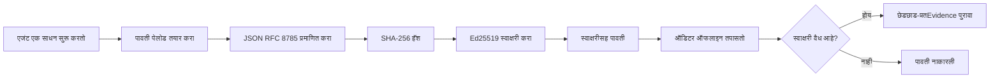
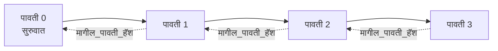

[शिक्षण व्हिडिओ पहा: क्रिप्टोग्राफिक रिसिप्ट्ससह AI एजंट्स सुरक्षित करणे](https://youtu.be/PLACEHOLDER_VIDEO_ID)

> _(शिक्षण व्हिडिओ आणि थंबनेल मर्ज नंतर Microsoft कंटेंट टीमद्वारे जोडले जातील, धडा 14 / 15 च्या नमुन्यानुसार.)_

# क्रिप्टोग्राफिक रिसिप्ट्ससह AI एजंट्स सुरक्षित करणे

## परिचय

हा धडा यात समाविष्ट आहे:

- AI एजंटसाठी ऑडिट ट्रेल का महत्त्वाचा आहे, अनुपालन, डीबगिंग आणि विश्वासासाठी.
- क्रिप्टोग्राफिक रिसिप्ट म्हणजे काय आणि हे अनसाईन केलेल्या लॉग लाइनपेक्षा कसे वेगळे आहे.
- एखाद्या एजंटच्या टूल कॉलसाठी साध्या Python मध्ये साईन केलेली रिसिप्ट कशी तयार करावी.
- ऑफलाइन रिसिप्ट कशी पडताळायची आणि फेरफट कशी शोधायची.
- रिसिप्ट्स कशी साखळी करायची ज्यामुळे कोणतीही रिसिप्ट काढल्यास किंवा पुनर्रचनेने साखळी तुटते.
- रिसिप्ट्स काय सिद्ध करतात आणि काय ते स्पष्टपणे सिद्ध करत नाहीत.

## शिक्षण उद्दिष्टे

हा धडा पूर्ण केल्यानंतर, आपल्याला माहित असेल कसे:

- एजंट क्रियांसाठी क्रिप्टोग्राफिक प्रॉव्हेनेन्सची प्रेरणा देणारे अपयश मोड ओळखणे.
- एक canonical JSON पेलोडवर Ed25519-साईन केलेली रिसिप्ट तयार करणे.
- केवळ साईनरच्या सार्वजनिक कीने रिसिप्ट स्वतंत्रपणे सत्यापित करणे.
- फेरफट शोधण्यासाठी बदललेल्या रिसिप्टवर पुन:सत्यापन करणे.
- रिसिप्ट्सच्या हॅश-चेन केलेल्या मालिकेची रचना करणे आणि साखळी का महत्त्वाची आहे हे समजावून सांगणे.
- रिसिप्ट्स काय सिद्ध करतात (अट्रिब्युशन, अखंडता, क्रमवारी) आणि काय सिद्ध करत नाहीत (क्रियांची बरोबरी, धोरणाची शाश्वतता) यामधील मर्यादा ओळखणे.

## समस्या: आपल्या एजंटचा ऑडिट ट्रेल

कल्पना करा की आपण Contoso Travel साठी AI एजंट तैनात केला आहे. एजंट ग्राहक विनंत्या वाचतो, फ्लाइट्स API कॉल करतो पर्याय शोधण्यासाठी आणि ग्राहकाच्या वतीने आसन बुक करतो. गेल्या तिमाहीत, एजंटने 50,000 बुकिंग प्रक्रिया केली आहेत.

आज एक ऑडिटर येतो. तो एक साधा प्रश्न विचारतो: "तुमचा एजंट काय केला ते दाखवा."

आपण आपले लॉग फाईल्स देता. ऑडिटर त्यांना पाहतो आणि कठीण प्रश्न विचारतो: "हे लॉग्स संपादित केलेले नाहीत याची मला खात्री कशी?"

ही ऑडिट-ट्रेलची समस्या आहे. आजच्या बहुतेक एजंट तैनातीवर अवलंबून आहेत:

- **ऍप्लिकेशन लॉग्स**: एजंटने स्वतः लिहिलेले, फाईल-सिस्टम प्रवेश असलेल्यांना संपादित करता येणारे.
- **क्लाउड लॉगिंग सेवा**: प्लॅटफॉर्म पातळीवर फेरफट प्रतिबंधक पण केवळ जर ऑडिटर प्लॅटफॉर्म ऑपरेटरवर विश्वास ठेवतो तर.
- **डाटाबेस ट्रान्झॅक्शन लॉग्स**: डाटाबेस बदलांसाठी उपयुक्त पण मनमानी टूल कॉलसाठी नाही.

कोणतेही हे प्रश्न उत्तरू शकत नाहीत जर ऑडिटरला कोणावर (तुमच्यावर, तुमच्या क्लाउड प्रदात्यावर, तुमच्या डाटाबेस विक्रेत्यावर) विश्वास ठेवावा लागेल. अंतर्गत वापरासाठी, हा विश्वास मान्य आहे. नियंत्रित वर्कलोडसाठी (वित्त, आरोग्यसेवा, EU AI कायद्यामुळे) नाही.

क्रिप्टोग्राफिक रिसिप्ट्स प्रत्येक एजंट क्रिया स्वतंत्रपणे पडताळण्यायोग्य करून हे सोडवतात. ऑडिटरला तुमच्यावर विश्वास ठेवणे आवश्यक नाही. त्यांना फक्त तुमची सार्वजनिक की आणि रिसिप्ट हव्या.

## क्रिप्टोग्राफिक रिसिप्ट म्हणजे काय?

रिसिप्ट हा JSON ऑब्जेक्ट आहे जो एजंटने काय केले याची नोंद करतो, डिजिटल स्वाक्षरीसह साईन केलेला.


  
एक किमान रिसिप्ट अशी दिसते:

```json
{
  "type": "agent.tool_call.v1",
  "agent_id": "contoso-travel-bot",
  "tool_name": "lookup_flights",
  "tool_args_hash": "sha256:a3f9c1...",
  "result_hash": "sha256:7b2e1d...",
  "policy_id": "contoso-travel-policy-v3",
  "timestamp": "2026-04-25T14:30:00Z",
  "sequence": 47,
  "previous_receipt_hash": "sha256:9d4e6a...",
  "signature": {
    "alg": "EdDSA",
    "sig": "c5af83...",
    "public_key": "8f3b2c..."
  }
}
```
  
तीन गुणधर्म कार्य करतात:

1. **स्वाक्षरी**. रिसिप्ट एजंटच्या गेटवेने Ed25519 खाजगी कीने साईन केली आहे. संबंधित सार्वजनिक की असलेल्या कोणालाही स्वाक्षरी ऑफलाइन पडताळता येते. कोणत्याही फील्डमध्ये फेरफट केल्यास स्वाक्षरी अवैध होते.

2. **कॅनॉनिकल एनकोडिंग**. साईनिंगपूर्वी, रिसिप्ट JSON Canonicalization Scheme (JCS, RFC 8785) वापरून सिरियलाइझ केली जाते. हे सुनिश्चित करते की एकाच लॉजिकली समान रिसिप्ट देणाऱ्या दोन पुनर्रचनेसाठी बाइटसमान आउटपुट तयार होते. कॅनॉनिकलायझेशनशिवाय, वेगवेगळ्या JSON सिरियलायझर्समुळे वेगवेगळ्या स्वाक्षऱ्या येऊ शकतात.

3. **हॅश चेनिंग**. `previous_receipt_hash` फील्ड प्रत्येक रिसिप्टला मागील रिसिप्टशी लिंक करते. एखाद्या रिसिप्ट काढल्यास किंवा पुनर्रचनेने नंतरच्या सर्व रिसिप्ट्स तुटतात. फेरफट साखळीवर पातळीवर दिसून येते जरी वैयक्तिक स्वाक्षऱ्या वगळल्या गेल्या.

ही वैशिष्ट्ये एकत्रितपणे तीन हमी देतात:

- **अट्रिब्युशन**: हा कीने हा कंटेंट साइन केला.
- **अखंडता**: स्वाक्षरीनंतर कंटेंट बदललेले नाही.
- **क्रमवारी**: ही रिसिप्ट त्याआधीच्या रिसिप्टनंतर आली.

## Python मध्ये रिसिप्ट तयार करणे

रिसिप्ट तयार करण्यासाठी आपल्याला विशिष्ट लायब्ररीची गरज नाही. क्रिप्टोग्राफिक प्राथमिक साधने सहज उपलब्ध आहेत आणि लॉजिक काही दहा ओळींचे Python आहे.

`code_samples/18-signed-receipts.ipynb` मधील हँड्स-ऑन व्यायाम संपूर्ण फ्लोचे स्पष्टीकरण करतात. संक्षिप्त आवृत्ती:

```python
import json
import hashlib
import base64
from nacl import signing
from jcs import canonicalize  # RFC 8785 कॅनॉनिकल JSON

def b64url_nopad(data: bytes) -> str:
    return base64.urlsafe_b64encode(data).decode("ascii").rstrip("=")

def sha256_canonical(obj) -> str:
    """SHA-256 of a Python object's JCS-canonical JSON form."""
    return f"sha256:{hashlib.sha256(canonicalize(obj)).hexdigest()}"

# साइनिंग की तयार करा किंवा लोड करा (उत्पादनात, की वॉल्टमध्ये साठवा)
signing_key = signing.SigningKey.generate()
verify_key = signing_key.verify_key

# रिसीप्ट पेलोड तयार करा (अजून स्वाक्षरी नाही)
tool_args = {"origin": "SYD", "destination": "LAX"}
tool_result = [{"flight": "QF11", "price": 1850, "stops": 0}]

payload = {
    "type": "agent.tool_call.v1",
    "agent_id": "contoso-travel-bot",
    "tool_name": "lookup_flights",
    "tool_args_hash": sha256_canonical(tool_args),
    "result_hash": sha256_canonical(tool_result),
    "policy_id": "contoso-travel-policy-v3",
    "timestamp": "2026-04-25T14:30:00Z",
    "sequence": 0,
    "previous_receipt_hash": None,
}

# कॅनॉनिकलाइज करा, हॅश करा, स्वाक्षरी करा.
canonical_bytes = canonicalize(payload)
message_hash = hashlib.sha256(canonical_bytes).digest()
signature_bytes = signing_key.sign(message_hash).signature

# रचना केलेला स्वाक्षरी ऑब्जेक्ट जोडा.
receipt = {
    **payload,
    "signature": {
        "alg": "EdDSA",
        "sig": b64url_nopad(signature_bytes),
        "public_key": b64url_nopad(bytes(verify_key)),
    },
}
```
  
हेच सर्व साईनिंग पाईपलाइन आहे. नोटबुकमधील व्यायाम प्रत्येक टप्पा समजावून सांगतात.

## रिसिप्ट पडताळणी आणि फेरफट शोधणे

पडताळणी म्हणजे उलट प्रक्रिया:

```python
import base64
import hashlib
from nacl import signing
from nacl.exceptions import BadSignatureError
from jcs import canonicalize

def b64url_decode(s: str) -> bytes:
    padding = "=" * ((4 - len(s) % 4) % 4)
    return base64.urlsafe_b64decode(s + padding)

def verify_receipt(receipt: dict) -> bool:
    # सहीहस्ताक्षर हा एक संरचित ऑब्जेक्ट आहे: {"alg", "sig", "public_key"}.
    sig_obj = receipt.get("signature")
    if not sig_obj or sig_obj.get("alg") != "EdDSA":
        return False

    # प्रत्यक्षात सही केलेले पेलोड पुन्हा तयार करा (सहीहस्ताक्षर वगळता सर्वकाही).
    payload = {k: v for k, v in receipt.items() if k != "signature"}

    canonical_bytes = canonicalize(payload)
    message_hash = hashlib.sha256(canonical_bytes).digest()

    try:
        verify_key = signing.VerifyKey(b64url_decode(sig_obj["public_key"]))
        verify_key.verify(message_hash, b64url_decode(sig_obj["sig"]))
        return True
    except BadSignatureError:
        return False
```
  
ही फंक्शन रिसिप्ट घेते आणि स्वाक्षरी वैध असल्यास `True`, अन्यथा `False` परत करते. कोणतीही नेटवर्क कॉल, सेवा अवलंबित्व किंवा तिसऱ्या पक्षावर विश्वास आवश्यक नाही.

फेरफट शोधण्याचा अनुभव घेण्यासाठी नोटबुक यातून पुढील पावले घेतो:

1. वैध रिसिप्ट तयार करणे आणि पडताळणी यशस्वी होणे.
2. `tool_args_hash` फील्डमधील एक बाइट बदलणे.
3. पुन: पडताळणी चालवून अयशस्वी होणे पाहणे.

ही व्यवहार्य उदाहरण आहे की रिसिप्ट्स फेरफट-प्रतिबंधक आहेत: लहानसुध्दा फेरफट स्वाक्षरी तुटवते.

## मल्टी-स्टेप एजंटसाठी रिसिप्ट साखळी तयार करणे

एका साईन केलेल्या रिसिप्टमुळे एका क्रियाचे संरक्षण होते. रिसिप्ट्सची साखळी एक मालिकेचे संरक्षण करते.


  
प्रत्येक रिसिप्टमध्ये आधीच्या रिसिप्टचा हॅश आहे. रिसिप्ट 2 शांतपणे काढण्यासाठी हल्लेखोरने खालीपैकी एक करावे लागेल:

- रिसिप्ट 3 चा `previous_receipt_hash` फील्ड बदलणे (रिसिप्ट 3 ची स्वाक्षरी तुटेल), किंवा
- रिसिप्ट 3 वर नवीन स्वाक्षरी बनवणे (एजंटची खाजगी की लागेल).

जर खासगी की हार्डवेअर की वॉल्टमध्ये असेल आणि आपण प्रत्येक रिसिप्टसह सार्वजनिक की प्रकाशित करत असाल, तर कोणताही हल्ला मानवियपणे शोधण्याशिवाय शक्य नाही.

नोटबुक पुढे सांगतो:

1. तीन रिसिप्ट्सची साखळी तयार करणे.
2. प्रत्येक रिसिप्टचा `previous_receipt_hash` प्रत्यक्ष पूर्व रिसिप्टच्या हॅशशी जुळत असल्याचे पडताळणे.
3. मध्ये एका रिसिप्टवर फेरफट करणे आणि साखळी तुटलेली पाहणे.

अशाप्रकारे आपण अशी ऑडिट ट्रेल तयार करता ज्याची बाह्य ऑडिटर आपला विश्वास न ठेवता पडताळणी करू शकतो.

## रिसिप्ट्स काय सिद्ध करतात (आणि काय नाही)

हा धडाातील सर्वात महत्त्वाचा विभाग आहे. रिसिप्ट्स सामर्थ्यवान आहेत परंतु त्यांची मर्यादा आहे.

**रिसिप्ट्स तीन गोष्टी सिद्ध करतात:**

1. **अट्रिब्युशन**: विशिष्ट कीने विशिष्ट पेलोड साईन केला.
2. **अखंडता**: स्वाक्षरीनंतर पेलोड बदललेले नाही.
3. **क्रमवारी**: ही रिसिप्ट त्या साखळीत त्या रिसिप्टनंतर आली.

**रिसिप्ट्स सिद्ध करत नाहीत:**

1. **बरोबरी**: एजंट क्रिया योग्य आहे का नाही. चुकीच्या उत्तरासाठीही रिसिप्ट तसाच साईन केली जाऊ शकते.
2. **धोरण पालन**: `policy_id` मधील धोरण खरंच तपासले गेले का किंवा हे क्रियाही करण्यास परवानगी दिली असती का. रिसिप्ट केवळ काय सांगितले ते नोंदवते, काय अंमलात आणले ते नाही.
3. **कीव्यतिरिक्त ओळख**: रिसिप्ट म्हणते "हा कीने हा कंटेंट साईन केला." पण ते म्हणत नाही "हा मानवी अधिकार देणारा आहे." व्यक्ती किंवा संघटनेशी की जोडणीसाठी वेगळा ओळख इन्फ्रास्ट्रक्चर (डिरेक्टरी, सार्वजनिक की नोंदणी, इ.) आवश्यक आहे.
4. **इनपुट्सचा सत्यता**: जर एजंटला फेरफट केलेला प्रॉम्प्ट दिला गेला आणि त्याने त्यावर कृती केली, तर रिसिप्ट क्रियांची निष्ठावान नोंद करते. रिसिप्ट्स ही इनपुट व्हॅलिडेशनच्या खाली असतात, त्याचे पर्याय नाहीत.

ही सीमा महत्त्वाची आहे कारण:

- हे सांगते की रिसिप्ट्स कशासाठी उपयुक्त आहेत: एजंट वर्तन ऑडिट करण्याजोगे आणि फेरफट-प्रतिबंधक बनविण्यासाठी, अगदी संघटनात्मक सीमारेषा ओलांडून.
- हे सांगते की अजून कोणत्या स्तरांची गरज आहे: इनपुट व्हॅलिडेशन (धडा 6), धोरण अंमलबजावणी (खालील थोडक्यात वर्णन), आणि ओळख इन्फ्रास्ट्रक्चर (या धडाच्या व्याप्तीबाहेर).

सामान्य चूक ही समजणे की "आपल्याकडे रिसिप्ट्स आहेत" म्हणजे "आपण शासित आहोत." तसे नाही. रिसिप्ट्स ही पाया आहे. शासन प्रणाली आपण त्यावर बांधता.

## उत्पादन संदर्भ

या धडातील Python कोड जाणून घेण्यासाठी अगदी कमी ठेवलेला आहे जेणेकरून आपण प्रत्येक ओळ वाचून समजू शकता. उत्पादनात आपल्याकडे दोन पर्याय आहेत:

1. **क्रिप्टोग्राफिक प्राथमिक साधनांवर थेट बांधणी करा.** वर दिलेली ५० ओळी अनेक वापरांसाठी पुरेशी आहेत. PyNaCl (Ed25519) आणि `jcs` पॅकेज (कॅनॉनिकल JSON) चांगल्या देखभाल व ऑडिट केलेल्या आहेत.

2. **उत्पादनासाठी रिसिप्ट लायब्ररी वापरा.** अनेक ओपन सोर्स प्रकल्प नेमकेच हेच नमुना अधिक सुविधा (की रोटेशन, बॅच पडताळणी, JWK सेट वितरण, धोरण इंजिनशी एकत्रीकरण) देऊन अंमलात आणतात:
   - या धडात वापरलेले रिसिप्ट फॉरमॅट IETF Internet-Draft (`draft-farley-acta-signed-receipts`) आहे जे सध्या मानके प्रक्रियेत आहे.
   - Microsoft Agent Governance Toolkit रिसिप्ट्स Cedar-आधारित धोरण निर्णयांसह तयार करतो; त्या रेपॉजिटरीतील Tutorial 33 पूर्ण उदाहरण पहा.
   - `protect-mcp` (npm) आणि `@veritasacta/verify` (npm) पॅकेजेस Node-आधारित रिसिप्ट साईनिंग आणि ऑफलाइन पडताळणीची अंमलबजावणी देतात, टॅम्पर-एव्हिडेंट ऑडिट ट्रेलसह कोणत्याही MCP सर्व्हरला झाकण्यासाठी.

आपले स्वतःचे JWT लायब्ररी लिहिण्याचा निर्णय आणि चाचणी केलेले लायब्ररी वापरण्याचा निर्णय यासारखाच हा निर्णय आहे: दोन्हीचा अर्थ आहे; लायब्ररी वेळ वाचवते आणि ऑडिट पुन्हा कमी करते; सुरवातीपासून मार्ग आपल्याला प्रत्येक प्राथमिक तत्त्व समजायला भाग पाडतो. हा धडा सुरवातीपासूनचा मार्ग शिकवतो जेणेकरून आपल्याकडे आवडीनुसार पर्याय असेल.

## ज्ञान तपासणी

सराव करण्यापूर्वी आपली समज तपासा.

**१. रिसिप्ट एजंटच्या खाजगी Ed25519 कीने साईन केलेली आहे. ऑडिटरकडे फक्त सार्वजनिक की आहे. ऑडिटर रिसिप्ट ऑफलाइन पडताळू शकतो का?**

<details>
<summary>उत्तर</summary>

होय. Ed25519 पडताळणीसाठी फक्त सार्वजनिक की आणि साईन केलेले बाइट्स लागतात. कोणतेही नेटवर्क कॉल, कोणतीही सेवा अवलंबित्व नाही. हीच ती वैशिष्ट्ये आहेत ज्यामुळे रिसिप्ट्स एअर-गॅप्ड, अनेक-संस्थात्मक अथवा कमी-विश्वास असलेल्या ऑडिट सेटिंगमध्ये उपयुक्त ठरतात.
</details>

**२. हल्लेखोरने रिसिप्टचा `policy_id` फील्ड बदलून अधिक सैल धोरण असल्याचा दावा केला. स्वाक्षरी मूळ पेलोडवर आहे. पडताळणी दरम्यान काय होते?**

<details>
<summary>उत्तर</summary>

पडताळणी फेल होते. स्वाक्षरी मूळ पेलोडच्या कॅनॉनिकल बाइट्सवर गणली जाते; कोणताही फील्ड बदलल्याने कॅनॉनिकल बाइट्स बदलतात, त्यामुळे SHA-256 हॅश बदलतो, परिणामी स्वाक्षरी अवैध होते. हल्लेखोराला नवीन वैध स्वाक्षरी देण्यासाठी खाजगी की हवी जी त्याच्याकडे नाही.
</details>

**३. रिसिप्टमध्ये `tool_args_hash` आणि `result_hash` का आहेत, थेट आर्ग्युमेंट्स आणि निकालाऐवजी?**

<details>
<summary>उत्तर</summary>

दोन कारणे. पहिले, रिसिप्ट संग्रहित किंवा पाठवली जाऊ शकते अशा वातावरणांमध्ये (जिथे मूळ सामग्रीचा उघड होणे म्हणजे PII, व्यवसाय डेटा लीक होणे) समस्या असू शकते. हॅशिंग रिसिप्ट लहान आणि गोपनीय ठेवते; ऑडिटरला हॅश खात्री करायचा आहे की तो मूळ सामग्रीशी जुळतो. दुसरे, हॅशेसची निश्चित लांबी असते; त्यामुळे रिसिप्टचा आकार इनपुट/आउटपुटच्या आकारापासून स्वतंत्र राहतो.
</details>

**४. `previous_receipt_hash` प्रत्येक रिसिप्टला मागच्या रिसिप्टशी लिंक करतो. जर हल्लेखोर साखळीच्या मधून एक रिसिप्ट हटवतो, तर काय अवैध होते?**

<details>
<summary>उत्तर</summary>

मूळ हटवलेल्या रिसिप्टनंतरच आलेल्या प्रत्येक रिसिप्टची `previous_receipt_hash` आता साखळीशी जुळत नाही (कारण मागील रिसिप्ट अस्तित्वात नाही किंवा साखळी वेगळ्या पूर्ववर्तीकडे निर्देश करते). हटवलेली लपवण्यासाठी हल्लेखोरने पुढील सर्व रिसिप्ट्स नवीन साईन कराव्या लागतील, ज्यासाठी खाजगी कीची गरज आहे.
</details>

**५. एका रिसिप्टची पडताळणी स्वच्छ यशस्वी झाली. म्हणजे एजंटची क्रिया योग्य, शाश्वत किंवा धोरणानुसार आहे हे सिद्ध होते का?**

<details>
<summary>उत्तर</summary>

नाही. वैध रिसिप्ट तीन गोष्टी सिद्ध करते: अट्रिब्युशन (ही कीने हा कंटेंट साईन केला), अखंडता (कंटेंट न बदललेले), आणि क्रमवारी (ही रिसिप्ट त्या साखळीतील त्या रिसिप्टनंतर आली). यामुळे क्रियेची बरोबरी, धोरणाची अंमलबजावणी किंवा एजंटने नियमांचे पालन केले याचा पुरावा होत नाही. रिसिप्ट्स एजंटच्या वर्तनाला ऑडिट करण्यायोग्य बनवतात, परंतु ते बरोबरीची हमी देत नाहीत. हा धडाातील सर्वात महत्त्वाचा मुद्दा आहे.
</details>

## सराव व्यायाम

`code_samples/18-signed-receipts.ipynb` उघडा आणि चार विभाग पूर्ण करा:

1. **विभाग 1**: तुमची पहिली रिसिप्ट साईन करा आणि पडताळणी करा.
2. **विभाग 2**: रिसिप्टमध्ये फेरफट करा आणि पडताळणी अयशस्वी होत असल्याचे पाहा.
3. **विभाग 3**: तीन रिसिप्ट्सची साखळी तयार करा आणि साखळीची अखंडता पडताळा.
4. **विभाग 4**: Microsoft Agent Framework वापरून तयार एजंटसाठी पॅटर्न लागू करा: टूल कॉल रिसिप्ट-साईनिंगमध्ये वेढा, नंतर रिसिप्ट स्वतंत्रपणे पडताळा.

**स्ट्रेच आव्हान 1:** रिसिप्ट स्कीमामध्ये तुमच्या आवडीनुसार अतिरिक्त फील्ड जोडा (उदा. ट्रेसिंगसाठी रिक्वेस्ट ID), कॅनॉनिकल साईनिंग लॉजिक अपडेट करा व पुष्टी करा की रिसिप्ट पडताळणीसाठी योग्य प्रकारे फिरते. नंतर साईनिंगनंतर फील्ड बदलून पडताळणी अयशस्वी होत असल्याचे तपासा. यामुळे तुम्हाला कॅनॉनिकल एनकोडिंगमधील प्रत्येक बाइटची स्वाक्षरीत कशी भूमिका आहे हे समजेल.
**स्ट्रेच चॅलेंज 2:** आपल्या दोन पावत्या SHA-256-हॅश करून त्यांना एकत्र करा (त्यांचे कॅनॉनिकल बाइट्स नियत क्रमाने concatenating करा) आणि प्राप्त झालेला डाइजेस्ट तिसर्‍या पावतीवर नवीन फील्ड म्हणून एम्बेड करा आणि नंतर त्यावर स्वाक्षरी करा. सर्व तीन पावत्या अद्याप round-trip होतात का ते तपासा. आपण नुकत्याच एक-चरणाचा समावेश पुरावा तयार केला आहे: तिसरी पावत धरणारा कोणीही प्रथम दोन पावत्या त्यावर स्वाक्षरी केल्याच्या वेळी अस्तित्वात होत्या हे पुरावा देऊ शकतो, त्यांची सामग्री उघड न करता. हा तो नमुना आहे जो selective-disclosure पावत्या मोठ्या प्रमाणावर वापरतात (Merkle commitments, RFC 6962).

## निष्कर्ष

क्रिप्टोग्राफिक पावत्या AI एजंट्सना एक ऑडिट ट्रेल देतात जो:

- **स्वतंत्रपणे सत्यापित करता येणारा**: कोणत्याही पक्षाकडे सार्वजनिक की असल्यास ती सत्यापित करू शकतो, कोणत्याही सेवा अवलंबित्वाशिवाय.
- **छेडछाड स्पष्ट करणारा**: कोणतेही बदल स्वाक्षरी अमान्य करतो.
- **पोर्टेबल**: एक पावती हा एक लहान JSON फाईल असतो; तो संग्रहित, प्रसारित आणि कुठेही सत्यापित केला जाऊ शकतो.
- **मानकांशी सुसंगत**: Ed25519 (RFC 8032), JCS (RFC 8785), आणि SHA-256 वर आधारित, सर्व खूप वापरले जाणारे primitives.

हे इनपुट वैधता, धोरण अंमलबजावणी, किंवा ओळख यंत्रणेसाठी पर्याय नाहीत. ते त्या स्तरांसाठी पाया आहेत. जेव्हा आपण रेग्युलेटेड वर्कलोड्समध्ये, मल्टी-ऑर्गनायझेशन वर्कफ्लोजमध्ये किंवा अशा कोणत्याही पर्यावरणात एजंट्स तैनात करत आहात जिथे भविष्यातील ऑडिटर आपल्यावर विश्वास ठेवेलच असे नाही, तेव्हा पावत्या आपला ऑडिट ट्रेल प्रामाणिक करण्याचा मार्ग असतात.

सर्वात महत्त्वाचा मुद्दा: पावत्या सिद्ध करतात कोण काय म्हणाला, कधी. त्या सिद्ध करत नाहीत की जे म्हटले ते खरे किंवा बरोबर होते. त्या फरकाला घट्ट पकडा. हे प्रामाणिक मूळ प्रणाली आणि दिशाभूल करणारी प्रणाली यामधील फरक आहे.

## उत्पादन तपासणी यादी

जेव्हा आपण हा धडा पूर्ण करून वास्तविक वातावरणात receipt-signed एजंट्स तैनात करण्यासाठी तयार असाल:

- [ ] **डेव्हलपर लॅपटॉपवरून साईनिंग की हलवा.** Azure Key Vault, AWS KMS किंवा हार्डवेअर सुरक्षा मॉड्यूल वापरा. आपली खाजगी की जी आपले पावत्या साईन करते ती कधीही स्त्रोत नियंत्रणात किंवा plain text मध्ये अनुप्रयोग मशीनवर ठेवू नका.
- [ ] **सत्यापन सार्वजनिक की प्रकाशित करा.** ऑडिटरना ऑफलाइन सत्यापित करण्यासाठी हवी असते. मानक नमुना JWK सेट प्रसिद्ध URL वर (RFC 7517), उदा. `https://your-org.example.com/.well-known/agent-keys.json`.
- [ ] **शृंखलेचे बाह्यरीत्या अँकर करा.** वेळोवेळी नवीनतम शृंखला हेड हॅश पारदर्शकता लॉगमध्ये (Sigstore Rekor, RFC 3161 timestamp authority, किंवा दुसरी अंतर्गत प्रणाली) लिहा, ज्यामुळे बाहेरच्या पक्षाला "ही शृंखला त्या वेळी अस्तित्वात होती" याची पुष्टी करता येईल.
- [ ] **पावत्या अपरिवर्तनीय स्वरूपात संग्रहित करा.** Append-only blob storage (Azure Storage with immutability policies, AWS S3 Object Lock) वापरा, जेणेकरून अंतर्गत व्यक्ती संग्रह स्तरावर इतिहास पुनर्लेखन करू शकणार नाही.
- [ ] **रिटेन्शन बाबत निर्णय घ्या.** अनेक नियमवली वर्षांपर्यंत राखण मागतात. पावत्या वाढीची योजना करा (प्रत्येक पावती सुमारे 500 बाइट्स; एजंट रोज 10K कॉल्स करेल तर वर्षाला सुमारे 1.8 GB तयार होईल).
- [ ] **पावत्या कोणत्या बाबतीत कव्हर करत नाहीत हे दस्तऐवजित करा.** पावत्या attribution, integrity, आणि ordering सिद्ध करतात. आपला रनबुक स्पष्टपणे नमूद करायला हवा की कोणते अतिरिक्त नियंत्रण (इनपुट तपासणी, धोरण अंमलबजावणी, रेट लिमिटिंग, ओळख यंत्रणा) आपल्या शासन धोरणात पावत्यांसह बसतात.

### AI एजंट्सची सुरक्षा करण्याबाबत अधिक प्रश्न आहेत का?

[Microsoft Foundry Discord](https://aka.ms/ai-agents/discord) मध्ये सामील व्हा, इतर शिकणाऱ्यांशी भेटा, ऑफिस आवर्सला उपस्थित राहा आणि आपल्या AI एजंट्ससंबंधी प्रश्नांचे निराकरण करा.

## हा धडा ओलांडून पुढे काय?

हा धडा एकल पावतीवर स्वाक्षरी आणि हॅश-शृंखलाबद्ध अनुक्रमांचे वर्णन करतो. तेच primitives अनेक प्रगत नमुन्यांमध्ये वापरले जातात जे आपले शासन धोरण पूरक होण्यास मदत करतात:

- **Selective disclosure.** जेव्हा पावती फील्ड स्वतंत्रपणे प्रतिबद्ध केले जातात (RFC 6962-शैली Merkle वृक्ष), तेव्हा आपण विशिष्ट फील्ड विशिष्ट ऑडिटरना उघड करू शकता आणि उर्वरित फील्ड न बदलल्याचा पुरावा देऊ शकता, त्यांची सामग्री उघड न करता. हे उपयोगी आहे जेव्हा एकाच पावतीला एक व्यापक ऑडिट (जे पूर्णतेची इच्छा करतो) आणि डेटा-न्यूनता नियमावली जसे GDPR (ज्यांना ऑडिटरला जास्तीत जास्त कमी माहिती दाखवायची असते) याला दोन्ही जुळवून द्यायचे असते.
- **Receipt revocation.** जर साईनिंग की तुटली, तर त्या कीने साईन केलेल्या सर्व पावत्या एका ठराविक वेळानंतर अविश्वसनीय म्हणून मार्क करण्याचे माध्यम असावे लागते. मानक नमुने: अल्पकालीन साईनिंग की आणि प्रसिद्ध रद्दीकरण यादी, किंवा रद्दीकरण नोंदी असलेला पारदर्शकता लॉग.
- **बिलॅटरल / विभाजित-स्वाक्षरी पावत्या.** काही अंमलबजावणीत साईन केलेला पेलोड अंमलबजावणीपूर्वक (`authorization_*`) आणि अंमलबजावणीनंतर (`result_*`) अर्ध्या भागांत विभाजित केला जातो, स्वतंत्र स्वाक्षऱ्यांसह; जेव्हा अधिकृत निर्णय आणि निरीक्षित परिणाम वेगळ्या कार्यकर्त्यांनी किंवा वेगवेगळ्या वेळी निर्मिती केले जातात तेव्हा उपयुक्त. हा पद्धत या धड्यात शिकवलेल्या पावती फॉरमॅटवर अतिरिक्तपणे बनतो.
- **पेलोड संयोजन.** जे बाइट्स आपण `result_hash` मध्ये टाकता ते पावती तळाशी सील करते. वास्तविक वापरातील पेलोड सामान्यतः एका साध्या टूल कॉल निष्कर्षापेक्षा जास्त समृद्ध असतात: निर्णय आधीचे विचार (मॉडेल पूर्वकल्पना, विचारलेले पर्याय, पुरावे आणि त्यांची संपूर्णता, जोखीम स्थिती, उत्तरदायित्व साखळी, गेट परिणाम) सर्व पेलोडमध्ये असू शकतात, जे एका पावतीने सील केलेले असते. हे पावती फॉरमॅटला कमीतकमी ठेवते आणि पेलोड स्कीमा क्षेत्रानुसार विकसित होऊ देते.
- **क्रॉस-इंम्प्लिमेंटेशन सुसंगतता.** एका पावती फॉरमॅटची अनेक स्वतंत्र अंमलबजावणी (Python, TypeScript, Rust, Go) समान चाचणी व्हेक्टरवरून क्रॉस-वेरिफाय करतात. जर आपण स्वतःची अंमलबजावणी केली, तर प्रकाशित व्हेक्टरच्या विरुद्ध तपासणी केल्याने वायर सुसंगतता पुष्टी होते.
- **पोस्ट-क्वांटम स्थलांतर.** Ed25519 आज व्यापकपणे वापरले जात असले तरी क्वांटम-प्रतिरोधक नाही. पावती फॉरमॅट अल्गोरिदम-एजाइल आहे: `signature.alg` फील्डमध्ये `ML-DSA-65` (NIST पोस्ट-क्वांटम स्वाक्षरी मानक) धारण करू शकते, जेव्हा स्थलांतरण आवश्यक असते. दोनही पद्धतीने साईन केलेल्या पावत्या असलेल्या संक्रमण काळासाठी योजना करा.

## अतिरिक्त स्त्रोत

- <a href="https://datatracker.ietf.org/doc/draft-farley-acta-signed-receipts/" target="_blank">IETF Internet-Draft: Signed Decision Receipts for Machine-to-Machine Access Control</a>
- <a href="https://learn.microsoft.com/azure/ai-studio/responsible-use-of-ai-overview" target="_blank">जिम्मेदार AI आढावा (Azure AI)</a>
- <a href="https://datatracker.ietf.org/doc/html/rfc8032" target="_blank">RFC 8032: एडवर्ड्स-कर्व डिजिटल स्वाक्षरी अल्गोरिदम (EdDSA)</a>
- <a href="https://datatracker.ietf.org/doc/html/rfc8785" target="_blank">RFC 8785: JSON Canonicalization Scheme (JCS)</a>
- <a href="https://datatracker.ietf.org/doc/html/rfc6962" target="_blank">RFC 6962: प्रमाणपत्र पारदर्शकता</a> (selective-disclosure पावत्या बनविण्यासाठी वापरलेला Merkle-ट्री)
- <a href="https://github.com/microsoft/agent-governance-toolkit/blob/main/docs/tutorials/33-offline-verifiable-receipts.md" target="_blank">Microsoft Agent Governance Toolkit, ट्युटोरियल 33: ऑफलाइन-व्हेरिफायबल निर्णय पावत्या</a>
- <a href="https://github.com/ScopeBlind/agent-governance-testvectors" target="_blank">या धड्यात वापरल्या गेलेल्या पावती फॉरमॅटसाठी क्रॉस-इंम्प्लिमेंटेशन सुसंगतता चाचणी व्हेक्टर</a> (Apache-2.0)
- <a href="https://pynacl.readthedocs.io/" target="_blank">PyNaCl दस्तऐवज</a> (Python मध्ये Ed25519)

## मागील धडा

[कंप्यूटर वापर एजंट्स तयार करणे (CUA)](../15-browser-use/README.md)

## पुढील धडा

_(शिक्षण विभागाद्वारे ठरविले जाणार आहे)_

---

<!-- CO-OP TRANSLATOR DISCLAIMER START -->
**अस्वीकरण**:
हा दस्तऐवज AI भाषांतर सेवा [Co-op Translator](https://github.com/Azure/co-op-translator) चा वापर करून अनुवादित केला आहे. जरी आम्ही अचूकतेसाठी प्रयत्न करतो, तरी कृपया लक्षात घ्या की स्वयंचलित भाषांतरांमध्ये त्रुटी किंवा अचूकतेची कमतरता असू शकते. मूळ दस्तऐवज त्याच्या मूळ भाषेत अधिकृत स्रोत मानला पाहिजे. महत्त्वाची माहिती असल्यास, व्यावसायिक मानवी भाषांतराची शिफारस केली जाते. या भाषांतराच्या वापरामुळे उद्भवणाऱ्या कोणत्याही गैरसमज किंवा चुकीच्या अर्थलावणीसाठी आम्ही जबाबदार नाही.
<!-- CO-OP TRANSLATOR DISCLAIMER END -->