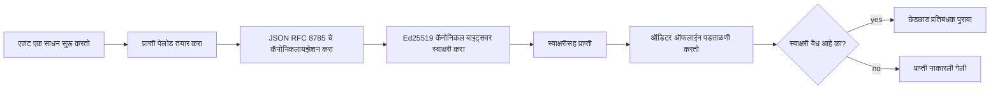
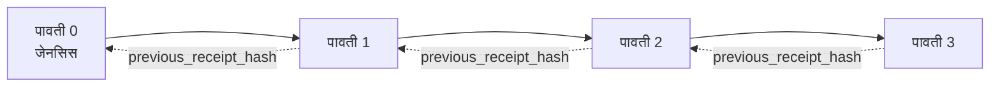

[धडा व्हिडिओ पहा: क्रिप्टोग्राफिक रिसीट्ससह AI एजंट्सचे संरक्षण](https://youtu.be/PLACEHOLDER_VIDEO_ID)

> _(धडा व्हिडिओ आणि थंबनेल मायक्रोसॉफ्ट कंटेंट टीमने मर्जनंतर जोडले जातील, धडा १४ / १५ च्या नमुन्याशी जुळणार.)_

# क्रिप्टोग्राफिक रिसीट्ससह AI एजंट्सचे संरक्षण

## परिचय

हा धडा पुढील गोष्टींचा आढावा घेईल:

- AI एजंट्ससाठी ऑडिट ट्रेल्स का महत्वाचे आहेत, ते अनुपालन, डिबगिंग, आणि विश्वासासाठी.
- क्रिप्टोग्राफिक रिसीट म्हणजे काय आणि ते अनसही केलेल्या लॉग लाईनपासून कसे वेगळे आहे.
- सामान्य Python मध्ये एजंटच्या टूल कॉलसाठी साइन केलेले रिसीट कसे तयार करायचे.
- रिसीट ऑफलाइन कशी पडताळायची आणि छळ शोधायचा.
- रिसीट्स कसे साखळीतील बांधायचे जेणे करून एखादा रिसीट काढल्याने किंवा पुनर्रचनेने साखळी तुटेल.
- रिसीट्स काय पुरवतात आणि ते स्पष्टपणे काय पुरवत नाहीत.

## शिकण्याचे उद्दिष्टे

हा धडा पूर्ण केल्यानंतर, तुम्हाला कसे कळेल:

- एजंट क्रियांसाठी क्रिप्टोग्राफिक प्रॉव्हेनेन्स प्रेरित करणाऱ्या अपयशाच्या प्रकारांची ओळख करायची.
- एक एड25519-सही केलेला रिसीट कॅनॉनीकल JSON पेलोडवर कसा तयार करायचा.
- सायरन सार्वजनिक कळा वापरून रिसीट स्वतंत्रपणे कशी पडताळायची.
- बदललेला रिसीट पुन्हा पडताळून छळ कसा शोधायचा.
- रिसीट्सची हैश-चेन कशी तयार करायची आणि साखळी का महत्वाची आहे हे समजावून सांगायचे.
- रिसीट्स काय दाखवतात (अ‍ॅट्रिब्युशन, अखंडता, क्रमवारी) आणि काय नाही दाखवत (कारवाईचे बरोबरपण, धोरणाची समजूत).

## समस्या: तुमच्या एजंटचा ऑडिट ट्रेल

कल्पना करा की तुम्ही कोंटोसो ट्रॅव्हलसाठी AI एजंट तैनात केला आहे. एजंट ग्राहकांच्या विनंत्या वाचतो, फ्लाइट्स API कॉल करतो पर्याय शोधण्यासाठी, आणि ग्राहकांच्या वतीने सीट बुक करतो. मागील तिमाहीत, एजंटने ५०,००० बुकिंग प्रक्रिया केली.

आज एक लेखापरीक्षक येतो. तो एक सोपा प्रश्न विचारतो: "मला दाखवा की तुमच्या एजंटने काय केले."

तुम्ही तुमची लॉग फाइलवर हस्तांतरीत करता. लेखापरीक्षक त्यांना बघतो आणि कठीण प्रश्न विचारतो: "मला कसे कळेल की हे लॉग संपादित केलेले नाहीत?"

ही ऑडिट-ट्रेल समस्या आहे. आजकाल बहुतेक एजंट तैनातीवर अवलंबून आहे:

- **अ‍ॅप्लिकेशन लॉग्स**: एजंटने स्वतः लिहिलेले, कोणत्याही फायली व्यवस्थापकाकडे संपादित करण्यायोग्य.
- **क्लाउड लॉगिंग सेवा**: प्लॅटफॉर्म स्तरावर छळ दिसून येतो पण फक्त जर लेखापरीक्षक प्लॅटफॉर्म ऑपरेटरवर विश्वास ठेवेल.
- **डेटाबेस ट्रांजॅक्शन लॉग्स**: डेटाबेस बदलांसाठी योग्य पण मनमानी टूल कॉलसाठी नाही.

या पैकी कोणतीही लेखापरीक्षकाच्या प्रश्नाचे उत्तर देऊ शकत नाही नाहीतर लेखापरीक्षकाला कोणावर तरी (तुमच्यावर, तुमच्या क्लाउड प्रदात्यावर, तुमच्या डेटाबेस विक्रेत्यावर) विश्वास ठेवावा लागतो. अंतर्गत वापरासाठी, तो विश्वास बहुधा स्वीकारार्ह असतो. नियंत्रित कार्यभारांसाठी (आर्थिक, आरोग्यसेवा, EU AI कायद्याअंतर्गत कोणतीही गोष्ट) नाही.

क्रिप्टोग्राफिक रिसीट्स यासाठी उपाय करतात की प्रत्येक एजंट क्रिया स्वतंत्रपणे पडताळण्यायोग्य असते. लेखापरीक्षकाला तुमच्यावर विश्वास ठेवायचा नाही. त्यांना फक्त तुमची सार्वजनिक कळा आणि रिसीट पाहिजे.

## क्रिप्टोग्राफिक रिसीट म्हणजे काय?

रिसीट एक JSON ऑब्जेक्ट आहे जो नोंदवतो की एजंटने काय केले, आणि त्यावर डिजिटल स्वाक्षरी असते.


```mermaid
flowchart LR
    A[एजंट एक साधन सुरू करतो] --> B[प्राप्ती पेलोड तयार करा]
    B --> C[JSON RFC 8785 चे कॅनोनिकलायझेशन करा]
    C --> E[Ed25519 कॅनोनिकल बाइट्सवर स्वाक्षरी करा]
    E --> F[स्वाक्षरीसह प्राप्ती]
    F --> G[ऑडिटर ऑफलाईन पडताळणी करतो]
    G --> H{स्वाक्षरी वैध आहे का?}
    H -- yes --> I[छेडछाड प्रतिबंधक पुरावा]
    H -- no --> J[प्राप्ती नाकारली गेली]
```

एक किमान रिसीट असं दिसतं:

```json
{
  "type": "agent.tool_call.v1",
  "agent_id": "contoso-travel-bot",
  "tool_name": "lookup_flights",
  "tool_args_hash": "sha256:a3f9c1...",
  "result_hash": "sha256:7b2e1d...",
  "policy_id": "contoso-travel-policy-v3",
  "timestamp": "2026-04-25T14:30:00Z",
  "sequence": 47,
  "previous_receipt_hash": "sha256:9d4e6a...",
  "signature": {
    "alg": "EdDSA",
    "sig": "c5af83...",
    "public_key": "8f3b2c..."
  }
}
```

तीन गुणधर्म कार्यरत आहेत:

1. **स्वाक्षरी**. रिसीट एजंटच्या गेटवेने एड25519 खाजगी कळीने स्वाक्षरी केली आहे. या कळाशी कोणालाही सार्वजनिक कळीने ऑफलाइन पडताळणी करता येते. कोणत्याही फील्डवर छळ केल्यास स्वाक्षरी अमान्य होते.

2. **कॅनॉनिकल एन्कोडिंग**. स्वाक्षरी करण्यापूर्वी, रिसीट JSON कॅनॉनिकलायझेशन स्कीम (JCS, RFC 8785) वापरून सिरीयलाइज केला जातो. यामुळे दोन अंमलबजावणी समान लॉजिकल रिसीटवर बाइट-ओळखीचे उत्पादन करतात. कॅनॉनिकलायझेशनशिवाय, वेगवेगळे JSON सिरीयलायझर वेगळ्या स्वाक्षरी तयार करतील.

3. **हॅश चेनिंग**. `previous_receipt_hash` फील्ड प्रत्येक रिसीटला त्यापूर्वीच्या रिसीटशी लिंक करतो. एखादा रिसीट वगळल्यास किंवा पुनर्रचनेत आल्यास त्यानंतरच्या प्रत्येक रिसीटचा ब्रेक होतो. छळ साखळी स्तरावरही दिसून येतो जरी स्वतंत्र स्वाक्षऱ्या बायपास केल्या असल्या तरी.

एकत्रितपणे हे गुणधर्म तीन हमी करतात:

- **अ‍ॅट्रिब्युशन**: या कळाने हा कंटेंट साइन केला.
- **अखंडता**: स्वाक्षरीपासून कंटेंटमध्ये बदल झाले नाहीत.
- **क्रमवारी**: ही रिसीट त्या रिसीटनंतर साखळीत आली.

## Python मध्ये रिसीट तयार करणे

रिसीट तयार करण्यासाठी खास ग्रंथालयाची गरज नाही. क्रिप्टोग्राफिक प्राथमिक गोष्टी सामान्यपणे उपलब्ध आहेत व लॉजिक काही डझन ओळींचे Python आहे.

`code_samples/18-signed-receipts.ipynb` मधील हस्तगत शिक्षणाच्या व्यायामात संपूर्ण प्रक्रिया स्पष्ट केलेली आहे. संक्षेप असा:

```python
import json
import hashlib
import base64
from nacl import signing
from jcs import canonicalize  # RFC 8785 कॅनॉनिकल JSON

def b64url_nopad(data: bytes) -> str:
    return base64.urlsafe_b64encode(data).decode("ascii").rstrip("=")

def sha256_canonical(obj) -> str:
    """SHA-256 of a Python object's JCS-canonical JSON form."""
    return f"sha256:{hashlib.sha256(canonicalize(obj)).hexdigest()}"

# साइनिंग की तयार करा किंवा लोड करा (उत्पादनात, की व्हॉल्टमध्ये संग्रहित करा)
signing_key = signing.SigningKey.generate()
verify_key = signing_key.verify_key

# रिसीट पेलोड तयार करा (अजून सिग्नेचर नाही)
tool_args = {"origin": "SYD", "destination": "LAX"}
tool_result = [{"flight": "QF11", "price": 1850, "stops": 0}]

payload = {
    "type": "agent.tool_call.v1",
    "agent_id": "contoso-travel-bot",
    "tool_name": "lookup_flights",
    "tool_args_hash": sha256_canonical(tool_args),
    "result_hash": sha256_canonical(tool_result),
    "policy_id": "contoso-travel-policy-v3",
    "timestamp": "2026-04-25T14:30:00Z",
    "sequence": 0,
    "previous_receipt_hash": None,
}

# JCS बाइट्स थेट कॅनॉनिकलाईज करा आणि साइन करा. PureEdDSA अंतर्गत हॅश करते.
canonical_bytes = canonicalize(payload)
signature_bytes = signing_key.sign(canonical_bytes).signature

# एक रचनात्मक सिग्नेचर ऑब्जेक्ट जोडा.
receipt = {
    **payload,
    "signature": {
        "alg": "EdDSA",
        "sig": b64url_nopad(signature_bytes),
        "public_key": b64url_nopad(bytes(verify_key)),
    },
}
```

हे पूर्ण साइनिंग पाईपलाइन आहे. नोटबुकमधील व्यायाम प्रत्येक टप्पा समजावून सांगतात.

## रिसीट पडताळणी आणि छळ शोधणे

पडताळणी उलट प्रक्रिया आहे:

```python
import base64
import hashlib
from nacl import signing
from nacl.exceptions import BadSignatureError
from jcs import canonicalize

def b64url_decode(s: str) -> bytes:
    padding = "=" * ((4 - len(s) % 4) % 4)
    return base64.urlsafe_b64decode(s + padding)

def verify_receipt(receipt: dict) -> bool:
    # स्वाक्षरी ही एक संरचित वस्तू आहे: {"alg", "sig", "public_key"}.
    sig_obj = receipt.get("signature")
    if not sig_obj or sig_obj.get("alg") != "EdDSA":
        return False

    # खरी स्वाक्षरी केलेली पेलोड पुन्हा तयार करा (स्वाक्षरी वगळता सर्व काही).
    payload = {k: v for k, v in receipt.items() if k != "signature"}

    canonical_bytes = canonicalize(payload)

    try:
        verify_key = signing.VerifyKey(b64url_decode(sig_obj["public_key"]))
        verify_key.verify(canonical_bytes, b64url_decode(sig_obj["sig"]))
        return True
    except BadSignatureError:
        return False
```

ही कार्यपद्धती रिसीट घेते व स्वाक्षरी वैध असल्यास `True`, नसेल तर `False` परत करते. कोणताही नेटवर्क कॉल नाही, कोणतीही सेवा अवलंबित्व नाही, कोणत्याही तृतीय पक्षावर विश्वास आवश्यक नाही.

छळ शोधण्यासाठी, नोटबुक पुढील गोष्टी दाखवते:

1. वैध रिसीट तयार करणे व पडताळणी निश्चित करणे.
2. `tool_args_hash` फील्डमधील एक बाइट बदलणे.
3. पुन्हा पडताळणी करणे आणि त्याचा अपयश पहाणे.

हा प्रत्यक्ष दाखला आहे की रिसीट छळ-उद्घटनीय आहेत: कोणताही बदल, कितीही लहान असला तरी, स्वाक्षरी तुटवतो.

## बहु-टप्प्याच्या एजंटसाठी रिसीट साखळी

एकरकमी साइन केलेली रिसिट एक कारवाईचे संरक्षण करते. रिसीट्सची साखळी एक श्रेणीचे संरक्षण करते.


```mermaid
flowchart LR
    R0[पावती 0<br/>जेनसिस] --> R1[पावती 1]
    R1 --> R2[पावती 2]
    R2 --> R3[पावती 3]
    R1 -. previous_receipt_hash .-> R0
    R2 -. previous_receipt_hash .-> R1
    R3 -. previous_receipt_hash .-> R2
```

प्रत्येक रिसीट पूर्वीच्या रिसीटच्या हॅशची नोंद ठेवतो. रिसीट 2 शांतपणे काढून टाकण्यासाठी, हल्लेखोरला खालीलपैकी एक करावे लागेल:

- रिसीट 3 चा `previous_receipt_hash` फील्ड बदलण्याचा प्रयत्न (रिसीट 3 च्या स्वाक्षरी तुटेल), किंवा
- बदललेल्या रिसीट 3 वर नवीन स्वाक्षरी तयार करणे (एजंटच्या खाजगी कळीची गरज).

जर खाजगी कळी हार्डवेअर की व्हॉल्टमध्ये असेल व तुम्ही प्रत्येक रिसीटसह सार्वजनिक कळी प्रकाशित केली तर कोणताही आक्रमण ओळख न देता शक्य नाही.

नोटबुकमधील प्रक्रिया:

1. तीन रिसीट्सची साखळी तयार करणे.
2. प्रत्येक रिसीटचा `previous_receipt_hash` प्रत्यक्ष पूर्वीच्या रिसीटच्या हॅशशी जुळतो याची पडताळणी करणे.
3. मधल्या एका रिसीटमध्ये छळ करणे आणि साखळी त्या बिंदूवर तुटणे पहाणे.

असं तुम्ही तयार करतो एक असा ऑडिट ट्रेल जे बाह्य लेखापरीक्षक कोणावरही विश्वास न ठेवता पडताळू शकतो.

## रिसीट्स काय पुरवतात (आणि काय पुरवत नाहीत)

हा हा धड्याचा सर्वात महत्त्वाचा भाग आहे. रिसीट्स शक्तिशाली आहेत पण त्यांची शक्ती मर्यादित आहे.

**रिसीट्स तीन गोष्टी पुरवतात:**

1. **अ‍ॅट्रिब्युशन**: विशिष्ट कळाने विशिष्ट पेलोडवर स्वाक्षरी केली.
2. **अखंडता**: पेलोड स्वाक्षरीपासून बदलल्याच नाही.
3. **क्रमवारी**: ही रिसीट त्या रिसीटनंतर हॅश साखळीत आली.

**रिसीट्स पुरवत नाहीत:**

1. **योग्यता**: एजंटची क्रिया योग्य होती की नाही. चुकीच्या उत्तरावरही सहज स्वाक्षरी केली जाऊ शकते.
2. **धोरण पालन**: `policy_id` मध्ये नमूद धोरण खरेतर तपासले गेले की नाही, किंवा ते ही क्रिया मंजूर करत असते का. रिसीट नोंदवते काय म्हणण्यात आले, काय अंमलात आणले नाही.
3. **कळीच्या पलीकडे ओळख**: रिसीट "ही कळी या कंटेंटवर स्वाक्षरी केली" म्हणते. "हा मानवी अधिकृत करत आहे" नाही. एखाद्या व्यक्तीशी कळी जोडण्यासाठी वेगळा ओळख इन्फ्रास्ट्रक्चर आवश्यक.
4. **इनपुटची सत्यता**: जर एजंटला संसोधित प्रॉम्प्ट मिळाला व त्यावर कारवाई केली, रिसीट क्रियाची विश्वासार्ह नोंद ठेवते. रिसीट इनपुट वॅलिडेशनचे परवर्ती आहे, त्याचा पर्याय नाही.

ही मर्यादा दोन कारणांसाठी महत्वाची:

- हे सांगते की रिसीट्स कोणासाठी उपयुक्त: एजंट वर्तणूक ऑडिटेबल व छळ-उद्घटनीय करणे, अगदी संघटनात्मक सीमारेषा ओलांडूनही.
- हे सांगते की तुम्हाला अजून कोणते स्तर लागू करायचे आहेत: इनपुट वॅलिडेशन (धडा 6), धोरण अंमलबजावणी (खाली थोडक्यात), आणि ओळख इन्फ्रास्ट्रक्चर (या धड्यात नाही).

वारंवारची चूक आहे की "आपल्याकडे रिसीट्स आहेत" म्हणजे "आपल्यावर शासन आहे." तसे नाही. रिसीट्स एक पाया आहे. शासन हा स्वरूप जो तुम्ही त्यावर बनवता.

## एखादा मानवी व्यक्ती नेमका तोच क्रिया मंजूर केल्याचा पुरावा

वरील आयटम 3 स्वतःचा विभाग योग्य आहे: क्रिया रिसीट म्हणते "ही कळी या कंटेंटवर स्वाक्षरी केली," कधीही "हा मानवी अधिकृत आहे" नाही. उच्च-जोखमीच्या क्रियांसाठी (परतावा, हटाव, वायर्ड ट्रान्सफर), शासन फ्रेमवर्क्स हळूहळू नेमकी ती गायब विधान मागतात, आणि ते तयार करता येते या धड्यात आधीच वापरलेल्या प्राथमिक गोष्टीने.

पुढील नोटबुक `code_samples/human-authorization-receipts.ipynb` एक दुसरी रिसीट प्रकार `human.approval.v1` जोडतो, त्याच स्वरूपात जे धड्याच्या रिसीटसारखे (एका प्रकारचा पेलोड जो Ed25519 ने कॅनॅनिकल JCS बाइट्सवर स्वाक्षरी केलेले, `signature` ऑब्जेक्ट स्वाक्षरी बाहेर). एक नाविन्यपूर्ण मंजूर करणारा साइन करतो **पूर्ण कॅनॅनिकल क्रिया व तिचा डाइजेस्ट** आधी; एजंटची क्रिया रिसीट त्या **त्याच क्रिया डाइजेस्ट** ला धरते आणि `parent_approval_ref` ठेवते, म्हणजे मंजुरीचा `receipt_hash`, वरील साखळीत `previous_receipt_hash` प्रमाणे. एक `verify_chain` दोन्ही वस्तू स्वतंत्र की रजिस्ट्रीमध्ये (मंजूर करणाऱ्यांची कळा विरुद्ध एजंटची कळा) तपासते, त्यामुळे कोड मार्ग सामायिक पण अधिकारी कधीही नाहीत.

ही मालमत्ता काळजीपूर्वक व्यक्त केली: *माणूस नेमकी ही क्रिया मंजूर केली, आणि एजंटने नेमकी तीच मंजूर केलेली क्रिया केली.* नोटबुकचे नाकारण्याचे उपाय या मालमत्तेला खऱ्या स्वरूपात बनवतात, केवळ विधान नव्हे:

- पारंपरिक सेट: छळ, गोंधळलेला डिपू, पुनरावृत्ती, दोन्ही बाजूंचे बनावट की, अयोग्य इनपुट;
- **जुनी सत्ता**: अशी स्वाक्षरी जी अजून पडताळली जाते, तरी नाकारली जाते कारण धोरण आवृत्ती बदलली, मंजूर करणाऱ्याची कळी पिन्ड रजिस्ट्रीदेखील वगळली, किंवा मंजुरी संपली अगोदर क्रियान्वयन;
- **डाइजेस्ट बदल**: खरे मंजुरी दाखवत असलेल्या नेमक्या परंतु वेगळ्या कॅनॅनिकल क्रियेवर लक्ष केंद्रित करणारी वैध साइन केलेली क्रिया रिसीट.

प्रत्येक अपयश वेगळ्या कारणाने नाकारते, त्यामुळे लेखापरीक्षक नाकारताना ओळखतो की सत्ता जुनी झाली की क्रिया बदलली. नोटबुक शिकवते नियम: साइन केलेली मंजुरी स्वतः सत्ताच नाही. सत्ता फक्त असल्यास जेव्हा दोन्ही रिसीट्स अजूनही एकाच कॅनॅनिकल क्रियेशी बांधलेले असतात अंमलबजावणी वेळेस. मानवी मंजुरी रिसीट हा शैक्षणिक संयोजन आहे जो या धड्यात वर्णन केले आहे, नाही की `draft-farley-acta-signed-receipts` ने परिभाषित रिसीट प्रकार.

## उत्पादन संदर्भ

या धड्यातील Python कोड जाणून घेण्यासाठी खूपच मर्यादित आहे ज्यामुळे तुम्ही प्रत्येक ओळ वाचून नेमकं काय होतं ते समजू शकता. उत्पादनात तुमच्याकडे दोन पर्याय आहेत:

1. **क्रिप्टोग्राफिक प्राथमिक गोष्टीवर थेट बांधकाम करा.** वर पाहिलेल्या ५० ओळी अनेक वापरांसाठी पुरेशा आहेत. PyNaCl (Ed25519) आणि `jcs` पॅकेज (कॅनॅनिकल JSON) चांगल्या प्रकारे देखभाल आणि ऑडिट केलेले ग्रंथालये आहेत.

2. **एक उत्पादन रिसीट लायब्ररी वापरा.** काही ओपन-सोर्स प्रकल्प त्याच नमुन्यात अधिक वैशिष्ट्ये लागू करतात (की रोटेशन, बॅच पडताळणी, JWK सेट वितरण, धोरण इंजिनशी एकत्रिकरण):
   - साइनिंग पाईपलाइन स्वतंत्र IETF इंटरनेट-ड्राफ्टमध्ये JCS व स्वाक्षरी-क्षेत्र संहितेचा वापर करतो ([`draft-farley-acta-signed-receipts`](https://datatracker.ietf.org/doc/draft-farley-acta-signed-receipts/), सुधारणा ०२). हा धडा शिकवणारा सपाट शैक्षणिक रिसीट ड्राफ्टच्या `{payload, signature}` लपेटपासून वेगळा आहे आणि अनुरूप अंमलबजावणी म्हणून सादर केलेला नाही. ड्राफ्ट अंमलबजावणीसाठी त्याच्या वायर फॉर्मॅटचा सामायिक अनुरूपता संच प्रकटीकरण करतो ([agent-governance-testvectors](https://github.com/ScopeBlind/agent-governance-testvectors)).
   - मायक्रोसॉफ्ट एजंट गव्हर्नन्स टूलकिट रिसीट्स सीडर-आधारित धोरण निर्णयांसह तयार करतो; त्या रिपॉजिटरीतील ट्युटोरियल ३३ मध्ये संपूर्ण उदाहरण पाहा.
   - `protect-mcp` (npm) आणि `@veritasacta/verify` (npm) पॅकेजेस रिसीट साईनिंग व ऑफलाइन पडताळणीची Node-आधारित अंमलबजावणी करतात, ज्यात कोणत्याही MCP सर्व्हरवर छळ-उद्घटनीय ऑडिट ट्रेल देण्याची योजना आहे ज्यामध्ये प्याज-फॉर-को-साइन प्रवाह आहे ज्यात थांबविलेली क्रिया मंजुरी रिसीट किंवा क्रिया डाइजेस्टशी बांधलेली (डेस्कटॉप फ्‍लोमध्ये WebAuthn-आधारित) बहुधा माणूस-आधारित मंजुरी पद्धती वापरली जात आहे, जे मानवी-आज्ञापन नोटबुक प्रमाणेच आहे.
   - **[nobulex](https://github.com/arian-gogani/nobulex)** Python SDK (`pip install nobulex`) Python मध्ये LangChain आणि CrewAI समाकलनांसह तेच Ed25519 + JCS साइनिंग नमुना पुरवतो, प्रकाशित केलेल्या क्रॉस-व्हॅलिडेशन टेस्ट व्हेक्टर आणि [OWASP PR #2210](https://github.com/OWASP/CheatSheetSeries/pull/2210) द्वारे योगदान दिलेल्या अनुपालन मॅपिंगसह.

स्वतःचे तयार करणे आणि लायब्ररी वापरणे यातील निर्णय JWT लायब्ररी लिहिण्याच्या आणि परीक्षित एक वापरण्याच्या निर्णयासारखा आहे: दोन्ही योग्य; लायब्ररी वेळ वाचवते व ऑडिट क्षेत्र कमी करते; सुरुवातीपासूनचा मार्ग प्रत्येक प्राथमिक गोष्ट समजण्यासाठी आहे. हा धडा सुरुवातीपासून शिकवतो ज्यामुळे तुमच्याकडे दोन्ही पर्यायांसाठी पाया आहे.

## ज्ञान तपासणी

व्यायामासाठी पुढे जाण्यापूर्वी तुमची समज तपासा.

**१. रिसीट एजंटच्या खाजगी Ed25519 कळीने साइन केली आहे. लेखापरीक्षककडे फक्त सार्वजनिक कळी आहे. लेखापरीक्षक रिसीट ऑफलाइन पडताळू शकतो का?**

<details>
<summary>उत्तर</summary>

हो. Ed25519 पडताळणीसाठी फक्त सार्वजनिक कळी आणि साइन केलेले बाइट्स लागतात. कोणताही नेटवर्क कॉल नाही, सेवा अवलंबित्व नाही. हीच मालमत्ता आहे ज्यामुळे रिसीट्स एअर-गॅप्ड, बहु-संघटनात्मक, किंवा कमी विश्वासाच्या ऑडिट परिस्थितीत उपयुक्त ठरतात.
</details>

**२. हल्लेखोराने रिसीटच्या `policy_id` फील्डला बदलून असे सांगितले की ती अधिक मोकळी धोरणाने नियंत्रित होती. स्वाक्षरी मूळ पेलोडवर होती. पडताळणी दरम्यान काय होते?**

<details>
<summary>उत्तर</summary>


पडताळणी अयशस्वी होते. सही मूळ पेलोडच्या कॅनोनिकल बाइट्सवर गणना केली होती; कोणतेही क्षेत्र बदलल्यास ती बाइट्स बदलतात, ज्यामुळे सही अमान्य होते. हल्लेखोराला नवीन वैध सही तयार करण्यासाठी खाजगी कीची गरज असेल, जी त्याच्याकडे नाही.
</details>

**3. पावतीत कच्च्या युक्तिवादाऐवजी `tool_args_hash` आणि `result_hash` का समाविष्ट केले आहेत?**

<details>
<summary>उत्तर</summary>

दोन कारणे आहेत. प्रथम, पावती संग्रहित करणे किंवा अशा वातावरणात प्रसारित करणे आवश्यक असू शकते जिथे कच्चा मजकूर (PII, व्यवसाय डेटा) उघड होणे समस्या असते. हॅशिंगमुळे पावती लहान होते आणि सामग्री खाजगी राहते; परीक्षक स्वतंत्रपणे संग्रहित वास्तविक सामग्रीशी हॅश जुळते का ते तपासतो. दुसरे, हॅशची निश्चित आकारिकी असते; हॅश असलेल्या पावतीचा आकार इनपुट आणि आउटपुट कितीही मोठे असले तरी सीमित असतो.
</details>

**4. `previous_receipt_hash` फील्ड प्रत्येक पावतीला तिच्या पूर्ववर्तीशी लिंक करते. जर एखादा हल्लेखोर साखळीतील मध्यभागी एक पावती गुप्तपणे हटविल्यास काय अमान्य होते?**

<details>
<summary>उत्तर</summary>

हटविल्यानंतरच्या प्रत्येक पावतीसाठी. त्यांचे `previous_receipt_hash` फील्ड आता वास्तविक साखळीशी जुळत नाही (कारण त्यांनी संदर्भ दिलेला पावती आता अस्तित्वात नाही, किंवा साखळी आता वेगळ्या पूर्ववर्तीकडे निर्देश करते). हटविल्याचा शोध लपवण्यासाठी, हल्लेखोराने प्रत्येक नंतरच्या पावतीची पुनःसही करावी लागेल, ज्यासाठी खाजगी की आवश्यक आहे.
</details>

**5. एखादी पावती स्वच्छरीत्या सत्यापित होते. क्या यामुळे एजंटची क्रिया योग्य, शुद्ध किंवा धोरणानुसार असल्याचे सिद्ध होते?**

<details>
<summary>उत्तर</summary>

नाही. वैध पावती तीन गोष्टी सिद्ध करते: श्रेय (हि की ह्या सामग्रीवर सही केली), अखंडता (सामग्री बदललेली नाही), आणि आदेश (ही पावती त्या पावतीनंतर आली). हे सिद्ध करत नाही की क्रिया योग्य होती, `policy_id` मध्ये नमूद केलेले धोरण प्रत्यक्षात तपासले गेले, किंवा एजंटने प्रत्येक नियमाचे पालन केले. पावत्या एजंटच्या वर्तनाचा लेखापरीक्षण होऊ शकतो, पण ते आवश्यकतः योग्य नसते. हा या धड्याचा सर्वात महत्त्वाचा मुद्दा आहे.
</details>

## सराव परीक्षा

`code_samples/18-signed-receipts.ipynb` फाईल उघडा आणि पुढील चार विभाग पूर्ण करा:

1. **विभाग 1**: तुमची पहिली पावती सही करा आणि सत्यापित करा.
2. **विभाग 2**: पावतीमध्ये फेरफार करा आणि पडताळणी अयशस्वी होणे पहा.
3. **विभाग 3**: तीन पावतीयांची साखळी तयार करा आणि साखळीची अखंडता तपासा.
4. **विभाग 4**: मायक्रोसॉफ्ट एजंट फ्रेमवर्कचा वापर करून तयार केलेल्या एजंटवर हा नमुना लागू करा: टूल कॉलला पावती-सही मध्ये झाका, नंतर पावती स्वतंत्रपणे सत्यापित करा.

**स्ट्रेच आव्हान 1:** स्वतःच्या इच्छेनुसार अतिरिक्त फील्डसह पावती स्कीमा वाढवा (उदाहरणार्थ, ट्रेसिंगसाठी विनंती आयडी), कॅनोनिकल सहीकरण लॉजिकमध्ये समाविष्ट करा, आणि खात्री करा की पावती पडताळणीद्वारे पुनःप्राप्त होते. नंतर सही केल्यानंतर फील्ड बदलून पडताळणी अयशस्वी होते हेही पाहा. यामुळे तुम्हाला कॅनोनिकल एन्कोडिंगच्या प्रत्येक बाइटचा सहीवर कसा प्रभाव पडतो हे समजेल.

**स्ट्रेच आव्हान 2:** तुमच्या दोन पावतींचे SHA-256 हॅश एकत्र करा (कॅनोनिकल बाइट्स deterministic क्रमाने एकत्र करा) आणि परिणामी डाइजेस्ट तिसऱ्या पावतीवर नवीन फील्ड म्हणून समाविष्ट करा, नंतर त्यास सही करा. प्रत्येक तीन पावत्या अजूनही पुनःप्राप्त होतात हे सत्यापित करा. तुम्ही नुकतेच एक-स्टेप समावेशक पुरावा तयार केला आहे: तिसरी पावती धारण करणार्‍या कोणालाही दुसऱ्या दोन अस्तित्वात होते हे सिद्ध करता येते, त्यांच्या सामग्री उघड न करता. हा नमुना मोठ्या प्रमाणावर selective-disclosure पावतीसाठी वापरला जातो (Merkle कमिटमेंट्स, RFC 6962).

## निष्कर्ष

क्रिप्टोग्राफिक पावत्या AI एजंटसाठी असा लेखापरीक्षणाचा मागोवा देतात जो:

- **स्वतंत्रपणे पडताळणीयोग्य**: सार्वजनिक की असलेल्या कोणत्याही पक्षाला पडताळणी करता येते, कोणत्याही सेवा अवलंबित्वाशिवाय.
- **फोफाव्याचे पुरावे देणारा**: कोणतीही बदलणा सही अवैध करतो.
- **पोर्टेबल**: पावती एक लहान JSON फाईल आहे; ती संग्रहित, प्रसारित, आणि कोणत्याही ठिकाणी पडताळणी करता येते.
- **मानकांशी सुसंगत**: Ed25519 (RFC 8032), JCS (RFC 8785), आणि SHA-256 वर आधारित, हे सर्व व्यापक वापरले जाणारे तत्त्व आहेत.

त्या इनपुट प्रमाणीकरण, धोरण अंमलबजावणी, किंवा ओळख यंत्रणेचा पर्याय नाहीत. त्या त्या स्तरांसाठी पाया आहेत. जेव्हा तुम्ही एजंट्सना नियमन केलेल्या कार्यभारांमध्ये, मल्टी-ऑर्गनायझेशन वर्कफ्लोमध्ये, किंवा अशा कोणत्याही सेटिंगमध्ये तैनात करत असता जिथे भविष्यातील परीक्षक तुम्हावर विश्वास ठेवेल असे गृहीत धरता येत नाही, तेव्हा पावत्या लेखापरीक्षणाचा मागोवा प्रामाणिक करण्याचा मार्ग आहेत.

सर्वात महत्त्वाचा मुद्दा: पावत्या सिद्ध करतात कोण काय म्हणाले, कधी. त्या सिद्ध करत नाहीत की जे सांगितले ते खरे किंवा योग्य होते. हा फरक ठरवून ठेवा. तो प्रामाणिक उत्पत्ती प्रणाली आणि भ्रामक प्रणाली यातील फरक आहे.

## उत्पादन तपासणी यादी

जेव्हा तुम्ही हा धडा पूर्ण करून सत्य-सही एजंट्स खऱ्या वातावरणात तैनात करण्यासाठी तयार असता:

- [ ] **सही करणारी की विकासकांच्या लॅपटॉपवरून हलवा.** Azure Key Vault, AWS KMS, किंवा हार्डवेअर सिक्युरिटी मॉड्यूल वापरा. तुमच्या पावतींवर सही करणारी खाजगी की स्त्रोत नियंत्रणात किंवा ऍप्लिकेशन मशीनवर सादृश्यपणे कधीही ठेवू नका.
- [ ] **सत्यापनासाठी सार्वजनिक की प्रकाशित करा.** परीक्षकांना ऑफलाइन पडताळणीसाठी ती गरजेची आहे. मानक योजना म्हणजे JWK सेट एक ठराविक URL वर (RFC 7517), उदाहरणार्थ `https://your-org.example.com/.well-known/agent-keys.json`.
- [ ] **साखळी बाह्यरित्या अँकर करा.** कधीकधी साखळीच्या नवीनतम डोक्याचा हॅश ट्रान्सपरन्स लॉगमध्ये (Sigstore Rekor, RFC 3161 timestamp authority, किंवा दुसरे अंतर्गत यंत्रणा) लिहा, जेणेकरून बाह्य पक्ष ही साखळी त्या वेळी अस्तित्वात होती हे पुष्टी करू शकेल.
- [ ] **पावत्या अपरिवर्तनीय ठेवा.** केवळ ऍपेंड (संलग्न) होणारे ब्लॉब संग्रहण (Azure Storage सह अपरिवर्तनीय धोरणे, AWS S3 ऑब्जेक्ट लॉक) आतल्या लोकांना संग्रहण स्तरावर इतिहास पुन्हा लिहिण्यापासून रोखते.
- [ ] **साठवणुकीचे कालावधी ठरवा.** अनेक अनुपालन प्रणालींना बहुसाल साठवणुकीची आवश्यकता असते. पावतीची वाढ योजनाबद्ध करा (प्रत्येक पावती ~500 बाइट; १० हजार कॉल्स दररोज करणारा एजंट सुमारे 1.8 GB दरवर्षी उत्पन्न करतो).
- [ ] **पावत्या काय कव्हर करत नाहीत हे दस्तऐवजीकरण करा.** पावत्या श्रेय, अखंडता, आणि क्रम सिद्ध करतात. तुमच्या पथदर्शकात स्पष्टपणे समाविष्ट असावे की कोणते अतिरिक्त नियंत्रण (इनपुट प्रमाणीकरण, धोरण अंमलबजावणी, दर मर्यादा, ओळख यंत्रणा) तुमच्या शासकीय भूमिकेत पावत्या सोबत बसतात.

### AI एजंट्स सुरक्षित करण्याबाबत अजून प्रश्न आहेत का?

[Microsoft Foundry Discord](https://aka.ms/ai-agents/discord) मध्ये सामील व्हा, इतर शिकणाऱ्यांशी भेटा, ऑफिस तासात सहभागी व्हा, आणि तुमचे AI एजंट्सच्या प्रश्नांची उत्तरे मिळवा.

## या धड्यापलीकडे

हा धडा सिंगल-पावती सही आणि हॅश-चेन साखळ्याचे वर्णन करतो. समान तत्त्वे अनेक प्रगत नमुन्यात तशी संघटित होतात ज्यांना तुम्ही तुमच्या शासकीय भूमिकेच्या वृद्धीबरोबर अनुभवू शकता:

- **Selective disclosure.** जेव्हा पावतीचे फील्ड्स स्वतंत्रपणे कमिट होते (RFC 6962-शैलीचा Merkle वृक्ष), तुम्ही विशिष्ट फील्डस विशिष्ट परीक्षकांना उघड करू शकता आणि उरलेले फील्ड्स बदलले गेले नाहीत हे सिद्ध करू शकता, त्यांची सामग्री उघड न करता. वापरण्यासाठी उपयोगी जेव्हा त्याच पावतीला व्यापक लेखापरीक्षण (संपूर्णता हवी) आणि डेटा-कमीकरण नियमांनुसार (GDPR प्रमाणे) दोन्ही पूर्ण करावे लागते.
- **Receipt revocation.** जर सही करणारी की तुटली तर तुम्हाला त्या कीने साइन केलेल्या सर्व पावतीयांना विशिष्ट वेळेपासून अयोग्य म्हणून चिन्हांकित करण्याचा मार्ग हवा. मानक नमुने: अल्पकालीन सही की आणि प्रकाशित रद्दसूचि, किंवा ट्रान्सपरन्स लॉग रद्द नोंदींसह.
- **द्विपक्षीय / विभाजित-सही पावती.** काही अंमलबजावणींमध्ये साइन केलेला पेलोड पूर्व-कार्यान्वयन (`authorization_*`) आणि पोस्ट-कार्यान्वयन (`result_*`) अर्धे स्वतंत्र सहीसह विभागला जातो, जेव्हा अधिकृत निर्णय आणि निरीक्षित निकाल भिन्न करणार्‍या व्यक्तींनी वेगवेगळ्या वेळी तयार केले जातात तेव्हा उपयुक्त. हे या धड्यात शिकवल्या गेलेल्या पावती फॉरमॅटवर अपवृद्धी म्हणून लागू होते.
- **Payload composition.** पावती `result_hash` मध्ये दिलेल्या कोणत्याही बाइट्सना सील करते. प्रत्यक्षात पेलोड अनेकदा एका साध्या टूल कॉलच्या निकालापेक्षा समृद्ध असतो: पूर्व-निर्णय तार्किक विचार (मॉडेल अंदाज, विचाराधीन पर्याय, पुरावे आणि त्यांची पूर्णता, धोका स्थिती, जबाबदारी साखळी, गेट परिणाम) सर्व पेलोडमध्ये असू शकतो, तो सर्व एका पावतीने सीलबंद. त्यामुळे पावती फॉरमॅट सोपा राहतो आणि पेलोड स्कीमा क्षेत्राप्रमाणे विकसित होण्यास परवानगी मिळते.
- **क्रॉस-इम्प्लिमेंटेशन अनुरूपता.** अनेक स्वतंत्र अंमलबजावणी (Python, TypeScript, Rust, Go) समान पावती फॉरमॅटसाठी एकमेकांच्या चाचणी संचांवर पडताळणी करतात. तुम्ही स्वतःची अंमलबजावणी तयार केली तर प्रकाशित संचांवर पडताळणी करणे वायर सुसंगतता सिद्ध करते.
- **पोस्ट-क्वांटम संक्रमण.** Ed25519 आज व्यापकपणे वापरला जातो पण क्वांटम-प्रतिरोधी नाही. पावती फॉरमॅट अल्गोरिदम-लवचिक आहे: `signature.alg` फील्ड मध्ये `ML-DSA-65` (NIST पोस्ट-क्वांटम सही मानक) धारण करता येतो जेव्हा संक्रमण करायचे असेल. द्वैध-सही काळासाठी संक्रमण कालावधी नियोजित करा.

## अतिरिक्त संसाधने

- <a href="https://datatracker.ietf.org/doc/draft-farley-acta-signed-receipts/" target="_blank">IETF Internet-Draft: Signed Decision Receipts for Machine-to-Machine Access Control</a>
- <a href="https://learn.microsoft.com/azure/ai-studio/responsible-use-of-ai-overview" target="_blank">Responsible AI overview (Azure AI)</a>
- <a href="https://datatracker.ietf.org/doc/html/rfc8032" target="_blank">RFC 8032: एड्वर्ड्स-कर्व डिजिटल सिग्नेचर अल्गोरिदम (EdDSA)</a>
- <a href="https://datatracker.ietf.org/doc/html/rfc8785" target="_blank">RFC 8785: JSON Canonicalization Scheme (JCS)</a>
- <a href="https://datatracker.ietf.org/doc/html/rfc6962" target="_blank">RFC 6962: प्रमाणपत्र पारदर्शकता</a> (Merkle-वृक्ष संरचना selective-disclosure पावतींमध्ये वापरली जाते)
- <a href="https://github.com/microsoft/agent-governance-toolkit/blob/main/docs/tutorials/33-offline-verifiable-receipts.md" target="_blank">Microsoft Agent Governance Toolkit, Tutorial 33: Offline-Verifiable Decision Receipts</a>
- <a href="https://github.com/ScopeBlind/agent-governance-testvectors" target="_blank">या धड्यातील वापरलेल्या पावती फॉरमॅटसाठी क्रॉस-इम्प्लिमेंटेशन अनुरूप परीक्षण संच (Apache-2.0)</a>
- <a href="https://pynacl.readthedocs.io/" target="_blank">PyNaCl दस्तऐवज (Python मधील Ed25519)</a>

## मागील धडा

[स्थानिक AI एजंट तयार करणे](../17-creating-local-ai-agents/README.md)

---

<!-- CO-OP TRANSLATOR DISCLAIMER START -->
**अस्वीकरण**:
हा दस्तऐवज AI भाषांतर सेवा [Co-op Translator](https://github.com/Azure/co-op-translator) चा वापर करून अनुवादित केला आहे. जरी आम्ही अचूकतेसाठी प्रयत्न करतो, तरी कृपया लक्षात घ्या की स्वयंचलित भाषांतरांमध्ये त्रुटी किंवा अचूकतेची कमतरता असू शकते. मूळ दस्तऐवज त्याच्या मूळ भाषेत अधिकृत स्रोत मानला पाहिजे. महत्त्वाची माहिती असल्यास, व्यावसायिक मानवी भाषांतराची शिफारस केली जाते. या भाषांतराच्या वापरामुळे उद्भवणाऱ्या कोणत्याही गैरसमज किंवा चुकीच्या अर्थलावणीसाठी आम्ही जबाबदार नाही.
<!-- CO-OP TRANSLATOR DISCLAIMER END -->