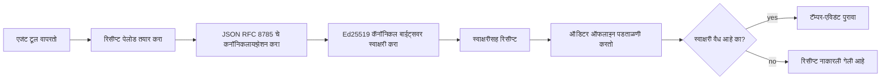
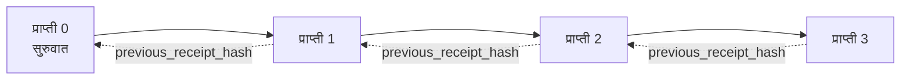

[धडा व्हिडिओ पहा: क्रिप्टोग्राफिक रिसीट्ससह AI एजंट्स सुरक्षित करणे](https://youtu.be/PLACEHOLDER_VIDEO_ID)

> _(धडा व्हिडिओ आणि थंबनेल Microsoft सामग्री टीमद्वारे मर्जीनंतर जोडले जातील, ज्याचा नमुना धडा 14 / 15 सारखा असेल.)_

# क्रिप्टोग्राफिक रिसीट्ससह AI एजंट्स सुरक्षित करणे

## परिचय

हा धडा पुढील गोष्टींवर प्रकाश टाकेल:

- अनुपालन, डिबगिंग आणि विश्वासासाठी AI एजंट्ससाठी ऑडिट ट्रेल का महत्त्वाचा आहे.
- क्रिप्टोग्राफिक रिसीट म्हणजे काय आणि तो अ-स्वाक्षरीत लॉग ओळींपासून कसा वेगळा आहे.
- plain Python मध्ये एजंटच्या टूल कॉलसाठी कसा स्वाक्षरीत रिसीट तयार करायचा.
- ऑफलाइन रिसीट कशी तपासावी आणि छेडछाड कशी ओळखावी.
- रिसीट्स कसे चेन करायचे जेणेकरून एखादा रिसीट काढल्यास किंवा पुन्हा क्रम लावल्यास साखळी तुटेल.
- रिसीट काय सिद्ध करतात आणि ते स्पष्टपणे काय सिद्ध करत नाहीत.

## शिकण्याच्या उद्दिष्टा

हा धडा पूर्ण केल्यानंतर, तुम्हाला माहित असेल कसे:

- एजंट क्रियांसाठी क्रिप्टोग्राफिक तपशीलवार नोंदी प्रेरित करणाऱ्या अपयश मोड्स ओळखायचे.
- कॅनॉनिकल JSON पेलोडवर Ed25519-स्वाक्षरी दिलेला रिसीट तयार करायचा.
- फक्त स्वाक्षरी करणाऱ्याची सार्वजनिक कळ वापरून स्वतंत्रपणे रिसीटची पडताळणी करायची.
- बदललेल्या रिसीटवर पडताळणी पुन्हा चालवून छेडछाड ओळखायची.
- रिसीट्सची हॅश-चेन साखळी तयार करायची आणि साखळी का महत्त्वाची आहे ते समजावून द्यायचे.
- रिसीट्स काय सिद्ध करतात (ऑट्रिब्युशन, अखंडता, क्रमवारी) आणि काय सिद्ध करत नाहीत (क्रियेची शुद्धता, धोरणाची बरोबरी).

## समस्या: तुमच्या एजंटची ऑडिट ट्रेल

समजा तुम्ही Contoso Travel साठी AI एजंट तैनात केला आहे. एजंट ग्राहकांच्या विनंत्या वाचतो, फ्लाइट्स API कॉल करतो आणि ग्राहकाच्या वतीने सीट बुक करतो. मागील तिमाहीत, एजंटने 50,000 बुकिंग्स प्रक्रिया केली.

आज एक ऑडिटर येतो. तो एक सोपा प्रश्न विचारतो: "तुमचा एजंट काय केलाय ते दाखवा."

तुम्ही तुमची लॉग फाइल्स दे करता. ऑडिटर त्या तपासतो आणि कठीण प्रश्न विचारतो: "मला कशी खात्री होईल की हे लॉग संपादित केलेले नाहीत?"

ही ऑडिट-ट्रेलची समस्या आहे. आजच्या बहुतेक एजंट तैनातींमध्ये अवलंबले जाते:

- **अॅप्लिकेशन लॉग्स**: एजंट स्वतः लिहितो, फाईल-सिस्टम प्रवेश असलेल्या कोणालाही संपादित करता येतात.
- **क्लाउड लॉगिंग सेवा**: प्लॅटफॉर्म पातळीवर छेडछाड दिसते पण केवळ जर ऑडिटरला प्लॅटफॉर्म ऑपरेटरवर विश्वास असेल तर.
- **डेटाबेस ट्रांजॅक्शन लॉग्स**: डेटाबेस बदलांसाठी योग्य पण स्वातंत्र्य टूल कॉलसाठी नाही.

यापैकी कोणतेही प्रश्नाच्या उत्तरासाठी एखाद्या व्यक्तीवर (तुम्ही, तुमचा क्लाउड प्रदाता, तुमचा डेटाबेस विक्रेता) विश्वास ठेवण्याशिवाय ऑडिटरला मदत करू शकत नाही. अंतर्गत वापरासाठी ते सहसा स्वीकार्य आहे, पण नियामक कामासाठी (अर्थव्यवस्था, आरोग्यसेवा, EU AI कायद्याच्या अधीन असलेल्या कामासाठी) ते योग्य नाही.

क्रिप्टोग्राफिक रिसीट्स प्रत्येक एजंट क्रिया स्वतंत्रपणे पडताळणीयोग्य करून ही समस्या सोडवतात. ऑडिटरला तुमच्यावर विश्वास ठेवण्याची गरज नाही. त्यांना फक्त तुमची सार्वजनिक कळ आणि रिसीट पाहिजे.

## क्रिप्टोग्राफिक रिसीट म्हणजे काय?

रिसीट हा एक JSON ऑब्जेक्ट आहे जो एजंटने काय केले हे नोंदवतो, डिजिटल स्वाक्षरीने स्वाक्षरीत केलेला.


```mermaid
flowchart LR
    A[एजंट टूल वापरतो] --> B[रिसीप्ट पेलोड तयार करा]
    B --> C[JSON RFC 8785 चे कनॉनिकलायझेशन करा]
    C --> E[Ed25519 कॅनॉनिकल बाईट्सवर स्वाक्षरी करा]
    E --> F[स्वाक्षरीसह रिसीप्ट]
    F --> G[ऑडिटर ऑफलाइन पडताळणी करतो]
    G --> H{स्वाक्षरी वैध आहे का?}
    H -- yes --> I[टॅम्पर-एविडंट पुरावा]
    H -- no --> J[रिसीप्ट नाकारली गेली आहे]
```

एक किमान रिसीट अशी दिसते:

```json
{
  "type": "agent.tool_call.v1",
  "agent_id": "contoso-travel-bot",
  "tool_name": "lookup_flights",
  "tool_args_hash": "sha256:a3f9c1...",
  "result_hash": "sha256:7b2e1d...",
  "policy_id": "contoso-travel-policy-v3",
  "timestamp": "2026-04-25T14:30:00Z",
  "sequence": 47,
  "previous_receipt_hash": "sha256:9d4e6a...",
  "signature": {
    "alg": "EdDSA",
    "sig": "c5af83...",
    "public_key": "8f3b2c..."
  }
}
```

तीन गुणधर्म हे कार्य करीत आहेत:

1. **स्वाक्षरी**. रिसीट एजंटच्या गेटवेने Ed25519 खासगी की वापरून स्वाक्षरी केली आहे. सार्वजनिक की असलेल्या कोणालाही ऑफलाइन स्वाक्षरी पडताळता येते. एखाद्या फील्डमध्ये छेडछाड केल्याने स्वाक्षरी अयोग्य ठरते.

2. **कॅनॉनिकल एनकोडिंग**. स्वाक्षरी करण्यापूर्वी, रिसीट JSON Canonicalization Scheme (JCS, RFC 8785) वापरून सिरीयलाइज़ केली जाते. त्यामुळे दोन वेगवेगळ्या अमलांमधून तयार झालेला एकसारखा लॉजिकल रिसीट बाइट-ओळखीच्या स्वरूपातच तयार होतो. कॅनॉनिकलाइझेशनशिवाय, वेगवेगळे JSON सिरीयलाइझर वेगळ्या स्वाक्षऱ्या देतील.

3. **हॅश चेनिंग**. `previous_receipt_hash` फील्ड प्रत्येक रिसीटला आधीच्या रिसीटशी जोडते. एखादा रिसीट काढल्यास किंवा याचा क्रम बदलल्यास त्यानंतर आलेल्या सर्व रिसीट्स तुटतात. छेडछाड साखळी स्तरावर दिसून येते जरी वैयक्तिक स्वाक्षऱ्या ओळखल्या गेल्या असतील.

या गुणधर्मांमुळे तीन हमी मिळतात:

- **ऑट्रिब्युशन**: ही की या सामग्रीवर स्वाक्षरी केली.
- **अखंडता**: स्वाक्षरी नंतर सामग्री बदलली नाही.
- **क्रमवारी**: ही रिसीट त्या रिसीटनंतर साखळीत आली.

## Python मध्ये रिसीट तयार करणे

रिसीट तयार करण्यासाठी तुम्हाला कोणतीही विशेष लायब्ररी लागत नाही. क्रिप्टोग्राफिक प्रिमिटिव्ह्स सहज उपलब्ध आहेत आणि लॉजिक काही ओळींचे Python कोड आहे.

`code_samples/18-signed-receipts.ipynb` मधील हाताळणी व्यायाम संपूर्ण प्रवाह दाखवते. संक्षेपित आवृत्ती:

```python
import json
import hashlib
import base64
from nacl import signing
from jcs import canonicalize  # RFC 8785 कॅनोनिकल JSON

def b64url_nopad(data: bytes) -> str:
    return base64.urlsafe_b64encode(data).decode("ascii").rstrip("=")

def sha256_canonical(obj) -> str:
    """SHA-256 of a Python object's JCS-canonical JSON form."""
    return f"sha256:{hashlib.sha256(canonicalize(obj)).hexdigest()}"

# साइनिंग की तयार करा किंवा लोड करा (उत्पादनात, की वॉल्टमध्ये साठवा)
signing_key = signing.SigningKey.generate()
verify_key = signing_key.verify_key

# रिसिप्ट पेलोड तयार करा (अभी सिग्नेचर नाही)
tool_args = {"origin": "SYD", "destination": "LAX"}
tool_result = [{"flight": "QF11", "price": 1850, "stops": 0}]

payload = {
    "type": "agent.tool_call.v1",
    "agent_id": "contoso-travel-bot",
    "tool_name": "lookup_flights",
    "tool_args_hash": sha256_canonical(tool_args),
    "result_hash": sha256_canonical(tool_result),
    "policy_id": "contoso-travel-policy-v3",
    "timestamp": "2026-04-25T14:30:00Z",
    "sequence": 0,
    "previous_receipt_hash": None,
}

# कॅनोनिकलाइज करा आणि JCS बाइट्स थेट सायन करा. PureEdDSA अंतर्गत हॅशेस करते.
canonical_bytes = canonicalize(payload)
signature_bytes = signing_key.sign(canonical_bytes).signature

# संरचित स्वाक्षरी ऑब्जेक्ट जोडा.
receipt = {
    **payload,
    "signature": {
        "alg": "EdDSA",
        "sig": b64url_nopad(signature_bytes),
        "public_key": b64url_nopad(bytes(verify_key)),
    },
}
```

हा संपूर्ण स्वाक्षरी प्रक्रिया आहे. नोटबुकमधील व्यायाम प्रत्येक टप्पा दाखवतो.

## रिसीट तपासणी आणि छेडछाड शोधणे

पडताळणी उलटी क्रिया आहे:

```python
import base64
import hashlib
from nacl import signing
from nacl.exceptions import BadSignatureError
from jcs import canonicalize

def b64url_decode(s: str) -> bytes:
    padding = "=" * ((4 - len(s) % 4) % 4)
    return base64.urlsafe_b64decode(s + padding)

def verify_receipt(receipt: dict) -> bool:
    # स्वाक्षरी हा एक संरचित ऑब्जेक्ट आहे: {"alg", "sig", "public_key"}.
    sig_obj = receipt.get("signature")
    if not sig_obj or sig_obj.get("alg") != "EdDSA":
        return False

    # त्याचा पुन्हा तयार करा जो प्रत्यक्षात सही केला गेला होता (स्वाक्षरी वगळता सर्व काही).
    payload = {k: v for k, v in receipt.items() if k != "signature"}

    canonical_bytes = canonicalize(payload)

    try:
        verify_key = signing.VerifyKey(b64url_decode(sig_obj["public_key"]))
        verify_key.verify(canonical_bytes, b64url_decode(sig_obj["sig"]))
        return True
    except BadSignatureError:
        return False
```

ही फंक्शन रिसीट घेतो आणि स्वाक्षरी वैध असल्यास `True` परत करतो, अन्यथा `False`. कोणताही नेटवर्क कॉल नाही, कोणत्याही तृतीय पक्षावर कोणताही विश्वास आवश्यक नाही.

छेडछाड शोधण्याचे प्रात्यक्षिक पाहण्यासाठी, नोटबुक:

1. वैध रिसीट तयार करून पडताळणी होण्याची खात्री करतो.
2. `tool_args_hash` फील्डमधील एक बाइट बदलतो.
3. पडताळणी पुन्हा चालवून अपयश पाहतो.

हे प्रात्यक्षिक दाखवते की रिसीट छेडछाड-प्रतिबंधक आहेत: कोणतीही थोडक्यात असलेलीही फेरफार स्वाक्षरी तोडते.

## बहु-स्टेप एजंटसाठी रिसीट्सची साखळी

एकच स्वाक्षरी दिलेला रिसीट एका क्रियेला सुरक्षित करतो. रिसीट्सची साखळी एक अनुक्रम सुरक्षित करते.


```mermaid
flowchart LR
    R0[प्राप्ती 0<br/>सुरुवात] --> R1[प्राप्ती 1]
    R1 --> R2[प्राप्ती 2]
    R2 --> R3[प्राप्ती 3]
    R1 -. previous_receipt_hash .-> R0
    R2 -. previous_receipt_hash .-> R1
    R3 -. previous_receipt_hash .-> R2
```

प्रत्येक रिसीट आधीच्या रिसीटचा हॅश रेकॉर्ड करतो. रिसीट 2 गुपचूप काढायचा असल्यास हल्लेखोरला:

- रिसीट 3 च्या `previous_receipt_hash` फील्डमध्ये बदल करावा लागेल (स्वाक्षरी तुटेल), किंवा
- रिसीट 3 वर नवीन स्वाक्षरी बनवावी लागेल (एजंटच्या खासगी कीची गरज).

जर खासगी की हार्डवेअर की वॉल्टमध्ये असेल आणि तुम्ही प्रत्येक रिसीटसह सार्वजनिक की प्रसिद्ध करत असाल, तर दोन्ही हल्ले अनपेक्षितपणे पकडले जातील.

नोटबुकमध्ये दाखवले आहे:

1. तीन रिसीट्सची साखळी तयार करण्याची प्रक्रिया.
2. प्रत्येक रिसीटचा `previous_receipt_hash` प्रत्यक्ष हॅशशी जुळतो का ते तपासणे.
3. मध्ये एखाद्या रिसीटबरोबर छेडछाड करून साखळी तुटल्याचे पाहणे.

असा ऑडिट ट्रेल तयार होतो ज्याची पडताळणी बाह्य ऑडिटर करू शकतो, कोणावरही विश्वास न ठेवता.

## रिसीट काय सिद्ध करतात (आणि काय नाही)

हा भाग या धड्याचा सर्वात महत्त्वाचा आहे. रिसीट्स शक्तिशाली आहेत पण त्यांची मर्यादा आहे.

**रसीद तीन गोष्टी सिद्ध करतात:**

1. **ऑट्रिब्युशन**: विशिष्ट कीने विशिष्ट पेलोडवर स्वाक्षरी केली.
2. **अखंडता**: पेलोड स्वाक्षरी नंतर बदललेला नाही.
3. **क्रमवारी**: ही रसीद त्या रसीटनंतर हॅश साखळीत आली.

**रसीद सिद्ध करत नाहीत:**

1. **योग्यतेची शुद्धता**: एजंटची क्रिया योग्य होती का. रसीद चुकीच्या उत्तरासाठीही स्वच्छपणे स्वाक्षरी केली जाऊ शकते.
2. **धोरणाचे पालन**: `policy_id` मध्ये नमूद धोरण मूल्यमापन केले का किंवा ते क्रिया अनुमती दिली असती का याची खात्री नाही. रसीद फक्त दावा केलेले नोंदवते, पालन केलेले नाही.
3. **कीव्यतिरिक्त ओळख**: रसीद "ही की या सामग्रीवर स्वाक्षरी केली" सांगते. "हा माणूस स्वीकृती दिला" नाही. व्यक्ती किंवा संस्थेशी की जोडण्यासाठी स्वतंत्र ओळख प्रणाली आवश्यक (डायरेक्टरी, सार्वजनिक की नोंदणी आदि).
4. **इनपुटची सत्यता**: जर एजंटला फेरफार केलेली विनंती मिळाली आणि ती क्रिया केली, तरी रसीद क्रियेची प्रामाणिक नोंद करेल. रसीत्स इनपुट पडताळणीच्या खालच्या स्तरावर आहेत, तिची जागा घेत नाहीत.

ही मर्यादा दोन कारणाने महत्त्वाची:

- ती तुम्हाला काय फायदेशीर आहे हे सांगते: एजंटच्या वर्तनाला ऑडिटयोग्य आणि छेडछाड-प्रतिबंधक बनवण्यासाठी, संघटनात्मक सीमारेषांमध्येही.
- ती तुम्हाला अजून कोणत्या स्तरांची गरज आहे ते सांगते: इनपुट पडताळणी (धडा 6), धोरण राबवणे (खाली संक्षिप्त), आणि ओळख प्रणाली (या धड्याच्या बाहेर).

एक सामान्य चूक अशी आहे की "आमच्याकडे रिसीट्स आहेत" याचा अर्थ "आम्ही नियमनाधीन आहोत" असा आहे. नाही. रिसीट्स हा पाया आहे. नियमन म्हणजे तुम्ही त्यावर तयार केलेली प्रणाली.

## मानवी स्वीकृत क्रिया सिद्ध करणे

वरील आयटम 3 स्वतःचा भाग आहे: क्रिया रसीत "ही की या सामग्रीवर स्वाक्षरी केली" म्हणते, पण "हा माणूस परवानगी दिला" नाही. उच्च-जोखमीच्या क्रिया (परतावे, विलोपन, वायर ट्रान्सफर) साठी, शासन चौकट इतर आवश्यक करत आहेत ही कमतरता स्पष्ट करणारी विधाने, जी तुम्ही या धड्यातील तंत्रांसह तयार करू शकता.

पुढील नोटबुक `code_samples/human-authorization-receipts.ipynb` दुसऱ्या प्रकारचा रिसीट जोडतो, `human.approval.v1`, धड्यातील रिसीट्सच्या फाटलेल्या स्वरूपात (Ed25519 सह टाईप केलेला पेलोड जे कॅनॉनिकल JCS बाइट्सवर स्वाक्षरीत आहे, `signature` ऑब्जेक्ट स्वाक्षरीत बाइट्सच्या बाहेर). नामांकित मंजूरकर्ता संपूर्ण कॅनॉनिकल क्रिया आणि त्याचा डायक्ट स्वाक्षरीतो; एजंटची क्रिया रसीत त्याच क्रिया डायक्ट आणि `parent_approval_ref` घेऊन येते, मंजुरीचा `receipt_hash`, ज्यास `previous_receipt_hash` सारखे वापरले जाते. एक `verify_chain` दोन्ही घटकांचे स्वतंत्र पिन केलेल्या की नोंदणीखाली पडताळणी करतो (मंजूरकर्ता की विरुद्ध एजंट की), त्यामुळे कोड मार्ग सामायिक पण प्राधिकरण वेगळे असतात.

या गुणधर्माचा अर्थ व्यवस्थित सांगायचा तर: *मानवाने ही विशिष्ट क्रिया मंजूर केली आणि एजंटने तीच मंजूर केलेली क्रिया अंमलात आणली.* नोटबुकमध्ये नाकारण्याचे उदाहरणे या गुणधर्माला फक्त दावा नसून वास्तविक बनवितात:

- पारंपरिक संच: छेडछाड, गोंधळलेला बदलवर्ग, पुनरावृत्ती, दोन्ही बाजूंच्या बनावट की, चुकीचा इनपुट;
- **जुनी प्राधिकरण**: स्वाक्षरी जी अजून पडताळते पण नाकारली जाते कारण धोरण आवृत्ती बदलली, मंजूरकर्ता की पिन नोंदणीतून काढली गेली, किंवा मंजुरी क्रियान्वयनापूर्वी कालबाह्य झाली;
- **डाइजेस्ट बदल**: वैध स्वाक्षरी दिलेला क्रिया रसीत जो खऱ्या मंजुरीकडे निर्देश करतो पण वेगळी कॅनॉनिकल क्रिया बांधतो.

प्रत्येक अपयश वेगळ्या कारणाने नाकारले जाते, त्यामुळे ऑडिटरला समजते प्राधिकरण जुनी झाली की क्रिया बदली. नियम असा की: स्वाक्षरी केलेली मंजुरी स्वतःमध्ये प्राधिकरण नाही. प्राधिकरण तेव्हाच अस्तित्वात असते जेव्हा दोन्ही रसीट्स अजूनही तीच कॅनॉनिकल क्रिया क्रियान्वयन वेळी बांधतात. मानवी-स्वीकृती रसीत हा शैक्षणिक संयोजन आहे ज्याला हा धडा परिभाषित करतो, `draft-farley-acta-signed-receipts` ने परिभाषित केलेली रसीत प्रकार नाही.

## उत्पादन संदर्भ

या धड्यातील Python कोड इरादेनुसार कमी ठेवलेला आहे जेणेकरून तुम्ही प्रत्येक ओळ वाचून नेमके काय होते ते समजू शकता. उत्पादनात, तुमच्याकडे दोन पर्याय आहेत:

1. **क्रिप्टोग्राफिक प्रिमिटिव्ह्सवर थेट बांधा.** वर पाहिलेल्या 50 ओळी अनेक उपयोगांसाठी पर्याप्त आहेत. PyNaCl (Ed25519) आणि `jcs` पॅकेज (कॅनॉनिकल JSON) चांगल्या प्रकारे देखभाल आणि तपासलेली लायब्ररी आहेत.

2. **उत्पादनासाठी रिसीट लायब्ररी वापरा.** काही मुक्त स्रोत प्रकल्प त्याच नमुन्याने अतिरिक्त वैशिष्ट्यांसह (की रोटेशन, बॅच पडताळणी, JWK सेट वितरण, धोरण इंजिनसह समाकलन) अंमलबजावणी करतात:
   - स्वाक्षरी प्रक्रिया JCS आणि स्वाक्षरी-परिसर संहितांचा वापर स्वतंत्र IETF इंटरनेट-ड्राफ्टमध्ये करतो ([`draft-farley-acta-signed-receipts`](https://datatracker.ietf.org/doc/draft-farley-acta-signed-receipts/), आवृत्ती 02). या धड्यातील शिक्षणार्थी रिसीट ड्राफ्टच्या `{payload, signature}` आवरणापासून वेगळा आणि सुसंगत अंमलबजावणी म्हणून मांडलेला नाही. ड्राफ्ट सामान्य अमलासाठी सामायिक पडताळणी संच प्रसिद्ध करतो ([agent-governance-testvectors](https://github.com/ScopeBlind/agent-governance-testvectors)).
   - Microsoft Agent Governance Toolkit रिसीट्सला Cedar आधारित धोरण निर्णयांसह अपलोड करतो; त्या रेपॉझिटरीतील ट्यूटोरियल 33 पहा संपूर्ण उदाहरणासाठी.
   - `protect-mcp` (npm) आणि `@veritasacta/verify` (npm) पॅकेजेस रिसीट स्वाक्षरी व ऑफलाइन पडताळणीचे नोड-आधारित अंमलबजावणी पुरवतात, टॅम्पर-एव्हिडेंट ऑडिट ट्रेलसह कोणतीही MCP सर्व्हर व्रॅप करण्यासाठी, त्यात थांबलेली क्रिया मंजुरी रसीत सोबत आहे (वेब ऑथन समर्थित डेस्कटॉप प्रवाह), मानवी-परवानगी नोटबुकमधील समान परवानगी-रसीत नमुना.
   - **[nobulex](https://github.com/arian-gogani/nobulex)** Python SDK (`pip install nobulex`) Python मध्ये LangChain आणि CrewAI समाकलनांसह Ed25519 + JCS स्वाक्षरी नमुना पुरवतो, जसे क्रॉस-चाचणी सहाय्य हटलेले आणि [OWASP PR #2210](https://github.com/OWASP/CheatSheetSeries/pull/2210) कडून योगदान दिलेला अनुपालन नकाशा.

स्वतःचा कोड लिहायचा की लायब्ररी वापरायची हे निर्णय तुमच्या JWT लायब्ररीच्या निवडीप्रमाणे आहेत: दोन्ही अयोग्य नाहीत; लायब्ररी वेळ वाचवते आणि ऑडिट क्षेत्र कमी करते; तयार-करण्याचा मार्ग प्रत्येक प्रिमिटिव्ह समजण्यास भाग पाडतो. हा धडा तुम्हाला तयार-करण्याचा मार्ग शिकवतो जेणेकरून तुम्हाला दोन्ही पर्यायांची कळकळीची समज मिळेल.

## ज्ञान तपासणी

व्यायाम करण्यापूर्वी आपले आकलन तपासा.

**1. रसीत एजंटच्या खासगी Ed25519 कीने स्वाक्षरीत आहे. ऑडिटरकडे फक्त सार्वजनिक की आहे. ऑडिटर रसीत ऑफलाइन पडताळू शकतो का?**

<details>
<summary>उत्तर</summary>

होय. Ed25519 पडताळणीसाठी फक्त सार्वजनिक की आणि स्वाक्षरीत बाइट्स आवश्यक आहेत. कोणताही नेटवर्क कॉल नाही, कोणताही सेवा अवलंबित्व नाही. हाच गुणधर्म आहे ज्यामुळे रसीत्स कमी विश्वासाच्या, बहु-संस्थात्मक किंवा एयर-गॅप्ड ऑडिट सेटिंगमध्ये उपयुक्त ठरतात.
</details>

**2. हल्लेखोर रिसीटच्या `policy_id` फील्डमध्ये बदल करून ती अधिक परवानगी देणाऱ्या धोरणाखाली गेल्याचा दावा करतो. स्वाक्षरी मूळ पेलोडवर आहे. पडताळणीदरम्यान काय होते?**

<details>
<summary>उत्तर</summary>


पडताळणी अयशस्वी झाली. सही मूळ पेलोडच्या परंपरागत बाइट्सवर गणना केली गेली होती; कोणत्याही फील्डमध्ये बदल केल्याने हे बाइट्स बदलतात, ज्यामुळे सही अवैध होते. हल्लेखोराला नवीन वैध सही तयार करण्यासाठी खाजगी कीची गरज आहे, जी त्यांच्या कडे नाही.
</details>

**3. पावतीत कच्च्या арг्युमेंट्स आणि निकालाऐवजी `tool_args_hash` आणि `result_hash` का समाविष्ट आहेत?**

<details>
<summary>उत्तर</summary>

दोन कारणे. पहिले म्हणजे, पावती संग्रहित करणे किंवा ज्या वातावरणात प्रसारित करणे आवश्यक आहे जिथे कच्चे कंटेंट (PII, व्यवसाय डेटा) उघड होणे समस्या आहे. हॅशिंगमुळे पावती लहान राहते आणि सामग्री खासगी राहते; परीक्षक स्वतंत्ररित्या जतन केलेल्या वास्तविक सामग्रीची नकलहिशेबात हॅश तपासतो. दुसरे म्हणजे, हॅशची आकार निश्चित असतो; हॅशसह पावतीची आकार मर्यादित राहते, इनपुट्स आणि आउटपुट्स कितीही मोठे असले तरीही.
</details>

**4. `previous_receipt_hash` फील्ड प्रत्येक पावतीला त्याच्या मागील पावतीशी जोडते. जर हल्लेखोर साखळीत मधल्या एका पावतीला शांतपणे हटवित असेल, तर काय अवैध होते?**

<details>
<summary>उत्तर</summary>

हटविलेल्या नंतर आलेली प्रत्येक पावती. त्यांच्या `previous_receipt_hash` फील्ड आता वास्तविक साखळीशी जुळत नाही (कारण त्यांनी संदर्भित केलेली पावती आता अस्तित्वात नाही किंवा साखळी आता वेगळ्या मागील पावतीकडे निर्देश करते). हटवणे लपवण्यासाठी, हल्लेखोराला नंतरच्या प्रत्येक पावतीवर पुनर्सही करण्याची गरज आहे, ज्यासाठी खाजगी की आवश्यक आहे.
</details>

**5. एखादी पावती स्वच्छपणे पडताळली गेली. याचा अर्थ एजंटच्या क्रियेचा योग्य, मजबूत किंवा धोरणाशी अनुरूप असल्याचा पुरावा मिळतो का?**

<details>
<summary>उत्तर</summary>

नाही. वैध पावती तीन गोष्टी सिद्ध करते: मालकी (ही की या सामग्रीवर सही केली आहे), अखंडता (माहिती बदललेली नाही) आणि क्रमवारी (ही पावती त्या पावतीनंतर आली आहे). हे सिद्ध करत नाही की क्रिया योग्य होती, `policy_id` मध्ये नमूद धोरण प्रत्यक्षात मूल्यमापन झाले आहे, किंवा एजंटने प्रत्येक नियम पाळला आहे. पावत्या एजंटच्या वर्तनाला ऑडिट करण्यायोग्य बनवतात, नेहमीच योग्य नाही. हा धडा सर्वात महत्त्वाचा मर्यादा आहे.
</details>

## सरावाचा उपक्रम

`code_samples/18-signed-receipts.ipynb` उघडा आणि सर्व चार विभाग पूर्ण करा:

1. **विभाग 1:** तुमची पहिली पावती सही करा आणि पडताळणी करा.
2. **विभाग 2:** पावतीत फेरफार करा आणि पडताळणी अयशस्वी होणे पाहा.
3. **विभाग 3:** तीन-पावती साखळी तयार करा आणि साखळी अखंडता पडताळणी करा.
4. **विभाग 4:** Microsoft Agent Framework सह एजंटसाठी हा नमुना वापरा: टुल कॉलला पावती-स्वाक्षरीमध्ये घाला, नंतर स्वतंत्रपणे पावती पडताळणी करा.

**वाढीव आव्हान 1:** आपल्या पसंतीचा अतिरिक्त फील्ड घेऊन पावती स्कीमा वाढवा (उदा. ट्रेसिंगसाठी विनंती आयडी), कॅनॉनिकल स्वाक्षरी लॉजिक अपडेट करा आणि खात्री करा की पावती पडताळण्यांतून फेर फिरते. नंतर सही केल्यावर फील्डमध्ये बदल करा आणि पडताळणी अयशस्वी होते हे तपासा. यामुळे कॅनॉनिकल कोडिंगमधील प्रत्येक बाइट कशी सहीमध्ये योगदान देते हे समजायला जबरदस्त मदत होते.

**वाढीव आव्हान 2:** दोन पावत्या SHA-256 हॅश एकत्र करा (त्यांचे कॅनॉनिकल बाइट्स अंदाजे क्रमाने जोडून) आणि या हॅशला तिसऱ्या पावतीतील नवीन फील्ड म्हणून समाविष्ट करा, नंतर सही करा. खात्री करा की त्या तीनही पावत्या फेर फिरतात. तुम्ही फक्त एक-पायरी समावेश पुरावा तयार केला आहे: तिसरी पावती जवळ ठेवणारा कोणताही पुरावा देऊ शकतो की पहिली दोन पावत्या त्या वेळी अस्तित्वात होत्या, त्यांच्या सामग्री उघड न करता. हेच नमुना मोठ्या प्रमाणावर निवडक-प्रकटीकरण पावत्यांसाठी वापरला जातो (मर्कल कमिटमेंट्स, RFC 6962).

## निष्कर्ष

क्रिप्टोग्राफिक पावत्या AI एजंट्सना अशा ऑडिट ट्रेलची हमी देतात की:

- **स्वतंत्रपणे पडताळणीयोग्य:** कुठलाही पक्ष सार्वजनिक की वापरून पडताळणी करू शकतो, कोणत्याही सेवा अवलंबित्वाशिवाय.
- **बदल-प्रमाणिक:** कोणताही फेरफार सही अवैध करतो.
- **वाहक:** पावती एक छोटी JSON फाइल आहे; ती संग्रहित, प्रसारित आणि कुठेही पडताळणी केली जाऊ शकते.
- **मानके-अनुरूप:** Ed25519 (RFC 8032), JCS (RFC 8785), आणि SHA-256 यावर आधारित, हे सर्व मोठ्या प्रमाणावर वापरले जाणारे प्राथमिक घटक आहेत.

ते इनपुट पडताळणी, धोरण अंमलबजावणी किंवा ओळख संरچनेचा पर्याय नाहीत. ते त्या स्तरांसाठी पाया आहेत. जेव्हा तुम्ही नियंत्रित कार्यभारात, बहु-संगठन वर्कफ्लो मध्ये किंवा जिथे भविष्यातील परीक्षक तुम्हाला विश्वास ठेवेलच असे गृहित धरता येणार नाही अशा ठिकाणी एजंट्स तैनात करता, तेव्हा पावत्या ऑडिट ट्रेल प्रामाणिक ठेवण्याचे साधन आहे.

सर्वात महत्त्वाचा ठाव---पावत्या कोणाला काय सांगितले, केव्हा, हे सिद्ध करतात. ते काय सांगितले ते खरे किंवा बरोबर होते हे सिद्ध करत नाहीत. हा फरक काळजीपूर्वक ठेवा. हा प्रामाणिक उत्पत्ती प्रणाली आणि भ्रामक प्रणालीतील फरक आहे.

## उत्पादन तपासणी यादी

जेव्हा तुम्ही या धड्यापासून पदवीगतरित होऊन खऱ्या वातावरणात पावती-स्वाक्षरीकृत एजंट्स तैनात करण्यास तयार असाल:

- [ ] **स्वाक्षरी की विकसक लॅपटॉपवरून काढा.** Azure Key Vault, AWS KMS किंवा हार्डवेअर सुरक्षा मॉड्यूल वापरा. तुमच्या पावत्यांना सही करणारी खाजगी की कधीही स्रोत नियंत्रणात किंवा साधनेवर स्पष्टपणे जपली जाऊ नये.
- [ ] **पडताळणी सार्वजनिक की प्रकाशित करा.** परीक्षकांना ती ऑफलाइन पडताळणीसाठी आवश्यक आहे. प्रमाणित नमुना म्हणजे ओळखीचा URL वर JWK सेट (RFC 7517), उदा. `https://your-org.example.com/.well-known/agent-keys.json`.
- [ ] **साखळी बाह्यरित्या अँकर करा.** वेळोवेळी नवीनतम साखळी शीर्ष हॅश पारदर्शकता लॉगमध्ये लिहा (Sigstore Rekor, RFC 3161 टाइमस्टॅम्प प्राधिकरण, किंवा दुसरा अंतर्गत सिस्टम) जेणेकरून बाह्य पक्ष "ही साखळी त्या वेळी अस्तित्वात होती" हे पुष्टी करू शकेल.
- [ ] **पावत्या अपरिवर्तनीय ठेवा.** जोडत जाणा-या ब्लॉब स्टोरेज (Azure Storage सह अपरिवर्तनीय धोरणे, AWS S3 ऑब्जेक्ट लॉक) एखाद्या अंतर्गत व्यक्तीला इतिहास पुन्हा लिहिण्यापासून प्रतिबंधित करते.
- [ ] **धारणेचा कालावधी ठरवा.** अनेक अनुपालन नियम बहुवर्षीय धारणा मागतात. पावती वाढीची योजना करा (प्रत्येक पावती ~500 बाइट्स; दररोज 10K कॉल करणारा एजंट सुमारे 1.8 जीबी प्रति वर्ष तयार करतो).
- [ ] **पावत्या काय कव्हर करत नाहीत ते दस्तऐवजीकृत करा.** पावत्या मालकी, अखंडता आणि क्रमवारी सिद्ध करतात. तुमचा रनबुक अतिरिक्त नियंत्रण काय आहेत (इनपुट पडताळणी, धोरण अंमलबजावणी, रेट लिमिटिंग, ओळख संरचना) ते स्पष्टपणे नमूद केले पाहिजे जे पावत्यांसह तुमच्या शासकीय धोरणाच्या बाजूला आहेत.

### AI एजंट्स सुरक्षित करण्याबाबत अजून प्रश्न आहेत का?

[Microsoft Foundry Discord](https://aka.ms/ai-agents/discord) मध्ये सामील व्हा, इतर शिकणाऱ्यांशी भेटा, कार्यालयीन तासांत सहभागी व्हा, आणि तुमचे AI एजंट्स प्रश्नांची उत्तरे मिळवा.

## या धड्यापलीकडे

हा धडा एकेरी-पावती स्वाक्षरी आणि हॅश-चेन केलेल्या साखळ्यांचा आढावा घेतो. तेच प्राथमिक घटक अनेक अधिक प्रगत नमुन्यांमध्ये एकत्र येतात जे तुम्ही भेटू शकता जसे तुमचे शासकीय धोरण विकसित होते:

- **निवडक प्रकटीकरण.** जेव्हा पावतीची फील्ड्स स्वतंत्रपणे प्रतिबद्ध असतात (RFC 6962 शैलीतील मर्कल वृक्ष), तुम्ही विशिष्ट फील्ड्स विशिष्ट परीक्षकांना उघड करू शकता आणि बाकी अबदलले नाहीत हे सिद्ध करू शकता त्यांना प्रदर्शित न करता. उपयुक्त जेव्हा त्याच पावतीने दोन्ही सखोल ऑडिट (पूर्णत्व हवे आहे) आणि डेटा-मिनिमायझेशन नियमांचे पालन करणे आवश्यक असते, जसे GDPR (परीक्षकाला जितके आवश्यक तितकेच दाखवणे).
- **पावती रद्दीकरण.** जर स्वाक्षरी कीची चोरी झाली तर तुम्हाला त्या कीने स्वाक्षरी केलेल्या सर्व पावत्यांना विशिष्ट वेळेनंतर अविश्वसनीय म्हणून चिन्हांकित करण्याची गरज आहे. मानक नमुने: अल्पकालीन स्वाक्षरी की + प्रकाशित रद्दीकरण यादी, किंवा पारदर्शकता लॉग सह रद्दीकरण नोंदी.
- **द्विपक्षीय / विभागलेली-सही पावत्या.** काही अंमलबजावण्या स्वाक्षरी केलेला पेलोड कार्यान्वयनापूर्वी (`authorization_*`) आणि नंतर (`result_*`) अर्ध्या भागांमध्ये विभागतात, स्वतंत्र स्वाक्षरींसह, जेव्हा अधिकृत निर्णय आणि निरीक्षित निकाल वेगवेगळ्या पक्षांनी किंवा वेगवेगळ्या वेळी तयार केले जातात तेव्हा उपयुक्त. हे या धड्यात शिकविलेल्या पावती स्वरूपावर योगायोगाने येते.
- **पेलोड संयोजन.** पावतीत `result_hash` मध्ये जे काही बाइट्स टाकले जातात त्यावर सही होते. प्रत्यक्ष पेलोड्स अनेकदा एका टूल कॉलच्या निकालापेक्षा अधिक समृद्ध असतात: पूर्वनिर्णय विचार (मॉडेल अंदाज, पर्याय विचारले, पुरावे आणि त्याची पूर्णता, धोका स्थिती, जबाबदारी साखळी, गेट परिणाम) सर्व एका पेलोडमध्ये राहत असू शकतात, एकाच पावतीने सही केलेले. हे पावती फॉर्मॅट कमी ठेवते परंतु डोमेननुसार पेलोड स्कीमा विकसित होऊ देते.
- **आंतर-अंमलबजावणी सुसंगतता.** एकाच पावती फॉर्मॅटचे अनेक स्वतंत्र अंमलबजावण्या (Python, TypeScript, Rust, Go) सामायिक चाचणी संचांशी क्रॉस-पडताळणी करतात. स्वतःची अंमलबजावणी करीत असाल तर प्रकाशित संचांशी पडताळणी वायर सुसंगतता पुष्टी करते.
- **पोस्ट-क्वांटम स्थलांतर.** Ed25519 आज मोठ्या प्रमाणावर वापरला जातो पण क्वांटम-प्रतिरोधक नाही. पावती फॉर्मॅट अल्गोरिदम-अॅजाइल आहे: `signature.alg` फील्ड `ML-DSA-65` (NIST पोस्ट-क्वांटम स्वाक्षरी मानक) वाहू शकतो जेव्हा स्थलांतर आवश्यक असेल. द्वैतीय-सही पावत्या असलेल्या संक्रमण कालावधीसाठी योजना करा.

## अतिरिक्त संसाधने

- <a href="https://datatracker.ietf.org/doc/draft-farley-acta-signed-receipts/" target="_blank">IETF इंटरनेट-ड्राफ्ट: मशीन-टू-मशीन प्रवेश नियंत्रणासाठी स्वाक्षरी केलेल्या निर्णय पावत्या</a>
- <a href="https://learn.microsoft.com/azure/ai-studio/responsible-use-of-ai-overview" target="_blank">जबाबदार AI आढावा (Azure AI)</a>
- <a href="https://datatracker.ietf.org/doc/html/rfc8032" target="_blank">RFC 8032: एडवर्डस-कर्व डिजिटल स्वाक्षरी अल्गोरिदम (EdDSA)</a>
- <a href="https://datatracker.ietf.org/doc/html/rfc8785" target="_blank">RFC 8785: JSON कॅनॉनिकलायझेशन योजना (JCS)</a>
- <a href="https://datatracker.ietf.org/doc/html/rfc6962" target="_blank">RFC 6962: प्रमाणपत्र पारदर्शकता</a> (मर्कल-वृक्ष बांधणी जी निवडक-प्रकटीकरण पावत्यांसाठी वापरली जाते)
- <a href="https://github.com/microsoft/agent-governance-toolkit/blob/main/docs/tutorials/33-offline-verifiable-receipts.md" target="_blank">Microsoft Agent Governance Toolkit, ट्यूटोरियल 33: ऑफलाइन-पडताळणीयोग्य निर्णय पावत्या</a>
- <a href="https://github.com/ScopeBlind/agent-governance-testvectors" target="_blank">पावती फॉर्मॅटसाठी क्रॉस-अंमलबजावणी सुसंगतता चाचणी संच</a> (Apache-2.0)
- <a href="https://pynacl.readthedocs.io/" target="_blank">PyNaCl कागदपत्रीकरण</a> (Python मधील Ed25519)

## मागील धडा

[स्थानिक AI एजंट तयार करणे](../17-creating-local-ai-agents/README.md)

---

<!-- CO-OP TRANSLATOR DISCLAIMER START -->
**अस्वीकरण**:
हा दस्तऐवज AI भाषांतर सेवा [Co-op Translator](https://github.com/Azure/co-op-translator) चा वापर करून अनुवादित केला आहे. जरी आम्ही अचूकतेसाठी प्रयत्न करतो, तरी कृपया लक्षात घ्या की स्वयंचलित भाषांतरांमध्ये त्रुटी किंवा अचूकतेची कमतरता असू शकते. मूळ दस्तऐवज त्याच्या मूळ भाषेत अधिकृत स्रोत मानला पाहिजे. महत्त्वाची माहिती असल्यास, व्यावसायिक मानवी भाषांतराची शिफारस केली जाते. या भाषांतराच्या वापरामुळे उद्भवणाऱ्या कोणत्याही गैरसमज किंवा चुकीच्या अर्थलावणीसाठी आम्ही जबाबदार नाही.
<!-- CO-OP TRANSLATOR DISCLAIMER END -->