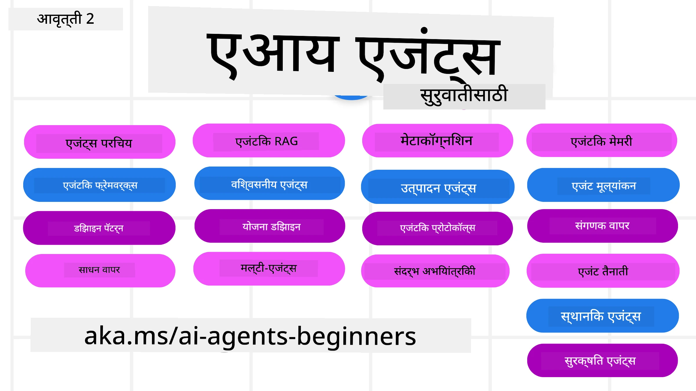

# AI एजंट्स फॉर बिगिनर्स - एक कोर्स



## एआय एजंट्स तयार करायला सुरुवात करण्यासाठी तुम्हाला जे काही माहित असायला हवे ते सर्व शिकवणारा कोर्स

[](https://github.com/microsoft/ai-agents-for-beginners/blob/master/LICENSE?WT.mc_id=academic-105485-koreyst)
[](https://GitHub.com/microsoft/ai-agents-for-beginners/graphs/contributors/?WT.mc_id=academic-105485-koreyst)
[](https://GitHub.com/microsoft/ai-agents-for-beginners/issues/?WT.mc_id=academic-105485-koreyst)
[](https://GitHub.com/microsoft/ai-agents-for-beginners/pulls/?WT.mc_id=academic-105485-koreyst)
[](http://makeapullrequest.com?WT.mc_id=academic-105485-koreyst)

### 🌐 बहुभाषिक समर्थन

#### GitHub Action द्वारे समर्थित (स्वयंचलित & नेहमी अपडेट राहणारे)

<!-- CO-OP TRANSLATOR LANGUAGES TABLE START -->
[Arabic](../ar/README.md) | [Bengali](../bn/README.md) | [Bulgarian](../bg/README.md) | [Burmese (Myanmar)](../my/README.md) | [Chinese (Simplified)](../zh-CN/README.md) | [Chinese (Traditional, Hong Kong)](../zh-HK/README.md) | [Chinese (Traditional, Macau)](../zh-MO/README.md) | [Chinese (Traditional, Taiwan)](../zh-TW/README.md) | [Croatian](../hr/README.md) | [Czech](../cs/README.md) | [Danish](../da/README.md) | [Dutch](../nl/README.md) | [Estonian](../et/README.md) | [Finnish](../fi/README.md) | [French](../fr/README.md) | [German](../de/README.md) | [Greek](../el/README.md) | [Hebrew](../he/README.md) | [Hindi](../hi/README.md) | [Hungarian](../hu/README.md) | [Indonesian](../id/README.md) | [Italian](../it/README.md) | [Japanese](../ja/README.md) | [Kannada](../kn/README.md) | [Khmer](../km/README.md) | [Korean](../ko/README.md) | [Lithuanian](../lt/README.md) | [Malay](../ms/README.md) | [Malayalam](../ml/README.md) | [Marathi](./README.md) | [Nepali](../ne/README.md) | [Nigerian Pidgin](../pcm/README.md) | [Norwegian](../no/README.md) | [Persian (Farsi)](../fa/README.md) | [Polish](../pl/README.md) | [Portuguese (Brazil)](../pt-BR/README.md) | [Portuguese (Portugal)](../pt-PT/README.md) | [Punjabi (Gurmukhi)](../pa/README.md) | [Romanian](../ro/README.md) | [Russian](../ru/README.md) | [Serbian (Cyrillic)](../sr/README.md) | [Slovak](../sk/README.md) | [Slovenian](../sl/README.md) | [Spanish](../es/README.md) | [Swahili](../sw/README.md) | [Swedish](../sv/README.md) | [Tagalog (Filipino)](../tl/README.md) | [Tamil](../ta/README.md) | [Telugu](../te/README.md) | [Thai](../th/README.md) | [Turkish](../tr/README.md) | [Ukrainian](../uk/README.md) | [Urdu](../ur/README.md) | [Vietnamese](../vi/README.md)

> **स्थानिक क्लोन करायचे का?**
>
> हा रेपॉजिटरी ५०+ भाषा भाषांतरांसह आहे ज्यामुळे डाउनलोडचा आकार मोठा होतो. भाषांतरांशिवाय क्लोन करण्यासाठी sparse checkout वापरा:
>
> **Bash / macOS / Linux:**
> ```bash
> git clone --filter=blob:none --sparse https://github.com/microsoft/ai-agents-for-beginners.git
> cd ai-agents-for-beginners
> git sparse-checkout set --no-cone '/*' '!translations' '!translated_images'
> ```
>
> **CMD (Windows):**
> ```cmd
> git clone --filter=blob:none --sparse https://github.com/microsoft/ai-agents-for-beginners.git
> cd ai-agents-for-beginners
> git sparse-checkout set --no-cone "/*" "!translations" "!translated_images"
> ```
>
> यामुळे तुम्हाला कोर्स पूर्ण करण्यासाठी सर्वकाही जलद डाउनलोडसह मिळेल.
<!-- CO-OP TRANSLATOR LANGUAGES TABLE END -->

**जर तुम्हाला अधिक भाषांतर भाषा समर्थित करायच्या असतील तर त्या [येथे](https://github.com/Azure/co-op-translator/blob/main/getting_started/supported-languages.md) सूचीबद्ध आहेत.**

[](https://GitHub.com/microsoft/ai-agents-for-beginners/watchers/?WT.mc_id=academic-105485-koreyst)
[](https://GitHub.com/microsoft/ai-agents-for-beginners/network/?WT.mc_id=academic-105485-koreyst)
[](https://GitHub.com/microsoft/ai-agents-for-beginners/stargazers/?WT.mc_id=academic-105485-koreyst)

[](https://discord.gg/nTYy5BXMWG)


## 🌱 सुरुवात

हा कोर्स AI एजंट्स तयार करण्याच्या मूलभूत गोष्टींचा अभ्यास करतो. प्रत्येक धडा त्याचा स्वतःचा विषय असतो, त्यामुळे तुम्हाला जिथे आवडेल तिथून सुरुवात करा!

या कोर्ससाठी बहुभाषिक समर्थन आहे. आमच्या [उपलब्ध भाषाशी येथे](#-multi-language-support) जा.

जर तुम्हाला Generative AI मॉडेल्ससह प्रथमच काम करायचे असेल तर आमचा [Generative AI For Beginners](https://aka.ms/genai-beginners) कोर्स पाहा, ज्यात GenAI सह निर्मितीसाठी २१ धडे आहेत.

[हा रेपॉजिटरी ⭐ (स्टार)](https://docs.github.com/en/get-started/exploring-projects-on-github/saving-repositories-with-stars?WT.mc_id=academic-105485-koreyst) करायला आणि [फोर्क](https://github.com/microsoft/ai-agents-for-beginners/fork) करायला विसरू नका. त्यापुढे कोड चालवता येईल.

### इतर शिकणाऱ्यांना भेटा, तुमचे प्रश्न सोडवून घ्या

जर तुम्हाला अडचण आली किंवा AI एजंट्स तयार करताना काही प्रश्न असतील तर, [Microsoft Foundry Discord](https://aka.ms/ai-agents/discord) मधील आमच्या समर्पित डिस्कॉर्ड चॅनेलला जा.

### काय आवश्यक आहे  

या कोर्समधील प्रत्येक धड्यात कोड उदाहरणे दिलेली आहेत, जी code_samples फोल्डरमध्ये सापडतील. तुम्ही [हा रेपॉजिटरी फोर्क](https://github.com/microsoft/ai-agents-for-beginners/fork) करून स्वतःचा कॉपी तयार करू शकता.

हे उदाहरण कोड Microsoft Agent Framework आणि Azure AI Foundry Agent Service V2 वापरतात:

- [Microsoft Foundry](https://aka.ms/ai-agents-beginners/ai-foundry) - Azure अकाउंट आवश्यक

हा कोर्स Microsoft कडून पुढील AI Agent फ्रेमवर्क्स आणि सेवा वापरतो:

- [Microsoft Agent Framework (MAF)](https://aka.ms/ai-agents-beginners/agent-framework)
- [Azure AI Foundry Agent Service V2](https://aka.ms/ai-agents-beginners/ai-agent-service)

काही कोड नमुने [MiniMax](https://platform.minimaxi.com/) सारख्या OpenAI-सुसंगत पर्यायांना देखील समर्थन देतात, जे मोठ्या संदर्भांच्या मॉडेल्स (२,०४,००० टोकनपर्यंत) देतात. कॉन्फिगरेशन तपशीलांसाठी [Course Setup](./00-course-setup/README.md) पहा.

कोड चालवण्याबाबत अधिक माहितीसाठी [Course Setup](./00-course-setup/README.md) येथे जा.

## 🙏 मदत करू इच्छिता?

तुमच्याकडे सूचना आहेत का किंवा लेखन अथवा कोडमध्ये चूक आढळली आहे का? [इश्यू उघडा](https://github.com/microsoft/ai-agents-for-beginners/issues?WT.mc_id=academic-105485-koreyst) किंवा [पुल रिक्वेस्ट तयार करा](https://github.com/microsoft/ai-agents-for-beginners/pulls?WT.mc_id=academic-105485-koreyst)


## 📂 प्रत्येक धड्यात समाविष्ट आहे

- README मध्ये लेखी धडा व लहान व्हिडिओ
- Microsoft Agent Framework सह Azure AI Foundry वापरून Python कोड नमुने
- तुमचे शिक्षण सुरू ठेवण्यासाठी अतिरिक्त स्त्रोतांची लिंक


## 🗃️ धडे

| **धडा**                                     | **मजकूर व कोड**                                  | **व्हिडिओ**                                                    | **अतिरिक्त शिक्षण**                                                                      |
|----------------------------------------------|----------------------------------------------------|------------------------------------------------------------|------------------------------------------------------------------------------------------|
| AI एजंट्स आणि एजंट वापर प्रकरणांची ओळख       | [Link](./01-intro-to-ai-agents/README.md)          | [Video](https://youtu.be/3zgm60bXmQk?si=z8QygFvYQv-9WtO1)  | [Link](https://aka.ms/ai-agents-beginners/collection?WT.mc_id=academic-105485-koreyst)   |
| AI एजंटिक फ्रेमवर्क्सची तपासणी                 | [Link](./02-explore-agentic-frameworks/README.md)  | [Video](https://youtu.be/ODwF-EZo_O8?si=Vawth4hzVaHv-u0H)  | [Link](https://aka.ms/ai-agents-beginners/collection?WT.mc_id=academic-105485-koreyst)   |
| AI एजंटिक डिझाइन पॅटर्न्स समजून घेणे            | [Link](./03-agentic-design-patterns/README.md)     | [Video](https://youtu.be/m9lM8qqoOEA?si=BIzHwzstTPL8o9GF)  | [Link](https://aka.ms/ai-agents-beginners/collection?WT.mc_id=academic-105485-koreyst)   |
| टूल वापर डिझाइन पॅटर्न                          | [Link](./04-tool-use/README.md)                    | [Video](https://youtu.be/vieRiPRx-gI?si=2z6O2Xu2cu_Jz46N)  | [Link](https://aka.ms/ai-agents-beginners/collection?WT.mc_id=academic-105485-koreyst)   |
| एजंटिक RAG                                    | [Link](./05-agentic-rag/README.md)                 | [Video](https://youtu.be/WcjAARvdL7I?si=gKPWsQpKiIlDH9A3)  | [Link](https://aka.ms/ai-agents-beginners/collection?WT.mc_id=academic-105485-koreyst)   |
| विश्वासार्ह AI एजंट्स तयार करणे                      | [Link](./06-building-trustworthy-agents/README.md) | [Video](https://youtu.be/iZKkMEGBCUQ?si=jZjpiMnGFOE9L8OK ) | [Link](https://aka.ms/ai-agents-beginners/collection?WT.mc_id=academic-105485-koreyst)   |
| नियोजन डिझाइन पॅटर्न                            | [Link](./07-planning-design/README.md)             | [Video](https://youtu.be/kPfJ2BrBCMY?si=6SC_iv_E5-mzucnC)  | [Link](https://aka.ms/ai-agents-beginners/collection?WT.mc_id=academic-105485-koreyst)   |
| मल्टी-एजंट डिझाइन पॅटर्न                        | [Link](./08-multi-agent/README.md)                 | [Video](https://youtu.be/V6HpE9hZEx0?si=rMgDhEu7wXo2uo6g)  | [Link](https://aka.ms/ai-agents-beginners/collection?WT.mc_id=academic-105485-koreyst)   |
| मेटाकॉग्निशन डिझाईन पॅटर्न                 | [Link](./09-metacognition/README.md)               | [Video](https://youtu.be/His9R6gw6Ec?si=8gck6vvdSNCt6OcF)  | [Link](https://aka.ms/ai-agents-beginners/collection?WT.mc_id=academic-105485-koreyst) |
| उत्पादनातील AI एजंट्स                      | [Link](./10-ai-agents-production/README.md)        | [Video](https://youtu.be/l4TP6IyJxmQ?si=31dnhexRo6yLRJDl)  | [Link](https://aka.ms/ai-agents-beginners/collection?WT.mc_id=academic-105485-koreyst) |
| एजंटिक प्रोटोकॉल वापरणे (MCP, A2A आणि NLWeb) | [Link](./11-agentic-protocols/README.md)           | [Video](https://youtu.be/X-Dh9R3Opn8)                                 | [Link](https://aka.ms/ai-agents-beginners/collection?WT.mc_id=academic-105485-koreyst) |
| AI एजंटसाठी संदर्भ अभियांत्रिकी            | [Link](./12-context-engineering/README.md)         | [Video](https://youtu.be/F5zqRV7gEag)                                 | [Link](https://aka.ms/ai-agents-beginners/collection?WT.mc_id=academic-105485-koreyst) |
| एजंटिक मेमरीचे व्यवस्थापन                      | [Link](./13-agent-memory/README.md)     |      [Video](https://youtu.be/QrYbHesIxpw?si=vZkVwKrQ4ieCcIPx)                                                      |                                                                                        |
| मायक्रोसॉफ्ट एजंट फ्रेमवर्कचा शोध                          | [Link](./14-microsoft-agent-framework/README.md)                            |                                                            |                                                                                        |
| संगणक वापर एजंट तयार करणे (CUA)           | [Link](./15-browser-use/README.md)     |                                                            | [Link](https://docs.browser-use.com/examples/templates/playwright-integration)         |
| स्केलेबल एजंट्स नियुक्त करणे                    | लवकरच येत आहे                            |                                                            |                                                                                        |
| स्थानिक AI एजंट तयार करणे                     | लवकरच येत आहे                               |                                                            |                                                                                        |
| AI एजंट्स सुरक्षित करणे                           | [Link](./18-securing-ai-agents/README.md)  |                                                            | [Link](https://aka.ms/ai-agents-beginners/collection?WT.mc_id=academic-105485-koreyst) |

## 🎒 इतर कोर्सेस

आमची टीम इतर कोर्सेस तयार करते! तपासून पहा:

<!-- CO-OP TRANSLATOR OTHER COURSES START -->
### लँगचेन
[](https://aka.ms/langchain4j-for-beginners)
[](https://aka.ms/langchainjs-for-beginners?WT.mc_id=m365-94501-dwahlin)
[](https://github.com/microsoft/langchain-for-beginners?WT.mc_id=m365-94501-dwahlin)
---

### अॅझ्यूर / एज / MCP / एजंट्स
[](https://github.com/microsoft/AZD-for-beginners?WT.mc_id=academic-105485-koreyst)
[](https://github.com/microsoft/edgeai-for-beginners?WT.mc_id=academic-105485-koreyst)
[](https://github.com/microsoft/mcp-for-beginners?WT.mc_id=academic-105485-koreyst)
[](https://github.com/microsoft/ai-agents-for-beginners?WT.mc_id=academic-105485-koreyst)

---
 
### जनरेटिव AI साखळी
[](https://github.com/microsoft/generative-ai-for-beginners?WT.mc_id=academic-105485-koreyst)
[-9333EA?style=for-the-badge&labelColor=E5E7EB&color=9333EA)](https://github.com/microsoft/Generative-AI-for-beginners-dotnet?WT.mc_id=academic-105485-koreyst)
[-C084FC?style=for-the-badge&labelColor=E5E7EB&color=C084FC)](https://github.com/microsoft/generative-ai-for-beginners-java?WT.mc_id=academic-105485-koreyst)
[-E879F9?style=for-the-badge&labelColor=E5E7EB&color=E879F9)](https://github.com/microsoft/generative-ai-with-javascript?WT.mc_id=academic-105485-koreyst)

---
 
### कोअर शिक्षण
[](https://aka.ms/ml-beginners?WT.mc_id=academic-105485-koreyst)
[](https://aka.ms/datascience-beginners?WT.mc_id=academic-105485-koreyst)
[](https://aka.ms/ai-beginners?WT.mc_id=academic-105485-koreyst)
[](https://github.com/microsoft/Security-101?WT.mc_id=academic-96948-sayoung)
[](https://aka.ms/webdev-beginners?WT.mc_id=academic-105485-koreyst)
[](https://aka.ms/iot-beginners?WT.mc_id=academic-105485-koreyst)
[](https://github.com/microsoft/xr-development-for-beginners?WT.mc_id=academic-105485-koreyst)

---
 
### कॉपायलट साखळी
[](https://aka.ms/GitHubCopilotAI?WT.mc_id=academic-105485-koreyst)
[](https://github.com/microsoft/mastering-github-copilot-for-dotnet-csharp-developers?WT.mc_id=academic-105485-koreyst)
[](https://github.com/microsoft/CopilotAdventures?WT.mc_id=academic-105485-koreyst)
<!-- CO-OP TRANSLATOR OTHER COURSES END -->

## 🌟 समुदायाचे आभार

एजंटिक RAG दाखवणाऱ्या महत्त्वाच्या कोड नमुन्यांबद्दल [Shivam Goyal](https://www.linkedin.com/in/shivam2003/) यांचे आभार.

## योगदान देणे

हे प्रकल्प योगदान आणि सूचना स्वागत करत आहे. बहुतेक योगदानासाठी, तुम्हाला एक
Contributor License Agreement (CLA) स्वीकारावे लागते ज्यात तुम्ही दर्शवता की तुम्हाला हे करणे योग्य आहे आणि तुम्ही प्रत्यक्षात आमच्याकडे
तुमच्या योगदानाचा वापर करण्याचा अधिकार दिला आहे. तपशीलांसाठी येथे भेट द्या: <https://cla.opensource.microsoft.com>.

जेव्हा तुम्ही पुल विनंती सबमिट करता, तेव्हा CLA बोट आपोआप तपासेल की तुम्हाला
CLA देणे आवश्यक आहे का आणि PR योग्यरित्या सजवेल (उदा., स्थिती तपासणी, टिप्पणी). फक्त
बोटने दिलेल्या सूचनांचे पालन करा. आम्ही वापरतो त्या सर्व रेपोमध्ये तुम्हाला हे एकदाच करावे लागेल.

हा प्रकल्प [Microsoft Open Source Code of Conduct](https://opensource.microsoft.com/codeofconduct/) स्वीकारतो.
अधिक माहितीसाठी [Code of Conduct FAQ](https://opensource.microsoft.com/codeofconduct/faq/) पाहा किंवा
अधिक प्रश्न किंवा टिप्पणींसाठी [opencode@microsoft.com](mailto:opencode@microsoft.com) शी संपर्क करा.

## ट्रेडमार्क्स

या प्रकल्पात प्रकल्प, उत्पादन किंवा सेवा यांचे ट्रेडमार्क किंवा लोगो असू शकतात. मायक्रोसॉफ्ट
ट्रेडमार्क किंवा लोगोचा अधिकृत वापर खालील नियमांचे पालन करणे आवश्यक आहे:
[Microsoft's Trademark & Brand Guidelines](https://www.microsoft.com/legal/intellectualproperty/trademarks/usage/general).
या प्रकल्पांच्या सुधारित आवृत्त्यांमध्ये मायक्रोसॉफ्ट ट्रेडमार्क किंवा लोगो वापरल्यास गोंधळ किंवा मायक्रोसॉफ्ट प्रायोजकत्वाचा भास होऊ नये.
तृतीय पक्ष ट्रेडमार्क किंवा लोगोचा वापर त्या तृतीय पक्षांच्या धोरणांनुसार असतो.

## मदत मिळवा

जर तुम्हाला अडचण आल्यास किंवा AI अॅप्स तयार करताना प्रश्न असतील, तर सहभागी व्हा:

[](https://aka.ms/foundry/discord)

उत्पादावर अभिप्राय किंवा बग असतील तर भेट द्या:

[](https://aka.ms/foundry/forum)

---

<!-- CO-OP TRANSLATOR DISCLAIMER START -->
**अस्वीकरण**:
हा दस्तऐवज AI भाषांतर सेवा [Co-op Translator](https://github.com/Azure/co-op-translator) चा वापर करून अनुवादित केला आहे. जरी आम्ही अचूकतेसाठी प्रयत्न करतो, तरी कृपया लक्षात घ्या की स्वयंचलित भाषांतरांमध्ये त्रुटी किंवा अचूकतेची कमतरता असू शकते. मूळ दस्तऐवज त्याच्या मूळ भाषेत अधिकृत स्रोत मानला पाहिजे. महत्त्वाची माहिती असल्यास, व्यावसायिक मानवी भाषांतराची शिफारस केली जाते. या भाषांतराच्या वापरामुळे उद्भवणाऱ्या कोणत्याही गैरसमज किंवा चुकीच्या अर्थलावणीसाठी आम्ही जबाबदार नाही.
<!-- CO-OP TRANSLATOR DISCLAIMER END -->