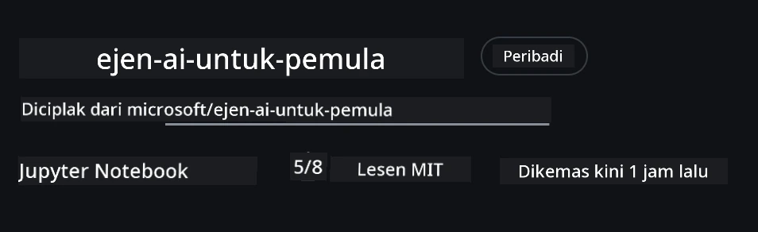
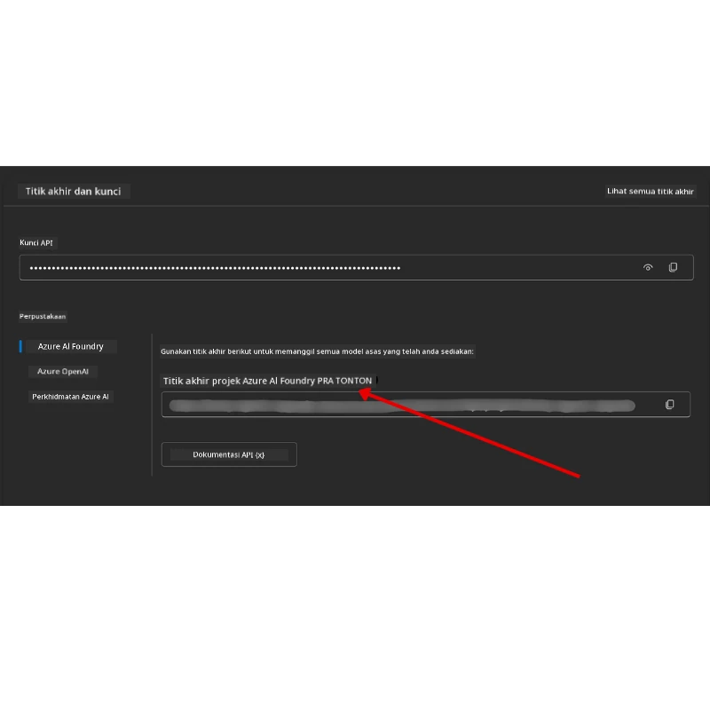

# Penyediaan Kursus

## Pengenalan

Pelajaran ini akan merangkumi cara menjalankan contoh kod kursus ini.

## Sertai Pelajar Lain dan Dapatkan Bantuan

Sebelum anda mula mengklon repo anda, sertai [saluran Discord AI Agents For Beginners](https://aka.ms/ai-agents/discord) untuk mendapatkan sebarang bantuan dengan penyediaan, sebarang soalan tentang kursus, atau untuk berhubung dengan pelajar lain.

## Klon atau Fork Repo ini

Untuk memulakan, sila klon atau fork Repositori GitHub. Ini akan menjadikan versi bahan kursus anda sendiri supaya anda boleh menjalankan, menguji, dan mengubah suai kod!

Ini boleh dilakukan dengan mengklik pautan ke <a href="https://github.com/microsoft/ai-agents-for-beginners/fork" target="_blank">fork repo</a>

Anda kini sepatutnya mempunyai versi forked kursus ini di pautan berikut:



### Shallow Clone (disyorkan untuk bengkel / Codespaces)

  >Repositori penuh boleh menjadi besar (~3 GB) apabila anda memuat turun sejarah penuh dan semua fail. Jika anda hanya menghadiri bengkel atau hanya memerlukan beberapa folder pelajaran, shallow clone (atau sparse clone) mengelakkan kebanyakan muat turun tersebut dengan memotong sejarah dan/atau melangkau blobs.

#### Klon shallow cepat — sejarah minimum, semua fail

Gantikan `<your-username>` dalam arahan di bawah dengan URL fork anda (atau URL upstream jika anda suka).

Untuk klon hanya sejarah komit terkini (muat turun kecil):

```bash|powershell
git clone --depth 1 https://github.com/<your-username>/ai-agents-for-beginners.git
```

Untuk klon cawangan tertentu:

```bash|powershell
git clone --depth 1 --branch <branch-name> https://github.com/<your-username>/ai-agents-for-beginners.git
```

#### Klon separa (sparse) — blobs minimum + hanya folder yang dipilih

Ini menggunakan klon separa dan sparse-checkout (memerlukan Git 2.25+ dan Git moden yang disyorkan dengan sokongan klon separa):

```bash|powershell
git clone --depth 1 --filter=blob:none --sparse https://github.com/<your-username>/ai-agents-for-beginners.git
```

Masuk ke folder repo:

```bash|powershell
cd ai-agents-for-beginners
```

Kemudian nyatakan folder yang anda mahu (contoh di bawah menunjukkan dua folder):

```bash|powershell
git sparse-checkout set 00-course-setup 01-intro-to-ai-agents
```

Selepas klon dan mengesahkan fail, jika anda hanya memerlukan fail dan mahu membebaskan ruang (tiada sejarah git), sila padam metadata repositori (💀tidak boleh dipulihkan — anda akan kehilangan semua fungsi Git: tiada komit, tarik, tolak, atau akses sejarah).

```bash
# zsh/bash
rm -rf .git
```

```powershell
# PowerShell
Remove-Item -Recurse -Force .git
```

#### Menggunakan GitHub Codespaces (disyorkan untuk mengelak muat turun besar tempatan)

- Cipta Codespace baru untuk repo ini melalui [UI GitHub](https://github.com/codespaces).  

- Dalam terminal codespace yang baru dibuat, jalankan salah satu arahan shallow/sparse clone di atas untuk membawa hanya folder pelajaran yang anda perlukan ke ruang kerja Codespace.
- Pilihan: selepas klon di dalam Codespaces, buang .git untuk memperoleh semula ruang tambahan (lihat arahan pembuangan di atas).
- Nota: Jika anda suka membuka repo terus dalam Codespaces (tanpa klon tambahan), sedar bahawa Codespaces akan bina persekitaran devcontainer dan mungkin tetap menyediakan lebih banyak daripada yang anda perlukan. Klon salinan shallow dalam Codespace baru memberi anda lebih kawalan ke atas penggunaan cakera.

#### Petua

- Sentiasa gantikan URL klon dengan fork anda jika anda mahu mengedit/komit.
- Jika anda kemudian memerlukan lebih banyak sejarah atau fail, anda boleh mendapatkannya atau laraskan sparse-checkout untuk memasukkan folder tambahan.

## Menjalankan Kod

Kursus ini menawarkan siri Jupyter Notebooks yang anda boleh jalankan untuk mendapatkan pengalaman praktikal membina Ejen AI.

Contoh kod menggunakan **Microsoft Agent Framework (MAF)** dengan `AzureAIProjectAgentProvider`, yang berhubung ke **Azure AI Agent Service V2** (API Respons) melalui **Microsoft Foundry**.

Semua notebook Python bertanda `*-python-agent-framework.ipynb`.

## Keperluan

- Python 3.12+
  - **NOTA**: Jika anda belum memasang Python3.12, pastikan anda memasangnya. Kemudian cipta venv anda menggunakan python3.12 supaya versi yang betul dipasang dari fail requirements.txt.
  
    >Contoh

    Cipta direktori Python venv:

    ```bash|powershell
    python -m venv venv
    ```

    Kemudian aktifkan persekitaran venv untuk:

    ```bash
    # zsh/bash
    source venv/bin/activate
    ```
  
    ```dos
    # Command Prompt for Windows
    venv\Scripts\activate
    ```

- .NET 10+: Untuk contoh kod menggunakan .NET, pastikan anda memasang [.NET 10 SDK](https://dotnet.microsoft.com/download/dotnet/10.0) atau lebih baru. Kemudian, periksa versi .NET SDK yang telah dipasang:

    ```bash|powershell
    dotnet --list-sdks
    ```

- **Azure CLI** — Diperlukan untuk pengesahan. Pasang dari [aka.ms/installazurecli](https://aka.ms/installazurecli).
- **Langganan Azure** — Untuk akses ke Microsoft Foundry dan Azure AI Agent Service.
- **Projek Microsoft Foundry** — Projek dengan model yang telah dideploy (contoh, `gpt-4o`). Lihat [Langkah 1](../../../00-course-setup) di bawah.

Kami telah menyediakan fail `requirements.txt` di akar repositori ini yang mengandungi semua pakej Python yang diperlukan untuk menjalankan contoh kod.

Anda boleh memasangnya dengan menjalankan arahan berikut di terminal anda di akar repositori:

```bash|powershell
pip install -r requirements.txt
```

Kami mengesyorkan mencipta persekitaran maya Python untuk mengelakkan sebarang konflik dan masalah.

## Sediakan VSCode

Pastikan anda menggunakan versi Python yang betul dalam VSCode.


## Sediakan Microsoft Foundry dan Azure AI Agent Service

### Langkah 1: Cipta Projek Microsoft Foundry

Anda memerlukan **hub** dan **projek** Azure AI Foundry dengan model yang telah dideploy untuk menjalankan notebook.

1. Pergi ke [ai.azure.com](https://ai.azure.com) dan log masuk dengan akaun Azure anda.
2. Cipta **hub** (atau gunakan yang sedia ada). Lihat: [Gambaran Keseluruhan sumber Hub](https://learn.microsoft.com/azure/ai-foundry/concepts/ai-resources).
3. Dalam hub, cipta **projek**.
4. Deploy model (contoh, `gpt-4o`) dari **Models + Endpoints** → **Deploy model**.

### Langkah 2: Dapatkan Endpoint Projek dan Nama Deployment Model Anda

Daripada projek anda dalam portal Microsoft Foundry:

- **Project Endpoint** — Pergi ke halaman **Overview** dan salin URL endpoint.



- **Model Deployment Name** — Pergi ke **Models + Endpoints**, pilih model yang telah anda deploy, dan catat **Deployment name** (contoh, `gpt-4o`).

### Langkah 3: Log masuk ke Azure dengan `az login`

Semua notebook menggunakan **`AzureCliCredential`** untuk pengesahan — tiada kunci API untuk diuruskan. Ini memerlukan anda log masuk melalui Azure CLI.

1. **Pasang Azure CLI** jika belum lagi: [aka.ms/installazurecli](https://aka.ms/installazurecli)

2. **Log masuk** dengan menjalankan:

    ```bash|powershell
    az login
    ```

    Atau jika anda dalam persekitaran jauh/Codespace tanpa pelayar:

    ```bash|powershell
    az login --use-device-code
    ```

3. **Pilih langganan anda** jika diminta — pilih yang mengandungi projek Foundry anda.

4. **Sahkan** anda sudah log masuk:

    ```bash|powershell
    az account show
    ```

> **Mengapa `az login`?** Notebook mengesahkan menggunakan `AzureCliCredential` dari pakej `azure-identity`. Ini bermakna sesi Azure CLI anda menyediakan kelayakan — tiada kunci API atau rahsia dalam fail `.env` anda. Ini adalah [amalan keselamatan terbaik](https://learn.microsoft.com/azure/developer/ai/keyless-connections).

### Langkah 4: Cipta Fail `.env` Anda

Salin fail contoh:

```bash
# zsh/bash
cp .env.example .env
```

```powershell
# PowerShell
Copy-Item .env.example .env
```

Buka `.env` dan isi dua nilai ini:

```env
AZURE_AI_PROJECT_ENDPOINT=https://<your-project>.services.ai.azure.com/api/projects/<your-project-id>
AZURE_AI_MODEL_DEPLOYMENT_NAME=gpt-4o
```

| Pembolehubah | Di mana untuk cari |
|--------------|-------------------|
| `AZURE_AI_PROJECT_ENDPOINT` | Portal Foundry → projek anda → halaman **Overview** |
| `AZURE_AI_MODEL_DEPLOYMENT_NAME` | Portal Foundry → **Models + Endpoints** → nama model yang deployed |

Itu sahaja untuk kebanyakan pelajaran! Notebook akan mengesahkan secara automatik melalui sesi `az login` anda.

### Langkah 5: Pasang Kebergantungan Python

```bash|powershell
pip install -r requirements.txt
```

Kami mengesyorkan menjalankan ini dalam persekitaran maya yang anda cipta sebelum ini.

## Penyediaan Tambahan untuk Pelajaran 5 (Agentic RAG)

Pelajaran 5 menggunakan **Azure AI Search** untuk retrieval-augmented generation. Jika anda bercadang menjalankan pelajaran itu, tambah pembolehubah berikut ke dalam fail `.env` anda:

| Pembolehubah | Di mana untuk cari |
|--------------|-------------------|
| `AZURE_SEARCH_SERVICE_ENDPOINT` | Portal Azure → sumber **Azure AI Search** anda → **Overview** → URL |
| `AZURE_SEARCH_API_KEY` | Portal Azure → sumber **Azure AI Search** anda → **Settings** → **Keys** → kunci pentadbir utama |

## Penyediaan Tambahan untuk Pelajaran 6 dan Pelajaran 8 (Model GitHub)

Sesetengah notebook dalam pelajaran 6 dan 8 menggunakan **Model GitHub** bukannya Azure AI Foundry. Jika anda bercadang menjalankan contoh tersebut, tambah pembolehubah berikut ke dalam fail `.env` anda:

| Pembolehubah | Di mana untuk cari |
|--------------|-------------------|
| `GITHUB_TOKEN` | GitHub → **Settings** → **Developer settings** → **Personal access tokens** |
| `GITHUB_ENDPOINT` | Gunakan `https://models.inference.ai.azure.com` (nilai lalai) |
| `GITHUB_MODEL_ID` | Nama model yang ingin digunakan (contoh `gpt-4o-mini`) |

## Penyediaan Tambahan untuk Pelajaran 8 (Aliran Kerja Bing Grounding)

Notebook aliran kerja bersyarat dalam pelajaran 8 menggunakan **bing grounding** melalui Azure AI Foundry. Jika anda bercadang menjalankan contoh itu, tambah pembolehubah ini ke dalam fail `.env` anda:

| Pembolehubah | Di mana untuk cari |
|--------------|-------------------|
| `BING_CONNECTION_ID` | Portal Azure AI Foundry → projek anda → **Management** → **Connected resources** → sambungan Bing anda → salin ID sambungan |

## Penyelesaian Masalah

### Ralat Pengesahan SSL di macOS

Jika anda menggunakan macOS dan menghadapi ralat seperti:

```plaintext
ssl.SSLCertVerificationError: [SSL: CERTIFICATE_VERIFY_FAILED] certificate verify failed: self-signed certificate in certificate chain
```

Ini adalah isu yang diketahui dengan Python di macOS di mana sijil SSL sistem tidak dipercayai secara automatik. Cuba penyelesaian berikut secara berurutan:

**Pilihan 1: Jalankan skrip Install Certificates Python (disyorkan)**

```bash
# Gantikan 3.XX dengan versi Python yang anda pasang (contoh, 3.12 atau 3.13):
/Applications/Python\ 3.XX/Install\ Certificates.command
```

**Pilihan 2: Gunakan `connection_verify=False` dalam notebook anda (untuk notebook Model GitHub sahaja)**

Dalam notebook Pelajaran 6 (`06-building-trustworthy-agents/code_samples/06-system-message-framework.ipynb`), penyelesaian sementara yang dikomen sudah disertakan. Nyahkomen `connection_verify=False` semasa membuat klient:

```python
client = ChatCompletionsClient(
    endpoint=endpoint,
    credential=AzureKeyCredential(token),
    connection_verify=False,  # Nyahaktifkan pengesahan SSL jika anda menghadapi ralat sijil
)
```

> **⚠️ Amaran:** Melumpuhkan pengesahan SSL (`connection_verify=False`) mengurangkan keselamatan dengan melangkau pengesahan sijil. Gunakan ini hanya sebagai penyelesaian sementara dalam persekitaran pembangunan, jangan sekali-kali dalam produksi.

**Pilihan 3: Pasang dan gunakan `truststore`**

```bash
pip install truststore
```

Kemudian tambah yang berikut di atas notebook atau skrip anda sebelum membuat sebarang panggilan rangkaian:

```python
import truststore
truststore.inject_into_ssl()
```

## Tersangkut di Mana-mana?

Jika anda menghadapi sebarang masalah menjalankan penyediaan ini, sertai <a href="https://discord.gg/kzRShWzttr" target="_blank">Komuniti Azure AI Discord</a> kami atau <a href="https://github.com/microsoft/ai-agents-for-beginners/issues?WT.mc_id=academic-105485-koreyst" target="_blank">cipta isu</a>.

## Pelajaran Seterusnya

Anda kini bersedia untuk menjalankan kod untuk kursus ini. Selamat belajar lebih lanjut tentang dunia Ejen AI! 

[Pengenalan kepada Ejen AI dan Kes Penggunaan Ejen](../01-intro-to-ai-agents/README.md)

---

<!-- CO-OP TRANSLATOR DISCLAIMER START -->
**Penafian**:  
Dokumen ini telah diterjemahkan menggunakan perkhidmatan terjemahan AI [Co-op Translator](https://github.com/Azure/co-op-translator). Walaupun kami berusaha untuk ketepatan, sila ambil maklum bahawa terjemahan automatik mungkin mengandungi kesilapan atau ketidaktepatan. Dokumen asal dalam bahasa asalnya hendaklah dianggap sebagai sumber yang sahih. Untuk maklumat penting, disyorkan menggunakan terjemahan profesional oleh manusia. Kami tidak bertanggungjawab atas sebarang salah faham atau salah tafsir yang timbul daripada penggunaan terjemahan ini.
<!-- CO-OP TRANSLATOR DISCLAIMER END -->