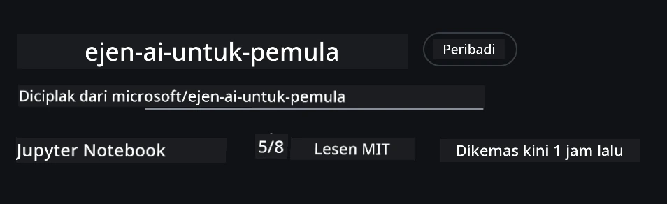
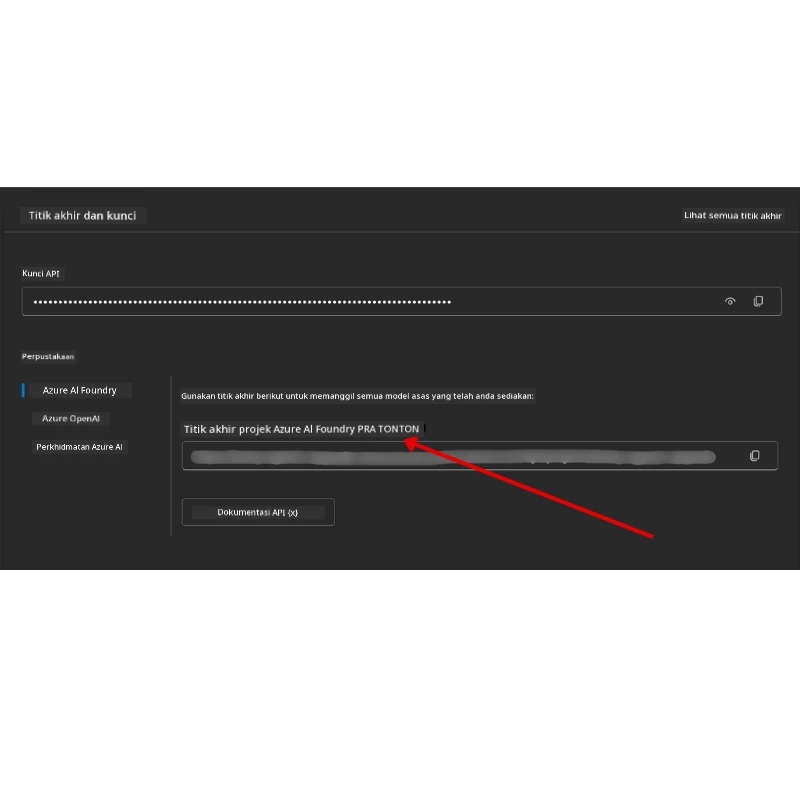

# Persediaan Kursus

## Pengenalan

Pelajaran ini akan merangkumi cara menjalankan contoh kod kursus ini.

## Sertai Pelajar Lain dan Dapatkan Bantuan

Sebelum anda mula mengklon repo anda, sertai [saluran Discord AI Agents For Beginners](https://aka.ms/ai-agents/discord) untuk mendapatkan sebarang bantuan dengan persediaan, sebarang soalan tentang kursus, atau untuk berhubung dengan pelajar lain.

## Klon atau Fork Repo ini

Untuk memulakan, sila klon atau fork Repositori GitHub. Ini akan membuat versi anda sendiri bahan kursus supaya anda boleh menjalankan, menguji, dan mengubah suai kod!

Ini boleh dilakukan dengan mengklik pautan ke <a href="https://github.com/microsoft/ai-agents-for-beginners/fork" target="_blank">fork repo</a>

Anda kini sepatutnya mempunyai versi forked kursus ini di pautan berikut:



### Shallow Clone (disyorkan untuk bengkel / Codespaces)

  >Repositori penuh boleh menjadi besar (~3 GB) apabila anda memuat turun sejarah penuh dan semua fail. Jika anda hanya menghadiri bengkel atau hanya memerlukan beberapa folder pelajaran, shallow clone (atau sparse clone) memuat turun jauh lebih sedikit.

#### Shallow clone pantas — sejarah minimum, semua fail

Gantikan `<your-username>` dalam arahan di bawah dengan URL fork anda (atau URL upstream jika anda lebih suka).

Untuk klon hanya sejarah komit terbaru (muat turun kecil):

```bash
git clone --depth 1 https://github.com/<your-username>/ai-agents-for-beginners.git
```

Untuk klon cawangan tertentu:

```bash
git clone --depth 1 --branch <branch-name> https://github.com/<your-username>/ai-agents-for-beginners.git
```

#### Partial (sparse) clone — blob minimum + hanya folder terpilih

Ini menggunakan partial clone dan sparse-checkout (memerlukan Git 2.25+ dan disyorkan Git moden dengan sokongan partial clone):

```bash
git clone --depth 1 --filter=blob:none --sparse https://github.com/<your-username>/ai-agents-for-beginners.git
```

Masuk ke folder repo:

```bash
cd ai-agents-for-beginners
```

Kemudian nyatakan folder yang anda mahu (contoh di bawah menunjukkan dua folder):

```bash
git sparse-checkout set 00-course-setup 01-intro-to-ai-agents
```

Selepas klon dan mengesahkan fail, jika anda hanya memerlukan fail dan mahu menjimatkan ruang (tiada sejarah git), sila padam metadata repositori (💀tidak boleh dipulihkan — anda akan kehilangan semua fungsi Git):

```bash
# zsh/bash
rm -rf .git
```

```powershell
# PowerShell
Remove-Item -Recurse -Force .git
```

#### Menggunakan GitHub Codespaces (disyorkan untuk elakkan muat turun tempatan yang besar)

- Cipta Codespace baru untuk repo ini melalui [GitHub UI](https://github.com/codespaces).  

- Dalam terminal codespace yang baru dibuat, jalankan salah satu arahan shallow/sparse clone di atas untuk membawa hanya folder pelajaran yang anda perlukan ke dalam ruang kerja Codespace.
- Pilihan: selepas klon di dalam Codespaces, keluarkan .git untuk mendapatkan ruang tambahan (lihat arahan penghapusan di atas).
- Nota: Jika anda lebih suka membuka repo terus dalam Codespaces (tanpa klon tambahan), ambil perhatian Codespaces akan membina persekitaran devcontainer dan mungkin masih menyediakan lebih daripada yang anda perlukan.

#### Petua

- Sentiasa gantikan URL klon dengan fork anda jika anda ingin mengedit/commit.
- Jika kemudian anda perlukan lebih sejarah atau fail, anda boleh mengambilnya atau laraskan sparse-checkout untuk termasuk folder tambahan.

## Menjalankan Kod

Kursus ini menawarkan satu siri Jupyter Notebooks yang anda boleh jalankan untuk mendapatkan pengalaman praktikal membina AI Agents.

Contoh kod menggunakan **Microsoft Agent Framework (MAF)** dengan `FoundryChatClient`, yang berhubung dengan **Microsoft Foundry Agent Service V2** (API Responses) melalui **Microsoft Foundry**.

Semua notebook Python dilabelkan `*-python-agent-framework.ipynb`.

## Keperluan

- Python 3.12+
  - **CATATAN**: Jika anda belum memasang Python3.12, pastikan anda pasang. Kemudian buat venv anda menggunakan python3.12 supaya versi yang betul dipasang dari fail requirements.txt.
  
    >Contoh

    Cipta direktori venv Python:

    ```bash
    python -m venv venv
    ```

    Kemudian aktifkan persekitaran venv untuk:

    ```bash
    # zsh/bash
    source venv/bin/activate
    ```
  
    ```dos
    # Command Prompt for Windows
    venv\Scripts\activate
    ```

- .NET 10+: Untuk kod contoh yang menggunakan .NET, pastikan anda memasang [.NET 10 SDK](https://dotnet.microsoft.com/download/dotnet/10.0) atau yang lebih baru. Kemudian, semak versi .NET SDK yang anda pasang:

    ```bash
    dotnet --list-sdks
    ```

- **Azure CLI** — Diperlukan untuk pengesahan. Pasang dari [aka.ms/installazurecli](https://aka.ms/installazurecli).
- **Azure Subscription** — Untuk akses ke Microsoft Foundry dan Microsoft Foundry Agent Service.
- **Projek Microsoft Foundry** — Satu projek dengan model yang dikerahkan (contoh, `gpt-5-mini`). Lihat [Langkah 1](#langkah-1-cipta-projek-microsoft-foundry) di bawah.

Kami telah sertakan fail `requirements.txt` dalam akar repositori ini yang mengandungi semua pakej Python yang diperlukan untuk menjalankan contoh kod.

Anda boleh memasangnya dengan menjalankan arahan berikut dalam terminal anda di akar repositori:

```bash
pip install -r requirements.txt
```

Kami mengesyorkan mencipta persekitaran virtual Python untuk mengelakkan sebarang konflik dan isu.

## Setup VSCode

Pastikan anda menggunakan versi Python yang betul dalam VSCode.


## Sediakan Microsoft Foundry dan Microsoft Foundry Agent Service

### Langkah 1: Cipta Projek Microsoft Foundry

Anda memerlukan **hub** dan **projek** Microsoft Foundry dengan model yang dikerahkan untuk menjalankan notebook.

1. Pergi ke [ai.azure.com](https://ai.azure.com) dan log masuk dengan akaun Azure anda.
2. Cipta **hub** (atau gunakan yang sedia ada). Lihat: [Tinjauan sumber hub](https://learn.microsoft.com/azure/ai-foundry/concepts/ai-resources).
3. Dalam hub, cipta **projek**.
4. Kerahkan model (contoh, `gpt-5-mini`) dari **Models + Endpoints** → **Deploy model**.

### Langkah 2: Ambil Endpoint Projek dan Nama Penyebaran Model Anda

Dari projek anda di portal Microsoft Foundry:

- **Project Endpoint** — Pergi ke halaman **Overview** dan salin URL endpoint.



- **Model Deployment Name** — Pergi ke **Models + Endpoints**, pilih model yang anda kerahkan, dan nota **Deployment name** (contoh, `gpt-5-mini`).

### Langkah 3: Log masuk ke Azure dengan `az login`

Kebanyakan notebook mengesahkan melalui **Azure CLI sign-in** anda — menggunakan `AzureCliCredential` atau `DefaultAzureCredential` (kedua-duanya mengambil sesi `az login` anda) dari pakej `azure-identity` — jadi mereka tidak memerlukan kunci API. Beberapa pelajaran dan integrasi pilihan menggunakan kunci API; semak prasyarat setiap pelajaran untuk sebarang pemboleh ubah persekitaran tambahan. Ini memerlukan anda log masuk melalui Azure CLI.

1. **Pasang Azure CLI** jika belum dipasang: [aka.ms/installazurecli](https://aka.ms/installazurecli)

2. **Log masuk** dengan menjalankan:

    ```bash
    az login
    ```

    Atau jika anda berada dalam persekitaran jauh/Codespace tanpa pelayar:

    ```bash
    az login --use-device-code
    ```

3. **Pilih langganan anda** jika dipinta — pilih yang mengandungi projek Foundry anda.

4. **Sahkan** anda sudah log masuk:

    ```bash
    az account show
    ```

> **Kenapa `az login`?** Notebook mengesahkan menggunakan `AzureCliCredential` (atau `DefaultAzureCredential`, yang juga mengambil log masuk Azure CLI anda) dari pakej `azure-identity`. Ini bermakna sesi Azure CLI anda menyediakan kebenaran — tiada kunci API atau rahsia dalam fail `.env` anda. Ini adalah [amalan keselamatan terbaik](https://learn.microsoft.com/azure/developer/ai/keyless-connections).

### Langkah 4: Cipta Fail `.env` Anda

Salin fail contoh:

```bash
# zsh/bash
cp .env.example .env
```

```powershell
# PowerShell
Copy-Item .env.example .env
```

Buka `.env` dan isikan dua nilai ini:

```env
AZURE_AI_PROJECT_ENDPOINT=https://<your-project>.services.ai.azure.com/api/projects/<your-project-id>
AZURE_AI_MODEL_DEPLOYMENT_NAME=gpt-5-mini
```

| Pemboleh ubah | Tempat mencarinya |
|----------|-----------------|
| `AZURE_AI_PROJECT_ENDPOINT` | Portal Foundry → projek anda → halaman **Overview** |
| `AZURE_AI_MODEL_DEPLOYMENT_NAME` | Portal Foundry → **Models + Endpoints** → nama model yang anda kerahkan |

Itu sahaja untuk kebanyakan pelajaran! Notebook akan mengesahkan secara automatik melalui sesi `az login` anda.

### Langkah 5: Pasang Kebergantungan Python

```bash
pip install -r requirements.txt
```

Kami mengesyorkan menjalankan ini di dalam persekitaran virtual yang anda cipta tadi.

## Persediaan Pilihan: Azure AI Search (Pelajaran 5 dan 16)

Notebook Pelajaran 5 (Agentic RAG) dan Pelajaran 16 berjalan terus dengan **pangkalan pengetahuan dalam memori** — tiada sumber Azure tambahan diperlukan. Jika anda mahu menyokongnya dengan indeks **Azure AI Search** sebenar, ambil perhatian bahawa **notebook Pelajaran 16 kini menggunakan pengesahan berasaskan kunci**: ia beralih dari carian dalam memori ke Azure AI Search hanya apabila **kedua-dua** `AZURE_SEARCH_SERVICE_ENDPOINT` **dan** `AZURE_SEARCH_API_KEY` ditetapkan, dan jika tidak ia kekal menggunakan carian dalam memori — jadi untuk menjalankannya dengan indeks sebenar anda mesti menetapkan kunci pentadbir juga. Pengesahan tanpa kunci menggunakan Microsoft Entra ID (RBAC) adalah pendekatan yang disyorkan untuk kod produksi anda sendiri, serasi dengan aliran `az login` yang digunakan di mana-mana dalam kursus ini.

Langkah RBAC di bawah terpakai kepada contoh panduan persediaan dan kod anda sendiri. Ia tidak mengaktifkan pengesahan tanpa kunci dalam notebook Pelajaran 16; Pelajaran 16 masih memerlukan kedua-dua endpoint dan kunci pentadbir untuk menggunakan Azure AI Search.

1. **Dayakan kawalan akses berasaskan peranan** pada perkhidmatan carian anda:

    ```bash
    az search service update --name <service-name> --resource-group <resource-group> --auth-options aadOrApiKey
    ```

2. **Tugaskan peranan yang diperlukan kepada diri anda sendiri** (cipta/muat indeks dan kueri):

    ```bash
    az role assignment create --assignee <your-user-or-principal-id> --role "Search Service Contributor" --scope $(az search service show -g <resource-group> -n <service-name> --query id -o tsv)
    az role assignment create --assignee <your-user-or-principal-id> --role "Search Index Data Contributor" --scope $(az search service show -g <resource-group> -n <service-name> --query id -o tsv)
    ```

3. **Tambah endpoint** ke fail `.env` anda:

| Pemboleh ubah | Tempat mencarinya |
|----------|-----------------|
| `AZURE_SEARCH_SERVICE_ENDPOINT` | Portal Azure → sumber **Azure AI Search** anda → **Overview** → URL |
| `AZURE_SEARCH_API_KEY` | Diperlukan (bersama endpoint) untuk mengaktifkan Azure AI Search dalam notebook Pelajaran 16, yang menggunakan pengesahan berasaskan kunci. Portal Azure → **Settings** → **Keys** → kunci pentadbir utama |

> **Kenapa tanpa kunci?** Kunci pentadbir memberikan akses tulis penuh ke perkhidmatan carian anda dan boleh bocor melalui fail `.env`. Dengan RBAC, identiti `az login` anda digunakan sebagai gantinya — corak Entra ID tanpa kunci yang sama yang digunakan oleh notebook kursus (melalui `AzureCliCredential` / `DefaultAzureCredential`). Lihat [Sambung ke Azure AI Search menggunakan peranan](https://learn.microsoft.com/azure/search/search-security-rbac).

Lihat [panduan persediaan Azure AI Search](./AzureSearch.md) untuk contoh penuh penciptaan indeks menggunakan Python dan .NET.

## Persediaan Tambahan untuk Pelajaran yang Memanggil Azure OpenAI Secara Langsung (Pelajaran 6 dan 8)

Sesetengah notebook dalam pelajaran 6 dan 8 memanggil **Azure OpenAI** secara langsung (menggunakan **Responses API**) dan bukannya melalui projek Microsoft Foundry. Contoh ini sebelum ini menggunakan GitHub Models, yang sudah lapuk dan tidak menyokong Responses API. Tambah pemboleh ubah ini ke fail `.env` anda:

| Pemboleh ubah | Tempat mencarinya |
|----------|-----------------|
| `AZURE_OPENAI_ENDPOINT` | Portal Azure → sumber **Azure OpenAI** anda → **Keys and Endpoint** → Endpoint (contoh `https://<your-resource>.openai.azure.com`) |
| `AZURE_OPENAI_DEPLOYMENT` | Nama model yang anda kerahkan (contoh `gpt-5-mini`) yang menyokong Responses API |
| `AZURE_OPENAI_API_KEY` | Pilihan — hanya jika anda menggunakan pengesahan berasaskan kunci dan bukannya `az login` / Entra ID |

> Responses API menggunakan endpoint stabil `/openai/v1/`, jadi tiada `api-version` diperlukan. Log masuk dengan `az login` untuk menggunakan pengesahan tanpa kunci Entra ID.

## Penyedia Alternatif: MiniMax (Sesuai OpenAI)

[MiniMax](https://platform.minimaxi.com/) menyediakan model konteks besar (sehingga 204K token) melalui API yang serasi dengan OpenAI. Oleh kerana Microsoft Agent Framework's `OpenAIChatClient` berfungsi dengan mana-mana endpoint yang serasi OpenAI, anda boleh menggunakan MiniMax sebagai alternatif plug-in untuk pelajaran yang menggunakan `OpenAIChatClient`.

Tambah pemboleh ubah ini ke fail `.env` anda:

| Pemboleh ubah | Tempat mencarinya |
|----------|-----------------|
| `MINIMAX_API_KEY` | [MiniMax Platform](https://platform.minimaxi.com/) → Kunci API |
| `MINIMAX_BASE_URL` | Gunakan `https://api.minimax.io/v1` (nilai lalai) |
| `MINIMAX_MODEL_ID` | Nama model untuk digunakan (contoh, `MiniMax-M3`) |

**Contoh model**: `MiniMax-M3` (disyorkan), `MiniMax-M2.7`, `MiniMax-M2.7-highspeed` (respons lebih pantas). Nama dan ketersediaan model mungkin berubah dari masa ke masa, dan akses ke model tertentu bergantung pada akaun anda.

Contoh kod yang menggunakan `OpenAIChatClient` (contoh, aliran tempahan hotel Pelajaran 14) akan mengesan dan menggunakan konfigurasi MiniMax anda secara automatik apabila `MINIMAX_API_KEY` ditetapkan.


## Pembekal Alternatif: Foundry Local (Jalankan Model Pada Peranti)

[Foundry Local](https://foundrylocal.ai) ialah runtime ringan yang memuat turun, mengurus, dan menyampaikan model bahasa **sepenuhnya pada mesin anda sendiri** melalui API yang serasi dengan OpenAI — tanpa memerlukan awan.

Oleh kerana Microsoft Agent Framework's `OpenAIChatClient` berfungsi dengan mana-mana titik akhir yang serasi dengan OpenAI, Foundry Local adalah alternatif setempat yang mudah menggantikan Azure OpenAI.

**1. Pasang Foundry Local**

```bash
# Windows
winget install Microsoft.FoundryLocal

# macOS
brew install foundrylocal
```

**2. Muat turun dan jalankan model** (ini juga akan memulakan perkhidmatan setempat):

```bash
foundry model list          # lihat model yang tersedia
foundry model run phi-4-mini
```

**3. Pasang Python SDK** yang digunakan untuk menemui titik akhir setempat:

```bash
pip install foundry-local-sdk
```

**4. Tentukan Microsoft Agent Framework kepada model setempat anda:**

```python
from foundry_local import FoundryLocalManager
from agent_framework.openai import OpenAIChatClient

# Memuat turun (jika perlu) dan menyediakan model secara tempatan, kemudian mengesan titik akhir/port.
manager = FoundryLocalManager("phi-4-mini")

chat_client = OpenAIChatClient(
    base_url=manager.endpoint,      # contohnya http://localhost:<port>/v1
    api_key=manager.api_key,        # sentiasa "tidak-diperlukan" untuk Foundry Local
    model_id=manager.get_model_info("phi-4-mini").id,
)

agent = chat_client.as_agent(
    name="LocalAgent",
    instructions="You are a helpful assistant running fully on-device.",
)
```

> **Nota:** Foundry Local mendedahkan titik akhir **Chat Completions** yang serasi dengan OpenAI. Gunakannya untuk pembangunan setempat dan senario tanpa sambungan. Untuk set ciri penuh **Responses API** (perbualan berstate, dll.), gunakan Azure OpenAI atau projek Microsoft Foundry.

## Persediaan Tambahan untuk Pelajaran 8 (Aliran Kerja Bing Grounding)

Buku nota aliran kerja bersyarat dalam pelajaran 8 menggunakan **Bing grounding** melalui Microsoft Foundry. Jika anda berhasrat menjalankan contoh itu, tambahkan pembolehubah ini ke fail `.env` anda:

| Pembolehubah | Di mana untuk mencari |
|-------------|----------------------|
| `BING_CONNECTION_ID` | Portal Microsoft Foundry → projek anda → **Pengurusan** → **Sumber yang disambungkan** → sambungan Bing anda → salin ID sambungan |

## Penyelesaian Masalah

### Kesalahan Pengesahan Sijil SSL pada macOS

Jika anda menggunakan macOS dan menghadapi ralat seperti:

```plaintext
ssl.SSLCertVerificationError: [SSL: CERTIFICATE_VERIFY_FAILED] certificate verify failed: self-signed certificate in certificate chain
```

Ini adalah isu yang diketahui dengan Python pada macOS di mana sijil SSL sistem tidak dipercayai secara automatik. Cuba penyelesaian berikut mengikut susunan:

**Pilihan 1: Jalankan skrip Pasang Sijil Python (disyorkan)**

```bash
# Gantikan 3.XX dengan versi Python yang anda pasang (contoh, 3.12 atau 3.13):
/Applications/Python\ 3.XX/Install\ Certificates.command
```

**Pilihan 2: Gunakan `connection_verify=False` dalam buku nota anda (untuk buku nota GitHub Models sahaja)**

Dalam buku nota Pelajaran 6 (`06-building-trustworthy-agents/code_samples/06-system-message-framework.ipynb`), kaedah penyelesaian yang dikomen sudah dimasukkan. Nyahkomen `connection_verify=False` apabila anda menghadapi kesilapan sijil:

```python
client = ChatCompletionsClient(
    endpoint=endpoint,
    credential=AzureKeyCredential(token),
    connection_verify=False,  # Lumpuhkan pengesahan SSL jika anda menghadapi ralat sijil
)
```

> **⚠️ Amaran:** Melumpuhkan pengesahan SSL (`connection_verify=False`) mengurangkan keselamatan dengan memintas pengesahan sijil. Gunakan ini hanya sebagai penyelesaian sementara dalam persekitaran pembangunan. Jangan gunakan dalam produksi.

**Pilihan 3: Pasang dan gunakan `truststore`**

```bash
pip install truststore
```

Kemudian tambah yang berikut di bahagian atas buku nota atau skrip anda sebelum membuat sebarang panggilan rangkaian:

```python
import truststore
truststore.inject_into_ssl()
```

## Tersangkut Di Mana-mana?

Jika anda menghadapi sebarang masalah menjalankan persediaan ini, sertai <a href="https://discord.gg/kzRShWzttr" target="_blank">Azure AI Community Discord</a> kami atau <a href="https://github.com/microsoft/ai-agents-for-beginners/issues?WT.mc_id=academic-105485-koreyst" target="_blank">cipta isu</a>.

## Pelajaran Seterusnya

Anda kini bersedia untuk menjalankan kod untuk kursus ini. Selamat belajar lebih banyak tentang dunia Ejen AI! 

[Pengenalan kepada Ejen AI dan Kes Penggunaan Ejen](../01-intro-to-ai-agents/README.md)

---

<!-- CO-OP TRANSLATOR DISCLAIMER START -->
**Penafian**:
Dokumen ini telah diterjemahkan menggunakan perkhidmatan terjemahan AI [Co-op Translator](https://github.com/Azure/co-op-translator). Walaupun kami berusaha untuk ketepatan, sila ambil maklum bahawa terjemahan automatik mungkin mengandungi kesilapan atau ketidaktepatan. Dokumen asal dalam bahasa asalnya harus dianggap sebagai sumber yang sahih. Untuk maklumat penting, terjemahan oleh manusia profesional adalah disyorkan. Kami tidak bertanggungjawab terhadap sebarang salah faham atau salah tafsir yang timbul daripada penggunaan terjemahan ini.
<!-- CO-OP TRANSLATOR DISCLAIMER END -->