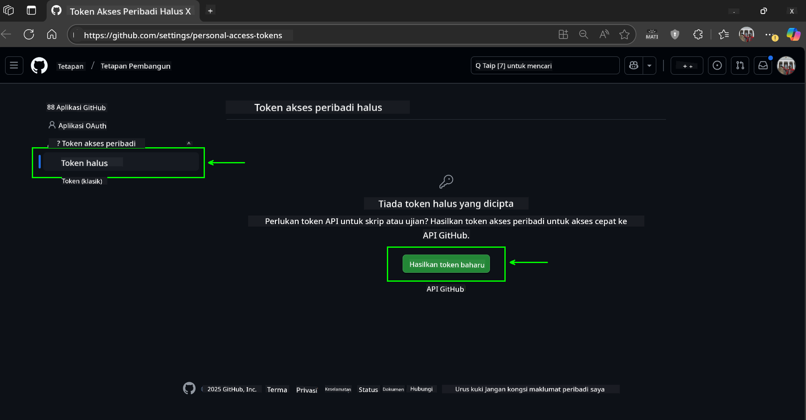
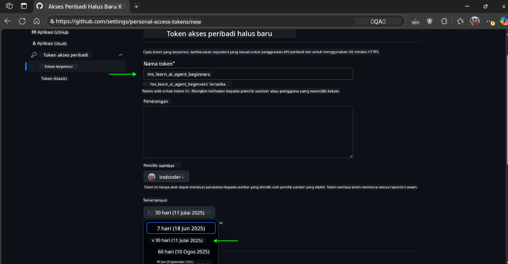
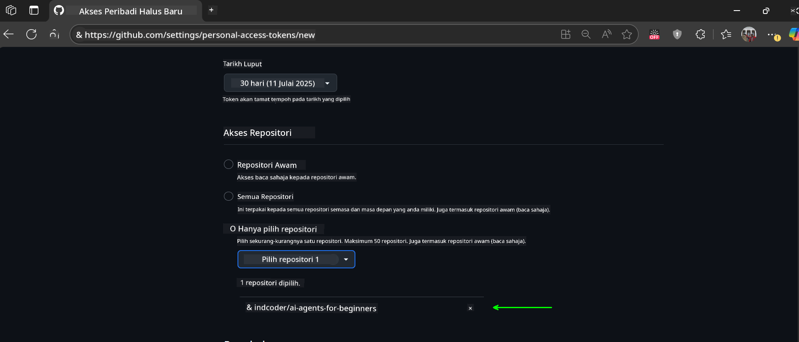
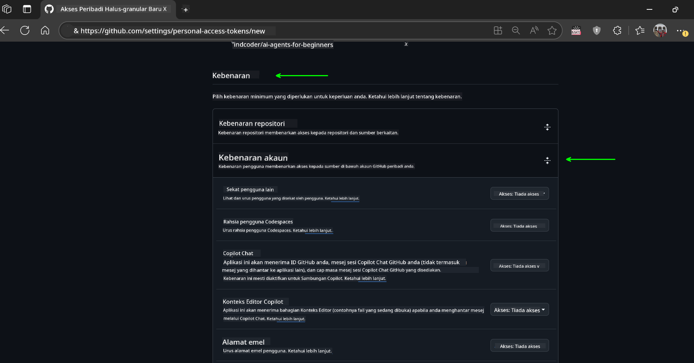
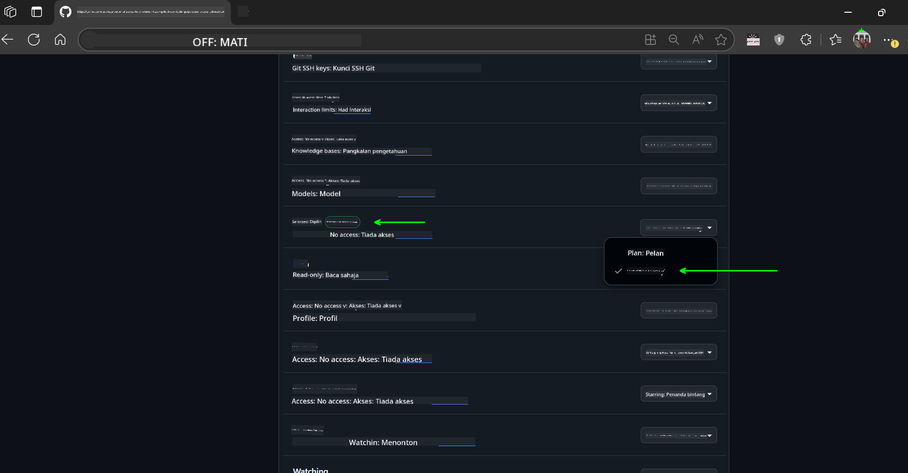
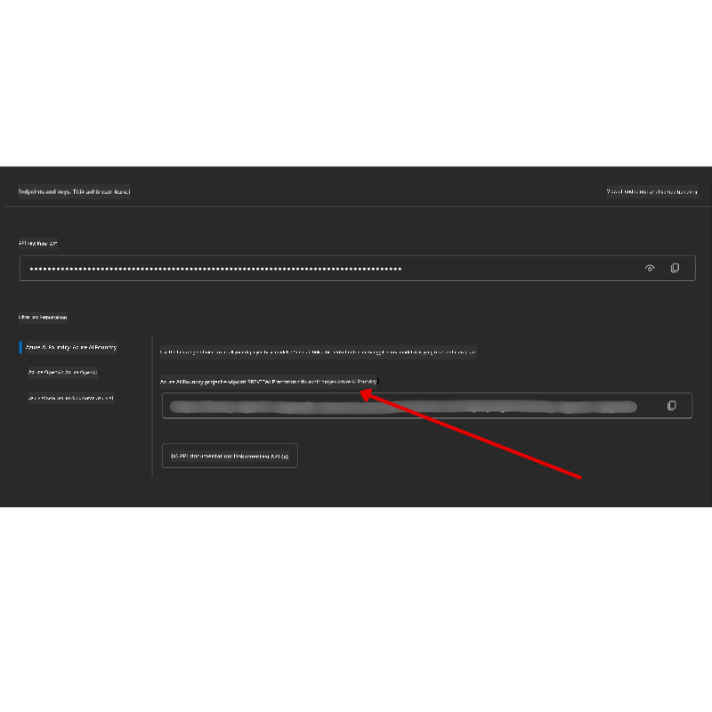

<!--
CO_OP_TRANSLATOR_METADATA:
{
  "original_hash": "c6a79c8f2b56a80370ff7e447765524f",
  "translation_date": "2025-07-24T08:46:58+00:00",
  "source_file": "00-course-setup/README.md",
  "language_code": "ms"
}
-->
# Persediaan Kursus

## Pengenalan

Pelajaran ini akan membincangkan cara menjalankan contoh kod dalam kursus ini.

## Klon atau Fork Repositori Ini

Untuk memulakan, sila klon atau fork Repositori GitHub ini. Ini akan menghasilkan versi bahan kursus anda sendiri supaya anda boleh menjalankan, menguji, dan mengubah suai kod!

Ini boleh dilakukan dengan mengklik pautan ke

Anda kini sepatutnya mempunyai versi forked kursus ini di pautan berikut:


## Menjalankan Kod

Kursus ini menyediakan satu siri Jupyter Notebooks yang boleh anda jalankan untuk mendapatkan pengalaman langsung membina Ejen AI.

Contoh kod menggunakan salah satu daripada:

**Memerlukan Akaun GitHub - Percuma**:

1) Rangka Kerja Semantic Kernel Agent + Pasar Model GitHub. Dilabelkan sebagai (semantic-kernel.ipynb)  
2) Rangka Kerja AutoGen + Pasar Model GitHub. Dilabelkan sebagai (autogen.ipynb)

**Memerlukan Langganan Azure**:  
3) Azure AI Foundry + Perkhidmatan Ejen AI Azure. Dilabelkan sebagai (azureaiagent.ipynb)

Kami menggalakkan anda mencuba ketiga-tiga jenis contoh untuk melihat mana yang paling sesuai untuk anda.

Pilihan yang anda pilih akan menentukan langkah persediaan yang perlu anda ikuti di bawah:

## Keperluan

- Python 3.12+  
  - **NOTA**: Jika anda belum memasang Python3.12, pastikan anda memasangnya. Kemudian buat venv anda menggunakan python3.12 untuk memastikan versi yang betul dipasang daripada fail requirements.txt.  
- Akaun GitHub - Untuk Akses ke Pasar Model GitHub  
- Langganan Azure - Untuk Akses ke Azure AI Foundry  
- Akaun Azure AI Foundry - Untuk Akses ke Perkhidmatan Ejen AI Azure  

Kami telah menyertakan fail `requirements.txt` di akar repositori ini yang mengandungi semua pakej Python yang diperlukan untuk menjalankan contoh kod.

Anda boleh memasangnya dengan menjalankan perintah berikut di terminal anda di akar repositori:

```bash
pip install -r requirements.txt
```  
Kami mengesyorkan membuat persekitaran maya Python untuk mengelakkan sebarang konflik dan masalah.

## Persediaan VSCode  
Pastikan anda menggunakan versi Python yang betul dalam VSCode.


## Persediaan untuk Contoh Menggunakan Model GitHub

### Langkah 1: Dapatkan Token Akses Peribadi (PAT) GitHub Anda

Kursus ini menggunakan Pasar Model GitHub, yang menyediakan akses percuma kepada Model Bahasa Besar (LLM) yang akan anda gunakan untuk membina Ejen AI.

Untuk menggunakan Model GitHub, anda perlu membuat [Token Akses Peribadi GitHub](https://docs.github.com/en/authentication/keeping-your-account-and-data-secure/managing-your-personal-access-tokens).

Ini boleh dilakukan dengan pergi ke akaun GitHub anda.

Sila ikuti [Prinsip Keistimewaan Minimum](https://docs.github.com/en/get-started/learning-to-code/storing-your-secrets-safely) semasa membuat token anda. Ini bermaksud anda hanya perlu memberikan token keizinan yang diperlukan untuk menjalankan contoh kod dalam kursus ini.

1. Pilih pilihan `Fine-grained tokens` di sebelah kiri skrin anda.

    Kemudian pilih `Generate new token`.

    

1. Masukkan nama deskriptif untuk token anda yang mencerminkan tujuannya, supaya mudah dikenali kemudian. Tetapkan tarikh luput (disyorkan: 30 hari; anda boleh memilih tempoh yang lebih pendek seperti 7 hari jika anda lebih suka postur yang lebih selamat).

    

1. Hadkan skop token kepada fork repositori ini.

    

1. Hadkan keizinan token: Di bawah **Permissions**, togol **Account Permissions**, pergi ke **Models** dan aktifkan hanya akses baca yang diperlukan untuk Model GitHub.

    

    

Salin token baru anda yang baru sahaja anda buat. Anda kini akan menambahkannya ke fail `.env` yang disertakan dalam kursus ini.

### Langkah 2: Buat Fail `.env` Anda

Untuk membuat fail `.env` anda, jalankan perintah berikut di terminal anda.

```bash
cp .env.example .env
```

Ini akan menyalin fail contoh dan membuat `.env` dalam direktori anda di mana anda mengisi nilai untuk pembolehubah persekitaran.

Dengan token anda disalin, buka fail `.env` dalam editor teks kegemaran anda dan tampalkan token anda ke medan `GITHUB_TOKEN`.

Anda kini sepatutnya boleh menjalankan contoh kod dalam kursus ini.

## Persediaan untuk Contoh Menggunakan Azure AI Foundry dan Perkhidmatan Ejen AI Azure

### Langkah 1: Dapatkan Endpoint Projek Azure Anda

Ikuti langkah-langkah untuk membuat hub dan projek dalam Azure AI Foundry yang terdapat di sini: [Gambaran Keseluruhan Sumber Hub](https://learn.microsoft.com/en-us/azure/ai-foundry/concepts/ai-resources)

Setelah anda membuat projek anda, anda perlu mendapatkan string sambungan untuk projek anda.

Ini boleh dilakukan dengan pergi ke halaman **Overview** projek anda di portal Azure AI Foundry.



### Langkah 2: Buat Fail `.env` Anda

Untuk membuat fail `.env` anda, jalankan perintah berikut di terminal anda.

```bash
cp .env.example .env
```

Ini akan menyalin fail contoh dan membuat `.env` dalam direktori anda di mana anda mengisi nilai untuk pembolehubah persekitaran.

Dengan token anda disalin, buka fail `.env` dalam editor teks kegemaran anda dan tampalkan token anda ke medan `PROJECT_ENDPOINT`.

### Langkah 3: Log Masuk ke Azure

Sebagai amalan keselamatan terbaik, kami akan menggunakan [autentikasi tanpa kunci](https://learn.microsoft.com/azure/developer/ai/keyless-connections?tabs=csharp%2Cazure-cli?WT.mc_id=academic-105485-koreyst) untuk mengautentikasi ke Azure OpenAI dengan Microsoft Entra ID.

Seterusnya, buka terminal dan jalankan `az login --use-device-code` untuk log masuk ke akaun Azure anda.

Setelah anda log masuk, pilih langganan anda di terminal.

## Pembolehubah Persekitaran Tambahan - Azure Search dan Azure OpenAI

Untuk Pelajaran Agentic RAG - Pelajaran 5 - terdapat contoh yang menggunakan Azure Search dan Azure OpenAI.

Jika anda ingin menjalankan contoh ini, anda perlu menambah pembolehubah persekitaran berikut ke fail `.env` anda:

### Halaman Gambaran Keseluruhan (Projek)

- `AZURE_SUBSCRIPTION_ID` - Semak **Project details** pada halaman **Overview** projek anda.

- `AZURE_AI_PROJECT_NAME` - Lihat di bahagian atas halaman **Overview** projek anda.

- `AZURE_OPENAI_SERVICE` - Cari ini di tab **Included capabilities** untuk **Azure OpenAI Service** pada halaman **Overview**.

### Pusat Pengurusan

- `AZURE_OPENAI_RESOURCE_GROUP` - Pergi ke **Project properties** pada halaman **Overview** di **Management Center**.

- `GLOBAL_LLM_SERVICE` - Di bawah **Connected resources**, cari nama sambungan **Azure AI Services**. Jika tidak disenaraikan, semak **Azure portal** di bawah kumpulan sumber anda untuk nama sumber AI Services.

### Halaman Models + Endpoints

- `AZURE_OPENAI_EMBEDDING_DEPLOYMENT_NAME` - Pilih model embedding anda (contohnya, `text-embedding-ada-002`) dan catat **Deployment name** daripada butiran model.

- `AZURE_OPENAI_CHAT_DEPLOYMENT_NAME` - Pilih model chat anda (contohnya, `gpt-4o-mini`) dan catat **Deployment name** daripada butiran model.

### Portal Azure

- `AZURE_OPENAI_ENDPOINT` - Cari **Azure AI services**, klik padanya, kemudian pergi ke **Resource Management**, **Keys and Endpoint**, tatal ke bawah ke "Azure OpenAI endpoints", dan salin yang mengatakan "Language APIs".

- `AZURE_OPENAI_API_KEY` - Dari skrin yang sama, salin KEY 1 atau KEY 2.

- `AZURE_SEARCH_SERVICE_ENDPOINT` - Cari sumber **Azure AI Search** anda, klik padanya, dan lihat **Overview**.

- `AZURE_SEARCH_API_KEY` - Kemudian pergi ke **Settings** dan kemudian **Keys** untuk menyalin kunci admin utama atau sekunder.

### Halaman Luar

- `AZURE_OPENAI_API_VERSION` - Lawati halaman [API version lifecycle](https://learn.microsoft.com/en-us/azure/ai-services/openai/api-version-deprecation#latest-ga-api-release) di bawah **Latest GA API release**.

### Persediaan Autentikasi Tanpa Kunci

Daripada mengekodkan kelayakan anda secara langsung, kami akan menggunakan sambungan tanpa kunci dengan Azure OpenAI. Untuk melakukannya, kami akan mengimport `DefaultAzureCredential` dan kemudian memanggil fungsi `DefaultAzureCredential` untuk mendapatkan kelayakan.

```python
from azure.identity import DefaultAzureCredential, InteractiveBrowserCredential
```

## Tersangkut di Mana-Mana?

Jika anda menghadapi sebarang masalah semasa menjalankan persediaan ini, sertai kami di

## Pelajaran Seterusnya

Anda kini bersedia untuk menjalankan kod untuk kursus ini. Selamat belajar lebih lanjut tentang dunia Ejen AI!

[Pengenalan kepada Ejen AI dan Kes Penggunaan Ejen](../01-intro-to-ai-agents/README.md)

**Penafian**:  
Dokumen ini telah diterjemahkan menggunakan perkhidmatan terjemahan AI [Co-op Translator](https://github.com/Azure/co-op-translator). Walaupun kami berusaha untuk memastikan ketepatan, sila ambil maklum bahawa terjemahan automatik mungkin mengandungi kesilapan atau ketidaktepatan. Dokumen asal dalam bahasa asalnya harus dianggap sebagai sumber yang berwibawa. Untuk maklumat penting, terjemahan manusia profesional adalah disyorkan. Kami tidak bertanggungjawab atas sebarang salah faham atau salah tafsir yang timbul daripada penggunaan terjemahan ini.