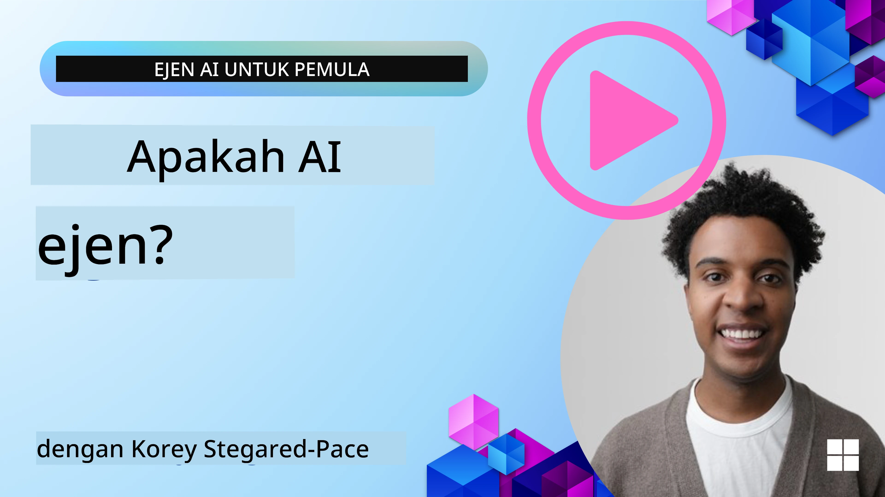
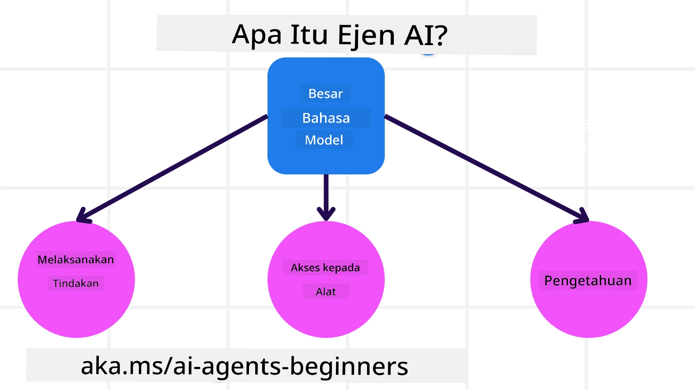
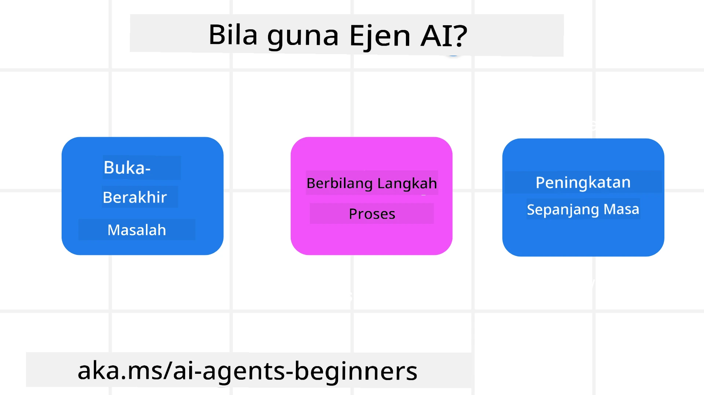

> _(Klik imej di atas untuk menonton video pelajaran ini)_

# Pengenalan kepada Ejen AI dan Kes Penggunaan Ejen

Selamat datang ke kursus "Ejen AI untuk Pemula"! Kursus ini menyediakan pengetahuan asas dan sampel terapan untuk membina Ejen AI.

Sertai <a href="https://discord.gg/kzRShWzttr" target="_blank">Komuniti Discord Azure AI</a> untuk berjumpa dengan pelajar lain dan Pembina Ejen AI serta bertanya apa-apa soalan berkaitan kursus ini.

Untuk memulakan kursus ini, kita akan mula dengan memahami dengan lebih baik apa itu Ejen AI dan bagaimana kita boleh menggunakannya dalam aplikasi dan aliran kerja yang kita bina.

## Pengenalan

Pelajaran ini meliputi:

- Apa itu Ejen AI dan apakah jenis ejen yang berbeza?
- Kes penggunaan apa yang paling sesuai untuk Ejen AI dan bagaimana ia boleh membantu kita?
- Apakah beberapa blok binaan asas ketika mereka bentuk Penyelesaian Agentik?

## Matlamat Pembelajaran
Selepas menamatkan pelajaran ini, anda sepatutnya dapat:

- Memahami konsep Ejen AI dan bagaimana ia berbeza daripada penyelesaian AI lain.
- Mengaplikasikan Ejen AI dengan cara yang paling cekap.
- Mereka bentuk penyelesaian Agentik dengan produktif untuk kedua-dua pengguna dan pelanggan.

## Mendefinisikan Ejen AI dan Jenis Ejen AI

### Apa itu Ejen AI?

Ejen AI adalah **sistem** yang membolehkan **Model Bahasa Besar (LLMs)** untuk **melaksanakan tindakan** dengan memperluaskan keupayaan mereka dengan memberikan LLMs **akses kepada alat** dan **pengetahuan**.

Mari kita pecahkan definisi ini kepada bahagian yang lebih kecil:

- **Sistem** - Penting untuk berfikir tentang ejen bukan hanya sebagai satu komponen tunggal tetapi sebagai satu sistem yang terdiri daripada banyak komponen. Pada tahap asas, komponen dalam Ejen AI adalah:
  - **Persekitaran** - Ruang yang ditakrifkan di mana Ejen AI beroperasi. Contohnya, jika kita mempunyai ejen tempahan perjalanan, persekitaran boleh jadi sistem tempahan perjalanan yang digunakan oleh Ejen AI untuk melengkapkan tugasan.
  - **Sensor** - Persekitaran mempunyai maklumat dan memberikan maklum balas. Ejen AI menggunakan sensor untuk mengumpul dan mentafsir maklumat tersebut tentang keadaan semasa persekitaran. Dalam contoh Ejen Tempahan Perjalanan, sistem tempahan perjalanan boleh menyediakan maklumat seperti ketersediaan hotel atau harga penerbangan.
  - **Penggerak** - Setelah Ejen AI menerima keadaan semasa persekitaran, bagi tugasan semasa ejen menentukan tindakan apa yang perlu dilakukan untuk mengubah persekitaran. Bagi ejen tempahan perjalanan, ia mungkin menempah bilik yang tersedia untuk pengguna.

**Model Bahasa Besar** - Konsep ejen telah wujud sebelum kewujudan LLM. Kelebihan membina Ejen AI dengan LLM adalah keupayaan mereka untuk mentafsir bahasa manusia dan data. Keupayaan ini membolehkan LLM mentafsir maklumat persekitaran dan merangka pelan untuk mengubah persekitaran.

**Melaksanakan Tindakan** - Di luar sistem Ejen AI, LLM terhad kepada situasi di mana tindakan adalah menjana kandungan atau maklumat berdasarkan arahan pengguna. Dalam sistem Ejen AI, LLM boleh menyelesaikan tugasan dengan mentafsir permintaan pengguna dan menggunakan alat yang tersedia dalam persekitaran mereka.

**Akses kepada Alat** - Alat yang boleh diakses oleh LLM ditentukan oleh 1) persekitaran tempat ia beroperasi dan 2) pembangun Ejen AI. Untuk contoh ejen perjalanan kita, alat ejen terhad kepada operasi yang tersedia dalam sistem tempahan, dan/atau pembangun boleh mengehadkan akses alat ejen kepada penerbangan.

**Memori+Pengetahuan** - Memori boleh bersifat jangka pendek dalam konteks perbualan antara pengguna dan ejen. Secara jangka panjang, di luar maklumat yang disediakan oleh persekitaran, Ejen AI juga boleh mendapatkan pengetahuan daripada sistem lain, perkhidmatan, alat, dan juga ejen lain. Dalam contoh ejen perjalanan, pengetahuan ini boleh merangkumi maklumat tentang keutamaan perjalanan pengguna yang terdapat dalam pangkalan data pelanggan.

### Jenis-jenis Ejen

Sekarang kita mempunyai definisi umum tentang Ejen AI, mari lihat beberapa jenis ejen khusus dan bagaimana ia akan digunakan untuk ejen tempahan perjalanan.

| **Jenis Ejen**                | **Penerangan**                                                                                                                       | **Contoh**                                                                                                                                                                                                                   |
| ----------------------------- | ------------------------------------------------------------------------------------------------------------------------------------- | ----------------------------------------------------------------------------------------------------------------------------------------------------------------------------------------------------------------------------- |
| **Ejen Refleks Mudah**      | Melaksanakan tindakan segera berdasarkan peraturan yang telah ditetapkan.                                                             | Ejen perjalanan mentafsir konteks e-mel dan menghantar aduan perjalanan kepada perkhidmatan pelanggan.                                                                                                                         |
| **Ejen Refleks Berasaskan Model** | Melaksanakan tindakan berdasarkan model dunia dan perubahan pada model tersebut.                                                         | Ejen perjalanan mengutamakan laluan dengan perubahan harga yang ketara berdasarkan akses kepada data harga sejarah.                                                                                                          |
| **Ejen Berasaskan Matlamat**         | Membuat rancangan untuk mencapai matlamat tertentu dengan mentafsir matlamat dan menentukan tindakan untuk mencapainya.               | Ejen perjalanan menempah perjalanan dengan menentukan susunan perjalanan yang perlu (kereta, pengangkutan awam, penerbangan) dari lokasi semasa ke destinasi.                                                                    |
| **Ejen Berasaskan Utiliti**      | Mengambil kira keutamaan dan menilai pertukaran secara numerik untuk menentukan cara mencapai matlamat.                                | Ejen perjalanan memaksimumkan utiliti dengan menilai keselesaan berbanding kos ketika menempah perjalanan.                                                                                                                     |
| **Ejen Pembelajaran**           | Membaiki prestasi dari masa ke masa dengan memberi respons kepada maklum balas dan melaraskan tindakan.                               | Ejen perjalanan memperbaiki dengan menggunakan maklum balas pelanggan dari soal selidik pasca-perjalanan untuk membuat penyesuaian pada tempahan akan datang.                                                                  |
| **Ejen Hierarki**       | Mempunyai pelbagai ejen dalam sistem bertingkat, dengan ejen tahap tinggi membahagikan tugasan kepada tugasan kecil untuk ejen tahap rendah melengkapkan. | Ejen perjalanan membatalkan perjalanan dengan membahagikan tugasan kepada tugasan kecil (contohnya, membatalkan tempahan tertentu) dan membenarkan ejen tahap rendah melengkapkannya, melaporkan kembali kepada ejen tahap tinggi. |
| **Sistem Multi-Ejen (MAS)** | Ejen melengkapkan tugasan secara berdikari, sama ada secara kerjasama atau persaingan.                                                   | Kerjasama: Pelbagai ejen menempah perkhidmatan perjalanan tertentu seperti hotel, penerbangan, dan hiburan. Persaingan: Pelbagai ejen mengurus dan bersaing ke atas kalendar tempahan hotel untuk menempah pelanggan ke hotel.       |

## Bila Menggunakan Ejen AI

Dalam bahagian sebelumnya, kita menggunakan kes penggunaan Ejen Perjalanan untuk menerangkan bagaimana jenis ejen berbeza boleh digunakan dalam senario tempahan perjalanan yang berbeza. Kita akan terus menggunakan aplikasi ini sepanjang kursus.

Mari kita lihat jenis kes penggunaan yang paling sesuai digunakan untuk Ejen AI:

- **Masalah Terbuka** - membenarkan LLM menentukan langkah-langkah yang diperlukan untuk melengkapkan tugasan kerana ia tidak selalu boleh diprogramkan secara keras dalam aliran kerja.
- **Proses Berbilang Langkah** - tugasan yang memerlukan tahap kerumitan di mana Ejen AI perlu menggunakan alat atau maklumat melalui pelbagai pusingan dan bukan hanya pengambilan satu kali.  
- **Peningkatan dari Masa ke Masa** - tugasan di mana ejen boleh memperbaiki dari masa ke masa dengan menerima maklum balas daripada persekitarannya atau pengguna untuk menyediakan utiliti yang lebih baik.

Kami membincangkan lebih banyak pertimbangan dalam menggunakan Ejen AI dalam pelajaran Membina Ejen AI yang Boleh Dipercayai.

## Asas Penyelesaian Agentik

### Pembangunan Ejen

Langkah pertama dalam mereka bentuk sistem Ejen AI adalah untuk menentukan alat, tindakan, dan tingkah laku. Dalam kursus ini, kita fokus menggunakan **Perkhidmatan Ejen Azure AI** untuk menentukan Ejen kita. Ia menawarkan ciri seperti:

- Pemilihan Model Terbuka seperti OpenAI, Mistral, dan Llama
- Penggunaan Data Berlesen melalui pembekal seperti Tripadvisor
- Penggunaan alat OpenAPI 3.0 yang distandardkan

### Corak Agentik

Komunikasi dengan LLM dilakukan melalui prompt. Memandangkan sifat separa autonomi Ejen AI, ia tidak selalu mungkin atau diperlukan untuk melakukan prompt semula ke atas LLM selepas perubahan dalam persekitaran. Kita menggunakan **Corak Agentik** yang membolehkan kita memberikan prompt kepada LLM dalam beberapa langkah dengan cara yang lebih boleh diskalakan.

Kursus ini dibahagikan mengikut beberapa corak Agentik yang popular kini.

### Rangka Kerja Agentik

Rangka Kerja Agentik membenarkan pembangun melaksanakan corak agentik melalui kod. Rangka kerja ini menawarkan templat, pemalam, dan alat untuk kolaborasi Ejen AI yang lebih baik. Manfaat ini menyediakan keupayaan untuk keterlihatan dan penyelesaian masalah yang lebih baik bagi sistem Ejen AI.

Dalam kursus ini, kita akan meneroka Rangka Kerja Ejen Microsoft (MAF) untuk membina ejen AI yang bersedia produksi.

## Kod Sampel

- Python: [Rangka Kerja Ejen](./code_samples/01-python-agent-framework.ipynb)
- .NET: [Rangka Kerja Ejen](./code_samples/01-dotnet-agent-framework.md)

## Ada Soalan Lanjut tentang Ejen AI?

Sertai [Microsoft Foundry Discord](https://aka.ms/ai-agents/discord) untuk berjumpa dengan pelajar lain, menghadiri sesi pejabat, dan dapatkan soalan Ejen AI anda dijawab.

## Pelajaran Sebelumnya

[Persediaan Kursus](../00-course-setup/README.md)

## Pelajaran Seterusnya

[Meneroka Rangka Kerja Agentik](../02-explore-agentic-frameworks/README.md)

---

<!-- CO-OP TRANSLATOR DISCLAIMER START -->
**Penafian**:  
Dokumen ini telah diterjemahkan menggunakan perkhidmatan terjemahan AI [Co-op Translator](https://github.com/Azure/co-op-translator). Walaupun kami berusaha untuk ketepatan, sila ambil perhatian bahawa terjemahan automatik mungkin mengandungi kesilapan atau ketidaktepatan. Dokumen asal dalam bahasa asalnya hendaklah dianggap sebagai sumber yang sahih. Untuk maklumat penting, terjemahan profesional oleh manusia adalah digalakkan. Kami tidak bertanggungjawab atas sebarang salah faham atau salah tafsir yang timbul daripada penggunaan terjemahan ini.
<!-- CO-OP TRANSLATOR DISCLAIMER END -->