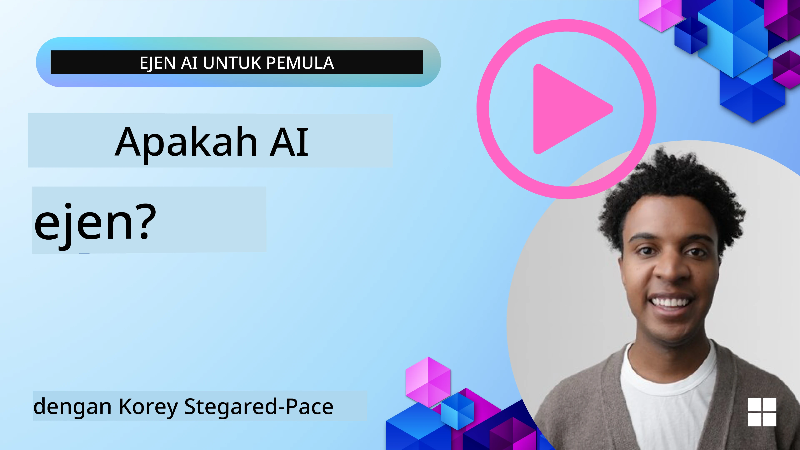
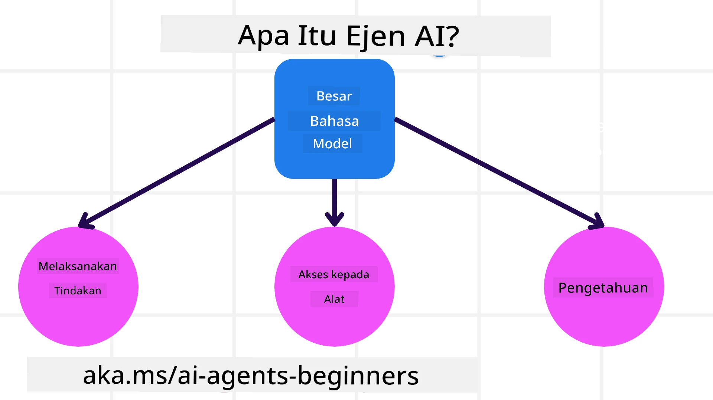
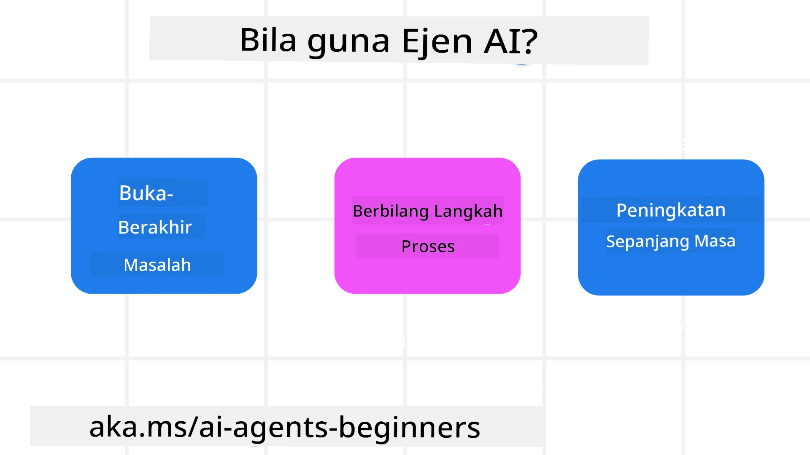

> _(Klik gambar di atas untuk menonton video bagi pelajaran ini)_

# Pengenalan kepada Ejen AI dan Kes Penggunaan Ejen

Selamat datang ke kursus **Ejen AI untuk Pemula**! Kursus ini memberikan anda pengetahuan asas — dan kod yang berfungsi sebenar — untuk mula membina Ejen AI dari awal.

Datang dan sapa kami di <a href="https://discord.gg/kzRShWzttr" target="_blank">Komuniti Discord Azure AI</a> — ia penuh dengan pelajar dan pembina AI yang gembira menjawab soalan.

Sebelum kita mula membina, mari kita pastikan kita benar-benar faham apa itu Ejen AI *adalah* dan bila masuk akal untuk menggunakannya.

---

## Pengenalan

Pelajaran ini merangkumi:

- Apa itu Ejen AI, dan jenis-jenis berbeza yang wujud
- Jenis tugasan yang paling sesuai untuk Ejen AI
- Blok binaan teras yang akan anda gunakan apabila mereka bentuk penyelesaian Ejen

## Matlamat Pembelajaran

Menjelang akhir pelajaran ini, anda sepatutnya dapat:

- Jelaskan apa itu Ejen AI dan bagaimana ia berbeza daripada penyelesaian AI biasa
- Tahu bila perlu menggunakan Ejen AI (dan bila tidak)
- Lukis lakaran reka bentuk penyelesaian Ejen asas untuk masalah dunia sebenar

---

## Mendefinisikan Ejen AI dan Jenis-jenis Ejen AI

### Apakah Ejen AI?

Berikut adalah cara mudah untuk memikirkannya:

> **Ejen AI adalah sistem yang membolehkan Model Bahasa Besar (LLM) sebenarnya *melakukan sesuatu* — dengan memberikan mereka alat dan pengetahuan untuk bertindak ke atas dunia, bukan hanya memberi respons kepada arahan.**

Mari kita terangkan sedikit:

- **Sistem** — Ejen AI bukan sekadar satu benda. Ia adalah koleksi bahagian yang bekerja bersama. Di intinya, setiap ejen mempunyai tiga bahagian:
  - **Persekitaran** — Ruang di mana ejen bekerja. Untuk ejen tempahan perjalanan, ini adalah platform tempahan itu sendiri.
  - **Sensor** — Bagaimana ejen membaca keadaan semasa persekitarannya. Ejen perjalanan kita mungkin memeriksa ketersediaan hotel atau harga penerbangan.
  - **Penggerak** — Bagaimana ejen mengambil tindakan. Ejen perjalanan mungkin menempah bilik, menghantar pengesahan, atau membatalkan tempahan.

- **Model Bahasa Besar** — Ejen wujud sebelum LLM, tetapi LLM adalah apa yang membuatkan ejen moden begitu kuat. Mereka boleh memahami bahasa semula jadi, berfikir tentang konteks, dan mengubah permintaan pengguna yang samar menjadi pelan tindakan yang konkrit.

- **Melakukan Tindakan** — Tanpa sistem ejen, LLM hanya menjana teks. Dalam sistem ejen, LLM boleh sebenarnya *melaksanakan* langkah - mencari dalam pangkalan data, memanggil API, menghantar mesej.

- **Akses kepada Alat** — Alat yang boleh digunakan ejen bergantung pada (1) persekitaran tempat ia berjalan dan (2) apa yang pembangun pilih untuk diberikan kepadanya. Ejen perjalanan mungkin boleh mencari penerbangan tetapi tidak boleh mengubah rekod pelanggan — semuanya bergantung pada sambungan yang anda buat.

- **Memori + Pengetahuan** — Ejen boleh mempunyai memori jangka pendek (perbualan semasa) dan memori jangka panjang (pangkalan data pelanggan, interaksi lalu). Ejen perjalanan mungkin "ingat" bahawa anda lebih suka tempat duduk berdekatan tingkap.

---

### Jenis-jenis Ejen AI

Tidak semua ejen dibina sama. Berikut adalah pecahan jenis utama, menggunakan ejen tempahan perjalanan sebagai contoh utama:

| **Jenis Ejen** | **Apa Yang Dilakukan** | **Contoh Ejen Perjalanan** |
|---|---|---|
| **Ejen Refleks Mudah** | Mengikuti peraturan yang terprogram — tiada memori, tiada perancangan. | Melihat email aduan → teruskan ke khidmat pelanggan. Itu sahaja. |
| **Ejen Refleks Berasaskan Model** | Menyimpan model dalaman dunia dan mengemas kini ketika keadaan berubah. | Memantau harga penerbangan sejarah dan memberi amaran tentang laluan yang tiba-tiba mahal. |
| **Ejen Berasaskan Matlamat** | Ada matlamat dan merancang langkah demi langkah untuk mencapainya. | Menempah perjalanan penuh (penerbangan, kereta, hotel) bermula dari lokasi semasa anda ke destinasi. |
| **Ejen Berasaskan Utiliti** | Tidak hanya mencari *sebuah* penyelesaian — mencari yang *terbaik* dengan menilai pertukaran. | Menyeimbangkan kos vs. kemudahan untuk mencari perjalanan yang paling sesuai dengan keutamaan anda. |
| **Ejen Pembelajaran** | Menjadi lebih baik dari masa ke masa dengan belajar dari maklum balas. | Melaraskan cadangan tempahan masa depan berdasarkan hasil kaji selidik selepas perjalanan. |
| **Ejen Hierarki** | Ejen tahap tinggi membahagikan kerja kepada sub-tugas dan mendelegasi kepada ejen tahap rendah. | Permintaan "batalkan perjalanan" dibahagikan: batalkan penerbangan, batalkan hotel, batalkan sewaan kereta — masing-masing dilaksanakan oleh sub-ejen. |
| **Sistem Multi-Ejen (MAS)** | Beberapa ejen bebas bekerja bersama (atau bersaing). | Kerjasama: ejen berasingan mengendalikan hotel, penerbangan, dan hiburan. Persaingan: beberapa ejen bersaing untuk mengisi bilik hotel pada harga terbaik. |

---

## Bila Menggunakan Ejen AI

Hanya kerana anda *boleh* menggunakan Ejen AI tidak bermakna anda selalu *perlu*. Berikut adalah situasi di mana ejen benar-benar bersinar:

- **Masalah Terbuka** — Bila langkah untuk menyelesaikan masalah tidak boleh diprogramkan terlebih dahulu. Anda perlukan LLM untuk menentukan laluan secara dinamik.
- **Proses Berbilang Langkah** — Tugasan yang memerlukan penggunaan alat dalam beberapa giliran, bukan hanya pencarian atau penjanaan tunggal.
- **Penambahbaikan dari Masa ke Masa** — Bila anda mahu sistem menjadi lebih bijak berdasarkan maklum balas pengguna atau isyarat persekitaran.

Kita akan selami lebih dalam bila (dan bila *tidak*) menggunakan Ejen AI dalam pelajaran **Membina Ejen AI yang Boleh Dipercayai** kemudian dalam kursus.

---

## Asas-Asas Penyelesaian Ejen

### Pembangunan Ejen

Perkara pertama yang anda buat apabila membina ejen adalah mentakrif *apa yang ia boleh buat* — alatan, tindakan, dan tingkah lakunya.

Dalam kursus ini, kami menggunakan **Microsoft Foundry Agent Service** sebagai platform utama kami. Ia menyokong:

- Model daripada penyedia seperti OpenAI, Mistral, dan Meta (Llama)
- Data berlesen daripada penyedia seperti Tripadvisor
- Definisi alat OpenAPI 3.0 piawai

### Corak Ejen

Anda berkomunikasi dengan LLM melalui arahan. Dengan ejen, anda tidak boleh sentiasa membuat setiap arahan secara manual — ejen perlu bertindak dalam banyak langkah. Di sinilah **Corak Ejen** datang. Mereka adalah strategi boleh guna semula untuk memberi arahan dan menyelaraskan LLM dengan cara yang lebih skala, boleh dipercayai.

Kursus ini disusun berdasarkan corak ejen yang paling biasa dan berguna.

### Rangka Kerja Ejen

Rangka Kerja Ejen memberi pembangun templat siap guna, alat dan infrastruktur untuk membina ejen. Ia memudahkan untuk:

- Sambungkan alat dan keupayaan
- Memerhati apa yang ejen lakukan (dan debug bila berlaku kesilapan)
- Bekerjasama antara pelbagai ejen

Dalam kursus ini, kami memberi tumpuan pada **Microsoft Agent Framework (MAF)** untuk membina ejen yang siap untuk produksi.

---

## Contoh Kod

Sedia untuk melihat ia beraksi? Berikut adalah contoh kod untuk pelajaran ini:

- 🐍 Python: [Agent Framework](./code_samples/01-python-agent-framework.ipynb)
- 🔷 .NET: [Agent Framework](./code_samples/01-dotnet-agent-framework.md)

---

## Ada Soalan?

Sertai [Microsoft Foundry Discord](https://discord.com/invite/ATgtXmAS5D) untuk berhubung dengan pelajar lain, menghadiri waktu pejabat, dan dapatkan soalan Ejen AI anda dijawab oleh komuniti.

---

## Pelajaran Sebelumnya

[Persediaan Kursus](../00-course-setup/README.md)

## Pelajaran Seterusnya

[Meneroka Rangka Kerja Ejen](../02-explore-agentic-frameworks/README.md)

---

<!-- CO-OP TRANSLATOR DISCLAIMER START -->
**Penafian**:
Dokumen ini telah diterjemahkan menggunakan perkhidmatan terjemahan AI [Co-op Translator](https://github.com/Azure/co-op-translator). Walaupun kami berusaha untuk ketepatan, sila ambil maklum bahawa terjemahan automatik mungkin mengandungi kesilapan atau ketidaktepatan. Dokumen asal dalam bahasa asalnya harus dianggap sebagai sumber yang sahih. Untuk maklumat penting, terjemahan oleh manusia profesional adalah disyorkan. Kami tidak bertanggungjawab terhadap sebarang salah faham atau salah tafsir yang timbul daripada penggunaan terjemahan ini.
<!-- CO-OP TRANSLATOR DISCLAIMER END -->