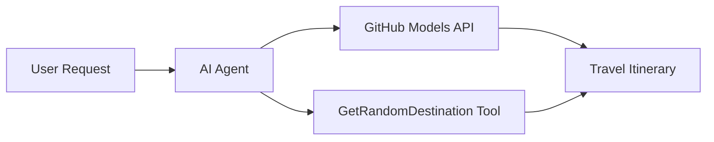

<!--
CO_OP_TRANSLATOR_METADATA:
{
  "original_hash": "23afd9be7b6ba5b69a44c3b6a78e07f6",
  "translation_date": "2025-11-06T10:05:37+00:00",
  "source_file": "01-intro-to-ai-agents/code_samples/01-dotnet-agent-framework.md",
  "language_code": "ms"
}
-->
# 🌍 Ejen Perjalanan AI dengan Microsoft Agent Framework (.NET)

## 📋 Gambaran Senario

Notebook ini menunjukkan cara membina ejen perancangan perjalanan pintar menggunakan Microsoft Agent Framework untuk .NET. Ejen ini boleh secara automatik menghasilkan jadual perjalanan sehari yang diperibadikan untuk destinasi rawak di seluruh dunia.

**Keupayaan Utama:**
- 🎲 **Pemilihan Destinasi Rawak**: Menggunakan alat khas untuk memilih tempat percutian
- 🗺️ **Perancangan Perjalanan Pintar**: Mencipta jadual perjalanan terperinci hari demi hari
- 🔄 **Penstriman Masa Nyata**: Menyokong respons segera dan penstriman
- 🛠️ **Integrasi Alat Khas**: Menunjukkan cara untuk memperluaskan keupayaan ejen

## 🔧 Seni Bina Teknikal

### Teknologi Teras
- **Microsoft Agent Framework**: Pelaksanaan .NET terkini untuk pembangunan ejen AI
- **Integrasi Model GitHub**: Menggunakan perkhidmatan inferensi model AI GitHub
- **Keserasian API OpenAI**: Memanfaatkan perpustakaan klien OpenAI dengan titik akhir tersuai
- **Konfigurasi Selamat**: Pengurusan kunci API berdasarkan persekitaran

### Komponen Utama
1. **AIAgent**: Pengatur utama ejen yang mengendalikan aliran perbualan
2. **Alat Khas**: Fungsi `GetRandomDestination()` tersedia untuk ejen
3. **Chat Client**: Antara muka perbualan yang disokong oleh Model GitHub
4. **Sokongan Penstriman**: Keupayaan penjanaan respons masa nyata

### Corak Integrasi


## 🚀 Memulakan

**Keperluan:**
- .NET 10.0 atau lebih tinggi
- Token akses API Model GitHub
- Pembolehubah persekitaran dikonfigurasi dalam fail `.env`

**Pembolehubah Persekitaran Diperlukan:**
```env
GITHUB_TOKEN=your_github_token
GITHUB_ENDPOINT=https://models.inference.ai.azure.com
GITHUB_MODEL_ID=gpt-4o-mini
```

Jalankan contoh kod di bawah secara berurutan untuk melihat ejen perjalanan beraksi!

---

## Aplikasi Fail Tunggal .NET: Contoh Ejen Perjalanan AI

Lihat `01-dotnet-agent-framework.cs` untuk contoh kod lengkap yang boleh dijalankan.

```bash
dotnet run 01-dotnet-agent-framework.cs
```

### Contoh Kod

```csharp
static string GetRandomDestination()
{
    var destinations = new List<string>
    {
        "Paris, France",
        "Tokyo, Japan",
        "New York City, USA",
        "Sydney, Australia",
        "Rome, Italy",
        "Barcelona, Spain",
        "Cape Town, South Africa",
        "Rio de Janeiro, Brazil",
        "Bangkok, Thailand",
        "Vancouver, Canada"
    };
    var random = new Random();
    int index = random.Next(destinations.Count);
    return destinations[index];
}

// Extract configuration from environment variables
var github_endpoint = Environment.GetEnvironmentVariable("GITHUB_ENDPOINT") ?? throw new InvalidOperationException("GITHUB_ENDPOINT is not set.");
var github_model_id = Environment.GetEnvironmentVariable("GITHUB_MODEL_ID") ?? "gpt-4o-mini";
var github_token = Environment.GetEnvironmentVariable("GITHUB_TOKEN") ?? throw new InvalidOperationException("GITHUB_TOKEN is not set.");

// Configure OpenAI Client Options
var openAIOptions = new OpenAIClientOptions()
{
    Endpoint = new Uri(github_endpoint)
};

// Initialize OpenAI Client with GitHub Models Configuration
var openAIClient = new OpenAIClient(new ApiKeyCredential(github_token), openAIOptions);

// Create AI Agent with Travel Planning Capabilities
AIAgent agent = openAIClient
    .GetChatClient(github_model_id)
    .CreateAIAgent(
        instructions: "You are a helpful AI Agent that can help plan vacations for customers at random destinations",
        tools: [AIFunctionFactory.Create(GetRandomDestination)]
    );

// Execute Agent: Plan a Day Trip (Non-Streaming)
Console.WriteLine(await agent.RunAsync("Plan me a day trip"));

// Execute Agent: Plan a Day Trip (Streaming Response)
await foreach (var update in agent.RunStreamingAsync("Plan me a day trip"))
{
    Console.Write(update);
}
```

---

**Penafian**:  
Dokumen ini telah diterjemahkan menggunakan perkhidmatan terjemahan AI [Co-op Translator](https://github.com/Azure/co-op-translator). Walaupun kami berusaha untuk ketepatan, sila ambil perhatian bahawa terjemahan automatik mungkin mengandungi kesilapan atau ketidaktepatan. Dokumen asal dalam bahasa asalnya harus dianggap sebagai sumber yang berwibawa. Untuk maklumat penting, terjemahan manusia profesional adalah disyorkan. Kami tidak bertanggungjawab atas sebarang salah faham atau salah tafsir yang timbul daripada penggunaan terjemahan ini.