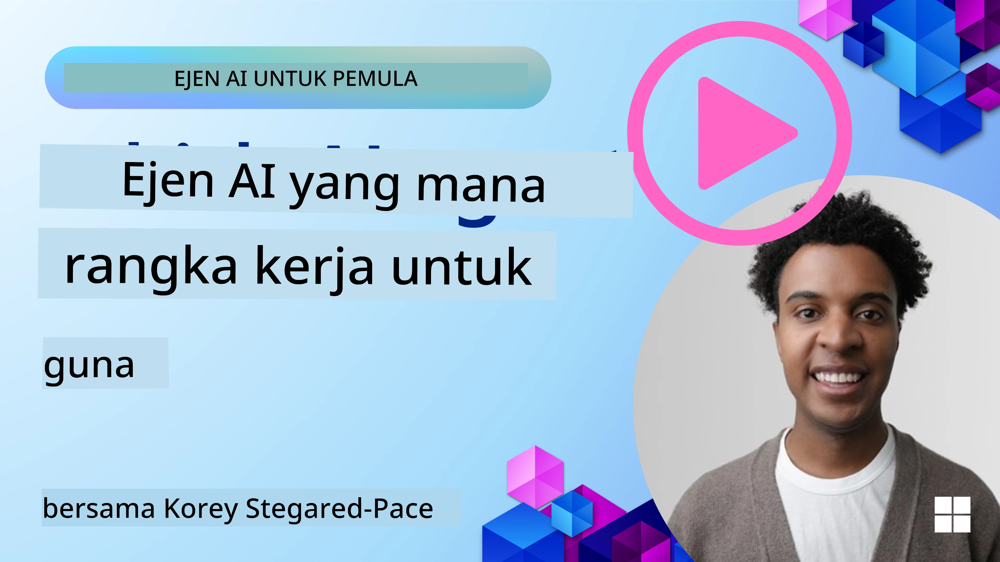

[](https://youtu.be/ODwF-EZo_O8?si=1xoy_B9RNQfrYdF7)

> _(Klik imej di atas untuk menonton video pelajaran ini)_

# Terokai Rangka Kerja Ejen AI

Rangka kerja ejen AI adalah platform perisian yang direka untuk memudahkan penciptaan, penyebaran, dan pengurusan ejen AI. Rangka kerja ini menyediakan pembangun dengan komponen prabina, abstraksi, dan alat yang menyelaraskan pembangunan sistem AI yang kompleks.

Rangka kerja ini membantu pembangun menumpukan kepada aspek unik aplikasi mereka dengan menyediakan pendekatan standard kepada cabaran biasa dalam pembangunan ejen AI. Ia meningkatkan kebolehskalaan, kebolehcapaian, dan kecekapan dalam membina sistem AI.

## Pengenalan

Pelajaran ini akan merangkumi:

- Apakah Rangka Kerja Ejen AI dan apakah yang ia benarkan pembangun capai?
- Bagaimana pasukan boleh menggunakan ini untuk membina prototaip dengan cepat, mengulang kaji, dan menambahbaik keupayaan ejen mereka?
- Apakah perbezaan antara rangka kerja dan alat yang dicipta oleh Microsoft (<a href="https://aka.ms/ai-agents-beginners/ai-agent-service" target="_blank">Azure AI Agent Service</a> dan <a href="https://learn.microsoft.com/azure/ai-services/openai/how-to/responses" target="_blank">Microsoft Agent Framework</a>)?
- Bolehkah saya mengintegrasikan alat ekosistem Azure sedia ada secara langsung, atau saya perlu penyelesaian berdiri sendiri?
- Apakah Azure AI Agents service dan bagaimana ia membantu saya?

## Matlamat Pembelajaran

Matlamat pelajaran ini adalah untuk membantu anda memahami:

- Peranan Rangka Kerja Ejen AI dalam pembangunan AI.
- Cara memanfaatkan Rangka Kerja Ejen AI untuk membina ejen pintar.
- Keupayaan utama yang dibolehkan oleh Rangka Kerja Ejen AI.
- Perbezaan antara Microsoft Agent Framework dan Azure AI Agent Service.

## Apakah Rangka Kerja Ejen AI dan apa yang ia benarkan pembangun lakukan?

Rangka kerja AI tradisional boleh membantu anda mengintegrasikan AI ke dalam aplikasi anda dan menjadikan aplikasi ini lebih baik dalam cara berikut:

- **Penyesuaian**: AI boleh menganalisis tingkah laku dan keutamaan pengguna untuk menyediakan cadangan, kandungan, dan pengalaman yang disesuaikan.
Contoh: Perkhidmatan penstriman seperti Netflix menggunakan AI untuk mencadangkan filem dan rancangan berdasarkan sejarah tontonan, meningkatkan penglibatan dan kepuasan pengguna.
- **Automasi dan Kecekapan**: AI boleh mengautomasikan tugas berulang, menyelaraskan aliran kerja, dan meningkatkan kecekapan operasi.
Contoh: Aplikasi khidmat pelanggan menggunakan chatbot bertenaga AI untuk menguruskan pertanyaan biasa, mengurangkan masa tindak balas dan membebaskan ejen manusia untuk isu yang lebih kompleks.
- **Pengalaman Pengguna Dipertingkatkan**: AI boleh memperbaiki pengalaman pengguna secara keseluruhan dengan menyediakan ciri pintar seperti pengecaman suara, pemprosesan bahasa semula jadi, dan teks ramalan.
Contoh: Pembantu maya seperti Siri dan Google Assistant menggunakan AI untuk memahami dan menjawab arahan suara, memudahkan pengguna berinteraksi dengan peranti mereka.

### Semua itu kedengaran hebat kan, jadi mengapa kita perlu Rangka Kerja Ejen AI?

Rangka kerja Ejen AI mewakili sesuatu yang lebih daripada sekadar rangka kerja AI. Ia direka untuk membolehkan penciptaan ejen pintar yang boleh berinteraksi dengan pengguna, ejen lain, dan persekitaran untuk mencapai matlamat tertentu. Ejen ini boleh menunjukkan kelakuan autonomi, membuat keputusan, dan menyesuaikan diri dengan keadaan yang berubah. Mari lihat beberapa keupayaan utama yang dibolehkan oleh Rangka Kerja Ejen AI:

- **Kerjasama dan Penyelarasan Ejen**: Membolehkan penciptaan pelbagai ejen AI yang boleh bekerja bersama, berkomunikasi, dan menyelaras untuk menyelesaikan tugas yang kompleks.
- **Automasi dan Pengurusan Tugas**: Menyediakan mekanisme untuk mengautomasikan aliran kerja berbilang langkah, pemindahan tugas, dan pengurusan tugas dinamik antara ejen.
- **Pemahaman Kontekstual dan Penyesuaian**: Melengkapkan ejen dengan kebolehan untuk memahami konteks, menyesuaikan diri dengan persekitaran yang berubah, dan membuat keputusan berdasarkan maklumat masa nyata.

Jadi secara ringkas, ejen membolehkan anda melakukan lebih banyak, membawa automasi ke tahap yang lebih tinggi, untuk mencipta sistem pintar yang boleh menyesuaikan dan belajar dari persekitaran mereka.

## Bagaimana untuk membina prototaip dengan cepat, mengulang kaji, dan memperbaiki keupayaan ejen?

Landskap ini bergerak pantas, tetapi terdapat beberapa perkara yang biasa dalam kebanyakan Rangka Kerja Ejen AI yang boleh membantu anda membina prototaip dan mengulang kaji dengan cepat iaitu komponen modul, alat kolaboratif, dan pembelajaran masa nyata. Mari kita selami ini:

- **Gunakan Komponen Modular**: SDK AI menawarkan komponen prabina seperti penyambung AI dan Memori, pemanggilan fungsi menggunakan bahasa semula jadi atau pemalam kod, templat permintaan, dan banyak lagi.
- **Manfaatkan Alat Kolaboratif**: Reka bentuk ejen dengan peranan dan tugas khusus, membolehkan mereka menguji dan memperbaiki aliran kerja kolaboratif.
- **Belajar dalam Masa Nyata**: Laksanakan gelung maklum balas di mana ejen belajar dari interaksi dan menyesuaikan kelakuan mereka secara dinamik.

### Gunakan Komponen Modular

SDK seperti Microsoft Agent Framework menawarkan komponen prabina seperti penyambung AI, definisi alat, dan pengurusan ejen.

**Bagaimana pasukan boleh menggunakan ini**: Pasukan boleh dengan cepat menyusun komponen ini untuk mencipta prototaip yang berfungsi tanpa perlu bermula dari awal, membolehkan eksperimen dan pengulangan cepat.

**Bagaimana ia berfungsi dalam praktik**: Anda boleh menggunakan parser prabina untuk mengekstrak maklumat daripada input pengguna, modul memori untuk menyimpan dan mengambil data, dan penjana permintaan untuk berinteraksi dengan pengguna, semua tanpa perlu membina komponen ini dari awal.

**Kod contoh**. Mari lihat contoh bagaimana anda boleh menggunakan Microsoft Agent Framework dengan `AzureAIProjectAgentProvider` untuk membolehkan model bertindak balas kepada input pengguna dengan pemanggilan alat:

``` python
# Contoh Microsoft Agent Framework Python

import asyncio
import os
from typing import Annotated

from agent_framework.azure import AzureAIProjectAgentProvider
from azure.identity import AzureCliCredential


# Definisikan fungsi alat contoh untuk menempah perjalanan
def book_flight(date: str, location: str) -> str:
    """Book travel given location and date."""
    return f"Travel was booked to {location} on {date}"


async def main():
    provider = AzureAIProjectAgentProvider(credential=AzureCliCredential())
    agent = await provider.create_agent(
        name="travel_agent",
        instructions="Help the user book travel. Use the book_flight tool when ready.",
        tools=[book_flight],
    )

    response = await agent.run("I'd like to go to New York on January 1, 2025")
    print(response)
    # Contoh keluaran: Penerbangan anda ke New York pada 1 Januari 2025 telah berjaya ditempah. Selamat jalan! ✈️🗽


if __name__ == "__main__":
    asyncio.run(main())
```

Apa yang anda boleh lihat daripada contoh ini ialah bagaimana anda boleh memanfaatkan parser prabina untuk mengekstrak maklumat utama daripada input pengguna, seperti asal, destinasi, dan tarikh permintaan tempahan penerbangan. Pendekatan modular ini membolehkan anda menumpukan pada logik tahap tinggi.

### Manfaatkan Alat Kolaboratif

Rangka kerja seperti Microsoft Agent Framework memudahkan penciptaan pelbagai ejen yang boleh bekerja bersama.

**Bagaimana pasukan boleh menggunakan ini**: Pasukan boleh mereka ejen dengan peranan dan tugas khusus, membolehkan mereka menguji dan memperbaiki aliran kerja kolaboratif serta meningkatkan kecekapan sistem keseluruhan.

**Bagaimana ia berfungsi dalam praktik**: Anda boleh mencipta satu pasukan ejen di mana setiap ejen mempunyai fungsi khusus, seperti pengambilan data, analisis, atau pembuatan keputusan. Ejen ini boleh berkomunikasi dan berkongsi maklumat untuk mencapai matlamat bersama, seperti menjawab pertanyaan pengguna atau menyiapkan tugasan.

**Kod contoh (Microsoft Agent Framework)**:

```python
# Mewujudkan beberapa ejen yang bekerjasama menggunakan Microsoft Agent Framework

import os
from agent_framework.azure import AzureAIProjectAgentProvider
from azure.identity import AzureCliCredential

provider = AzureAIProjectAgentProvider(credential=AzureCliCredential())

# Ejen Pengambilan Data
agent_retrieve = await provider.create_agent(
    name="dataretrieval",
    instructions="Retrieve relevant data using available tools.",
    tools=[retrieve_tool],
)

# Ejen Analisis Data
agent_analyze = await provider.create_agent(
    name="dataanalysis",
    instructions="Analyze the retrieved data and provide insights.",
    tools=[analyze_tool],
)

# Jalankan ejen secara berurutan pada satu tugas
retrieval_result = await agent_retrieve.run("Retrieve sales data for Q4")
analysis_result = await agent_analyze.run(f"Analyze this data: {retrieval_result}")
print(analysis_result)
```

Apa yang anda lihat dalam kod sebelum ini ialah bagaimana anda boleh mencipta tugasan yang melibatkan pelbagai ejen bekerjasama untuk menganalisis data. Setiap ejen melaksanakan fungsi khusus, dan tugasan itu dilaksanakan dengan menyelaras ejen untuk mencapai hasil yang diingini. Dengan mencipta ejen berdedikasi dengan peranan khusus, anda boleh meningkatkan kecekapan dan prestasi tugasan.

### Belajar dalam Masa Nyata

Rangka kerja maju menyediakan keupayaan untuk pemahaman konteks masa nyata dan penyesuaian.

**Bagaimana pasukan boleh menggunakan ini**: Pasukan boleh melaksanakan gelung maklum balas di mana ejen belajar dari interaksi dan menyesuaikan kelakuan mereka secara dinamik, membawa kepada penambahbaikan berterusan dan penyempurnaan keupayaan.

**Bagaimana ia berfungsi dalam praktik**: Ejen boleh menganalisis maklum balas pengguna, data persekitaran, dan hasil tugasan untuk mengemas kini pangkalan pengetahuan mereka, menyesuaikan algoritma pembuatan keputusan, dan meningkatkan prestasi dari masa ke masa. Proses pembelajaran berulang ini membolehkan ejen menyesuaikan diri dengan keadaan dan keutamaan pengguna yang berubah, meningkatkan keberkesanan sistem keseluruhan.

## Apakah perbezaan antara Microsoft Agent Framework dan Azure AI Agent Service?

Terdapat banyak cara untuk membandingkan pendekatan ini, tetapi mari kita lihat beberapa perbezaan utama dari segi reka bentuk, keupayaan, dan kes penggunaan sasaran:

## Microsoft Agent Framework (MAF)

Microsoft Agent Framework menyediakan SDK yang disederhanakan untuk membina ejen AI menggunakan `AzureAIProjectAgentProvider`. Ia membolehkan pembangun mencipta ejen yang memanfaatkan model Azure OpenAI dengan pemanggilan alat terbina dalam, pengurusan perbualan, dan keselamatan kelas perusahaan melalui pengenalan Azure.

**Kes Penggunaan**: Membina ejen AI sedia produksi dengan penggunaan alat, aliran kerja berbilang langkah, dan senario integrasi perusahaan.

Berikut adalah beberapa konsep teras penting dalam Microsoft Agent Framework:

- **Ejen**. Ejen diwujudkan melalui `AzureAIProjectAgentProvider` dan dikonfigurasikan dengan nama, arahan, dan alat. Ejen boleh:
  - **Memproses mesej pengguna** dan menghasilkan respons menggunakan model Azure OpenAI.
  - **Memanggil alat** secara automatik berdasarkan konteks perbualan.
  - **Mengekalkan keadaan perbualan** merentasi pelbagai interaksi.

  Berikut adalah petikan kod yang menunjukkan cara mencipta ejen:

    ```python
    import os
    from agent_framework.azure import AzureAIProjectAgentProvider
    from azure.identity import AzureCliCredential

    provider = AzureAIProjectAgentProvider(credential=AzureCliCredential())
    agent = await provider.create_agent(
        name="my_agent",
        instructions="You are a helpful assistant.",
    )

    response = await agent.run("Hello, World!")
    print(response)
    ```

- **Alat**. Rangka kerja menyokong mendefinisikan alat sebagai fungsi Python yang boleh dipanggil oleh ejen secara automatik. Alat didaftarkan semasa penciptaan ejen:

    ```python
    def get_weather(location: str) -> str:
        """Get the current weather for a location."""
        return f"The weather in {location} is sunny, 72\u00b0F."

    agent = await provider.create_agent(
        name="weather_agent",
        instructions="Help users check the weather.",
        tools=[get_weather],
    )
    ```

- **Penyelarasan Pelbagai Ejen**. Anda boleh mencipta pelbagai ejen dengan kepakaran berbeza dan menyelaras kerja mereka:

    ```python
    planner = await provider.create_agent(
        name="planner",
        instructions="Break down complex tasks into steps.",
    )

    executor = await provider.create_agent(
        name="executor",
        instructions="Execute the planned steps using available tools.",
        tools=[execute_tool],
    )

    plan = await planner.run("Plan a trip to Paris")
    result = await executor.run(f"Execute this plan: {plan}")
    ```

- **Integrasi Pengenalan Azure**. Rangka kerja menggunakan `AzureCliCredential` (atau `DefaultAzureCredential`) untuk pengesahan selamat tanpa kunci, menghapuskan keperluan mengurus kunci API secara langsung.

## Azure AI Agent Service

Azure AI Agent Service adalah penambahan terbaru, diperkenalkan di Microsoft Ignite 2024. Ia membenarkan pembangunan dan penyebaran ejen AI dengan model yang lebih fleksibel, seperti pemanggilan terus LLM sumber terbuka seperti Llama 3, Mistral, dan Cohere.

Azure AI Agent Service menyediakan mekanisme keselamatan perusahaan yang lebih kuat dan kaedah penyimpanan data, menjadikannya sesuai untuk aplikasi perusahaan.

Ia berfungsi terus dengan Microsoft Agent Framework untuk membina dan menyebarkan ejen.

Perkhidmatan ini kini dalam Perintis Awam dan menyokong Python serta C# untuk membina ejen.

Menggunakan SDK Python Azure AI Agent Service, kita boleh mencipta ejen dengan alat yang ditakrifkan pengguna:

```python
import asyncio
from azure.identity import DefaultAzureCredential
from azure.ai.projects import AIProjectClient

# Takrifkan fungsi alat
def get_specials() -> str:
    """Provides a list of specials from the menu."""
    return """
    Special Soup: Clam Chowder
    Special Salad: Cobb Salad
    Special Drink: Chai Tea
    """

def get_item_price(menu_item: str) -> str:
    """Provides the price of the requested menu item."""
    return "$9.99"


async def main() -> None:
    credential = DefaultAzureCredential()
    project_client = AIProjectClient.from_connection_string(
        credential=credential,
        conn_str="your-connection-string",
    )

    agent = project_client.agents.create_agent(
        model="gpt-4o-mini",
        name="Host",
        instructions="Answer questions about the menu.",
        tools=[get_specials, get_item_price],
    )

    thread = project_client.agents.create_thread()

    user_inputs = [
        "Hello",
        "What is the special soup?",
        "How much does that cost?",
        "Thank you",
    ]

    for user_input in user_inputs:
        print(f"# User: '{user_input}'")
        message = project_client.agents.create_message(
            thread_id=thread.id,
            role="user",
            content=user_input,
        )
        run = project_client.agents.create_and_process_run(
            thread_id=thread.id, agent_id=agent.id
        )
        messages = project_client.agents.list_messages(thread_id=thread.id)
        print(f"# Agent: {messages.data[0].content[0].text.value}")


if __name__ == "__main__":
    asyncio.run(main())
```

### Konsep Teras

Azure AI Agent Service mempunyai konsep teras berikut:

- **Ejen**. Azure AI Agent Service berintegrasi dengan Microsoft Foundry. Dalam AI Foundry, Ejen AI bertindak sebagai mikroservis "pintar" yang boleh digunakan untuk menjawab soalan (RAG), melaksanakan tindakan, atau mengautomasikan aliran kerja sepenuhnya. Ia mencapainya dengan menggabungkan kuasa model AI generatif dengan alat yang membolehkannya mengakses dan berinteraksi dengan sumber data dunia sebenar. Berikut adalah contoh ejen:

    ```python
    agent = project_client.agents.create_agent(
        model="gpt-4o-mini",
        name="my-agent",
        instructions="You are helpful agent",
        tools=code_interpreter.definitions,
        tool_resources=code_interpreter.resources,
    )
    ```

    Dalam contoh ini, ejen dicipta dengan model `gpt-4o-mini`, nama `my-agent`, dan arahan `You are helpful agent`. Ejen ini dilengkapi dengan alat dan sumber untuk melaksanakan tugasan interpretasi kod.

- **Thread dan mesej**. Thread adalah satu konsep penting lain. Ia mewakili perbualan atau interaksi antara ejen dan pengguna. Thread boleh digunakan untuk menjejaki kemajuan perbualan, menyimpan maklumat konteks, dan menguruskan keadaan interaksi. Berikut adalah contoh thread:

    ```python
    thread = project_client.agents.create_thread()
    message = project_client.agents.create_message(
        thread_id=thread.id,
        role="user",
        content="Could you please create a bar chart for the operating profit using the following data and provide the file to me? Company A: $1.2 million, Company B: $2.5 million, Company C: $3.0 million, Company D: $1.8 million",
    )
    
    # Ask the agent to perform work on the thread
    run = project_client.agents.create_and_process_run(thread_id=thread.id, agent_id=agent.id)
    
    # Fetch and log all messages to see the agent's response
    messages = project_client.agents.list_messages(thread_id=thread.id)
    print(f"Messages: {messages}")
    ```

    Dalam kod sebelum ini, satu thread dicipta. Selepas itu, mesej dihantar ke thread. Dengan memanggil `create_and_process_run`, ejen diminta untuk melaksanakan kerja pada thread tersebut. Akhirnya, mesej diambil dan direkodkan untuk melihat respons ejen. Mesej-mesej tersebut menunjukkan kemajuan perbualan antara pengguna dan ejen. Juga penting untuk memahami bahawa mesej boleh dalam pelbagai jenis seperti teks, imej, atau fail, iaitu hasil kerja ejen contohnya imej atau respons teks. Sebagai pembangun, anda boleh menggunakan maklumat ini untuk memproses respons lebih lanjut atau menyampaikannya kepada pengguna.

- **Integrasi dengan Microsoft Agent Framework**. Azure AI Agent Service berfungsi lancar dengan Microsoft Agent Framework, bermakna anda boleh membina ejen menggunakan `AzureAIProjectAgentProvider` dan menyebarkannya melalui Agent Service untuk senario produksi.

**Kes Penggunaan**: Azure AI Agent Service direka untuk aplikasi perusahaan yang memerlukan penyebaran ejen AI yang selamat, boleh diskalakan, dan fleksibel.

## Apakah perbezaan antara pendekatan ini?

Memang kedengaran ada pertindihan, tetapi terdapat beberapa perbezaan utama dari segi reka bentuk, keupayaan, dan kes penggunaan sasaran:

- **Microsoft Agent Framework (MAF)**: Adalah SDK sedia produksi untuk membina ejen AI. Ia menyediakan API yang disederhanakan untuk mencipta ejen dengan pemanggilan alat, pengurusan perbualan, dan integrasi pengenalan Azure.
- **Azure AI Agent Service**: Adalah platform dan perkhidmatan penyebaran dalam Azure Foundry untuk ejen. Ia menawarkan sambungan terbina dalam kepada perkhidmatan seperti Azure OpenAI, Azure AI Search, Bing Search dan pelaksanaan kod.

Masih tidak pasti yang mana satu hendak dipilih?

### Kes Penggunaan

Mari lihat jika kami boleh membantu anda dengan melalui beberapa kes penggunaan biasa:

> S: Saya membina aplikasi ejen AI produksi dan mahu bermula dengan cepat  
>

>J: Microsoft Agent Framework adalah pilihan yang bagus. Ia menyediakan API Pythonik ringkas melalui `AzureAIProjectAgentProvider` yang membolehkan anda mentakrif ejen dengan alat dan arahan hanya dalam beberapa baris kod.

>S: Saya perlukan penyebaran kelas perusahaan dengan integrasi Azure seperti Search dan pelaksanaan kod  
>
> J: Azure AI Agent Service adalah yang paling sesuai. Ia adalah perkhidmatan platform yang menyediakan keupayaan terbina dalam untuk pelbagai model, Azure AI Search, Bing Search dan Azure Functions. Ia memudahkan anda membina ejen dalam Foundry Portal dan menyebarkannya pada skala besar.

> S: Saya masih keliru, berikan saya satu pilihan sahaja  
>
> J: Mulakan dengan Microsoft Agent Framework untuk membina ejen anda, dan kemudian gunakan Azure AI Agent Service bila anda perlu menyebar dan menskalakan mereka dalam produksi. Pendekatan ini membolehkan anda mengulang kaji logik ejen dengan pantas sambil mempunyai laluan jelas untuk penyebaran perusahaan.

Mari kita ringkaskan perbezaan utama dalam jadual:

| Rangka Kerja | Fokus | Konsep Teras | Kes Penggunaan |
| --- | --- | --- | --- |
| Microsoft Agent Framework | SDK ejen ringkas dengan pemanggilan alat | Ejen, Alat, Pengenalan Azure | Membina ejen AI, penggunaan alat, aliran kerja berbilang langkah |
| Azure AI Agent Service | Model fleksibel, keselamatan perusahaan, Penjanaan Kod, Pemanggilan Alat | Modulariti, Kolaborasi, Orkestrasi Proses | Penyebaran ejen AI yang selamat, boleh diskalakan, dan fleksibel |

## Bolehkah saya mengintegrasikan alat ekosistem Azure sedia ada secara langsung, atau saya perlu penyelesaian berdiri sendiri?
Jawapannya adalah ya, anda boleh mengintegrasikan alat ekosistem Azure sedia ada anda secara langsung dengan Perkhidmatan Agen AI Azure terutamanya, kerana ia telah dibina untuk berfungsi dengan lancar bersama perkhidmatan Azure yang lain. Contohnya, anda boleh mengintegrasikan Bing, Azure AI Search, dan Azure Functions. Terdapat juga integrasi mendalam dengan Microsoft Foundry.

Microsoft Agent Framework juga berintegrasi dengan perkhidmatan Azure melalui `AzureAIProjectAgentProvider` dan identiti Azure, membolehkan anda memanggil perkhidmatan Azure secara langsung dari alat agen anda.

## Kod Contoh

- Python: [Agent Framework](./code_samples/02-python-agent-framework.ipynb)
- .NET: [Agent Framework](./code_samples/02-dotnet-agent-framework.md)

## Ada Lebih Banyak Soalan tentang Rangka Kerja Agen AI?

Sertai [Microsoft Foundry Discord](https://aka.ms/ai-agents/discord) untuk berjumpa dengan pelajar lain, menghadiri waktu pejabat dan dapatkan jawapan untuk soalan Agen AI anda.

## Rujukan

- <a href="https://techcommunity.microsoft.com/blog/azure-ai-services-blog/introducing-azure-ai-agent-service/4298357" target="_blank">Perkhidmatan Agen Azure</a>
- <a href="https://learn.microsoft.com/azure/ai-services/openai/how-to/responses" target="_blank">Microsoft Agent Framework - Respons Azure OpenAI</a>
- <a href="https://learn.microsoft.com/azure/ai-services/agents/overview" target="_blank">Perkhidmatan Agen AI Azure</a>

## Pelajaran Sebelumnya

[Pengenalan kepada Agen AI dan Kes Penggunaan Agen](../01-intro-to-ai-agents/README.md)

## Pelajaran Seterusnya

[Memahami Corak Reka Bentuk Agenik](../03-agentic-design-patterns/README.md)

---

<!-- CO-OP TRANSLATOR DISCLAIMER START -->
**Penafian**:  
Dokumen ini telah diterjemahkan menggunakan perkhidmatan terjemahan AI [Co-op Translator](https://github.com/Azure/co-op-translator). Walaupun kami berusaha untuk mencapai ketepatan, sila ambil perhatian bahawa terjemahan automatik mungkin mengandungi kesilapan atau ketidaktepatan. Dokumen asal dalam bahasa asalnya hendaklah dianggap sebagai sumber yang sahih. Untuk maklumat yang kritikal, terjemahan profesional oleh manusia adalah disarankan. Kami tidak bertanggungjawab atas sebarang salah faham atau penafsiran yang salah yang timbul daripada penggunaan terjemahan ini.
<!-- CO-OP TRANSLATOR DISCLAIMER END -->