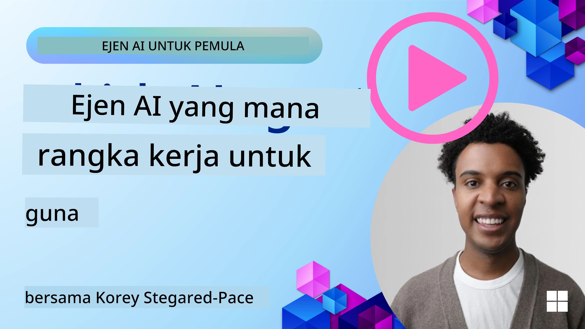

[](https://youtu.be/ODwF-EZo_O8?si=1xoy_B9RNQfrYdF7)

> _(Klik imej di atas untuk menonton video pelajaran ini)_

# Terokai Rangka Kerja Ejen AI

Rangka kerja ejen AI adalah platform perisian yang direka untuk memudahkan penciptaan, penyebaran, dan pengurusan ejen AI. Rangka kerja ini menyediakan pembangun dengan komponen pra-bina, abstraksi, dan alat yang memudahkan pembangunan sistem AI yang kompleks.

Rangka kerja ini membantu pembangun memberi tumpuan kepada aspek unik aplikasi mereka dengan menyediakan pendekatan piawai untuk cabaran biasa dalam pembangunan ejen AI. Ia meningkatkan kebolehlaksanaan, kebolehcapaian, dan kecekapan dalam pembinaan sistem AI.

## Pengenalan 

Pelajaran ini akan merangkumi:

- Apakah Rangka Kerja Ejen AI dan apa yang ia benarkan pembangun capai?
- Bagaimana pasukan boleh menggunakan ini untuk membuat prototaip cepat, iterasi, dan memperbaiki keupayaan ejen mereka?
- Apakah perbezaan antara rangka kerja dan alat yang dibangunkan oleh Microsoft (<a href="https://aka.ms/ai-agents-beginners/ai-agent-service" target="_blank">Microsoft Foundry Agent Service</a> dan <a href="https://learn.microsoft.com/azure/ai-services/openai/how-to/responses" target="_blank">Microsoft Agent Framework</a>)?
- Bolehkah saya mengintegrasikan alat ekosistem Azure sedia ada saya secara terus, atau adakah saya memerlukan penyelesaian berdikari?
- Apakah itu Microsoft Foundry Agent Service dan bagaimana ia membantu saya?

## Matlamat pembelajaran

Matlamat pelajaran ini adalah untuk membantu anda memahami:

- Peranan Rangka Kerja Ejen AI dalam pembangunan AI.
- Cara menggunakan Rangka Kerja Ejen AI untuk membina ejen pintar.
- Keupayaan utama yang disediakan oleh Rangka Kerja Ejen AI.
- Perbezaan antara Microsoft Agent Framework dan Microsoft Foundry Agent Service.

## Apakah Rangka Kerja Ejen AI dan apa yang ia benarkan pembangun lakukan?

Rangka Kerja AI Tradisional boleh membantu anda mengintegrasikan AI ke dalam aplikasi anda dan menjadikan aplikasi ini lebih baik dengan cara-cara berikut:

- **Personalisasi**: AI boleh menganalisis tingkah laku dan keutamaan pengguna untuk menyediakan cadangan, kandungan, dan pengalaman yang diperibadikan.
Contoh: Perkhidmatan penstriman seperti Netflix menggunakan AI untuk mencadangkan filem dan rancangan berdasarkan sejarah tontonan, meningkatkan penglibatan dan kepuasan pengguna.
- **Automasi dan Kecekapan**: AI boleh mengotomatikkan tugas berulang, memperkemas aliran kerja, dan meningkatkan kecekapan operasi.
Contoh: Aplikasi perkhidmatan pelanggan menggunakan chatbot berkuasa AI untuk mengendalikan pertanyaan biasa, mengurangkan masa tindak balas dan membebaskan ejen manusia untuk isu yang lebih kompleks.
- **Pengalaman Pengguna yang Dipertingkatkan**: AI boleh memperbaiki pengalaman pengguna secara keseluruhan dengan menyediakan ciri pintar seperti pengecaman suara, pemprosesan bahasa semula jadi, dan teks ramalan.
Contoh: Pembantu maya seperti Siri dan Google Assistant menggunakan AI untuk memahami dan bertindak balas kepada arahan suara, memudahkan pengguna berinteraksi dengan peranti mereka.

### Semua ini kedengaran hebat, jadi mengapa kita memerlukan Rangka Kerja Ejen AI?

Rangka Kerja Ejen AI mewakili sesuatu yang lebih daripada sekadar rangka kerja AI. Ia direka untuk membolehkan penciptaan ejen pintar yang boleh berinteraksi dengan pengguna, ejen lain, dan persekitaran untuk mencapai matlamat tertentu. Ejen ini boleh menunjukkan tingkah laku autonomi, membuat keputusan, dan menyesuaikan diri dengan keadaan yang berubah. Mari kita lihat beberapa keupayaan utama yang disediakan oleh Rangka Kerja Ejen AI:

- **Kerjasama dan Penyelarasan Ejen**: Membolehkan penciptaan beberapa ejen AI yang boleh bekerja bersama, berkomunikasi, dan menyelaraskan untuk menyelesaikan tugas yang kompleks.
- **Automasi dan Pengurusan Tugas**: Menyediakan mekanisme untuk mengotomatikkan aliran kerja berbilang langkah, pendelegasian tugas, dan pengurusan tugas dinamik antara ejen.
- **Pemahaman Kontekstual dan Penyesuaian**: Melengkapi ejen dengan kemampuan untuk memahami konteks, menyesuaikan diri dengan persekitaran yang berubah, dan membuat keputusan berdasarkan maklumat masa nyata.

Jadi, secara ringkas, ejen membolehkan anda melakukan lebih banyak, membawa automasi ke tahap seterusnya, untuk mencipta sistem yang lebih pintar yang boleh menyesuaikan diri dan belajar daripada persekitaran mereka.

## Bagaimana untuk membuat prototaip cepat, iterasi, dan memperbaiki keupayaan ejen?

Lanskap ini bergerak pantas, tetapi terdapat beberapa perkara yang biasa dalam kebanyakan Rangka Kerja Ejen AI yang dapat membantu anda membuat prototaip dan iterasi dengan cepat iaitu komponen modul, alat kolaboratif, dan pembelajaran masa nyata. Mari kita teliti ini:

- **Gunakan Komponen Modular**: SDK AI menawarkan komponen pra-bina seperti penyambung AI dan Memori, panggilan fungsi menggunakan bahasa semula jadi atau plugin kod, templat arahan, dan lain-lain.
- **Manfaatkan Alat Kolaboratif**: Reka ejen dengan peranan dan tugas khusus, membolehkan mereka menguji dan memperbaiki aliran kerja kolaboratif.
- **Belajar Secara Masa Nyata**: Laksanakan gelung maklum balas di mana ejen belajar dari interaksi dan menyesuaikan tingkah laku mereka secara dinamik.

### Gunakan Komponen Modular

SDK seperti Microsoft Agent Framework menawarkan komponen pra-bina seperti penyambung AI, definisi alat, dan pengurusan ejen.

**Bagaimana pasukan boleh menggunakan ini**: Pasukan boleh cepat menyusun komponen ini untuk mencipta prototaip yang berfungsi tanpa memulakan dari kosong, membolehkan eksperimen dan iterasi yang pantas.

**Bagaimana ia berfungsi dalam praktik**: Anda boleh menggunakan pengurai pra-bina untuk mengekstrak maklumat dari input pengguna, modul memori untuk menyimpan dan mengambil data, dan penjana arahan untuk berinteraksi dengan pengguna, semua tanpa perlu membina komponen ini dari awal.

**Contoh kod**. Mari kita lihat contoh bagaimana anda boleh menggunakan Microsoft Agent Framework dengan `FoundryChatClient` untuk membolehkan model bertindak balas kepada input pengguna dengan panggilan alat:

``` python
# Contoh Python Rangka Kerja Ejen Microsoft

import asyncio
import os

from agent_framework import tool
from agent_framework.foundry import FoundryChatClient
from azure.identity import AzureCliCredential


# Tetapkan fungsi alat contoh untuk menempah perjalanan
@tool(approval_mode="never_require")
def book_flight(date: str, location: str) -> str:
    """Book travel given location and date."""
    return f"Travel was booked to {location} on {date}"


async def main():
    provider = FoundryChatClient(
        project_endpoint=os.environ["AZURE_AI_PROJECT_ENDPOINT"],
        model=os.environ["AZURE_AI_MODEL_DEPLOYMENT_NAME"],
        credential=AzureCliCredential(),
    )
    agent = provider.as_agent(
        name="travel_agent",
        instructions="Help the user book travel. Use the book_flight tool when ready.",
        tools=[book_flight],
    )

    response = await agent.run("I'd like to go to New York on January 1, 2025")
    print(response)
    # Contoh keluaran: Penerbangan anda ke New York pada 1 Januari 2025 telah berjaya ditempah. Selamat jalan! ✈️🗽


if __name__ == "__main__":
    asyncio.run(main())
```

Apa yang anda lihat dalam contoh ini adalah bagaimana anda boleh memanfaatkan pengurai pra-bina untuk mengekstrak maklumat utama daripada input pengguna, seperti asal, destinasi, dan tarikh untuk permintaan tempahan penerbangan. Pendekatan modular ini membolehkan anda fokus pada logik aras tinggi.

### Manfaatkan Alat Kolaboratif

Rangka kerja seperti Microsoft Agent Framework memudahkan penciptaan beberapa ejen yang boleh bekerja bersama.

**Bagaimana pasukan boleh menggunakan ini**: Pasukan boleh mereka ejen dengan peranan dan tugas tertentu, membolehkan mereka menguji dan memperbaiki aliran kerja kolaboratif serta meningkatkan kecekapan keseluruhan sistem.

**Bagaimana ia berfungsi dalam praktik**: Anda boleh mencipta satu pasukan ejen di mana setiap ejen mempunyai fungsi khusus, seperti pengambilan data, analisis, atau pembuatan keputusan. Ejen-ejen ini boleh berkomunikasi dan berkongsi maklumat untuk mencapai matlamat bersama, seperti menjawab soalan pengguna atau menyelesaikan tugas.

**Contoh kod (Microsoft Agent Framework)**:

```python
# Mewujudkan pelbagai ejen yang bekerja bersama menggunakan Rangka Kerja Ejen Microsoft

import os
from agent_framework.foundry import FoundryChatClient
from azure.identity import AzureCliCredential

provider = FoundryChatClient(
    project_endpoint=os.environ["AZURE_AI_PROJECT_ENDPOINT"],
    model=os.environ["AZURE_AI_MODEL_DEPLOYMENT_NAME"],
    credential=AzureCliCredential(),
)

# Ejen Pengambilan Data
agent_retrieve = provider.as_agent(
    name="dataretrieval",
    instructions="Retrieve relevant data using available tools.",
    tools=[retrieve_tool],
)

# Ejen Analisis Data
agent_analyze = provider.as_agent(
    name="dataanalysis",
    instructions="Analyze the retrieved data and provide insights.",
    tools=[analyze_tool],
)

# Jalankan ejen secara berurutan pada satu tugasan
retrieval_result = await agent_retrieve.run("Retrieve sales data for Q4")
analysis_result = await agent_analyze.run(f"Analyze this data: {retrieval_result}")
print(analysis_result)
```

Apa yang anda lihat dalam kod sebelumnya adalah bagaimana anda boleh mencipta tugas yang melibatkan beberapa ejen yang bekerja bersama untuk menganalisis data. Setiap ejen melaksanakan fungsi tertentu, dan tugas dijalankan dengan menyelaraskan ejen untuk mencapai hasil yang diingini. Dengan mencipta ejen khusus dengan peranan khusus, anda boleh meningkatkan kecekapan dan prestasi tugas.

### Belajar Secara Masa Nyata

Rangka kerja lanjutan menyediakan keupayaan untuk pemahaman konteks masa nyata dan penyesuaian.

**Bagaimana pasukan boleh menggunakan ini**: Pasukan boleh melaksanakan gelung maklum balas di mana ejen belajar dari interaksi dan menyesuaikan tingkah laku mereka secara dinamik, membawa kepada peningkatan berterusan dan penambahbaikan keupayaan.

**Bagaimana ia berfungsi dalam praktik**: Ejen boleh menganalisis maklum balas pengguna, data persekitaran, dan hasil tugas untuk mengemas kini pangkalan pengetahuan mereka, menyesuaikan algoritma pembuatan keputusan, dan meningkatkan prestasi dari masa ke masa. Proses pembelajaran iteratif ini membolehkan ejen menyesuaikan diri dengan keadaan dan keutamaan pengguna yang berubah, meningkatkan keberkesanan sistem secara keseluruhan.

## Apakah perbezaan antara Microsoft Agent Framework dan Microsoft Foundry Agent Service?

Terdapat banyak cara untuk membandingkan pendekatan ini, tetapi mari kita lihat beberapa perbezaan utama dari segi reka bentuk, keupayaan, dan kes penggunaan sasaran:

## Microsoft Agent Framework (MAF)

Microsoft Agent Framework menyediakan SDK yang dipermudahkan untuk membina ejen AI menggunakan `FoundryChatClient`. Ia membolehkan pembangun mencipta ejen yang memanfaatkan model Azure OpenAI dengan panggilan alat terbina dalam, pengurusan perbualan, dan keselamatan bertaraf perusahaan melalui identiti Azure.

**Kes Penggunaan**: Membina ejen AI sedia untuk pengeluaran dengan penggunaan alat, aliran kerja berbilang langkah, dan senario integrasi perniagaan.

Berikut adalah beberapa konsep teras penting dalam Microsoft Agent Framework:

- **Ejen**. Ejen dicipta melalui `FoundryChatClient` dan dikonfigurasi dengan nama, arahan, dan alat. Ejen boleh:
  - **Memproses mesej pengguna** dan menjana tindak balas menggunakan model Azure OpenAI.
  - **Memanggil alat** secara automatik berdasarkan konteks perbualan.
  - **Mengekalkan keadaan perbualan** merentasi pelbagai interaksi.

  Berikut adalah petikan kod yang menunjukkan cara mencipta ejen:

    ```python
    import os
    from agent_framework.foundry import FoundryChatClient
    from azure.identity import AzureCliCredential

    provider = FoundryChatClient(
        project_endpoint=os.environ["AZURE_AI_PROJECT_ENDPOINT"],
        model=os.environ["AZURE_AI_MODEL_DEPLOYMENT_NAME"],
        credential=AzureCliCredential(),
    )
    agent = provider.as_agent(
        name="my_agent",
        instructions="You are a helpful assistant.",
    )

    response = await agent.run("Hello, World!")
    print(response)
    ```

- **Alat**. Rangka kerja menyokong definisi alat sebagai fungsi Python yang boleh dipanggil secara automatik oleh ejen. Alat didaftar semasa mencipta ejen:

    ```python
    def get_weather(location: str) -> str:
        """Get the current weather for a location."""
        return f"The weather in {location} is sunny, 72\u00b0F."

    agent = provider.as_agent(
        name="weather_agent",
        instructions="Help users check the weather.",
        tools=[get_weather],
    )
    ```

- **Penyelarasan Pelbagai Ejen**. Anda boleh mencipta pelbagai ejen dengan kepakaran berbeza dan menyelaras kerja mereka:

    ```python
    planner = provider.as_agent(
        name="planner",
        instructions="Break down complex tasks into steps.",
    )

    executor = provider.as_agent(
        name="executor",
        instructions="Execute the planned steps using available tools.",
        tools=[execute_tool],
    )

    plan = await planner.run("Plan a trip to Paris")
    result = await executor.run(f"Execute this plan: {plan}")
    ```

- **Integrasi Identiti Azure**. Rangka kerja menggunakan `AzureCliCredential` (atau `DefaultAzureCredential`) untuk pengesahan selamat tanpa kunci, menghapuskan keperluan mengurus kunci API secara langsung.

## Microsoft Foundry Agent Service

Microsoft Foundry Agent Service adalah tambahan yang lebih baru, diperkenalkan pada Microsoft Ignite 2024. Ia membolehkan pembangunan dan penyebaran ejen AI dengan model yang lebih fleksibel, seperti memanggil terus LLM sumber terbuka seperti Llama 3, Mistral, dan Cohere.

Microsoft Foundry Agent Service menyediakan mekanisme keselamatan perusahaan yang lebih kukuh dan kaedah penyimpanan data, menjadikannya sesuai untuk aplikasi perusahaan.

Ia berfungsi dengan lancar bersama Microsoft Agent Framework untuk membina dan menyebarkan ejen.

Perkhidmatan ini kini dalam Pratonton Awam dan menyokong Python dan C# untuk membina ejen.

Menggunakan SDK Python Microsoft Foundry Agent Service, kita boleh mencipta ejen dengan alat yang ditakrif pengguna:

```python
import asyncio
from azure.identity import DefaultAzureCredential
from azure.ai.projects import AIProjectClient

# Definisikan fungsi alat
def get_specials() -> str:
    """Provides a list of specials from the menu."""
    return """
    Special Soup: Clam Chowder
    Special Salad: Cobb Salad
    Special Drink: Chai Tea
    """

def get_item_price(menu_item: str) -> str:
    """Provides the price of the requested menu item."""
    return "$9.99"


async def main() -> None:
    credential = DefaultAzureCredential()
    project_client = AIProjectClient.from_connection_string(
        credential=credential,
        conn_str="your-connection-string",
    )

    agent = project_client.agents.create_agent(
        model="gpt-4o-mini",
        name="Host",
        instructions="Answer questions about the menu.",
        tools=[get_specials, get_item_price],
    )

    thread = project_client.agents.create_thread()

    user_inputs = [
        "Hello",
        "What is the special soup?",
        "How much does that cost?",
        "Thank you",
    ]

    for user_input in user_inputs:
        print(f"# User: '{user_input}'")
        message = project_client.agents.create_message(
            thread_id=thread.id,
            role="user",
            content=user_input,
        )
        run = project_client.agents.create_and_process_run(
            thread_id=thread.id, agent_id=agent.id
        )
        messages = project_client.agents.list_messages(thread_id=thread.id)
        print(f"# Agent: {messages.data[0].content[0].text.value}")


if __name__ == "__main__":
    asyncio.run(main())
```

### Konsep Teras

Microsoft Foundry Agent Service mempunyai konsep teras berikut:

- **Ejen**. Microsoft Foundry Agent Service berintegrasi dengan Microsoft Foundry. Dalam Microsoft Foundry, Ejen AI bertindak sebagai "mikroservis pintar" yang boleh digunakan untuk menjawab soalan (RAG), melakukan tindakan, atau mengotomatikkan aliran kerja sepenuhnya. Ia mencapai ini dengan menggabungkan kuasa model AI generatif dengan alat yang membolehkannya mengakses dan berinteraksi dengan sumber data dunia sebenar. Berikut adalah contoh ejen:

    ```python
    agent = project_client.agents.create_agent(
        model="gpt-4o-mini",
        name="my-agent",
        instructions="You are helpful agent",
        tools=code_interpreter.definitions,
        tool_resources=code_interpreter.resources,
    )
    ```

    Dalam contoh ini, ejen dicipta dengan model `gpt-4o-mini`, nama `my-agent`, dan arahan `You are helpful agent`. Ejen dilengkapi dengan alat dan sumber untuk melaksanakan tugas tafsiran kod.

- **Thread dan mesej**. Thread adalah satu lagi konsep penting. Ia mewakili perbualan atau interaksi antara ejen dan pengguna. Thread boleh digunakan untuk menjejak kemajuan perbualan, menyimpan maklumat konteks, dan mengurus keadaan interaksi. Berikut adalah contoh thread:

    ```python
    thread = project_client.agents.create_thread()
    message = project_client.agents.create_message(
        thread_id=thread.id,
        role="user",
        content="Could you please create a bar chart for the operating profit using the following data and provide the file to me? Company A: $1.2 million, Company B: $2.5 million, Company C: $3.0 million, Company D: $1.8 million",
    )
    
    # Minta ejen untuk melaksanakan kerja pada benang
    run = project_client.agents.create_and_process_run(thread_id=thread.id, agent_id=agent.id)
    
    # Dapatkan dan log semua mesej untuk melihat tindak balas ejen
    messages = project_client.agents.list_messages(thread_id=thread.id)
    print(f"Messages: {messages}")
    ```

    Dalam kod sebelum ini, thread dicipta. Selepas itu, mesej dihantar ke thread. Dengan memanggil `create_and_process_run`, ejen diminta melaksanakan kerja pada thread. Akhir sekali, mesej diambil dan direkod untuk melihat tindak balas ejen. Mesej menunjukkan kemajuan perbualan antara pengguna dan ejen. Penting juga untuk memahami bahawa mesej boleh dari jenis yang berbeza seperti teks, imej, atau fail, yang merupakan hasil kerja ejen, contohnya imej atau respons teks. Sebagai pembangun, anda boleh menggunakan maklumat ini untuk memproses respons selanjutnya atau menyajikannya kepada pengguna.

- **Berintegrasi dengan Microsoft Agent Framework**. Microsoft Foundry Agent Service berfungsi lancar dengan Microsoft Agent Framework, yang bermakna anda boleh membina ejen menggunakan `FoundryChatClient` dan menyebarkannya melalui Agent Service untuk senario pengeluaran.

**Kes Penggunaan**: Microsoft Foundry Agent Service direka untuk aplikasi perusahaan yang memerlukan penyebaran ejen AI yang selamat, boleh skala, dan fleksibel.

## Apakah perbezaan antara pendekatan ini?
 
Nampaknya ada pertindihan, tetapi terdapat beberapa perbezaan utama dari segi reka bentuk, keupayaan, dan kes penggunaan sasaran:
 
- **Microsoft Agent Framework (MAF)**: Adalah SDK yang sedia untuk pengeluaran bagi membina ejen AI. Ia menyediakan API yang dipermudahkan untuk mencipta ejen dengan panggilan alat, pengurusan perbualan, dan integrasi identiti Azure.
- **Microsoft Foundry Agent Service**: Adalah platform dan perkhidmatan penyebaran dalam Microsoft Foundry untuk ejen. Ia menawarkan sambungan terbina dalam kepada perkhidmatan seperti Azure OpenAI, Azure AI Search, Bing Search dan pelaksanaan kod.
 
Masih tidak pasti mana satu hendak dipilih?

### Kes Penggunaan
 
Mari kita lihat jika kita boleh membantu anda dengan melalui beberapa kes penggunaan biasa:
 
> S: Saya sedang membina aplikasi ejen AI untuk pengeluaran dan mahu bermula dengan cepat
>

>J: Microsoft Agent Framework adalah pilihan yang baik. Ia menyediakan API yang ringkas dan Pythonic melalui `FoundryChatClient` yang membolehkan anda mentakrif ejen dengan alat dan arahan hanya dalam beberapa baris kod.

>S: Saya perlukan penyebaran bertaraf perusahaan dengan integrasi Azure seperti Search dan pelaksanaan kod
>
> J: Microsoft Foundry Agent Service adalah yang paling sesuai. Ia adalah perkhidmatan platform yang menyediakan keupayaan terbina dalam untuk pelbagai model, Azure AI Search, Bing Search dan Azure Functions. Ia memudahkan anda membina ejen dalam Foundry Portal dan menyebarkannya secara meluas.
 
> S: Saya masih keliru, berikan saya satu pilihan sahaja
>
> J: Mulakan dengan Microsoft Agent Framework untuk membina ejen anda, dan gunakan Microsoft Foundry Agent Service apabila anda perlu menyebar dan skala mereka dalam pengeluaran. Pendekatan ini membolehkan anda membuat iterasi dengan pantas pada logik ejen sambil mempunyai laluan yang jelas ke penyebaran perusahaan.
 
Mari kita ringkaskan perbezaan utama dalam jadual:

| Rangka Kerja | Fokus | Konsep Teras | Kes Penggunaan |
| --- | --- | --- | --- |
| Microsoft Agent Framework | SDK ejen dipermudahkan dengan panggilan alat | Ejen, Alat, Identiti Azure | Membina ejen AI, penggunaan alat, aliran kerja berbilang langkah |
| Microsoft Foundry Agent Service | Model fleksibel, keselamatan perusahaan, Penjanaan Kod, Panggilan Alat | Modulariti, Kolaborasi, Orkestrasi Proses | Penyebaran ejen AI yang selamat, boleh skala dan fleksibel |

## Bolehkah saya mengintegrasikan alat ekosistem Azure sedia ada saya secara terus, atau adakah saya memerlukan penyelesaian berdikari?


Jawapannya ya, anda boleh mengintegrasikan alat ekosistem Azure sedia ada anda terus dengan Perkhidmatan Ejen Microsoft Foundry terutamanya, kerana ia telah dibina untuk berfungsi dengan lancar bersama perkhidmatan Azure yang lain. Anda boleh contohnya mengintegrasikan Bing, Azure AI Search, dan Azure Functions. Terdapat juga integrasi mendalam dengan Microsoft Foundry.

Rangka Kerja Ejen Microsoft juga mengintegrasikan dengan perkhidmatan Azure melalui `FoundryChatClient` dan identiti Azure, membolehkan anda memanggil perkhidmatan Azure terus dari alat ejen anda.

## Contoh Kod

- Python: [Agent Framework (Microsoft Foundry)](./code_samples/02-python-agent-framework.ipynb)
- Python: [Agent Framework (Azure OpenAI Responses API)](./code_samples/02-python-agent-framework-azure-openai.ipynb)
- .NET: [Agent Framework](./code_samples/02-dotnet-agent-framework.md)

## Ada Lagi Soalan tentang Rangka Kerja Ejen AI?

Sertai [Microsoft Foundry Discord](https://discord.com/invite/ATgtXmAS5D) untuk bertemu dengan pelajar lain, menghadiri waktu pejabat dan dapatkan soalan Ejen AI anda dijawab.

## Rujukan

- <a href="https://techcommunity.microsoft.com/blog/azure-ai-services-blog/introducing-azure-ai-agent-service/4298357" target="_blank">Perkhidmatan Ejen Azure</a>
- <a href="https://learn.microsoft.com/azure/ai-services/openai/how-to/responses" target="_blank">Rangka Kerja Ejen Microsoft - Tindak Balas Azure OpenAI</a>
- <a href="https://learn.microsoft.com/azure/ai-services/agents/overview" target="_blank">Perkhidmatan Ejen Microsoft Foundry</a>

## Pelajaran Sebelumnya

[Pengenalan kepada Ejen AI dan Kes Penggunaan Ejen](../01-intro-to-ai-agents/README.md)

## Pelajaran Seterusnya

[Memahami Corak Reka Bentuk Agenik](../03-agentic-design-patterns/README.md)

---

<!-- CO-OP TRANSLATOR DISCLAIMER START -->
**Penafian**:
Dokumen ini telah diterjemahkan menggunakan perkhidmatan terjemahan AI [Co-op Translator](https://github.com/Azure/co-op-translator). Walaupun kami berusaha untuk ketepatan, sila ambil maklum bahawa terjemahan automatik mungkin mengandungi kesilapan atau ketidaktepatan. Dokumen asal dalam bahasa asalnya harus dianggap sebagai sumber yang sahih. Untuk maklumat penting, terjemahan oleh manusia profesional adalah disyorkan. Kami tidak bertanggungjawab terhadap sebarang salah faham atau salah tafsir yang timbul daripada penggunaan terjemahan ini.
<!-- CO-OP TRANSLATOR DISCLAIMER END -->