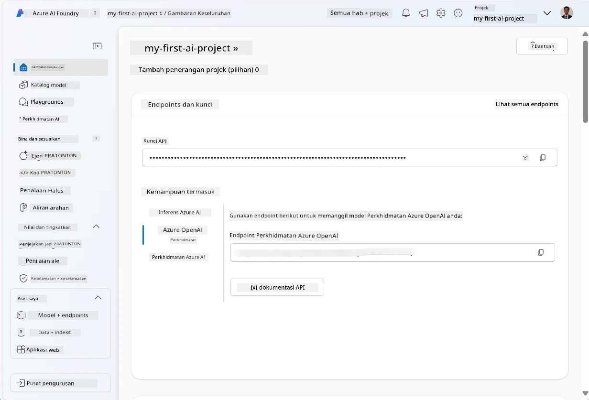
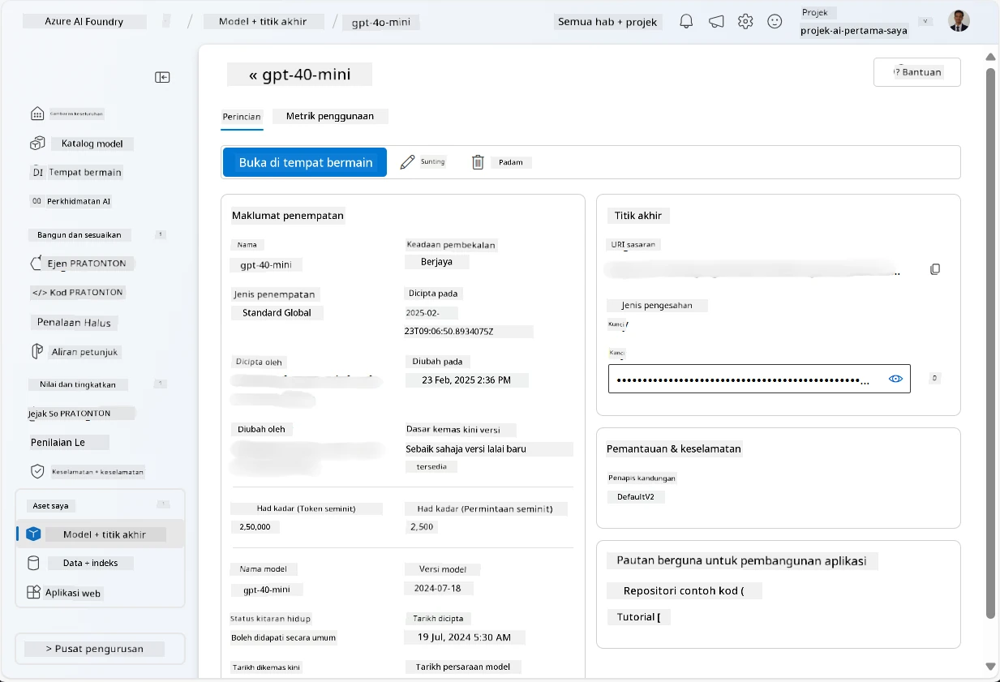
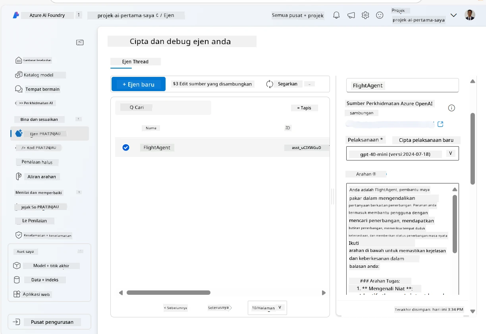
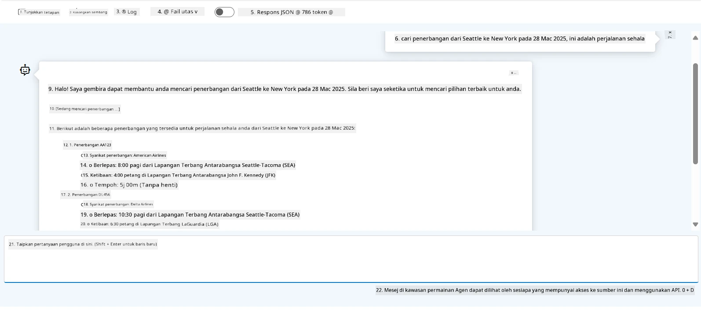

# Pembangunan Perkhidmatan Ejen Microsoft Foundry

Dalam latihan ini, anda menggunakan alat Perkhidmatan Ejen Microsoft Foundry dalam [portal Microsoft Foundry](https://ai.azure.com/?WT.mc_id=academic-105485-koreyst) untuk mencipta ejen untuk Tempahan Penerbangan. Ejen ini akan dapat berinteraksi dengan pengguna dan memberikan maklumat tentang penerbangan.

## Prasyarat

Untuk menyelesaikan latihan ini, anda memerlukan:
1. Akaun Azure dengan langganan aktif. [Cipta akaun secara percuma](https://azure.microsoft.com/free/?WT.mc_id=academic-105485-koreyst).
2. Anda perlu kebenaran untuk mencipta hab Microsoft Foundry atau mempunyai satu yang dicipta untuk anda.
    - Jika peranan anda adalah Penyumbang atau Pemilik, anda boleh mengikuti langkah dalam tutorial ini.

## Cipta hab Microsoft Foundry

> **Nota:** Microsoft Foundry dahulu dikenali sebagai Azure AI Studio.

1. Ikuti panduan dari [Microsoft Foundry](https://learn.microsoft.com/en-us/azure/ai-studio/?WT.mc_id=academic-105485-koreyst) catatan blog untuk mencipta hab Microsoft Foundry.
2. Apabila projek anda dicipta, tutup sebarang tip yang dipaparkan dan semak halaman projek dalam portal Microsoft Foundry, yang sepatutnya kelihatan seperti gambar berikut:

    

## Lancarkan model

1. Dalam panel di sebelah kiri untuk projek anda, di bahagian **Aset Saya**, pilih halaman **Model + titik hujung**.
2. Dalam halaman **Model + titik hujung**, di tab **Penempatan Model**, dalam menu **+ Lancarkan model**, pilih **Lancarkan model asas**.
3. Cari model `gpt-4o-mini` dalam senarai, kemudian pilih dan sahkan ia.

    > **Nota**: Mengurangkan TPM membantu mengelakkan penggunaan kuota yang berlebihan dalam langganan yang anda gunakan.

    

## Cipta ejen

Sekarang anda telah melancarkan model, anda boleh mencipta ejen. Ejen adalah model AI perbualan yang boleh digunakan untuk berinteraksi dengan pengguna.

1. Dalam panel di sebelah kiri untuk projek anda, di bahagian **Bina & Sesuaikan**, pilih halaman **Ejen**.
2. Klik **+ Cipta ejen** untuk mencipta ejen baru. Dalam kotak dialog **Persediaan Ejen**:
    - Masukkan nama untuk ejen, seperti `FlightAgent`.
    - Pastikan pelancaran model `gpt-4o-mini` yang anda cipta sebelum ini dipilih
    - Tetapkan **Arahan** mengikut prompt yang anda mahu ejen ikut. Berikut adalah contoh:
    ```
    You are FlightAgent, a virtual assistant specialized in handling flight-related queries. Your role includes assisting users with searching for flights, retrieving flight details, checking seat availability, and providing real-time flight status. Follow the instructions below to ensure clarity and effectiveness in your responses:

    ### Task Instructions:
    1. **Recognizing Intent**:
       - Identify the user's intent based on their request, focusing on one of the following categories:
         - Searching for flights
         - Retrieving flight details using a flight ID
         - Checking seat availability for a specified flight
         - Providing real-time flight status using a flight number
       - If the intent is unclear, politely ask users to clarify or provide more details.
        
    2. **Processing Requests**:
        - Depending on the identified intent, perform the required task:
        - For flight searches: Request details such as origin, destination, departure date, and optionally return date.
        - For flight details: Request a valid flight ID.
        - For seat availability: Request the flight ID and date and validate inputs.
        - For flight status: Request a valid flight number.
        - Perform validations on provided data (e.g., formats of dates, flight numbers, or IDs). If the information is incomplete or invalid, return a friendly request for clarification.

    3. **Generating Responses**:
    - Use a tone that is friendly, concise, and supportive.
    - Provide clear and actionable suggestions based on the output of each task.
    - If no data is found or an error occurs, explain it to the user gently and offer alternative actions (e.g., refine search, try another query).
    
    ```
> [!NOTE]
> Untuk prompt yang terperinci, anda boleh melihat [repositori ini](https://github.com/ShivamGoyal03/RoamMind) untuk maklumat lanjut.
    
> Selain itu, anda boleh menambah **Pangkalan Pengetahuan** dan **Tindakan** untuk meningkatkan kebolehan ejen menyediakan lebih maklumat dan melakukan tugas automatik berdasarkan permintaan pengguna. Untuk latihan ini, anda boleh langkau langkah ini.
    


3. Untuk mencipta ejen AI berbilang baru, hanya klik **Ejen Baru**. Ejen yang baru dicipta akan dipaparkan di halaman Ejen.


## Uji ejen

Selepas mencipta ejen, anda boleh mengujinya untuk melihat bagaimana ia bertindak balas terhadap pertanyaan pengguna dalam ruang bermain portal Microsoft Foundry.

1. Di bahagian atas panel **Persediaan** untuk ejen anda, pilih **Cuba dalam ruang bermain**.
2. Dalam panel **Ruang Bermain**, anda boleh berinteraksi dengan ejen dengan menaip pertanyaan dalam tetingkap sembang. Contohnya, anda boleh meminta ejen mencari penerbangan dari Seattle ke New York pada 28.

    > **Nota**: Ejen mungkin tidak memberikan tindak balas yang tepat, kerana tiada data masa sebenar digunakan dalam latihan ini. Tujuannya adalah untuk menguji kebolehan ejen memahami dan bertindak balas kepada pertanyaan pengguna berdasarkan arahan yang diberikan.

    

3. Selepas menguji ejen, anda boleh menyesuaikannya lebih lanjut dengan menambah lebih banyak niat, data latihan, dan tindakan untuk meningkatkan kebolehannya.

## Bersihkan sumber

Apabila anda telah selesai menguji ejen, anda boleh memadamnya untuk mengelakkan kos tambahan.
1. Buka [portal Azure](https://portal.azure.com) dan lihat kandungan kumpulan sumber di mana anda melancarkan sumber hab yang digunakan dalam latihan ini.
2. Pada bar alat, pilih **Padam kumpulan sumber**.
3. Masukkan nama kumpulan sumber dan sahkan bahawa anda mahu memadamnya.

## Sumber

- [Dokumentasi Microsoft Foundry](https://learn.microsoft.com/en-us/azure/ai-studio/?WT.mc_id=academic-105485-koreyst)
- [Portal Microsoft Foundry](https://ai.azure.com/?WT.mc_id=academic-105485-koreyst)
- [Memulakan dengan Microsoft Foundry](https://techcommunity.microsoft.com/blog/educatordeveloperblog/getting-started-with-azure-ai-studio/4095602?WT.mc_id=academic-105485-koreyst)
- [Asas agen AI di Azure](https://learn.microsoft.com/en-us/training/modules/ai-agent-fundamentals/?WT.mc_id=academic-105485-koreyst)
- [Azure AI Discord](https://aka.ms/AzureAI/Discord)

---

<!-- CO-OP TRANSLATOR DISCLAIMER START -->
**Penafian**:
Dokumen ini telah diterjemahkan menggunakan perkhidmatan terjemahan AI [Co-op Translator](https://github.com/Azure/co-op-translator). Walaupun kami berusaha untuk ketepatan, sila ambil maklum bahawa terjemahan automatik mungkin mengandungi kesilapan atau ketidaktepatan. Dokumen asal dalam bahasa asalnya harus dianggap sebagai sumber yang sahih. Untuk maklumat penting, terjemahan oleh manusia profesional adalah disyorkan. Kami tidak bertanggungjawab terhadap sebarang salah faham atau salah tafsir yang timbul daripada penggunaan terjemahan ini.
<!-- CO-OP TRANSLATOR DISCLAIMER END -->