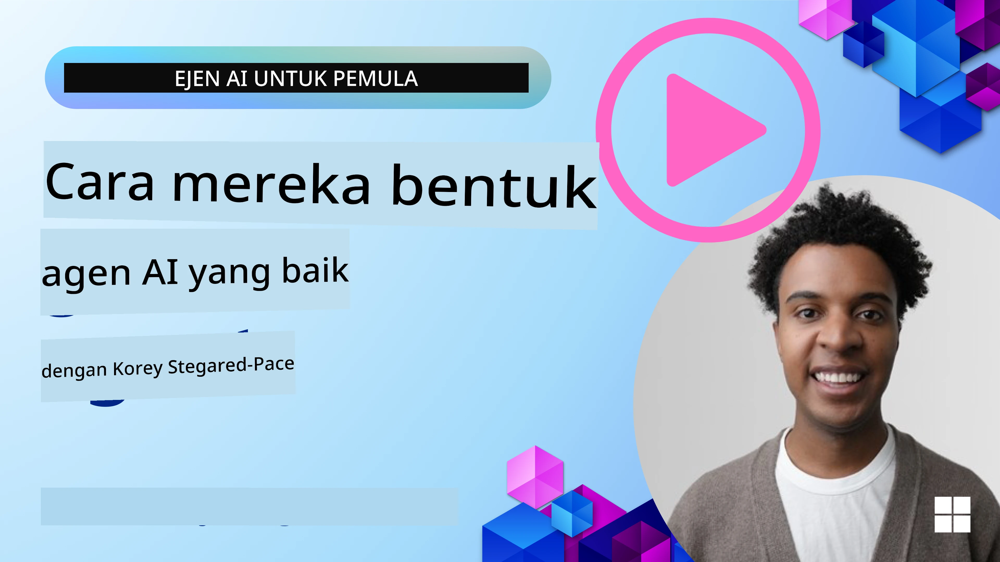
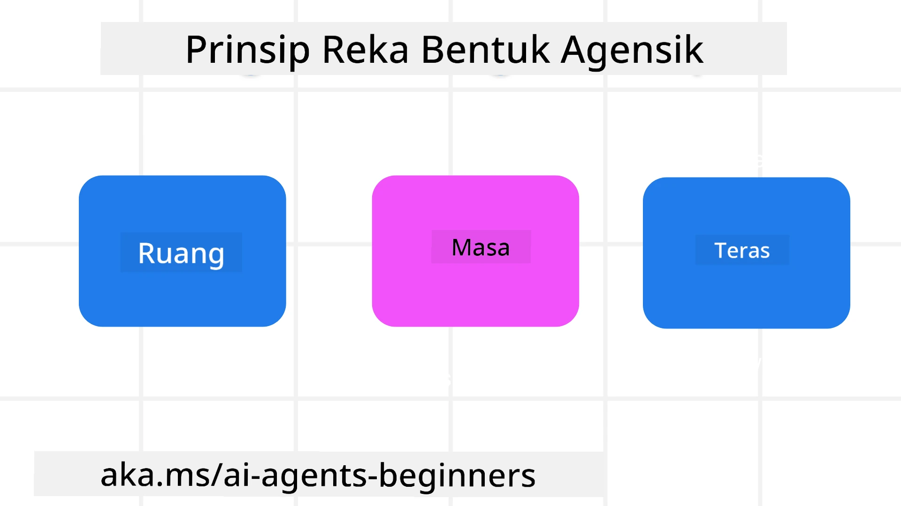

> _(Klik gambar di atas untuk menonton video pelajaran ini)_
# Prinsip Reka Bentuk Agen AI

## Pengenalan

Terdapat pelbagai cara untuk berfikir tentang pembangunan Sistem Agen AI. Memandangkan kekaburan adalah satu ciri dan bukan masalah dalam reka bentuk AI Generatif, kadang-kadang sukar bagi jurutera untuk mengetahui di mana hendak bermula. Kami telah mencipta satu set Prinsip Reka Bentuk UX berpusatkan manusia untuk membolehkan pembangun membina sistem agen berfokuskan pelanggan untuk menyelesaikan keperluan perniagaan mereka. Prinsip reka bentuk ini bukanlah seni bina yang preskriptif tetapi lebih sebagai titik permulaan untuk pasukan yang sedang menentukan dan membina pengalaman agen.

Secara amnya, agen seharusnya:

- Meluaskan dan mengembangkan keupayaan manusia (berfikir secara kreatif, menyelesaikan masalah, automasi, dan sebagainya)
- Mengisi kekosongan pengetahuan (mendapatkan saya cepat memahami bidang pengetahuan, terjemahan, dan sebagainya)
- Memudahkan dan menyokong kerjasama dengan cara kita sebagai individu lebih suka bekerja dengan orang lain
- Menjadikan kita versi diri yang lebih baik (contohnya, pelatih kehidupan/pengawas tugas, membantu kita mempelajari kemahiran pengawalan emosi dan kesedaran, membina ketahanan, dan sebagainya)

## Pelajaran Ini Akan Merangkumi

- Apakah Prinsip Reka Bentuk Agen
- Apakah beberapa garis panduan yang perlu diikuti semasa melaksanakan prinsip reka bentuk ini
- Apakah contoh menggunakan prinsip reka bentuk tersebut

## Matlamat Pembelajaran

Setelah menyelesaikan pelajaran ini, anda akan dapat:

1. Jelaskan apa itu Prinsip Reka Bentuk Agen
2. Jelaskan garis panduan untuk menggunakan Prinsip Reka Bentuk Agen
3. Fahami bagaimana membina agen menggunakan Prinsip Reka Bentuk Agen

## Prinsip Reka Bentuk Agen

### Agen (Ruang)

Ini adalah persekitaran di mana agen beroperasi. Prinsip ini memberitahu bagaimana kita mereka bentuk agen untuk berinteraksi dalam dunia fizikal dan digital.

- **Menghubungkan, bukan menggabungkan** – membantu menghubungkan orang dengan orang lain, acara, dan pengetahuan yang boleh diambil tindakan untuk membolehkan kerjasama dan hubungan.
- Agen membantu menghubungkan acara, pengetahuan, dan orang.
- Agen membawa orang lebih rapat antara satu sama lain. Mereka tidak direka untuk menggantikan atau merendahkan orang.
- **Mudah diakses tetapi kadang-kadang tidak kelihatan** – agen kebanyakannya beroperasi di latar belakang dan hanya memberi isyarat apabila relevan dan sesuai.
  - Agen mudah ditemui dan diakses oleh pengguna yang diberi kuasa pada mana-mana peranti atau platform.
  - Agen menyokong input dan output multimodal (bunyi, suara, teks, dll.).
  - Agen boleh beralih dengan lancar antara latar depan dan latar belakang; antara proaktif dan reaktif, bergantung kepada kepekaan terhadap keperluan pengguna.
  - Agen mungkin beroperasi dalam bentuk tidak kelihatan, namun proses latar belakang dan kerjasama dengan Agen lain adalah telus dan boleh dikawal oleh pengguna.

### Agen (Masa)

Ini adalah bagaimana agen beroperasi mengikut masa. Prinsip ini memberitahu bagaimana kita reka bentuk agen yang berinteraksi merentas masa lalu, sekarang, dan masa depan.

- **Masa Lalu**: Merenung sejarah yang merangkumi keadaan dan konteks.
  - Agen memberikan hasil yang lebih relevan berdasarkan analisis data sejarah yang lebih kaya, melebihi hanya acara, orang, atau keadaan.
  - Agen mencipta hubungan dari peristiwa masa lalu dan secara aktif merenung ingatan untuk berinteraksi dengan situasi semasa.
- **Sekarang**: Membuat dorongan lebih daripada hanya menyiarkan pemberitahuan.
  - Agen menggabungkan pendekatan menyeluruh dalam berinteraksi dengan orang. Apabila sesuatu berlaku, Agen melangkaui pemberitahuan statik atau formaliti statik lain. Agen boleh mempermudahkan aliran atau menjana isyarat secara dinamik untuk mengarahkan perhatian pengguna pada masa yang tepat.
  - Agen menyampaikan maklumat berdasarkan persekitaran kontekstual, perubahan sosial dan budaya serta disesuaikan dengan niat pengguna.
  - Interaksi agen boleh berlaku secara berperingkat, berkembang/meningkat dalam kerumitan untuk memperkasakan pengguna dalam jangka masa panjang.
- **Masa Depan**: Menyesuaikan dan berkembang.
  - Agen menyesuaikan diri dengan pelbagai peranti, platform, dan modaliti.
  - Agen menyesuaikan diri dengan tingkah laku pengguna, keperluan aksesibiliti, dan boleh disesuaikan dengan bebas.
  - Agen dibentuk oleh dan berkembang melalui interaksi berterusan dengan pengguna.

### Agen (Teras)

Ini adalah elemen utama dalam teras reka bentuk agen.

- **Terima ketidakpastian tetapi bina kepercayaan**.
  - Tahap ketidakpastian agen tertentu dijangka. Ketidakpastian adalah elemen utama reka bentuk agen.
  - Kepercayaan dan ketelusan adalah lapisan asas reka bentuk agen.
  - Manusia mengawal bila Agen dihidupkan/dimatikan dan status Agen jelas kelihatan setiap masa.

## Garis Panduan untuk Melaksanakan Prinsip Ini

Apabila anda menggunakan prinsip reka bentuk sebelumnya, gunakan garis panduan berikut:

1. **Ketelusan**: Maklumkan kepada pengguna bahawa AI terlibat, bagaimana ia berfungsi (termasuk tindakan lalu), dan cara memberi maklum balas serta mengubah sistem.
2. **Kawalan**: Benarkan pengguna menyesuaikan, menentukan keutamaan dan mempersonalisasi, serta mengawal sistem dan atributnya (termasuk kebolehan untuk melupakan).
3. **Konsistensi**: Sasarkan pengalaman konsisten dan multimodal merentas peranti dan titik akhir. Gunakan elemen UI/UX yang biasa di mana boleh (contohnya, ikon mikrofon untuk interaksi suara) dan kurangkan beban kognitif pelanggan sebanyak mungkin (contohnya, sasarkan respons ringkas, bantuan visual, dan kandungan ‘Pelajari Lebih Lanjut’).

## Cara Mereka Bentuk Agen Pelancongan menggunakan Prinsip dan Garis Panduan Ini

Bayangkan anda mereka bentuk Agen Pelancongan, berikut adalah bagaimana anda boleh fikirkan tentang menggunakan Prinsip dan Garis Panduan Reka Bentuk:

1. **Ketelusan** – Beritahu pengguna bahawa Agen Pelancongan adalah Agen yang dikuasakan AI. Berikan beberapa arahan asas tentang cara memulakan (contohnya, mesej “Hello”, contoh arahan). Dokumentasi yang jelas di halaman produk. Tunjukkan senarai arahan yang pernah diminta oleh pengguna sebelum ini. Nyatakan dengan jelas cara memberi maklum balas (jempol naik dan turun, butang Hantar Maklum Balas, dan sebagainya). Nyatakan dengan jelas jika Agen mempunyai had penggunaan atau topik.
2. **Kawalan** – Pastikan jelas bagaimana pengguna boleh mengubah Agen selepas ia dicipta dengan perkara seperti Arahan Sistem. Benarkan pengguna memilih tahap kelaziman Agen berkomunikasi, gaya penulisannya, dan sebarang peringatan tentang apa yang Agen tidak patut bincangkan. Benarkan pengguna melihat dan memadam mana-mana fail atau data berkaitan, arahan, dan perbualan lalu.
3. **Konsistensi** – Pastikan ikon untuk Kongsi Arahan, tambah fail atau foto dan tag seseorang atau sesuatu adalah standard dan mudah dikenali. Gunakan ikon klip kertas untuk menunjukkan muat naik/perkongsian fail dengan Agen, dan ikon imej untuk menunjukkan muat naik grafik.

## Contoh Kod

- Python: [Agent Framework](./code_samples/03-python-agent-framework.ipynb)
- .NET: [Agent Framework](./code_samples/03-dotnet-agent-framework.md)

## Ada Lebih Banyak Soalan tentang Corak Reka Bentuk Agen AI?

Sertailah [Microsoft Foundry Discord](https://discord.com/invite/ATgtXmAS5D) untuk bertemu dengan pelajar lain, menghadiri waktu pejabat dan dapatkan jawapan untuk soalan Agen AI anda.

## Sumber Tambahan

- <a href="https://openai.com" target="_blank">Amalan untuk Mentadbir Sistem AI Agen | OpenAI</a>
- <a href="https://microsoft.com" target="_blank">Projek HAX Toolkit - Microsoft Research</a>
- <a href="https://responsibleaitoolbox.ai" target="_blank">Kotak Alat AI Bertanggungjawab</a>

## Pelajaran Sebelumnya

[Meneroka Rangka Kerja Agen](../02-explore-agentic-frameworks/README.md)

## Pelajaran Seterusnya

[Corak Reka Bentuk Penggunaan Alat](../04-tool-use/README.md)

---

<!-- CO-OP TRANSLATOR DISCLAIMER START -->
**Penafian**:
Dokumen ini telah diterjemahkan menggunakan perkhidmatan terjemahan AI [Co-op Translator](https://github.com/Azure/co-op-translator). Walaupun kami berusaha untuk ketepatan, sila ambil maklum bahawa terjemahan automatik mungkin mengandungi kesilapan atau ketidaktepatan. Dokumen asal dalam bahasa asalnya harus dianggap sebagai sumber yang sahih. Untuk maklumat penting, terjemahan oleh manusia profesional adalah disyorkan. Kami tidak bertanggungjawab terhadap sebarang salah faham atau salah tafsir yang timbul daripada penggunaan terjemahan ini.
<!-- CO-OP TRANSLATOR DISCLAIMER END -->