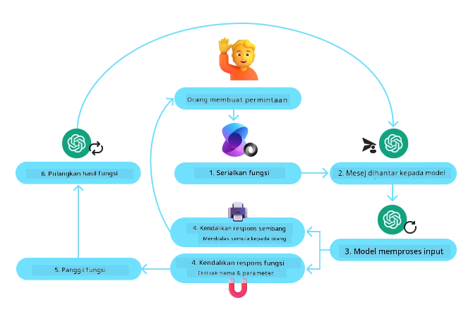
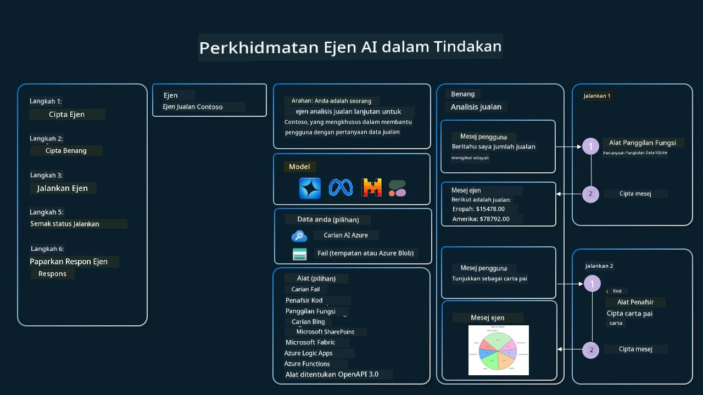

[](https://youtu.be/vieRiPRx-gI?si=cEZ8ApnT6Sus9rhn)

> _(Klik imej di atas untuk menonton video pelajaran ini)_

# Corak Reka Bentuk Penggunaan Alat

Alat adalah menarik kerana ia membolehkan ejen AI mempunyai julat kebolehan yang lebih meluas. Daripada ejen mempunyai sekumpulan tindakan terhad yang boleh dilaksanakannya, dengan menambah sebuah alat, ejen kini boleh melaksanakan pelbagai tindakan. Dalam bab ini, kita akan melihat Corak Reka Bentuk Penggunaan Alat, yang menerangkan bagaimana ejen AI boleh menggunakan alat tertentu untuk mencapai matlamat mereka.

## Pengenalan

Dalam pelajaran ini, kita mencari jawapan kepada soalan-soalan berikut:

- Apakah corak reka bentuk penggunaan alat?
- Apakah kes penggunaan di mana ia boleh digunakan?
- Apakah elemen/blok binaan yang diperlukan untuk melaksanakan corak reka bentuk ini?
- Apakah pertimbangan khas untuk menggunakan Corak Reka Bentuk Penggunaan Alat bagi membina ejen AI yang boleh dipercayai?

## Matlamat Pembelajaran

Selepas menyelesaikan pelajaran ini, anda akan dapat:

- Mentakrifkan Corak Reka Bentuk Penggunaan Alat dan tujuannya.
- Mengenal pasti kes penggunaan di mana Corak Reka Bentuk Penggunaan Alat sesuai digunakan.
- Memahami elemen utama yang diperlukan untuk melaksanakan corak reka bentuk ini.
- Mengenal pasti pertimbangan untuk memastikan kebolehpercayaan ejen AI yang menggunakan corak reka bentuk ini.

## Apakah Corak Reka Bentuk Penggunaan Alat?

The **Tool Use Design Pattern** memberi tumpuan kepada memberikan kebolehan kepada Model Bahasa Besar (LLM) untuk berinteraksi dengan alat luaran bagi mencapai matlamat tertentu. Alat ialah kod yang boleh dilaksanakan oleh ejen untuk melakukan tindakan. Satu alat boleh menjadi fungsi ringkas seperti kalkulator, atau panggilan API kepada perkhidmatan pihak ketiga seperti semakan harga saham atau ramalan cuaca. Dalam konteks ejen AI, alat direka untuk dilaksanakan oleh ejen sebagai tindak balas kepada **panggilan fungsi yang dijana oleh model**.

## Apakah kes penggunaan yang boleh digunakan?

Ejen AI boleh memanfaatkan alat untuk menyelesaikan tugas kompleks, mendapatkan maklumat, atau membuat keputusan. Corak reka bentuk penggunaan alat kerap digunakan dalam senario yang memerlukan interaksi dinamik dengan sistem luaran, seperti pangkalan data, perkhidmatan web, atau penafsir kod. Kebolehan ini berguna untuk pelbagai kes penggunaan termasuk:

- **Pengambilan Maklumat Dinamik:** Ejen boleh menyoal API luaran atau pangkalan data untuk mendapatkan data terkini (contohnya, menyoal pangkalan data SQLite untuk analisis data, mendapatkan harga saham atau maklumat cuaca).
- **Pelaksanaan dan Penafsiran Kod:** Ejen boleh melaksanakan kod atau skrip untuk menyelesaikan masalah matematik, menjana laporan, atau melakukan simulasi.
- **Automasi Aliran Kerja:** Mengautomasikan aliran kerja berulang atau berbilang langkah dengan mengintegrasikan alat seperti penjadual tugas, perkhidmatan e-mel, atau saluran data.
- **Sokongan Pelanggan:** Ejen boleh berinteraksi dengan sistem CRM, platform tiket, atau pangkalan pengetahuan untuk menyelesaikan pertanyaan pengguna.
- **Penjanaan dan Penyuntingan Kandungan:** Ejen boleh memanfaatkan alat seperti pemeriksa tatabahasa, peringkasan teks, atau penilai keselamatan kandungan untuk membantu dalam tugas penciptaan kandungan.

## Apakah elemen/blok binaan yang diperlukan untuk melaksanakan corak reka bentuk penggunaan alat?

Blok binaan ini membolehkan ejen AI melakukan pelbagai tugas. Mari lihat elemen utama yang diperlukan untuk melaksanakan Corak Reka Bentuk Penggunaan Alat:

- **Skema Fungsi/Alat**: Definisi terperinci alat yang tersedia, termasuk nama fungsi, tujuan, parameter yang diperlukan, dan output yang dijangka. Skema ini membolehkan LLM memahami alat yang tersedia dan cara membina permintaan yang sah.

- **Logik Pelaksanaan Fungsi**: Mengawal bagaimana dan bila alat dipanggil berdasarkan niat pengguna dan konteks perbualan. Ini mungkin termasuk modul perancang, mekanisme penghalaan, atau aliran bersyarat yang menentukan penggunaan alat secara dinamik.

- **Sistem Pengendalian Mesej**: Komponen yang mengurus aliran perbualan antara input pengguna, respons LLM, panggilan alat, dan output alat.

- **Rangka Kerja Integrasi Alat**: Infrastruktur yang menghubungkan ejen kepada pelbagai alat, sama ada ia fungsi ringkas atau perkhidmatan luaran yang kompleks.

- **Pengendalian Ralat & Pengesahan**: Mekanisme untuk menangani kegagalan dalam pelaksanaan alat, mengesahkan parameter, dan mengurus respons yang tidak dijangka.

- **Pengurusan Keadaan**: Menjejak konteks perbualan, interaksi alat terdahulu, dan data berterusan untuk memastikan konsistensi merentasi interaksi berbilang pusingan.

Seterusnya, mari lihat Panggilan Fungsi/Alat dengan lebih terperinci.
 
### Panggilan Fungsi/Alat

Panggilan fungsi adalah cara utama kita membolehkan Model Bahasa Besar (LLM) berinteraksi dengan alat. Anda sering akan melihat 'Fungsi' dan 'Alat' digunakan secara bergantian kerana 'fungsi' (blok kod boleh guna semula) adalah 'alat' yang ejen gunakan untuk melaksanakan tugas. Untuk kod fungsi dipanggil, LLM mesti membandingkan permintaan pengguna dengan penerangan fungsi. Untuk melakukan ini, satu skema yang mengandungi penerangan semua fungsi yang tersedia dihantar kepada LLM. LLM kemudian memilih fungsi yang paling sesuai untuk tugas tersebut dan mengembalikan nama dan argumennya. Fungsi yang dipilih dipanggil, responsnya dihantar kembali kepada LLM, yang menggunakan maklumat itu untuk memberi respons kepada permintaan pengguna.

Untuk pembangun melaksanakan panggilan fungsi untuk ejen, anda akan memerlukan:

1. Model LLM yang menyokong panggilan fungsi
2. Skema yang mengandungi penerangan fungsi
3. Kod untuk setiap fungsi yang dihuraikan

Mari gunakan contoh mendapatkan masa semasa di sebuah bandar untuk menggambarkan:

1. **Inisialisasi LLM yang menyokong panggilan fungsi:**

    Tidak semua model menyokong panggilan fungsi, jadi penting untuk menyemak bahawa LLM yang anda gunakan menyokongnya.     <a href="https://learn.microsoft.com/azure/ai-services/openai/how-to/function-calling" target="_blank">Azure OpenAI</a> menyokong panggilan fungsi. Kita boleh mula dengan memulakan klien Azure OpenAI. 

    ```python
    # Inisialisasikan klien Azure OpenAI
    client = AzureOpenAI(
        azure_endpoint = os.getenv("AZURE_AI_PROJECT_ENDPOINT"), 
        api_key=os.getenv("AZURE_OPENAI_API_KEY"),  
        api_version="2024-05-01-preview"
    )
    ```

1. **Cipta Skema Fungsi**:

    Seterusnya kita akan mentakrifkan skema JSON yang mengandungi nama fungsi, penerangan tentang apa yang dilakukan fungsi itu, dan nama serta penerangan parameter fungsi.
    Kita kemudian akan mengambil skema ini dan menghantarnya kepada klien yang dicipta sebelum ini, bersama-sama dengan permintaan pengguna untuk mencari masa di San Francisco. Yang penting untuk diperhatikan ialah bahawa **panggilan alat** ialah apa yang dikembalikan, **bukan** jawapan akhir kepada soalan. Seperti yang dinyatakan sebelum ini, LLM mengembalikan nama fungsi yang dipilih untuk tugas itu, dan argumen yang akan dipasangkan kepadanya.

    ```python
    # Penerangan fungsi untuk dibaca oleh model
    tools = [
        {
            "type": "function",
            "function": {
                "name": "get_current_time",
                "description": "Get the current time in a given location",
                "parameters": {
                    "type": "object",
                    "properties": {
                        "location": {
                            "type": "string",
                            "description": "The city name, e.g. San Francisco",
                        },
                    },
                    "required": ["location"],
                },
            }
        }
    ]
    ```
   
    ```python
  
    # Mesej pengguna awal
    messages = [{"role": "user", "content": "What's the current time in San Francisco"}] 
  
    # Panggilan API pertama: Minta model menggunakan fungsi
      response = client.chat.completions.create(
          model=deployment_name,
          messages=messages,
          tools=tools,
          tool_choice="auto",
      )
  
      # Proses respons model
      response_message = response.choices[0].message
      messages.append(response_message)
  
      print("Model's response:")  

      print(response_message)
  
    ```

    ```bash
    Model's response:
    ChatCompletionMessage(content=None, role='assistant', function_call=None, tool_calls=[ChatCompletionMessageToolCall(id='call_pOsKdUlqvdyttYB67MOj434b', function=Function(arguments='{"location":"San Francisco"}', name='get_current_time'), type='function')])
    ```
  
1. **Kod fungsi yang diperlukan untuk melaksanakan tugas:**

    Sekarang LLM telah memilih fungsi yang perlu dijalankan, kod yang melaksanakan tugas itu perlu diimplementasikan dan dijalankan.
    Kita boleh mengimplementasikan kod untuk mendapatkan masa semasa dalam Python. Kita juga perlu menulis kod untuk mengekstrak nama dan argumen daripada response_message untuk mendapatkan keputusan akhir.

    ```python
      def get_current_time(location):
        """Get the current time for a given location"""
        print(f"get_current_time called with location: {location}")  
        location_lower = location.lower()
        
        for key, timezone in TIMEZONE_DATA.items():
            if key in location_lower:
                print(f"Timezone found for {key}")  
                current_time = datetime.now(ZoneInfo(timezone)).strftime("%I:%M %p")
                return json.dumps({
                    "location": location,
                    "current_time": current_time
                })
      
        print(f"No timezone data found for {location_lower}")  
        return json.dumps({"location": location, "current_time": "unknown"})
    ```

     ```python
     # Mengendalikan panggilan fungsi
      if response_message.tool_calls:
          for tool_call in response_message.tool_calls:
              if tool_call.function.name == "get_current_time":
     
                  function_args = json.loads(tool_call.function.arguments)
     
                  time_response = get_current_time(
                      location=function_args.get("location")
                  )
     
                  messages.append({
                      "tool_call_id": tool_call.id,
                      "role": "tool",
                      "name": "get_current_time",
                      "content": time_response,
                  })
      else:
          print("No tool calls were made by the model.")  
  
      # Panggilan API kedua: Dapatkan respons akhir daripada model
      final_response = client.chat.completions.create(
          model=deployment_name,
          messages=messages,
      )
  
      return final_response.choices[0].message.content
     ```

     ```bash
      get_current_time called with location: San Francisco
      Timezone found for san francisco
      The current time in San Francisco is 09:24 AM.
     ```

Panggilan Fungsi adalah teras kepada kebanyakan, jika tidak semua, reka bentuk penggunaan alat ejen, namun mengimplementasikannya dari awal kadangkala boleh menjadi mencabar.
Seperti yang kita pelajari dalam [Pelajaran 2](../../../02-explore-agentic-frameworks), rangka kerja agentic menyediakan blok binaan siap untuk melaksanakan penggunaan alat.
 
## Contoh Penggunaan Alat dengan Rangka Kerja Agentic

Berikut adalah beberapa contoh bagaimana anda boleh melaksanakan Corak Reka Bentuk Penggunaan Alat menggunakan pelbagai rangka kerja agentic:

### Rangka Kerja Agen Microsoft

<a href="https://learn.microsoft.com/azure/ai-services/agents/overview" target="_blank">Microsoft Agent Framework</a> ialah rangka kerja AI sumber terbuka untuk membina ejen AI. Ia memudahkan proses penggunaan panggilan fungsi dengan membenarkan anda mentakrifkan alat sebagai fungsi Python dengan penghias `@tool`. Rangka kerja ini mengendalikan komunikasi dua hala antara model dan kod anda. Ia juga menyediakan akses kepada alat siap sedia seperti Carian Fail dan Penafsir Kod melalui `AzureAIProjectAgentProvider`.

Rajah berikut menggambarkan proses panggilan fungsi dengan Rangka Kerja Agen Microsoft:



Dalam Rangka Kerja Agen Microsoft, alat ditakrifkan sebagai fungsi yang dihias. Kita boleh menukar fungsi `get_current_time` yang kita lihat sebelum ini menjadi satu alat dengan menggunakan penghias `@tool`. Rangka kerja ini secara automatik akan menyerialize fungsi dan parameter, mewujudkan skema untuk dihantar kepada LLM.

```python
from agent_framework import tool
from agent_framework.azure import AzureAIProjectAgentProvider
from azure.identity import AzureCliCredential

@tool
def get_current_time(location: str) -> str:
    """Get the current time for a given location"""
    ...

# Cipta klien
provider = AzureAIProjectAgentProvider(credential=AzureCliCredential())

# Cipta ejen dan jalankan menggunakan alat tersebut
agent = await provider.create_agent(name="TimeAgent", instructions="Use available tools to answer questions.", tools=get_current_time)
response = await agent.run("What time is it?")
```
  
### Azure AI Agent Service

<a href="https://learn.microsoft.com/azure/ai-services/agents/overview" target="_blank">Azure AI Agent Service</a> ialah rangka kerja agentic yang lebih baru yang direka untuk memperkasakan pembangun untuk membina, menyebarkan, dan mengukur ejen AI yang berkualiti tinggi dan boleh diperluas dengan selamat tanpa perlu mengurus sumber pengkomputeran dan storan di bawahnya. Ia amat berguna untuk aplikasi perusahaan kerana ia adalah perkhidmatan yang dikendalikan sepenuhnya dengan keselamatan peringkat perusahaan.

Apabila dibandingkan dengan membangunkan terus dengan API LLM, Azure AI Agent Service memberikan beberapa kelebihan, termasuk:

- Panggilan alat automatik – tiada keperluan untuk mengurai panggilan alat, memanggil alat, dan mengendalikan respons; semua ini kini dilakukan di sisi pelayan
- Data yang diurus dengan selamat – sebagai ganti mengurus keadaan perbualan anda sendiri, anda boleh bergantung kepada threads untuk menyimpan semua maklumat yang anda perlukan
- Alat sedia guna – Alat yang boleh anda gunakan untuk berinteraksi dengan sumber data anda, seperti Bing, Azure AI Search, dan Azure Functions.

Alat yang tersedia dalam Azure AI Agent Service boleh dibahagikan kepada dua kategori:

1. Alat Pengetahuan:
    - <a href="https://learn.microsoft.com/azure/ai-services/agents/how-to/tools/bing-grounding?tabs=python&pivots=overview" target="_blank">Grounding with Bing Search</a>
    - <a href="https://learn.microsoft.com/azure/ai-services/agents/how-to/tools/file-search?tabs=python&pivots=overview" target="_blank">File Search</a>
    - <a href="https://learn.microsoft.com/azure/ai-services/agents/how-to/tools/azure-ai-search?tabs=azurecli%2Cpython&pivots=overview-azure-ai-search" target="_blank">Azure AI Search</a>

2. Alat Tindakan:
    - <a href="https://learn.microsoft.com/azure/ai-services/agents/how-to/tools/function-calling?tabs=python&pivots=overview" target="_blank">Function Calling</a>
    - <a href="https://learn.microsoft.com/azure/ai-services/agents/how-to/tools/code-interpreter?tabs=python&pivots=overview" target="_blank">Code Interpreter</a>
    - <a href="https://learn.microsoft.com/azure/ai-services/agents/how-to/tools/openapi-spec?tabs=python&pivots=overview" target="_blank">OpenAPI defined tools</a>
    - <a href="https://learn.microsoft.com/azure/ai-services/agents/how-to/tools/azure-functions?pivots=overview" target="_blank">Azure Functions</a>

Agent Service membolehkan kita menggunakan alat-alat ini bersama sebagai satu `toolset`. Ia juga menggunakan `threads` yang menyimpan sejarah mesej dari satu perbualan tertentu.

Bayangkan anda seorang ejen jualan di sebuah syarikat bernama Contoso. Anda ingin membangunkan ejen perbualan yang boleh menjawab soalan tentang data jualan anda.

Imej berikut menggambarkan bagaimana anda boleh menggunakan Azure AI Agent Service untuk menganalisis data jualan anda:



Untuk menggunakan mana-mana alat ini dengan perkhidmatan, kita boleh membuat klien dan menentukan alat atau toolset. Untuk melaksanakan ini secara praktikal kita boleh menggunakan kod Python berikut. LLM akan dapat melihat toolset dan memutuskan sama ada untuk menggunakan fungsi yang dicipta pengguna, `fetch_sales_data_using_sqlite_query`, atau Penafsir Kod sedia ada bergantung kepada permintaan pengguna.

```python 
import os
from azure.ai.projects import AIProjectClient
from azure.identity import DefaultAzureCredential
from fetch_sales_data_functions import fetch_sales_data_using_sqlite_query # fungsi fetch_sales_data_using_sqlite_query yang boleh ditemui dalam fail fetch_sales_data_functions.py.
from azure.ai.projects.models import ToolSet, FunctionTool, CodeInterpreterTool

project_client = AIProjectClient.from_connection_string(
    credential=DefaultAzureCredential(),
    conn_str=os.environ["PROJECT_CONNECTION_STRING"],
)

# Inisialisasikan set alat
toolset = ToolSet()

# Inisialisasikan ejen pemanggil fungsi dengan fungsi fetch_sales_data_using_sqlite_query dan menambahkannya ke dalam set alat
fetch_data_function = FunctionTool(fetch_sales_data_using_sqlite_query)
toolset.add(fetch_data_function)

# Inisialisasikan alat Code Interpreter dan menambahkannya ke dalam set alat.
code_interpreter = code_interpreter = CodeInterpreterTool()
toolset.add(code_interpreter)

agent = project_client.agents.create_agent(
    model="gpt-4o-mini", name="my-agent", instructions="You are helpful agent", 
    toolset=toolset
)
```

## Apakah pertimbangan khas untuk menggunakan Corak Reka Bentuk Penggunaan Alat bagi membina ejen AI yang boleh dipercayai?

Kebimbangan umum dengan SQL yang dijana secara dinamik oleh LLM ialah keselamatan, terutamanya risiko suntikan SQL atau tindakan berniat jahat, seperti memadam atau mengubah pangkalan data. Walaupun kebimbangan ini sah, ia boleh diatasi dengan berkesan dengan mengkonfigurasi kebenaran akses pangkalan data dengan betul. Bagi kebanyakan pangkalan data, ini melibatkan mengkonfigurasi pangkalan data sebagai baca sahaja. Untuk perkhidmatan pangkalan data seperti PostgreSQL atau Azure SQL, aplikasi harus diberikan peranan baca sahaja (SELECT).

Menjalankan aplikasi dalam persekitaran yang selamat turut meningkatkan perlindungan. Dalam senario perusahaan, data biasanya diekstrak dan ditransformasikan dari sistem operasi ke dalam pangkalan data baca sahaja atau gudang data dengan skema mesra pengguna. Pendekatan ini memastikan data selamat, dioptimumkan untuk prestasi dan kebolehcapaian, dan bahawa aplikasi mempunyai akses terhad, baca sahaja.

## Contoh Kod

- Python: [Agent Framework](./code_samples/04-python-agent-framework.ipynb)
- .NET: [Agent Framework](./code_samples/04-dotnet-agent-framework.md)

## Ada Lagi Soalan tentang Corak Reka Bentuk Penggunaan Alat?

Sertai [Microsoft Foundry Discord](https://aka.ms/ai-agents/discord) untuk berjumpa dengan pelajar lain, menghadiri waktu pejabat dan mendapatkan jawapan bagi soalan Ejen AI anda.

## Sumber Tambahan

- <a href="https://microsoft.github.io/build-your-first-agent-with-azure-ai-agent-service-workshop/" target="_blank">Azure AI Agents Service Workshop</a>
- <a href="https://github.com/Azure-Samples/contoso-creative-writer/tree/main/docs/workshop" target="_blank">Contoso Creative Writer Multi-Agent Workshop</a>
- <a href="https://learn.microsoft.com/azure/ai-services/agents/overview" target="_blank">Microsoft Agent Framework Overview</a>

## Pelajaran Sebelumnya

[Memahami Corak Reka Bentuk Agen](../03-agentic-design-patterns/README.md)

## Pelajaran Seterusnya
[RAG Berasaskan Ejen](../05-agentic-rag/README.md)

---

<!-- CO-OP TRANSLATOR DISCLAIMER START -->
Penafian:
Dokumen ini telah diterjemahkan menggunakan perkhidmatan terjemahan AI Co-op Translator (https://github.com/Azure/co-op-translator). Walaupun kami berusaha untuk ketepatan, sila ambil maklum bahawa terjemahan automatik mungkin mengandungi ralat atau ketidaktepatan. Dokumen asal dalam bahasa asalnya hendaklah dianggap sebagai sumber yang sah. Untuk maklumat penting, disyorkan mendapatkan terjemahan profesional oleh penterjemah manusia. Kami tidak bertanggungjawab terhadap sebarang salah faham atau salah tafsiran yang timbul daripada penggunaan terjemahan ini.
<!-- CO-OP TRANSLATOR DISCLAIMER END -->