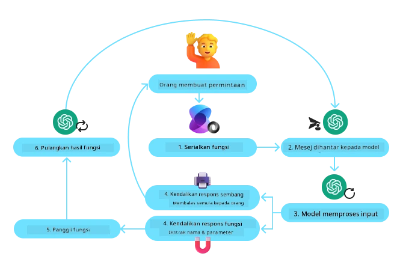
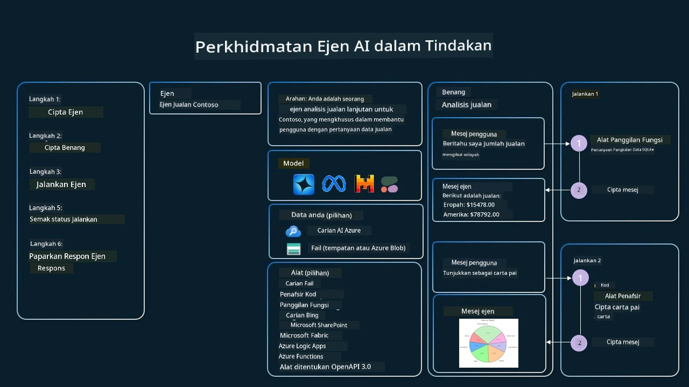

[](https://youtu.be/vieRiPRx-gI?si=cEZ8ApnT6Sus9rhn)

> _(Klik imej di atas untuk menonton video pelajaran ini)_

# Corak Reka Bentuk Penggunaan Alat

Alat adalah menarik kerana mereka membolehkan ejen AI mempunyai kemampuan yang lebih luas. Daripada ejen hanya mempunyai set tindakan terhad yang boleh dilaksanakan, dengan menambah alat, ejen kini boleh melaksanakan pelbagai tindakan yang luas. Dalam bab ini, kita akan melihat Corak Reka Bentuk Penggunaan Alat, yang menerangkan bagaimana ejen AI boleh menggunakan alat khusus untuk mencapai matlamat mereka.

## Pengenalan

Dalam pelajaran ini, kita akan cuba menjawab soalan berikut:

- Apakah corak reka bentuk penggunaan alat?
- Apakah kes-kes penggunaan yang boleh diterapkan?
- Apakah elemen/blok binaan yang diperlukan untuk melaksanakan corak reka bentuk ini?
- Apakah pertimbangan khas untuk menggunakan Corak Reka Bentuk Penggunaan Alat bagi membina ejen AI yang boleh dipercayai?

## Matlamat Pembelajaran

Setelah menamatkan pelajaran ini, anda akan dapat:

- Mentakrif Corak Reka Bentuk Penggunaan Alat dan tujuanannya.
- Mengenal pasti kes-kes penggunaan di mana Corak Reka Bentuk Penggunaan Alat boleh diterapkan.
- Memahami elemen utama yang diperlukan untuk melaksanakan corak reka bentuk ini.
- Mengenal pasti pertimbangan untuk memastikan kebolehpercayaan dalam ejen AI yang menggunakan corak reka bentuk ini.

## Apakah Corak Reka Bentuk Penggunaan Alat?

**Corak Reka Bentuk Penggunaan Alat** memberi tumpuan kepada memberikan LLM keupayaan untuk berinteraksi dengan alat luaran bagi mencapai matlamat tertentu. Alat adalah kod yang boleh dilaksanakan oleh ejen untuk melakukan tindakan. Sebuah alat boleh menjadi fungsi ringkas seperti kalkulator, atau panggilan API ke perkhidmatan pihak ketiga seperti pencarian harga saham atau ramalan cuaca. Dalam konteks ejen AI, alat direka untuk dilaksanakan oleh ejen sebagai tindak balas kepada **panggilan fungsi yang dihasilkan oleh model**.

## Apakah kes-kes penggunaan yang boleh diterapkan?

Ejen AI boleh menggunakan alat untuk menyelesaikan tugas yang kompleks, mendapatkan maklumat, atau membuat keputusan. Corak reka bentuk penggunaan alat sering digunakan dalam senario yang memerlukan interaksi dinamik dengan sistem luaran, seperti pangkalan data, perkhidmatan web, atau penafsir kod. Keupayaan ini berguna untuk pelbagai kes penggunaan termasuk:

- **Pengambilan Maklumat Dinamik:** Ejen boleh membuat pertanyaan ke API luaran atau pangkalan data untuk mendapatkan data terkini (contohnya, membuat pertanyaan ke pangkalan data SQLite untuk analisis data, mendapatkan harga saham atau maklumat cuaca).
- **Pelaksanaan dan Tafsiran Kod:** Ejen boleh menjalankan kod atau skrip untuk menyelesaikan masalah matematik, menghasilkan laporan, atau melaksanakan simulasi.
- **Automasi Aliran Kerja:** Mengautomasikan aliran kerja berulang atau berbilang langkah dengan mengintegrasikan alat seperti penjadual tugas, perkhidmatan emel, atau saluran data.
- **Sokongan Pelanggan:** Ejen boleh berinteraksi dengan sistem CRM, platform tiket, atau pangkalan pengetahuan untuk menyelesaikan pertanyaan pengguna.
- **Penjanaan dan Penyuntingan Kandungan:** Ejen boleh menggunakan alat seperti pemeriksa tatabahasa, peringkasan teks, atau penilai keselamatan kandungan untuk membantu tugas penciptaan kandungan.

## Apakah elemen/blok binaan yang diperlukan untuk melaksanakan corak penggunaan alat?

Blok binaan ini membolehkan ejen AI melaksanakan pelbagai tugas. Mari kita lihat elemen utama yang diperlukan untuk melaksanakan Corak Reka Bentuk Penggunaan Alat:

- **Skema Fungsi/Alat**: Definisi terperinci tentang alat yang tersedia, termasuk nama fungsi, tujuan, parameter yang diperlukan, dan output yang dijangkakan. Skema ini membolehkan LLM memahami alat yang ada dan bagaimana membina permintaan yang sah.

- **Logik Pelaksanaan Fungsi**: Mengawal bagaimana dan bila alat dipanggil berdasarkan niat pengguna dan konteks perbualan. Ini mungkin termasuk modul perancang, mekanisme penghalaan, atau aliran bersyarat yang menentukan penggunaan alat secara dinamik.

- **Sistem Pengendalian Mesej**: Komponen yang mengurus aliran perbualan antara input pengguna, respons LLM, panggilan alat, dan output alat.

- **Rangka Kerja Integrasi Alat**: Infrastruktur yang menyambungkan ejen dengan pelbagai alat, sama ada fungsi mudah atau perkhidmatan luaran yang kompleks.

- **Pengendalian Ralat & Pengesahan**: Mekanisme untuk mengendalikan kegagalan dalam pelaksanaan alat, mengesahkan parameter, dan mengurus tindak balas yang tidak dijangka.

- **Pengurusan Keadaan**: Menjejak konteks perbualan, interaksi alat sebelum ini, dan data berterusan untuk memastikan konsistensi sepanjang interaksi berbilang pusingan.

Seterusnya, mari kita lihat Panggilan Fungsi/Alat dengan lebih terperinci.
 
### Panggilan Fungsi/Alat

Panggilan fungsi adalah cara utama kita membolehkan Model Bahasa Besar (LLM) berinteraksi dengan alat. Anda sering akan melihat 'Fungsi' dan 'Alat' digunakan secara bergantian kerana 'fungsi' (blok kod yang boleh digunakan semula) adalah 'alat' yang digunakan ejen untuk melaksanakan tugas. Untuk membolehkan kod fungsi dipanggil, LLM mesti membandingkan permintaan pengguna dengan penerangan fungsi. Untuk berbuat demikian, skema yang mengandungi penerangan semua fungsi yang tersedia dihantar ke LLM. LLM kemudian memilih fungsi yang paling sesuai untuk tugas itu dan mengembalikan nama serta argumennya. Fungsi yang dipilih dipanggil, tindak balasnya dihantar kembali ke LLM, yang menggunakan maklumat itu untuk membalas permintaan pengguna.

Untuk pembangun melaksanakan panggilan fungsi untuk ejen, anda perlu:

1. Model LLM yang menyokong panggilan fungsi
2. Skema yang mengandungi penerangan fungsi
3. Kod untuk setiap fungsi yang diterangkan

Mari gunakan contoh mendapatkan waktu semasa di sebuah bandar sebagai ilustrasi:

1. **Inisialisasi LLM yang menyokong panggilan fungsi:**

    Tidak semua model menyokong panggilan fungsi, jadi penting untuk memeriksa jika LLM yang anda gunakan menyokongnya.     <a href="https://learn.microsoft.com/azure/ai-services/openai/how-to/function-calling" target="_blank">Azure OpenAI</a> menyokong panggilan fungsi. Kita boleh mula dengan memulakan klien OpenAI menggunakan Azure OpenAI **Responses API** (endpoint stabil `/openai/v1/` — tiada `api_version` diperlukan).

    ```python
    # Inisialisasi klien OpenAI untuk Azure OpenAI (API Respon, titik akhir v1)
    client = OpenAI(
        base_url=f"{os.environ['AZURE_OPENAI_ENDPOINT'].rstrip('/')}/openai/v1/",
        api_key=os.environ["AZURE_OPENAI_API_KEY"],
    )
    deployment_name = os.environ["AZURE_OPENAI_DEPLOYMENT"]
    ```

1. **Buat Skema Fungsi**:

    Seterusnya kita akan menentukan skema JSON yang mengandungi nama fungsi, penerangan tentang apa yang dilakukan fungsi, dan nama serta penerangan parameter fungsi.
    Kita kemudian menghantar skema ini bersama permintaan pengguna untuk mencari masa di San Francisco kepada klien yang dicipta sebelumnya. Yang penting untuk diperhatikan ialah **panggilan alat** adalah apa yang dikembalikan, **bukan** jawapan akhir kepada soalan itu. Seperti yang disebutkan sebelumnya, LLM mengembalikan nama fungsi yang dipilih untuk tugas itu, dan argumen yang akan diberikan kepadanya.

    ```python
    # Penerangan fungsi untuk model baca (Format alat rata API Tindak Balas)
    tools = [
        {
            "type": "function",
            "name": "get_current_time",
            "description": "Get the current time in a given location",
            "parameters": {
                "type": "object",
                "properties": {
                    "location": {
                        "type": "string",
                        "description": "The city name, e.g. San Francisco",
                    },
                },
                "required": ["location"],
            },
        }
    ]
    ```
   
    ```python
  
    # Mesej pengguna pertama
    messages = [{"role": "user", "content": "What's the current time in San Francisco"}]

    # Panggilan API pertama: Minta model menggunakan fungsi tersebut
    response = client.responses.create(
        model=deployment_name,
        input=messages,
        tools=tools,
        tool_choice="auto",
        store=False,
    )

    # API Respons mengembalikan panggilan alat sebagai item function_call dalam response.output.
    # Tambahkan mereka ke perbualan supaya model mempunyai konteks penuh pada giliran seterusnya.
    messages += response.output

    print("Model's response:")
    print(response.output)
  
    ```

    ```bash
    Model's response:
    [ResponseFunctionToolCall(arguments='{"location":"San Francisco"}', call_id='call_pOsKdUlqvdyttYB67MOj434b', name='get_current_time', type='function_call')]
    ```
  
1. **Kod fungsi yang diperlukan untuk melaksanakan tugas:**

    Kini LLM telah memilih fungsi yang perlu dijalankan, kod untuk melaksanakan tugas itu perlu dilaksanakan dan dijalankan.
    Kita boleh melaksanakan kod untuk mendapatkan waktu semasa menggunakan Python. Kita juga perlu menulis kod untuk mengekstrak nama dan argumen dari response_message untuk mendapatkan hasil akhir.

    ```python
      def get_current_time(location):
        """Get the current time for a given location"""
        print(f"get_current_time called with location: {location}")  
        location_lower = location.lower()
        
        for key, timezone in TIMEZONE_DATA.items():
            if key in location_lower:
                print(f"Timezone found for {key}")  
                current_time = datetime.now(ZoneInfo(timezone)).strftime("%I:%M %p")
                return json.dumps({
                    "location": location,
                    "current_time": current_time
                })
      
        print(f"No timezone data found for {location_lower}")  
        return json.dumps({"location": location, "current_time": "unknown"})
    ```

     ```python
    # Mengendalikan panggilan fungsi
    tool_calls = [item for item in response.output if item.type == "function_call"]
    if tool_calls:
        for tool_call in tool_calls:
            if tool_call.name == "get_current_time":

                function_args = json.loads(tool_call.arguments)

                time_response = get_current_time(
                    location=function_args.get("location")
                )

                # Pulangkan hasil alat sebagai item function_call_output
                messages.append({
                    "type": "function_call_output",
                    "call_id": tool_call.call_id,
                    "output": time_response,
                })
    else:
        print("No tool calls were made by the model.")

    # Panggilan API kedua: Dapatkan respons akhir dari model
    final_response = client.responses.create(
        model=deployment_name,
        input=messages,
        tools=tools,
        store=False,
    )

    return final_response.output_text
     ```

     ```bash
      get_current_time called with location: San Francisco
      Timezone found for san francisco
      The current time in San Francisco is 09:24 AM.
     ```

Panggilan Fungsi adalah inti kepada kebanyakan, jika tidak semua, reka bentuk penggunaan alat ejen, tetapi melaksanakannya dari awal kadang-kadang boleh mencabar.
Seperti yang kita pelajari dalam [Pelajaran 2](../../../02-explore-agentic-frameworks), rangka kerja agentic menyediakan kita dengan blok binaan yang telah dibina untuk melaksanakan penggunaan alat.
 
## Contoh Penggunaan Alat dengan Rangka Kerja Agentic

Berikut adalah beberapa contoh bagaimana anda boleh melaksanakan Corak Reka Bentuk Penggunaan Alat menggunakan rangka kerja agentic yang berbeza:

### Rangka Kerja Ejen Microsoft

<a href="https://learn.microsoft.com/azure/ai-services/agents/overview" target="_blank">Rangka Kerja Ejen Microsoft</a> adalah rangka kerja AI sumber terbuka untuk membina ejen AI. Ia memudahkan proses penggunaan panggilan fungsi dengan membenarkan anda mendefinisikan alat sebagai fungsi Python dengan dekorator `@tool`. Rangka kerja ini mengendalikan komunikasi dua hala antara model dan kod anda. Ia juga menyediakan akses ke alat yang telah dibina seperti Pencarian Fail dan Penafsir Kod melalui `FoundryChatClient`.

Rajah berikut menunjukkan proses panggilan fungsi dengan Rangka Kerja Ejen Microsoft:



Dalam Rangka Kerja Ejen Microsoft, alat didefinisikan sebagai fungsi yang didekorasi. Kita boleh menukar fungsi `get_current_time` yang kita lihat sebelum ini menjadi alat dengan menggunakan dekorator `@tool`. Rangka kerja ini secara automatik akan menyusun fungsi dan parameternya, menghasilkan skema untuk dihantar kepada LLM.

```python
import os
from agent_framework import tool
from agent_framework.foundry import FoundryChatClient
from azure.identity import AzureCliCredential

@tool(approval_mode="never_require")
def get_current_time(location: str) -> str:
    """Get the current time for a given location"""
    ...

# Cipta pelanggan
provider = FoundryChatClient(
    project_endpoint=os.environ["AZURE_AI_PROJECT_ENDPOINT"],
    model=os.environ["AZURE_AI_MODEL_DEPLOYMENT_NAME"],
    credential=AzureCliCredential(),
)

# Cipta wakil dan jalankan dengan alat
agent = provider.as_agent(name="TimeAgent", instructions="Use available tools to answer questions.", tools=get_current_time)
response = await agent.run("What time is it?")
```
  
### Perkhidmatan Ejen Microsoft Foundry

<a href="https://learn.microsoft.com/azure/ai-services/agents/overview" target="_blank">Perkhidmatan Ejen Microsoft Foundry</a> adalah rangka kerja agentik baru yang direka untuk membolehkan pembangun membina, melancarkan, dan skala ejen AI berkualiti tinggi dan boleh diperluas dengan selamat tanpa perlu mengurus sumber pengkomputeran dan penyimpanan asas. Ia sangat berguna untuk aplikasi perusahaan kerana ia adalah perkhidmatan yang dikendalikan sepenuhnya dengan keselamatan bertaraf perusahaan.

Berbanding dengan membangunkan secara langsung dengan API LLM, Perkhidmatan Ejen Microsoft Foundry menyediakan beberapa kelebihan, termasuk:

- Panggilan alat automatik – tidak perlu menguraikan panggilan alat, memanggil alat, dan mengendalikan respons; semua ini kini dilakukan di sisi pelayan
- Data yang diurus dengan selamat – selain menguruskan keadaan perbualan sendiri, anda boleh bergantung pada threads untuk menyimpan semua maklumat yang anda perlukan
- Alat segera – Alat yang boleh anda gunakan untuk berinteraksi dengan sumber data anda, seperti Bing, Azure AI Search, dan Azure Functions.

Alat-alat yang tersedia dalam Perkhidmatan Ejen Microsoft Foundry boleh dibahagikan kepada dua kategori:

1. Alat Pengetahuan:
    - <a href="https://learn.microsoft.com/azure/ai-services/agents/how-to/tools/bing-grounding?tabs=python&pivots=overview" target="_blank">Pengukuhan dengan Bing Search</a>
    - <a href="https://learn.microsoft.com/azure/ai-services/agents/how-to/tools/file-search?tabs=python&pivots=overview" target="_blank">Pencarian Fail</a>
    - <a href="https://learn.microsoft.com/azure/ai-services/agents/how-to/tools/azure-ai-search?tabs=azurecli%2Cpython&pivots=overview-azure-ai-search" target="_blank">Azure AI Search</a>

2. Alat Tindakan:
    - <a href="https://learn.microsoft.com/azure/ai-services/agents/how-to/tools/function-calling?tabs=python&pivots=overview" target="_blank">Panggilan Fungsi</a>
    - <a href="https://learn.microsoft.com/azure/ai-services/agents/how-to/tools/code-interpreter?tabs=python&pivots=overview" target="_blank">Penafsir Kod</a>
    - <a href="https://learn.microsoft.com/azure/ai-services/agents/how-to/tools/openapi-spec?tabs=python&pivots=overview" target="_blank">Alat yang ditakrif oleh OpenAPI</a>
    - <a href="https://learn.microsoft.com/azure/ai-services/agents/how-to/tools/azure-functions?pivots=overview" target="_blank">Azure Functions</a>

Perkhidmatan Ejen membolehkan kita menggunakan alat-alat ini bersama sebagai satu `toolset`. Ia juga menggunakan `threads` yang menjejak sejarah mesej daripada perbualan tertentu.

Bayangkan anda adalah ejen jualan di sebuah syarikat bernama Contoso. Anda ingin membangunkan ejen perbualan yang boleh menjawab soalan tentang data jualan anda.

Imej berikut menunjukkan bagaimana anda boleh menggunakan Perkhidmatan Ejen Microsoft Foundry untuk menganalisis data jualan anda:



Untuk menggunakan mana-mana alat ini dengan perkhidmatan, kita boleh membuat klien dan mendefinisikan alat atau set alat. Untuk melaksanakannya secara praktikal, kita boleh menggunakan kod Python berikut. LLM akan dapat melihat set alat dan memutuskan sama ada untuk menggunakan fungsi yang dicipta pengguna, `fetch_sales_data_using_sqlite_query`, atau Penafsir Kod yang telah dibina bergantung kepada permintaan pengguna.

```python 
import os
from azure.ai.projects import AIProjectClient
from azure.identity import DefaultAzureCredential
from fetch_sales_data_functions import fetch_sales_data_using_sqlite_query # fungsi fetch_sales_data_using_sqlite_query yang boleh didapati dalam fail fetch_sales_data_functions.py.
from azure.ai.projects.models import ToolSet, FunctionTool, CodeInterpreterTool

project_client = AIProjectClient.from_connection_string(
    credential=DefaultAzureCredential(),
    conn_str=os.environ["PROJECT_CONNECTION_STRING"],
)

# Inisialisasi set alat
toolset = ToolSet()

# Inisialisasi ejen pemanggil fungsi dengan fungsi fetch_sales_data_using_sqlite_query dan menambahkannya ke set alat
fetch_data_function = FunctionTool(fetch_sales_data_using_sqlite_query)
toolset.add(fetch_data_function)

# Inisialisasi alat Penafsir Kod dan menambahkannya ke set alat.
code_interpreter = CodeInterpreterTool()toolset.add(code_interpreter)

agent = project_client.agents.create_agent(
    model="gpt-4o-mini", name="my-agent", instructions="You are helpful agent", 
    toolset=toolset
)
```

## Apakah pertimbangan khas untuk menggunakan Corak Reka Bentuk Penggunaan Alat bagi membina ejen AI yang boleh dipercayai?

Kebimbangan biasa dengan SQL yang dijana secara dinamik oleh LLM adalah keselamatan, terutama risiko suntikan SQL atau tindakan berniat jahat, seperti memadam atau mengubah pangkalan data. Walaupun kebimbangan ini sah, ia boleh diatasi dengan berkesan dengan mengkonfigurasi kebenaran akses pangkalan data dengan betul. Untuk kebanyakan pangkalan data, ini melibatkan konfigurasi pangkalan data sebagai hanya baca. Untuk perkhidmatan pangkalan data seperti PostgreSQL atau Azure SQL, aplikasi harus diberikan peranan hanya baca (SELECT).

Menjalankan aplikasi dalam persekitaran yang selamat meningkatkan lagi perlindungan. Dalam senario perusahaan, data biasanya diekstrak dan ditransformasikan dari sistem operasi ke dalam pangkalan data hanya baca atau gudang data dengan skema mesra pengguna. Pendekatan ini memastikan data selamat, dioptimumkan untuk prestasi dan aksesibilitas, dan aplikasi mempunyai akses terhad, hanya baca.

## Kod Sampel

- Python: [Rangka Kerja Ejen](./code_samples/04-python-agent-framework.ipynb)
- .NET: [Rangka Kerja Ejen](./code_samples/04-dotnet-agent-framework.md)

## Ada Soalan Lagi tentang Corak Reka Bentuk Penggunaan Alat?

Sertai [Microsoft Foundry Discord](https://discord.com/invite/ATgtXmAS5D) untuk bertemu dengan pelajar lain, menghadiri waktu pejabat dan mendapatkan soalan mengenai Ejen AI anda dijawab.

## Sumber Tambahan

- <a href="https://microsoft.github.io/build-your-first-agent-with-azure-ai-agent-service-workshop/" target="_blank">Bengkel Perkhidmatan Ejen AI Azure</a>
- <a href="https://github.com/Azure-Samples/contoso-creative-writer/tree/main/docs/workshop" target="_blank">Bengkel Penulis Kreatif Multi-Ejen Contoso</a>
- <a href="https://learn.microsoft.com/azure/ai-services/agents/overview" target="_blank">Pengenalan Rangka Kerja Ejen Microsoft</a>


## Pelajaran Sebelumnya

[Memahami Corak Reka Bentuk Agensik](../03-agentic-design-patterns/README.md)

## Pelajaran Seterusnya

[Agentik RAG](../05-agentic-rag/README.md)

---

<!-- CO-OP TRANSLATOR DISCLAIMER START -->
**Penafian**:
Dokumen ini telah diterjemahkan menggunakan perkhidmatan terjemahan AI [Co-op Translator](https://github.com/Azure/co-op-translator). Walaupun kami berusaha untuk ketepatan, sila ambil maklum bahawa terjemahan automatik mungkin mengandungi kesilapan atau ketidaktepatan. Dokumen asal dalam bahasa asalnya harus dianggap sebagai sumber yang sahih. Untuk maklumat penting, terjemahan oleh manusia profesional adalah disyorkan. Kami tidak bertanggungjawab terhadap sebarang salah faham atau salah tafsir yang timbul daripada penggunaan terjemahan ini.
<!-- CO-OP TRANSLATOR DISCLAIMER END -->