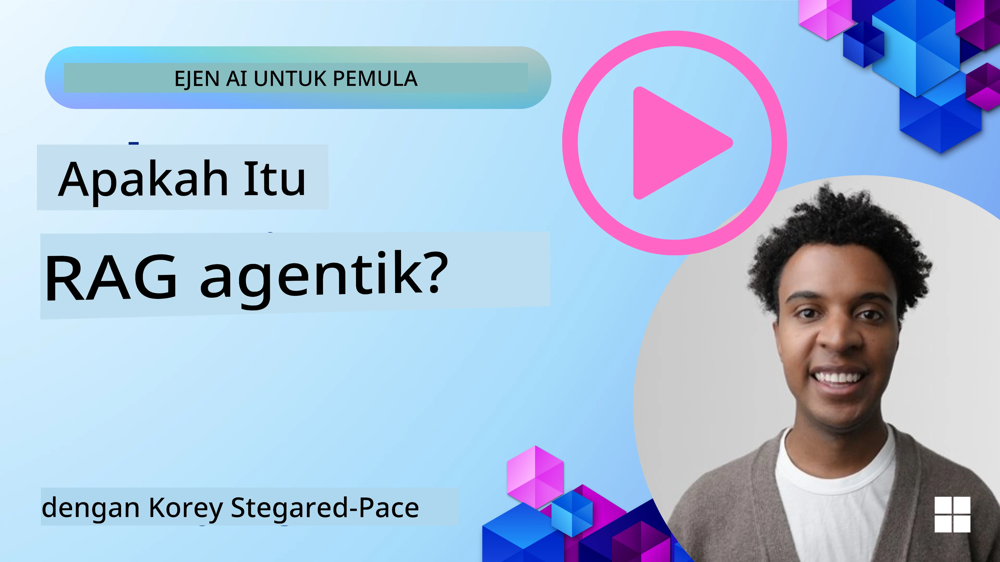
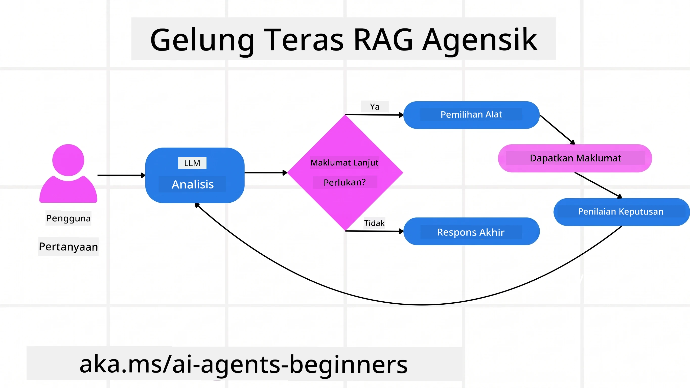
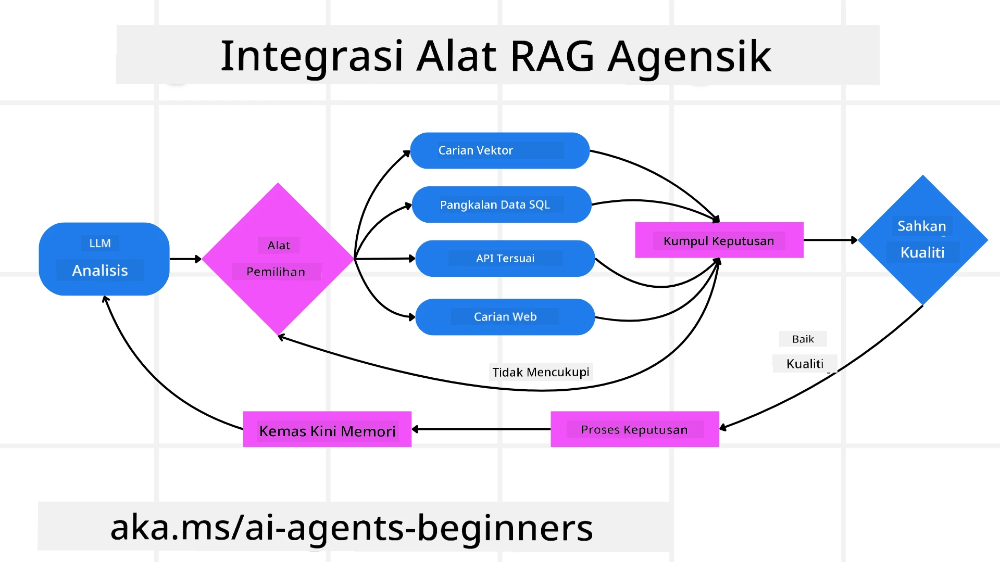
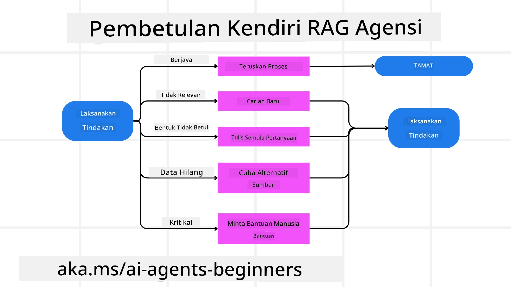
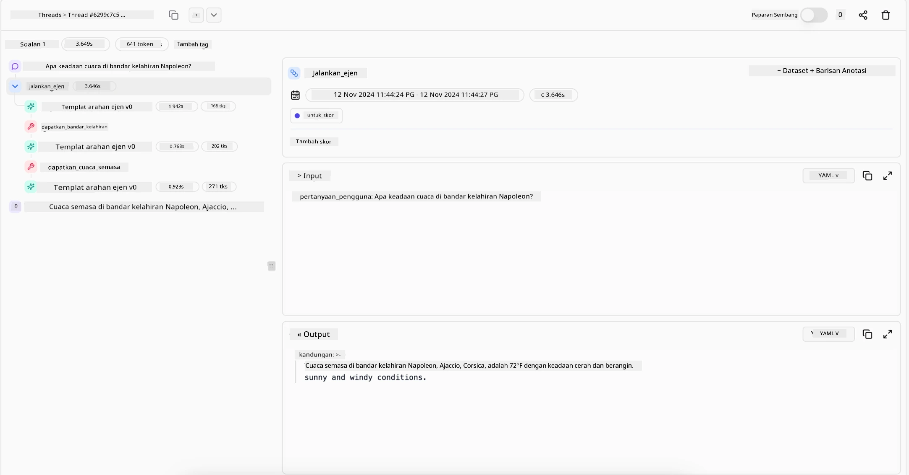

> _(Klik imej di atas untuk menonton video pelajaran ini)_

# Agentic RAG

Pelajaran ini memberikan gambaran menyeluruh mengenai Agentic Retrieval-Augmented Generation (Agentic RAG), satu paradigma AI terkini di mana model bahasa besar (LLM) merancang langkah seterusnya secara autonomi sambil menarik maklumat dari sumber luar. Berbeza dengan corak pengambilan statik yang kemudian dibaca, Agentic RAG melibatkan panggilan berulang ke LLM, diselingi dengan panggilan alat atau fungsi dan output yang terstruktur. Sistem menilai keputusan, memperbaiki pertanyaan, menggunakan alat tambahan jika perlu, dan meneruskan kitaran ini sehingga penyelesaian memuaskan dicapai.

## Pengenalan

Pelajaran ini akan merangkumi

- **Memahami Agentic RAG:** Pelajari mengenai paradigma AI terkini di mana model bahasa besar (LLM) merancang langkah seterusnya secara autonomi sambil menarik maklumat dari sumber data luar.
- **Memahami Gaya Penilai Pembuat Berulang:** Fahami kitaran panggilan berulang kepada LLM, diselingi dengan panggilan alat atau fungsi serta output berstruktur, yang direka untuk meningkatkan ketepatan dan menangani pertanyaan yang tidak tepat.
- **Menerokai Aplikasi Praktikal:** Kenal pasti situasi di mana Agentic RAG menonjol, seperti persekitaran yang mengutamakan ketepatan, interaksi pangkalan data kompleks, dan aliran kerja yang panjang.

## Matlamat Pembelajaran

Selepas menamatkan pelajaran ini, anda akan tahu cara/boleh memahami:

- **Memahami Agentic RAG:** Pelajari tentang paradigma AI terkini di mana model bahasa besar (LLM) merancang langkah seterusnya secara autonomi sambil menarik maklumat dari sumber data luar.
- **Gaya Penilai Pembuat Berulang:** Fahami konsep kitaran panggilan berulang kepada LLM, diselingi dengan panggilan alat atau fungsi serta output berstruktur, yang direka untuk meningkatkan ketepatan dan menangani pertanyaan yang tidak tepat.
- **Menguasai Proses Pemikiran:** Fahami kebolehan sistem untuk menguasai proses pemikirannya, membuat keputusan bagaimana menyelesaikan masalah tanpa bergantung pada laluan yang telah ditetapkan.
- **Aliran Kerja:** Fahami bagaimana model agentic secara bebas memutuskan untuk mengambil laporan tren pasaran, mengenal pasti data pesaing, mengaitkan metrik jualan dalaman, menyusun dapatan, dan menilai strategi.
- **Kitaran Berulang, Integrasi Alat, dan Memori:** Pelajari mengenai pergantungan sistem pada corak interaksi berulang, mengekalkan keadaan dan memori merentas langkah untuk mengelakkan kitaran berulang dan membuat keputusan yang tepat.
- **Mengendalikan Kegagalan dan Pembetulan Diri:** Terokai mekanisme pembetulan diri sistem yang kukuh, termasuk pengulangan dan permintaan semula, menggunakan alat diagnostik, dan bergantung pada pengawasan manusia.
- **Had-had Agensi:** Fahami batasan Agentic RAG, yang tertumpu pada autonomi domain khusus, kebergantungan infrastruktur, dan menghormati garis panduan keselamatan.
- **Kes Penggunaan Praktikal dan Nilai:** Kenal pasti situasi di mana Agentic RAG menonjol, seperti persekitaran yang mengutamakan ketepatan, interaksi pangkalan data kompleks, dan aliran kerja yang panjang.
- **Tadbir Urus, Ketelusan, dan Kepercayaan:** Pelajari kepentingan tadbir urus dan ketelusan, termasuk pemikiran yang boleh diterangkan, kawalan bias, dan pengawasan manusia.

## Apa itu Agentic RAG?

Agentic Retrieval-Augmented Generation (Agentic RAG) adalah paradigma AI terkini di mana model bahasa besar (LLM) merancang langkah seterusnya secara autonomi sambil menarik maklumat dari sumber luar. Berbeza daripada corak pengambilan statik yang kemudian dibaca, Agentic RAG melibatkan panggilan berulang kepada LLM, diselingi dengan panggilan alat atau fungsi serta output berstruktur. Sistem menilai keputusan, memperbaiki pertanyaan, menggunakan alat tambahan jika perlu, dan meneruskan kitaran ini sehingga penyelesaian memuaskan dicapai. Gaya “penilai pembuat” berulang ini meningkatkan ketepatan, mengendalikan pertanyaan salah bentuk, dan memastikan hasil berkualiti tinggi.

Sistem ini menguasai proses pemikirannya sendiri secara aktif, menulis semula pertanyaan yang gagal, memilih kaedah pengambilan berlainan, dan mengintegrasikan pelbagai alat — seperti carian vektor dalam Azure AI Search, pangkalan data SQL, atau API tersuai — sebelum memuktamadkan jawapan. Ciri pembeza sistem agentic ialah kebolehannya menguasai proses pemikirannya sendiri. Pelaksanaan RAG tradisional bergantung pada laluan yang telah ditetapkan, tetapi sistem agentic menentukan susunan langkah berdasarkan kualiti maklumat yang diperolehi.

## Mendefinisikan Agentic Retrieval-Augmented Generation (Agentic RAG)

Agentic Retrieval-Augmented Generation (Agentic RAG) adalah paradigma AI baru di mana LLM bukan sahaja menarik maklumat dari sumber data luar tetapi juga merancang langkah seterusnya secara autonomi. Berbeza dengan corak pengambilan statik yang kemudian dibaca atau urutan arahan yang dirangka dengan teliti, Agentic RAG melibatkan kitaran panggilan berulang kepada LLM, diselingi dengan panggilan alat atau fungsi serta output berstruktur. Pada setiap giliran, sistem menilai keputusan yang diperoleh, menentukan sama ada pertanyaan perlu diperbaiki, menggunakan alat tambahan jika perlu, dan meneruskan kitaran ini sehingga mencapai penyelesaian yang memuaskan.

Gaya operasi “penilai pembuat” berulang ini direka untuk meningkatkan ketepatan, mengendalikan pertanyaan salah bentuk ke pangkalan data berstruktur (contoh NL2SQL), dan memastikan hasil yang seimbang dan berkualiti tinggi. Daripada bergantung sepenuhnya kepada rangkaian arahan yang direka khas, sistem secara aktif menguasai proses pemikirannya. Ia boleh menulis semula pertanyaan yang gagal, memilih kaedah pengambilan berlainan, dan mengintegrasi pelbagai alat — seperti carian vektor di Azure AI Search, pangkalan data SQL, atau API tersuai — sebelum memuktamadkan jawapan. Ini menghapuskan keperluan bagi rangka kerja orkestrasi yang terlalu kompleks. Sebaliknya, kitaran ringkas seperti “panggilan LLM → penggunaan alat → panggilan LLM → …” boleh menghasilkan output yang canggih dan berasaskan bukti yang kukuh.

## Menguasai Proses Pemikiran

Ciri pembeza yang menjadikan sistem “agentic” adalah kebolehannya menguasai proses pemikirannya sendiri. Pelaksanaan RAG tradisional sering bergantung pada manusia yang menentukan laluan model: satu rantai pemikiran yang menggariskan apa yang perlu diambil dan bila.
Tetapi apabila sistem itu benar-benar agentic, ia membuat keputusan dalaman tentang bagaimana hendak mendekati masalah itu. Ia bukan sekadar melaksanakan skrip; sebaliknya ia secara autonomi menentukan susunan langkah berdasarkan kualiti maklumat yang ditemui.
Sebagai contoh, jika ia diminta untuk mencipta strategi pelancaran produk, ia tidak hanya bergantung pada arahan yang menerangkan keseluruhan kerja penyelidikan dan membuat keputusan. Sebaliknya, model agentic secara bebas memutuskan untuk:

1. Mengambil laporan tren pasaran semasa menggunakan Bing Web Grounding
2. Mengenal pasti data pesaing yang relevan menggunakan Azure AI Search.
3.	Mengkorelasikan metrik jualan dalaman sejarah menggunakan Azure SQL Database.
4. Menyedarkan dapatan kepada strategi yang padu yang diorkestrasi melalui Azure OpenAI Service.
5.	Mengambil kira strategi untuk mengesan kekurangan atau ketidakselarasan, dan membuat pusingan pengambilan semula jika perlu.
Semua langkah ini — memperbaiki pertanyaan, memilih sumber, mengulang sehingga “berpuas hati” dengan jawapan — diputuskan oleh model, bukan skrip yang telah ditetapkan oleh manusia.

## Kitaran Berulang, Integrasi Alat, dan Memori

Sistem agentic bergantung pada corak interaksi kitaran:

- **Panggilan Awal:** Matlamat pengguna (iaitu arahan pengguna) dibentangkan kepada LLM.
- **Panggilan Alat:** Jika model mengenal pasti maklumat yang hilang atau arahan yang samar, ia memilih alat atau kaedah pengambilan — seperti pertanyaan pangkalan data vektor (contoh Azure AI Search Hybrid search ke atas data peribadi) atau panggilan SQL berstruktur — untuk mengumpul lebih konteks.
- **Penilaian & Penambahbaikan:** Selepas meneliti data yang dikembalikan, model menentukan sama ada maklumat mencukupi. Jika tidak, ia memperbaiki pertanyaan, mencuba alat lain, atau melaraskan pendekatannya.
- **Ulang Sehingga Puas:** Kitaran ini diteruskan sehingga model menentukan bahawa ia mempunyai kejelasan dan bukti yang cukup untuk memberikan respons akhir yang beralasan baik.
- **Memori & Keadaan:** Oleh kerana sistem mengekalkan keadaan dan memori merentas langkah, ia boleh mengingati percubaan lalu dan hasilnya, mengelakkan kitaran berulang dan membuat keputusan yang lebih dimaklumkan semasa berterusan.

Lama-kelamaan, ini mewujudkan rasa kefahaman yang berkembang, membolehkan model mengendalikan tugas berbilang langkah yang kompleks tanpa memerlukan campur tangan manusia atau mengubah arahan secara berterusan.

## Mengendalikan Mod Kegagalan dan Pembetulan Diri

Autonomi Agentic RAG juga melibatkan mekanisme pembetulan sendiri yang mantap. Apabila sistem menemui jalan buntu — seperti mengambil dokumen yang tidak relevan atau menghadapi pertanyaan yang salah bentuk — ia boleh:

- **Mengulang dan Meminta Semula:** Daripada mengembalikan respons bernilai rendah, model mencuba strategi carian baru, menulis semula pertanyaan pangkalan data, atau melihat set data alternatif.
- **Menggunakan Alat Diagnostik:** Sistem boleh menggunakan fungsi tambahan yang direka untuk membantu mengesan langkah pemikirannya atau mengesahkan ketepatan data yang diperoleh. Alat seperti Azure AI Tracing penting untuk membolehkan kebolehlihatan dan pemantauan yang mantap.
- **Bergantung pada Pengawasan Manusia:** Untuk senario berisiko tinggi atau yang gagal berulang kali, model mungkin menandakan ketidakpastian dan meminta panduan manusia. Apabila manusia memberikan maklum balas pembetulan, model boleh memasukkan pelajaran itu untuk masa depan.

Pendekatan berulang dan dinamik ini membolehkan model meningkatkan diri secara berterusan, memastikan ia bukan sistem satu kali sahaja, tetapi yang belajar dari kesilapannya dalam sesi tertentu.

## Had-had Agensi

Walaupun bebas dalam melaksanakan tugas, Agentic RAG tidak bersamaan dengan Kecerdasan Umum Buatan. Keupayaan “agentic”nya terhad kepada alat, sumber data, dan polisi yang disediakan oleh pembangun manusia. Ia tidak boleh mencipta alat sendiri atau keluar dari batas domain yang telah ditetapkan. Sebaliknya, ia cemerlang dalam mengorkestrasi sumber yang ada secara dinamik.
Perbezaan utama daripada bentuk AI yang lebih maju termasuk:

1. **Autonomi Domain Tertentu:** Sistem Agentic RAG tertumpu pada mencapai matlamat yang ditetapkan pengguna dalam domain yang diketahui, menggunakan strategi seperti penulisan semula pertanyaan atau pemilihan alat untuk meningkatkan hasil.
2. **Bergantung pada Infrastruktur:** Keupayaan sistem bergantung pada alat dan data yang diintegrasikan oleh pembangun. Ia tidak boleh melepasi batas ini tanpa campur tangan manusia.
3. **Menghormati Garis Panduan:** Garis panduan etika, peraturan pematuhan, dan polisi perniagaan kekal sangat penting. Kebebasan agen sentiasa dikawal oleh langkah keselamatan dan mekanisme pengawasan (diharapkan?).

## Kes Penggunaan Praktikal dan Nilai

Agentic RAG menonjol dalam situasi yang memerlukan penambahbaikan berulang dan ketepatan:

1. **Persekitaran Utama Ketepatan:** Dalam pemeriksaan pematuhan, analisis peraturan, atau penyelidikan undang-undang, model agentic boleh berulang kali mengesahkan fakta, merujuk pelbagai sumber, dan menulis semula pertanyaan sehingga menghasilkan jawapan yang disaring dengan teliti.
2. **Interaksi Pangkalan Data Kompleks:** Apabila mengurus data berstruktur di mana pertanyaan mungkin sering gagal atau perlu disesuaikan, sistem boleh memperbaiki pertanyaan secara autonomi menggunakan Azure SQL atau Microsoft Fabric OneLake, memastikan pengambilan akhir sejajar dengan niat pengguna.
3. **Aliran Kerja Berpanjangan:** Sesi yang berjalan lama mungkin berkembang apabila maklumat baru muncul. Agentic RAG boleh sentiasa memasukkan data baru, mengubah strategi semasa ia belajar lebih banyak tentang ruang masalah.

## Tadbir Urus, Ketelusan, dan Kepercayaan

Apabila sistem ini menjadi lebih autonomi dalam pemikiran mereka, tadbir urus dan ketelusan menjadi penting:

- **Pemikiran yang Boleh Diterangkan:** Model boleh menyediakan rekod audit pertanyaan yang dibuat, sumber yang dirujuk, dan langkah pemikiran yang diambil untuk mencapai kesimpulan. Alat seperti Azure AI Content Safety dan Azure AI Tracing / GenAIOps membantu mengekalkan ketelusan dan mengurangkan risiko.
- **Kawalan Bias dan Pengambilan Seimbang:** Pembangun boleh melaras strategi pengambilan untuk memastikan sumber data yang seimbang dan mewakili dipertimbangkan, dan secara berkala mengaudit output untuk mengesan bias atau corak tidak seimbang menggunakan model tersuai bagi organisasi sains data lanjutan yang menggunakan Azure Machine Learning.
- **Pengawasan Manusia dan Pematuhan:** Untuk tugas sensitif, penilaian manusia kekal penting. Agentic RAG tidak menggantikan penilaian manusia dalam keputusan berisiko tinggi — ia menyokongnya dengan menyediakan pilihan yang disaring dengan lebih teliti.

Mempunyai alat yang menyediakan rekod jelas tindakan adalah amat penting. Tanpanya, menyahpepijat proses berbilang langkah boleh menjadi sangat sukar. Lihat contoh berikut dari Literal AI (syarikat di belakang Chainlit) untuk larian Agen:

## Kesimpulan

Agentic RAG mewakili evolusi semula jadi dalam cara sistem AI mengendalikan tugas yang kompleks dan memerlukan data intensif. Dengan mengamalkan corak interaksi berulang, memilih alat secara autonomi, dan memperbaiki pertanyaan sehingga mencapai hasil berkualiti tinggi, sistem bergerak melepasi pengikut arahan statik ke pembuat keputusan yang lebih adaptif dan sedar konteks. Walaupun masih terikat dengan infrastruktur dan garis panduan etika yang ditentukan manusia, keupayaan agentic ini membolehkan interaksi AI yang lebih kaya, lebih dinamik, dan akhirnya lebih berguna bagi perusahaan dan pengguna akhir.

### Ada Soalan Lagi tentang Agentic RAG?

Sertai [Microsoft Foundry Discord](https://discord.com/invite/ATgtXmAS5D) untuk bertemu pelajar lain, menghadiri sesi pejabat dan dapatkan jawapan bagi soalan AI Agents anda.

## Sumber Tambahan

- <a href="https://learn.microsoft.com/training/modules/use-own-data-azure-openai" target="_blank">Melaksanakan Retrieval Augmented Generation (RAG) dengan Azure OpenAI Service: Pelajari cara menggunakan data anda sendiri dengan Azure OpenAI Service. Modul Microsoft Learn ini menyediakan panduan komprehensif mengenai pelaksanaan RAG</a>
- <a href="https://learn.microsoft.com/azure/ai-studio/concepts/evaluation-approach-gen-ai" target="_blank">Penilaian aplikasi AI generatif dengan Microsoft Foundry: Artikel ini merangkumi penilaian dan perbandingan model pada set data awam, termasuk aplikasi Agentic AI dan arkitek RAG</a>
- <a href="https://weaviate.io/blog/what-is-agentic-rag" target="_blank">Apa itu Agentic RAG | Weaviate</a>
- <a href="https://ragaboutit.com/agentic-rag-a-complete-guide-to-agent-based-retrieval-augmented-generation/" target="_blank">Agentic RAG: Panduan Lengkap untuk Agent-Based Retrieval Augmented Generation – Berita dari generation RAG</a>

- <a href="https://huggingface.co/learn/cookbook/agent_rag" target="_blank">Agentic RAG: tingkatkan RAG anda dengan reformulasi soal selidik dan soalan sendiri! Buku Masak AI Sumber Terbuka Hugging Face</a>
- <a href="https://youtu.be/aQ4yQXeB1Ss?si=2HUqBzHoeB5tR04U" target="_blank">Menambah Lapisan Agentic ke RAG</a>
- <a href="https://www.youtube.com/watch?v=zeAyuLc_f3Q&t=244s" target="_blank">Masa Depan Pembantu Pengetahuan: Jerry Liu</a>
- <a href="https://www.youtube.com/watch?v=AOSjiXP1jmQ" target="_blank">Cara Membina Sistem Agentic RAG</a>
- <a href="https://ignite.microsoft.com/sessions/BRK102?source=sessions" target="_blank">Menggunakan Perkhidmatan Ejen Microsoft Foundry untuk mengembangkan ejen AI anda</a>

### Kertas Akademik

- <a href="https://arxiv.org/abs/2303.17651" target="_blank">2303.17651 Self-Refine: Penambahbaikan Iteratif dengan Maklum Balas Sendiri</a>
- <a href="https://arxiv.org/abs/2303.11366" target="_blank">2303.11366 Reflexion: Ejen Bahasa dengan Pembelajaran Penguatan Verbal</a>
- <a href="https://arxiv.org/abs/2305.11738" target="_blank">2305.11738 CRITIC: Model Bahasa Besar Boleh Membetulkan Diri dengan Kritikan Interaktif Alat</a>
- <a href="https://arxiv.org/abs/2501.09136" target="_blank">2501.09136 Penghasilan Semula Agen Berpengaruh: Tinjauan mengenai Agentic RAG</a>

## Pelajaran Sebelumnya

[Corak Reka Bentuk Penggunaan Alat](../04-tool-use/README.md)

## Pelajaran Seterusnya

[Membina Ejen AI yang Boleh Dipercayai](../06-building-trustworthy-agents/README.md)

---

<!-- CO-OP TRANSLATOR DISCLAIMER START -->
**Penafian**:
Dokumen ini telah diterjemahkan menggunakan perkhidmatan terjemahan AI [Co-op Translator](https://github.com/Azure/co-op-translator). Walaupun kami berusaha untuk ketepatan, sila ambil maklum bahawa terjemahan automatik mungkin mengandungi kesilapan atau ketidaktepatan. Dokumen asal dalam bahasa asalnya harus dianggap sebagai sumber yang sahih. Untuk maklumat penting, terjemahan oleh manusia profesional adalah disyorkan. Kami tidak bertanggungjawab terhadap sebarang salah faham atau salah tafsir yang timbul daripada penggunaan terjemahan ini.
<!-- CO-OP TRANSLATOR DISCLAIMER END -->