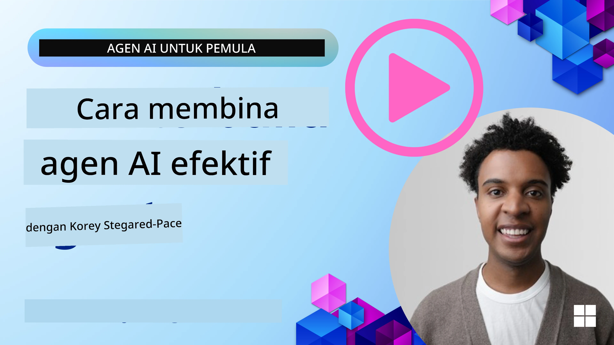
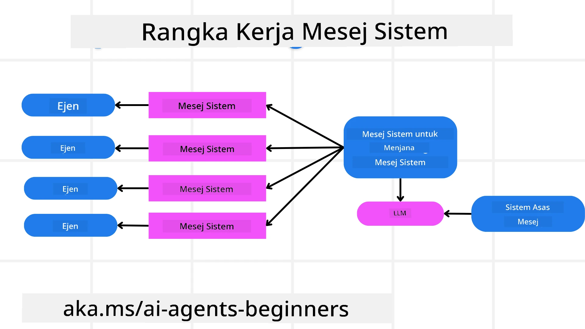
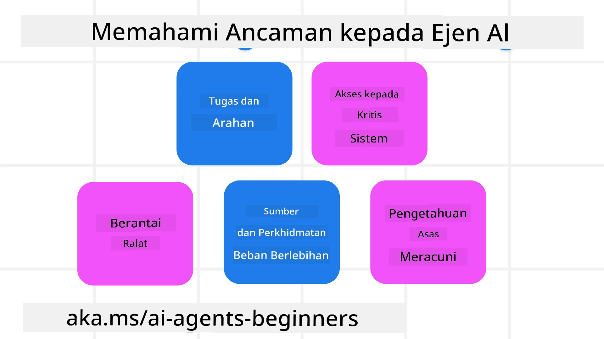
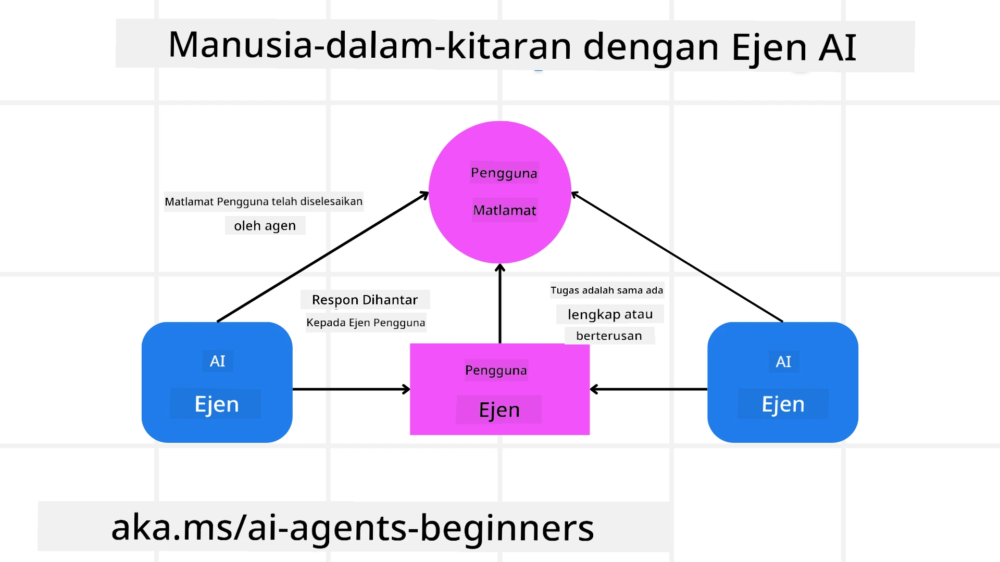

[](https://youtu.be/iZKkMEGBCUQ?si=Q-kEbcyHUMPoHp8L)

> _(Klik imej di atas untuk menonton video pelajaran ini)_

# Membina Ejen AI Yang Boleh Dipercayai

## Pengenalan

Pelajaran ini akan merangkumi:

- Bagaimana membina dan menyebarkan Ejen AI yang selamat dan berkesan
- Pertimbangan keselamatan penting semasa membangunkan Ejen AI.
- Bagaimana mengekalkan privasi data dan pengguna semasa membangunkan Ejen AI.

## Matlamat Pembelajaran

Selepas menyelesaikan pelajaran ini, anda akan tahu bagaimana untuk:

- Mengenal pasti dan mengurangkan risiko semasa mencipta Ejen AI.
- Melaksanakan langkah keselamatan untuk memastikan data dan akses diurus dengan betul.
- Mewujudkan Ejen AI yang mengekalkan privasi data dan memberikan pengalaman pengguna yang berkualiti.

## Keselamatan

Mari kita lihat terlebih dahulu membina aplikasi berasaskan ejen yang selamat. Keselamatan bermakna ejen AI berfungsi seperti yang direka. Sebagai pembina aplikasi berasaskan ejen, kami mempunyai kaedah dan alat untuk memaksimumkan keselamatan:

### Membina Rangka Kerja Mesej Sistem

Jika anda pernah membina aplikasi AI menggunakan Model Bahasa Besar (LLMs), anda tahu betapa pentingnya mereka bentuk prompt sistem atau mesej sistem yang kukuh. Prompt ini menetapkan peraturan meta, arahan, dan garis panduan tentang bagaimana LLM akan berinteraksi dengan pengguna dan data.

Bagi Ejen AI, prompt sistem adalah lebih penting kerana Ejen AI memerlukan arahan yang sangat khusus untuk melengkapkan tugasan yang telah kita reka.

Untuk mencipta prompt sistem yang boleh diskalakan, kita boleh menggunakan rangka kerja mesej sistem untuk membina satu atau lebih ejen dalam aplikasi kita:



#### Langkah 1: Cipta Mesej Sistem Meta 

Prompt meta akan digunakan oleh LLM untuk menjana prompt sistem bagi ejen yang kita cipta. Kami merancangnya sebagai templat supaya kita boleh mencipta beberapa ejen dengan cekap jika perlu.

Berikut adalah contoh mesej sistem meta yang akan kami berikan kepada LLM:

```plaintext
You are an expert at creating AI agent assistants. 
You will be provided a company name, role, responsibilities and other
information that you will use to provide a system prompt for.
To create the system prompt, be descriptive as possible and provide a structure that a system using an LLM can better understand the role and responsibilities of the AI assistant. 
```

#### Langkah 2: Cipta prompt asas

Langkah seterusnya ialah mencipta prompt asas untuk menerangkan Ejen AI. Anda harus menyertakan peranan ejen, tugasan yang akan diselesaikan oleh ejen, dan sebarang tanggungjawab lain bagi ejen tersebut.

Berikut adalah contoh:

```plaintext
You are a travel agent for Contoso Travel that is great at booking flights for customers. To help customers you can perform the following tasks: lookup available flights, book flights, ask for preferences in seating and times for flights, cancel any previously booked flights and alert customers on any delays or cancellations of flights.  
```

#### Langkah 3: Berikan Mesej Sistem Asas kepada LLM

Kini kita boleh mengoptimumkan mesej sistem ini dengan menyediakan mesej sistem meta sebagai mesej sistem dan mesej sistem asas kita.

Ini akan menghasilkan mesej sistem yang lebih baik direka untuk membimbing ejen AI kita:

```markdown
**Company Name:** Contoso Travel  
**Role:** Travel Agent Assistant

**Objective:**  
You are an AI-powered travel agent assistant for Contoso Travel, specializing in booking flights and providing exceptional customer service. Your main goal is to assist customers in finding, booking, and managing their flights, all while ensuring that their preferences and needs are met efficiently.

**Key Responsibilities:**

1. **Flight Lookup:**
    
    - Assist customers in searching for available flights based on their specified destination, dates, and any other relevant preferences.
    - Provide a list of options, including flight times, airlines, layovers, and pricing.
2. **Flight Booking:**
    
    - Facilitate the booking of flights for customers, ensuring that all details are correctly entered into the system.
    - Confirm bookings and provide customers with their itinerary, including confirmation numbers and any other pertinent information.
3. **Customer Preference Inquiry:**
    
    - Actively ask customers for their preferences regarding seating (e.g., aisle, window, extra legroom) and preferred times for flights (e.g., morning, afternoon, evening).
    - Record these preferences for future reference and tailor suggestions accordingly.
4. **Flight Cancellation:**
    
    - Assist customers in canceling previously booked flights if needed, following company policies and procedures.
    - Notify customers of any necessary refunds or additional steps that may be required for cancellations.
5. **Flight Monitoring:**
    
    - Monitor the status of booked flights and alert customers in real-time about any delays, cancellations, or changes to their flight schedule.
    - Provide updates through preferred communication channels (e.g., email, SMS) as needed.

**Tone and Style:**

- Maintain a friendly, professional, and approachable demeanor in all interactions with customers.
- Ensure that all communication is clear, informative, and tailored to the customer's specific needs and inquiries.

**User Interaction Instructions:**

- Respond to customer queries promptly and accurately.
- Use a conversational style while ensuring professionalism.
- Prioritize customer satisfaction by being attentive, empathetic, and proactive in all assistance provided.

**Additional Notes:**

- Stay updated on any changes to airline policies, travel restrictions, and other relevant information that could impact flight bookings and customer experience.
- Use clear and concise language to explain options and processes, avoiding jargon where possible for better customer understanding.

This AI assistant is designed to streamline the flight booking process for customers of Contoso Travel, ensuring that all their travel needs are met efficiently and effectively.

```

#### Langkah 4: Ulangi dan Perbaiki

Nilai rangka kerja mesej sistem ini adalah untuk memudahkan penskalaan penciptaan mesej sistem dari pelbagai ejen serta meningkatkan mesej sistem anda dari masa ke masa. Adalah jarang anda mempunyai mesej sistem yang berfungsi pada kali pertama untuk keseluruhan kes penggunaan anda. Mampu membuat sedikit pelarasan dan penambahbaikan dengan menukar mesej sistem asas dan menjalankannya melalui sistem akan membolehkan anda membanding dan menilai keputusan.

## Memahami Ancaman

Untuk membina ejen AI yang boleh dipercayai, adalah penting untuk memahami dan mengurangkan risiko dan ancaman kepada ejen AI anda. Mari kita lihat beberapa ancaman berbeza kepada ejen AI dan bagaimana anda boleh merancang dan bersedia dengan lebih baik untuk mereka.



### Tugas dan Arahan

**Penerangan:** Penyerang cuba menukar arahan atau matlamat ejen AI melalui prompting atau manipulasi input.

**Mitigasi**: Jalankan pemeriksaan pengesahan dan penapis input untuk mengesan prompt yang berpotensi berbahaya sebelum ia diproses oleh Ejen AI. Oleh kerana serangan ini biasanya memerlukan interaksi kerap dengan Ejen, mengehadkan bilangan giliran dalam perbualan adalah satu lagi cara untuk mengelakkan jenis serangan ini.

### Akses ke Sistem Kritikal

**Penerangan**: Jika ejen AI mempunyai akses ke sistem dan perkhidmatan yang menyimpan data sensitif, penyerang boleh menjejaskan komunikasi antara ejen dan perkhidmatan ini. Ini boleh menjadi serangan langsung atau percubaan tidak langsung untuk mendapatkan maklumat tentang sistem ini melalui ejen.

**Mitigasi**: Ejen AI harus mempunyai akses ke sistem berdasarkan keperluan sahaja untuk mengelakkan jenis serangan ini. Komunikasi antara ejen dan sistem juga harus selamat. Melaksanakan pengesahan dan kawalan akses adalah satu lagi cara untuk melindungi maklumat ini.

### Kelebihan Beban Sumber dan Perkhidmatan

**Penerangan:** Ejen AI boleh mengakses pelbagai alat dan perkhidmatan untuk menyelesaikan tugasan. Penyerang boleh menggunakan kemampuan ini untuk menyerang perkhidmatan ini dengan menghantar sejumlah besar permintaan melalui Ejen AI, yang mungkin mengakibatkan kegagalan sistem atau kos yang tinggi.

**Mitigasi:** Laksanakan dasar untuk mengehadkan bilangan permintaan yang boleh dibuat oleh ejen AI ke sesuatu perkhidmatan. Mengehadkan bilangan giliran perbualan dan permintaan kepada ejen AI anda adalah satu lagi cara untuk mengelakkan jenis serangan ini.

### Pencemaran Pangkalan Pengetahuan

**Penerangan:** Jenis serangan ini tidak menyasarkan ejen AI secara langsung tetapi mensasarkan pangkalan pengetahuan dan perkhidmatan lain yang akan digunakan oleh ejen AI. Ini boleh melibatkan merosakkan data atau maklumat yang akan digunakan ejen AI untuk menyelesaikan tugasan, membawa kepada jawapan yang berat sebelah atau tidak diingini kepada pengguna.

**Mitigasi:** Lakukan pengesahan berkala terhadap data yang akan digunakan oleh ejen AI dalam aliran kerjanya. Pastikan akses ke data ini selamat dan hanya diubah oleh individu yang dipercayai untuk mengelakkan jenis serangan ini.

### Ralat Berantai

**Penerangan:** Ejen AI mengakses pelbagai alat dan perkhidmatan untuk menyelesaikan tugasan. Ralat yang disebabkan oleh penyerang boleh membawa kepada kegagalan sistem lain yang dihubungkan dengan ejen AI, menyebabkan serangan menjadi lebih meluas dan lebih sukar untuk diselesaikan.

**Mitigasi**: Salah satu kaedah untuk mengelakkan ini adalah dengan menjadikan Ejen AI beroperasi dalam persekitaran terhad, seperti menjalankan tugasan dalam bekas Docker, untuk mengelakkan serangan langsung ke atas sistem. Mewujudkan mekanisme fallback dan logik cuba semula apabila sistem tertentu memberi tindak balas dengan ralat adalah satu lagi cara untuk mengelakkan kegagalan sistem yang lebih besar.

## Manusia-dalam-Gelung

Satu lagi cara berkesan untuk membina sistem Ejen AI yang boleh dipercayai ialah menggunakan pendekatan Manusia-dalam-gelung. Ini mewujudkan aliran di mana pengguna dapat memberi maklum balas kepada Ejen semasa proses berjalan. Pengguna pada dasarnya bertindak sebagai ejen dalam sistem berbilang ejen dan dengan memberi kelulusan atau penamatan proses yang sedang berjalan.



Berikut adalah petikan kod yang menggunakan Microsoft Agent Framework untuk menunjukkan bagaimana konsep ini dilaksanakan:

```python
import os
from agent_framework.azure import AzureAIProjectAgentProvider
from azure.identity import AzureCliCredential

# Cipta penyedia dengan kelulusan melibatkan manusia
provider = AzureAIProjectAgentProvider(
    credential=AzureCliCredential(),
)

# Cipta ejen dengan langkah kelulusan oleh manusia
response = provider.create_response(
    input="Write a 4-line poem about the ocean.",
    instructions="You are a helpful assistant. Ask for user approval before finalizing.",
)

# Pengguna boleh menyemak dan meluluskan jawapan
print(response.output_text)
user_input = input("Do you approve? (APPROVE/REJECT): ")
if user_input == "APPROVE":
    print("Response approved.")
else:
    print("Response rejected. Revising...")
```

## Kesimpulan

Membina ejen AI yang boleh dipercayai memerlukan reka bentuk yang teliti, langkah keselamatan yang kukuh, dan iterasi berterusan. Dengan melaksanakan sistem meta prompting yang tersusun, memahami ancaman yang berpotensi, dan menerapkan strategi mitigasi, pembangun boleh mencipta ejen AI yang selamat dan berkesan. Tambahan pula, menggabungkan pendekatan manusia-dalam-gelung memastikan ejen AI kekal selari dengan keperluan pengguna sambil mengurangkan risiko. Ketika AI terus berkembang, mengekalkan sikap proaktif terhadap keselamatan, privasi, dan pertimbangan etika akan menjadi kunci untuk memupuk kepercayaan dan kebolehpercayaan dalam sistem yang dikendalikan oleh AI.

### Ada Lagi Soalan mengenai Membina Ejen AI Yang Boleh Dipercayai?

Sertai the [Microsoft Foundry Discord](https://aka.ms/ai-agents/discord) untuk bertemu dengan pelajar lain, menghadiri waktu pejabat dan mendapatkan jawapan bagi soalan Ejen AI anda.

## Sumber Tambahan

- <a href="https://learn.microsoft.com/azure/ai-studio/responsible-use-of-ai-overview" target="_blank">Gambaran Keseluruhan AI Bertanggungjawab</a>
- <a href="https://learn.microsoft.com/azure/ai-studio/concepts/evaluation-approach-gen-ai" target="_blank">Penilaian model AI generatif dan aplikasi AI</a>
- <a href="https://learn.microsoft.com/azure/ai-services/openai/concepts/system-message?context=%2Fazure%2Fai-studio%2Fcontext%2Fcontext&tabs=top-techniques" target="_blank">Mesej sistem keselamatan</a>
- <a href="https://blogs.microsoft.com/wp-content/uploads/prod/sites/5/2022/06/Microsoft-RAI-Impact-Assessment-Template.pdf?culture=en-us&country=us" target="_blank">Templat Penilaian Risiko</a>

## Pelajaran Sebelumnya

[Agentic RAG](../05-agentic-rag/README.md)

## Pelajaran Seterusnya

[Planning Design Pattern](../07-planning-design/README.md)

---

<!-- CO-OP TRANSLATOR DISCLAIMER START -->
Penafian:
Dokumen ini telah diterjemahkan menggunakan perkhidmatan terjemahan AI Co-op Translator (https://github.com/Azure/co-op-translator). Walaupun kami berusaha mencapai ketepatan, sila ambil maklum bahawa terjemahan automatik mungkin mengandungi ralat atau ketidaktepatan. Dokumen asal dalam bahasa asalnya hendaklah dianggap sebagai sumber rujukan yang muktamad. Untuk maklumat yang kritikal, disyorkan menggunakan terjemahan profesional oleh penterjemah manusia. Kami tidak bertanggungjawab atas sebarang salah faham atau salah tafsir yang timbul daripada penggunaan terjemahan ini.
<!-- CO-OP TRANSLATOR DISCLAIMER END -->