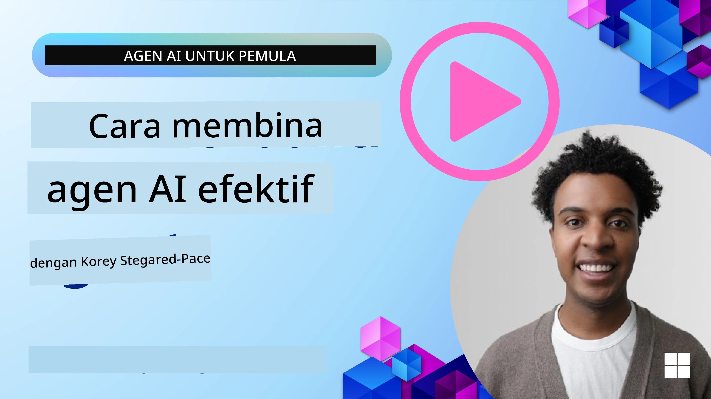
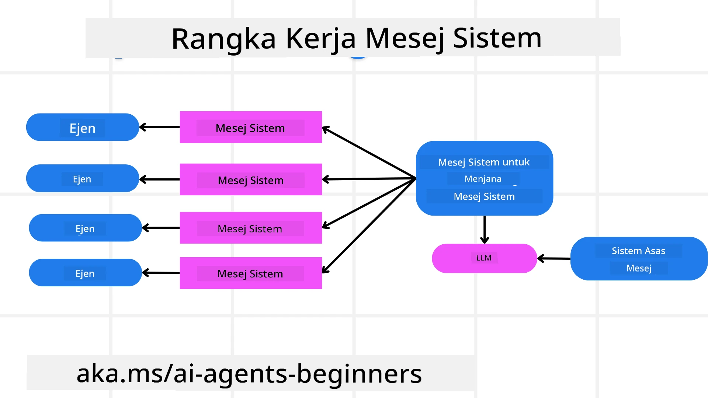
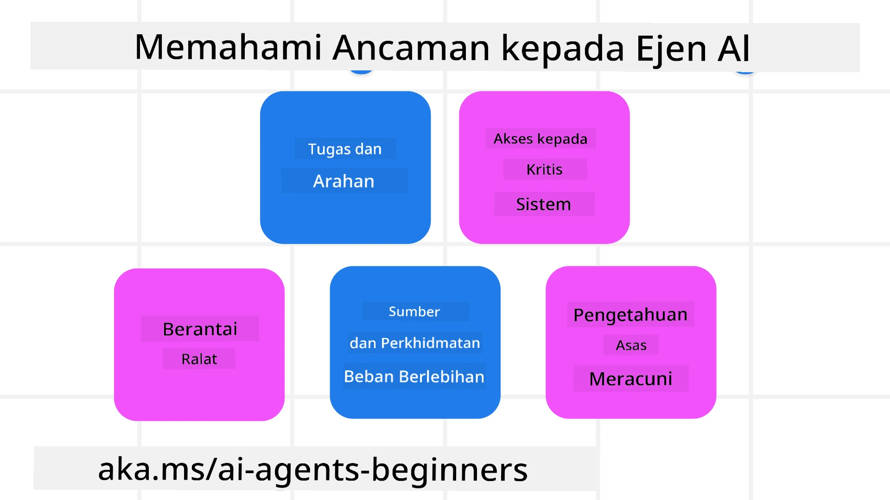
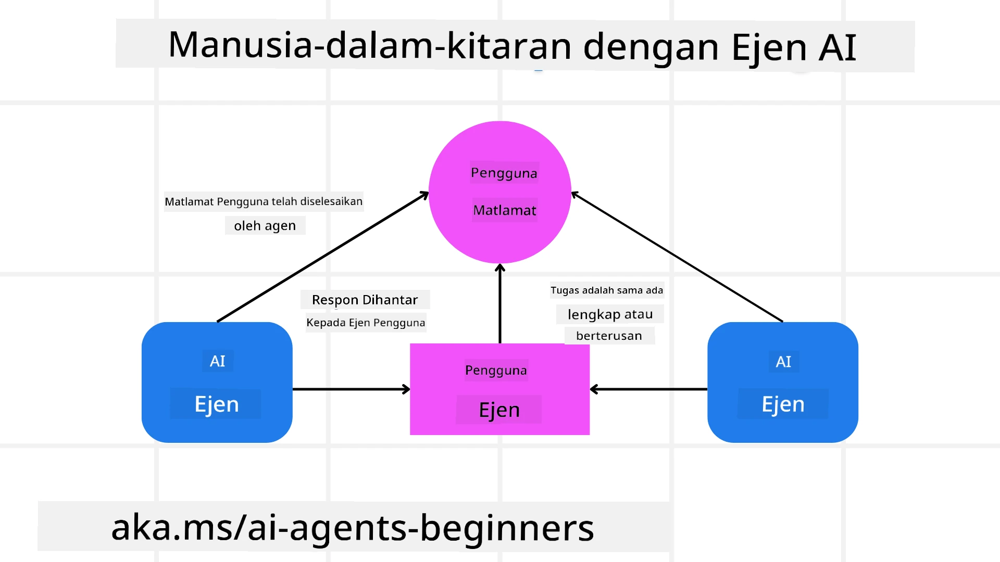

[](https://youtu.be/iZKkMEGBCUQ?si=Q-kEbcyHUMPoHp8L)

> _(Klik imej di atas untuk menonton video pelajaran ini)_

# Membina Ejen AI Yang Boleh Dipercayai

## Pengenalan

Pelajaran ini akan merangkumi:

- Cara membina dan melancarkan Ejen AI yang selamat dan berkesan
- Pertimbangan keselamatan penting semasa membangunkan Ejen AI.
- Cara menjaga data dan privasi pengguna semasa membangun Ejen AI.

## Matlamat Pembelajaran

Setelah menyelesaikan pelajaran ini, anda akan mengetahui cara:

- Mengenal pasti dan mengurangkan risiko semasa membuat Ejen AI.
- Melaksanakan langkah keselamatan untuk memastikan data dan akses diurus dengan betul.
- Mencipta Ejen AI yang mengekalkan privasi data dan menyediakan pengalaman pengguna yang berkualiti.

## Keselamatan

Mari kita lihat dahulu cara membina aplikasi ejen yang selamat. Keselamatan bermaksud ejen AI berfungsi seperti yang direka. Sebagai pembina aplikasi ejen, kita mempunyai kaedah dan alat untuk memaksimumkan keselamatan:

### Membina Rangka Kerja Mesej Sistem

Jika anda pernah membina aplikasi AI menggunakan Model Bahasa Besar (LLM), anda akan mengetahui kepentingan mereka bentuk arahan sistem atau mesej sistem yang kukuh. Arahan arahan ini menetapkan peraturan meta, arahan, dan garis panduan tentang bagaimana LLM akan berinteraksi dengan pengguna dan data.

Untuk Ejen AI, arahan sistem lebih penting kerana Ejen AI memerlukan arahan yang sangat khusus untuk menyelesaikan tugas yang telah kami cipta.

Untuk mewujudkan arahan sistem yang boleh diskalakan, kita boleh menggunakan rangka kerja mesej sistem untuk membina satu atau lebih ejen dalam aplikasi kita:



#### Langkah 1: Cipta Mesej Sistem Meta

Arahan meta akan digunakan oleh LLM untuk menghasilkan arahan sistem bagi ejen yang kita cipta. Kita mereka bentuknya sebagai templat supaya kita boleh mencipta pelbagai ejen dengan cekap jika perlu.

Berikut adalah contoh mesej sistem meta yang akan kita berikan kepada LLM:

```plaintext
You are an expert at creating AI agent assistants. 
You will be provided a company name, role, responsibilities and other
information that you will use to provide a system prompt for.
To create the system prompt, be descriptive as possible and provide a structure that a system using an LLM can better understand the role and responsibilities of the AI assistant. 
```

#### Langkah 2: Cipta arahan asas

Langkah seterusnya ialah mencipta arahan asas untuk menerangkan Ejen AI. Anda harus memasukkan peranan ejen, tugas yang akan diselesaikan oleh ejen, dan sebarang tanggungjawab lain ejen.

Berikut adalah contoh:

```plaintext
You are a travel agent for Contoso Travel that is great at booking flights for customers. To help customers you can perform the following tasks: lookup available flights, book flights, ask for preferences in seating and times for flights, cancel any previously booked flights and alert customers on any delays or cancellations of flights.  
```

#### Langkah 3: Berikan Mesej Sistem Asas kepada LLM

Kini kita boleh mengoptimumkan mesej sistem ini dengan memberikan mesej sistem meta sebagai mesej sistem dan mesej sistem asas kita.

Ini akan menghasilkan mesej sistem yang direka dengan lebih baik untuk membimbing ejen AI kita:

```markdown
**Company Name:** Contoso Travel  
**Role:** Travel Agent Assistant

**Objective:**  
You are an AI-powered travel agent assistant for Contoso Travel, specializing in booking flights and providing exceptional customer service. Your main goal is to assist customers in finding, booking, and managing their flights, all while ensuring that their preferences and needs are met efficiently.

**Key Responsibilities:**

1. **Flight Lookup:**
    
    - Assist customers in searching for available flights based on their specified destination, dates, and any other relevant preferences.
    - Provide a list of options, including flight times, airlines, layovers, and pricing.
2. **Flight Booking:**
    
    - Facilitate the booking of flights for customers, ensuring that all details are correctly entered into the system.
    - Confirm bookings and provide customers with their itinerary, including confirmation numbers and any other pertinent information.
3. **Customer Preference Inquiry:**
    
    - Actively ask customers for their preferences regarding seating (e.g., aisle, window, extra legroom) and preferred times for flights (e.g., morning, afternoon, evening).
    - Record these preferences for future reference and tailor suggestions accordingly.
4. **Flight Cancellation:**
    
    - Assist customers in canceling previously booked flights if needed, following company policies and procedures.
    - Notify customers of any necessary refunds or additional steps that may be required for cancellations.
5. **Flight Monitoring:**
    
    - Monitor the status of booked flights and alert customers in real-time about any delays, cancellations, or changes to their flight schedule.
    - Provide updates through preferred communication channels (e.g., email, SMS) as needed.

**Tone and Style:**

- Maintain a friendly, professional, and approachable demeanor in all interactions with customers.
- Ensure that all communication is clear, informative, and tailored to the customer's specific needs and inquiries.

**User Interaction Instructions:**

- Respond to customer queries promptly and accurately.
- Use a conversational style while ensuring professionalism.
- Prioritize customer satisfaction by being attentive, empathetic, and proactive in all assistance provided.

**Additional Notes:**

- Stay updated on any changes to airline policies, travel restrictions, and other relevant information that could impact flight bookings and customer experience.
- Use clear and concise language to explain options and processes, avoiding jargon where possible for better customer understanding.

This AI assistant is designed to streamline the flight booking process for customers of Contoso Travel, ensuring that all their travel needs are met efficiently and effectively.

```

#### Langkah 4: Ulang dan Tingkatkan

Nilai rangka kerja mesej sistem ini adalah untuk memudahkan skala penciptaan mesej sistem dari pelbagai ejen serta memperbaiki mesej sistem anda dari masa ke masa. Jarang sekali anda akan mempunyai mesej sistem yang berfungsi sepenuhnya kali pertama untuk kes penggunaan anda. Dapat membuat sedikit ubah suai dan penambahbaikan dengan menukar mesej sistem asas dan menjalankannya melalui sistem akan membolehkan anda membanding dan menilai hasil.

## Memahami Ancaman

Untuk membina ejen AI yang boleh dipercayai, penting untuk memahami dan mengurangkan risiko serta ancaman kepada ejen AI anda. Mari kita lihat hanya beberapa ancaman berbeza kepada ejen AI dan bagaimana anda boleh merancang dan bersedia dengan lebih baik untuk mereka.



### Tugas dan Arahan

**Penerangan:** Penyerang cuba mengubah arahan atau matlamat ejen AI melalui arahan atau manipulasi input.

**Pengurangan Risiko:** Laksanakan pemeriksaan pengesahan dan penapis input untuk mengesan arahan berbahaya sebelum ia diproses oleh Ejen AI. Oleh kerana serangan ini biasanya memerlukan interaksi kerap dengan Ejen, mengehadkan bilangan pusingan dalam perbualan adalah satu lagi cara untuk menghalang jenis serangan ini.

### Akses ke Sistem Kritikal

**Penerangan:** Jika ejen AI mempunyai akses kepada sistem dan perkhidmatan yang menyimpan data sensitif, penyerang boleh menjejaskan komunikasi antara ejen dan perkhidmatan ini. Ini boleh menjadi serangan langsung atau cubaan tidak langsung untuk mendapatkan maklumat tentang sistem ini melalui ejen.

**Pengurangan Risiko:** Ejen AI hanya harus mempunyai akses kepada sistem berdasarkan keperluan sahaja untuk mencegah jenis serangan ini. Komunikasi antara ejen dan sistem juga harus selamat. Melaksanakan pengesahan dan kawalan akses adalah satu lagi cara untuk melindungi maklumat ini.

### Beban Berlebihan pada Sumber dan Perkhidmatan

**Penerangan:** Ejen AI boleh mengakses pelbagai alat dan perkhidmatan untuk menyelesaikan tugas. Penyerang boleh menggunakan keupayaan ini untuk menyerang perkhidmatan ini dengan menghantar sejumlah besar permintaan melalui Ejen AI, yang boleh menyebabkan kegagalan sistem atau kos tinggi.

**Pengurangan Risiko:** Laksanakan polisi untuk mengehadkan bilangan permintaan yang boleh dibuat oleh ejen AI ke perkhidmatan. Mengehadkan bilangan pusingan perbualan dan permintaan kepada ejen AI anda adalah cara lain untuk mengelakkan jenis serangan ini.

### Pencemaran Pangkalan Pengetahuan

**Penerangan:** Jenis serangan ini tidak mensasarkan ejen AI secara langsung tetapi mensasarkan pangkalan pengetahuan dan perkhidmatan lain yang akan digunakan oleh Ejen AI. Ini boleh melibatkan merosakkan data atau maklumat yang akan digunakan oleh ejen AI untuk menyelesaikan tugas, menyebabkan maklum balas berat sebelah atau yang tidak diingini kepada pengguna.

**Pengurangan Risiko:** Lakukan pengesahan berkala terhadap data yang akan digunakan oleh ejen AI dalam aliran kerjanya. Pastikan akses kepada data ini selamat dan hanya boleh diubah oleh individu yang dipercayai untuk mengelakkan jenis serangan ini.

### Ralat Berantai

**Penerangan:** Ejen AI mengakses pelbagai alat dan perkhidmatan untuk menyelesaikan tugas. Ralat yang disebabkan oleh penyerang boleh menyebabkan kegagalan sistem lain yang disambungkan kepada ejen, menyebabkan serangan menjadi lebih meluas dan sukar diperbaiki.

**Pengurangan Risiko:** Salah satu cara mengelakkan ini adalah dengan menjadikan Ejen AI beroperasi dalam persekitaran terhad, seperti menjalankan tugas dalam bekas Docker, untuk menghalang serangan sistem secara langsung. Mewujudkan mekanisme sandaran dan logik cubaan semula apabila sistem tertentu memberikan ralat adalah cara lain untuk mengelakkan kegagalan sistem yang lebih besar.

## Manusia dalam Gelung

Satu lagi cara berkesan untuk membina sistem Ejen AI yang boleh dipercayai ialah menggunakan manusia dalam gelung. Ini mewujudkan aliran di mana pengguna boleh memberikan maklum balas kepada Ejen semasa proses berjalan. Pengguna bertindak sebagai ejen dalam sistem pelbagai ejen dengan memberikan kelulusan atau penamatan proses yang sedang berjalan.



Berikut adalah petikan kod menggunakan Rangka Kerja Ejen Microsoft untuk menunjukkan bagaimana konsep ini dilaksanakan:

```python
import os
from agent_framework.foundry import FoundryChatClient
from azure.identity import AzureCliCredential

# Cipta penyedia dengan kelulusan manusia dalam kitaran
provider = FoundryChatClient(
    project_endpoint=os.environ["AZURE_AI_PROJECT_ENDPOINT"],
    model=os.environ["AZURE_AI_MODEL_DEPLOYMENT_NAME"],
    credential=AzureCliCredential(),
)

# Cipta agen dengan langkah kelulusan manusia
response = provider.create_response(
    input="Write a 4-line poem about the ocean.",
    instructions="You are a helpful assistant. Ask for user approval before finalizing.",
)

# Pengguna boleh menyemak dan meluluskan respons
print(response.output_text)
user_input = input("Do you approve? (APPROVE/REJECT): ")
if user_input == "APPROVE":
    print("Response approved.")
else:
    print("Response rejected. Revising...")
```

## Kesimpulan

Membina ejen AI yang boleh dipercayai memerlukan reka bentuk yang teliti, langkah keselamatan yang kukuh, dan pengulangan berterusan. Dengan melaksanakan sistem arahan meta berstruktur, memahami ancaman berpotensi, dan menggunakan strategi pengurangan risiko, pembangun dapat mencipta ejen AI yang selamat dan berkesan. Selain itu, menggabungkan pendekatan manusia dalam gelung memastikan ejen AI kekal selaras dengan keperluan pengguna sambil meminimumkan risiko. Seiring AI terus berkembang, mengekalkan sikap proaktif terhadap keselamatan, privasi, dan pertimbangan etika akan menjadi kunci untuk memupuk kepercayaan dan kebolehpercayaan dalam sistem berasaskan AI.

## Contoh Kod

- [`code_samples/06-system-message-framework.ipynb`](code_samples/06-system-message-framework.ipynb): Demonstrasi langkah demi langkah rangka kerja mesej sistem meta-arahan.
- [`code_samples/06-human-in-the-loop.ipynb`](code_samples/06-human-in-the-loop.ipynb): Pintu kelulusan sebelum tindakan, penentuan risiko, dan rekod audit untuk ejen yang boleh dipercayai.

### Ada Soalan Lagi tentang Membina Ejen AI yang Boleh Dipercayai?

Sertai [Microsoft Foundry Discord](https://discord.com/invite/ATgtXmAS5D) untuk berjumpa dengan pelajar lain, menghadiri waktu pejabat dan dapatkan jawapan untuk soalan Ejen AI anda.

## Sumber Tambahan

- <a href="https://learn.microsoft.com/azure/ai-studio/responsible-use-of-ai-overview" target="_blank">Gambaran Keseluruhan AI Bertanggungjawab</a>
- <a href="https://learn.microsoft.com/azure/ai-studio/concepts/evaluation-approach-gen-ai" target="_blank">Penilaian model AI generatif dan aplikasi AI</a>
- <a href="https://learn.microsoft.com/azure/ai-services/openai/concepts/system-message?context=%2Fazure%2Fai-studio%2Fcontext%2Fcontext&tabs=top-techniques" target="_blank">Mesej sistem keselamatan</a>
- <a href="https://blogs.microsoft.com/wp-content/uploads/prod/sites/5/2022/06/Microsoft-RAI-Impact-Assessment-Template.pdf?culture=en-us&country=us" target="_blank">Templat Penilaian Risiko</a>

## Pelajaran Sebelumnya

[Agentic RAG](../05-agentic-rag/README.md)

## Pelajaran Seterusnya

[Corak Reka Bentuk Perancangan](../07-planning-design/README.md)

---

<!-- CO-OP TRANSLATOR DISCLAIMER START -->
**Penafian**:
Dokumen ini telah diterjemahkan menggunakan perkhidmatan terjemahan AI [Co-op Translator](https://github.com/Azure/co-op-translator). Walaupun kami berusaha untuk ketepatan, sila ambil maklum bahawa terjemahan automatik mungkin mengandungi kesilapan atau ketidaktepatan. Dokumen asal dalam bahasa asalnya harus dianggap sebagai sumber yang sahih. Untuk maklumat penting, terjemahan oleh manusia profesional adalah disyorkan. Kami tidak bertanggungjawab terhadap sebarang salah faham atau salah tafsir yang timbul daripada penggunaan terjemahan ini.
<!-- CO-OP TRANSLATOR DISCLAIMER END -->