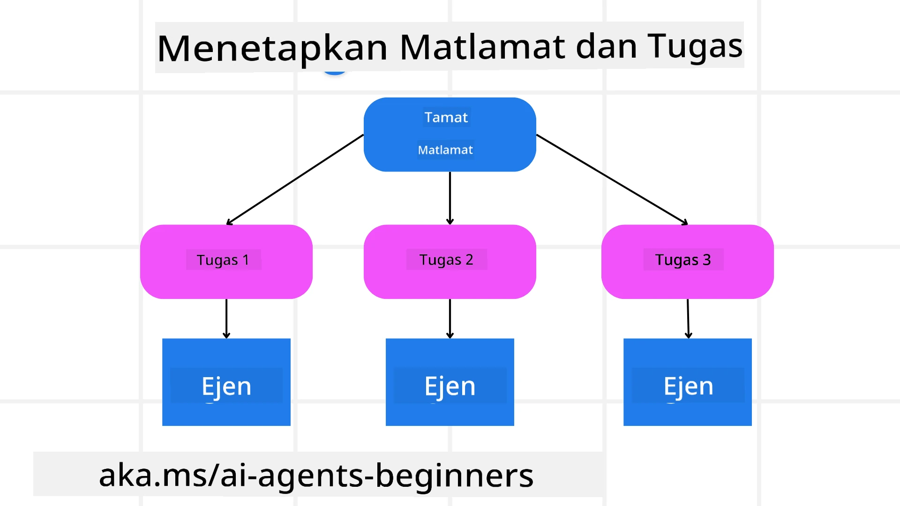

[](https://youtu.be/kPfJ2BrBCMY?si=9pYpPXp0sSbK91Dr)

> _(Klik gambar di atas untuk menonton video pelajaran ini)_

# Reka Bentuk Perancangan

## Pengenalan

Pelajaran ini akan merangkumi

* Mendefinisikan matlamat keseluruhan yang jelas dan memecahkan tugas kompleks kepada tugas yang boleh diurus.
* Memanfaatkan output berstruktur untuk respons yang lebih boleh dipercayai dan boleh dibaca mesin.
* Menerapkan pendekatan berorientasikan peristiwa untuk mengendalikan tugas dinamik dan input yang tidak dijangka.

## Matlamat Pembelajaran

Setelah menamatkan pelajaran ini, anda akan memahami:

* Kenal pasti dan tetapkan matlamat keseluruhan untuk ejen AI, memastikan ia jelas mengetahui apa yang perlu dicapai.
* Pisahkan tugas kompleks kepada subtugas yang boleh diurus dan susun mereka dalam urutan logik.
* Lengkapi ejen dengan alatan yang sesuai (contohnya, alat carian atau alat analitik data), tentukan bila dan bagaimana ia digunakan, dan kendalikan situasi tidak dijangka yang timbul.
* Nilai hasil subtugas, ukur prestasi, dan iterasi pada tindakan untuk memperbaiki output akhir.

## Mentakrifkan Matlamat Keseluruhan dan Memecahkan Tugas



Kebanyakan tugas dunia sebenar terlalu kompleks untuk ditangani dalam satu langkah. Ejen AI memerlukan objektif ringkas untuk membimbing perancangan dan tindakannya. Sebagai contoh, pertimbangkan matlamat:

    "Hasilkan jadual perjalanan 3 hari."

Walaupun mudah dinyatakan, ia masih memerlukan penambahbaikan. Semakin jelas matlamat, semakin baik ejen (dan sebarang kolaborator manusia) dapat memfokus pada mencapai hasil yang betul, seperti mencipta jadual perjalanan yang komprehensif dengan pilihan penerbangan, cadangan hotel, dan saranan aktiviti.

### Penguraian Tugas

Tugas besar atau rumit menjadi lebih mudah diurus apabila dibahagikan kepada subtugas yang lebih kecil dan berorientasikan matlamat.
Untuk contoh jadual perjalanan, anda boleh memecahkan matlamat kepada:

* Tempahan Penerbangan
* Tempahan Hotel
* Sewa Kereta
* Personalisasi

Setiap subtugas kemudian boleh ditangani oleh ejen atau proses yang berdedikasi. Seorang ejen mungkin mengkhusus dalam mencari tawaran penerbangan terbaik, seorang lagi memberi tumpuan kepada tempahan hotel, dan sebagainya. Ejen penyelarasan atau “downstream” kemudian boleh menyusun keputusan ini menjadi satu jadual perjalanan yang padu untuk pengguna akhir.

Pendekatan modular ini juga membenarkan penambahbaikan secara berperingkat. Sebagai contoh, anda boleh menambah ejen khusus untuk Cadangan Makanan atau Saranan Aktiviti Tempatan dan memperkemas jadual perjalanan dari masa ke masa.

### Output Berstruktur

Model Bahasa Besar (LLMs) boleh menghasilkan output berstruktur (contohnya JSON) yang lebih mudah untuk ejen atau perkhidmatan downstream untuk mengurai dan memproses. Ini amat berguna dalam konteks berbilang ejen, di mana kita boleh melaksanakan tugas-tugas ini selepas output perancangan diterima.

Petikan Python berikut menunjukkan ejen perancangan mudah yang memecahkan matlamat kepada subtugas dan menghasilkan pelan berstruktur:

```python
from pydantic import BaseModel
from enum import Enum
from typing import List, Optional, Union
import json
import os
from typing import Optional
from pprint import pprint
from agent_framework.azure import AzureAIProjectAgentProvider
from azure.identity import AzureCliCredential

class AgentEnum(str, Enum):
    FlightBooking = "flight_booking"
    HotelBooking = "hotel_booking"
    CarRental = "car_rental"
    ActivitiesBooking = "activities_booking"
    DestinationInfo = "destination_info"
    DefaultAgent = "default_agent"
    GroupChatManager = "group_chat_manager"

# Model Subtugas Perjalanan
class TravelSubTask(BaseModel):
    task_details: str
    assigned_agent: AgentEnum  # Kami ingin menugaskan tugas kepada ejen

class TravelPlan(BaseModel):
    main_task: str
    subtasks: List[TravelSubTask]
    is_greeting: bool

provider = AzureAIProjectAgentProvider(credential=AzureCliCredential())

# Tentukan mesej pengguna
system_prompt = """You are a planner agent.
    Your job is to decide which agents to run based on the user's request.
    Provide your response in JSON format with the following structure:
{'main_task': 'Plan a family trip from Singapore to Melbourne.',
 'subtasks': [{'assigned_agent': 'flight_booking',
               'task_details': 'Book round-trip flights from Singapore to '
                               'Melbourne.'}
    Below are the available agents specialised in different tasks:
    - FlightBooking: For booking flights and providing flight information
    - HotelBooking: For booking hotels and providing hotel information
    - CarRental: For booking cars and providing car rental information
    - ActivitiesBooking: For booking activities and providing activity information
    - DestinationInfo: For providing information about destinations
    - DefaultAgent: For handling general requests"""

user_message = "Create a travel plan for a family of 2 kids from Singapore to Melbourne"

response = client.create_response(input=user_message, instructions=system_prompt)

response_content = response.output_text
pprint(json.loads(response_content))
```

### Ejen Perancang dengan Orkestrasi Berbilang Ejen

Dalam contoh ini, Ejen Perute Semantik menerima permintaan pengguna (contohnya, "Saya perlukan pelan hotel untuk perjalanan saya.").

Perancang kemudian:

* Menerima Pelan Hotel: Perancang mengambil mesej pengguna dan, berdasarkan arahan sistem (termasuk butiran ejen yang tersedia), menghasilkan pelan perjalanan berstruktur.
* Menyenaraikan Ejen dan Alat Mereka: daftar ejen memegang senarai ejen (contohnya, untuk penerbangan, hotel, sewa kereta, dan aktiviti) bersama-sama dengan fungsi atau alat yang mereka tawarkan.
* Menghala Pelan kepada Ejen Berkaitan: Bergantung pada bilangan subtugas, perancang sama ada menghantar mesej terus kepada ejen berdedikasi (untuk senario tugas tunggal) atau menyelaraskan melalui pengurus sembang berkumpulan untuk kerjasama berbilang ejen.
* Merumuskan Hasil: Akhir sekali, perancang merumuskan pelan yang dijana untuk kejelasan.
Petikan kod Python berikut menerangkan langkah-langkah ini:

```python

from pydantic import BaseModel

from enum import Enum
from typing import List, Optional, Union

class AgentEnum(str, Enum):
    FlightBooking = "flight_booking"
    HotelBooking = "hotel_booking"
    CarRental = "car_rental"
    ActivitiesBooking = "activities_booking"
    DestinationInfo = "destination_info"
    DefaultAgent = "default_agent"
    GroupChatManager = "group_chat_manager"

# Model Subtugas Perjalanan

class TravelSubTask(BaseModel):
    task_details: str
    assigned_agent: AgentEnum # kami ingin menugaskan tugas kepada ejen

class TravelPlan(BaseModel):
    main_task: str
    subtasks: List[TravelSubTask]
    is_greeting: bool
import json
import os
from typing import Optional

from agent_framework.azure import AzureAIProjectAgentProvider
from azure.identity import AzureCliCredential

# Cipta klien

provider = AzureAIProjectAgentProvider(credential=AzureCliCredential())

from pprint import pprint

# Tentukan mesej pengguna

system_prompt = """You are a planner agent.
    Your job is to decide which agents to run based on the user's request.
    Below are the available agents specialized in different tasks:
    - FlightBooking: For booking flights and providing flight information
    - HotelBooking: For booking hotels and providing hotel information
    - CarRental: For booking cars and providing car rental information
    - ActivitiesBooking: For booking activities and providing activity information
    - DestinationInfo: For providing information about destinations
    - DefaultAgent: For handling general requests"""

user_message = "Create a travel plan for a family of 2 kids from Singapore to Melbourne"

response = client.create_response(input=user_message, instructions=system_prompt)

response_content = response.output_text

# Cetak kandungan respons selepas memuatkannya sebagai JSON

pprint(json.loads(response_content))
```

Apa yang berikut adalah output dari kod sebelumnya dan anda kemudian boleh menggunakan output berstruktur ini untuk menghala ke `assigned_agent` dan meringkaskan pelan perjalanan kepada pengguna akhir.

```json
{
    "is_greeting": "False",
    "main_task": "Plan a family trip from Singapore to Melbourne.",
    "subtasks": [
        {
            "assigned_agent": "flight_booking",
            "task_details": "Book round-trip flights from Singapore to Melbourne."
        },
        {
            "assigned_agent": "hotel_booking",
            "task_details": "Find family-friendly hotels in Melbourne."
        },
        {
            "assigned_agent": "car_rental",
            "task_details": "Arrange a car rental suitable for a family of four in Melbourne."
        },
        {
            "assigned_agent": "activities_booking",
            "task_details": "List family-friendly activities in Melbourne."
        },
        {
            "assigned_agent": "destination_info",
            "task_details": "Provide information about Melbourne as a travel destination."
        }
    ]
}
```

Contoh notebook dengan sampel kod sebelumnya boleh didapati [di sini](07-python-agent-framework.ipynb).

### Perancangan Iteratif

Sesetengah tugas memerlukan perbincangan dua hala atau perancangan semula, di mana hasil satu subtugas mempengaruhi seterusnya. Sebagai contoh, jika ejen menemui format data yang tidak dijangka semasa menempah penerbangan, ia mungkin perlu menyesuaikan strateginya sebelum meneruskan kepada tempahan hotel.

Selain itu, maklum balas pengguna (contohnya seorang manusia memutuskan mereka lebih suka penerbangan lebih awal) boleh mencetuskan perancangan semula bahagian. Pendekatan dinamik dan iteratif ini memastikan penyelesaian akhir selari dengan kekangan dunia sebenar dan keutamaan pengguna yang berkembang.

contoh kod

```python
from agent_framework.azure import AzureAIProjectAgentProvider
from azure.identity import AzureCliCredential
#.. sama seperti kod sebelumnya dan teruskan sejarah pengguna serta rancangan semasa

system_prompt = """You are a planner agent to optimize the
    Your job is to decide which agents to run based on the user's request.
    Below are the available agents specialized in different tasks:
    - FlightBooking: For booking flights and providing flight information
    - HotelBooking: For booking hotels and providing hotel information
    - CarRental: For booking cars and providing car rental information
    - ActivitiesBooking: For booking activities and providing activity information
    - DestinationInfo: For providing information about destinations
    - DefaultAgent: For handling general requests"""

user_message = "Create a travel plan for a family of 2 kids from Singapore to Melbourne"

response = client.create_response(
    input=user_message,
    instructions=system_prompt,
    context=f"Previous travel plan - {TravelPlan}",
)
# .. rancang semula dan hantar tugas kepada ejen masing-masing
```

Untuk perancangan yang lebih komprehensif, lihat Magnetic One <a href="https://www.microsoft.com/research/articles/magentic-one-a-generalist-multi-agent-system-for-solving-complex-tasks" target="_blank">Catatan Blog</a> untuk penyelesaian tugas kompleks.

## Ringkasan

Dalam artikel ini kita telah melihat contoh bagaimana kita boleh mencipta perancang yang boleh memilih secara dinamik ejen yang tersedia yang ditakrifkan. Output Perancang memecahkan tugas dan menetapkan ejen supaya mereka boleh dilaksanakan. Diandaikan ejen mempunyai akses kepada fungsi/alatan yang diperlukan untuk melaksanakan tugas tersebut. Selain ejen, anda boleh memasukkan corak lain seperti refleksi, penyimpul, dan sembang secara pusingan untuk menyesuaikan lagi.

## Sumber Tambahan

Magentic One - Sistem multi-ejen generalis untuk menyelesaikan tugas kompleks dan telah mencapai keputusan yang mengagumkan pada beberapa penanda aras ejenik yang mencabar. Rujukan: <a href="https://www.microsoft.com/research/articles/magentic-one-a-generalist-multi-agent-system-for-solving-complex-tasks" target="_blank">Magentic One</a>. Dalam pelaksanaan ini pengorkestrasi mencipta pelan khusus tugasan dan mendelegasikan tugasan-tugasan ini kepada ejen yang tersedia. Selain perancangan, pengorkestrasi juga menggunakan mekanisme penjejakan untuk memantau kemajuan tugasan dan merancang semula apabila dikehendaki.

### Ada Soalan Lagi mengenai Corak Reka Bentuk Perancangan?

Sertai the [Microsoft Foundry Discord](https://aka.ms/ai-agents/discord) untuk berjumpa dengan pelajar lain, menghadiri sesi waktu pejabat dan mendapatkan jawapan kepada soalan tentang Ejen AI anda.

## Pelajaran Sebelumnya

[Membina Ejen AI yang Boleh Dipercayai](../06-building-trustworthy-agents/README.md)

## Pelajaran Seterusnya

[Corak Reka Bentuk Berbilang Ejen](../08-multi-agent/README.md)

---

<!-- CO-OP TRANSLATOR DISCLAIMER START -->
Penafian:
Dokumen ini telah diterjemahkan menggunakan perkhidmatan terjemahan AI Co-op Translator (https://github.com/Azure/co-op-translator). Walaupun kami berusaha untuk memastikan ketepatan, sila ambil maklum bahawa terjemahan automatik mungkin mengandungi ralat atau ketidaktepatan. Dokumen asal dalam bahasa asalnya hendaklah dianggap sebagai sumber yang sahih. Untuk maklumat penting, disarankan terjemahan profesional oleh penterjemah manusia. Kami tidak bertanggungjawab terhadap sebarang salah faham atau tafsiran yang salah yang timbul daripada penggunaan terjemahan ini.
<!-- CO-OP TRANSLATOR DISCLAIMER END -->