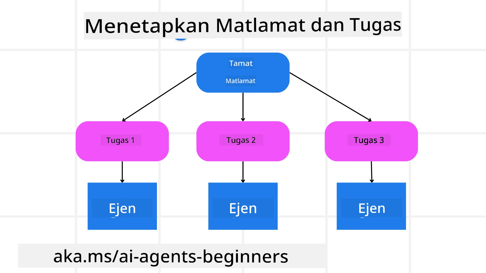

[](https://youtu.be/kPfJ2BrBCMY?si=9pYpPXp0sSbK91Dr)

> _(Klik gambar di atas untuk menonton video pelajaran ini)_

# Reka Bentuk Perancangan

## Pengenalan

Pelajaran ini akan merangkumi

* Mendefinisikan matlamat keseluruhan yang jelas dan memecahkan tugas kompleks kepada tugas yang boleh diurus.
* Memanfaatkan output berstruktur untuk respons yang lebih boleh dipercayai dan boleh dibaca oleh mesin.
* Menerapkan pendekatan berasaskan acara untuk mengendalikan tugas dinamik dan input yang tidak dijangka.

## Matlamat Pembelajaran

Selepas menyelesaikan pelajaran ini, anda akan memahami tentang:

* Mengenal pasti dan menetapkan matlamat keseluruhan untuk ejen AI, memastikan ia jelas tentang apa yang perlu dicapai.
* Memecahkan tugas kompleks kepada sub-tugas yang boleh diurus dan menyusunnya dalam urutan logik.
* Melengkapkan ejen dengan alat yang betul (contohnya, alat carian atau alat analitik data), memutuskan bila dan bagaimana ia digunakan, dan mengendalikan situasi tidak dijangka yang timbul.
* Menilai hasil sub-tugas, mengukur prestasi, dan mengulangi tindakan untuk memperbaiki output akhir.

## Mendefinisikan Matlamat Keseluruhan dan Memecahkan Tugas



Kebanyakan tugas dunia sebenar terlalu kompleks untuk diselesaikan dalam satu langkah. Ejen AI memerlukan objektif ringkas untuk membimbing perancangan dan tindakannya. Sebagai contoh, pertimbangkan matlamat:

    "Hasilkan jadual perjalanan selama 3 hari."

Walaupun mudah dikemukakan, ia masih memerlukan penyesuaian. Semakin jelas matlamat, semakin baik ejen (dan mana-mana rakan kongsi manusia) dapat memberi tumpuan untuk mencapai hasil yang tepat, seperti membuat jadual perjalanan yang komprehensif dengan pilihan penerbangan, cadangan hotel, dan saranan aktiviti.

### Pemecahan Tugas

Tugas besar atau rumit menjadi lebih mudah dikendalikan apabila dibahagikan kepada sub-tugas kecil yang berorientasikan matlamat.
Untuk contoh jadual perjalanan, anda boleh memecahkan matlamat kepada:

* Tempahan Penerbangan
* Tempahan Hotel
* Sewa Kereta
* Personalisasi

Setiap sub-tugas kemudian boleh dikendalikan oleh ejen atau proses khusus. Seorang ejen mungkin mengkhusus dalam mencari tawaran penerbangan terbaik, seorang lagi fokus pada tempahan hotel, dan sebagainya. Ejen penyelaras atau "downstream" boleh menyusun keputusan ini menjadi satu jadual perjalanan yang utuh untuk pengguna akhir.

Pendekatan modular ini juga membenarkan peningkatan berperingkat. Sebagai contoh, anda boleh menambah ejen khusus untuk Cadangan Makanan atau Saranan Aktiviti Tempatan dan memperbaiki jadual perjalanan dari masa ke masa.

### Output Berstruktur

Model Bahasa Besar (LLM) boleh menghasilkan output berstruktur (contohnya JSON) yang lebih mudah untuk ejen atau perkhidmatan downstream untuk menguraikan dan memprosesnya. Ini sangat berguna dalam konteks multi-ejen, di mana kita boleh melaksanakan tugas ini selepas output rancangan diterima.

Potongan kod Python berikut menunjukkan ejen perancang mudah yang memecahkan matlamat kepada sub-tugas dan menghasilkan pelan berstruktur:

```python
from pydantic import BaseModel
from enum import Enum
from typing import List, Optional, Union
import json
import os
from typing import Optional
from pprint import pprint
from agent_framework.foundry import FoundryChatClient
from azure.identity import AzureCliCredential

class AgentEnum(str, Enum):
    FlightBooking = "flight_booking"
    HotelBooking = "hotel_booking"
    CarRental = "car_rental"
    ActivitiesBooking = "activities_booking"
    DestinationInfo = "destination_info"
    DefaultAgent = "default_agent"
    GroupChatManager = "group_chat_manager"

# Model SubTugas Perjalanan
class TravelSubTask(BaseModel):
    task_details: str
    assigned_agent: AgentEnum  # kami ingin menetapkan tugas kepada ejen

class TravelPlan(BaseModel):
    main_task: str
    subtasks: List[TravelSubTask]
    is_greeting: bool

provider = FoundryChatClient(
    project_endpoint=os.environ["AZURE_AI_PROJECT_ENDPOINT"],
    model=os.environ["AZURE_AI_MODEL_DEPLOYMENT_NAME"],
    credential=AzureCliCredential(),
)

# Takrifkan mesej pengguna
system_prompt = """You are a planner agent.
    Your job is to decide which agents to run based on the user's request.
    Provide your response in JSON format with the following structure:
{'main_task': 'Plan a family trip from Singapore to Melbourne.',
 'subtasks': [{'assigned_agent': 'flight_booking',
               'task_details': 'Book round-trip flights from Singapore to '
                               'Melbourne.'}
    Below are the available agents specialised in different tasks:
    - FlightBooking: For booking flights and providing flight information
    - HotelBooking: For booking hotels and providing hotel information
    - CarRental: For booking cars and providing car rental information
    - ActivitiesBooking: For booking activities and providing activity information
    - DestinationInfo: For providing information about destinations
    - DefaultAgent: For handling general requests"""

user_message = "Create a travel plan for a family of 2 kids from Singapore to Melbourne"

response = client.create_response(input=user_message, instructions=system_prompt)

response_content = response.output_text
pprint(json.loads(response_content))
```

### Ejen Perancang dengan Orkestrasi Multi-Ejen

Dalam contoh ini, Ejen Perutean Semantik menerima permintaan pengguna (contohnya, "Saya perlukan pelan hotel untuk perjalanan saya.").

Ejen perancang kemudian:

* Menerima Pelan Hotel: Perancang mengambil mesej pengguna dan, berdasarkan arahan sistem (termasuk butiran ejen yang tersedia), menghasilkan pelan perjalanan berstruktur.
* Senaraikan Ejen dan Alat Mereka: Daftar ejen mengandungi senarai ejen (contohnya untuk penerbangan, hotel, sewa kereta, dan aktiviti) bersama fungsi atau alat yang mereka tawarkan.
* Hantar Pelan kepada Ejen Berkaitan: Bergantung pada jumlah sub-tugas, perancang sama ada menghantar mesej terus kepada ejen khusus (untuk senario satu tugas) atau berkoordinasi melalui pengurus sembang kumpulan untuk kolaborasi multi-ejen.
* Merumuskan Hasil: Akhirnya, perancang merumuskan pelan yang dihasilkan untuk kejelasan.
Contoh kod Python berikut menggambarkan langkah-langkah ini:

```python

from pydantic import BaseModel

from enum import Enum
from typing import List, Optional, Union

class AgentEnum(str, Enum):
    FlightBooking = "flight_booking"
    HotelBooking = "hotel_booking"
    CarRental = "car_rental"
    ActivitiesBooking = "activities_booking"
    DestinationInfo = "destination_info"
    DefaultAgent = "default_agent"
    GroupChatManager = "group_chat_manager"

# Model SubTugas Perjalanan

class TravelSubTask(BaseModel):
    task_details: str
    assigned_agent: AgentEnum # kami ingin menetapkan tugas kepada ejen

class TravelPlan(BaseModel):
    main_task: str
    subtasks: List[TravelSubTask]
    is_greeting: bool
import json
import os
from typing import Optional

from agent_framework.foundry import FoundryChatClient
from azure.identity import AzureCliCredential

# Cipta klien

provider = FoundryChatClient(
    project_endpoint=os.environ["AZURE_AI_PROJECT_ENDPOINT"],
    model=os.environ["AZURE_AI_MODEL_DEPLOYMENT_NAME"],
    credential=AzureCliCredential(),
)

from pprint import pprint

# Takrifkan mesej pengguna

system_prompt = """You are a planner agent.
    Your job is to decide which agents to run based on the user's request.
    Below are the available agents specialized in different tasks:
    - FlightBooking: For booking flights and providing flight information
    - HotelBooking: For booking hotels and providing hotel information
    - CarRental: For booking cars and providing car rental information
    - ActivitiesBooking: For booking activities and providing activity information
    - DestinationInfo: For providing information about destinations
    - DefaultAgent: For handling general requests"""

user_message = "Create a travel plan for a family of 2 kids from Singapore to Melbourne"

response = client.create_response(input=user_message, instructions=system_prompt)

response_content = response.output_text

# Cetak kandungan respons selepas memuatkan sebagai JSON

pprint(json.loads(response_content))
```

Apa yang berikut adalah output dari kod sebelumnya dan anda boleh menggunakan output berstruktur ini untuk menghantar ke `assigned_agent` dan merumuskan pelan perjalanan kepada pengguna akhir.

```json
{
    "is_greeting": "False",
    "main_task": "Plan a family trip from Singapore to Melbourne.",
    "subtasks": [
        {
            "assigned_agent": "flight_booking",
            "task_details": "Book round-trip flights from Singapore to Melbourne."
        },
        {
            "assigned_agent": "hotel_booking",
            "task_details": "Find family-friendly hotels in Melbourne."
        },
        {
            "assigned_agent": "car_rental",
            "task_details": "Arrange a car rental suitable for a family of four in Melbourne."
        },
        {
            "assigned_agent": "activities_booking",
            "task_details": "List family-friendly activities in Melbourne."
        },
        {
            "assigned_agent": "destination_info",
            "task_details": "Provide information about Melbourne as a travel destination."
        }
    ]
}
```

Nota contoh dengan kod sebelumnya boleh didapati [di sini](./code_samples/07-python-agent-framework.ipynb).

### Perancangan Iteratif

Sesetengah tugas memerlukan ulang-alik atau perancangan semula, di mana hasil daripada satu sub-tugas mempengaruhi sub-tugas seterusnya. Sebagai contoh, jika ejen menemui format data yang tidak dijangka semasa menempah penerbangan, ia mungkin perlu mengubah strategi sebelum meneruskan tempahan hotel.

Selain itu, maklum balas pengguna (contohnya seorang manusia memutuskan mereka lebih suka penerbangan yang awal) boleh mencetuskan perancangan semula sebahagian. Pendekatan dinamik dan iteratif ini memastikan penyelesaian akhir selaras dengan kekangan dunia sebenar dan keutamaan pengguna yang sentiasa berubah.

contohnya kod

```python
import os
from agent_framework.foundry import FoundryChatClient
from azure.identity import AzureCliCredential
#.. sama seperti kod sebelum ini dan teruskan sejarah pengguna, pelan semasa

system_prompt = """You are a planner agent to optimize the
    Your job is to decide which agents to run based on the user's request.
    Below are the available agents specialized in different tasks:
    - FlightBooking: For booking flights and providing flight information
    - HotelBooking: For booking hotels and providing hotel information
    - CarRental: For booking cars and providing car rental information
    - ActivitiesBooking: For booking activities and providing activity information
    - DestinationInfo: For providing information about destinations
    - DefaultAgent: For handling general requests"""

user_message = "Create a travel plan for a family of 2 kids from Singapore to Melbourne"

response = client.create_response(
    input=user_message,
    instructions=system_prompt,
    context=f"Previous travel plan - {TravelPlan}",
)
# .. merancang semula dan hantar tugasan kepada ejen yang berkenaan
```

Untuk perancangan yang lebih menyeluruh sila lihat <a href="https://www.microsoft.com/research/articles/magentic-one-a-generalist-multi-agent-system-for-solving-complex-tasks" target="_blank">Magnetic One Blogpost</a> untuk menyelesaikan tugas kompleks.

## Ringkasan

Dalam artikel ini, kita telah melihat contoh bagaimana kita boleh mencipta perancang yang dapat memilih secara dinamik ejen yang tersedia yang telah ditetapkan. Output Perancang memecahkan tugas dan menetapkan ejen supaya mereka boleh dilaksanakan. Diandaikan ejen mempunyai akses kepada fungsi/alatan yang diperlukan untuk melaksanakan tugas. Selain ejen, anda boleh memasukkan pola lain seperti refleksi, perumus, dan sembang pusingan untuk menyesuaikan lagi.

## Sumber Tambahan

Magnetic One - Sistem multi-ejen umum untuk menyelesaikan tugas kompleks dan telah mencapai hasil yang mengagumkan dalam pelbagai penanda aras ejen yang mencabar. Rujukan: <a href="https://www.microsoft.com/research/articles/magentic-one-a-generalist-multi-agent-system-for-solving-complex-tasks" target="_blank">Magnetic One</a>. Dalam pelaksanaan ini, pengorkestra mencipta pelan khusus tugas dan mendelegasikan tugas ini kepada ejen yang tersedia. Selain perancangan, pengorkestra juga menggunakan mekanisme penjejakan untuk memantau kemajuan tugas dan merancang semula jika perlu.

### Ada Lagi Soalan tentang Pola Reka Bentuk Perancangan?

Sertai [Microsoft Foundry Discord](https://discord.com/invite/ATgtXmAS5D) untuk bertemu dengan pelajar lain, hadiri waktu pejabat dan dapatkan jawapan kepada soalan Agen AI anda.

## Pelajaran Sebelumnya

[Membina Ejen AI yang Boleh Dipercayai](../06-building-trustworthy-agents/README.md)

## Pelajaran Seterusnya

[Pola Reka Bentuk Multi-Ejen](../08-multi-agent/README.md)

---

<!-- CO-OP TRANSLATOR DISCLAIMER START -->
**Penafian**:
Dokumen ini telah diterjemahkan menggunakan perkhidmatan terjemahan AI [Co-op Translator](https://github.com/Azure/co-op-translator). Walaupun kami berusaha untuk ketepatan, sila ambil maklum bahawa terjemahan automatik mungkin mengandungi kesilapan atau ketidaktepatan. Dokumen asal dalam bahasa asalnya harus dianggap sebagai sumber yang sahih. Untuk maklumat penting, terjemahan oleh manusia profesional adalah disyorkan. Kami tidak bertanggungjawab terhadap sebarang salah faham atau salah tafsir yang timbul daripada penggunaan terjemahan ini.
<!-- CO-OP TRANSLATOR DISCLAIMER END -->