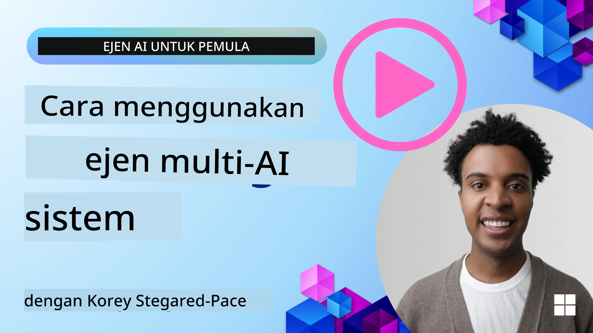
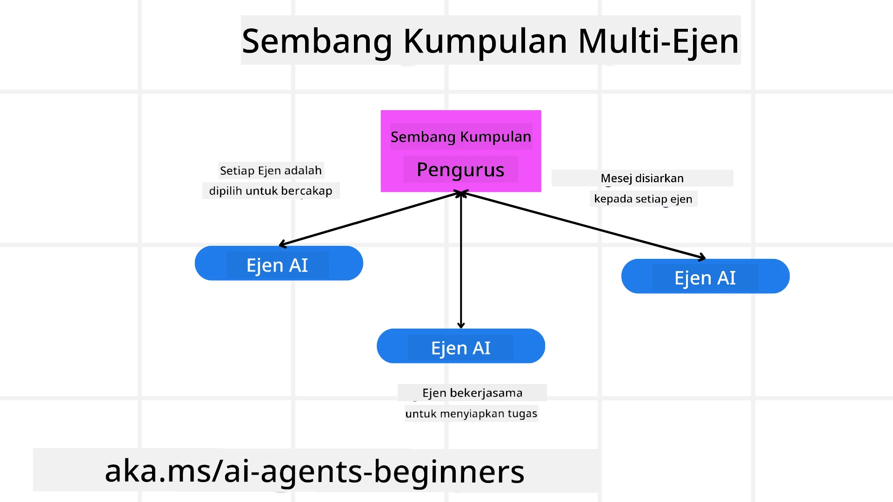
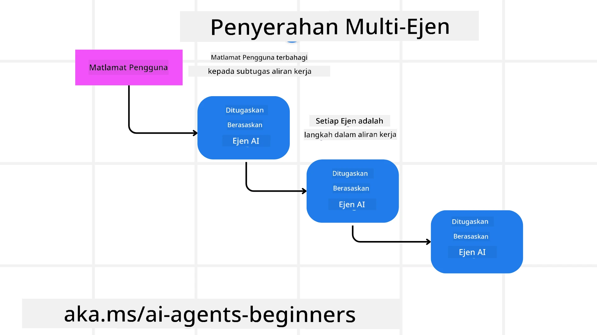
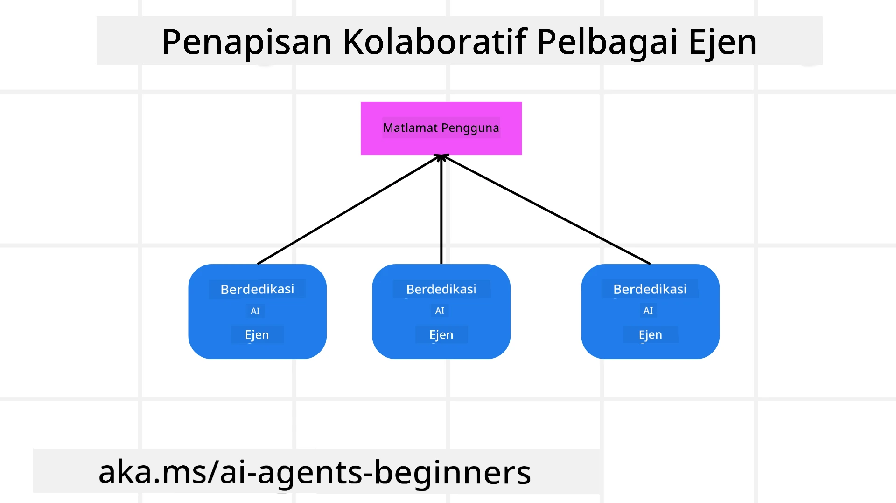

> _(Klik imej di atas untuk menonton video bagi pelajaran ini)_

# Corak reka bentuk pelbagai ejen

Sebaik sahaja anda mula bekerja pada projek yang melibatkan pelbagai ejen, anda perlu mempertimbangkan corak reka bentuk pelbagai ejen. Walau bagaimanapun, mungkin tidak serta-merta jelas bila untuk beralih kepada pelbagai ejen dan apakah kelebihannya.

## Pengenalan

Dalam pelajaran ini, kita ingin menjawab soalan-soalan berikut:

- Apakah senario di mana pelbagai ejen boleh digunakan?
- Apakah kelebihan menggunakan pelbagai ejen berbanding hanya satu ejen tunggal yang melakukan pelbagai tugas?
- Apakah blok binaan untuk melaksanakan corak reka bentuk pelbagai ejen?
- Bagaimana kita mendapat keterlihatan terhadap bagaimana pelbagai ejen berinteraksi antara satu sama lain?

## Matlamat Pembelajaran

Selepas pelajaran ini, anda sepatutnya dapat:

- Mengenal pasti senario di mana pelbagai ejen boleh digunakan
- Mengenali kelebihan menggunakan pelbagai ejen berbanding ejen tunggal.
- Memahami blok binaan untuk melaksanakan corak reka bentuk pelbagai ejen.

Apakah gambaran yang lebih besar?

*Pelbagai ejen adalah corak reka bentuk yang membenarkan berbilang ejen bekerjasama untuk mencapai matlamat bersama*.

Corak ini digunakan secara meluas dalam pelbagai bidang, termasuk robotik, sistem autonomi, dan pengkomputeran teragih.

## Senario Di Mana Pelbagai Ejen Sesuai Digunakan

Jadi apakah senario yang merupakan kes penggunaan yang baik untuk menggunakan pelbagai ejen? Jawapannya ialah terdapat banyak senario di mana menggunakan berbilang ejen adalah bermanfaat terutamanya dalam kes-kes berikut:

- **Beban kerja besar**: Beban kerja besar boleh dibahagikan kepada tugas yang lebih kecil dan diberikan kepada ejen yang berbeza, membolehkan pemprosesan selari dan penyelesaian yang lebih pantas. Contoh bagi ini ialah dalam kes tugas pemprosesan data yang besar.
- **Tugas kompleks**: Tugas kompleks, seperti beban kerja besar, boleh dipecahkan kepada subtugas yang lebih kecil dan diberikan kepada ejen yang berbeza, masing-masing pakar dalam aspek tertentu tugas itu. Contoh yang baik bagi ini ialah dalam kes kenderaan autonomi di mana ejen yang berbeza mengurus navigasi, pengesanan halangan, dan komunikasi dengan kenderaan lain.
- **Kepakaran yang pelbagai**: Ejen yang berbeza boleh mempunyai kepakaran yang pelbagai, membolehkan mereka mengendalikan aspek yang berbeza bagi sesuatu tugas dengan lebih berkesan daripada satu ejen sahaja. Untuk kes ini, contoh yang baik ialah dalam penjagaan kesihatan di mana ejen boleh mengurus diagnostik, pelan rawatan, dan pemantauan pesakit.

## Kelebihan Menggunakan Pelbagai Ejen Berbanding Ejen Tunggal

Satu sistem ejen tunggal mungkin berfungsi dengan baik untuk tugas mudah, tetapi untuk tugas yang lebih kompleks, menggunakan berbilang ejen boleh memberikan beberapa kelebihan:

- **Pengkhususan**: Setiap ejen boleh dihususkan untuk tugas tertentu. Kekurangan pengkhususan dalam satu ejen bermakna anda mempunyai ejen yang boleh melakukan segala-galanya tetapi mungkin keliru tentang apa yang perlu dilakukan apabila menghadapi tugas kompleks. Ia mungkin contohnya berakhir melakukan tugas yang bukan kepakaran terbaiknya.
- **Kebolehsesuaian (Skalabiliti)**: Adalah lebih mudah untuk menskalakan sistem dengan menambah lebih banyak ejen daripada membebankan satu ejen tunggal.
- **Kebolehtahanan Ralat**: Jika satu ejen gagal, ejen lain boleh terus berfungsi, memastikan kebolehpercayaan sistem.

Mari kita ambil satu contoh, mari menempah perjalanan untuk seorang pengguna. Sistem ejen tunggal perlu mengendalikan semua aspek proses tempahan perjalanan, dari mencari penerbangan hingga menempah hotel dan kereta sewa. Untuk mencapai ini dengan satu ejen, ejen itu perlu mempunyai alat untuk mengendalikan semua tugas ini. Ini boleh menyebabkan sistem yang kompleks dan monolitik yang sukar diselenggara dan diskalakan. Sistem pelbagai ejen, sebaliknya, boleh mempunyai ejen yang berbeza yang dihususkan untuk mencari penerbangan, menempah hotel, dan kereta sewa. Ini akan menjadikan sistem lebih modular, lebih mudah diselenggara, dan mudah diskalakan.

Bandingkan ini dengan biro pelancongan yang dikendalikan sebagai perniagaan kecil milik keluarga berbanding biro pelancongan yang dikendalikan sebagai perniagaan francais. Kedai keluarga itu akan mempunyai satu ejen yang mengendalikan semua aspek proses tempahan perjalanan, manakala perniagaan francais itu akan mempunyai ejen yang berbeza mengendalikan aspek yang berbeza bagi proses tempahan perjalanan.

## Blok Binaan untuk Melaksanakan Corak Reka Bentuk Pelbagai Ejen

Sebelum anda boleh melaksanakan corak reka bentuk pelbagai ejen, anda perlu memahami blok binaan yang membentuk corak tersebut.

Mari kita jadikan ini lebih konkrit dengan sekali lagi melihat contoh menempah perjalanan untuk seorang pengguna. Dalam kes ini, blok binaan termasuk:

- **Komunikasi Ejen**: Ejen untuk mencari penerbangan, menempah hotel, dan kereta sewa perlu berkomunikasi dan berkongsi maklumat tentang keutamaan dan sekatan pengguna. Anda perlu memutuskan protokol dan kaedah untuk komunikasi ini. Apa maksudnya secara konkrit ialah ejen untuk mencari penerbangan perlu berkomunikasi dengan ejen untuk menempah hotel untuk memastikan hotel ditempah pada tarikh yang sama dengan penerbangan. Itu bermakna ejen perlu berkongsi maklumat tentang tarikh perjalanan pengguna, bermakna anda perlu memutuskan *ejen mana yang berkongsi maklumat dan bagaimana mereka berkongsi maklumat*.
- **Mekanisme Penyelarasan**: Ejen perlu menyelaraskan tindakan mereka untuk memastikan keutamaan dan sekatan pengguna dipenuhi. Keutamaan pengguna boleh jadi mereka mahukan hotel yang dekat dengan lapangan terbang manakala sekatan boleh jadi kereta sewa hanya tersedia di lapangan terbang. Ini bermakna ejen untuk menempah hotel perlu menyelaraskan dengan ejen untuk menempah kereta sewa untuk memastikan keutamaan dan sekatan pengguna dipenuhi. Ini bermakna anda perlu memutuskan *bagaimana ejen-ejen menyelaraskan tindakan mereka*.
- **Seni Bina Ejen**: Ejen perlu mempunyai struktur dalaman untuk membuat keputusan dan belajar daripada interaksi mereka dengan pengguna. Ini bermakna ejen untuk mencari penerbangan perlu mempunyai struktur dalaman untuk membuat keputusan tentang penerbangan mana yang hendak disyorkan kepada pengguna. Ini bermakna anda perlu memutuskan *bagaimana ejen membuat keputusan dan belajar daripada interaksi mereka dengan pengguna*. Contoh bagaimana ejen belajar dan memperbaiki boleh jadi ejen untuk mencari penerbangan boleh menggunakan model pembelajaran mesin untuk mencadangkan penerbangan kepada pengguna berdasarkan keutamaan lepas mereka.
- **Keterlihatan ke dalam Interaksi Pelbagai Ejen**: Anda perlu mempunyai keterlihatan tentang bagaimana pelbagai ejen berinteraksi antara satu sama lain. Ini bermakna anda perlu mempunyai alat dan teknik untuk menjejaki aktiviti dan interaksi ejen. Ini boleh wujud dalam bentuk alat log dan pemantauan, alat visualisasi, dan metrik prestasi.
- **Corak Pelbagai Ejen**: Terdapat corak yang berbeza untuk melaksanakan sistem pelbagai ejen, seperti seni bina berpusat, teragih, dan hibrid. Anda perlu memutuskan corak yang paling sesuai dengan kes penggunaan anda.
- **Manusia dalam gelung**: Dalam kebanyakan kes, anda akan mempunyai manusia dalam gelung dan anda perlu mengarahkan ejen bila untuk meminta campur tangan manusia. Ini boleh berbentuk pengguna meminta hotel atau penerbangan tertentu yang ejen tidak cadangkan atau meminta pengesahan sebelum menempah penerbangan atau hotel.

## Keterlihatan ke dalam Interaksi Pelbagai Ejen

Adalah penting bahawa anda mempunyai keterlihatan tentang bagaimana pelbagai ejen berinteraksi antara satu sama lain. Keterlihatan ini penting untuk menyahpepijat, mengoptimumkan, dan memastikan keberkesanan keseluruhan sistem. Untuk mencapai ini, anda perlu mempunyai alat dan teknik untuk menjejaki aktiviti dan interaksi ejen. Ini boleh wujud dalam bentuk alat log dan pemantauan, alat visualisasi, dan metrik prestasi.

Contohnya, dalam kes menempah perjalanan untuk seorang pengguna, anda boleh mempunyai papan pemuka yang menunjukkan status setiap ejen, keutamaan dan sekatan pengguna, dan interaksi antara ejen. Papan pemuka ini boleh menunjukkan tarikh perjalanan pengguna, penerbangan yang dicadangkan oleh ejen penerbangan, hotel yang dicadangkan oleh ejen hotel, dan kereta sewa yang dicadangkan oleh ejen kereta sewa. Ini memberi anda gambaran yang jelas tentang bagaimana ejen berinteraksi antara satu sama lain dan sama ada keutamaan dan sekatan pengguna dipenuhi.

Mari kita lihat setiap aspek ini dengan lebih terperinci.

- **Alat Log dan Pemantauan**: Anda ingin mempunyai log untuk setiap tindakan yang diambil oleh ejen. Satu entri log boleh menyimpan maklumat tentang ejen yang mengambil tindakan, tindakan yang diambil, masa tindakan diambil, dan hasil tindakan tersebut. Maklumat ini kemudian boleh digunakan untuk menyahpepijat, mengoptimumkan dan lain-lain.
- **Alat Visualisasi**: Alat visualisasi boleh membantu anda melihat interaksi antara ejen dengan cara yang lebih intuitif. Sebagai contoh, anda boleh mempunyai graf yang menunjukkan aliran maklumat antara ejen. Ini boleh membantu anda mengenal pasti kesesakan, ketidakcekapan, dan isu lain dalam sistem.
- **Metrik Prestasi**: Metrik prestasi boleh membantu anda menjejaki keberkesanan sistem pelbagai ejen. Sebagai contoh, anda boleh menjejaki masa yang diambil untuk menyelesaikan sesuatu tugas, bilangan tugas yang diselesaikan per unit masa, dan ketepatan cadangan yang dibuat oleh ejen. Maklumat ini boleh membantu anda mengenal pasti kawasan untuk penambahbaikan dan mengoptimumkan sistem.

## Corak Pelbagai Ejen

Mari selami beberapa corak konkrit yang boleh kita gunakan untuk mencipta aplikasi pelbagai ejen. Berikut adalah beberapa corak menarik yang patut dipertimbangkan:

### Sembang kumpulan

Corak ini berguna apabila anda ingin mencipta aplikasi sembang kumpulan di mana pelbagai ejen boleh berkomunikasi antara satu sama lain. Kes penggunaan tipikal untuk corak ini termasuk kerjasama pasukan, sokongan pelanggan, dan rangkaian sosial.

Dalam corak ini, setiap ejen mewakili seorang pengguna dalam sembang kumpulan, dan mesej ditukar antara ejen menggunakan protokol pemesejan. Ejen boleh menghantar mesej ke sembang kumpulan, menerima mesej dari sembang kumpulan, dan memberi respons kepada mesej dari ejen lain.

Corak ini boleh dilaksanakan menggunakan seni bina berpusat di mana semua mesej dihantar melalui pelayan pusat, atau seni bina teragih di mana mesej ditukar secara langsung.

### Serah tugas

Corak ini berguna apabila anda ingin mencipta aplikasi di mana pelbagai ejen boleh menyerahkan tugas antara satu sama lain.

Kes penggunaan tipikal untuk corak ini termasuk sokongan pelanggan, pengurusan tugas, dan automasi aliran kerja.

Dalam corak ini, setiap ejen mewakili satu tugas atau satu langkah dalam aliran kerja, dan ejen boleh menyerahkan tugas kepada ejen lain berdasarkan peraturan yang telah ditetapkan.

### Penapisan kolaboratif

Corak ini berguna apabila anda ingin mencipta aplikasi di mana pelbagai ejen boleh bekerjasama untuk membuat cadangan kepada pengguna.

Mengapa anda mahu berbilang ejen bekerjasama ialah kerana setiap ejen boleh mempunyai kepakaran yang berbeza dan boleh menyumbang kepada proses cadangan dengan cara yang berbeza.

Mari ambil contoh di mana seorang pengguna mahukan cadangan tentang saham terbaik untuk dibeli di pasaran saham.

- **Pakar industri**:. Satu ejen boleh menjadi pakar dalam industri tertentu.
- **Analisis teknikal**: Satu lagi ejen boleh menjadi pakar dalam analisis teknikal.
- **Analisis fundamental**: dan satu lagi ejen boleh menjadi pakar dalam analisis fundamental. Dengan bekerjasama, ejen-ejen ini boleh memberikan cadangan yang lebih menyeluruh kepada pengguna.

## Senario: Proses pemulangan wang

Pertimbangkan satu senario di mana pelanggan sedang cuba mendapatkan pemulangan wang untuk produk, terdapat beberapa ejen yang boleh terlibat dalam proses ini tetapi mari kita bahagikan antara ejen yang khusus untuk proses ini dan ejen umum yang boleh digunakan dalam proses lain.

**Ejen khusus untuk proses pemulangan wang**:

Berikut adalah beberapa ejen yang mungkin terlibat dalam proses pemulangan wang:

- **Ejen pelanggan**: Ejen ini mewakili pelanggan dan bertanggung jawab untuk memulakan proses pemulangan wang.
- **Ejen penjual**: Ejen ini mewakili penjual dan bertanggung jawab untuk memproses pemulangan wang.
- **Ejen pembayaran**: Ejen ini mewakili proses pembayaran dan bertanggung jawab untuk mengembalikan bayaran pelanggan.
- **Ejen penyelesaian**: Ejen ini mewakili proses penyelesaian dan bertanggung jawab untuk menyelesaikan sebarang isu yang timbul semasa proses pemulangan wang.
- **Ejen pematuhan**: Ejen ini mewakili proses pematuhan dan bertanggung jawab untuk memastikan proses pemulangan wang mematuhi peraturan dan polisi.

**Ejen umum**:

Ejen-ejen ini boleh digunakan oleh bahagian lain dalam perniagaan anda.

- **Ejen penghantaran**: Ejen ini mewakili proses penghantaran dan bertanggung jawab untuk menghantar produk kembali kepada penjual. Ejen ini boleh digunakan untuk kedua-dua proses pemulangan wang dan penghantaran umum produk melalui pembelian contohnya.
- **Ejen maklum balas**: Ejen ini mewakili proses maklum balas dan bertanggung jawab untuk mengumpulkan maklum balas daripada pelanggan. Maklum balas boleh diambil pada bila-bila masa dan bukan hanya semasa proses pemulangan wang.
- **Ejen peningkatan (escalation)**: Ejen ini mewakili proses peningkatan dan bertanggung jawab untuk meningkatkan isu kepada tahap sokongan yang lebih tinggi. Anda boleh menggunakan jenis ejen ini untuk sebarang proses di mana anda perlu meningkatkan isu.
- **Ejen pemberitahuan**: Ejen ini mewakili proses pemberitahuan dan bertanggung jawab untuk menghantar pemberitahuan kepada pelanggan pada pelbagai peringkat proses pemulangan wang.
- **Ejen analitik**: Ejen ini mewakili proses analitik dan bertanggung jawab untuk menganalisis data berkaitan proses pemulangan wang.
- **Ejen audit**: Ejen ini mewakili proses audit dan bertanggung jawab untuk mengaudit proses pemulangan wang untuk memastikan ia dijalankan dengan betul.
- **Ejen laporan**: Ejen ini mewakili proses pelaporan dan bertanggung jawab untuk menghasilkan laporan mengenai proses pemulangan wang.
- **Ejen pengetahuan**: Ejen ini mewakili proses pengetahuan dan bertanggung jawab untuk menyelenggara pangkalan pengetahuan maklumat berkaitan proses pemulangan wang. Ejen ini boleh mempunyai pengetahuan tentang pemulangan wang dan juga bahagian lain dalam perniagaan anda.
- **Ejen keselamatan**: Ejen ini mewakili proses keselamatan dan bertanggung jawab untuk memastikan keselamatan proses pemulangan wang.
- **Ejen kualiti**: Ejen ini mewakili proses kualiti dan bertanggung jawab untuk memastikan kualiti proses pemulangan wang.

Terdapat beberapa ejen disenaraikan sebelum ini baik untuk proses pemulangan wang khusus tetapi juga untuk ejen umum yang boleh digunakan dalam bahagian lain perniagaan anda. Diharapkan ini memberikan anda gambaran tentang bagaimana anda boleh membuat keputusan mengenai ejen mana yang hendak digunakan dalam sistem pelbagai ejen anda.

## Tugasan

Reka sebuah sistem pelbagai ejen untuk proses sokongan pelanggan. Kenal pasti ejen yang terlibat dalam proses, peranan dan tanggungjawab mereka, dan bagaimana mereka berinteraksi antara satu sama lain. Pertimbangkan kedua-dua ejen yang khusus untuk proses sokongan pelanggan dan ejen umum yang boleh digunakan dalam bahagian lain perniagaan anda.
> Fikirkan terlebih dahulu sebelum anda membaca penyelesaian berikut, anda mungkin memerlukan lebih ramai ejen daripada yang anda sangka.
> TIP: Fikirkan tentang peringkat berbeza dalam proses sokongan pelanggan dan juga pertimbangkan ejen yang diperlukan untuk mana-mana sistem.

## Solution

[Penyelesaian](./solution/solution.md)

## Knowledge checks

Question: Bila anda harus mempertimbangkan menggunakan berbilang ejen?

- [ ] A1: Apabila anda mempunyai beban kerja yang kecil dan tugas yang mudah.
- [ ] A2: Apabila anda mempunyai beban kerja yang besar
- [ ] A3: Apabila anda mempunyai tugas yang mudah.

[Kuiz Penyelesaian](./solution/solution-quiz.md)

## Summary

Dalam pelajaran ini, kami telah melihat corak reka bentuk berbilang ejen, termasuk senario di mana berbilang ejen sesuai digunakan, kelebihan menggunakan berbilang ejen berbanding ejen tunggal, blok pembinaan untuk melaksanakan corak reka bentuk berbilang ejen, dan cara untuk melihat bagaimana pelbagai ejen saling berinteraksi.

### Ada Lagi Soalan tentang Corak Reka Bentuk Berbilang Ejen?

Sertai the [Microsoft Foundry Discord](https://aka.ms/ai-agents/discord) untuk berjumpa dengan pelajar lain, menghadiri waktu pejabat dan mendapatkan jawapan kepada soalan anda mengenai Ejen AI.

## Additional resources

- <a href="https://learn.microsoft.com/azure/ai-services/agents/overview" target="_blank">Dokumentasi Rangka Kerja Ejen Microsoft</a>
- <a href="https://www.analyticsvidhya.com/blog/2024/10/agentic-design-patterns/" target="_blank">Corak reka bentuk agentik</a>

## Previous Lesson

[Perancangan Reka Bentuk](../07-planning-design/README.md)

## Next Lesson

[Metakognisi dalam Ejen AI](../09-metacognition/README.md)

---

<!-- CO-OP TRANSLATOR DISCLAIMER START -->
Penafian:
Dokumen ini telah diterjemahkan menggunakan perkhidmatan terjemahan AI Co-op Translator (https://github.com/Azure/co-op-translator). Walaupun kami berusaha mencapai ketepatan, sila ambil maklum bahawa terjemahan automatik mungkin mengandungi ralat atau ketidaktepatan. Dokumen asal dalam bahasa asalnya hendaklah dianggap sebagai sumber rujukan utama. Bagi maklumat penting, disyorkan mendapatkan terjemahan profesional oleh penterjemah manusia. Kami tidak bertanggungjawab atas sebarang salah faham atau salah tafsir yang timbul daripada penggunaan terjemahan ini.
<!-- CO-OP TRANSLATOR DISCLAIMER END -->