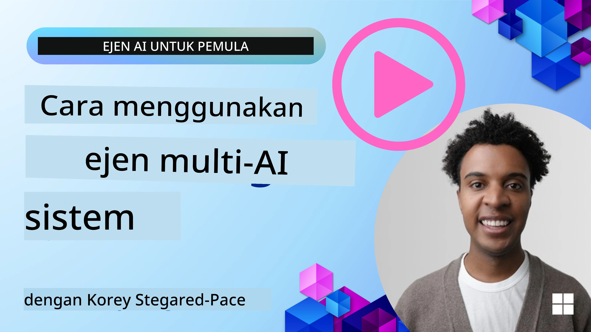
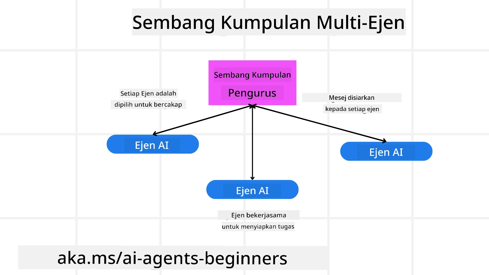
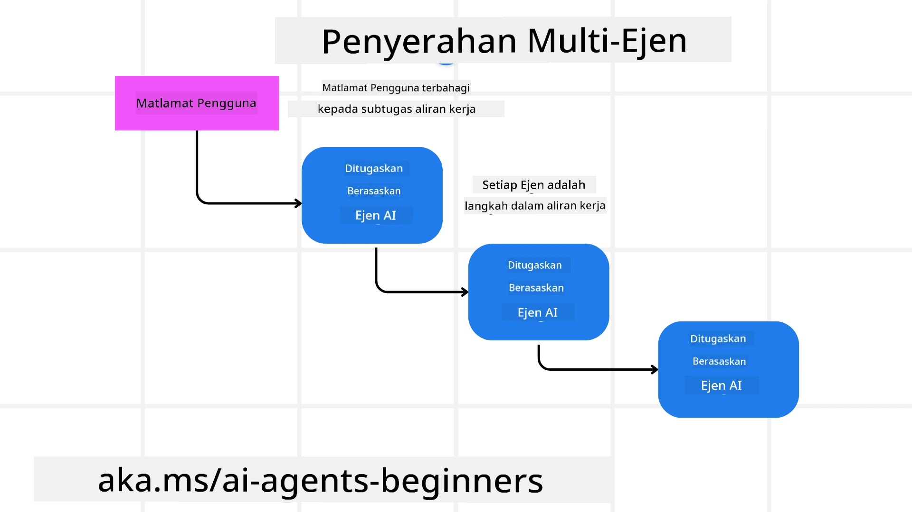
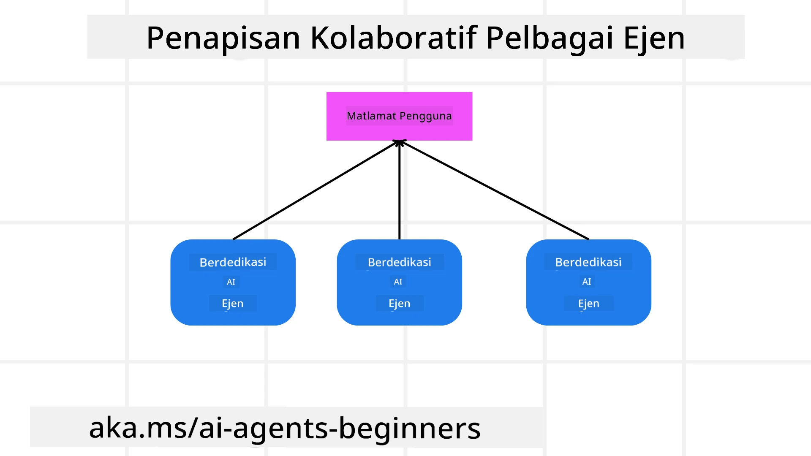

> _(Klik imej di atas untuk menonton video pelajaran ini)_

# Corak reka bentuk pelbagai ejen

Sebaik sahaja anda mula bekerja pada projek yang melibatkan pelbagai ejen, anda perlu mempertimbangkan corak reka bentuk pelbagai ejen. Walau bagaimanapun, mungkin tidak jelas serta-merta bila hendak beralih kepada pelbagai ejen dan apakah kelebihannya.

## Pengenalan

Dalam pelajaran ini, kami ingin menjawab soalan berikut:

- Apakah senario di mana pelbagai ejen boleh digunakan?
- Apakah kelebihan menggunakan pelbagai ejen berbanding hanya satu ejen yang melakukan pelbagai tugas?
- Apakah blok binaan untuk melaksanakan corak reka bentuk pelbagai ejen?
- Bagaimana kita dapat melihat bagaimana pelbagai ejen berinteraksi antara satu sama lain?

## Matlamat Pembelajaran

Selepas pelajaran ini, anda sepatutnya dapat:

- Mengenal pasti senario di mana pelbagai ejen boleh digunakan
- Mengenali kelebihan menggunakan pelbagai ejen berbanding ejen tunggal.
- Memahami blok binaan dalam melaksanakan corak reka bentuk pelbagai ejen.

Apa gambaran yang lebih besar?

*Pelbagai ejen adalah corak reka bentuk yang membolehkan pelbagai ejen bekerja sama untuk mencapai matlamat yang sama*.

Corak ini digunakan secara meluas dalam pelbagai bidang, termasuk robotik, sistem autonomi, dan pengkomputeran teragih.

## Senario Di Mana Pelbagai Ejen Boleh Digunakan

Jadi, apakah senario yang merupakan kes penggunaan yang baik untuk menggunakan pelbagai ejen? Jawapannya adalah banyak senario di mana penggunaan pelbagai ejen memberi manfaat terutama dalam kes berikut:

- **Beban kerja besar**: Beban kerja besar boleh dibahagikan kepada tugas yang lebih kecil dan diberikan kepada ejen yang berbeza, membolehkan pemprosesan selari dan penyiapan yang lebih pantas. Contohnya ialah dalam tugas pemprosesan data besar.
- **Tugas kompleks**: Tugas kompleks, seperti beban kerja besar, boleh dipecahkan kepada sub-tugas yang lebih kecil dan diberikan kepada ejen yang berbeza, masing-masing pakar dalam aspek tertentu tugas tersebut. Contoh baik ialah dalam kenderaan autonomi di mana ejen yang berbeza menguruskan navigasi, pengesanan halangan, dan komunikasi dengan kenderaan lain.
- **Kepakaran yang pelbagai**: Ejen yang berbeza boleh mempunyai kepakaran yang pelbagai, membolehkan mereka mengendalikan pelbagai aspek tugas dengan lebih berkesan daripada satu ejen tunggal. Dalam kes ini, contoh yang baik adalah dalam penjagaan kesihatan di mana ejen boleh menguruskan diagnostik, pelan rawatan, dan pemantauan pesakit.

## Kelebihan Menggunakan Pelbagai Ejen Berbanding Ejen Tunggal

Sistem ejen tunggal mungkin berfungsi dengan baik untuk tugas mudah, tetapi untuk tugas yang lebih kompleks, menggunakan pelbagai ejen boleh memberikan beberapa kelebihan:

- **Pengkhususan**: Setiap ejen boleh dipertingkatkan bagi tugas tertentu. Kekurangan pengkhususan dalam satu ejen bermakna anda mempunyai ejen yang boleh melakukan semuanya tetapi mungkin keliru apa yang perlu dilakukan apabila menghadapi tugas yang kompleks. Sebagai contoh, ia mungkin akhirnya melakukan tugas yang kurang sesuai untuknya.
- **Skalabiliti**: Lebih mudah untuk skala sistem dengan menambah lebih banyak ejen berbanding membebankan sebuah ejen tunggal.
- **Toleransi Ralat**: Jika satu ejen gagal, yang lain boleh terus berfungsi, memastikan kebolehpercayaan sistem.

Mari kita ambil contoh, mari tempah perjalanan untuk seorang pengguna. Sistem ejen tunggal perlu mengendalikan semua aspek proses tempahan perjalanan, dari mencari penerbangan hingga menempah hotel dan kereta sewa. Untuk mencapainya dengan ejen tunggal, ejen tersebut perlu mempunyai alat untuk mengendalikan semua tugas ini. Ini boleh menyebabkan sistem yang kompleks dan monolitik yang sukar untuk diselenggara dan diskalakan. Sistem pelbagai ejen, sebaliknya, boleh mempunyai ejen yang berbeza khusus dalam mencari penerbangan, menempah hotel, dan kereta sewa. Ini akan menjadikan sistem lebih modular, mudah diselenggara, dan skalabel.

Bandingkan ini dengan biro perjalanan yang dijalankan seperti kedai kecil berbanding biro perjalanan yang dijalankan sebagai francais. Kedai kecil akan ada satu ejen yang mengendalikan semua aspek proses tempahan perjalanan, manakala francais akan mempunyai ejen yang berbeza mengendalikan aspek proses tempahan yang berbeza.

## Blok Binaan Melaksanakan Corak Reka Bentuk Pelbagai Ejen

Sebelum anda boleh melaksanakan corak reka bentuk pelbagai ejen, anda perlu memahami blok binaan yang membentuk corak tersebut.

Mari kita buat ini lebih konkrit dengan melihat semula contoh tempah perjalanan untuk pengguna. Dalam kes ini, blok binaan termasuk:

- **Komunikasi Ejen**: Ejen untuk mencari penerbangan, menempah hotel, dan kereta sewa perlu berkomunikasi dan berkongsi maklumat mengenai keutamaan dan kekangan pengguna. Anda perlu memutuskan protokol dan kaedah untuk komunikasi ini. Apa yang dimaksudkan secara konkrit ialah ejen mencari penerbangan perlu berkomunikasi dengan ejen menempah hotel untuk memastikan hotel ditempah pada tarikh yang sama dengan penerbangan. Ini bermakna ejen perlu berkongsi maklumat tentang tarikh perjalanan pengguna, bermakna anda perlu memutuskan *ejen mana yang berkongsi maklumat dan bagaimana mereka berkongsi maklumat*.
- **Mekanisme Penyelarasaan**: Ejen perlu menyelaraskan tindakan mereka untuk memastikan keutamaan dan kekangan pengguna dipenuhi. Keutamaan pengguna mungkin mereka mahu hotel dekat dengan lapangan terbang manakala kekangan mungkin kereta sewa hanya tersedia di lapangan terbang. Ini bermakna ejen menempah hotel perlu menyelaraskan dengan ejen menempah kereta sewa untuk memastikan keutamaan dan kekangan pengguna dipenuhi. Ini bermakna anda perlu memutuskan *bagaimana ejen menyelaraskan tindakan mereka*.
- **Seni Bina Ejen**: Ejen perlu mempunyai struktur dalaman untuk membuat keputusan dan belajar dari interaksi dengan pengguna. Ini bermakna ejen mencari penerbangan perlu mempunyai struktur dalaman untuk membuat keputusan tentang penerbangan mana yang hendak disyorkan kepada pengguna. Ini bermakna anda perlu memutuskan *bagaimana ejen membuat keputusan dan belajar dari interaksi mereka dengan pengguna*. Contoh bagaimana ejen belajar dan memperbaiki mungkin ejen mencari penerbangan menggunakan model pembelajaran mesin untuk mencadangkan penerbangan berdasarkan keutamaan lalu pengguna.
- **Keterlihatan Interaksi Berbilang Ejen**: Anda perlu mempunyai keterlihatan bagaimana pelbagai ejen berinteraksi antara satu sama lain. Ini bermakna anda perlu mempunyai alat dan teknik untuk menjejak aktiviti dan interaksi ejen. Ini boleh dalam bentuk alat log dan pemantauan, alat visualisasi, dan metrik prestasi.
- **Corak Berbilang Ejen**: Terdapat corak yang berbeza untuk melaksanakan sistem pelbagai ejen, seperti seni bina terpusat, teragih, dan hibrid. Anda perlu memutuskan corak yang paling sesuai dengan kes penggunaan anda.
- **Manusia dalam gelung**: Dalam kebanyakan kes, anda akan mempunyai manusia dalam gelung dan anda perlu mengarahkan ejen bila untuk meminta campur tangan manusia. Ini boleh dalam bentuk pengguna meminta hotel atau penerbangan tertentu yang ejen tidak cadangkan atau meminta pengesahan sebelum menempah penerbangan atau hotel.

## Keterlihatan Interaksi Berbilang Ejen

Penting untuk anda mempunyai keterlihatan bagaimana pelbagai ejen berinteraksi antara satu sama lain. Keterlihatan ini penting untuk menyahpepijat, mengoptimum, dan memastikan keberkesanan keseluruhan sistem. Untuk mencapai ini, anda perlu mempunyai alat dan teknik untuk menjejak aktiviti dan interaksi ejen. Ini boleh dalam bentuk alat log dan pemantauan, alat visualisasi, dan metrik prestasi.

Contohnya, dalam kes tempah perjalanan untuk pengguna, anda boleh mempunyai papan pemuka yang menunjukkan status setiap ejen, keutamaan dan kekangan pengguna, dan interaksi antara ejen. Papan pemuka ini boleh menunjukkan tarikh perjalanan pengguna, penerbangan yang dicadangkan oleh ejen penerbangan, hotel yang dicadangkan oleh ejen hotel, dan kereta sewa yang dicadangkan oleh ejen kereta sewa. Ini akan memberi anda gambaran jelas bagaimana ejen berinteraksi antara satu sama lain dan sama ada keutamaan dan kekangan pengguna dipenuhi.

Mari kita lihat setiap aspek ini dengan lebih terperinci.

- **Alat Log dan Pemantauan**: Anda mahu log diambil untuk setiap tindakan yang dilakukan oleh ejen. Entri log boleh menyimpan maklumat tentang ejen yang melakukan tindakan, tindakan yang diambil, masa tindakan dilakukan, dan hasil tindakan. Maklumat ini boleh digunakan untuk menyahpepijat, mengoptimum, dan lain-lain.

- **Alat Visualisasi**: Alat visualisasi boleh membantu anda melihat interaksi antara ejen dengan cara yang lebih intuitif. Contohnya, anda boleh mempunyai graf yang menunjukkan aliran maklumat antara ejen. Ini boleh membantu mengenal pasti kesesakan, ketidakcekapan, dan isu lain dalam sistem.

- **Metrik Prestasi**: Metrik prestasi boleh membantu anda mengesan keberkesanan sistem pelbagai ejen. Contohnya, anda boleh mengesan masa yang diambil untuk menyiapkan tugas, bilangan tugas yang diselesaikan per unit masa, dan ketepatan cadangan yang dibuat oleh ejen. Maklumat ini boleh membantu anda mengenal pasti kawasan untuk peningkatan dan mengoptimum sistem.

## Corak Pelbagai Ejen

Mari kita selami beberapa corak konkrit yang boleh digunakan untuk membuat aplikasi pelbagai ejen. Berikut adalah beberapa corak menarik yang patut dipertimbangkan:

### Sembang kumpulan

Corak ini berguna apabila anda mahu mencipta aplikasi sembang kumpulan di mana pelbagai ejen boleh berkomunikasi antara satu sama lain. Kes penggunaan tipikal untuk corak ini termasuk kerjasama pasukan, sokongan pelanggan, dan rangkaian sosial.

Dalam corak ini, setiap ejen mewakili seorang pengguna dalam sembang kumpulan, dan mesej ditukar antara ejen menggunakan protokol pesanan. Ejen boleh menghantar mesej ke sembang kumpulan, menerima mesej dari sembang kumpulan, dan membalas mesej dari ejen lain.

Corak ini boleh dilaksanakan menggunakan seni bina terpusat di mana semua mesej dihantar melalui pelayan pusat, atau seni bina teragih di mana mesej ditukar secara langsung.

### Serah tugasan

Corak ini berguna apabila anda mahu mencipta aplikasi di mana pelbagai ejen boleh menyerahkan tugasan antara satu sama lain.

Kes penggunaan tipikal untuk corak ini termasuk sokongan pelanggan, pengurusan tugasan, dan automasi aliran kerja.

Dalam corak ini, setiap ejen mewakili tugasan atau langkah dalam aliran kerja, dan ejen boleh menyerahkan tugasan kepada ejen lain berdasarkan peraturan yang telah ditetapkan.

### Penapisan kolaboratif

Corak ini berguna apabila anda mahu mencipta aplikasi di mana pelbagai ejen boleh bekerjasama membuat cadangan kepada pengguna.

Mengapa anda mahu pelbagai ejen bekerjasama adalah kerana setiap ejen boleh mempunyai kepakaran berbeza dan boleh menyumbang kepada proses cadangan dengan cara yang berbeza.

Mari kita ambil contoh di mana seorang pengguna mahu cadangan mengenai stok terbaik untuk dibeli di pasaran saham.

- **Pakar industri**:. Satu ejen boleh menjadi pakar dalam industri tertentu.
- **Analisis teknikal**: Ejen lain boleh menjadi pakar dalam analisis teknikal.
- **Analisis fundamental**: dan satu lagi ejen boleh menjadi pakar dalam analisis fundamental. Dengan bekerjasama, ejen ini boleh memberikan cadangan yang lebih menyeluruh kepada pengguna.

## Senario: Proses bayaran balik

Pertimbangkan senario di mana pelanggan cuba mendapatkan bayaran balik untuk produk, boleh jadi terdapat banyak ejen yang terlibat dalam proses ini tetapi mari kita bahagikan antara ejen khusus untuk proses ini dan ejen umum yang boleh digunakan dalam proses lain.

**Ejen khusus untuk proses bayaran balik**:

Berikut adalah beberapa ejen yang mungkin terlibat dalam proses bayaran balik:

- **Ejen pelanggan**: Ejen ini mewakili pelanggan dan bertanggungjawab untuk memulakan proses bayaran balik.
- **Ejen penjual**: Ejen ini mewakili penjual dan bertanggungjawab memproses bayaran balik.
- **Ejen pembayaran**: Ejen ini mewakili proses pembayaran dan bertanggungjawab memulangkan bayaran pelanggan.
- **Ejen penyelesaian**: Ejen ini mewakili proses penyelesaian dan bertanggungjawab menyelesaikan sebarang isu yang timbul semasa proses bayaran balik.
- **Ejen pematuhan**: Ejen ini mewakili proses pematuhan dan bertanggungjawab memastikan proses bayaran balik mematuhi peraturan dan dasar.

**Ejen umum**:

Ejen ini boleh digunakan oleh bahagian lain dalam perniagaan anda.

- **Ejen penghantaran**: Ejen ini mewakili proses penghantaran dan bertanggungjawab untuk menghantar produk kembali kepada penjual. Ejen ini boleh digunakan untuk proses bayaran balik dan juga untuk penghantaran umum produk melalui pembelian contohnya.
- **Ejen maklum balas**: Ejen ini mewakili proses maklum balas dan bertanggungjawab mengumpul maklum balas dari pelanggan. Maklum balas boleh diberikan pada bila-bila masa dan bukan hanya semasa proses bayaran balik.
- **Ejen eskalasi**: Ejen ini mewakili proses eskalasi dan bertanggungjawab untuk meningkatkan isu ke tahap sokongan yang lebih tinggi. Anda boleh menggunakan jenis ejen ini untuk proses apa sahaja yang memerlukan eskalasi isu.
- **Ejen notifikasi**: Ejen ini mewakili proses notifikasi dan bertanggungjawab menghantar notifikasi kepada pelanggan pada pelbagai peringkat proses bayaran balik.
- **Ejen analitik**: Ejen ini mewakili proses analitik dan bertanggungjawab menganalisis data berkaitan proses bayaran balik.
- **Ejen audit**: Ejen ini mewakili proses audit dan bertanggungjawab mengaudit proses bayaran balik untuk memastikan ia dilaksanakan dengan betul.
- **Ejen laporan**: Ejen ini mewakili proses pelaporan dan bertanggungjawab menghasilkan laporan mengenai proses bayaran balik.
- **Ejen pengetahuan**: Ejen ini mewakili proses pengetahuan dan bertanggungjawab menyelenggara pangkalan pengetahuan maklumat berkaitan proses bayaran balik. Ejen ini boleh mempunyai pengetahuan tentang bayaran balik dan juga bahagian lain perniagaan anda.
- **Ejen keselamatan**: Ejen ini mewakili proses keselamatan dan bertanggungjawab memastikan keselamatan proses bayaran balik.
- **Ejen kualiti**: Ejen ini mewakili proses kualiti dan bertanggungjawab memastikan kualiti proses bayaran balik.

Terdapat banyak ejen yang disenaraikan sebelum ini baik untuk proses bayaran balik khusus tetapi juga untuk ejen umum yang boleh digunakan dalam bahagian lain perniagaan anda. Harapnya ini memberi anda idea bagaimana anda boleh memutuskan ejen mana untuk digunakan dalam sistem pelbagai ejen anda.

## Tugasan

Reka bentuk sistem pelbagai ejen untuk proses sokongan pelanggan. Kenal pasti ejen yang terlibat dalam proses, peranan dan tanggungjawab mereka, dan bagaimana mereka berinteraksi antara satu sama lain. Pertimbangkan kedua-dua ejen yang khusus untuk proses sokongan pelanggan dan ejen umum yang boleh digunakan dalam bahagian lain perniagaan anda.

> Fikirkan dahulu sebelum anda membaca penyelesaian berikut, anda mungkin memerlukan lebih ramai ejen daripada yang anda sangka.

> TIP: Fikirkan tentang pelbagai peringkat proses sokongan pelanggan dan juga pertimbangkan ejen yang diperlukan untuk mana-mana sistem.

## Penyelesaian

[Penyelesaian](./solution/solution.md)

## Pemeriksaan pengetahuan

### Soalan 1

Senario manakah yang paling sesuai untuk sistem multi-ejen?

- [ ] A1: Bot sokongan menjawab soalan lazim menggunakan satu pangkalan pengetahuan dan satu set alat kecil.
- [ ] A2: Aliran kerja bayaran balik memerlukan peranan penipuan, pembayaran, dan pematuhan yang berasingan, setiap satu mempunyai alatnya sendiri, dan keputusan mereka mesti diselaraskan.
- [ ] A3: Permintaan pengelasan mudah yang sama tiba beribu kali setiap jam.

### Soalan 2

Bila biasanya ejen tunggal adalah pilihan yang lebih baik?

- [ ] A1: Tugasan boleh diurus dengan satu set arahan dan alat, tanpa penyerahan pakar.
- [ ] A2: Ejen mempunyai akses kepada lebih dari satu alat.
- [ ] A3: Aliran kerja memerlukan peranan berasingan dengan kebenaran berbeza dan jejak audit yang bebas.

[Kuis penyelesaian](./solution/solution-quiz.md)

## Ringkasan

Dalam pelajaran ini, kami telah melihat corak reka bentuk multi-ejen, termasuk senario di mana multi-ejen boleh digunakan, kelebihan menggunakan multi-ejen berbanding ejen tunggal, blok pembinaan untuk melaksanakan corak reka bentuk multi-ejen, dan bagaimana untuk melihat bagaimana ejen berganda berinteraksi antara satu sama lain.

### Ada lebih banyak soalan tentang Corak Reka Bentuk Multi-Ejen?

Sertai [Microsoft Foundry Discord](https://discord.com/invite/ATgtXmAS5D) untuk bertemu dengan pelajar lain, menghadiri waktu pejabat dan dapatkan jawapan bagi soalan anda tentang Ejen AI.

## Sumber tambahan

- <a href="https://learn.microsoft.com/azure/ai-services/agents/overview" target="_blank">Dokumentasi Rangka Kerja Ejen Microsoft</a>
- <a href="https://www.analyticsvidhya.com/blog/2024/10/agentic-design-patterns/" target="_blank">Corak reka bentuk Agentic</a>

## Pelajaran Sebelumnya

[Reka Bentuk Perancangan](../07-planning-design/README.md)

## Pelajaran Seterusnya

[Metakognisi dalam Ejen AI](../09-metacognition/README.md)

---

<!-- CO-OP TRANSLATOR DISCLAIMER START -->
**Penafian**:
Dokumen ini telah diterjemahkan menggunakan perkhidmatan terjemahan AI [Co-op Translator](https://github.com/Azure/co-op-translator). Walaupun kami berusaha untuk ketepatan, sila ambil maklum bahawa terjemahan automatik mungkin mengandungi kesilapan atau ketidaktepatan. Dokumen asal dalam bahasa asalnya harus dianggap sebagai sumber yang sahih. Untuk maklumat penting, terjemahan oleh manusia profesional adalah disyorkan. Kami tidak bertanggungjawab terhadap sebarang salah faham atau salah tafsir yang timbul daripada penggunaan terjemahan ini.
<!-- CO-OP TRANSLATOR DISCLAIMER END -->