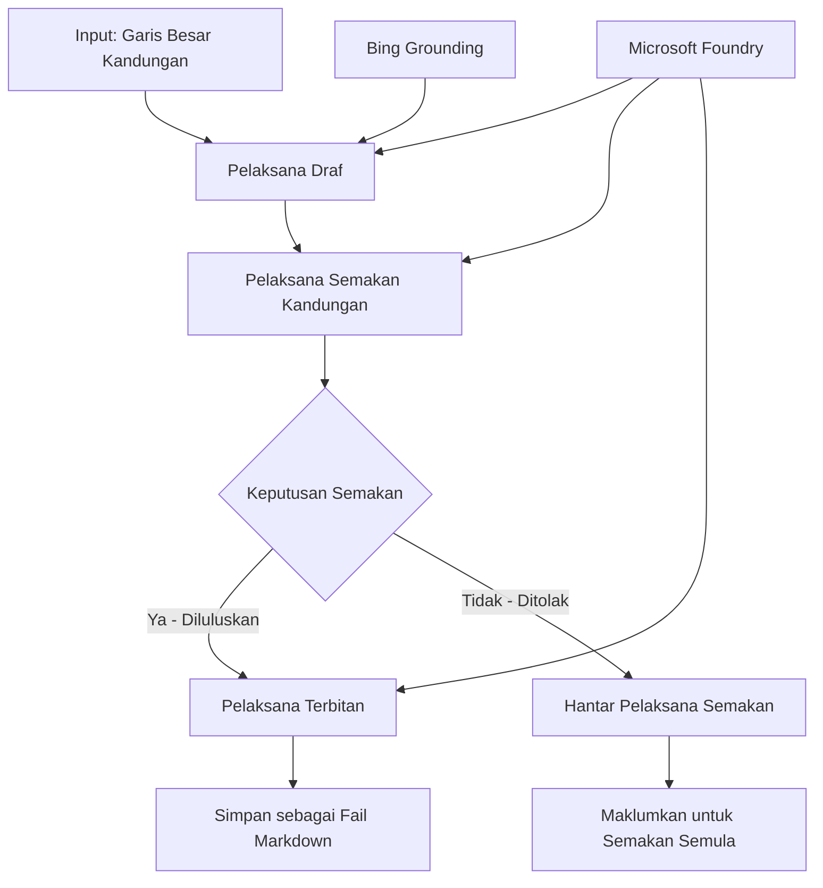

# 🔀 Aliran Kerja Ejen Bersyarat dengan Microsoft Foundry (.NET)

## 📋 Tutorial Aliran Kerja Berdasarkan Keputusan Pintar

Nota ini menunjukkan **corak aliran kerja bersyarat** menggunakan Microsoft Foundry dan Rangka Kerja Ejen Microsoft untuk .NET. Anda akan belajar cara membina aliran kerja canggih yang dipacu keputusan yang menghala proses secara pintar berdasarkan analisis AI, peraturan perniagaan dan keadaan dinamik untuk automasi kelas perusahaan.

## 🎯 Objektif Pembelajaran

### 🧠 **Senibina Keputusan Pintar**
- **Pelaksanaan Logik Bersyarat**: Membina pokok keputusan kompleks dengan pelbagai titik cabang
- **Penghalaan Berkuasa AI**: Gunakan model Microsoft Foundry untuk membuat keputusan penghalaan pintar
- **Penyesuaian Aliran Kerja Dinamik**: Mengubah tingkah laku aliran kerja berdasarkan analisis semasa dan syarat
- **Integrasi Peraturan Perusahaan**: Menggabungkan logik perniagaan dan keperluan pematuhan ke dalam aliran kerja

### 🔀 **Corak Bersyarat Lanjutan**
- **Pengambilan Keputusan Berbilang Kriteria**: Menilai pelbagai faktor untuk keputusan penghalaan
- **Pemprosesan Berkesedaran Konteks**: Membuat keputusan berdasarkan konteks dan sejarah aliran kerja yang terkumpul
- **Pengubahsuaian Aliran Kerja Adaptif**: Melaraskan laluan pemprosesan secara dinamik berdasarkan keadaan masa nyata
- **Integrasi Enjin Peraturan**: Melaksanakan enjin peraturan perniagaan canggih dalam aliran kerja

### 🏢 **Aplikasi Bersyarat Perusahaan**
- **Pengelasan & Penghalaan Dokumen**: Mengelaskan dan menghala dokumen secara automatik ke aliran kerja sesuai
- **Triase Khidmat Pelanggan**: Penghalaan pintar pertanyaan pelanggan ke pasukan khusus
- **Pematuhan & Pemprosesan Risiko**: Menggunakan proses pengesahan dan semakan berbeza berdasarkan penilaian risiko
- **Aliran Kerja Jaminan Kualiti**: Menghala kandungan melalui proses semakan sesuai berdasarkan metrik kualiti

## ⚙️ Prasyarat & Persediaan

### 📦 **Pakej NuGet Diperlukan**

Pakej lanjutan untuk pemprosesan aliran kerja bersyarat:

```xml
<!-- Core AI Framework -->
<PackageReference Include="Microsoft.Extensions.AI" Version="9.9.0" />

<!-- Azure AI Agents with Persistent State -->
<PackageReference Include="Azure.AI.Agents.Persistent" Version="1.2.0-beta.5" />

<!-- Azure Identity and Utilities -->
<PackageReference Include="Azure.Identity" Version="1.15.0" />
<PackageReference Include="System.Linq.Async" Version="6.0.3" />
<PackageReference Include="DotNetEnv" Version="3.1.1" />

<!-- Local Workflow Framework References -->
<!-- Microsoft.Agents.Workflows.dll - Advanced workflow orchestration -->
<!-- Microsoft.Agents.AI.AzureAI.dll - Microsoft Foundry integration -->
<!-- Microsoft.Agents.AI.dll - Core agent abstractions -->
```

### 🔑 **Konfigurasi Microsoft Foundry**

**Sumber Azure Diperlukan:**
- Ruang kerja Microsoft Foundry dengan model pemprosesan bersyarat
- Langganan Azure dengan kuota pengkomputeran dan kebenaran sesuai
- Model AI yang diterapkan untuk pembuatan keputusan dan analisis kandungan
- (Pilihan) Sambungan Bing Search API untuk kebolehan penentu

**Konfigurasi Persekitaran (fail .env):**
```env
# Microsoft Foundry Configuration
AZURE_AI_PROJECT_ENDPOINT=https://your-project.cognitiveservices.azure.com/
BING_CONNECTION_ID=your-bing-connection-id
```

**Persediaan Pengesahan:**
```csharp
// Azure CLI or Managed Identity authentication
using Azure.Identity;
var credential = new AzureCliCredential();

// Load environment configuration
DotNetEnv.Env.Load("../../../.env");
```

### 🏗️ **Senibina Aliran Kerja Bersyarat**



**Komponen Utama:**
- **Pelaksana Draf**: Ejen AI yang mencipta draf kandungan awal dari rangka kasar
- **Pelaksana Semakan Kandungan**: Ejen AI yang menilai kualiti dan pematuhan draf
- **Penghalaan Bersyarat**: Logik keputusan yang menghala berdasarkan hasil semakan
- **Laluan Terbit/Semak**: Laluan pemprosesan berasingan untuk kandungan diluluskan vs ditolak
- **Pengurusan Status**: Mengekalkan konteks kandungan dan semakan sepanjang aliran kerja

## 🎨 **Corak Reka Bentuk Aliran Kerja Bersyarat**

### 📋 **Penghasilan Kandungan dengan Pintu Kualiti**
```
Outline → Draft Creation → Quality Review → {Approve: Publish | Reject: Revise}
```

### 🎯 **Pemprosesan Dokumen Berasaskan Risiko**
```
Document → Risk Assessment → {Low: Standard | High: Enhanced Review}
```

### 🔍 **Penghalaan Khidmat Pelanggan Pintar**
```
Customer Query → Analysis → {Simple: FAQ Bot | Complex: Human Agent}
```

### 💼 **Aliran Kerja Berpandukan Pematuhan**
```
Content → Compliance Check → {Pass: Publish | Fail: Legal Review}
```

## 🏢 **Manfaat Perusahaan Bersyarat**

### 🎯 **Automasi Pintar**
- **Pembuatan Keputusan Pintar**: Keputusan penghalaan berkuasa AI berdasarkan analisis kandungan dan konteks
- **Pemprosesan Adaptif**: Aliran kerja yang menyesuaikan secara automatik berdasarkan keadaan berubah
- **Penguatkuasaan Peraturan Perniagaan**: Penerapan automatik logik perniagaan dan polisi kompleks
- **Penghalaan Berdasarkan Konteks**: Keputusan berdasarkan sejarah lengkap aliran kerja dan konteks terkumpul

### 📈 **Kecemerlangan Operasi**
- **Pengagihan Sumber Dioptimumkan**: Menghala tugas ke pakar dan proses paling sesuai
- **Pengurangan Campur Tangan Manual**: Keputusan automatik mengurangkan keperluan penghalaan manusia
- **Masa Penyelesaian Lebih Pantas**: Penghalaan terus ke kepakaran dan keupayaan pemprosesan sesuai
- **Penerapan Konsisten**: Penerapan seragam peraturan perniagaan dan kriteria keputusan

### 🛡️ **Pengurusan Risiko & Pematuhan**
- **Penilaian Risiko Automatik**: Penilaian berkuasa AI terhadap tahap risiko kandungan dan situasi
- **Penguatkuasaan Pematuhan**: Penghalaan automatik melalui proses peraturan yang perlu
- **Penerapan Protokol Keselamatan**: Langkah keselamatan dipertingkatkan berdasarkan penilaian risiko
- **Pengekalan Jejak Audit**: Dokumentasi lengkap keputusan penghalaan dan alasan

### 📊 **Analitik & Penambahbaikan Berterusan**
- **Analitik Keputusan**: Jejaki keberkesanan dan ketepatan keputusan penghalaan
- **Pengenalan Corak**: Kenal pasti trend dan corak dalam keputusan penghalaan dari masa ke masa
- **Pengoptimuman Prestasi**: Penambahbaikan berterusan kriteria keputusan dan kecekapan penghalaan
- **Perisikan Perniagaan**: Wawasan tentang ciri kandungan dan keperluan pemprosesan

### 🔧 **Kecemerlangan Teknikal**
- **Pengurusan Status Berterusan**: Mengekalkan status kompleks sepanjang pelaksanaan aliran kerja
- **Senibina Boleh Skala**: Mengendalikan keperluan pemprosesan bersyarat berjumlah tinggi
- **Keupayaan Integrasi**: Integrasi lancar dengan sistem dan proses perniagaan sedia ada
- **Pemantauan & Pengamatan**: Penjejakan komprehensif prestasi aliran kerja dan keputusan

Mari membina aliran kerja perusahaan pintar yang dipacu keputusan dengan .NET! 🚀

## 💻 Menjalankan Kod

Pelaksanaan lengkap tersedia dalam `04.dotnet-agent-framework-workflow-aifoundry-condition.cs`. Ini menunjukkan **aliran kerja penghasilan kandungan dengan pintu kualiti**:

### 🏗️ **Senibina Aliran Kerja**

```
Content Outline → Draft Creation → Quality Review → Conditional Routing:
                                                      ├─ Approved (>200 words) → Publish
                                                      └─ Rejected (<200 words) → Review Notification
```

**Ejen Dalam Aliran Kerja:**
1. **Ejen Evangelist**: Mencipta draf tutorial dari rangka kasar dengan penentu Bing
2. **Ejen Penyemak Kandungan**: Menilai kualiti draf (jumlah perkataan, kelengkapan)
3. **Ejen Penerbit**: Menyimpan kandungan diluluskan sebagai fail Markdown bertarikh masa

**Pelaksana Tersuai:**
1. **DraftExecutor**: Menyelaraskan penciptaan draf
2. **ContentReviewExecutor**: Melakukan penilaian kualiti
3. **PublishExecutor**: Mengendalikan penerbitan kandungan diluluskan
4. **SendReviewExecutor**: Mengurus pemberitahuan kandungan ditolak

### 🚀 Menjalankan Contoh

**Prasyarat:**
- Ruang kerja Microsoft Foundry dikonfigurasi
- Pengesahan Azure CLI (`az login`)
- (Pilihan) Sambungan Bing Search untuk penentu

```bash
# Jadikan skrip boleh dilaksanakan (Unix/Linux/macOS)
chmod +x 04.dotnet-agent-framework-workflow-aifoundry-condition.cs

# Jalankan aliran kerja bersyarat
./04.dotnet-agent-framework-workflow-aifoundry-condition.cs
```

Atau di Windows:
```powershell
dotnet run 04.dotnet-agent-framework-workflow-aifoundry-condition.cs
```

### 📝 Output Dijangka

Aliran kerja akan:
1. **Cipta Ejen**: Memulakan tiga ejen Microsoft Foundry khusus
2. **Jana Draf**: Ejen Evangelist mencipta draf tutorial dari rangka kasar
3. **Semak Kandungan**: Penyemak Kandungan menilai kualiti draf
4. **Penghalaan Bersyarat**:
   - **Jika diluluskan (>200 perkataan)**: Pelaksana terbit menyimpan sebagai fail Markdown
   - **Jika ditolak (<200 perkataan)**: Hantar pemberitahuan semakan
5. **Papar Keputusan**: Tunjukkan hasil akhir aliran kerja

### 🔧 Pilihan Penyesuaian

**Ubah Kriteria Semakan:**
```csharp
const string ContentReviewerInstructions = @"
You are a content reviewer...
1. Check if content is more than 500 words (instead of 200)
2. Verify technical accuracy
3. Ensure proper formatting
...";
```

**Tambah Laluan Bersyarat Lebih:**
```csharp
var workflow = new WorkflowBuilder(draftExecutor)
    .AddEdge(draftExecutor, contentReviewerExecutor)
    .AddEdge(contentReviewerExecutor, publishExecutor, condition: GetCondition("Excellent"))
    .AddEdge(contentReviewerExecutor, editExecutor, condition: GetCondition("Good"))
    .AddEdge(contentReviewerExecutor, sendReviewerExecutor, condition: GetCondition("Poor"))
    .Build();
```

**Tukar Keperluan Kandungan:**
```csharp
string OUTLINE_Content = @"
# Your Custom Topic
## Section 1
https://your-reference-url
## Section 2
...
";
```

### 🎯 Aplikasi Dunia Sebenar

Corak aliran kerja bersyarat ini sesuai untuk:
- **Sistem Pengurusan Kandungan**: Aliran kerja editorial automatik dengan pintu kualiti
- **Pemprosesan Dokumen**: Menghala dokumen berdasarkan pengelasan dan pematuhan
- **Sokongan Pelanggan**: Penghalaan tiket pintar berdasarkan kerumitan dan keutamaan
- **Semakan Undang-Undang**: Menghala kontrak berdasarkan penilaian risiko dan nilai
- **Proses HR**: Menghala permohonan melalui aliran kerja saringan sesuai

### 🔍 Memahami Logik Bersyarat

**Fungsi Syarat:**
```csharp
public Func<object?, bool> GetCondition(string expectedResult) =>
    reviewResult => reviewResult is ReviewResult review && review.Result == expectedResult;
```

Fungsi ini mencipta predikat yang:
1. Memeriksa jika hasil ialah jenis `ReviewResult`
2. Membandingkan sifat `Result` dengan nilai dijangka
3. Mengembalikan benar/salah untuk menentukan penghalaan

**Tepi Aliran Kerja dengan Syarat:**
```csharp
.AddEdge(contentReviewerExecutor, publishExecutor, condition: GetCondition("Yes"))
.AddEdge(contentReviewerExecutor, sendReviewerExecutor, condition: GetCondition("No"))
```

### 📊 Ciri Lanjutan

**Pengesahan Skema JSON:**
Aliran kerja menggunakan skema JSON untuk memastikan respon berstruktur:

```csharp
// Define response structure
public class ReviewResult
{
    [JsonPropertyName("review_result")]
    public string Result { get; set; } = string.Empty;
    
    [JsonPropertyName("reason")]
    public string Reason { get; set; } = string.Empty;
    
    [JsonPropertyName("draft_content")]
    public string DraftContent { get; set; } = string.Empty;
}

// Apply to agent
ResponseFormat = ChatResponseFormat.ForJsonSchema(
    AIJsonUtilities.CreateJsonSchema(typeof(ReviewResult)), 
    "ReviewResult", 
    "Review Result From DraftContent"
)
```

**Integrasi Penentu Bing:**
Ejen Evangelist menggunakan penentu Bing untuk mengakses maklumat masa nyata:

```csharp
var bingGroundingConfig = new BingGroundingSearchConfiguration(bing_conn_id);
BingGroundingToolDefinition bingGroundingTool = new(
    new BingGroundingSearchToolParameters([bingGroundingConfig])
);
```

Ini memungkinkan ejen mengikuti URL dalam rangka kasar dan mengekstrak maklumat terkini.

### 🛡️ Pengendalian Ralat

Aliran kerja merangkumi pengendalian ralat kukuh untuk kandungan ditolak:
- Kegagalan semakan mencetuskan laluan alternatif
- Pemberitahuan memberi sebab penolakan yang jelas
- Kandungan disimpan untuk semakan semula

### 🔄 Memperluas Aliran Kerja

**Tambah Gelung Semakan Semula:**
Cipta gelung maklum balas yang secara automatik mendraf semula kandungan:

```csharp
.AddEdge(contentReviewerExecutor, publishExecutor, condition: GetCondition("Yes"))
.AddEdge(contentReviewerExecutor, draftExecutor, condition: GetCondition("No")) // Loop back
```

**Laksanakan Semakan Pelbagai Tahap:**
Tambah pelbagai peringkat semakan dengan kriteria berbeza:

```csharp
.AddEdge(draftExecutor, technicalReviewer)
.AddEdge(technicalReviewer, editorialReviewer, condition: GetCondition("TechPass"))
.AddEdge(editorialReviewer, publishExecutor, condition: GetCondition("EditPass"))
```

Corak aliran kerja bersyarat ini menyediakan asas untuk membina sistem automasi perusahaan pintar yang canggih! 🚀

---

<!-- CO-OP TRANSLATOR DISCLAIMER START -->
**Penafian**:
Dokumen ini telah diterjemahkan menggunakan perkhidmatan terjemahan AI [Co-op Translator](https://github.com/Azure/co-op-translator). Walaupun kami berusaha untuk ketepatan, sila ambil maklum bahawa terjemahan automatik mungkin mengandungi kesilapan atau ketidaktepatan. Dokumen asal dalam bahasa asalnya harus dianggap sebagai sumber yang sahih. Untuk maklumat penting, terjemahan oleh manusia profesional adalah disyorkan. Kami tidak bertanggungjawab terhadap sebarang salah faham atau salah tafsir yang timbul daripada penggunaan terjemahan ini.
<!-- CO-OP TRANSLATOR DISCLAIMER END -->