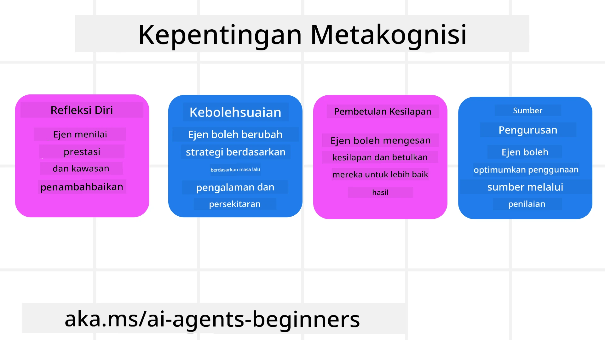
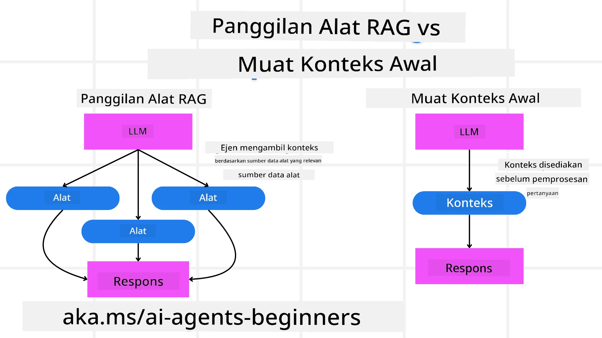

[](https://youtu.be/His9R6gw6Ec?si=3_RMb8VprNvdLRhX)

> _(Klik pada imej di atas untuk menonton video pelajaran ini)_
# Metakognisi dalam Ejen AI

## Pengenalan

Selamat datang ke pelajaran mengenai metakognisi dalam ejen AI! Bab ini direka untuk pemula yang ingin tahu bagaimana ejen AI dapat memikirkan proses pemikiran mereka sendiri. Pada akhir pelajaran ini, anda akan memahami konsep utama dan dilengkapi dengan contoh praktikal untuk menerapkan metakognisi dalam reka bentuk ejen AI.

## Matlamat Pembelajaran

Selepas melengkapkan pelajaran ini, anda akan dapat:

1. Memahami implikasi gelung penaakulan dalam definisi ejen.
2. Menggunakan teknik perancangan dan penilaian untuk membantu ejen yang membetulkan diri sendiri.
3. Mencipta ejen anda sendiri yang mampu mengubah kod untuk melaksanakan tugas.

## Pengenalan kepada Metakognisi

Metakognisi merujuk kepada proses kognitif bertahap tinggi yang melibatkan pemikiran tentang pemikiran sendiri. Bagi ejen AI, ini bermakna mampu menilai dan menyesuaikan tindakan mereka berdasarkan kesedaran diri dan pengalaman lalu. Metakognisi, atau "berfikir tentang berfikir," adalah konsep penting dalam pembangunan sistem AI ejenik. Ia melibatkan sistem AI yang sedar akan proses dalaman mereka sendiri dan mampu memantau, mengawal, dan menyesuaikan tingkah laku mereka dengan sewajarnya. Sama seperti kita apabila membaca situasi atau meneliti sesuatu masalah. Kesedaran diri ini dapat membantu sistem AI membuat keputusan yang lebih baik, mengenal pasti kesilapan, dan meningkatkan prestasi mereka dari masa ke masa—sekali lagi mengaitkan kembali kepada ujian Turing dan perdebatan sama ada AI akan mengambil alih.

Dalam konteks sistem AI ejenik, metakognisi dapat membantu menangani beberapa cabaran, seperti:
- Ketelusan: Memastikan sistem AI dapat menerangkan penalaran dan keputusan mereka.
- Penaakulan: Meningkatkan kemampuan sistem AI untuk mensintesis maklumat dan membuat keputusan yang tepat.
- Penyesuaian: Membenarkan sistem AI menyesuaikan diri dengan persekitaran baru dan keadaan yang berubah.
- Persepsi: Meningkatkan ketepatan sistem AI dalam mengenal pasti dan mentafsir data dari persekitaran mereka.

### Apakah Metakognisi?

Metakognisi, atau "berfikir tentang berfikir," adalah proses kognitif bertahap tinggi yang melibatkan kesedaran diri dan pengawalan diri terhadap proses kognitif seseorang. Dalam bidang AI, metakognisi memberi kuasa kepada ejen untuk menilai dan menyesuaikan strategi serta tindakan mereka, yang membawa kepada peningkatan kemampuan menyelesaikan masalah dan membuat keputusan. Dengan memahami metakognisi, anda boleh mereka bentuk ejen AI yang bukan sahaja lebih pintar tetapi juga lebih boleh menyesuaikan diri dan cekap. Dalam metakognisi sebenar, anda akan melihat AI secara eksplisit menalar tentang penalarannya sendiri.

Contoh: “Saya mengutamakan penerbangan yang lebih murah kerana... Saya mungkin terlepas penerbangan terus, jadi saya akan semak semula.”
Menjejak bagaimana atau mengapa ia memilih laluan tertentu.
- Memerhatikan bahawa ia melakukan kesilapan kerana terlalu bergantung pada keutamaan pengguna dari kali terakhir, jadi ia mengubah strategi membuat keputusan bukan hanya cadangan terakhir.
- Mendiagnosis corak seperti, “Setiap kali saya melihat pengguna menyebut ‘terlalu sesak,’ saya tidak hanya harus mengeluarkan atraksi tertentu tetapi juga memikirkan bahawa kaedah saya memilih ‘atraksi teratas’ adalah cacat jika saya sentiasa mengutamakan populariti.”

### Kepentingan Metakognisi dalam Ejen AI

Metakognisi memainkan peranan penting dalam reka bentuk ejen AI atas beberapa sebab:



- Refleksi Diri: Ejen boleh menilai prestasi mereka sendiri dan mengenal pasti kawasan yang perlu diperbaiki.
- Kebolehsuaian: Ejen boleh mengubah strategi mereka berdasarkan pengalaman lalu dan persekitaran yang berubah.
- Pembetulan Kesilapan: Ejen boleh mengesan dan membetulkan kesilapan secara autonomi, membawa kepada hasil yang lebih tepat.
- Pengurusan Sumber: Ejen boleh mengoptimumkan penggunaan sumber, seperti masa dan kuasa pengiraan, dengan merancang dan menilai tindakan mereka.

## Komponen Ejen AI

Sebelum menyelami proses metakognitif, adalah penting untuk memahami komponen asas ejen AI. Ejen AI biasanya terdiri daripada:

- Persona: Personaliti dan ciri-ciri ejen yang menentukan bagaimana ia berinteraksi dengan pengguna.
- Alat: Keupayaan dan fungsi yang boleh dilaksanakan oleh ejen.
- Kemahiran: Pengetahuan dan kepakaran yang dimiliki oleh ejen.

Komponen-komponen ini bekerjasama untuk menghasilkan "unit kepakaran" yang boleh melaksanakan tugas-tugas tertentu.

**Contoh**:
Pertimbangkan agen pelancongan, perkhidmatan agen yang bukan sahaja merancang percutian anda tetapi juga menyesuaikan jalannya berdasarkan data masa nyata dan pengalaman perjalanan pelanggan sebelum ini.

### Contoh: Metakognisi dalam Perkhidmatan Agen Pelancongan

Bayangkan anda mereka bentuk perkhidmatan agen pelancongan yang dikuasakan oleh AI. Ejen ini, "Travel Agent," membantu pengguna merancang percutian mereka. Untuk memasukkan metakognisi, Travel Agent perlu menilai dan menyesuaikan tindakan mereka berdasarkan kesedaran diri dan pengalaman lalu. Berikut adalah bagaimana metakognisi boleh memainkan peranan:

#### Tugas Semasa

Tugas semasa adalah untuk membantu pengguna merancang perjalanan ke Paris.

#### Langkah-Langkah Menyelesaikan Tugas

1. **Kumpulkan Keutamaan Pengguna**: Tanyakan pengguna mengenai tarikh perjalanan, bajet, minat (contohnya muzium, masakan, membeli-belah), dan keperluan khusus.
2. **Dapatkan Maklumat**: Cari pilihan penerbangan, penginapan, tarikan pelancong, dan restoran yang sesuai dengan keutamaan pengguna.
3. **Hasilkan Cadangan**: Berikan jadual perjalanan peribadi dengan butiran penerbangan, tempahan hotel, dan aktiviti yang disyorkan.
4. **Laraskan Berdasarkan Maklum Balas**: Minta maklum balas daripada pengguna tentang cadangan dan buat pelarasan yang diperlukan.

#### Sumber Diperlukan

- Akses kepada pangkalan data tempahan penerbangan dan hotel.
- Maklumat tentang tarikan dan restoran di Paris.
- Data maklum balas pengguna dari interaksi sebelumnya.

#### Pengalaman dan Refleksi Diri

Travel Agent menggunakan metakognisi untuk menilai prestasi dan belajar dari pengalaman lalu. Contohnya:

1. **Menganalisis Maklum Balas Pengguna**: Travel Agent mengkaji maklum balas pengguna untuk menentukan cadangan mana yang diterima baik dan yang tidak. Ia menyesuaikan cadangan masa depan mengikutinya.
2. **Kebolehsuaian**: Jika pengguna pernah menyebut tidak suka tempat yang sesak, Travel Agent akan mengelakkan mencadangkan tempat pelancong popular pada waktu puncak di masa hadapan.
3. **Pembetulan Kesilapan**: Jika Travel Agent membuat kesilapan dalam tempahan lalu, seperti mencadangkan hotel yang penuh tempahan, ia belajar untuk memeriksa ketersediaan dengan lebih teliti sebelum membuat cadangan.

#### Contoh Praktikal Pembangun

Berikut adalah contoh ringkas bagaimana kod Travel Agent mungkin kelihatan apabila memasukkan metakognisi:

```python
class Travel_Agent:
    def __init__(self):
        self.user_preferences = {}
        self.experience_data = []

    def gather_preferences(self, preferences):
        self.user_preferences = preferences

    def retrieve_information(self):
        # Cari penerbangan, hotel, dan tarikan berdasarkan keutamaan
        flights = search_flights(self.user_preferences)
        hotels = search_hotels(self.user_preferences)
        attractions = search_attractions(self.user_preferences)
        return flights, hotels, attractions

    def generate_recommendations(self):
        flights, hotels, attractions = self.retrieve_information()
        itinerary = create_itinerary(flights, hotels, attractions)
        return itinerary

    def adjust_based_on_feedback(self, feedback):
        self.experience_data.append(feedback)
        # Menganalisis maklum balas dan menyesuaikan cadangan masa depan
        self.user_preferences = adjust_preferences(self.user_preferences, feedback)

# Contoh penggunaan
travel_agent = Travel_Agent()
preferences = {
    "destination": "Paris",
    "dates": "2025-04-01 to 2025-04-10",
    "budget": "moderate",
    "interests": ["museums", "cuisine"]
}
travel_agent.gather_preferences(preferences)
itinerary = travel_agent.generate_recommendations()
print("Suggested Itinerary:", itinerary)
feedback = {"liked": ["Louvre Museum"], "disliked": ["Eiffel Tower (too crowded)"]}
travel_agent.adjust_based_on_feedback(feedback)
```

#### Mengapa Metakognisi Penting

- **Refleksi Diri**: Ejen boleh menganalisis prestasi mereka dan mengenal pasti bidang yang perlu diperbaiki.
- **Kebolehsuaian**: Ejen boleh mengubah strategi berdasarkan maklum balas dan keadaan yang berubah.
- **Pembetulan Kesilapan**: Ejen boleh mengesan dan membetulkan kesilapan secara autonomi.
- **Pengurusan Sumber**: Ejen boleh mengoptimumkan penggunaan sumber, seperti masa dan kuasa pengiraan.

Dengan memasukkan metakognisi, Travel Agent dapat memberikan cadangan perjalanan yang lebih peribadi dan tepat, meningkatkan pengalaman pengguna secara keseluruhan.

---

## 2. Perancangan dalam Ejen

Perancangan adalah komponen kritikal dalam tingkah laku ejen AI. Ia melibatkan merangka langkah-langkah yang diperlukan untuk mencapai matlamat, mengambil kira keadaan semasa, sumber, dan halangan yang mungkin.

### Elemen Perancangan

- **Tugas Semasa**: Nyatakan tugas dengan jelas.
- **Langkah-Langkah Menyelesaikan Tugas**: Bahagikan tugas kepada langkah-langkah yang mudah dikendalikan.
- **Sumber Diperlukan**: Kenal pasti sumber yang perlu.
- **Pengalaman**: Gunakan pengalaman lalu untuk membantu perancangan.

**Contoh**:
Berikut adalah langkah-langkah yang perlu diambil oleh Travel Agent untuk membantu pengguna merancang perjalanan mereka dengan berkesan:

### Langkah-Langkah untuk Travel Agent

1. **Kumpulkan Keutamaan Pengguna**
   - Tanyakan pengguna tentang tarikh perjalanan, bajet, minat, dan keperluan khusus.
   - Contoh: "Bila anda merancang untuk melancong?" "Berapa julat bajet anda?" "Aktiviti apa yang anda gemar semasa bercuti?"

2. **Dapatkan Maklumat**
   - Cari pilihan perjalanan yang relevan berdasarkan keutamaan pengguna.
   - **Penerbangan**: Cari penerbangan yang tersedia dalam bajet pengguna dan tarikh perjalanan pilihan.
   - **Penginapan**: Cari hotel atau sewaan yang sesuai dengan keutamaan pengguna dari segi lokasi, harga dan kemudahan.
   - **Tarikan dan Restoran**: Kenal pasti tarikan popular, aktiviti, dan pilihan makan yang sesuai dengan minat pengguna.

3. **Hasilkan Cadangan**
   - Kumpulkan maklumat yang diperoleh menjadi jadual perjalanan peribadi.
   - Sediakan butiran seperti pilihan penerbangan, tempahan hotel, dan aktiviti yang disyorkan, memastikan cadangan diubahsuai mengikut keutamaan pengguna.

4. **Bentangkan Jadual kepada Pengguna**
   - Kongsi jadual yang dicadangkan dengan pengguna untuk semakan mereka.
   - Contoh: "Ini adalah jadual cadangan untuk perjalanan anda ke Paris. Ia termasuk butiran penerbangan, tempahan hotel, dan senarai aktiviti serta restoran yang disyorkan. Beritahu saya pendapat anda!"

5. **Kumpul Maklum Balas**
   - Minta pengguna memberikan maklum balas tentang jadual yang dicadangkan.
   - Contoh: "Adakah anda suka pilihan penerbangan ini?" "Adakah hotel sesuai dengan keperluan anda?" "Adakah terdapat aktiviti yang anda ingin tambah atau keluarkan?"

6. **Laraskan Berdasarkan Maklum Balas**
   - Ubah jadual berdasarkan maklum balas pengguna.
   - Lakukan perubahan yang perlu pada cadangan penerbangan, penginapan, dan aktiviti agar lebih sesuai dengan keutamaan pengguna.

7. **Pengesahan Akhir**
   - Bentangkan jadual terkini kepada pengguna untuk pengesahan akhir.
   - Contoh: "Saya telah buat pelarasan berdasarkan maklum balas anda. Ini jadual yang dikemas kini. Adakah semuanya baik untuk anda?"

8. **Tempah dan Sahkan Tempahan**
   - Setelah pengguna meluluskan jadual, teruskan dengan tempahan penerbangan, penginapan, dan aktiviti yang dirancang.
   - Hantar maklumat pengesahan kepada pengguna.

9. **Berikan Sokongan Berterusan**
   - Kekal tersedia untuk membantu pengguna dengan sebarang perubahan atau permintaan tambahan sebelum dan semasa perjalanan mereka.
   - Contoh: "Jika anda memerlukan bantuan lanjut semasa perjalanan, hubungi saya bila-bila masa!"

### Contoh Interaksi

```python
class Travel_Agent:
    def __init__(self):
        self.user_preferences = {}
        self.experience_data = []

    def gather_preferences(self, preferences):
        self.user_preferences = preferences

    def retrieve_information(self):
        flights = search_flights(self.user_preferences)
        hotels = search_hotels(self.user_preferences)
        attractions = search_attractions(self.user_preferences)
        return flights, hotels, attractions

    def generate_recommendations(self):
        flights, hotels, attractions = self.retrieve_information()
        itinerary = create_itinerary(flights, hotels, attractions)
        return itinerary

    def adjust_based_on_feedback(self, feedback):
        self.experience_data.append(feedback)
        self.user_preferences = adjust_preferences(self.user_preferences, feedback)

# Contoh penggunaan dalam permintaan tempahan
travel_agent = Travel_Agent()
preferences = {
    "destination": "Paris",
    "dates": "2025-04-01 to 2025-04-10",
    "budget": "moderate",
    "interests": ["museums", "cuisine"]
}
travel_agent.gather_preferences(preferences)
itinerary = travel_agent.generate_recommendations()
print("Suggested Itinerary:", itinerary)
feedback = {"liked": ["Louvre Museum"], "disliked": ["Eiffel Tower (too crowded)"]}
travel_agent.adjust_based_on_feedback(feedback)
```

## 3. Sistem RAG Pembetulan

Pertama, mari kita fahami perbezaan antara Alat RAG dan Pemuatan Konteks Pra-Pencegahan



### Penjanaan Berpenambah Penemuan (RAG)

RAG menggabungkan sistem penemuan dengan model generatif. Apabila pertanyaan dibuat, sistem penemuan mengambil dokumen atau data yang berkaitan dari sumber luaran, dan maklumat yang diambil ini digunakan untuk menambah input kepada model generatif. Ini membantu model menghasilkan jawapan yang lebih tepat dan relevan mengikut konteks.

Dalam sistem RAG, ejen menemu duga maklumat berkaitan dari pangkalan data pengetahuan dan menggunakannya untuk menjana jawapan atau tindakan yang sesuai.

### Pendekatan RAG Pembetulan

Pendekatan RAG Pembetulan memfokuskan pada penggunaan teknik RAG untuk membetulkan kesilapan dan meningkatkan ketepatan ejen AI. Ini melibatkan:

1. **Teknik Prom**: Menggunakan petunjuk khusus untuk membimbing ejen dalam menemu duga maklumat yang berkaitan.
2. **Alat**: Melaksanakan algoritma dan mekanisme yang membenarkan ejen menilai kesesuaian maklumat yang ditemu duga dan menjana jawapan yang tepat.
3. **Penilaian**: Sentiasa menilai prestasi ejen dan membuat pelarasan untuk meningkatkan ketepatan dan kecekapan.

#### Contoh: RAG Pembetulan dalam Ejen Carian

Pertimbangkan ejen carian yang menemu duga maklumat dari web untuk menjawab pertanyaan pengguna. Pendekatan RAG Pembetulan mungkin melibatkan:

1. **Teknik Prom**: Merumuskan pertanyaan carian berdasarkan input pengguna.
2. **Alat**: Menggunakan pemprosesan bahasa semula jadi dan algoritma pembelajaran mesin untuk menilai dan menapis hasil carian.
3. **Penilaian**: Menganalisis maklum balas pengguna untuk mengenal pasti dan membetulkan ketidaktepatan dalam maklumat yang ditemu duga.

### RAG Pembetulan dalam Travel Agent

RAG Pembetulan (Penjanaan Berpenambah Penemuan) meningkatkan kebolehan AI untuk menemu duga dan menjana maklumat sambil membetulkan sebarang ketidaktepatan. Mari lihat bagaimana Travel Agent dapat menggunakan pendekatan RAG Pembetulan untuk memberikan cadangan perjalanan yang lebih tepat dan relevan.

Ini melibatkan:

- **Teknik Prom:** Menggunakan petunjuk khusus untuk membimbing ejen dalam menemu duga maklumat yang berkaitan.
- **Alat:** Melaksanakan algoritma dan mekanisme yang membenarkan ejen menilai kesesuaian maklumat yang ditemu duga dan menjana jawapan yang tepat.
- **Penilaian:** Sentiasa menilai prestasi ejen dan membuat pelarasan untuk meningkatkan ketepatan dan kecekapan.

#### Langkah-langkah Melaksanakan RAG Pembetulan dalam Travel Agent

1. **Interaksi Awal Pengguna**
   - Travel Agent mengumpul keutamaan awal dari pengguna, seperti destinasi, tarikh perjalanan, bajet, dan minat.
   - Contoh:

     ```python
     preferences = {
         "destination": "Paris",
         "dates": "2025-04-01 to 2025-04-10",
         "budget": "moderate",
         "interests": ["museums", "cuisine"]
     }
     ```

2. **Penemuan Maklumat**
   - Travel Agent menemu duga maklumat tentang penerbangan, penginapan, tarikan, dan restoran berdasarkan keutamaan pengguna.
   - Contoh:

     ```python
     flights = search_flights(preferences)
     hotels = search_hotels(preferences)
     attractions = search_attractions(preferences)
     ```

3. **Menjana Cadangan Awal**
   - Travel Agent menggunakan maklumat yang diperoleh untuk menjana jadual perjalanan peribadi.
   - Contoh:

     ```python
     itinerary = create_itinerary(flights, hotels, attractions)
     print("Suggested Itinerary:", itinerary)
     ```

4. **Mengumpul Maklum Balas Pengguna**
   - Travel Agent meminta maklum balas pengguna terhadap cadangan awal.
   - Contoh:

     ```python
     feedback = {
         "liked": ["Louvre Museum"],
         "disliked": ["Eiffel Tower (too crowded)"]
     }
     ```

5. **Proses RAG Pembetulan**
   - **Teknik Prom**: Travel Agent merumuskan pertanyaan carian baru berdasarkan maklum balas pengguna.
     - Contoh:

       ```python
       if "disliked" in feedback:
           preferences["avoid"] = feedback["disliked"]
       ```

   - **Alat**: Travel Agent menggunakan algoritma untuk menilai dan menapis hasil carian baru, memberi penekanan pada kesesuaian berdasarkan maklum balas pengguna.
     - Contoh:

       ```python
       new_attractions = search_attractions(preferences)
       new_itinerary = create_itinerary(flights, hotels, new_attractions)
       print("Updated Itinerary:", new_itinerary)
       ```

   - **Penilaian**: Travel Agent sentiasa menilai kesesuaian dan ketepatan cadangannya dengan menganalisis maklum balas pengguna dan membuat pelarasan yang diperlukan.
     - Contoh:

       ```python
       def adjust_preferences(preferences, feedback):
           if "liked" in feedback:
               preferences["favorites"] = feedback["liked"]
           if "disliked" in feedback:
               preferences["avoid"] = feedback["disliked"]
           return preferences

       preferences = adjust_preferences(preferences, feedback)
       ```

#### Contoh Praktikal

Berikut adalah contoh ringkas kod Python yang memasukkan pendekatan RAG Pembetulan dalam Travel Agent:

```python
class Travel_Agent:
    def __init__(self):
        self.user_preferences = {}
        self.experience_data = []

    def gather_preferences(self, preferences):
        self.user_preferences = preferences

    def retrieve_information(self):
        flights = search_flights(self.user_preferences)
        hotels = search_hotels(self.user_preferences)
        attractions = search_attractions(self.user_preferences)
        return flights, hotels, attractions

    def generate_recommendations(self):
        flights, hotels, attractions = self.retrieve_information()
        itinerary = create_itinerary(flights, hotels, attractions)
        return itinerary

    def adjust_based_on_feedback(self, feedback):
        self.experience_data.append(feedback)
        self.user_preferences = adjust_preferences(self.user_preferences, feedback)
        new_itinerary = self.generate_recommendations()
        return new_itinerary

# Contoh penggunaan
travel_agent = Travel_Agent()
preferences = {
    "destination": "Paris",
    "dates": "2025-04-01 to 2025-04-10",
    "budget": "moderate",
    "interests": ["museums", "cuisine"]
}
travel_agent.gather_preferences(preferences)
itinerary = travel_agent.generate_recommendations()
print("Suggested Itinerary:", itinerary)
feedback = {"liked": ["Louvre Museum"], "disliked": ["Eiffel Tower (too crowded)"]}
new_itinerary = travel_agent.adjust_based_on_feedback(feedback)
print("Updated Itinerary:", new_itinerary)
```

### Pemuatan Konteks Pra-Pencegahan


Memuat Konteks Awal melibatkan memuatkan konteks atau maklumat latar belakang yang berkaitan ke dalam model sebelum memproses pertanyaan. Ini bermakna model mempunyai akses kepada maklumat ini dari awal, yang boleh membantu ia menghasilkan respons yang lebih bermaklumat tanpa perlu mendapatkan data tambahan semasa proses.

Berikut adalah contoh ringkas bagaimana memuat konteks awal mungkin kelihatan untuk aplikasi ejen pelancongan dalam Python:

```python
class TravelAgent:
    def __init__(self):
        # Muat turun destinasi popular dan maklumat mereka terlebih dahulu
        self.context = {
            "Paris": {"country": "France", "currency": "Euro", "language": "French", "attractions": ["Eiffel Tower", "Louvre Museum"]},
            "Tokyo": {"country": "Japan", "currency": "Yen", "language": "Japanese", "attractions": ["Tokyo Tower", "Shibuya Crossing"]},
            "New York": {"country": "USA", "currency": "Dollar", "language": "English", "attractions": ["Statue of Liberty", "Times Square"]},
            "Sydney": {"country": "Australia", "currency": "Dollar", "language": "English", "attractions": ["Sydney Opera House", "Bondi Beach"]}
        }

    def get_destination_info(self, destination):
        # Ambil maklumat destinasi dari konteks yang telah dimuat turun
        info = self.context.get(destination)
        if info:
            return f"{destination}:\nCountry: {info['country']}\nCurrency: {info['currency']}\nLanguage: {info['language']}\nAttractions: {', '.join(info['attractions'])}"
        else:
            return f"Sorry, we don't have information on {destination}."

# Contoh penggunaan
travel_agent = TravelAgent()
print(travel_agent.get_destination_info("Paris"))
print(travel_agent.get_destination_info("Tokyo"))
```

#### Penjelasan

1. **Inisialisasi (kaedah `__init__`)**: Kelas `TravelAgent` memuatkan terlebih dahulu sebuah kamus yang mengandungi maklumat tentang destinasi popular seperti Paris, Tokyo, New York, dan Sydney. Kamus ini merangkumi butiran seperti negara, mata wang, bahasa, dan tarikan utama bagi setiap destinasi.

2. **Mengambil Maklumat (kaedah `get_destination_info`)**: Apabila pengguna bertanya mengenai destinasi tertentu, kaedah `get_destination_info` mengambil maklumat yang relevan daripada kamus konteks yang telah dimuatkan.

Dengan memuatkan konteks terlebih dahulu, aplikasi ejen pelancongan dapat dengan pantas menjawab pertanyaan pengguna tanpa perlu mendapatkan maklumat tersebut dari sumber luar secara masa nyata. Ini menjadikan aplikasi lebih cekap dan responsif.

### Memulakan Rancangan dengan Matlamat Sebelum Mengulangi

Memulakan rancangan dengan matlamat melibatkan bermula dengan objektif yang jelas atau hasil sasaran dalam fikiran. Dengan mentakrifkan matlamat ini terlebih dahulu, model boleh menggunakannya sebagai prinsip panduan sepanjang proses pengulangan. Ini membantu memastikan setiap pengulangan membawa lebih dekat kepada pencapaian hasil yang dikehendaki, menjadikan proses lebih cekap dan fokus.

Berikut adalah contoh bagaimana anda boleh memulakan rancangan pelancongan dengan matlamat sebelum mengulangi untuk ejen pelancongan dalam Python:

### Senario

Seorang ejen pelancongan ingin merancang percutian tersuai untuk pelanggan. Matlamatnya adalah untuk mencipta jadual perjalanan yang memaksimumkan kepuasan pelanggan berdasarkan keutamaan dan bajet mereka.

### Langkah-langkah

1. Tentukan keutamaan dan bajet pelanggan.
2. Mulakan rancangan awal berdasarkan keutamaan tersebut.
3. Ulang untuk memperbaiki rancangan, mengoptimumkan untuk kepuasan pelanggan.

#### Kod Python

```python
class TravelAgent:
    def __init__(self, destinations):
        self.destinations = destinations

    def bootstrap_plan(self, preferences, budget):
        plan = []
        total_cost = 0

        for destination in self.destinations:
            if total_cost + destination['cost'] <= budget and self.match_preferences(destination, preferences):
                plan.append(destination)
                total_cost += destination['cost']

        return plan

    def match_preferences(self, destination, preferences):
        for key, value in preferences.items():
            if destination.get(key) != value:
                return False
        return True

    def iterate_plan(self, plan, preferences, budget):
        for i in range(len(plan)):
            for destination in self.destinations:
                if destination not in plan and self.match_preferences(destination, preferences) and self.calculate_cost(plan, destination) <= budget:
                    plan[i] = destination
                    break
        return plan

    def calculate_cost(self, plan, new_destination):
        return sum(destination['cost'] for destination in plan) + new_destination['cost']

# Contoh penggunaan
destinations = [
    {"name": "Paris", "cost": 1000, "activity": "sightseeing"},
    {"name": "Tokyo", "cost": 1200, "activity": "shopping"},
    {"name": "New York", "cost": 900, "activity": "sightseeing"},
    {"name": "Sydney", "cost": 1100, "activity": "beach"},
]

preferences = {"activity": "sightseeing"}
budget = 2000

travel_agent = TravelAgent(destinations)
initial_plan = travel_agent.bootstrap_plan(preferences, budget)
print("Initial Plan:", initial_plan)

refined_plan = travel_agent.iterate_plan(initial_plan, preferences, budget)
print("Refined Plan:", refined_plan)
```

#### Penjelasan Kod

1. **Inisialisasi (kaedah `__init__`)**: Kelas `TravelAgent` diinisialisasi dengan senarai destinasi berpotensi, masing-masing dengan atribut seperti nama, kos, dan jenis aktiviti.

2. **Memulakan Rancangan (kaedah `bootstrap_plan`)**: Kaedah ini membuat rancangan perjalanan awal berdasarkan keutamaan dan bajet pelanggan. Ia mengulangi senarai destinasi dan menambahkannya ke rancangan jika ia sesuai dengan keutamaan pelanggan dan dalam bajet.

3. **Memadankan Keutamaan (kaedah `match_preferences`)**: Kaedah ini memeriksa sama ada destinasi memadankan keutamaan pelanggan.

4. **Mengulangi Rancangan (kaedah `iterate_plan`)**: Kaedah ini memperhalusi rancangan awal dengan mencuba menggantikan setiap destinasi dalam rancangan dengan padanan yang lebih baik, mengambil kira keutamaan pelanggan dan batasan bajet.

5. **Mengira Kos (kaedah `calculate_cost`)**: Kaedah ini mengira jumlah kos rancangan semasa, termasuk destinasi baru yang berpotensi.

#### Contoh Penggunaan

- **Rancangan Awal**: Ejen pelancongan mencipta rancangan awal berdasarkan keutamaan pelanggan untuk melawat tempat menarik dan bajet $2000.
- **Rancangan Dipertingkatkan**: Ejen pelancongan mengulangi rancangan, mengoptimumkan untuk keutamaan dan bajet pelanggan.

Dengan memulakan rancangan dengan matlamat yang jelas (misalnya, memaksimumkan kepuasan pelanggan) dan mengulangi untuk memperbaiki rancangan, ejen pelancongan dapat mencipta jadual perjalanan yang disesuaikan dan dioptimumkan untuk pelanggan. Pendekatan ini memastikan rancangan perjalanan selari dengan keutamaan dan bajet pelanggan dari mula dan bertambah baik dengan setiap pengulangan.

### Memanfaatkan LLM untuk Penilaian Semula dan Penilaian Skor

Model Bahasa Besar (LLM) boleh digunakan untuk penilaian semula dan penilaian skor dengan menilai kepentingan dan kualiti dokumen yang diperoleh atau respons yang dijana. Berikut adalah cara ia berfungsi:

**Pengambilan:** Langkah pengambilan awal mendapatkan satu set dokumen atau respons calon berdasarkan pertanyaan.

**Penilaian Semula:** LLM menilai calon-calon ini dan membuat pengurutan semula berdasarkan kepentingan dan kualiti mereka. Langkah ini memastikan maklumat yang paling relevan dan berkualiti tinggi dipaparkan terlebih dahulu.

**Penilaian Skor:** LLM memberi skor kepada setiap calon, mencerminkan kepentingan dan kualitinya. Ini membantu dalam memilih respons atau dokumen terbaik untuk pengguna.

Dengan memanfaatkan LLM untuk penilaian semula dan penilaian skor, sistem boleh menyediakan maklumat yang lebih tepat dan konteksnya berkaitan, meningkatkan pengalaman keseluruhan pengguna.

Berikut adalah contoh bagaimana ejen pelancongan mungkin menggunakan Model Bahasa Besar (LLM) untuk penilaian semula dan penilaian skor destinasi pelancongan berdasarkan keutamaan pengguna dalam Python:

#### Senario - Perjalanan berdasarkan Keutamaan

Seorang ejen pelancongan ingin mencadangkan destinasi pelancongan terbaik kepada pelanggan berdasarkan keutamaan mereka. LLM akan membantu menilai semula dan memberi skor destinasi bagi memastikan pilihan yang paling relevan dipaparkan.

#### Langkah-langkah:

1. Kumpul keutamaan pengguna.
2. Dapatkan senarai destinasi pelancongan berpotensi.
3. Gunakan LLM untuk menilai semula dan memberi skor destinasi berdasarkan keutamaan pengguna.

Berikut adalah cara anda boleh mengemas kini contoh sebelum ini untuk menggunakan Perkhidmatan Azure OpenAI:

#### Keperluan

1. Anda perlu mempunyai langganan Azure.
2. Cipta sumber Azure OpenAI dan dapatkan kunci API anda.

#### Contoh Kod Python

```python
import requests
import json

class TravelAgent:
    def __init__(self, destinations):
        self.destinations = destinations

    def get_recommendations(self, preferences, api_key, endpoint):
        # Hasilkan prompt untuk Azure OpenAI
        prompt = self.generate_prompt(preferences)
        
        # Tetapkan pengepala dan muatan untuk permintaan
        headers = {
            'Content-Type': 'application/json',
            'Authorization': f'Bearer {api_key}'
        }
        payload = {
            "prompt": prompt,
            "max_tokens": 150,
            "temperature": 0.7
        }
        
        # Panggil API Azure OpenAI untuk mendapatkan destinasi yang disusun semula dan dinilai
        response = requests.post(endpoint, headers=headers, json=payload)
        response_data = response.json()
        
        # Ekstrak dan kembalikan cadangan
        recommendations = response_data['choices'][0]['text'].strip().split('\n')
        return recommendations

    def generate_prompt(self, preferences):
        prompt = "Here are the travel destinations ranked and scored based on the following user preferences:\n"
        for key, value in preferences.items():
            prompt += f"{key}: {value}\n"
        prompt += "\nDestinations:\n"
        for destination in self.destinations:
            prompt += f"- {destination['name']}: {destination['description']}\n"
        return prompt

# Contoh penggunaan
destinations = [
    {"name": "Paris", "description": "City of lights, known for its art, fashion, and culture."},
    {"name": "Tokyo", "description": "Vibrant city, famous for its modernity and traditional temples."},
    {"name": "New York", "description": "The city that never sleeps, with iconic landmarks and diverse culture."},
    {"name": "Sydney", "description": "Beautiful harbour city, known for its opera house and stunning beaches."},
]

preferences = {"activity": "sightseeing", "culture": "diverse"}
api_key = 'your_azure_openai_api_key'
endpoint = 'https://your-endpoint.com/openai/deployments/your-deployment-name/completions?api-version=2022-12-01'

travel_agent = TravelAgent(destinations)
recommendations = travel_agent.get_recommendations(preferences, api_key, endpoint)
print("Recommended Destinations:")
for rec in recommendations:
    print(rec)
```

#### Penjelasan Kod - Pengurus Keutamaan

1. **Inisialisasi**: Kelas `TravelAgent` diinisialisasi dengan senarai destinasi pelancongan berpotensi, masing-masing dengan atribut seperti nama dan deskripsi.

2. **Mendapatkan Cadangan (kaedah `get_recommendations`)**: Kaedah ini menjana prompt untuk perkhidmatan Azure OpenAI berdasarkan keutamaan pengguna dan membuat permintaan HTTP POST ke API Azure OpenAI untuk mendapatkan destinasi yang dinilai semula dan diberi skor.

3. **Menjana Prompt (kaedah `generate_prompt`)**: Kaedah ini menyusun prompt untuk Azure OpenAI, termasuk keutamaan pengguna dan senarai destinasi. Prompt ini membimbing model untuk menilai semula dan mengira skor destinasi berdasarkan keutamaan yang diberi.

4. **Panggilan API**: Perpustakaan `requests` digunakan untuk membuat permintaan HTTP POST ke titik API Azure OpenAI. Respons mengandungi destinasi yang telah dinilai semula dan diberi skor.

5. **Contoh Penggunaan**: Ejen pelancongan mengumpul keutamaan pengguna (contohnya, minat dalam lawatan tempat menarik dan budaya pelbagai) dan menggunakan perkhidmatan Azure OpenAI untuk mendapatkan cadangan destinasi perjalanan yang dinilai semula dan diberi skor.

Pastikan untuk menggantikan `your_azure_openai_api_key` dengan kunci API Azure OpenAI sebenar anda dan `https://your-endpoint.com/...` dengan URL titik akhir sebenar penyebaran Azure OpenAI anda.

Dengan memanfaatkan LLM untuk penilaian semula dan penilaian skor, ejen pelancongan dapat memberikan cadangan perjalanan yang lebih diperibadikan dan relevan kepada pelanggan, meningkatkan pengalaman keseluruhan mereka.

### RAG: Teknik Prompt vs Alat

Retrieval-Augmented Generation (RAG) boleh menjadi kedua-dua teknik prompt dan alat dalam pembangunan ejen AI. Memahami perbezaan antara keduanya dapat membantu anda memanfaatkan RAG dengan lebih berkesan dalam projek anda.

#### RAG sebagai Teknik Prompt

**Apa itu?**

- Sebagai teknik prompt, RAG melibatkan merumuskan pertanyaan atau prompt tertentu untuk membimbing pengambilan maklumat yang relevan dari korpus besar atau pangkalan data. Maklumat ini kemudiannya digunakan untuk menghasilkan respons atau tindakan.

**Bagaimana ia berfungsi:**

1. **Merumuskan Prompt**: Cipta prompt atau pertanyaan yang tersusun baik berdasarkan tugasan atau input pengguna.
2. **Mengambil Maklumat**: Gunakan prompt untuk mencari data relevan dari pangkalan pengetahuan atau set data yang sedia ada.
3. **Menghasilkan Respons**: Gabungkan maklumat yang diperoleh dengan model AI generatif untuk menghasilkan respons yang lengkap dan koheren.

**Contoh dalam Ejen Pelancongan**:

- Input Pengguna: "Saya mahu melawat muzium di Paris."
- Prompt: "Cari muzium teratas di Paris."
- Maklumat Diperoleh: Butiran tentang Muzium Louvre, Musée d'Orsay, dll.
- Respons Dijana: "Berikut adalah beberapa muzium teratas di Paris: Muzium Louvre, Musée d'Orsay, dan Centre Pompidou."

#### RAG sebagai Alat

**Apa itu?**

- Sebagai alat, RAG adalah sistem bersepadu yang mengautomasikan proses pengambilan dan penjanaan, memudahkan pembangun melaksanakan fungsi AI yang kompleks tanpa perlu merangka prompt secara manual untuk setiap pertanyaan.

**Bagaimana ia berfungsi:**

1. **Integrasi**: Sisipkan RAG dalam seni bina ejen AI, membolehkannya secara automatik mengendalikan tugasan pengambilan dan penjanaan.
2. **Automasi**: Alat ini menguruskan seluruh proses, dari menerima input pengguna hingga menjana respons akhir, tanpa memerlukan prompt eksplisit untuk setiap langkah.
3. **Kecekapan**: Meningkatkan prestasi ejen dengan memperkemas proses pengambilan dan penjanaan, membolehkan respons yang lebih pantas dan tepat.

**Contoh dalam Ejen Pelancongan**:

- Input Pengguna: "Saya mahu melawat muzium di Paris."
- Alat RAG: Secara automatik mengambil maklumat tentang muzium dan menjana respons.
- Respons Dijana: "Berikut adalah beberapa muzium teratas di Paris: Muzium Louvre, Musée d'Orsay, dan Centre Pompidou."

### Perbandingan

| Aspek                   | Teknik Prompt                                         | Alat                                                  |
|-------------------------|-------------------------------------------------------|-------------------------------------------------------|
| **Manual vs Automatik** | Merumuskan prompt secara manual untuk setiap pertanyaan.| Proses automatik untuk pengambilan dan penjanaan.     |
| **Kawalan**             | Menawarkan kawalan lebih ke atas proses pengambilan.  | Memperkemas dan mengautomasikan pengambilan dan penjanaan.|
| **Fleksibiliti**        | Membolehkan prompt disesuaikan berdasarkan keperluan khusus.| Lebih cekap untuk pelaksanaan skala besar.              |
| **Kerumitan**           | Memerlukan merangka dan melaraskan prompt.            | Mudah disepadukan dalam seni bina ejen AI.             |

### Contoh Praktikal

**Contoh Teknik Prompt:**

```python
def search_museums_in_paris():
    prompt = "Find top museums in Paris"
    search_results = search_web(prompt)
    return search_results

museums = search_museums_in_paris()
print("Top Museums in Paris:", museums)
```

**Contoh Alat:**

```python
class Travel_Agent:
    def __init__(self):
        self.rag_tool = RAGTool()

    def get_museums_in_paris(self):
        user_input = "I want to visit museums in Paris."
        response = self.rag_tool.retrieve_and_generate(user_input)
        return response

travel_agent = Travel_Agent()
museums = travel_agent.get_museums_in_paris()
print("Top Museums in Paris:", museums)
```

### Menilai Kepentingan

Menilai kepentingan adalah aspek penting dalam prestasi ejen AI. Ia memastikan maklumat yang diperoleh dan dijana oleh ejen adalah sesuai, tepat, dan berguna kepada pengguna. Mari kita teroka bagaimana menilai kepentingan dalam ejen AI, termasuk contoh dan teknik praktikal.

#### Konsep Utama dalam Menilai Kepentingan

1. **Kesedaran Konteks**:
   - Ejen mesti memahami konteks pertanyaan pengguna untuk mendapatkan dan menjana maklumat yang relevan.
   - Contoh: Jika pengguna bertanya tentang "restoran terbaik di Paris," ejen harus mengambil kira keutamaan pengguna, seperti jenis masakan dan bajet.

2. **Ketepatan**:
   - Maklumat yang diberikan oleh ejen mesti betul dan terkini.
   - Contoh: Mencadangkan restoran yang kini dibuka dengan ulasan baik, bukannya pilihan yang sudah lama atau ditutup.

3. **Niat Pengguna**:
   - Ejen harus meneka niat pengguna di sebalik pertanyaan untuk memberikan maklumat yang paling relevan.
   - Contoh: Jika pengguna bertanya tentang "hotel bajet," ejen harus mengutamakan pilihan yang mampu milik.

4. **Kitaran Maklum Balas**:
   - Mengumpul dan menganalisis maklum balas pengguna secara berterusan membantu ejen memperbaiki proses penilaian kepentingan.
   - Contoh: Mengambil kira penilaian dan maklum balas pengguna terhadap cadangan sebelumnya untuk memperbaiki respons masa depan.

#### Teknik Praktikal untuk Menilai Kepentingan

1. **Penilaian Skor Kepentingan**:
   - Berikan skor kepentingan pada setiap item yang diperoleh berdasarkan sejauh mana ia memadankan pertanyaan dan keutamaan pengguna.
   - Contoh:

     ```python
     def relevance_score(item, query):
         score = 0
         if item['category'] in query['interests']:
             score += 1
         if item['price'] <= query['budget']:
             score += 1
         if item['location'] == query['destination']:
             score += 1
         return score
     ```

2. **Penapisan dan Pengurutan**:
   - Tapis item yang tidak relevan dan susun semula yang tinggal berdasarkan skor kepentingan.
   - Contoh:

     ```python
     def filter_and_rank(items, query):
         ranked_items = sorted(items, key=lambda item: relevance_score(item, query), reverse=True)
         return ranked_items[:10]  # Kembalikan 10 item paling relevan
     ```

3. **Pemprosesan Bahasa Semula Jadi (NLP)**:
   - Gunakan teknik NLP untuk memahami pertanyaan pengguna dan mendapatkan maklumat yang relevan.
   - Contoh:

     ```python
     def process_query(query):
         # Gunakan NLP untuk mengekstrak maklumat utama daripada pertanyaan pengguna
         processed_query = nlp(query)
         return processed_query
     ```

4. **Integrasi Maklum Balas Pengguna**:
   - Kumpul maklum balas pengguna terhadap cadangan yang diberikan dan gunakan untuk melaraskan penilaian kepentingan masa depan.
   - Contoh:

     ```python
     def adjust_based_on_feedback(feedback, items):
         for item in items:
             if item['name'] in feedback['liked']:
                 item['relevance'] += 1
             if item['name'] in feedback['disliked']:
                 item['relevance'] -= 1
         return items
     ```

#### Contoh: Menilai Kepentingan dalam Ejen Pelancongan

Berikut adalah contoh praktikal bagaimana Ejen Pelancongan boleh menilai kepentingan cadangan perjalanan:

```python
class Travel_Agent:
    def __init__(self):
        self.user_preferences = {}
        self.experience_data = []

    def gather_preferences(self, preferences):
        self.user_preferences = preferences

    def retrieve_information(self):
        flights = search_flights(self.user_preferences)
        hotels = search_hotels(self.user_preferences)
        attractions = search_attractions(self.user_preferences)
        return flights, hotels, attractions

    def generate_recommendations(self):
        flights, hotels, attractions = self.retrieve_information()
        ranked_hotels = self.filter_and_rank(hotels, self.user_preferences)
        itinerary = create_itinerary(flights, ranked_hotels, attractions)
        return itinerary

    def filter_and_rank(self, items, query):
        ranked_items = sorted(items, key=lambda item: self.relevance_score(item, query), reverse=True)
        return ranked_items[:10]  # Pulangkan 10 item berkaitan teratas

    def relevance_score(self, item, query):
        score = 0
        if item['category'] in query['interests']:
            score += 1
        if item['price'] <= query['budget']:
            score += 1
        if item['location'] == query['destination']:
            score += 1
        return score

    def adjust_based_on_feedback(self, feedback, items):
        for item in items:
            if item['name'] in feedback['liked']:
                item['relevance'] += 1
            if item['name'] in feedback['disliked']:
                item['relevance'] -= 1
        return items

# Contoh penggunaan
travel_agent = Travel_Agent()
preferences = {
    "destination": "Paris",
    "dates": "2025-04-01 to 2025-04-10",
    "budget": "moderate",
    "interests": ["museums", "cuisine"]
}
travel_agent.gather_preferences(preferences)
itinerary = travel_agent.generate_recommendations()
print("Suggested Itinerary:", itinerary)
feedback = {"liked": ["Louvre Museum"], "disliked": ["Eiffel Tower (too crowded)"]}
updated_items = travel_agent.adjust_based_on_feedback(feedback, itinerary['hotels'])
print("Updated Itinerary with Feedback:", updated_items)
```

### Carian dengan Niat

Carian dengan niat melibatkan memahami dan mentafsir tujuan atau matlamat di sebalik pertanyaan pengguna untuk mendapatkan dan menjana maklumat yang paling relevan dan berguna. Pendekatan ini melangkaui sekadar memadankan kata kunci dan fokus pada memahami keperluan sebenar pengguna serta konteksnya.

#### Konsep Utama dalam Carian dengan Niat

1. **Memahami Niat Pengguna**:
   - Niat pengguna boleh dikategorikan kepada tiga jenis utama: informasional, navigasi, dan transaksi.
     - **Niat Informasional**: Pengguna mencari maklumat tentang topik tertentu (contohnya, "Apakah muzium terbaik di Paris?").
     - **Niat Navigasi**: Pengguna ingin melayari ke laman web atau halaman tertentu (contohnya, "Laman rasmi Muzium Louvre").
     - **Niat Transaksi**: Pengguna bertujuan melakukan transaksi, seperti menempah penerbangan atau membuat pembelian (contohnya, "Tempah penerbangan ke Paris").

2. **Kesedaran Konteks**:
   - Menganalisis konteks pertanyaan pengguna membantu mengenal pasti niat dengan tepat. Ini termasuk mengambil kira interaksi sebelumnya, keutamaan pengguna, dan butiran pertanyaan semasa.

3. **Pemprosesan Bahasa Semula Jadi (NLP)**:
   - Teknik NLP digunakan untuk memahami dan mentafsir pertanyaan bahasa semula jadi yang diberikan oleh pengguna. Ini termasuk tugasan seperti pengecaman entiti, analisis sentimen, dan penganalisaan pertanyaan.

4. **Personalisasi**:
   - Memperibadikan hasil carian berdasarkan sejarah, keutamaan, dan maklum balas pengguna mempertingkatkan kepentingan maklumat yang diperoleh.

#### Contoh Praktikal: Carian dengan Niat dalam Ejen Pelancongan

Mari lihat Ejen Pelancongan sebagai contoh untuk melihat bagaimana carian dengan niat boleh dilaksanakan.

1. **Mengumpul Keutamaan Pengguna**

   ```python
   class Travel_Agent:
       def __init__(self):
           self.user_preferences = {}

       def gather_preferences(self, preferences):
           self.user_preferences = preferences
   ```

2. **Memahami Niat Pengguna**

   ```python
   def identify_intent(query):
       if "book" in query or "purchase" in query:
           return "transactional"
       elif "website" in query or "official" in query:
           return "navigational"
       else:
           return "informational"
   ```

3. **Kesedaran Konteks**


   ```python
   def analyze_context(query, user_history):
       # Gabungkan pertanyaan semasa dengan sejarah pengguna untuk memahami konteks
       context = {
           "current_query": query,
           "user_history": user_history
       }
       return context
   ```

4. **Carian dan Personalisasi Keputusan**

   ```python
   def search_with_intent(query, preferences, user_history):
       intent = identify_intent(query)
       context = analyze_context(query, user_history)
       if intent == "informational":
           search_results = search_information(query, preferences)
       elif intent == "navigational":
           search_results = search_navigation(query)
       elif intent == "transactional":
           search_results = search_transaction(query, preferences)
       personalized_results = personalize_results(search_results, user_history)
       return personalized_results

   def search_information(query, preferences):
       # Logik carian contoh untuk niat maklumat
       results = search_web(f"best {preferences['interests']} in {preferences['destination']}")
       return results

   def search_navigation(query):
       # Logik carian contoh untuk niat navigasi
       results = search_web(query)
       return results

   def search_transaction(query, preferences):
       # Logik carian contoh untuk niat transaksi
       results = search_web(f"book {query} to {preferences['destination']}")
       return results

   def personalize_results(results, user_history):
       # Logik personalisasi contoh
       personalized = [result for result in results if result not in user_history]
       return personalized[:10]  # Pulangkan 10 keputusan peribadi teratas
   ```

5. **Contoh Penggunaan**

   ```python
   travel_agent = Travel_Agent()
   preferences = {
       "destination": "Paris",
       "interests": ["museums", "cuisine"]
   }
   travel_agent.gather_preferences(preferences)
   user_history = ["Louvre Museum website", "Book flight to Paris"]
   query = "best museums in Paris"
   results = search_with_intent(query, preferences, user_history)
   print("Search Results:", results)
   ```

---

## 4. Menjana Kod sebagai Alat

Ejen penjana kod menggunakan model AI untuk menulis dan menjalankan kod, menyelesaikan masalah kompleks dan mengautomasikan tugasan.

### Ejen Penjana Kod

Ejen penjana kod menggunakan model AI generatif untuk menulis dan menjalankan kod. Ejen ini boleh menyelesaikan masalah kompleks, mengautomasikan tugasan, serta memberikan wawasan berharga dengan menjana dan menjalankan kod dalam pelbagai bahasa pengaturcaraan.

#### Aplikasi Praktikal

1. **Penjanaan Kod Automatik**: Menjana petikan kod untuk tugasan tertentu, seperti analisis data, pengikisan web, atau pembelajaran mesin.
2. **SQL sebagai RAG**: Menggunakan pertanyaan SQL untuk mendapatkan dan memanipulasi data daripada pangkalan data.
3. **Penyelesaian Masalah**: Membuat dan menjalankan kod untuk menyelesaikan masalah tertentu, seperti mengoptimumkan algoritma atau menganalisis data.

#### Contoh: Ejen Penjana Kod untuk Analisis Data

Bayangkan anda mereka bentuk ejen penjana kod. Berikut cara ia mungkin berfungsi:

1. **Tugasan**: Menganalisis set data untuk mengenal pasti trend dan corak.
2. **Langkah-langkah**:
   - Memuatkan set data ke dalam alat analisis data.
   - Menjana pertanyaan SQL untuk menapis dan mengagregat data.
   - Menjalankan pertanyaan dan mendapatkan hasil.
   - Menggunakan hasil untuk menjana visualisasi dan wawasan.
3. **Sumber Diperlukan**: Akses kepada set data, alat analisis data, dan keupayaan SQL.
4. **Pengalaman**: Menggunakan hasil analisis lepas untuk meningkatkan ketepatan dan kaitan analisis masa depan.

### Contoh: Ejen Penjana Kod untuk Ejen Pelancongan

Dalam contoh ini, kita akan mereka bentuk ejen penjana kod, Ejen Pelancongan, untuk membantu pengguna merancang perjalanan mereka dengan menjana dan menjalankan kod. Ejen ini boleh mengendalikan tugasan seperti mendapatkan pilihan perjalanan, menapis hasil, dan menyusun jadual perjalanan menggunakan AI generatif.

#### Gambaran Keseluruhan Ejen Penjana Kod

1. **Mengumpul Pilihan Pengguna**: Mengumpulkan input pengguna seperti destinasi, tarikh perjalanan, bajet, dan minat.
2. **Menjana Kod untuk Mendapatkan Data**: Menjana petikan kod untuk mendapatkan data tentang penerbangan, hotel, dan tarikan.
3. **Menjalankan Kod Yang Dijana**: Menjalankan kod yang dijana untuk mendapatkan maklumat masa nyata.
4. **Menjana Jadual Perjalanan**: Menyusun data yang diperoleh ke dalam pelan perjalanan yang diperibadikan.
5. **Melaras Berdasarkan Maklum Balas**: Menerima maklum balas pengguna dan menjana semula kod jika perlu untuk memperbaiki keputusan.

#### Pelaksanaan Langkah Demi Langkah

1. **Mengumpul Pilihan Pengguna**

   ```python
   class Travel_Agent:
       def __init__(self):
           self.user_preferences = {}

       def gather_preferences(self, preferences):
           self.user_preferences = preferences
   ```

2. **Menjana Kod untuk Mendapatkan Data**

   ```python
   def generate_code_to_fetch_data(preferences):
       # Contoh: Jana kod untuk mencari penerbangan berdasarkan keutamaan pengguna
       code = f"""
       def search_flights():
           import requests
           response = requests.get('https://api.example.com/flights', params={preferences})
           return response.json()
       """
       return code

   def generate_code_to_fetch_hotels(preferences):
       # Contoh: Jana kod untuk mencari hotel
       code = f"""
       def search_hotels():
           import requests
           response = requests.get('https://api.example.com/hotels', params={preferences})
           return response.json()
       """
       return code
   ```

3. **Menjalankan Kod Yang Dijana**

   ```python
   def execute_code(code):
       # Laksanakan kod yang dijana menggunakan exec
       exec(code)
       result = locals()
       return result

   travel_agent = Travel_Agent()
   preferences = {
       "destination": "Paris",
       "dates": "2025-04-01 to 2025-04-10",
       "budget": "moderate",
       "interests": ["museums", "cuisine"]
   }
   travel_agent.gather_preferences(preferences)
   
   flight_code = generate_code_to_fetch_data(preferences)
   hotel_code = generate_code_to_fetch_hotels(preferences)
   
   flights = execute_code(flight_code)
   hotels = execute_code(hotel_code)

   print("Flight Options:", flights)
   print("Hotel Options:", hotels)
   ```

4. **Menjana Jadual Perjalanan**

   ```python
   def generate_itinerary(flights, hotels, attractions):
       itinerary = {
           "flights": flights,
           "hotels": hotels,
           "attractions": attractions
       }
       return itinerary

   attractions = search_attractions(preferences)
   itinerary = generate_itinerary(flights, hotels, attractions)
   print("Suggested Itinerary:", itinerary)
   ```

5. **Melaras Berdasarkan Maklum Balas**

   ```python
   def adjust_based_on_feedback(feedback, preferences):
       # Sesuaikan keutamaan berdasarkan maklum balas pengguna
       if "liked" in feedback:
           preferences["favorites"] = feedback["liked"]
       if "disliked" in feedback:
           preferences["avoid"] = feedback["disliked"]
       return preferences

   feedback = {"liked": ["Louvre Museum"], "disliked": ["Eiffel Tower (too crowded)"]}
   updated_preferences = adjust_based_on_feedback(feedback, preferences)
   
   # Jana semula dan jalankan kod dengan keutamaan yang dikemaskini
   updated_flight_code = generate_code_to_fetch_data(updated_preferences)
   updated_hotel_code = generate_code_to_fetch_hotels(updated_preferences)
   
   updated_flights = execute_code(updated_flight_code)
   updated_hotels = execute_code(updated_hotel_code)
   
   updated_itinerary = generate_itinerary(updated_flights, updated_hotels, attractions)
   print("Updated Itinerary:", updated_itinerary)
   ```

### Memanfaatkan kesedaran dan penaakulan persekitaran

Berdasarkan skema jadual memang boleh meningkatkan proses penjanaan pertanyaan dengan memanfaatkan kesedaran dan penaakulan persekitaran.

Berikut adalah contoh bagaimana ini boleh dilakukan:

1. **Memahami Skema**: Sistem akan memahami skema jadual dan menggunakan maklumat ini untuk mendasari penjanaan pertanyaan.
2. **Melaras Berdasarkan Maklum Balas**: Sistem akan melaras pilihan pengguna berdasarkan maklum balas dan menilai medan mana dalam skema yang perlu dikemaskini.
3. **Menjana dan Menjalankan Pertanyaan**: Sistem akan menjana dan menjalankan pertanyaan untuk mendapatkan data penerbangan dan hotel yang dikemaskini berdasarkan pilihan baru.

Berikut adalah contoh kod Python yang dikemas kini yang menggabungkan konsep ini:

```python
def adjust_based_on_feedback(feedback, preferences, schema):
    # Laraskan keutamaan berdasarkan maklum balas pengguna
    if "liked" in feedback:
        preferences["favorites"] = feedback["liked"]
    if "disliked" in feedback:
        preferences["avoid"] = feedback["disliked"]
    # Penalaran berdasarkan skema untuk melaraskan keutamaan lain yang berkaitan
    for field in schema:
        if field in preferences:
            preferences[field] = adjust_based_on_environment(feedback, field, schema)
    return preferences

def adjust_based_on_environment(feedback, field, schema):
    # Logik tersuai untuk melaraskan keutamaan berdasarkan skema dan maklum balas
    if field in feedback["liked"]:
        return schema[field]["positive_adjustment"]
    elif field in feedback["disliked"]:
        return schema[field]["negative_adjustment"]
    return schema[field]["default"]

def generate_code_to_fetch_data(preferences):
    # Hasilkan kod untuk mengambil data penerbangan berdasarkan keutamaan yang dikemas kini
    return f"fetch_flights(preferences={preferences})"

def generate_code_to_fetch_hotels(preferences):
    # Hasilkan kod untuk mengambil data hotel berdasarkan keutamaan yang dikemas kini
    return f"fetch_hotels(preferences={preferences})"

def execute_code(code):
    # Simulasikan pelaksanaan kod dan kembalikan data tiruan
    return {"data": f"Executed: {code}"}

def generate_itinerary(flights, hotels, attractions):
    # Hasilkan jadual perjalanan berdasarkan penerbangan, hotel, dan tarikan
    return {"flights": flights, "hotels": hotels, "attractions": attractions}

# Contoh skema
schema = {
    "favorites": {"positive_adjustment": "increase", "negative_adjustment": "decrease", "default": "neutral"},
    "avoid": {"positive_adjustment": "decrease", "negative_adjustment": "increase", "default": "neutral"}
}

# Contoh penggunaan
preferences = {"favorites": "sightseeing", "avoid": "crowded places"}
feedback = {"liked": ["Louvre Museum"], "disliked": ["Eiffel Tower (too crowded)"]}
updated_preferences = adjust_based_on_feedback(feedback, preferences, schema)

# Hasilkan semula dan laksanakan kod dengan keutamaan yang dikemas kini
updated_flight_code = generate_code_to_fetch_data(updated_preferences)
updated_hotel_code = generate_code_to_fetch_hotels(updated_preferences)

updated_flights = execute_code(updated_flight_code)
updated_hotels = execute_code(updated_hotel_code)

updated_itinerary = generate_itinerary(updated_flights, updated_hotels, feedback["liked"])
print("Updated Itinerary:", updated_itinerary)
```

#### Penjelasan - Tempahan Berdasarkan Maklum Balas

1. **Kesedaran Skema**: Kamus `schema` mentakrifkan cara pilihan harus dilaras berdasarkan maklum balas. Ia termasuk medan seperti `favorites` dan `avoid`, dengan pelarasan yang bersesuaian.
2. **Melaras Pilihan (`adjust_based_on_feedback` method)**: Kaedah ini melaras pilihan berdasarkan maklum balas pengguna dan skema.
3. **Pelarasan Berdasarkan Persekitaran (`adjust_based_on_environment` method)**: Kaedah ini menyesuaikan pelarasan berdasarkan skema dan maklum balas.
4. **Menjana dan Menjalankan Pertanyaan**: Sistem menjana kod untuk mendapatkan data penerbangan dan hotel yang dikemaskini berdasarkan pilihan yang dilaras dan mensimulasikan pelaksanaan pertanyaan ini.
5. **Menjana Jadual Perjalanan**: Sistem mencipta jadual perjalanan yang dikemas kini berdasarkan data penerbangan, hotel, dan tarikan baru.

Dengan menjadikan sistem sedar persekitaran dan berfikir berdasarkan skema, ia boleh menjana pertanyaan yang lebih tepat dan relevan, menghasilkan cadangan perjalanan yang lebih baik dan pengalaman pengguna yang diperibadikan.

### Menggunakan SQL sebagai Teknik Retrieval-Augmented Generation (RAG)

SQL (Structured Query Language) adalah alat yang hebat untuk berinteraksi dengan pangkalan data. Apabila digunakan sebagai sebahagian daripada pendekatan Retrieval-Augmented Generation (RAG), SQL dapat mendapatkan data relevan dari pangkalan data untuk memaklumkan dan menjana respons atau tindakan dalam ejen AI. Mari kita teroka bagaimana SQL boleh digunakan sebagai teknik RAG dalam konteks Ejen Pelancongan.

#### Konsep Utama

1. **Interaksi Pangkalan Data**:
   - SQL digunakan untuk membuat pertanyaan kepada pangkalan data, mendapatkan maklumat relevan, dan memanipulasi data.
   - Contoh: Mendapatkan butiran penerbangan, maklumat hotel, dan tarikan dari pangkalan data perjalanan.

2. **Integrasi dengan RAG**:
   - Pertanyaan SQL dijana berdasarkan input dan pilihan pengguna.
   - Data yang diperoleh kemudian digunakan untuk menghasilkan cadangan atau tindakan yang diperibadikan.

3. **Penjanaan Pertanyaan Dinamik**:
   - Ejen AI menjana pertanyaan SQL dinamik berdasarkan konteks dan keperluan pengguna.
   - Contoh: Menyesuaikan pertanyaan SQL untuk menapis keputusan berdasarkan bajet, tarikh, dan minat.

#### Aplikasi

- **Penjanaan Kod Automatik**: Menjana petikan kod untuk tugasan tertentu.
- **SQL sebagai RAG**: Menggunakan pertanyaan SQL untuk memanipulasi data.
- **Penyelesaian Masalah**: Membuat dan menjalankan kod untuk menyelesaikan masalah.

**Contoh**:
Ejen analisis data:

1. **Tugasan**: Menganalisis set data untuk mencari trend.
2. **Langkah-langkah**:
   - Memuatkan set data.
   - Menjana pertanyaan SQL untuk menapis data.
   - Menjalankan pertanyaan dan mendapatkan hasil.
   - Menjana visualisasi dan wawasan.
3. **Sumber**: Akses set data, keupayaan SQL.
4. **Pengalaman**: Menggunakan hasil lepas untuk meningkatkan analisis masa depan.

#### Contoh Praktikal: Menggunakan SQL dalam Ejen Pelancongan

1. **Mengumpul Pilihan Pengguna**

   ```python
   class Travel_Agent:
       def __init__(self):
           self.user_preferences = {}

       def gather_preferences(self, preferences):
           self.user_preferences = preferences
   ```

2. **Menjana Pertanyaan SQL**

   ```python
   def generate_sql_query(table, preferences):
       query = f"SELECT * FROM {table} WHERE "
       conditions = []
       for key, value in preferences.items():
           conditions.append(f"{key}='{value}'")
       query += " AND ".join(conditions)
       return query
   ```

3. **Menjalankan Pertanyaan SQL**

   ```python
   import sqlite3

   def execute_sql_query(query, database="travel.db"):
       connection = sqlite3.connect(database)
       cursor = connection.cursor()
       cursor.execute(query)
       results = cursor.fetchall()
       connection.close()
       return results
   ```

4. **Menjana Cadangan**

   ```python
   def generate_recommendations(preferences):
       flight_query = generate_sql_query("flights", preferences)
       hotel_query = generate_sql_query("hotels", preferences)
       attraction_query = generate_sql_query("attractions", preferences)
       
       flights = execute_sql_query(flight_query)
       hotels = execute_sql_query(hotel_query)
       attractions = execute_sql_query(attraction_query)
       
       itinerary = {
           "flights": flights,
           "hotels": hotels,
           "attractions": attractions
       }
       return itinerary

   travel_agent = Travel_Agent()
   preferences = {
       "destination": "Paris",
       "dates": "2025-04-01 to 2025-04-10",
       "budget": "moderate",
       "interests": ["museums", "cuisine"]
   }
   travel_agent.gather_preferences(preferences)
   itinerary = generate_recommendations(preferences)
   print("Suggested Itinerary:", itinerary)
   ```

#### Contoh Pertanyaan SQL

1. **Pertanyaan Penerbangan**

   ```sql
   SELECT * FROM flights WHERE destination='Paris' AND dates='2025-04-01 to 2025-04-10' AND budget='moderate';
   ```

2. **Pertanyaan Hotel**

   ```sql
   SELECT * FROM hotels WHERE destination='Paris' AND budget='moderate';
   ```

3. **Pertanyaan Tarikan**

   ```sql
   SELECT * FROM attractions WHERE destination='Paris' AND interests='museums, cuisine';
   ```

Dengan memanfaatkan SQL sebagai sebahagian daripada teknik Retrieval-Augmented Generation (RAG), ejen AI seperti Ejen Pelancongan boleh mendapatkan dan menggunakan data relevan secara dinamik untuk memberikan cadangan yang tepat dan diperibadikan.

### Contoh Metakognisi

Jadi untuk mendemonstrasikan pelaksanaan metakognisi, mari buat ejen ringkas yang *merenungkan proses pembuatannya* semasa menyelesaikan masalah. Untuk contoh ini, kita akan membina sistem di mana ejen cuba mengoptimumkan pilihan hotel, tetapi kemudian menilai penaakulannya sendiri dan melaras strateginya apabila membuat kesilapan atau pilihan yang tidak optimal.

Kita akan mensimulasikan ini menggunakan contoh asas di mana ejen memilih hotel berdasarkan gabungan harga dan kualiti, tetapi ia akan "merenung" keputusannya dan melaras sewajarnya.

#### Bagaimana ini menggambarkan metakognisi:

1. **Keputusan Awal**: Ejen akan memilih hotel termurah, tanpa memahami kesan kualiti.
2. **Renungan dan Penilaian**: Selepas pilihan awal, ejen akan menyemak sama ada hotel adalah pilihan "buruk" menggunakan maklum balas pengguna. Jika mendapati kualiti hotel terlalu rendah, ia merenung semula penaakulan.
3. **Melaras Strategi**: Ejen melaras strateginya berdasarkan renungan dengan beralih dari "termurah" ke "kualiti_tertinggi", lalu memperbaiki proses pembuatannya dalam iterasi akan datang.

Berikut adalah contoh:

```python
class HotelRecommendationAgent:
    def __init__(self):
        self.previous_choices = []  # Menyimpan hotel yang dipilih sebelum ini
        self.corrected_choices = []  # Menyimpan pilihan yang telah diperbetulkan
        self.recommendation_strategies = ['cheapest', 'highest_quality']  # Strategi yang tersedia

    def recommend_hotel(self, hotels, strategy):
        """
        Recommend a hotel based on the chosen strategy.
        The strategy can either be 'cheapest' or 'highest_quality'.
        """
        if strategy == 'cheapest':
            recommended = min(hotels, key=lambda x: x['price'])
        elif strategy == 'highest_quality':
            recommended = max(hotels, key=lambda x: x['quality'])
        else:
            recommended = None
        self.previous_choices.append((strategy, recommended))
        return recommended

    def reflect_on_choice(self):
        """
        Reflect on the last choice made and decide if the agent should adjust its strategy.
        The agent considers if the previous choice led to a poor outcome.
        """
        if not self.previous_choices:
            return "No choices made yet."

        last_choice_strategy, last_choice = self.previous_choices[-1]
        # Mari anggap kita mempunyai maklum balas pengguna yang memberitahu sama ada pilihan terakhir itu baik atau tidak
        user_feedback = self.get_user_feedback(last_choice)

        if user_feedback == "bad":
            # Laraskan strategi jika pilihan sebelumnya tidak memuaskan
            new_strategy = 'highest_quality' if last_choice_strategy == 'cheapest' else 'cheapest'
            self.corrected_choices.append((new_strategy, last_choice))
            return f"Reflecting on choice. Adjusting strategy to {new_strategy}."
        else:
            return "The choice was good. No need to adjust."

    def get_user_feedback(self, hotel):
        """
        Simulate user feedback based on hotel attributes.
        For simplicity, assume if the hotel is too cheap, the feedback is "bad".
        If the hotel has quality less than 7, feedback is "bad".
        """
        if hotel['price'] < 100 or hotel['quality'] < 7:
            return "bad"
        return "good"

# Mensimulasikan senarai hotel (harga dan kualiti)
hotels = [
    {'name': 'Budget Inn', 'price': 80, 'quality': 6},
    {'name': 'Comfort Suites', 'price': 120, 'quality': 8},
    {'name': 'Luxury Stay', 'price': 200, 'quality': 9}
]

# Cipta ejen
agent = HotelRecommendationAgent()

# Langkah 1: Ejen mencadangkan hotel menggunakan strategi "termurah"
recommended_hotel = agent.recommend_hotel(hotels, 'cheapest')
print(f"Recommended hotel (cheapest): {recommended_hotel['name']}")

# Langkah 2: Ejen menilai pilihan dan melaraskan strategi jika perlu
reflection_result = agent.reflect_on_choice()
print(reflection_result)

# Langkah 3: Ejen mencadangkan sekali lagi, kali ini menggunakan strategi yang telah dilaraskan
adjusted_recommendation = agent.recommend_hotel(hotels, 'highest_quality')
print(f"Adjusted hotel recommendation (highest_quality): {adjusted_recommendation['name']}")
```

#### Kebolehan Metakognisi Ejen

Kunci di sini adalah kebolehan ejen untuk:
- Menilai pilihan dan proses pembuatan keputusan sebelumnya.
- Melaras strateginya berdasarkan renungan tersebut iaitu metakognisi dalam tindakan.

Ini adalah bentuk metakognisi ringkas di mana sistem mampu melaras proses penaakulan berdasarkan maklum balas dalaman.

### Kesimpulan

Metakognisi adalah alat yang kuat yang boleh meningkatkan keupayaan ejen AI dengan ketara. Dengan memasukkan proses metakognitif, anda boleh mereka bentuk ejen yang lebih pintar, boleh menyesuaikan diri, dan cekap. Gunakan sumber tambahan untuk meneroka lebih jauh dunia metakognisi dalam ejen AI.

### Ada Soalan Lagi tentang Corak Reka Bentuk Metakognisi?

Sertai [Microsoft Foundry Discord](https://discord.com/invite/ATgtXmAS5D) untuk berjumpa dengan pelajar lain, menghadiri waktu pejabat dan mendapatkan jawapan untuk soalan AI Agents anda.

## Pelajaran Sebelumnya

[Corak Reka Bentuk Multi-Ejen](../08-multi-agent/README.md)

## Pelajaran Seterusnya

[Ejen AI dalam Pengeluaran](../10-ai-agents-production/README.md)

---

<!-- CO-OP TRANSLATOR DISCLAIMER START -->
**Penafian**:
Dokumen ini telah diterjemahkan menggunakan perkhidmatan terjemahan AI [Co-op Translator](https://github.com/Azure/co-op-translator). Walaupun kami berusaha untuk ketepatan, sila ambil maklum bahawa terjemahan automatik mungkin mengandungi kesilapan atau ketidaktepatan. Dokumen asal dalam bahasa asalnya harus dianggap sebagai sumber yang sahih. Untuk maklumat penting, terjemahan oleh manusia profesional adalah disyorkan. Kami tidak bertanggungjawab terhadap sebarang salah faham atau salah tafsir yang timbul daripada penggunaan terjemahan ini.
<!-- CO-OP TRANSLATOR DISCLAIMER END -->