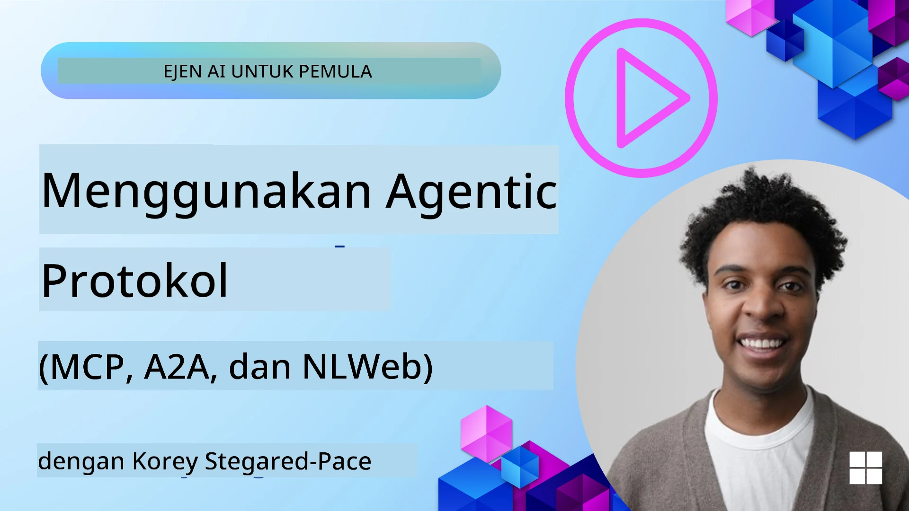
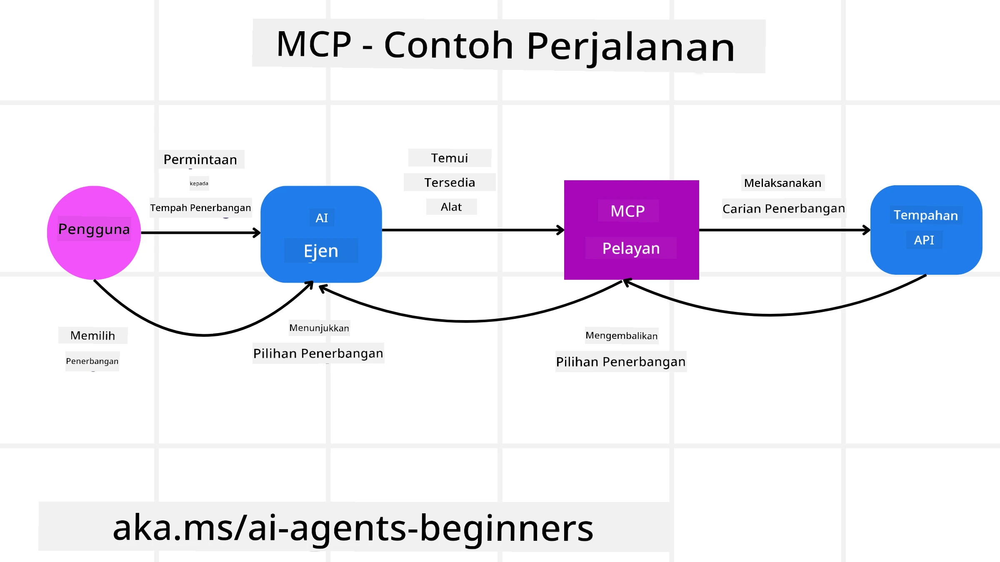
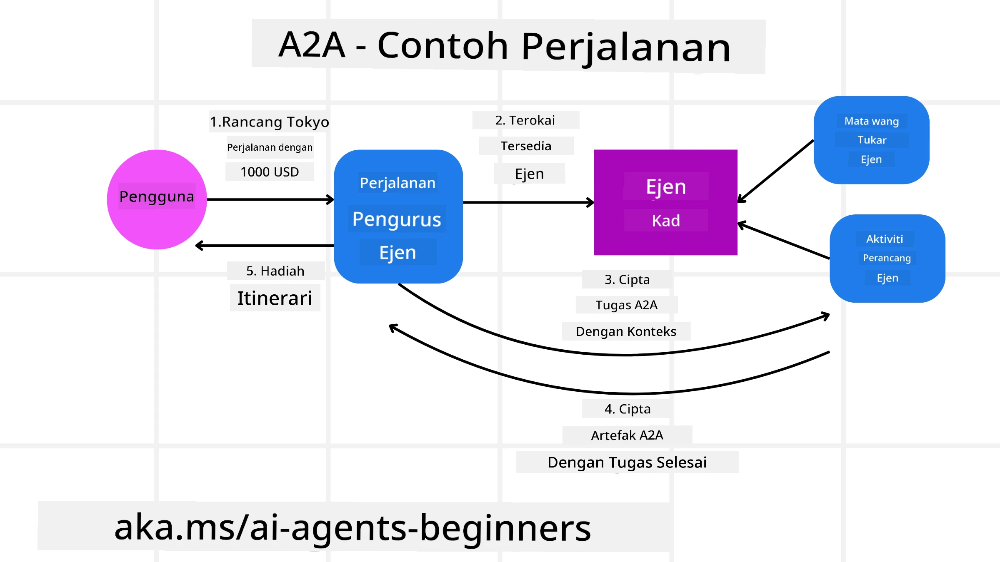
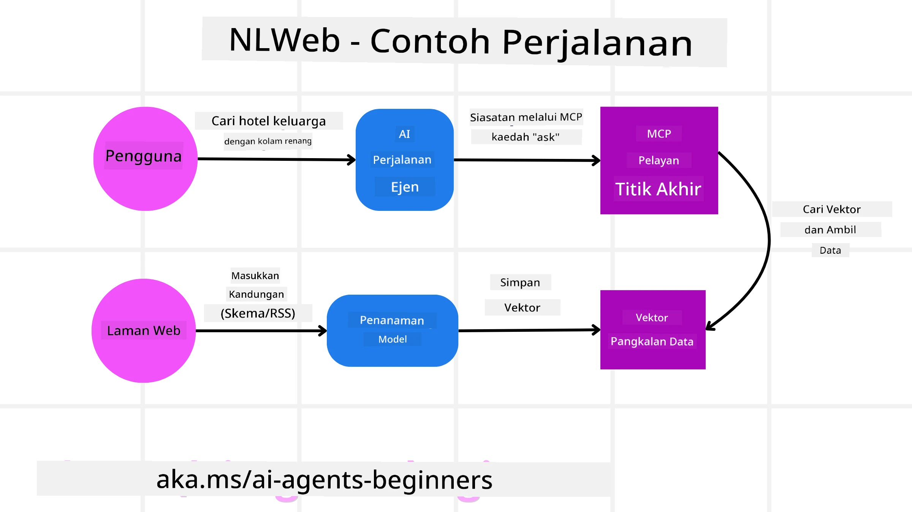

# Menggunakan Protokol Agentik (MCP, A2A dan NLWeb)

> _(Klik imej di atas untuk menonton video pelajaran ini)_

Seiring dengan pertumbuhan penggunaan ejen AI, begitu juga keperluan untuk protokol yang memastikan penyeragaman, keselamatan, dan menyokong inovasi terbuka. Dalam pelajaran ini, kita akan membincangkan 3 protokol yang bertujuan memenuhi keperluan ini - Protokol Konteks Model (MCP), Ejen ke Ejen (A2A) dan Web Bahasa Semulajadi (NLWeb).

## Pengenalan

Dalam pelajaran ini, kita akan membincangkan:

• Bagaimana **MCP** membenarkan Ejen AI mengakses alat dan data luar untuk melengkapkan tugasan pengguna.

• Bagaimana **A2A** membolehkan komunikasi dan kerjasama antara ejen AI yang berbeza.

• Bagaimana **NLWeb** membawa antara muka bahasa semulajadi ke mana-mana laman web membolehkan Ejen AI untuk menemui dan berinteraksi dengan kandungan.

## Matlamat Pembelajaran

• **Kenal pasti** tujuan utama dan manfaat MCP, A2A, dan NLWeb dalam konteks ejen AI.

• **Jelaskan** bagaimana setiap protokol memudahkan komunikasi dan interaksi antara LLM, alat, dan ejen lain.

• **Kenali** peranan berbeza setiap protokol dalam membina sistem agentik yang kompleks.

## Protokol Konteks Model

**Protokol Konteks Model (MCP)** adalah standard terbuka yang menyediakan cara seragam untuk aplikasi memberikan konteks dan alat kepada LLM. Ini membolehkan "penyesuai sejagat" kepada pelbagai sumber data dan alat yang boleh disambungkan oleh Ejen AI dengan cara yang konsisten.

Mari kita lihat komponen MCP, manfaat berbanding penggunaan API langsung, dan contoh bagaimana ejen AI mungkin menggunakan pelayan MCP.

### Komponen Teras MCP

MCP beroperasi pada **arsitektur klien-pelayan** dan komponen terasnya adalah:

• **Hos** adalah aplikasi LLM (contohnya penyunting kod seperti VSCode) yang memulakan sambungan kepada Pelayan MCP.

• **Klien** adalah komponen dalam aplikasi hos yang mengekalkan sambungan satu-ke-satu dengan pelayan.

• **Pelayan** adalah program ringan yang mendedahkan keupayaan tertentu.

Termasuk dalam protokol adalah tiga primitif teras yang merupakan keupayaan Pelayan MCP:

• **Alat**: Ini adalah tindakan atau fungsi berasingan yang boleh dipanggil oleh ejen AI untuk melakukan sesuatu tindakan. Contohnya, perkhidmatan cuaca mungkin mendedahkan alat "dapatkan cuaca", atau pelayan e-dagang mungkin mendedahkan alat "beli produk". Pelayan MCP mengiklankan nama alat, deskripsi, dan skema input/output dalam senarai keupayaan mereka.

• **Sumber**: Ini adalah item data atau dokumen baca sahaja yang boleh disediakan oleh pelayan MCP, dan klien boleh memperolehinya mengikut permintaan. Contohnya termasuk kandungan fail, rekod pangkalan data, atau fail log. Sumber boleh berupa teks (seperti kod atau JSON) atau binari (seperti imej atau PDF).

• **Prompt**: Ini adalah templat pra-tetap yang menyediakan prompt yang dicadangkan, membenarkan aliran kerja yang lebih kompleks.

### Manfaat MCP

MCP menawarkan kelebihan besar untuk Ejen AI:

• **Penemuan Alat Dinamik**: Ejen boleh secara dinamik menerima senarai alat yang tersedia daripada pelayan bersama penerangan fungsi mereka. Ini berbeza dengan API tradisional, yang sering memerlukan pengkodan statik untuk integrasi, bermakna sebarang perubahan API memerlukan kemas kini kod. MCP menawarkan pendekatan "integrasi sekali", menghasilkan kebolehsuaian yang lebih tinggi.

• **Kebolehubahan Merentasi LLM**: MCP berfungsi merentasi LLM yang berbeza, memberikan fleksibiliti untuk menukar model teras bagi menilai prestasi yang lebih baik.

• **Keselamatan Standard**: MCP merangkumi kaedah pengesahan standard, memperbaiki skala apabila menambah akses kepada pelayan MCP tambahan. Ini lebih mudah daripada menguruskan pelbagai kunci dan jenis pengesahan untuk pelbagai API tradisional.

### Contoh MCP

Bayangkan seorang pengguna mahu menempah penerbangan menggunakan pembantu AI yang dikuasakan oleh MCP.

1. **Sambungan**: Pembantu AI (klien MCP) menyambung ke pelayan MCP yang disediakan oleh syarikat penerbangan.

2. **Penemuan Alat**: Klien bertanya kepada pelayan MCP syarikat penerbangan, "Apakah alat yang anda ada?". Pelayan membalas dengan alat seperti "cari penerbangan" dan "tempah penerbangan".

3. **Panggilan Alat**: Kemudian anda bertanya kepada pembantu AI, "Sila cari penerbangan dari Portland ke Honolulu." Pembantu AI, menggunakan LLMnya, mengenal pasti ia perlu memanggil alat "cari penerbangan" dan menghantar parameter berkaitan (asal, destinasi) kepada pelayan MCP.

4. **Pelaksanaan dan Respons**: Pelayan MCP, bertindak sebagai pembungkus, membuat panggilan sebenar ke API tempahan dalaman syarikat penerbangan. Ia kemudian menerima maklumat penerbangan (contoh data JSON) dan menghantarnya kembali kepada pembantu AI.

5. **Interaksi Lanjut**: Pembantu AI memaparkan pilihan penerbangan. Setelah anda memilih sebuah penerbangan, pembantu mungkin memanggil alat "tempah penerbangan" pada pelayan MCP yang sama, melengkapkan tempahan.

## Protokol Ejen ke Ejen (A2A)

Manakala MCP memfokuskan pada penyambungan LLM ke alat, **Protokol Ejen ke Ejen (A2A)** membawa satu langkah lebih jauh dengan membolehkan komunikasi dan kolaborasi antara ejen AI yang berbeza. A2A menyambungkan ejen AI merentasi organisasi, persekitaran dan sistem teknologi yang berbeza untuk melengkapkan tugasan bersama.

Kita akan mengkaji komponen dan manfaat A2A, bersama contoh bagaimana ia boleh digunakan dalam aplikasi perjalanan kita.

### Komponen Teras A2A

A2A memfokuskan pada membolehkan komunikasi antara ejen dan membuat mereka bekerjasama melengkapkan subtugasan pengguna. Setiap komponen protokol menyumbang kepada perkara ini:

#### Kad Ejen

Serupa dengan bagaimana pelayan MCP berkongsi senarai alat, Kad Ejen mempunyai:
- Nama Ejen.
- **deskripsi tugasan umum** yang diselesaikan.
- **senarai kemahiran khusus** dengan deskripsi untuk membantu ejen lain (atau pengguna manusia) memahami bila dan mengapa mereka ingin memanggil ejen itu.
- **URL Titik Akhir semasa** ejen
- **versi** dan **keupayaan** ejen seperti respons strim dan notifikasi tolak.

#### Pelaksana Ejen

Pelaksana Ejen bertanggungjawab untuk **meneruskan konteks perbualan pengguna kepada ejen jauh**, ejen jauh memerlukan ini untuk memahami tugasan yang perlu diselesaikan. Dalam pelayan A2A, ejen menggunakan Model Bahasa Besar (LLM) mereka sendiri untuk menguraikan permintaan masuk dan melaksanakan tugasan menggunakan alat dalaman mereka sendiri.

#### Artifak

Setelah ejen jauh menyiapkan tugasan yang diminta, hasil kerjanya dibuat sebagai artifak. Artifak **mengandungi hasil kerja ejen**, **deskripsi apa yang telah disiapkan**, dan **konteks teks** yang dihantar melalui protokol. Selepas artifak dihantar, sambungan dengan ejen jauh ditutup sehingga diperlukan semula.

#### Barisan Acara

Komponen ini digunakan untuk **mengendalikan kemas kini dan penghantaran mesej**. Ia sangat penting dalam produksi untuk sistem agentik bagi mengelakkan sambungan antara ejen ditutup sebelum tugasan selesai, terutamanya apabila masa penyelesaian tugasan boleh mengambil masa yang lama.

### Manfaat A2A

• **Kolaborasi Ditingkatkan**: Ia membolehkan ejen dari vendor dan platform berbeza berinteraksi, berkongsi konteks, dan bekerjasama, memudahkan automasi lancar merentasi sistem yang biasanya berasingan.

• **Fleksibiliti Pemilihan Model**: Setiap ejen A2A boleh memilih LLM yang digunakan untuk melayani permintaan mereka, membolehkan model dioptimumkan atau diperhalusi untuk setiap ejen, tidak seperti satu sambungan LLM dalam beberapa senario MCP.

• **Pengesahan Terbina Dalam**: Pengesahan digabung secara langsung dalam protokol A2A, menyediakan rangka kerja keselamatan yang kukuh untuk interaksi ejen.

### Contoh A2A

Mari kita kembangkan senario tempahan perjalanan kita, tetapi kali ini menggunakan A2A.

1. **Permintaan Pengguna ke Multi-Ejen**: Seorang pengguna berinteraksi dengan klien/ejen "Ejen Perjalanan" A2A, mungkin dengan berkata, "Sila tempah keseluruhan perjalanan ke Honolulu untuk minggu depan, termasuk penerbangan, hotel, dan kereta sewa".

2. **Pengaturan oleh Ejen Perjalanan**: Ejen Perjalanan menerima permintaan kompleks ini. Ia menggunakan LLMnya untuk merancang tugasan dan menentukan ia perlu berinteraksi dengan ejen khusus lain.

3. **Komunikasi Antara Ejen**: Ejen Perjalanan kemudian menggunakan protokol A2A untuk menyambung kepada ejen hiliran, seperti "Ejen Syarikat Penerbangan," "Ejen Hotel," dan "Ejen Kereta Sewa" yang dicipta oleh syarikat berbeza.

4. **Pelaksanaan Tugasan Delegasi**: Ejen Perjalanan menghantar tugasan khusus kepada ejen khusus tersebut (contohnya, "Cari penerbangan ke Honolulu," "Tempah hotel," "Sewa kereta"). Setiap ejen khusus ini, menjalankan LLM mereka sendiri dan menggunakan alat mereka sendiri (yang boleh jadi pelayan MCP), melaksanakan bahagian tempahan tertentu.

5. **Respons Terkumpul**: Setelah semua ejen hiliran melengkapkan tugasan mereka, Ejen Perjalanan mengumpulkan keputusan (butiran penerbangan, pengesahan hotel, tempahan kereta sewa) dan menghantar respons lengkap dalam bentuk gaya perbualan kembali kepada pengguna.

## Web Bahasa Semulajadi (NLWeb)

Laman web telah lama menjadi cara utama pengguna mengakses maklumat dan data di seluruh internet.

Mari kita lihat komponen berbeza NLWeb, manfaat NLWeb dan contoh bagaimana NLWeb kita berfungsi dengan melihat aplikasi perjalanan kita.

### Komponen NLWeb

- **Aplikasi NLWeb (Kod Perkhidmatan Teras)**: Sistem yang memproses soalan dalam bahasa semulajadi. Ia menyambungkan bahagian platform yang berbeza untuk menghasilkan respons. Anda boleh anggap ia sebagai **enjin yang menggerakkan ciri bahasa semulajadi** laman web.

- **Protokol NLWeb**: Ini adalah **set peraturan asas untuk interaksi bahasa semulajadi** dengan laman web. Ia menghantar kembali respons dalam format JSON (sering menggunakan Schema.org). Tujuannya adalah untuk mencipta asas mudah untuk “Web AI,” sama seperti HTML membolehkan perkongsian dokumen dalam talian.

- **Pelayan MCP (Titik Akhir Protokol Konteks Model)**: Setiap susunan NLWeb juga berfungsi sebagai **pelayan MCP**. Ini bermakna ia boleh **berkongsi alat (seperti kaedah “ask”) dan data** dengan sistem AI lain. Dalam amalan, ini menjadikan kandungan dan keupayaan laman web boleh digunakan oleh ejen AI, membolehkan laman menjadi sebahagian daripada “ekosistem ejen” yang lebih luas.

- **Model Embedding**: Model ini digunakan untuk **menukar kandungan laman web menjadi representasi angka yang dipanggil vektor (embedding)**. Vektor ini menangkap makna dengan cara yang boleh dibanding dan dicari oleh komputer. Ia disimpan dalam pangkalan data khusus, dan pengguna boleh memilih model embedding yang mahu digunakan.

- **Pangkalan Data Vektor (Mekanisme Pengambilan)**: Pangkalan data ini **menyimpan embedding kandungan laman web**. Apabila seseorang bertanya soalan, NLWeb menyemak pangkalan data vektor untuk mencari maklumat paling relevan dengan cepat. Ia memberikan senarai jawapan kemungkinan dengan penarafan berdasarkan kesamaan. NLWeb berfungsi dengan pelbagai sistem penyimpanan vektor seperti Qdrant, Snowflake, Milvus, Azure AI Search, dan Elasticsearch.

### NLWeb Dengan Contoh

Pertimbangkan semula laman web tempahan perjalanan kita, tetapi kali ini, ia dikuasakan oleh NLWeb.

1. **Pengambilan Data**: Katalog produk sedia ada laman web perjalanan (contohnya, senarai penerbangan, deskripsi hotel, pakej lawatan) dipadatkan menggunakan Schema.org atau dimuat melalui suapan RSS. Alat NLWeb mengambil data terstruktur ini, mencipta embedding, dan menyimpannya dalam pangkalan data vektor tempatan atau jauh.

2. **Pertanyaan Bahasa Semulajadi (Manusia)**: Pengguna melawat laman web dan, daripada menavigasi menu, menaip dalam antara muka chat: "Cari saya hotel ramah keluarga di Honolulu dengan kolam renang untuk minggu depan".

3. **Pemprosesan NLWeb**: Aplikasi NLWeb menerima pertanyaan ini. Ia menghantar pertanyaan ke LLM untuk pemahaman dan serentak mencari pangkalan data vektornya untuk senarai hotel yang relevan.

4. **Keputusan Tepat**: LLM membantu mentafsir keputusan carian dari pangkalan data, mengenal pasti padanan terbaik berdasarkan kriteria "ramah keluarga," "kolam renang," dan "Honolulu," kemudian memformat respons dalam bahasa semulajadi. Penting, respons merujuk pada hotel sebenar dalam katalog laman web, mengelakkan maklumat rekaan.

5. **Interaksi Ejen AI**: Oleh kerana NLWeb berfungsi sebagai pelayan MCP, ejen AI perjalanan luar juga boleh menyambung ke instans NLWeb laman web ini. Ejen AI kemudian boleh menggunakan kaedah `ask` MCP untuk bertanya terus ke laman web: `ask("Adakah terdapat restoran mesra vegan di kawasan Honolulu yang disyorkan oleh hotel?")`. Instans NLWeb akan memproses soalan ini, menggunakan pangkalan data maklumat restoran (jika dimuat), dan mengembalikan respons JSON berstruktur.

### Ada Lagi Soalan mengenai MCP/A2A/NLWeb?

Sertailah [Microsoft Foundry Discord](https://aka.ms/ai-agents/discord) untuk bertemu dengan pelajar lain, menghadiri waktu pejabat dan mendapatkan jawapan kepada soalan Ejen AI anda.

## Sumber

- [MCP untuk Pemula](https://aka.ms/mcp-for-beginners)  
- [Dokumentasi MCP](https://learn.microsoft.com/python/api/overview/azure/ai-projects-readme)
- [Repositori NLWeb](https://github.com/nlweb-ai/NLWeb)
- [Rangka Kerja Ejen Microsoft](https://aka.ms/ai-agents-beginners/agent-framewrok)

---

<!-- CO-OP TRANSLATOR DISCLAIMER START -->
**Penafian**:  
Dokumen ini telah diterjemahkan menggunakan perkhidmatan terjemahan AI [Co-op Translator](https://github.com/Azure/co-op-translator). Walaupun kami berusaha untuk memastikan ketepatan, sila ambil perhatian bahawa terjemahan automatik mungkin mengandungi kesilapan atau ketidaktepatan. Dokumen asal dalam bahasa asalnya hendaklah dianggap sebagai sumber rujukan yang sah. Untuk maklumat yang kritikal, terjemahan profesional oleh manusia adalah disyorkan. Kami tidak bertanggungjawab terhadap sebarang salah faham atau kekeliruan yang timbul daripada penggunaan terjemahan ini.
<!-- CO-OP TRANSLATOR DISCLAIMER END -->