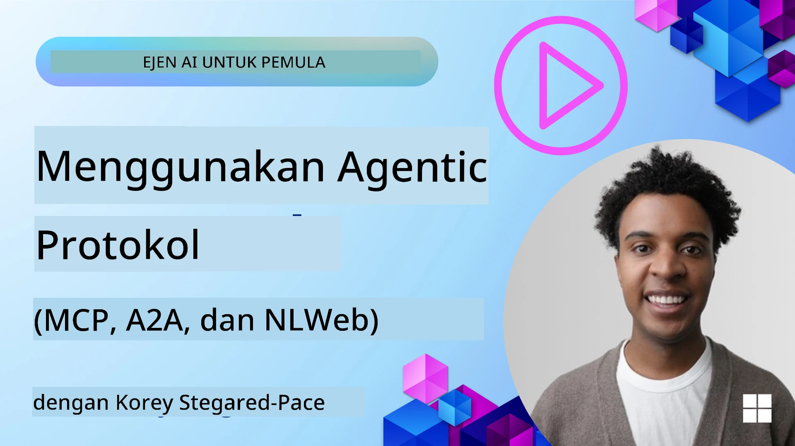
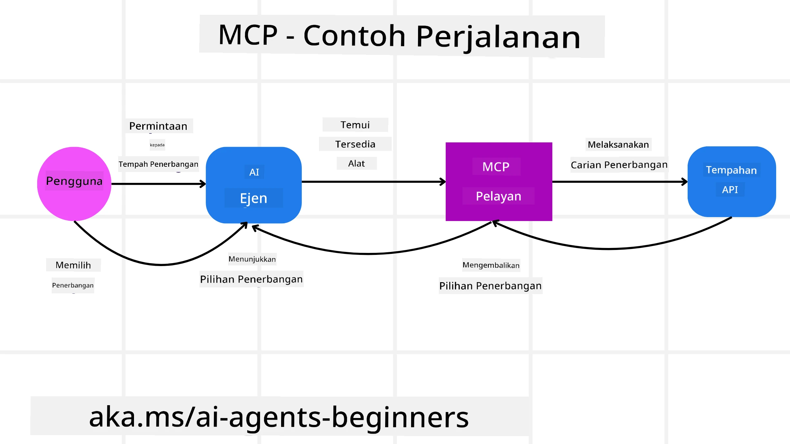
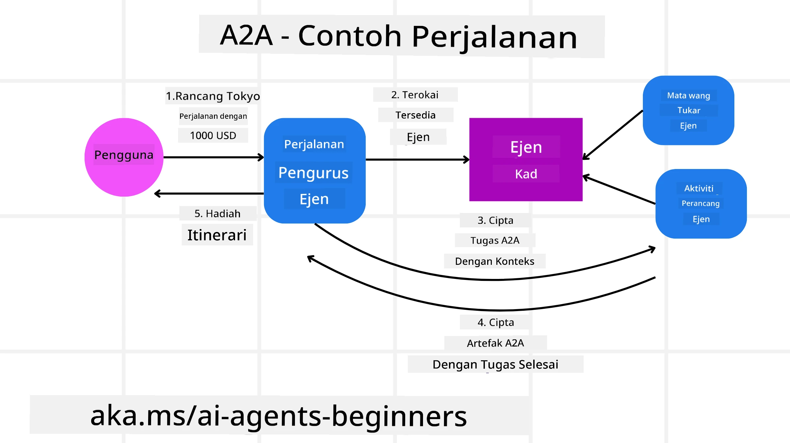
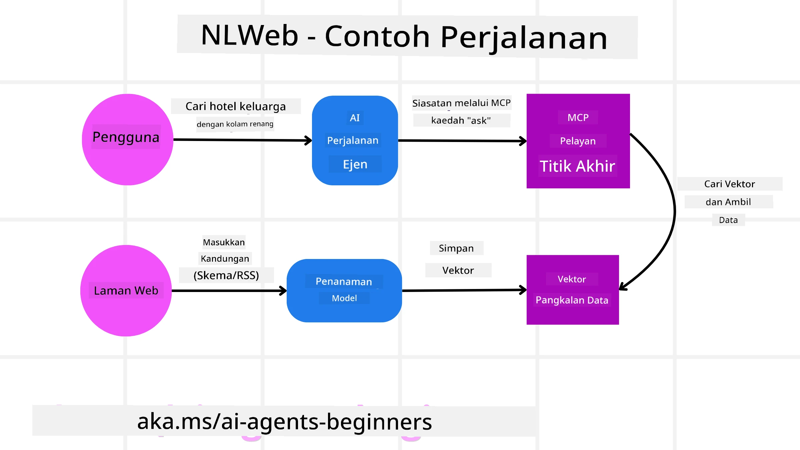

# Menggunakan Protokol Agentik (MCP, A2A dan NLWeb)

> _(Klik gambar di atas untuk menonton video pelajaran ini)_

Ketika penggunaan agen AI berkembang, keperluan untuk protokol yang memastikan standardisasi, keselamatan, dan menyokong inovasi terbuka juga meningkat. Dalam pelajaran ini, kami akan membincangkan 3 protokol yang bertujuan memenuhi keperluan ini - Model Context Protocol (MCP), Agent to Agent (A2A) dan Natural Language Web (NLWeb).

## Pengenalan

Dalam pelajaran ini, kami akan membincangkan:

• Cara **MCP** membolehkan Agen AI mengakses alat dan data luaran untuk melengkapkan tugasan pengguna.

• Cara **A2A** membolehkan komunikasi dan kerjasama antara agen AI yang berbeza.

• Cara **NLWeb** membawa antara muka bahasa semula jadi ke mana-mana laman web membolehkan Agen AI menemui dan berinteraksi dengan kandungan.

## Matlamat Pembelajaran

• **Mengenal pasti** tujuan utama dan manfaat MCP, A2A, dan NLWeb dalam konteks agen AI.

• **Menjelaskan** bagaimana setiap protokol memudahkan komunikasi dan interaksi antara LLM, alat, dan agen lain.

• **Mengenali** peranan berbeza yang dimainkan oleh setiap protokol dalam membina sistem agentik yang kompleks.

## Model Context Protocol

**Model Context Protocol (MCP)** adalah standard terbuka yang menyediakan cara standard untuk aplikasi memberikan konteks dan alat kepada LLM. Ini membolehkan "adapter universal" ke sumber data dan alat yang berbeza yang boleh disambungkan oleh Agen AI dengan cara yang konsisten.

Mari lihat komponen MCP, manfaatnya berbanding penggunaan API terus, dan contoh bagaimana agen AI mungkin menggunakan pelayan MCP.

### Komponen Teras MCP

MCP beroperasi menggunakan **senibina klien-pelayan** dan komponen terasnya adalah:

• **Hos** ialah aplikasi LLM (contohnya penyunting kod seperti VSCode) yang memulakan sambungan ke Pelayan MCP.

• **Klien** ialah komponen dalam aplikasi hos yang mengekalkan sambungan satu-ke-satu dengan pelayan.

• **Pelayan** ialah program ringan yang mendedahkan keupayaan tertentu.

Termasuk dalam protokol adalah tiga primitif teras yang merupakan keupayaan Pelayan MCP:

• **Alat**: Ini adalah tindakan atau fungsi tertentu yang boleh dipanggil oleh agen AI untuk melakukan suatu tindakan. Contohnya, perkhidmatan cuaca mungkin mendedahkan alat "dapatkan cuaca", atau pelayan e-dagang boleh mendedahkan alat "beli produk". Pelayan MCP mengiklankan nama, penerangan, dan skema input/output alat dalam senarai keupayaannya.

• **Sumber**: Ini adalah item data hanya-baca atau dokumen yang boleh disediakan oleh pelayan MCP, dan klien boleh mengambilnya mengikut permintaan. Contohnya termasuk kandungan fail, rekod pangkalan data, atau fail log. Sumber boleh berupa teks (seperti kod atau JSON) atau binari (seperti imej atau PDF).

• **Prompt**: Ini adalah templat pra-takrif yang menyediakan sugesti prompt, membolehkan aliran kerja yang lebih kompleks.

### Manfaat MCP

MCP menawarkan kelebihan ketara bagi Agen AI:

• **Pengesanan Alat Dinamik**: Agen boleh menerima secara dinamik senarai alat yang tersedia dari pelayan bersama penerangan apa yang mereka lakukan. Ini berbeza dengan API tradisional yang biasanya memerlukan pengkodan statik untuk integrasi, bermakna sebarang perubahan API memerlukan kemas kini kod. MCP menawarkan pendekatan "integrasi sekali," yang membawa kepada kebolehsuaian lebih tinggi.

• **Kebolehoperasian Merentasi LLM**: MCP berfungsi merentasi pelbagai LLM, memberikan fleksibiliti untuk bertukar model teras bagi menilai prestasi lebih baik.

• **Keselamatan Standard**: MCP termasuk kaedah pengesahan standard, meningkatkan skala apabila menambah akses ke pelayan MCP tambahan. Ini lebih mudah daripada mengurus kunci dan jenis pengesahan berbeza untuk pelbagai API tradisional.

### Contoh MCP

Bayangkan seorang pengguna ingin menempah penerbangan menggunakan pembantu AI yang dikuasakan oleh MCP.

1. **Sambungan**: Pembantu AI (klien MCP) bersambung ke pelayan MCP yang disediakan oleh syarikat penerbangan.

2. **Pengesanan Alat**: Klien bertanya kepada pelayan MCP syarikat penerbangan, "Alat apa yang anda ada?" Pelayan membalas dengan alat seperti "cari penerbangan" dan "tempah penerbangan".

3. **Panggilan Alat**: Anda kemudian meminta pembantu AI, "Sila cari penerbangan dari Portland ke Honolulu." Pembantu AI, menggunakan LLM-nya, mengenal pasti bahawa ia perlu memanggil alat "cari penerbangan" dan menghantar parameter relevan (asal, destinasi) ke pelayan MCP.

4. **Pelaksanaan dan Respons**: Pelayan MCP, bertindak sebagai pembungkus, membuat panggilan sebenar ke API tempahan dalaman syarikat penerbangan. Kemudian menerima maklumat penerbangan (contoh data JSON) dan menghantarnya kembali ke pembantu AI.

5. **Interaksi Lanjutan**: Pembantu AI membentangkan pilihan penerbangan. Setelah anda memilih penerbangan, pembantu mungkin memanggil alat "tempah penerbangan" pada pelayan MCP yang sama, melengkapkan tempahan.

## Protokol Agen-ke-Agen (A2A)

Walaupun MCP fokus pada menyambungkan LLM ke alat, **protokol Agent-to-Agent (A2A)** melangkah lebih jauh dengan membolehkan komunikasi dan kerjasama antara agen AI yang berbeza. A2A menghubungkan agen AI merentasi organisasi, persekitaran dan tumpukan teknologi berbeza untuk melengkapkan tugasan bersama.

Kita akan melihat komponen dan manfaat A2A, bersama contoh bagaimana ia boleh diterapkan dalam aplikasi perjalanan kita.

### Komponen Teras A2A

A2A menumpukan pada membolehkan komunikasi antara agen dan menjadikan mereka bekerjasama melengkapkan subtugasan pengguna. Setiap komponen protokol menyumbang kepada ini:

#### Kad Agen

Sama seperti bagaimana pelayan MCP berkongsi senarai alat, Kad Agen mempunyai:
- Nama Agen.
- **penerangan tentang tugasan umum** yang dilengkapkannya.
- **senarai kemahiran khusus** dengan penerangan untuk membantu agen lain (atau pengguna manusia) memahami bila dan kenapa mereka ingin memanggil agen tersebut.
- **URL Endpoint semasa** agen itu
- **versi** dan **keupayaan** agen seperti respons penstriman dan pemberitahuan tolak.

#### Pelaksana Agen

Pelaksana Agen bertanggungjawab untuk **menyampaikan konteks perbualan pengguna kepada agen jauh**, agen jauh memerlukan ini untuk memahami tugasan yang perlu dilengkapkan. Dalam pelayan A2A, agen menggunakan Model Bahasa Besar (LLM) sendiri untuk mengurai permintaan masuk dan melaksanakan tugasan menggunakan alat dalaman sendiri.

#### Artefak

Setelah agen jauh melengkapkan tugasan yang diminta, produk kerjanya dicipta sebagai artefak. Artefak **mengandungi hasil kerja agen**, **penerangan apa yang telah dilengkapkan**, dan **konteks teks** yang dihantar melalui protokol. Setelah artefak dihantar, sambungan dengan agen jauh ditutup sehingga diperlukan lagi.

#### Barisan Acara

Komponen ini digunakan untuk **mengendalikan kemas kini dan menyampaikan mesej**. Ia amat penting dalam pengeluaran bagi sistem agentik untuk mengelakkan sambungan antara agen ditutup sebelum tugasan selesai, terutama apabila masa penyelesaian tugasan boleh mengambil masa lebih lama.

### Manfaat A2A

• **Kerjasama Dipertingkatkan**: Ia membolehkan agen dari vendor dan platform berbeza berinteraksi, berkongsi konteks, dan bekerjasama, memudahkan automasi lancar merentasi sistem yang biasanya tidak berhubung.

• **Fleksibiliti Pemilihan Model**: Setiap agen A2A boleh memilih LLM yang digunakannya untuk melayani permintaan, membolehkan model dioptimum atau disesuaikan untuk setiap agen, berbeza dengan sambungan LLM tunggal dalam beberapa senario MCP.

• **Pengesahan Terbina Dalam**: Pengesahan diintegrasikan terus ke dalam protokol A2A, menyediakan rangka kerja keselamatan kukuh untuk interaksi agen.

### Contoh A2A

Mari kita kembangkan senario tempahan perjalanan kita, tetapi kali ini menggunakan A2A.

1. **Permintaan Pengguna ke Pelbagai Agen**: Seorang pengguna berinteraksi dengan klien/agen A2A "Ejen Perjalanan", mungkin dengan berkata, "Sila tempah keseluruhan perjalanan ke Honolulu minggu depan, termasuk penerbangan, hotel, dan kereta sewa."

2. **Orkestrasi oleh Ejen Perjalanan**: Ejen Perjalanan menerima permintaan kompleks ini. Ia menggunakan LLM untuk berfikir tentang tugasan dan menentukan ia perlu berinteraksi dengan agen khusus lain.

3. **Komunikasi Antara Agen**: Ejen Perjalanan menggunakan protokol A2A untuk menyambung ke agen hiliran, seperti "Ejen Syarikat Penerbangan," "Ejen Hotel," dan "Ejen Sewa Kereta" yang dibuat oleh syarikat berbeza.

4. **Pelaksanaan Tugasan Didelegasikan**: Ejen Perjalanan menghantar tugasan spesifik kepada agen khusus ini (contoh, "Cari penerbangan ke Honolulu," "Tempah hotel," "Sewa kereta"). Setiap agen khusus ini, menggunakan LLM sendiri dan alatnya sendiri (yang mungkin juga pelayan MCP), melaksanakan bahagian tempahan masing-masing.

5. **Respons Disatukan**: Setelah semua agen hiliran melengkapkan tugasan, Ejen Perjalanan mengumpulkan hasil (butiran penerbangan, pengesahan hotel, tempahan sewa kereta) dan menghantar respons gaya sembang yang menyeluruh balik kepada pengguna.

## Natural Language Web (NLWeb)

Laman web telah lama menjadi cara utama pengguna mengakses maklumat dan data di seluruh internet.

Mari kita lihat komponen berbeza NLWeb, manfaat NLWeb dan contoh bagaimana NLWeb kita berfungsi dengan melihat aplikasi perjalanan kita.

### Komponen NLWeb

- **Aplikasi NLWeb (Kod Perkhidmatan Teras)**: Sistem yang memproses soalan bahasa semula jadi. Ia menghubungkan bahagian berbeza platform untuk mencipta respons. Anda boleh menganggapnya sebagai **enjin yang menggerakkan ciri bahasa semula jadi** bagi sesebuah laman web.

- **Protokol NLWeb**: Ini adalah **set peraturan asas untuk interaksi bahasa semula jadi** dengan laman web. Ia menghantar balik respons dalam format JSON (selalunya menggunakan Schema.org). Tujuannya adalah untuk mencipta asas mudah bagi “AI Web,” seperti HTML yang membolehkan perkongsian dokumen dalam talian.

- **Pelayan MCP (Titik Akhir Model Context Protocol)**: Setiap penyediaan NLWeb juga berfungsi sebagai **pelayan MCP**. Ini bermakna ia boleh **berkongsi alat (seperti kaedah “ask”) dan data** dengan sistem AI lain. Dalam praktiknya, ini menjadikan kandungan dan keupayaan laman web boleh digunakan oleh agen AI, membolehkan laman menjadi sebahagian daripada “ekosistem agen” yang lebih luas.

- **Model Embedding**: Model ini digunakan untuk **menukar kandungan laman web kepada perwakilan berangka yang dipanggil vektor** (embedding). Vektor ini menangkap makna dalam cara yang boleh dibanding dan dicari oleh komputer. Mereka disimpan dalam pangkalan data khas, dan pengguna boleh memilih model embedding yang mahu digunakan.

- **Pangkalan Data Vektor (Mekanisme Pengambilan)**: Pangkalan data ini **menyimpan embedding kandungan laman web**. Apabila seseorang bertanya soalan, NLWeb menyemak pangkalan data vektor untuk mencari maklumat paling relevan dengan cepat. Ia memberikan senarai jawapan kemungkinan dengan pantas, diatur mengikut kesamaan. NLWeb bekerja dengan sistem penyimpanan vektor berbeza seperti Qdrant, Snowflake, Milvus, Azure AI Search, dan Elasticsearch.

### NLWeb dengan Contoh

Pertimbangkan laman web tempahan perjalanan kita lagi, tapi kali ini, ia dikuasakan oleh NLWeb.

1. **Pengambilan Data**: Katalog produk laman web perjalanan yang sudah ada (contoh, senarai penerbangan, penerangan hotel, pakej lawatan) diolah menggunakan Schema.org atau dimuatkan melalui suapan RSS. Alat NLWeb mengambil data berstruktur ini, mencipta embedding, dan menyimpannya dalam pangkalan data vektor setempat atau jauh.

2. **Pertanyaan Bahasa Semula Jadi (Manusia)**: Seorang pengguna melawat laman web dan, bukannya melayari menu, menaip dalam antara muka sembang: "Cari saya hotel mesra keluarga di Honolulu dengan kolam renang untuk minggu depan."

3. **Pemprosesan NLWeb**: Aplikasi NLWeb menerima pertanyaan ini. Ia menghantar pertanyaan kepada LLM untuk kefahaman dan pada masa yang sama mencari pangkalan data vektor untuk senarai hotel relevan.

4. **Keputusan Tepat**: LLM membantu mentafsir hasil carian dari pangkalan data, mengenal pasti padanan terbaik berdasarkan kriteria "mesra keluarga," "kolam renang," dan "Honolulu," kemudian memformat respons bahasa semula jadi. Yang penting, respons merujuk hotel sebenar daripada katalog laman, mengelakkan maklumat rekaan.

5. **Interaksi Agen AI**: Kerana NLWeb berfungsi sebagai pelayan MCP, agen perjalanan AI luaran juga boleh menyambung ke contoh NLWeb laman web ini. Agen AI kemudian boleh menggunakan kaedah `ask` MCP untuk bertanya terus ke laman web: `ask("Adakah ada restoran mesra vegan di kawasan Honolulu yang disyorkan oleh hotel?")`. Contoh NLWeb akan memproses ini, menggunakan pangkalan data maklumat restoran (jika dimuatkan), dan mengembalikan respons JSON berstruktur.

### Ada Soalan Lagi tentang MCP/A2A/NLWeb?

Sertai [Microsoft Foundry Discord](https://discord.com/invite/ATgtXmAS5D) untuk bertemu pembelajar lain, menghadiri waktu pejabat dan mendapatkan jawapan kepada soalan Agen AI anda.

## Sumber

- [MCP untuk Pemula](https://aka.ms/mcp-for-beginners)  
- [Dokumentasi MCP](https://learn.microsoft.com/python/api/overview/azure/ai-projects-readme)
- [Repositori NLWeb](https://github.com/nlweb-ai/NLWeb)
- [Microsoft Agent Framework](https://aka.ms/ai-agents-beginners/agent-framework)

---

<!-- CO-OP TRANSLATOR DISCLAIMER START -->
**Penafian**:
Dokumen ini telah diterjemahkan menggunakan perkhidmatan terjemahan AI [Co-op Translator](https://github.com/Azure/co-op-translator). Walaupun kami berusaha untuk ketepatan, sila ambil maklum bahawa terjemahan automatik mungkin mengandungi kesilapan atau ketidaktepatan. Dokumen asal dalam bahasa asalnya harus dianggap sebagai sumber yang sahih. Untuk maklumat penting, terjemahan oleh manusia profesional adalah disyorkan. Kami tidak bertanggungjawab terhadap sebarang salah faham atau salah tafsir yang timbul daripada penggunaan terjemahan ini.
<!-- CO-OP TRANSLATOR DISCLAIMER END -->