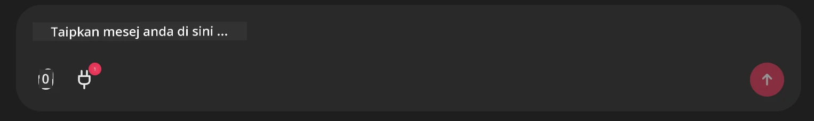

# Contoh Pelayan MCP Github

## Penerangan

Ini ialah demo yang dibuat untuk AI Agents Hackathon yang dianjurkan melalui Microsoft Reactor.

Alat ini digunakan untuk mengesyorkan projek hackathon berdasarkan repositori Github pengguna.
Ini dilakukan dengan:

1. **Ejen Github** - Menggunakan Pelayan MCP Github untuk mendapatkan repositori dan maklumat tentang repositori tersebut.
2. **Ejen Hackathon** - Mengambil data dari Ejen Github dan menghasilkan idea projek hackathon yang kreatif berdasarkan projek, bahasa yang digunakan oleh pengguna dan trek projek untuk AI Agents hackathon.
3. **Ejen Acara** - Berdasarkan cadangan ejen hackathon, ejen acara akan mengesyorkan acara yang berkaitan dari siri AI Agent Hackathon.

## Menjalankan Kod

### Pembolehubah Persekitaran

Demo ini menggunakan Microsoft Agent Framework, Azure OpenAI Service, Pelayan MCP Github dan Azure AI Search.

Pastikan anda telah menetapkan pembolehubah persekitaran yang betul untuk menggunakan alat-alat ini:

```python
AZURE_AI_PROJECT_ENDPOINT=""
AZURE_AI_MODEL_DEPLOYMENT_NAME=""
AZURE_SEARCH_SERVICE_ENDPOINT=""
AZURE_SEARCH_API_KEY=""
``` 


## Menjalankan Chainlit Server

Untuk menyambung ke pelayan MCP, demo ini menggunakan Chainlit sebagai antara muka sembang.

Untuk menjalankan pelayan, gunakan arahan berikut dalam terminal anda:

```bash
chainlit run app.py -w
```


Ini akan memulakan pelayan Chainlit anda pada `localhost:8000` serta mengisi Indeks Carian Azure AI anda dengan kandungan `event-descriptions.md`.

## Menyambung ke Pelayan MCP

Untuk menyambung ke Pelayan MCP Github, pilih ikon "plug" di bawah kotak sembang "Type your message here..":



Daripada situ, anda boleh klik pada "Connect an MCP" untuk menambah arahan menyambung ke Pelayan MCP Github:

```bash
npx -y @modelcontextprotocol/server-github --env GITHUB_PERSONAL_ACCESS_TOKEN=[YOUR PERSONAL ACCESS TOKEN]
```


Gantikan "[YOUR PERSONAL ACCESS TOKEN]" dengan Token Akses Peribadi sebenar anda.

Selepas menyambung, anda sepatutnya melihat (1) di sebelah ikon plug untuk mengesahkan bahawa ia telah disambungkan. Jika tidak, cuba mulakan semula pelayan chainlit dengan `chainlit run app.py -w`.

## Menggunakan Demo

Untuk memulakan aliran kerja ejen bagi mencadangkan projek hackathon, anda boleh menaip mesej seperti:

"Recommend hackathon projects for the Github user koreyspace"

Ejen Router akan menganalisis permintaan anda dan menentukan kombinasi ejen (GitHub, Hackathon, dan Events) yang paling sesuai untuk mengendalikan pertanyaan anda. Ejen- ejen ini bekerjasama untuk memberikan cadangan menyeluruh berdasarkan analisis repositori GitHub, idea projek, dan acara teknologi berkaitan.

---

<!-- CO-OP TRANSLATOR DISCLAIMER START -->
**Penafian**:  
Dokumen ini telah diterjemahkan menggunakan perkhidmatan terjemahan AI [Co-op Translator](https://github.com/Azure/co-op-translator). Walaupun kami berusaha untuk ketepatan, sila maklum bahawa terjemahan automatik mungkin mengandungi kesilapan atau ketidaktepatan. Dokumen asal dalam bahasa asalnya harus dianggap sebagai sumber yang sahih. Untuk maklumat penting, terjemahan oleh penterjemah manusia profesional adalah digalakkan. Kami tidak bertanggungjawab terhadap sebarang salah faham atau salah tafsir yang timbul daripada penggunaan terjemahan ini.
<!-- CO-OP TRANSLATOR DISCLAIMER END -->