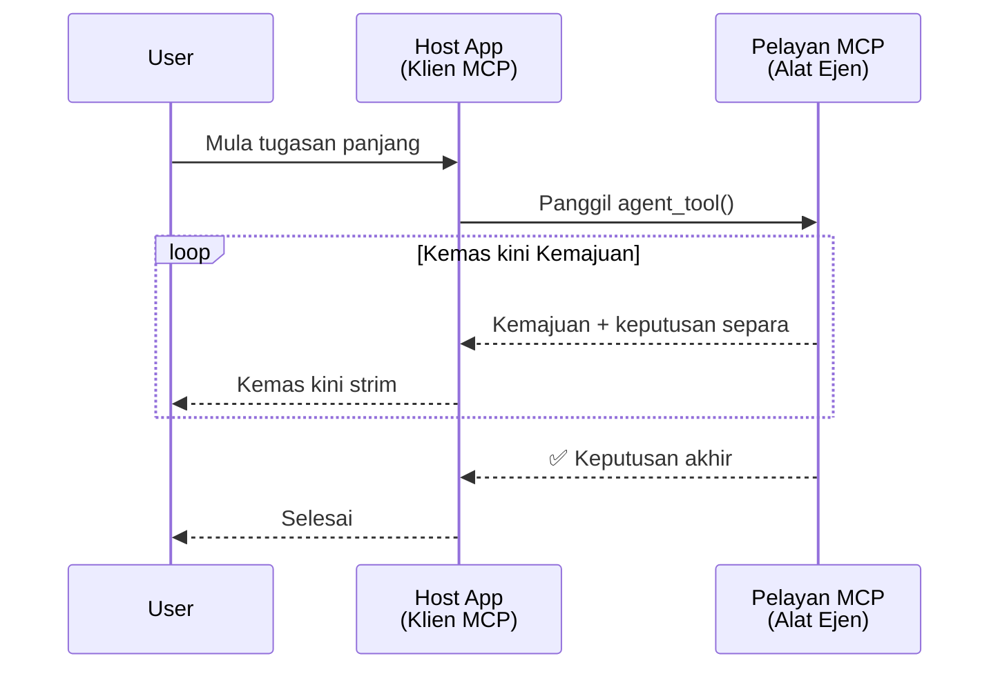
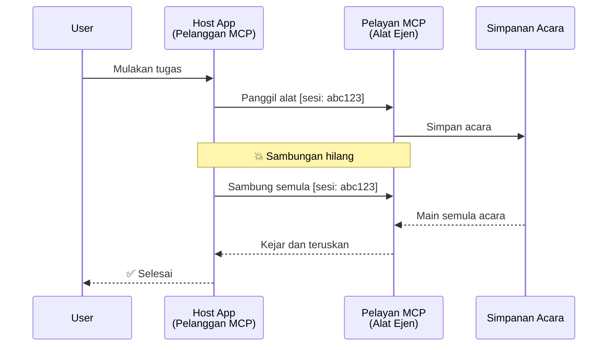
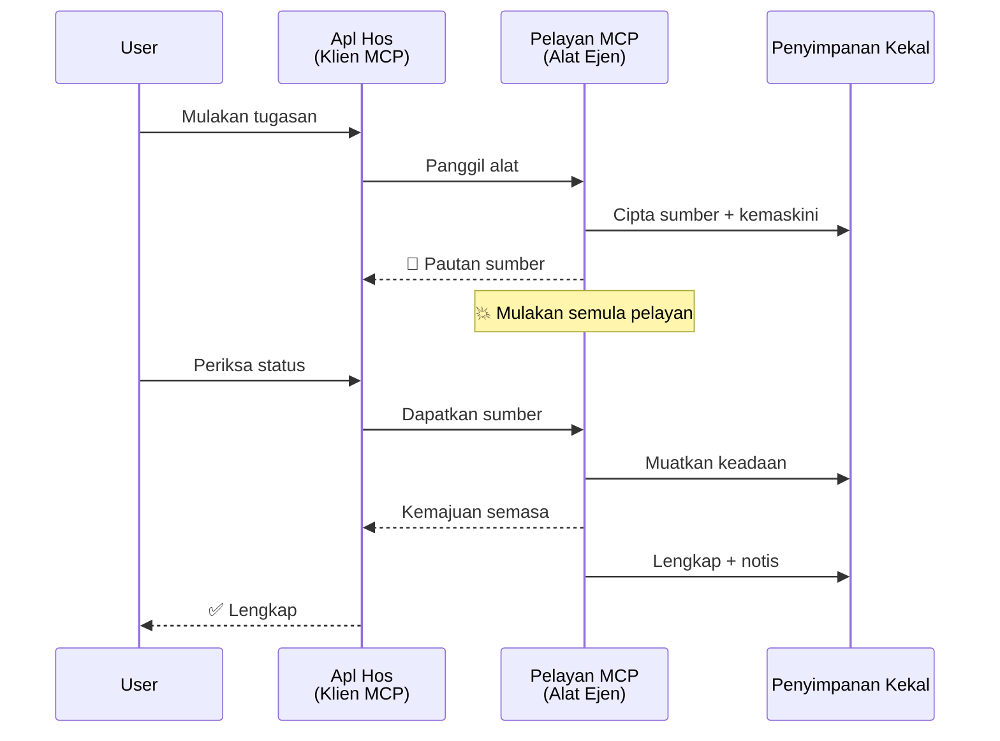
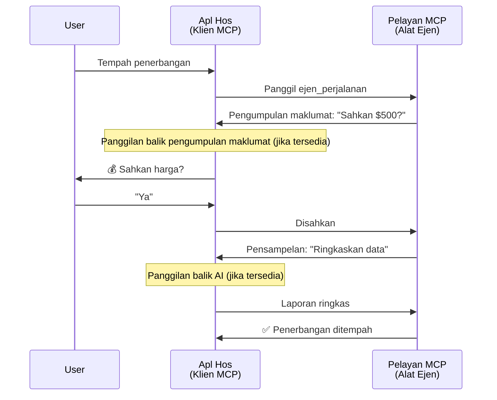
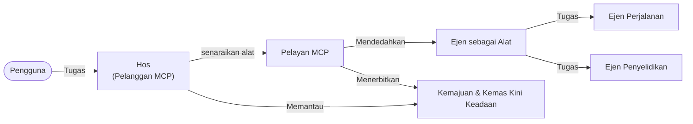

# Membangun Sistem Komunikasi Ejen-ke-Ejen dengan MCP

> TL;DR - Bolehkah Anda Membina Komunikasi Ejen2Ejen pada MCP? Ya!

MCP telah berkembang dengan ketara melebihi matlamat asalnya iaitu "menyediakan konteks kepada LLM". Dengan penambahbaikan terkini termasuk [aliran boleh disambung semula](https://modelcontextprotocol.io/docs/concepts/transports#resumability-and-redelivery), [elisitasi](https://modelcontextprotocol.io/specification/2025-06-18/client/elicitation), [pensampelan](https://modelcontextprotocol.io/specification/2025-06-18/client/sampling), dan notifikasi ([kemajuan](https://modelcontextprotocol.io/specification/2025-06-18/basic/utilities/progress) dan [sumber](https://modelcontextprotocol.io/specification/2025-06-18/schema#resourceupdatednotification)), MCP kini menyediakan asas yang kukuh untuk membina sistem komunikasi ejen-ke-ejen yang kompleks.

## Kekeliruan Ejen/Alat

Apabila lebih ramai pembangun meneroka alat dengan tingkah laku ejenik (berjalan untuk tempoh yang lama, mungkin memerlukan input tambahan semasa pelaksanaan, dsb.), satu kekeliruan biasa ialah bahawa MCP tidak sesuai terutamanya kerana contoh awal alatnya yang primitif memberi tumpuan kepada corak permintaan-respons yang mudah.

Persepsi ini sudah lapuk. Spesifikasi MCP telah dipertingkatkan dengan ketara selama beberapa bulan lalu dengan keupayaan yang merapatkan jurang untuk membina tingkah laku ejenik yang berterusan lama:

- **Aliran & Keputusan Sebahagian**: Kemas kini kemajuan masa nyata semasa pelaksanaan
- **Boleh Disambung Semula**: Pelanggan boleh bersambung semula dan meneruskan selepas terputus sambungan
- **Ketahanan**: Keputusan kekal walaupun pelayan dimulakan semula (contoh, melalui pautan sumber)
- **Berbilang Giliran**: Input interaktif semasa pelaksanaan melalui elisitasi dan pensampelan

Ciri-ciri ini boleh digabungkan untuk membolehkan aplikasi ejenik dan pelbagai ejen yang kompleks, semuanya dipasang pada protokol MCP.

Untuk rujukan, kita akan merujuk ejen sebagai "alat" yang tersedia pada pelayan MCP. Ini bermakna terdapat aplikasi hos yang melaksanakan klien MCP yang mewujudkan sesi dengan pelayan MCP dan boleh memanggil ejen itu.

## Apa yang Membuat Alat MCP "Ejenik"?

Sebelum menyelami pelaksanaan, mari kita tetapkan keupayaan infrastruktur yang diperlukan untuk menyokong ejen yang beroperasi lama.

> Kami akan mentakrifkan ejen sebagai entiti yang boleh beroperasi secara autonomi dalam tempoh yang panjang, mampu mengendalikan tugas yang kompleks yang mungkin memerlukan pelbagai interaksi atau pelarasan berdasarkan maklum balas masa nyata.

### 1. Aliran & Keputusan Sebahagian

Corak permintaan-respons tradisional tidak sesuai untuk tugas yang berjalan lama. Ejen perlu menyediakan:

- Kemas kini kemajuan masa nyata
- Keputusan perantaraan

**Sokongan MCP**: Notifikasi kemas kini sumber membolehkan aliran keputusan sebahagian, walaupun ini memerlukan reka bentuk yang teliti untuk mengelakkan konflik dengan model permintaan/respons 1:1 JSON-RPC.

| Ciri                     | Kes Penggunaan                                                                                                                                                            | Sokongan MCP                                                                              |
| ------------------------ | ------------------------------------------------------------------------------------------------------------------------------------------------------------------------ | ---------------------------------------------------------------------------------------- |
| Kemas Kini Kemajuan Masa Nyata | Pengguna meminta tugas migrasi kod. Ejen menyalurkan kemajuan: "10% - Menganalisis kebergantungan... 25% - Menukar fail TypeScript... 50% - Mengemas kini import..."        | ✅ Notifikasi kemajuan                                                                    |
| Keputusan Sebahagian     | Tugas "Menghasilkan buku" menyalurkan keputusan sebahagian, contohnya, 1) Garis besar lengkung cerita, 2) Senarai bab, 3) Setiap bab yang selesai. Hos boleh memeriksa, membatalkan, atau mengalih arah pada bila-bila masa. | ✅ Notifikasi boleh "diperluas" untuk memasukkan keputusan sebahagian lihat cadangan pada PR 383, 776 |

<div align="center" style="font-style: italic; font-size: 0.95em; margin-bottom: 0.5em;">
<strong>Rajah 1:</strong> Rajah ini menerangkan bagaimana ejen MCP menyalurkan kemas kini kemajuan masa nyata dan keputusan sebahagian ke aplikasi hos semasa tugas yang berjalan lama, membolehkan pengguna memantau pelaksanaan secara langsung.
</div>



### 2. Boleh Disambung Semula

Ejen mesti mengendalikan gangguan rangkaian dengan lancar:

- Bersambung semula selepas terputus sambungan (klien)
- Meneruskan dari tempat terakhir dihentikan (penghantaran semula mesej)

**Sokongan MCP**: Pengangkutan MCP StreamableHTTP hari ini menyokong penyambungan semula sesi dan penghantaran semula mesej dengan ID sesi dan ID acara terakhir. Nota penting di sini ialah pelayan mesti melaksanakan EventStore yang membolehkan main balik acara apabila klien menyambung semula.
Perhatikan bahawa terdapat cadangan komuniti (PR #975) yang meneroka aliran boleh disambung semula tanpa mengira pengangkutan.

| Ciri        | Kes Penggunaan                                                                                                                            | Sokongan MCP                                                              |
| ---------- | ----------------------------------------------------------------------------------------------------------------------------------------- | ------------------------------------------------------------------------- |
| Boleh Disambung Semula | Klien terputus semasa tugas berjalan lama. Setelah bersambung semula, sesi diteruskan dengan acara terlepas dimainkan semula, diteruskan lancar dari tempat ia berhenti. | ✅ Pengangkutan StreamableHTTP dengan ID sesi, main balik acara, dan EventStore |

<div align="center" style="font-style: italic; font-size: 0.95em; margin-bottom: 0.5em;">
<strong>Rajah 2:</strong> Rajah ini menunjukkan bagaimana pengangkutan StreamableHTTP MCP dan stor acara membolehkan penyambungan sesi yang lancar: jika klien terputus, ia boleh bersambung semula dan memainkan balik acara terlepas, meneruskan tugas tanpa kehilangan kemajuan.
</div>



### 3. Ketahanan

Ejen yang berjalan lama memerlukan keadaan yang berterusan:

- Keputusan kekal selepas pelayan dimulakan semula
- Status dapat diperoleh melalui saluran lain
- Penjejakan kemajuan merentasi sesi

**Sokongan MCP**: MCP kini menyokong jenis pulangan pautan Sumber untuk panggilan alat. Hari ini, corak yang mungkin adalah mereka bentuk alat yang mencipta sumber dan segera memulangkan pautan sumber. Alat boleh terus menangani tugas tersebut di latar belakang dan mengemas kini sumber itu. Sebaliknya, klien boleh memilih untuk mengundi keadaan sumber ini untuk mendapatkan keputusan sebahagian atau penuh (berdasarkan kemas kini sumber yang disediakan pelayan) atau melanggan sumber tersebut untuk notifikasi kemas kini.

Satu kekangan di sini ialah pengundian sumber atau melanggan kemas kini boleh menggunakan sumber yang besar dengan implikasi pada skala. Terdapat cadangan komuniti terbuka (termasuk #992) yang meneroka kemungkinan memasukkan webhooks atau pencetus yang pelayan boleh panggil untuk memberitahu klien/aplikasi hos tentang kemas kini.

| Ciri      | Kes Penggunaan                                                                                                                           | Sokongan MCP                                                      |
| -------- | ---------------------------------------------------------------------------------------------------------------------------------------- | ---------------------------------------------------------------- |
| Ketahanan | Pelayan terhempas semasa tugas migrasi data. Keputusan dan kemajuan kekal selepas dimulakan semula, klien boleh semak status dan teruskan dari sumber yang berterusan. | ✅ Pautan sumber dengan storan berterusan dan notifikasi status   |

Hari ini, corak biasa adalah mereka bentuk alat yang mencipta sumber dan segera memulangkan pautan sumber. Alat boleh di latar belakang menangani tugas, mengeluarkan notifikasi sumber yang berfungsi sebagai kemas kini kemajuan atau memasukkan keputusan sebahagian, dan mengemas kini kandungan dalam sumber mengikut keperluan.

<div align="center" style="font-style: italic; font-size: 0.95em; margin-bottom: 0.5em;">
<strong>Rajah 3:</strong> Rajah ini menunjukkan bagaimana ejen MCP menggunakan sumber yang berterusan dan notifikasi status untuk memastikan tugas yang berjalan lama bertahan selepas pelayan dimulakan semula, membolehkan klien memeriksa kemajuan dan mendapatkan keputusan walaupun selepas kegagalan.
</div>



### 4. Interaksi Berbilang Giliran

Ejen sering memerlukan input tambahan semasa pelaksanaan:

- Penjelasan atau kelulusan manusia
- Bantuan AI untuk keputusan kompleks
- Pelarasan parameter dinamik

**Sokongan MCP**: Disokong sepenuhnya melalui pensampelan (untuk input AI) dan elisitasi (untuk input manusia).

| Ciri                   | Kes Penggunaan                                                                                                                                         | Sokongan MCP                                           |
| --------------------- | ------------------------------------------------------------------------------------------------------------------------------------------------------ | ----------------------------------------------------- |
| Interaksi Berbilang Giliran | Ejen tempahan perjalanan meminta pengesahan harga daripada pengguna, kemudian meminta AI untuk meringkaskan data perjalanan sebelum melengkapkan transaksi tempahan. | ✅ Elisitasi untuk input manusia, pensampelan untuk input AI |

<div align="center" style="font-style: italic; font-size: 0.95em; margin-bottom: 0.5em;">
<strong>Rajah 4:</strong> Rajah ini menggambarkan bagaimana ejen MCP boleh secara interaktif memperoleh input manusia atau meminta bantuan AI semasa pelaksanaan, menyokong aliran kerja berbilang giliran yang kompleks seperti pengesahan dan membuat keputusan dinamik.
</div>



## Melaksanakan Ejen Berjalan Lama pada MCP - Gambaran Kod

Sebagai sebahagian daripada artikel ini, kami menyediakan [repo kod](https://github.com/victordibia/ai-tutorials/tree/main/MCP%20Agents) yang mengandungi pelaksanaan lengkap ejen berjalan lama menggunakan MCP Python SDK dengan pengangkutan StreamableHTTP untuk penyambungan semula sesi dan penghantaran mesej semula. Pelaksanaan ini menunjukkan bagaimana keupayaan MCP boleh digabungkan untuk membolehkan tingkah laku seperti ejen yang canggih.

Secara khusus, kami melaksanakan pelayan dengan dua alat utama ejen:

- **Ejen Perjalanan** - Mensimulasikan perkhidmatan tempahan perjalanan dengan pengesahan harga melalui elisitasi
- **Ejen Penyelidikan** - Melaksanakan tugas penyelidikan dengan ringkasan dibantu AI melalui pensampelan

Kedua-dua ejen ini menunjukkan kemas kini kemajuan masa nyata, pengesahan interaktif, dan keupayaan penyambungan semula sesi sepenuhnya.

### Konsep Utama Pelaksanaan

Bahagian berikut menunjukkan pelaksanaan ejen sisi pelayan dan pengendalian hos sisi klien untuk setiap keupayaan:

#### Aliran & Kemas Kini Kemajuan - Status Tugas Masa Nyata

Aliran membolehkan ejen menyediakan kemas kini kemajuan masa nyata semasa tugas yang berjalan lama, memastikan pengguna dimaklumkan mengenai status tugas dan hasil perantaraan.

**Pelaksanaan Pelayan (ejen menghantar notifikasi kemajuan):**

```python
# Dari server/server.py - Ejen pelancongan menghantar kemas kini kemajuan
for i, step in enumerate(steps):
    await ctx.session.send_progress_notification(
        progress_token=ctx.request_id,
        progress=i * 25,
        total=100,
        message=step,
        related_request_id=str(ctx.request_id)
    )
    await anyio.sleep(2)  # Mensimulasikan kerja

# Alternatif: Log mesej untuk kemas kini langkah demi langkah yang terperinci
await ctx.session.send_log_message(
    level="info",
    data=f"Processing step {current_step}/{steps} ({progress_percent}%)",
    logger="long_running_agent",
    related_request_id=ctx.request_id,
)
```

**Pelaksanaan Klien (hos menerima kemas kini kemajuan):**

```python
# Dari client/client.py - Pelanggan mengendalikan notifikasi masa nyata
async def message_handler(message) -> None:
    if isinstance(message, types.ServerNotification):
        if isinstance(message.root, types.LoggingMessageNotification):
            console.print(f"📡 [dim]{message.root.params.data}[/dim]")
        elif isinstance(message.root, types.ProgressNotification):
            progress = message.root.params
            console.print(f"🔄 [yellow]{progress.message} ({progress.progress}/{progress.total})[/yellow]")

# Daftar pengendali mesej semasa membuat sesi
async with ClientSession(
    read_stream, write_stream,
    message_handler=message_handler
) as session:
```

#### Elisitasi - Meminta Input Pengguna

Elisitasi membolehkan ejen meminta input pengguna semasa pelaksanaan. Ini penting untuk pengesahan, penjelasan, atau kelulusan semasa tugas yang berjalan lama.

**Pelaksanaan Pelayan (ejen meminta pengesahan):**

```python
# Dari server/server.py - Ejen pelancongan meminta pengesahan harga
elicit_result = await ctx.session.elicit(
    message=f"Please confirm the estimated price of $1200 for your trip to {destination}",
    requestedSchema=PriceConfirmationSchema.model_json_schema(),
    related_request_id=ctx.request_id,
)

if elicit_result and elicit_result.action == "accept":
    # Teruskan dengan tempahan
    logger.info(f"User confirmed price: {elicit_result.content}")
elif elicit_result and elicit_result.action == "decline":
    # Batalkan tempahan
    booking_cancelled = True
```

**Pelaksanaan Klien (hos menyediakan panggilan balas elisitasi):**

```python
# Dari client/client.py - Pengendalian klien permintaan elicitation
async def elicitation_callback(context, params):
    console.print(f"💬 Server is asking for confirmation:")
    console.print(f"   {params.message}")

    response = console.input("Do you accept? (y/n): ").strip().lower()

    if response in ['y', 'yes']:
        return types.ElicitResult(
            action="accept",
            content={"confirm": True, "notes": "Confirmed by user"}
        )
    else:
        return types.ElicitResult(
            action="decline",
            content={"confirm": False, "notes": "Declined by user"}
        )

# Daftarkan panggilan balik semasa membuat sesi
async with ClientSession(
    read_stream, write_stream,
    elicitation_callback=elicitation_callback
) as session:
```

#### Pensampelan - Meminta Bantuan AI

Pensampelan membolehkan ejen meminta bantuan LLM untuk keputusan kompleks atau penjanaan kandungan semasa pelaksanaan. Ini membolehkan aliran kerja hibrid manusia-AI.

**Pelaksanaan Pelayan (ejen meminta bantuan AI):**

```python
# Dari server/server.py - Ejen penyelidikan meminta ringkasan AI
sampling_result = await ctx.session.create_message(
    messages=[
        SamplingMessage(
            role="user",
            content=TextContent(type="text", text=f"Please summarize the key findings for research on: {topic}")
        )
    ],
    max_tokens=100,
    related_request_id=ctx.request_id,
)

if sampling_result and sampling_result.content:
    if sampling_result.content.type == "text":
        sampling_summary = sampling_result.content.text
        logger.info(f"Received sampling summary: {sampling_summary}")
```

**Pelaksanaan Klien (hos menyediakan panggilan balas pensampelan):**

```python
# Dari client/client.py - Pengendalian permintaan pensampelan oleh klien
async def sampling_callback(context, params):
    message_text = params.messages[0].content.text if params.messages else 'No message'
    console.print(f"🧠 Server requested sampling: {message_text}")

    # Dalam aplikasi sebenar, ini boleh memanggil API LLM
    # Untuk tujuan demo, kami menyediakan respons tiruan
    mock_response = "Based on current research, MCP has evolved significantly..."

    return types.CreateMessageResult(
        role="assistant",
        content=types.TextContent(type="text", text=mock_response),
        model="interactive-client",
        stopReason="endTurn"
    )

# Daftarkan callback semasa membuat sesi
async with ClientSession(
    read_stream, write_stream,
    sampling_callback=sampling_callback,
    elicitation_callback=elicitation_callback
) as session:
```

#### Boleh Disambung Semula - Kesinambungan Sesi Merentasi Putus Sambungan

Boleh disambung semula memastikan bahawa tugas ejen yang berjalan lama boleh bertahan daripada putus sambungan klien dan diteruskan dengan lancar selepas penyambungan semula. Ini dilaksanakan melalui stor acara dan token penyambungan semula.

**Pelaksanaan Stor Acara (pelayan menyimpan keadaan sesi):**

```python
# Dari server/event_store.py - Simpanan acara memori mudah
class SimpleEventStore(EventStore):
    def __init__(self):
        self._events: list[tuple[StreamId, EventId, JSONRPCMessage]] = []
        self._event_id_counter = 0

    async def store_event(self, stream_id: StreamId, message: JSONRPCMessage) -> EventId:
        """Store an event and return its ID."""
        self._event_id_counter += 1
        event_id = str(self._event_id_counter)
        self._events.append((stream_id, event_id, message))
        return event_id

    async def replay_events_after(self, last_event_id: EventId, send_callback: EventCallback) -> StreamId | None:
        """Replay events after the specified ID for resumption."""
        start_index = None
        stream_id = None
        for index, (event_stream_id, event_id, _) in enumerate(self._events):
            if event_id == last_event_id:
                start_index = index + 1
                stream_id = event_stream_id
                break

        if start_index is None:
            return None

        # Main semula hanya acara kemudian dari aliran asal sesi.
        for event_stream_id, event_id, message in self._events[start_index:]:
            if event_stream_id != stream_id:
                continue
            await send_callback(EventMessage(message, event_id))

        return stream_id

# Dari server/server.py - Menyerahkan simpanan acara kepada pengurus sesi
def create_server_app(event_store: Optional[EventStore] = None) -> Starlette:
    server = ResumableServer()

    # Cipta pengurus sesi dengan simpanan acara untuk penyambungan semula
    session_manager = StreamableHTTPSessionManager(
        app=server,
        event_store=event_store,  # Simpanan acara membolehkan penyambungan semula sesi
        json_response=False,
        security_settings=security_settings,
    )

    return Starlette(routes=[Mount("/mcp", app=session_manager.handle_request)])

# Penggunaan: Mulakan dengan simpanan acara
event_store = SimpleEventStore()
app = create_server_app(event_store)
```

**Metadata Klien dengan Token Penyambungan Semula (klien menyambung semula menggunakan keadaan disimpan):**

```python
# Dari client/client.py - Sambungan semula klien dengan metadata
if existing_tokens and existing_tokens.get("resumption_token"):
    # Gunakan token sambungan semula sedia ada untuk meneruskan di tempat kita berhenti
    metadata = ClientMessageMetadata(
        resumption_token=existing_tokens["resumption_token"],
    )
else:
    # Buat panggilan balik untuk menyimpan token sambungan semula apabila diterima
    def enhanced_callback(token: str):
        protocol_version = getattr(session, 'protocol_version', None)
        token_manager.save_tokens(session_id, token, protocol_version, command, args)

    metadata = ClientMessageMetadata(
        on_resumption_token_update=enhanced_callback,
    )

# Hantar permintaan dengan metadata sambungan semula
result = await session.send_request(
    types.ClientRequest(
        types.CallToolRequest(
            method="tools/call",
            params=types.CallToolRequestParams(name=command, arguments=args)
        )
    ),
    types.CallToolResult,
    metadata=metadata,
)
```

Aplikasi hos menyimpan ID sesi dan token penyambungan semula secara tempatan, membolehkan ia untuk menyambung semula ke sesi sedia ada tanpa kehilangan kemajuan atau keadaan.

### Pengurusan Kod

<div align="center" style="font-style: italic; font-size: 0.95em; margin-bottom: 0.5em;">
<strong>Rajah 5:</strong> Seni bina sistem ejen berasaskan MCP
</div>



**Fail Utama:**

- **`server/server.py`** - Pelayan MCP boleh disambung semula dengan ejen perjalanan dan penyelidikan yang menunjukkan elisitasi, pensampelan, dan kemas kini kemajuan
- **`client/client.py`** - Aplikasi hos interaktif dengan sokongan penyambungan semula, pengendali panggilan balas, dan pengurusan token
- **`server/event_store.py`** - Pelaksanaan stor acara yang membolehkan penyambungan semula sesi dan penghantaran semula mesej

## Meluaskan ke Komunikasi Pelbagai Ejen pada MCP

Pelaksanaan di atas boleh diperluas kepada sistem berbilang ejen dengan meningkatkan kebijaksanaan dan skop aplikasi hos:

- **Perincian Tugas Pintar**: Hos menganalisa permintaan kompleks pengguna dan memecahkannya kepada sub-tugas untuk ejen khusus yang berbeza
- **Penyelarasan Berbilang Pelayan**: Hos mengekalkan sambungan kepada pelbagai pelayan MCP, masing-masing mendedahkan keupayaan ejen yang berlainan
- **Pengurusan Keadaan Tugas**: Hos menjejaki kemajuan merentasi pelbagai tugas ejen yang serentak, mengendalikan kebergantungan dan penyusunan
- **Ketahanan & Cubaan Semula**: Hos mengurus kegagalan, melaksanakan logik cuba semula, dan mengalih tugas apabila ejen menjadi tidak tersedia
- **Sintesis Keputusan**: Hos menggabungkan output daripada pelbagai ejen menjadi keputusan akhir yang koheren

Hos berubah dari klien mudah kepada pengaturcaraan pintar, menyelaraskan keupayaan ejen teragih sambil mengekalkan asas protokol MCP yang sama.

## Kesimpulan

Keupayaan MCP yang dipertingkatkan - notifikasi sumber, elisitasi/pensampelan, aliran boleh disambung semula, dan sumber berterusan - membolehkan interaksi ejen-ke-ejen yang kompleks sambil mengekalkan kesederhanaan protokol.

## Memulakan

Bersedia untuk membina sistem agent2agent anda sendiri? Ikuti langkah ini:

### 1. Jalankan Demo

```bash
# Mulakan pelayan dengan event store untuk penyambungan semula
python -m server.server --port 8006

# Dalam terminal lain, jalankan klien interaktif
python -m client.client --url http://127.0.0.1:8006/mcp
```

**Arahan tersedia dalam mod interaktif:**

- `travel_agent` - Tempah perjalanan dengan pengesahan harga melalui elisitasi
- `research_agent` - Penyelidikan topik dengan ringkasan dibantu AI melalui pensampelan
- `list` - Papar semua alat tersedia
- `clean-tokens` - Kosongkan token penyambungan semula
- `help` - Papar bantuan arahan terperinci
- `quit` - Keluar klien

### 2. Uji Keupayaan Penyambungan Semula

- Mulakan ejen berjalan lama (contohnya, `travel_agent`)
- Ganggu klien semasa pelaksanaan (Ctrl+C)
- Mulakan semula klien - ia akan secara automatik menyambung semula dari tempat ia berhenti

### 3. Teroka dan Luaskan

- **Terokai contoh**: Semak [mcp-agents](https://github.com/victordibia/ai-tutorials/tree/main/MCP%20Agents)
- **Sertai komuniti**: Sertai perbincangan MCP di GitHub
- **Eksperimen**: Mulakan dengan tugas berjalan lama yang mudah dan secara beransur-ansur tambah aliran, kemampuan boleh disambung semula, dan penyelarasan berbilang ejen

Ini menunjukkan bagaimana MCP memungkinkan tingkah laku ejen pintar sambil mengekalkan kesederhanaan berasaskan alat.

Secara keseluruhannya, spesifikasi protokol MCP sedang berkembang dengan pantas; pembaca digalakkan untuk menyemak laman web dokumentasi rasmi untuk kemas kini terkini - https://modelcontextprotocol.io/introduction

---

<!-- CO-OP TRANSLATOR DISCLAIMER START -->
**Penafian**:
Dokumen ini telah diterjemahkan menggunakan perkhidmatan terjemahan AI [Co-op Translator](https://github.com/Azure/co-op-translator). Walaupun kami berusaha untuk ketepatan, sila ambil maklum bahawa terjemahan automatik mungkin mengandungi kesilapan atau ketidaktepatan. Dokumen asal dalam bahasa asalnya harus dianggap sebagai sumber yang sahih. Untuk maklumat penting, terjemahan oleh manusia profesional adalah disyorkan. Kami tidak bertanggungjawab terhadap sebarang salah faham atau salah tafsir yang timbul daripada penggunaan terjemahan ini.
<!-- CO-OP TRANSLATOR DISCLAIMER END -->