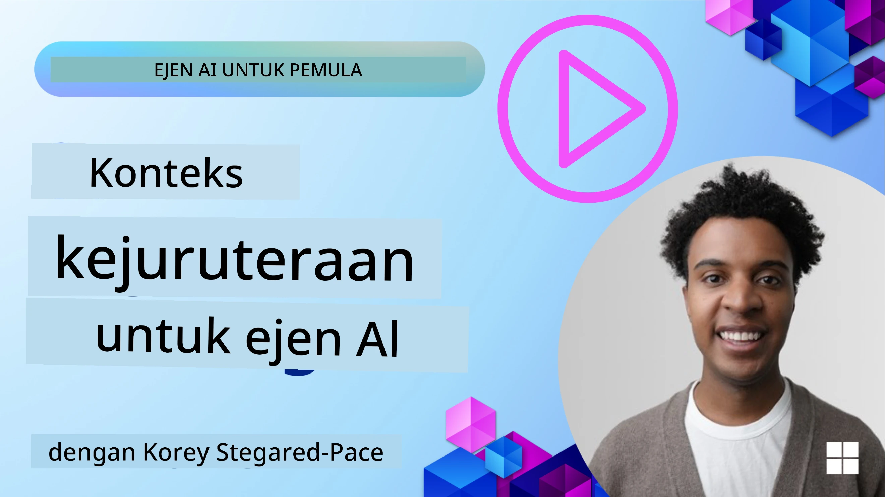
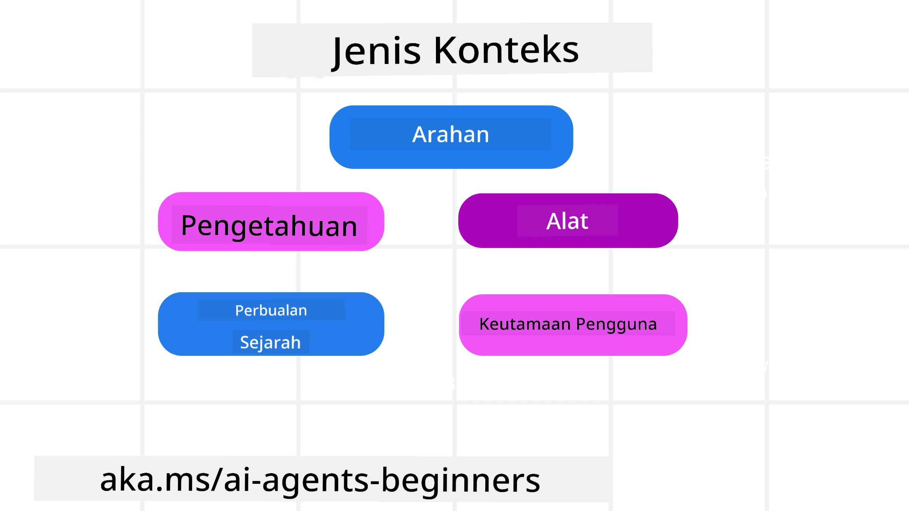
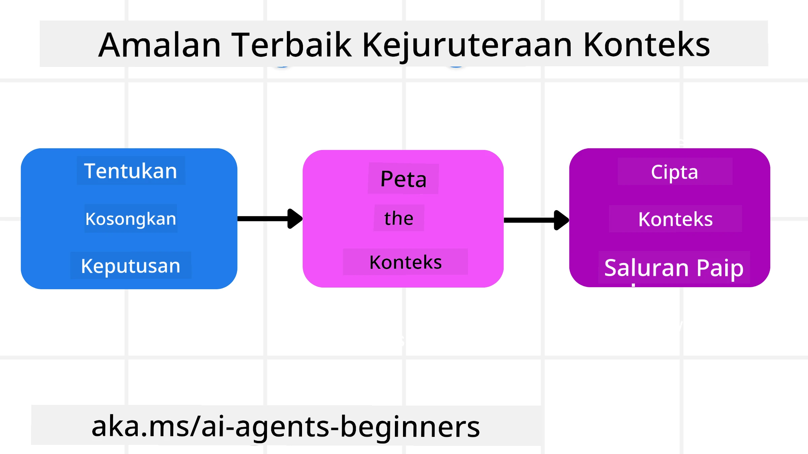

# Kejuruteraan Konteks untuk Ejen AI

> _(Klik imej di atas untuk menonton video pelajaran ini)_

Memahami kerumitan aplikasi yang anda bina ejen AI adalah penting untuk menghasilkan satu yang boleh dipercayai. Kita perlu membina Ejen AI yang mengurus maklumat dengan berkesan untuk menangani keperluan kompleks melebihi kejuruteraan arahan.

Dalam pelajaran ini, kita akan melihat apa itu kejuruteraan konteks dan peranannya dalam membina ejen AI.

## Pengenalan

Pelajaran ini akan merangkumi:

• **Apakah Kejuruteraan Konteks** dan mengapa ia berbeza daripada kejuruteraan arahan.

• **Strategi untuk Kejuruteraan Konteks yang Berkesan**, termasuk cara menulis, memilih, memampatkan, dan mengasingkan maklumat.

• **Kegagalan Konteks Biasa** yang boleh menggagalkan ejen AI anda dan bagaimana untuk membaikinya.

## Matlamat Pembelajaran

Selepas menamatkan pelajaran ini, anda akan memahami bagaimana untuk:

• **Mendefinisikan kejuruteraan konteks** dan membezakannya dengan kejuruteraan arahan.

• **Mengenal pasti komponen utama konteks** dalam aplikasi Model Bahasa Besar (LLM).

• **Mengaplikasi strategi untuk menulis, memilih, memampat, dan mengasingkan konteks** untuk meningkatkan prestasi ejen.

• **Mengenal pasti kegagalan konteks biasa** seperti pencemaran, gangguan, kekeliruan, dan pertentangan, serta melaksanakan teknik mitigasi.

## Apa itu Kejuruteraan Konteks?

Bagi Ejen AI, konteks adalah apa yang memacu perancangan Ejen AI untuk mengambil tindakan tertentu. Kejuruteraan Konteks adalah amalan memastikan Ejen AI mempunyai maklumat yang betul untuk menyelesaikan langkah seterusnya dalam tugasan. Tingkap konteks adalah terhad saiznya, jadi sebagai pembina ejen, kita perlu membina sistem dan proses untuk mengurus menambah, membuang, dan memadatkan maklumat dalam tingkap konteks.

### Kejuruteraan Arahan vs Kejuruteraan Konteks

Kejuruteraan arahan tertumpu kepada satu set arahan statik untuk membimbing Ejen AI dengan sekumpulan peraturan. Kejuruteraan konteks pula adalah cara mengurus set maklumat dinamik, termasuk arahan awal, untuk memastikan Ejen AI mempunyai apa yang diperlukan dari masa ke masa. Idea utama di sebalik kejuruteraan konteks adalah menjadikan proses ini boleh diulang dan boleh dipercayai.

### Jenis Konteks

Penting untuk diingat bahawa konteks bukan hanya satu perkara sahaja. Maklumat yang diperlukan Ejen AI boleh datang dari pelbagai sumber berlainan dan terpulang kepada kita untuk memastikan ejen mempunyai akses ke sumber ini:

Jenis konteks yang mungkin perlu diurus oleh ejen AI termasuk:

• **Arahan:** Ini adalah seperti "peraturan" ejen – arahan, mesej sistem, contoh few-shot (menunjukkan cara melakukan sesuatu kepada AI), dan penerangan alat yang boleh digunakannya. Di sinilah fokus kejuruteraan arahan bergabung dengan kejuruteraan konteks.

• **Pengetahuan:** Meliputi fakta, maklumat yang diperoleh dari pangkalan data, atau memori jangka panjang yang telah dikumpulkan oleh ejen. Ini termasuk mengintegrasikan sistem Retrieval Augmented Generation (RAG) jika ejen memerlukan akses ke pelbagai pangkalan pengetahuan dan pangkalan data.

• **Alat:** Ini adalah definisi fungsi luaran, API dan Server MCP yang boleh dipanggil oleh ejen, bersama dengan maklum balas (hasil) yang diperoleh dari penggunaannya.

• **Sejarah Perbualan:** Dialog yang sedang berlangsung dengan pengguna. Seiring masa berlalu, perbualan ini menjadi lebih panjang dan kompleks yang bermakna ia mengambil ruang dalam tingkap konteks.

• **Keutamaan Pengguna:** Maklumat yang dipelajari mengenai suka atau tidak suka pengguna dari masa ke masa. Ia boleh disimpan dan dipanggil apabila membuat keputusan penting untuk membantu pengguna.

## Strategi untuk Kejuruteraan Konteks yang Berkesan

### Strategi Perancangan

Kejuruteraan konteks yang baik bermula dengan perancangan yang baik. Berikut adalah pendekatan yang akan membantu anda mula berfikir bagaimana untuk mengaplikasikan konsep kejuruteraan konteks:

1. **Tentukan Hasil yang Jelas** - Hasil tugasan yang akan diberikan kepada Ejen AI harus didefinisikan dengan jelas. Jawab soalan - "Bagaimanakah dunia akan kelihatan apabila Ejen AI selesai dengan tugasan itu?" Dengan kata lain, apa perubahan, maklumat, atau respons yang pengguna harus terima selepas berinteraksi dengan Ejen AI.
2. **Peta Konteks** - Setelah anda mendefinisikan hasil Ejen AI, anda perlu menjawab soalan "Apakah maklumat yang Ejen AI perlukan untuk menyelesaikan tugasan ini?". Dengan cara ini anda boleh mula memetakan konteks di mana maklumat itu boleh ditemui.
3. **Bina Saluran Konteks** - Sekarang anda tahu di mana maklumat itu berada, anda perlu menjawab soalan "Bagaimanakah Ejen akan mendapat maklumat ini?". Ini boleh dilakukan dalam pelbagai cara termasuk RAG, penggunaan server MCP dan alat-alat lain.

### Strategi Praktikal

Perancangan penting tetapi setelah maklumat mula masuk ke dalam tingkap konteks ejen kita, kita perlu mempunyai strategi praktikal untuk mengurusnya:

#### Mengurus Konteks

Walaupun sesetengah maklumat akan ditambah ke tingkap konteks secara automatik, kejuruteraan konteks adalah tentang mengambil peranan lebih aktif terhadap maklumat ini yang boleh dilakukan melalui beberapa strategi:

 1. **Scratchpad Ejen**  
 Ini membolehkan Ejen AI mengambil nota tentang maklumat berkaitan dengan tugasan semasa dan interaksi pengguna dalam satu sesi. Ini harus wujud di luar tingkap konteks dalam fail atau objek runtime yang boleh dipanggil semula oleh ejen sepanjang sesi ini jika perlu.

 2. **Memori**  
 Scratchpad bagus untuk mengurus maklumat di luar tingkap konteks bagi satu sesi. Memori membolehkan ejen menyimpan dan mengambil maklumat berkaitan merentasi pelbagai sesi. Ini boleh termasuk ringkasan, keutamaan pengguna dan maklum balas untuk penambahbaikan masa depan.

 3. **Memampatkan Konteks**  
  Apabila tingkap konteks membesar dan hampir mencapai hadnya, teknik seperti meringkaskan dan memangkas boleh digunakan. Ini termasuk sama ada menyimpan hanya maklumat yang paling relevan atau membuang mesej lama.
  
 4. **Sistem Multi-Ejen**  
  Membangun sistem multi-ejen adalah satu bentuk kejuruteraan konteks kerana setiap ejen mempunyai tingkap konteks sendiri. Bagaimana konteks itu dikongsi dan disampaikan kepada ejen yang berbeza adalah satu lagi perkara yang perlu dirancang ketika membina sistem ini.
  
 5. **Persekitaran Sandbox**  
  Jika ejen perlu menjalankan sesetengah kod atau memproses sejumlah besar maklumat dalam dokumen, ini boleh mengambil banyak token untuk memproses hasilnya. Daripada menyimpan semua ini dalam tingkap konteks, ejen boleh menggunakan persekitaran sandbox yang boleh menjalankan kod ini dan hanya membaca hasil dan maklumat relevan lain.
  
 6. **Objek Keadaan Runtime**  
   Ini dilakukan dengan mencipta bekas maklumat untuk mengurus situasi apabila Ejen perlu mempunyai akses kepada maklumat tertentu. Untuk tugasan yang kompleks, ini membolehkan Ejen menyimpan hasil setiap sub-tugasan satu demi satu, membolehkan konteks kekal dihubungkan hanya kepada sub-tugasan tersebut.

#### Memeriksa Konteks

Selepas anda menggunakan salah satu strategi ini, adalah berbaloi untuk menyemak apa yang sebenarnya diterima panggilan model seterusnya. Soalan debugging yang berguna adalah:

> Adakah ejen memuatkan terlalu banyak konteks, konteks yang salah, atau terlepas konteks yang diperlukan?

Anda tidak perlu merekodkan arahan mentah, output alat, atau kandungan memori untuk menjawab soalan itu. Dalam pengeluaran, utamakan rekod pemeriksaan konteks kecil yang menangkap kiraan, ID, hash, dan label polisi:

- **Pemilihan:** Jejaki berapa banyak kepingan calon, alat, atau memori yang dipertimbangkan, berapa banyak yang dipilih, dan peraturan atau skor mana yang menyebabkan yang lain ditapis.
- **Pemampatan:** Rekodkan jangka sumber atau ID jejak, ID ringkasan, anggaran kiraan token sebelum dan selepas pemampatan, dan sama ada kandungan mentah dikecualikan dari panggilan seterusnya.
- **Pengasingan:** Catatkan sub-tugasan mana yang dijalankan dalam ejen, sesi, atau sandbox berasingan, ringkasan berikat yang dikembalikan, dan sama ada output alat besar kekal di luar konteks utama ejen induk.
- **Memori dan RAG:** Simpan ID dokumen pengambilan, ID memori, skor, ID yang dipilih, dan status pengeditan dan bukannya teks penuh yang diambil.
- **Keselamatan dan privasi:** Utamakan hash, ID, baldi token, dan label polisi berbanding teks arahan sensitif, argumen alat, hasil alat, atau badan memori pengguna.

Matlamatnya bukan untuk menyimpan lebih banyak konteks. Ia adalah untuk meninggalkan bukti yang cukup supaya pembangun dapat memberitahu strategi konteks mana yang dijalankan dan sama ada ia mengubah panggilan model seterusnya dengan cara yang dimaksudkan.

### Contoh Kejuruteraan Konteks

Katakan kita mahu ejen AI untuk **"Tempahkan saya perjalanan ke Paris."**

• Ejen mudah yang hanya menggunakan kejuruteraan arahan mungkin hanya memberi jawapan: **"Baik, bila anda ingin pergi ke Paris?**". Ia hanya memproses soalan langsung anda pada masa pengguna bertanya.

• Ejen yang menggunakan strategi kejuruteraan konteks yang dibincangkan akan melakukan lebih banyak lagi. Sebelum menjawab, sistemnya mungkin:

  ◦ **Semak kalendar anda** untuk tarikh yang ada (mengambil data masa nyata).

 ◦ **Kenang keutamaan perjalanan lalu** (dari memori jangka panjang) seperti syarikat penerbangan kegemaran, bajet, atau sama ada anda lebih suka penerbangan terus.

 ◦ **Kenal pasti alat yang tersedia** untuk tempahan penerbangan dan hotel.

- Kemudian, contoh jawapan mungkin:  "Hai [Nama Anda]! Saya lihat anda bebas pada minggu pertama Oktober. Perlukah saya cari penerbangan terus ke Paris dengan [Syarikat Penerbangan Pilihan] dalam bajet biasa anda [Bajet]?". Respons yang lebih kaya dan sedar konteks ini menunjukkan kuasa kejuruteraan konteks.

## Kegagalan Konteks Biasa

### Pencemaran Konteks

**Apa itu:** Apabila halusinasi (maklumat palsu yang dijana oleh LLM) atau kesilapan memasuki konteks dan dirujuk berulang kali, menyebabkan ejen mengejar matlamat yang mustahil atau membangunkan strategi yang tidak masuk akal.

**Apa yang perlu dibuat:** Laksanakan **pengesahan konteks** dan **kuarantin**. Sahkan maklumat sebelum dimasukkan ke dalam memori jangka panjang. Jika potensi pencemaran dikesan, mulakan benang konteks baru untuk mengelakkan maklumat buruk merebak.

**Contoh Tempahan Perjalanan:** Ejen anda berhalusinasi tentang **penerbangan terus dari lapangan terbang tempatan kecil ke bandar antarabangsa jauh** yang sebenarnya tidak menawarkan penerbangan antarabangsa. Butiran penerbangan yang tidak wujud ini disimpan dalam konteks. Kemudian, apabila anda minta ejen tempah, ia terus cuba mencari tiket untuk laluan mustahil ini, mengakibatkan kesilapan berulang.

**Penyelesaian:** Laksanakan langkah yang **mengesahkan kewujudan dan laluan penerbangan dengan API masa nyata** _sebelum_ menambah butiran penerbangan ke konteks kerja ejen. Jika pengesahan gagal, maklumat salah itu "dikarantin" dan tidak digunakan lagi.

### Gangguan Konteks

**Apa itu:** Apabila konteks menjadi sangat besar sehingga model terlalu fokus pada sejarah terkumpul dan bukannya menggunakan apa yang dipelajari semasa latihan, menyebabkan tindakan berulang atau tidak membantu. Model mungkin mula membuat kesilapan walaupun sebelum tingkap konteks penuh.

**Apa yang perlu dibuat:** Gunakan **peringkasan konteks**. Secara berkala mampatkan maklumat yang terkumpul ke dalam ringkasan lebih pendek, menyimpan butiran penting sambil menghapus sejarah berulang. Ini membantu "reset" fokus.

**Contoh Tempahan Perjalanan:** Anda telah berbincang tentang pelbagai destinasi impian untuk jangka masa yang lama, termasuk kisah terperinci tentang pengembaraan backpacking dua tahun lalu. Apabila akhirnya anda minta **"cari penerbangan murah untuk bulan hadapan,"** ejen terperangkap dengan butiran lama yang tidak relevan dan terus bertanya tentang peralatan backpacking anda atau jadual perjalanan lama, mengabaikan permintaan semasa anda.

**Penyelesaian:** Selepas beberapa pusingan atau apabila konteks membesar terlalu besar, ejen harus **meringkaskan bahagian perbualan yang paling terkini dan relevan** – memfokuskan pada tarikh dan destinasi perjalanan anda sekarang – dan menggunakan ringkasan dipadatkan itu untuk panggilan LLM seterusnya, membuang sembang sejarah yang kurang relevan.

### Kekeliruan Konteks

**Apa itu:** Apabila konteks yang tidak perlu, sering dalam bentuk terlalu banyak alat tersedia, menyebabkan model menjana respon yang buruk atau memanggil alat yang tidak relevan. Model yang lebih kecil terutamanya mudah terdedah kepada ini.

**Apa yang perlu dibuat:** Laksanakan **pengurusan pemilihan alat** menggunakan teknik RAG. Simpan penerangan alat dalam pangkalan data vektor dan pilih _hanya_ alat yang paling relevan untuk setiap tugasan khusus. Kajian menunjukkan mengehadkan pilihan alat kepada kurang dari 30.

**Contoh Tempahan Perjalanan:** Ejen anda mempunyai akses ke puluhan alat: `book_flight`, `book_hotel`, `rent_car`, `find_tours`, `currency_converter`, `weather_forecast`, `restaurant_reservations`, dan lain-lain. Anda bertanya, **"Apakah cara terbaik untuk bergerak sekitar Paris?"** Disebabkan terlalu banyak alat, ejen menjadi keliru dan cuba memanggil `book_flight` _dalam_ Paris, atau `rent_car` walaupun anda lebih suka pengangkutan awam, kerana penerangan alat mungkin bertindih atau ia tidak dapat membezakan yang terbaik.

**Penyelesaian:** Gunakan **RAG ke atas penerangan alat**. Apabila anda bertanya tentang cara bergerak sekitar Paris, sistem secara dinamik mengambil _hanya_ alat yang paling relevan seperti `rent_car` atau `public_transport_info` berdasarkan pertanyaan anda, membentangkan "bekalan" alat yang fokus kepada LLM.

### Pertentangan Konteks

**Apa itu:** Apabila maklumat yang bertentangan wujud dalam konteks, menyebabkan penalaran tidak konsisten atau respon akhir yang buruk. Ini sering terjadi apabila maklumat tiba secara berperingkat, dan andaian awal yang salah kekal dalam konteks.

**Apa yang perlu dibuat:** Gunakan **pemangkasan konteks** dan **pemindahan beban**. Pemangkasan bermaksud membuang maklumat lama atau bertentangan apabila butiran baru tiba. Pemindahan beban memberikan model ruang kerja "scratchpad" berasingan untuk memproses maklumat tanpa mengacau konteks utama.
**Contoh Tempahan Perjalanan:** Anda pada mulanya memberitahu ejen anda, **"Saya mahu terbang kelas ekonomi."** Kemudian dalam perbualan, anda berubah fikiran dan berkata, **"Sebenarnya, untuk perjalanan ini, mari pilih kelas perniagaan."** Jika kedua arahan tersebut kekal dalam konteks, ejen mungkin menerima hasil carian yang bertentangan atau keliru tentang keutamaan yang mana hendak diutamakan.

**Penyelesaian:** Laksanakan **pemangkasan konteks**. Apabila arahan baru bertentangan dengan yang lama, arahan lama itu dikeluarkan atau secara jelas digantikan dalam konteks. Sebagai alternatif, ejen boleh menggunakan **scratchpad** untuk menyelaraskan keutamaan yang bertentangan sebelum membuat keputusan, memastikan hanya arahan akhir yang konsisten digunakan untuk membimbing tindakannya.

## Ada Lagi Soalan Tentang Kejuruteraan Konteks?

Sertai [Microsoft Foundry Discord](https://aka.ms/ai-agents/discord) untuk bertemu dengan pelajar lain, menghadiri waktu pejabat dan mendapatkan jawapan untuk soalan AI Agents anda.

---

<!-- CO-OP TRANSLATOR DISCLAIMER START -->
**Penafian**:
Dokumen ini telah diterjemahkan menggunakan perkhidmatan terjemahan AI [Co-op Translator](https://github.com/Azure/co-op-translator). Walaupun kami berusaha untuk ketepatan, sila ambil maklum bahawa terjemahan automatik mungkin mengandungi kesilapan atau ketidaktepatan. Dokumen asal dalam bahasa asalnya harus dianggap sebagai sumber yang sahih. Untuk maklumat penting, terjemahan oleh manusia profesional adalah disyorkan. Kami tidak bertanggungjawab terhadap sebarang salah faham atau salah tafsir yang timbul daripada penggunaan terjemahan ini.
<!-- CO-OP TRANSLATOR DISCLAIMER END -->