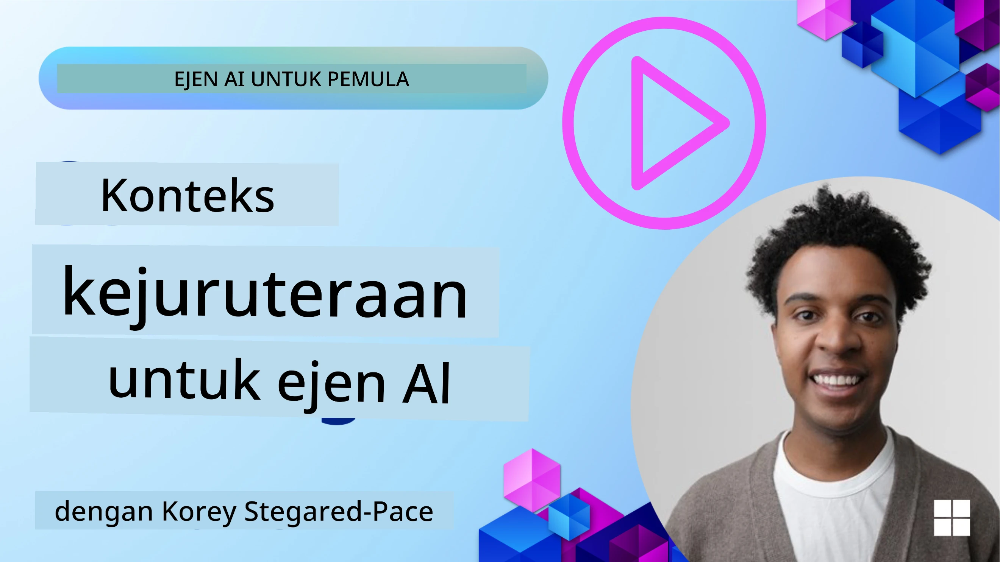
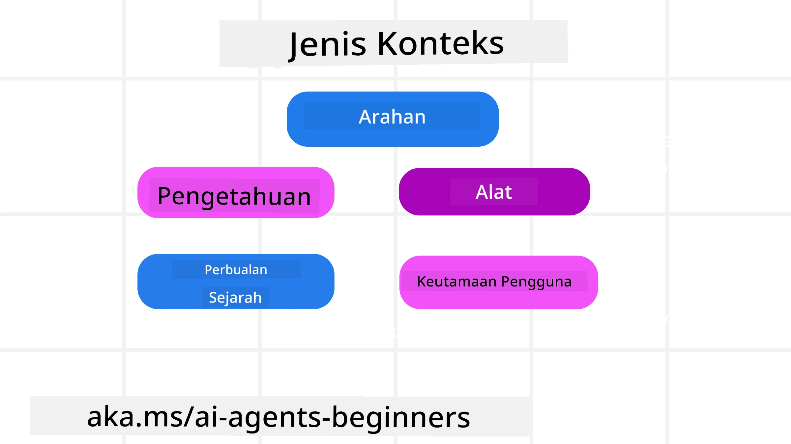
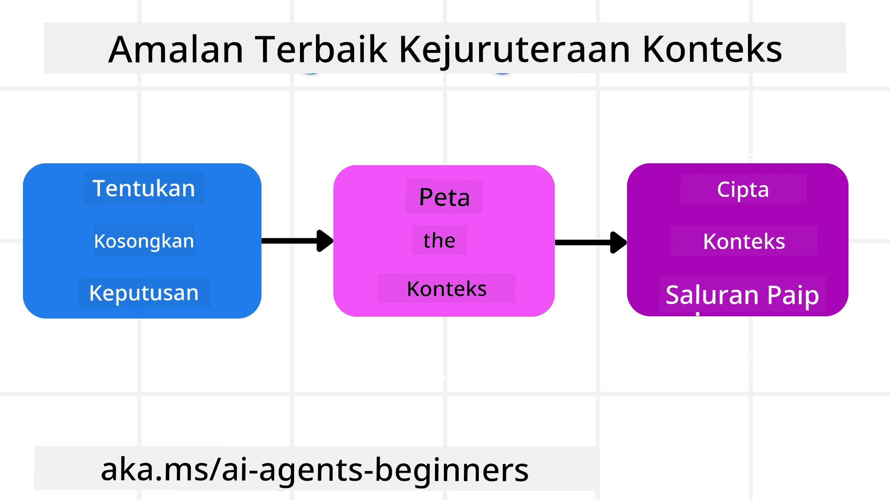

# Kejuruteraan Konteks untuk Ejen AI

> _(Klik imej di atas untuk menonton video pelajaran ini)_

Memahami kerumitan aplikasi yang anda bina untuk ejen AI adalah penting untuk menghasilkan yang boleh dipercayai. Kita perlu membina Ejen AI yang menguruskan maklumat dengan berkesan untuk memenuhi keperluan kompleks yang melangkaui kejuruteraan prompt.

Dalam pelajaran ini, kita akan melihat apa itu kejuruteraan konteks dan peranannya dalam membina ejen AI.

## Pengenalan

Pelajaran ini akan merangkumi:

• **Apa itu Kejuruteraan Konteks** dan mengapa ia berbeza daripada kejuruteraan prompt.

• **Strategi untuk Kejuruteraan Konteks yang berkesan**, termasuk cara menulis, memilih, memampatkan, dan mengasingkan maklumat.

• **Kegagalan Konteks yang Biasa** yang boleh menggagalkan ejen AI anda dan cara membaikinya.

## Matlamat Pembelajaran

Selepas melengkapkan pelajaran ini, anda akan faham bagaimana untuk:

• **Mentakrif kejuruteraan konteks** dan membezakannya daripada kejuruteraan prompt.

• **Mengenal pasti komponen utama konteks** dalam aplikasi Model Bahasa Besar (LLM).

• **Mengaplikasi strategi untuk menulis, memilih, memampatkan, dan mengasingkan konteks** bagi meningkatkan prestasi ejen.

• **Mengenal pasti kegagalan konteks biasa** seperti pencemaran, gangguan, kekeliruan, dan pertentangan, serta melaksanakan teknik mitigasi.

## Apa itu Kejuruteraan Konteks?

Untuk Ejen AI, konteks adalah apa yang mendorong perancangan Ejen AI untuk mengambil tindakan tertentu. Kejuruteraan Konteks adalah amalan memastikan Ejen AI mempunyai maklumat yang betul untuk menyelesaikan langkah seterusnya dalam tugasan. Tetingkap konteks adalah terhad saiznya, jadi sebagai pembina agen kita perlu membina sistem dan proses untuk mengurus menambah, mengeluarkan, dan memampatkan maklumat dalam tetingkap konteks.

### Kejuruteraan Prompt vs Kejuruteraan Konteks

Kejuruteraan prompt memfokuskan pada satu set arahan statik untuk membimbing Ejen AI dengan sekumpulan peraturan yang berkesan. Kejuruteraan konteks adalah bagaimana menguruskan set maklumat dinamik, termasuk prompt awal, untuk memastikan Ejen AI mempunyai apa yang diperlukan sepanjang masa. Idea utama kejuruteraan konteks adalah menjadikan proses ini berulang dan boleh dipercayai.

### Jenis-jenis Konteks

Penting untuk diingat bahawa konteks bukan hanya satu perkara. Maklumat yang diperlukan oleh Ejen AI boleh datang dari pelbagai sumber dan terpulang kepada kita untuk memastikan ejen mempunyai akses kepada sumber-sumber ini:

Jenis-jenis konteks yang mungkin perlu diurus oleh ejen AI termasuk:

• **Arahan:** Ini seperti "peraturan" ejen – prompt, mesej sistem, contoh few-shot (menunjukkan cara AI melakukan sesuatu), dan penerangan alat yang boleh digunakannya. Ini adalah tempat tumpuan kejuruteraan prompt digabung dengan kejuruteraan konteks.

• **Pengetahuan:** Ini merangkumi fakta, maklumat yang diambil dari pangkalan data, atau memori jangka panjang yang telah dikumpulkan oleh ejen. Ini termasuk integrasi sistem Retrieval Augmented Generation (RAG) jika ejen perlu mengakses stor pengetahuan dan pangkalan data yang berbeza.

• **Alat:** Ini adalah definisi fungsi luaran, API dan MCP Server yang ejen boleh panggil, bersama dengan maklum balas (hasil) yang diperolehi daripada menggunakannya.

• **Sejarah Perbualan:** Dialog yang sedang berlangsung dengan pengguna. Apabila masa berlalu, perbualan ini menjadi lebih panjang dan kompleks yang bermaksud ia mengambil ruang dalam tetingkap konteks.

• **Keutamaan Pengguna:** Maklumat yang dipelajari tentang kesukaan atau ketidaksukaan pengguna dari masa ke masa. Ini boleh disimpan dan dipanggil semasa membuat keputusan utama untuk membantu pengguna.

## Strategi untuk Kejuruteraan Konteks yang Berkesan

### Strategi Perancangan

Kejuruteraan konteks yang baik bermula dengan perancangan yang baik. Berikut adalah pendekatan yang akan membantu anda mula memikirkan cara menggunakan konsep kejuruteraan konteks:

1. **Tentukan Keputusan yang Jelas** - Keputusan tugasan yang akan diberikan kepada Ejen AI haruslah ditakrifkan dengan jelas. Jawab soalan - "Bagaimana dunia akan kelihatan apabila Ejen AI selesai dengan tugasan?" Dengan kata lain, apakah perubahan, maklumat, atau respons yang pengguna akan terima selepas berinteraksi dengan Ejen AI.
2. **Peta Konteks** - Setelah anda mentakrif keputusan Ejen AI, anda perlu menjawab soalan "Apakah maklumat yang diperlukan oleh Ejen AI untuk melengkapkan tugasan ini?". Dengan cara ini anda boleh mula memetakan konteks di mana maklumat itu boleh ditemui.
3. **Cipta Saluran Konteks** - Setelah anda tahu di mana maklumat itu, anda perlu menjawab soalan "Bagaimana Ejen akan mendapatkan maklumat ini?". Ini boleh dilakukan dalam pelbagai cara termasuk RAG, penggunaan pelayan MCP dan alat lain.

### Strategi Praktikal

Perancangan adalah penting tetapi setelah maklumat mula mengalir ke dalam tetingkap konteks ejen kita, kita perlu mempunyai strategi praktikal untuk mengurusnya:

#### Menguruskan Konteks

Walaupun beberapa maklumat akan ditambah ke tetingkap konteks secara automatik, kejuruteraan konteks adalah tentang mengambil peranan yang lebih aktif terhadap maklumat ini yang boleh dilakukan dengan beberapa strategi:

 1. **Notebook Ejen**
 Ini membolehkan Ejen AI mencatat nota tentang maklumat yang relevan mengenai tugasan dan interaksi pengguna semasa satu sesi sahaja. Ini harus wujud di luar tetingkap konteks dalam fail atau objek runtime yang ejen boleh dapatkan semula semasa sesi itu jika perlu.

 2. **Memori**
 Notebook sesuai untuk mengurus maklumat di luar tetingkap konteks sesi tunggal. Memori membolehkan ejen menyimpan dan mendapatkan semula maklumat relevan merentas beberapa sesi. Ini boleh termasuk ringkasan, keutamaan pengguna dan maklum balas untuk penambahbaikan masa depan.

 3. **Memampatkan Konteks**
  Setelah tetingkap konteks membesar dan hampir mencapai hadnya, teknik seperti merumus dan memangkas boleh digunakan. Ini termasuk mengekalkan hanya maklumat paling relevan atau menghapuskan mesej lama.
  
 4. **Sistem Multi-Ejen**
  Membangunkan sistem multi-ejen adalah satu bentuk kejuruteraan konteks kerana setiap ejen mempunyai tetingkap konteksnya sendiri. Bagaimana konteks itu dikongsi dan disalurkan kepada ejen berlainan adalah satu lagi perkara yang perlu dirancang apabila membina sistem ini.
  
 5. **Persekitaran Sandbox**
  Jika ejen perlu menjalankan beberapa kod atau memproses sejumlah besar maklumat dalam dokumen, ini boleh mengambil banyak token untuk memproses hasilnya. Daripada menyimpan semuanya dalam tetingkap konteks, ejen boleh menggunakan persekitaran sandbox yang dapat menjalankan kod ini dan hanya membaca hasil dan maklumat relevan lain.
  
 6. **Objek Status Runtime**
   Ini dilakukan dengan mencipta bekas maklumat untuk mengurus situasi apabila Ejen perlu mendapat akses kepada maklumat tertentu. Untuk tugasan kompleks, ini membolehkan Ejen menyimpan hasil setiap subtugas langkah demi langkah, membolehkan konteks kekal terhubung hanya dengan subtugas tersebut.

#### Memeriksa Konteks

Selepas anda menggunakan salah satu strategi ini, adalah berbaloi untuk menyemak apa yang sebenarnya diterima oleh panggilan model seterusnya. Soalan debugging yang berguna ialah:

> Adakah ejen memuatkan konteks terlalu banyak, konteks yang salah, atau terlepas konteks yang ia perlukan?

Anda tidak perlu merekod prompt mentah, output alat, atau kandungan memori untuk menjawab soalan itu. Dalam pengeluaran, lebih baik menggunakan rekod pemeriksaan konteks kecil yang menangkap bilangan, ID, hash, dan label polisi:

- **Pemilihan:** Jejak berapa banyak bahagian calon, alat, atau memori dipertimbangkan, berapa banyak dipilih, dan peraturan atau skor mana yang menyebabkan yang lain ditapis keluar.
- **Pemampatan:** Rekod jangkauan sumber atau ID jejak, ID ringkasan, anggaran bilangan token sebelum dan selepas pemampatan, dan sama ada kandungan mentah dikecualikan daripada panggilan seterusnya.
- **Pengasingan:** Catat subtugas mana yang dijalankan dalam ejen berasingan, sesi, atau sandbox, ringkasan terhad apa yang dikembalikan, dan sama ada output alat besar kekal di luar konteks ejen induk.
- **Memori dan RAG:** Simpan ID dokumen pengambilan, ID memori, skor, ID terpilih, dan status redaksi dan bukannya teks penuh yang diperoleh semula.
- **Keselamatan dan privasi:** Gunakan hash, ID, baldi token, dan label polisi sebagai ganti teks prompt sensitif, argumen alat, hasil alat, atau kandungan memori pengguna.

Matlamatnya bukan untuk menyimpan lebih banyak konteks. Matlamatnya adalah untuk meninggalkan cukup bukti supaya pembangun dapat mengetahui strategi konteks mana yang dijalankan dan sama ada ia mengubah panggilan model seterusnya dengan cara yang dimaksudkan.

### Contoh Kejuruteraan Konteks

Katakan kita mahu ejen AI untuk **"Tempahkan saya perjalanan ke Paris."**

• Ejen mudah menggunakan hanya kejuruteraan prompt mungkin hanya membalas: **"Baik, bila anda mahu pergi ke Paris?"** Ia hanya memproses soalan langsung anda pada masa pengguna bertanya.

• Ejen yang menggunakan strategi kejuruteraan konteks yang dibincangkan akan melakukan lebih banyak. Sebelum menjawab, sistemnya mungkin:

  ◦ **Semak kalendar anda** untuk tarikh yang tersedia (mengambil data masa nyata).

 ◦ **Kenang keutamaan perjalanan lalu** (dari memori jangka panjang) seperti syarikat penerbangan pilihan anda, bajet, atau sama ada anda lebih suka penerbangan terus.

 ◦ **Kenal pasti alat yang tersedia** untuk tempahan penerbangan dan hotel.

- Kemudian, contoh respons boleh jadi: "Hai [Nama Anda]! Saya lihat anda lapang pada minggu pertama Oktober. Mahu saya cari penerbangan terus ke Paris dengan [Syarikat Penerbangan Pilihan] dalam anggaran bajet biasa anda [Bajet]?" Respons yang lebih kaya dan sedar konteks ini menunjukkan kuasa kejuruteraan konteks.

## Kegagalan Konteks yang Biasa

### Pencemaran Konteks

**Apa itu:** Apabila halusinasi (maklumat palsu yang dihasilkan oleh LLM) atau ralat memasuki konteks dan dirujuk berulang kali, menyebabkan ejen mengejar matlamat yang mustahil atau membangunkan strategi yang tidak masuk akal.

**Apa yang perlu dilakukan:** Laksanakan **pengesahan konteks** dan **kuarantin**. Sahkan maklumat sebelum ditambah ke memori jangka panjang. Jika pencemaran berpotensi dikesan, mulakan benang konteks baru untuk menghalang maklumat buruk merebak.

**Contoh Tempahan Perjalanan:** Ejen anda berhalusinasi tentang **penerbangan terus dari lapangan terbang kecil tempatan ke bandar antarabangsa jauh** yang sebenarnya tidak menawarkan penerbangan antarabangsa. Perincian penerbangan yang tidak wujud ini disimpan dalam konteks. Kemudian, apabila anda meminta ejen untuk menempah, ia terus cuba mencari tiket untuk laluan mustahil ini, menyebabkan ralat berulang.

**Penyelesaian:** Laksanakan langkah yang **mengesahkan kewujudan penerbangan dan laluan dengan API masa nyata** _sebelum_ menambah perincian penerbangan ke konteks kerja ejen. Jika pengesahan gagal, maklumat salah itu "dikuarantin" dan tidak digunakan lebih lanjut.

### Gangguan Konteks

**Apa itu:** Apabila konteks menjadi terlalu besar sehingga model terlalu memfokuskan pada sejarah terkumpul berbanding menggunakan apa yang dipelajarinya semasa latihan, menyebabkan tindakan berulang atau tidak membantu. Model mungkin mula membuat kesilapan walaupun sebelum tetingkap konteks penuh.

**Apa yang perlu dilakukan:** Gunakan **peringkasan konteks**. Secara berkala mampatkan maklumat terkumpul ke dalam ringkasan yang lebih pendek, mengekalkan butiran penting sambil membuang sejarah berulang. Ini membantu "menetapkan semula" fokus.

**Contoh Tempahan Perjalanan:** Anda telah berbincang tentang destinasi impian selama lama, termasuk penceritaan terperinci tentang perjalanan backpacking dua tahun lalu. Apabila anda akhirnya minta **"carikan saya penerbangan murah untuk bulan depan,"** ejen terbeban dengan butiran lama yang tidak relevan dan terus bertanya tentang peralatan backpacking atau jadual lama, mengabaikan permintaan semasa anda.

**Penyelesaian:** Selepas beberapa pusingan atau apabila konteks menjadi terlalu besar, ejen harus **meringkaskan bahagian perbualan terbaru dan relevan** – memfokus pada tarikh perjalanan dan destinasi anda yang sekarang – dan menggunakan ringkasan padat itu untuk panggilan LLM berikutnya, membuang sembang sejarah yang kurang relevan.

### Kekeliruan Konteks

**Apa itu:** Apabila konteks yang tidak perlu, selalunya dalam bentuk terlalu banyak alat tersedia, menyebabkan model menghasilkan respons buruk atau memanggil alat yang tidak relevan. Model yang lebih kecil terutamanya cenderung kepada ini.

**Apa yang perlu dilakukan:** Laksanakan **pengurusan beban alat** menggunakan teknik RAG. Simpan penerangan alat dalam pangkalan data vektor dan pilih _hanya_ alat paling relevan untuk setiap tugasan tertentu. Kajian menunjukkan mengehadkan pilihan alat kepada kurang dari 30.

**Contoh Tempahan Perjalanan:** Ejen anda mempunyai akses kepada puluhan alat: `tempah_penerbangan`, `tempah_hotel`, `sewa_kereta`, `cari_tur`, `penukar_mata_wang`, `ramalan_cuaca`, `tempahan_restoran`, dan lain-lain. Anda bertanya, **"Apa cara terbaik untuk bergerak sekitar Paris?"** Disebabkan jumlah alat yang banyak, ejen keliru dan cuba memanggil `tempah_penerbangan` _di dalam_ Paris, atau `sewa_kereta` walaupun anda lebih suka pengangkutan awam, kerana penerangan alat mungkin bertindih atau ia tidak dapat membezakan mana yang terbaik.

**Penyelesaian:** Gunakan **RAG atas penerangan alat**. Apabila anda bertanya tentang cara bergerak di Paris, sistem secara dinamik mengambil _hanya_ alat paling relevan seperti `sewa_kereta` atau `info_pengangkutan_awam` berdasarkan pertanyaan anda, mempersembahkan "beban" alat fokus kepada LLM.

### Pertentangan Konteks

**Apa itu:** Apabila maklumat bertentangan wujud dalam konteks, menyebabkan penalaran tidak konsisten atau respons akhir yang buruk. Ini sering berlaku apabila maklumat sampai secara berperingkat, dan andaian awal yang salah kekal dalam konteks.

**Apa yang perlu dilakukan:** Gunakan **pemangkasan konteks** dan **pemindahan keluar**. Pemangkasan bermaksud mengeluarkan maklumat yang lapuk atau bertentangan apabila maklumat baru tiba. Pemindahan keluar memberikan model ruang kerja "notebook" berasingan untuk memproses maklumat tanpa mengacau konteks utama.

**Contoh Tempahan Perjalanan:** Pada mulanya anda memberitahu ejen anda, **"Saya mahu terbang kelas ekonomi."** Kemudian dalam perbualan, anda berubah fikiran dan berkata, **"Sebenarnya, untuk perjalanan ini, kita pergi kelas perniagaan."** Jika kedua-dua arahan kekal dalam konteks, ejen mungkin menerima keputusan carian yang bercanggah atau keliru tentang keutamaan yang harus diutamakan.

**Penyelesaian:** Laksanakan **pemangkasan konteks**. Apabila arahan baru bertentangan dengan arahan lama, arahan lama itu dibuang atau secara eksplisit digantikan dalam konteks. Sebagai alternatif, ejen boleh menggunakan **scratchpad** untuk menyelesaikan pertentangan keutamaan sebelum membuat keputusan, memastikan hanya arahan akhir yang konsisten membimbing tindakannya.

## Ada Lagi Soalan Tentang Kejuruteraan Konteks?

Sertai [Microsoft Foundry Discord](https://discord.com/invite/ATgtXmAS5D) untuk berjumpa dengan pelajar lain, menghadiri waktu pejabat dan dapatkan soalan Agen AI anda dijawab.

---

<!-- CO-OP TRANSLATOR DISCLAIMER START -->
**Penafian**:
Dokumen ini telah diterjemahkan menggunakan perkhidmatan terjemahan AI [Co-op Translator](https://github.com/Azure/co-op-translator). Walaupun kami berusaha untuk ketepatan, sila ambil maklum bahawa terjemahan automatik mungkin mengandungi kesilapan atau ketidaktepatan. Dokumen asal dalam bahasa asalnya harus dianggap sebagai sumber yang sahih. Untuk maklumat penting, terjemahan oleh manusia profesional adalah disyorkan. Kami tidak bertanggungjawab terhadap sebarang salah faham atau salah tafsir yang timbul daripada penggunaan terjemahan ini.
<!-- CO-OP TRANSLATOR DISCLAIMER END -->