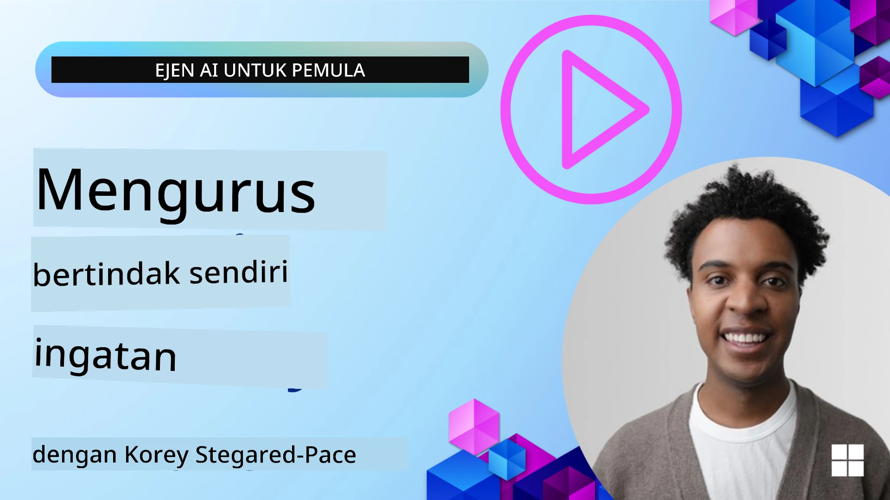

# Memori untuk Ejen AI  

Apabila membincangkan manfaat unik mencipta Ejen AI, dua perkara utama dibincangkan: kebolehan memanggil alat untuk melengkapkan tugas dan kebolehan untuk memperbaiki diri dari masa ke masa. Memori adalah asas dalam mencipta ejen yang boleh memperbaiki diri sendiri yang dapat menyediakan pengalaman yang lebih baik untuk pengguna kita.

Dalam pelajaran ini, kita akan melihat apa itu memori untuk Ejen AI dan bagaimana kita dapat menguruskannya serta menggunakannya untuk manfaat aplikasi kita.

## Pengenalan

Pelajaran ini akan merangkumi:

• **Memahami Memori Ejen AI**: Apa itu memori dan mengapa ia penting untuk ejen.

• **Melaksanakan dan Menyimpan Memori**: Kaedah praktikal untuk menambah kemampuan memori kepada ejen AI anda, dengan fokus pada memori jangka pendek dan jangka panjang.

• **Menjadikan Ejen AI Memperbaiki Diri Sendiri**: Bagaimana memori membolehkan ejen belajar daripada interaksi lalu dan memperbaiki diri dari masa ke masa.

## Pelaksanaan Tersedia

Pelajaran ini termasuk dua tutorial buku nota yang komprehensif:

• **[13-agent-memory.ipynb](./13-agent-memory.ipynb)**: Melaksanakan memori menggunakan Mem0 dan Azure AI Search dengan Microsoft Agent Framework

• **[13-agent-memory-cognee.ipynb](./13-agent-memory-cognee.ipynb)**: Melaksanakan memori berstruktur menggunakan Cognee, secara automatik membina graf pengetahuan yang disokong oleh pembenaman, memvisualisasikan graf, dan pengambilan maklumat pintar

## Matlamat Pembelajaran

Selepas menamatkan pelajaran ini, anda akan tahu cara untuk:

• **Membezakan antara pelbagai jenis memori ejen AI**, termasuk memori kerja, jangka pendek, dan jangka panjang, serta bentuk khusus seperti memori persona dan episodik.

• **Melaksanakan dan mengurus memori jangka pendek dan jangka panjang untuk ejen AI** menggunakan Microsoft Agent Framework, memanfaatkan alat seperti Mem0, Cognee, memori Whiteboard, dan mengintegrasikannya dengan Azure AI Search.

• **Memahami prinsip di sebalik ejen AI yang memperbaiki diri sendiri** dan bagaimana sistem pengurusan memori yang kukuh menyumbang kepada pembelajaran berterusan dan penyesuaian.

## Memahami Memori Ejen AI

Pada dasarnya, **memori untuk ejen AI merujuk kepada mekanisme yang membolehkan mereka menyimpan dan mengingat maklumat**. Maklumat ini boleh jadi butiran khusus mengenai perbualan, keutamaan pengguna, tindakan lalu, atau bahkan corak yang telah dipelajari.

Tanpa memori, aplikasi AI seringkali tidak mempunyai status, bermakna setiap interaksi bermula dari kosong. Ini membawa kepada pengalaman pengguna yang berulang dan mengecewakan di mana ejen "lupa" konteks atau keutamaan terdahulu.

### Mengapa Memori Penting?

Kepintaran ejen sangat berkait dengan kebolehannya untuk mengingat dan menggunakan maklumat lalu. Memori membolehkan ejen menjadi:

• **Reflektif**: Belajar daripada tindakan dan hasil lalu.

• **Interaktif**: Mengekalkan konteks sepanjang perbualan yang sedang berlaku.

• **Proaktif dan Reaktif**: Mengantisipasi keperluan atau memberi respons yang sesuai berdasarkan data sejarah.

• **Autonomi**: Beroperasi dengan lebih berdikari dengan merujuk pengetahuan yang tersimpan.

Matlamat pelaksanaan memori adalah untuk membuat ejen lebih **boleh dipercayai dan berkemampuan**.

### Jenis Memori

#### Memori Kerja

Fikirkan ini sebagai sekeping kertas coretan yang digunakan ejen semasa melaksanakan satu tugas atau proses pemikiran yang sedang berlangsung. Ia memegang maklumat segera yang diperlukan untuk mengira langkah seterusnya.

Bagi ejen AI, memori kerja seringkali menangkap maklumat paling relevan dari perbualan, walaupun sejarah perbualan yang lengkap panjang atau dipendekkan. Ia menumpukan pada mengekstrak elemen penting seperti keperluan, cadangan, keputusan, dan tindakan.

**Contoh Memori Kerja**

Dalam ejen tempahan perjalanan, memori kerja mungkin menangkap permintaan pengguna semasa, seperti "Saya mahu menempah perjalanan ke Paris". Keperluan khusus ini dipegang dalam konteks segera ejen untuk membimbing interaksi semasa.

#### Memori Jangka Pendek

Jenis memori ini menyimpan maklumat untuk tempoh satu perbualan atau sesi. Ia adalah konteks perbualan semasa, membolehkan ejen merujuk kembali kepada giliran perbualan yang lalu.

**Contoh Memori Jangka Pendek**

Jika pengguna bertanya, "Berapa harga penerbangan ke Paris?" dan kemudian menyambung dengan "Bagaimana pula dengan penginapan di sana?", memori jangka pendek memastikan ejen tahu "di sana" merujuk kepada "Paris" dalam perbualan yang sama.

#### Memori Jangka Panjang

Ini adalah maklumat yang bertahan merentasi pelbagai perbualan atau sesi. Ia membolehkan ejen mengingati keutamaan pengguna, interaksi sejarah, atau pengetahuan umum dalam tempoh yang panjang. Ini penting untuk personalisasi.

**Contoh Memori Jangka Panjang**

Memori jangka panjang mungkin menyimpan bahawa "Ben gemar bermain ski dan aktiviti luar, suka kopi dengan pemandangan gunung, dan mahu mengelakkan cerun ski yang sukar disebabkan kecederaan lalu". Maklumat ini, yang dipelajari daripada interaksi terdahulu, mempengaruhi cadangan dalam sesi perancangan perjalanan yang akan datang, menjadikannya sangat diperibadikan.

#### Memori Persona

Jenis memori khusus ini membantu ejen membina "personaliti" atau "persona" yang konsisten. Ia membolehkan ejen mengingati butiran tentang dirinya atau peranan yang dimaksudkan, menjadikan interaksi lebih lancar dan fokus.

**Contoh Memori Persona**

Jika ejen perjalanan direka sebagai "perancang ski pakar," memori persona mungkin mengukuhkan peranan ini, mempengaruhi responsnya untuk selari dengan nada dan pengetahuan seorang pakar.

#### Memori Aliran Kerja/Episodik

Memori ini menyimpan urutan langkah yang diambil ejen semasa melaksanakan tugas kompleks, termasuk kejayaan dan kegagalan. Ia seperti mengingati "episod" tertentu atau pengalaman lalu untuk belajar daripadanya.

**Contoh Memori Episodik**

Jika ejen cuba menempah penerbangan tertentu tetapi gagal kerana tiada kekosongan, memori episodik boleh merekod kegagalan ini, membolehkan ejen cuba penerbangan alternatif atau memaklumkan pengguna tentang isu itu dengan cara yang lebih berinformasi semasa percubaan seterusnya.

#### Memori Entiti

Ini melibatkan pengekstrakan dan pengingatan entiti khusus (seperti orang, tempat, atau benda) dan peristiwa daripada perbualan. Ia membolehkan ejen membina pemahaman berstruktur tentang elemen utama yang dibincangkan.

**Contoh Memori Entiti**

Daripada perbualan tentang perjalanan lepas, ejen mungkin mengekstrak "Paris," "Menara Eiffel," dan "makan malam di restoran Le Chat Noir" sebagai entiti. Dalam interaksi masa depan, ejen boleh mengingati "Le Chat Noir" dan menawarkan untuk membuat tempahan baru di sana.

#### RAG Berstruktur (Retrieval Augmented Generation)

Walaupun RAG adalah teknik yang lebih luas, "RAG Berstruktur" diketengahkan sebagai teknologi memori yang berkuasa. Ia mengekstrak maklumat padat dan berstruktur dari pelbagai sumber (perbualan, emel, imej) dan menggunakannya untuk meningkatkan ketepatan, pengingatan, dan kelajuan dalam respons. Tidak seperti RAG klasik yang bergantung sepenuhnya pada persamaan semantik, RAG Berstruktur berfungsi dengan struktur maklumat yang sedia ada.

**Contoh RAG Berstruktur**

Daripada hanya memadankan kata kunci, RAG Berstruktur boleh mengurai butiran penerbangan (destinasi, tarikh, masa, syarikat penerbangan) daripada emel dan menyimpannya secara berstruktur. Ini membolehkan pertanyaan tepat seperti "Penerbangan mana yang saya tempah ke Paris pada hari Selasa?"

## Melaksanakan dan Menyimpan Memori

Melaksanakan memori untuk ejen AI melibatkan proses sistematik **pengurusan memori**, yang termasuk menjana, menyimpan, mengambil, mengintegrasi, mengemas kini, dan bahkan "melupakan" (atau memadam) maklumat. Pengambilan adalah aspek yang amat penting.

### Alat Memori Khusus

#### Mem0

Salah satu cara untuk menyimpan dan mengurus memori ejen adalah menggunakan alat khusus seperti Mem0. Mem0 berfungsi sebagai lapisan memori berterusan, membolehkan ejen mengingat interaksi relevan, menyimpan keutamaan pengguna dan konteks fakta, serta belajar daripada kejayaan dan kegagalan dari masa ke masa. Idenya ialah ejen tanpa status berubah menjadi ejen dengan status.

Ia berfungsi melalui **saluran memori dua fasa: pengekstrakan dan kemaskini**. Pertama, mesej yang ditambah ke thread ejen dihantar ke perkhidmatan Mem0, yang menggunakan Model Bahasa Besar (LLM) untuk meringkaskan sejarah perbualan dan mengekstrak memori baru. Kemudian, fasa kemaskini yang dikendalikan LLM menentukan sama ada untuk menambah, mengubah suai, atau memadamkan memori ini, menyimpannya dalam stor data hibrid yang boleh merangkumi pangkalan data vektor, graf, dan kunci-nilai. Sistem ini juga menyokong pelbagai jenis memori dan boleh menggabungkan memori graf untuk menguruskan hubungan antara entiti.

#### Cognee

Pendekatan berkuasa lain ialah menggunakan **Cognee**, memori semantik sumber terbuka untuk ejen AI yang menukarkan data berstruktur dan tidak berstruktur menjadi graf pengetahuan yang boleh dipersoalkan yang disokong oleh pembenaman. Cognee menyediakan **senibina stor dua** yang menggabungkan carian kesamaan vektor dengan hubungan graf, membolehkan ejen memahami bukan sahaja apa maklumat yang sama, tetapi bagaimana konsep berkaitan antara satu sama lain.

Ia unggul dalam **pengambilan hibrid** yang mengadun persamaan vektor, struktur graf, dan penalaran LLM - daripada pencarian kepingan mentah hingga kepada soal jawab yang sedar graf. Sistem ini mengekalkan **memori hidup** yang berkembang dan membesar sambil kekal boleh dipersoalkan sebagai satu graf yang bersambung, menyokong konteks sesi jangka pendek dan memori berterusan jangka panjang.

Tutorial buku nota Cognee ([13-agent-memory-cognee.ipynb](./13-agent-memory-cognee.ipynb)) menunjukkan cara membina lapisan memori yang bersepadu ini, dengan contoh praktikal memasukkan pelbagai sumber data, memvisualisasikan graf pengetahuan, dan membuat pertanyaan dengan strategi carian yang berbeza disesuaikan dengan keperluan ejen tertentu.

### Menyimpan Memori dengan RAG

Selain alat memori khusus seperti mem0, anda boleh menggunakan perkhidmatan carian yang kukuh seperti **Azure AI Search sebagai backend untuk menyimpan dan mengambil memori**, terutamanya untuk RAG berstruktur.

Ini membolehkan anda mendasari respons ejen anda dengan data sendiri, memastikan jawapan yang lebih relevan dan tepat. Azure AI Search boleh digunakan untuk menyimpan memori perjalanan khusus pengguna, katalog produk, atau apa-apa pengetahuan domain spesifik lain.

Azure AI Search menyokong keupayaan seperti **RAG Berstruktur**, yang unggul dalam mengekstrak dan mengambil maklumat padat dan berstruktur daripada set data besar seperti sejarah perbualan, emel, atau imej. Ini memberikan "ketepatan dan pengingatan supermanusia" berbanding pendekatan pemotongan teks dan pembenaman tradisional.

## Menjadikan Ejen AI Memperbaiki Diri Sendiri

Corak biasa untuk ejen yang memperbaiki diri sendiri melibatkan memperkenalkan **"ejen pengetahuan"**. Ejen berasingan ini memerhati perbualan utama di antara pengguna dan ejen utama. Peranannya adalah untuk:

1. **Mengenal pasti maklumat berharga**: Menentukan jika mana-mana bahagian perbualan patut disimpan sebagai pengetahuan umum atau keutamaan pengguna tertentu.

2. **Mengekstrak dan meringkaskan**: Mendistilasi pembelajaran atau keutamaan penting daripada perbualan.

3. **Menyimpan dalam pangkalan pengetahuan**: Menyimpan maklumat yang diekstrak ini, sering dalam pangkalan data vektor, supaya ia boleh diambil kemudian.

4. **Mengukuhkan pertanyaan masa depan**: Apabila pengguna memulakan pertanyaan baru, ejen pengetahuan mengambil maklumat tersimpan yang relevan dan menambahkannya ke petunjuk pengguna, menyediakan konteks penting kepada ejen utama (serupa dengan RAG).

### Pengoptimuman untuk Memori

• **Pengurusan Kelewatan**: Untuk mengelakkan memperlahankan interaksi pengguna, model yang lebih murah dan cepat boleh digunakan pada awalnya untuk memeriksa dengan pantas jika maklumat berharga untuk disimpan atau diambil, hanya menggunakan proses ekstraksi/pengambilan yang lebih kompleks apabila perlu.

• **Penyelenggaraan Pangkalan Pengetahuan**: Untuk pangkalan pengetahuan yang semakin berkembang, maklumat yang kurang kerap digunakan boleh dipindahkan ke "penyimpanan sejuk" untuk mengurus kos.

## Ada Lagi Soalan Mengenai Memori Ejen?

Sertai [Microsoft Foundry Discord](https://aka.ms/ai-agents/discord) untuk berjumpa dengan pelajar lain, menghadiri jam pejabat dan mendapatkan jawapan kepada soalan tentang Ejen AI anda.

---

<!-- CO-OP TRANSLATOR DISCLAIMER START -->
**Penafian**:
Dokumen ini telah diterjemahkan menggunakan perkhidmatan terjemahan AI [Co-op Translator](https://github.com/Azure/co-op-translator). Walaupun kami berusaha untuk ketepatan, sila ambil perhatian bahawa terjemahan automatik mungkin mengandungi kesilapan atau ketidaktepatan. Dokumen asal dalam bahasa asalnya harus dianggap sebagai sumber yang sahih. Untuk maklumat penting, terjemahan profesional oleh manusia adalah disyorkan. Kami tidak bertanggungjawab atas sebarang salah faham atau salah tafsir yang timbul daripada penggunaan terjemahan ini.
<!-- CO-OP TRANSLATOR DISCLAIMER END -->