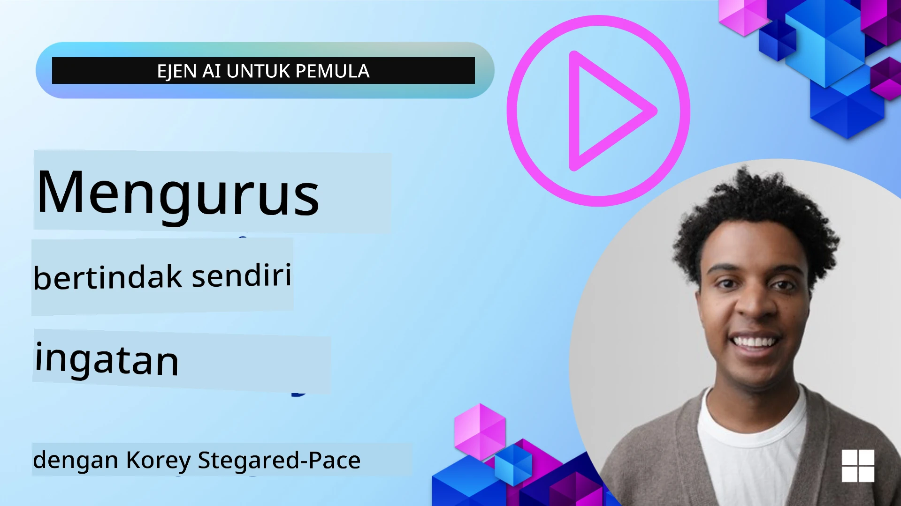

# Memori untuk Ejen AI

Apabila membincangkan manfaat unik dalam mencipta Ejen AI, dua perkara utama dibincangkan: keupayaan untuk memanggil alat bagi menyelesaikan tugasan dan keupayaan untuk meningkatkan diri dari masa ke masa. Memori adalah asas dalam mencipta ejen yang boleh memperbaiki diri sendiri yang dapat menghasilkan pengalaman yang lebih baik untuk pengguna kami.

Dalam pelajaran ini, kita akan melihat apa itu memori untuk Ejen AI dan bagaimana kita boleh mengurus serta menggunakannya demi kebaikan aplikasi kita.

## Pengenalan

Pelajaran ini akan merangkumi:

• **Memahami Memori Ejen AI**: Apa itu memori dan mengapa ia penting untuk ejen.

• **Melaksanakan dan Menyimpan Memori**: Kaedah praktikal untuk menambah kemampuan memori ke dalam ejen AI anda, dengan tumpuan pada memori jangka pendek dan jangka panjang.

• **Menjadikan Ejen AI Memperbaiki Diri**: Bagaimana memori membolehkan ejen belajar daripada interaksi lalu dan memperbaiki diri dari masa ke masa.

## Pelaksanaan Tersedia

Pelajaran ini termasuk dua tutorial notebook yang menyeluruh:

• **[13-agent-memory.ipynb](./13-agent-memory.ipynb)**: Melaksanakan memori menggunakan Mem0 dan Azure AI Search dengan Microsoft Agent Framework

• **[13-agent-memory-cognee.ipynb](./13-agent-memory-cognee.ipynb)**: Melaksanakan memori berstruktur menggunakan Cognee, secara automatik membina graf pengetahuan yang disokong oleh embeddings, memvisualisasikan graf, dan pengambilan pintar

## Matlamat Pembelajaran

Selepas menamatkan pelajaran ini, anda akan tahu bagaimana untuk:

• **Membezakan antara pelbagai jenis memori ejen AI**, termasuk memori kerja, jangka pendek, dan jangka panjang, serta bentuk khusus seperti memori persona dan episodik.

• **Melaksanakan dan mengurus memori jangka pendek dan jangka panjang untuk ejen AI** menggunakan Microsoft Agent Framework, memanfaatkan alat seperti Mem0, Cognee, memori Whiteboard, dan mengintegrasi dengan Azure AI Search.

• **Memahami prinsip di sebalik ejen AI yang memperbaiki diri sendiri** dan bagaimana sistem pengurusan memori yang kukuh menyumbang kepada pembelajaran dan penyesuaian berterusan.

## Memahami Memori Ejen AI

Pada dasarnya, **memori untuk ejen AI merujuk kepada mekanisme yang membolehkan mereka mengekalkan dan mengingati maklumat**. Maklumat ini boleh jadi butiran khusus mengenai perbualan, keutamaan pengguna, tindakan lalu, atau pola yang telah dipelajari.

Tanpa memori, aplikasi AI biasanya adalah tanpa status, bermakna setiap interaksi bermula dari awal. Ini membawa kepada pengalaman pengguna yang berulang dan mengecewakan di mana ejen "lupa" konteks atau keutamaan sebelumnya.

### Mengapa Memori Penting?

Kecerdasan ejen sangat berkait rapat dengan keupayaannya untuk mengingati dan menggunakan maklumat lalu. Memori membolehkan ejen menjadi:

• **Reflektif**: Belajar dari tindakan dan hasil lalu.

• **Interaktif**: Mengekalkan konteks sepanjang perbualan yang sedang berjalan.

• **Proaktif dan Reaktif**: Meramalkan keperluan atau bertindak balas dengan sesuai berdasarkan data sejarah.

• **Autonomi**: Beroperasi dengan lebih berdikari dengan merujuk kepada pengetahuan yang disimpan.

Matlamat melaksanakan memori adalah untuk menjadikan ejen lebih **boleh dipercayai dan berkeupayaan**.

### Jenis Memori

#### Memori Kerja

Fikirkan ini sebagai sekeping kertas draf yang digunakan oleh ejen semasa tugasan atau proses pemikiran yang sedang berjalan. Ia memegang maklumat segera yang diperlukan untuk mengira langkah seterusnya.

Untuk ejen AI, memori kerja sering menangkap maklumat paling relevan dari perbualan, walaupun sejarah perbualan penuh panjang atau dipotong. Ia memberi tumpuan kepada mengekstrak elemen utama seperti keperluan, cadangan, keputusan, dan tindakan.

**Contoh Memori Kerja**

Dalam ejen tempahan perjalanan, memori kerja mungkin menangkap permintaan semasa pengguna, seperti "Saya mahu menempah perjalanan ke Paris". Keperluan khusus ini dipegang dalam konteks segera ejen untuk membimbing interaksi kini.

#### Memori Jangka Pendek

Jenis memori ini mengekalkan maklumat untuk tempoh perbualan atau sesi tunggal. Ia adalah konteks sembang semasa, membenarkan ejen merujuk kembali kepada giliran perbualan sebelumnya.

Dalam contoh SDK Python [Microsoft Agent Framework](https://github.com/microsoft/agent-framework), ini dipadankan dengan `AgentSession`, yang dibuat dengan `agent.create_session()`. Sesi adalah memori jangka pendek terbina dalam rangka kerja: ia mengekalkan konteks perbualan semasa sesi yang sama digunakan, tetapi konteks tersebut tidak disimpan apabila sesi berakhir atau aplikasi dimulakan semula. Gunakan memori jangka panjang untuk fakta dan keutamaan yang perlu bertahan merentasi sesi, biasanya melalui pangkalan data, indeks vektor, atau stor kekal lain.

**Contoh Memori Jangka Pendek**

Jika pengguna bertanya, "Berapa harga penerbangan ke Paris?" dan kemudian menyusuli dengan "Bagaimana pula dengan tempat penginapan di sana?", memori jangka pendek memastikan ejen tahu "sana" merujuk kepada "Paris" dalam perbualan yang sama.

#### Memori Jangka Panjang

Ini adalah maklumat yang bertahan merentasi beberapa perbualan atau sesi. Ia membolehkan ejen mengingati keutamaan pengguna, interaksi sejarah, atau pengetahuan umum sepanjang tempoh yang panjang. Ini penting untuk pemperibadian.

**Contoh Memori Jangka Panjang**

Memori jangka panjang mungkin menyimpan bahawa "Ben gemar bermain ski dan aktiviti luar, suka kopi dengan pemandangan gunung, dan mahu mengelakkan lereng ski lanjutan kerana kecederaan masa lalu". Maklumat ini, yang dipelajari dari interaksi sebelumnya, mempengaruhi cadangan dalam sesi perancangan perjalanan masa depan, menjadikannya sangat peribadi.

#### Memori Persona

Jenis memori khusus ini membantu ejen membentuk "personaliti" atau "persona" yang konsisten. Ia membolehkan ejen mengingati butiran tentang dirinya atau peranan yang dimaksudkan, menjadikan interaksi lebih lancar dan fokus.

**Contoh Memori Persona**
Jika ejen perjalanan direka sebagai "perancang ski pakar," memori persona mungkin menguatkan peranan ini, mempengaruhi responsnya agar selaras dengan nada dan pengetahuan seorang pakar.

#### Memori Aliran Kerja/Episodik

Memori ini menyimpan urutan langkah yang diambil ejen semasa tugasan kompleks, termasuk kejayaan dan kegagalan. Ia seperti mengingati "episod" atau pengalaman lalu untuk belajar daripadanya.

**Contoh Memori Episodik**

Jika ejen cuba menempah penerbangan tertentu tetapi gagal kerana ketidaktersediaan, memori episodik boleh merekodkan kegagalan ini, membolehkan ejen mencuba penerbangan alternatif atau memaklumkan pengguna tentang isu tersebut dengan lebih bermaklumat pada cubaan berikutnya.

#### Memori Entiti

Ini melibatkan pengekstrakan dan mengingati entiti khusus (seperti orang, tempat, atau benda) dan peristiwa dari perbualan. Ia membolehkan ejen membina pemahaman berstruktur tentang elemen utama yang dibincangkan.

**Contoh Memori Entiti**

Dari perbualan mengenai perjalanan lalu, ejen mungkin mengekstrak "Paris," "Menara Eiffel," dan "makan malam di restoran Le Chat Noir" sebagai entiti. Dalam interaksi masa depan, ejen boleh mengingati "Le Chat Noir" dan menawarkan untuk membuat tempahan baru di sana.

#### RAG Berstruktur (Retrieval Augmented Generation)

Walaupun RAG adalah teknik yang lebih luas, "RAG Berstruktur" diketengahkan sebagai teknologi memori yang kuat. Ia mengekstrak maklumat berstruktur padat dari pelbagai sumber (perbualan, e-mel, imej) dan menggunakannya untuk meningkatkan ketepatan, pengingatan, dan kelajuan dalam respons. Tidak seperti RAG klasik yang bergantung semata-mata pada kesamaan semantik, RAG Berstruktur berfungsi dengan struktur maklumat yang sedia ada.

**Contoh RAG Berstruktur**

Daripada hanya memadankan kata kunci, RAG Berstruktur boleh menguraikan butiran penerbangan (destinasi, tarikh, masa, syarikat penerbangan) dari e-mel dan menyimpannya secara berstruktur. Ini membolehkan pertanyaan tepat seperti "Penerbangan mana yang saya tempah ke Paris pada hari Selasa?"

## Melaksanakan dan Menyimpan Memori

Melaksanakan memori untuk ejen AI melibatkan proses sistematik pengurusan memori, yang merangkumi menjana, menyimpan, mengambil semula, mengintegrasi, mengemas kini, dan malah "melupakan" (atau memadam) maklumat. Pengambilan semula adalah aspek yang amat penting.

### Alat Memori Khusus

#### Mem0

Salah satu cara untuk menyimpan dan mengurus memori ejen adalah dengan menggunakan alat khusus seperti Mem0. Mem0 berfungsi sebagai lapisan memori kekal, membolehkan ejen mengingati interaksi relevan, menyimpan keutamaan pengguna dan konteks fakta, serta belajar daripada kejayaan dan kegagalan dari masa ke masa. Idea di sini ialah ejen tanpa status menjadi ejen berstatus.

Ia berfungsi melalui **saluran memori dua fasa: pengekstrakan dan kemas kini**. Pertama, mesej yang ditambah ke benang ejen dihantar ke perkhidmatan Mem0, yang menggunakan Model Bahasa Besar (LLM) untuk meringkaskan sejarah perbualan dan mengekstrak memori baru. Kemudian, fasa kemas kini yang dikendalikan oleh LLM menentukan sama ada untuk menambah, mengubah, atau memadamkan memori ini, menyimpannya dalam stor data hibrid yang boleh merangkumi pangkalan data vektor, graf, dan pasangan kunci-nilai. Sistem ini juga menyokong pelbagai jenis memori dan boleh menggabungkan memori graf untuk mengurus hubungan antara entiti.

#### Cognee

Pendekatan kuat lain adalah menggunakan **Cognee**, memori semantik sumber terbuka untuk ejen AI yang menukar data berstruktur dan tidak berstruktur menjadi graf pengetahuan yang boleh dipertanyakan disokong oleh embeddings. Cognee menyediakan **senibina dua simpanan** yang menggabungkan carian kesamaan vektor dengan hubungan graf, membolehkan ejen memahami bukan hanya maklumat yang serupa, tetapi bagaimana konsep berkaitan antara satu sama lain.

Ia cemerlang dalam **pengambilan hibrid** yang menggabungkan kesamaan vektor, struktur graf, dan penalaran LLM - dari carian chunk mentah kepada menjawab soalan berdasarkan graf. Sistem ini mengekalkan **memori hidup** yang berkembang sambil kekal boleh dipertanyakan sebagai satu graf bersambung, menyokong konteks sesi jangka pendek dan memori kekal jangka panjang.

Tutorial notebook Cognee ([13-agent-memory-cognee.ipynb](./13-agent-memory-cognee.ipynb)) menunjukkan pembinaan lapisan memori bersatu ini, dengan contoh praktikal memasukkan pelbagai sumber data, memvisualisasikan graf pengetahuan, dan bertanya dengan strategi carian berbeza yang disesuaikan dengan keperluan ejen khusus.

### Menyimpan Memori dengan RAG

Selain alat memori khusus seperti Mem0, anda boleh memanfaatkan perkhidmatan carian kukuh seperti **Azure AI Search sebagai backend untuk menyimpan dan mengambil memori**, terutamanya bagi RAG berstruktur.

Ini membolehkan anda menambat respons ejen anda dengan data anda sendiri, memastikan jawapan lebih relevan dan tepat. Azure AI Search boleh digunakan untuk menyimpan memori perjalanan khusus pengguna, katalog produk, atau pengetahuan domain lain.

Azure AI Search menyokong keupayaan seperti **RAG Berstruktur**, yang cemerlang dalam mengekstrak dan mengambil maklumat berstruktur padat dari set data besar seperti sejarah perbualan, e-mel, atau bahkan imej. Ini menyediakan "ketepatan dan pengingatan supermanusia" berbanding pendekatan pemecahan teks dan embedding tradisional.

## Menjadikan Ejen AI Memperbaiki Diri

Pola umum untuk ejen yang memperbaiki diri melibatkan pengenalan **"ejen pengetahuan"**. Ejen berasingan ini memerhati perbualan utama antara pengguna dan ejen utama. Peranannya adalah untuk:

1. **Kenal pasti maklumat berharga**: Tentukan jika mana-mana bahagian perbualan berbaloi disimpan sebagai pengetahuan umum atau keutamaan pengguna tertentu.

2. **Ekstrak dan ringkaskan**: Memadatkan pembelajaran atau keutamaan penting dari perbualan.

3. **Menyimpan dalam pangkalan pengetahuan**: Simpan maklumat yang diekstrak ini, kerap dalam pangkalan data vektor, supaya boleh diambil semula kemudian.

4. **Melengkapkan pertanyaan masa depan**: Apabila pengguna memulakan pertanyaan baru, ejen pengetahuan mengambil maklumat yang relevan disimpan dan menambahkannya kepada petikan pengguna, menyediakan konteks penting kepada ejen utama (serupa dengan RAG).

### Pengoptimuman untuk Memori

• **Pengurusan Latensi**: Untuk mengelakkan memperlahankan interaksi pengguna, model yang lebih murah dan cepat boleh digunakan pada mulanya untuk cepat memeriksa jika maklumat berbaloi disimpan atau diambil, hanya menggunakan proses ekstrak/pengambilan yang lebih kompleks apabila perlu.

• **Penyelenggaraan Pangkalan Pengetahuan**: Untuk pangkalan pengetahuan yang berkembang, maklumat yang kurang kerap digunakan boleh dipindahkan ke "stor sejuk" untuk mengurus kos.

## Ada Lagi Soalan Tentang Memori Ejen?

Sertai [Microsoft Foundry Discord](https://discord.com/invite/ATgtXmAS5D) untuk bertemu dengan pelajar lain, menghadiri waktu pejabat dan dapatkan jawapan untuk soalan-soalan anda tentang Ejen AI.

---

<!-- CO-OP TRANSLATOR DISCLAIMER START -->
**Penafian**:
Dokumen ini telah diterjemahkan menggunakan perkhidmatan terjemahan AI [Co-op Translator](https://github.com/Azure/co-op-translator). Walaupun kami berusaha untuk ketepatan, sila ambil maklum bahawa terjemahan automatik mungkin mengandungi kesilapan atau ketidaktepatan. Dokumen asal dalam bahasa asalnya harus dianggap sebagai sumber yang sahih. Untuk maklumat penting, terjemahan oleh manusia profesional adalah disyorkan. Kami tidak bertanggungjawab terhadap sebarang salah faham atau salah tafsir yang timbul daripada penggunaan terjemahan ini.
<!-- CO-OP TRANSLATOR DISCLAIMER END -->