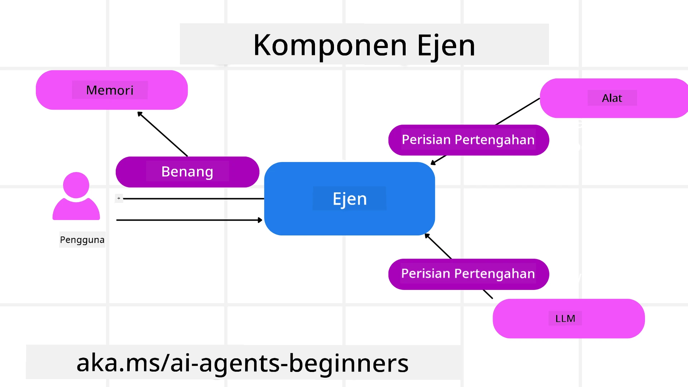

# Meneroka Microsoft Agent Framework


### Pengenalan

Pelajaran ini akan merangkumi:

- Memahami Microsoft Agent Framework: Ciri Utama dan Nilai  
- Meneroka Konsep Utama Microsoft Agent Framework
- Corak MAF Lanjutan: Aliran Kerja, Perisian Perantaraan, dan Memori

## Matlamat Pembelajaran

Selepas menyelesaikan pelajaran ini, anda akan tahu bagaimana untuk:

- Membina Ejen AI yang Siap untuk Produksi menggunakan Microsoft Agent Framework
- Menerapkan ciri teras Microsoft Agent Framework kepada kes penggunaan ejen anda
- Menggunakan corak lanjutan termasuk aliran kerja, perisian perantaraan, dan observabiliti

## Contoh Kod 

Contoh kod untuk [Microsoft Agent Framework (MAF)](https://aka.ms/ai-agents-beginners/agent-framewrok) boleh didapati dalam repositori ini di bawah fail `xx-python-agent-framework` dan `xx-dotnet-agent-framework`.

## Memahami Microsoft Agent Framework


[Microsoft Agent Framework (MAF)](https://aka.ms/ai-agents-beginners/agent-framewrok) adalah rangka kerja bersepadu Microsoft untuk membina ejen AI. Ia menawarkan fleksibiliti untuk menangani pelbagai jenis kes penggunaan ejen yang dilihat dalam persekitaran pengeluaran dan penyelidikan termasuk:

- **Orkestrasi Ejen Bersiri** dalam senario di mana aliran kerja langkah demi langkah diperlukan.
- **Orkestrasi Serentak** dalam senario di mana ejen perlu menyelesaikan tugas pada masa yang sama.
- **Orkestrasi Sembang Kumpulan** dalam senario di mana ejen boleh bekerjasama bersama pada satu tugas.
- **Orkestrasi Serahan** dalam senario di mana ejen menyerahkan tugas sesama mereka apabila subtugas diselesaikan.
- **Orkestrasi Magnetik** dalam senario di mana ejen pengurus mencipta dan mengubah senarai tugasan dan mengendalikan koordinasi sub-ejen untuk menyelesaikan tugas.

Untuk menyampaikan Ejen AI dalam pengeluaran, MAF juga merangkumi ciri untuk:

- **Observabiliti** melalui penggunaan OpenTelemetry di mana setiap tindakan Ejen AI termasuk pemanggilan alat, langkah orkestrasi, aliran penaakulan dan pemantauan prestasi melalui papan pemuka Microsoft Foundry.
- **Keselamatan** dengan mengehos ejen secara natif di Microsoft Foundry yang termasuk kawalan keselamatan seperti akses berasaskan peranan, pengendalian data peribadi dan keselamatan kandungan terbina.
- **Ketahanan** kerana benang ejen dan aliran kerja boleh dijeda, disambung semula dan pulih daripada ralat yang membolehkan proses berjalan lebih lama.
- **Kawalan** kerana aliran kerja manusia-dalam-gelung disokong di mana tugas ditandakan sebagai memerlukan kelulusan manusia.

Microsoft Agent Framework juga menumpukan kepada kebolehsinambungan dengan:

- **Tidak terikat kepada awan tertentu** - Ejen boleh dijalankan dalam kontena, di premis dan merentas pelbagai awan yang berbeza.
- **Tidak terikat kepada pembekal tertentu** - Ejen boleh dicipta melalui SDK pilihan anda termasuk Azure OpenAI dan OpenAI
- **Mengintegrasikan Standard Terbuka** - Ejen boleh menggunakan protokol seperti Agent-to-Agent(A2A) dan Model Context Protocol (MCP) untuk menemui dan menggunakan ejen dan alat lain.
- **Plugin dan Penyambung** - Sambungan boleh dibuat ke perkhidmatan data dan memori seperti Microsoft Fabric, SharePoint, Pinecone dan Qdrant.

Mari lihat bagaimana ciri-ciri ini digunakan pada beberapa konsep teras Microsoft Agent Framework.

## Konsep Utama Microsoft Agent Framework

### Ejen



**Mencipta Ejen**

Penciptaan ejen dilakukan dengan menentukan perkhidmatan inferens (Penyedia LLM), satu set arahan untuk Ejen AI ikuti, dan `name` yang ditetapkan:

```python
agent = AzureOpenAIChatClient(credential=AzureCliCredential()).create_agent( instructions="You are good at recommending trips to customers based on their preferences.", name="TripRecommender" )
```

Di atas menggunakan `Azure OpenAI` tetapi ejen boleh dicipta menggunakan pelbagai perkhidmatan termasuk `Microsoft Foundry Agent Service`:

```python
AzureAIAgentClient(async_credential=credential).create_agent( name="HelperAgent", instructions="You are a helpful assistant." ) as agent
```

OpenAI `Responses`, `ChatCompletion` APIs

```python
agent = OpenAIResponsesClient().create_agent( name="WeatherBot", instructions="You are a helpful weather assistant.", )
```

```python
agent = OpenAIChatClient().create_agent( name="HelpfulAssistant", instructions="You are a helpful assistant.", )
```

atau ejen jauh menggunakan protokol A2A:

```python
agent = A2AAgent( name=agent_card.name, description=agent_card.description, agent_card=agent_card, url="https://your-a2a-agent-host" )
```

**Menjalankan Ejen**

Ejen dijalankan menggunakan kaedah `.run` atau `.run_stream` untuk tindak balas bukan penstriman atau penstriman.

```python
result = await agent.run("What are good places to visit in Amsterdam?")
print(result.text)
```

```python
async for update in agent.run_stream("What are the good places to visit in Amsterdam?"):
    if update.text:
        print(update.text, end="", flush=True)

```

Setiap pelaksanaan ejen juga boleh mempunyai pilihan untuk menyesuaikan parameter seperti `max_tokens` yang digunakan oleh ejen, `tools` yang boleh dipanggil oleh ejen, dan malah `model` itu sendiri yang digunakan untuk ejen.

Ini berguna dalam kes di mana model atau alat tertentu diperlukan untuk menyelesaikan tugas pengguna.

**Alat**

Alat boleh ditakrifkan semasa mentakrifkan ejen:

```python
def get_attractions( location: Annotated[str, Field(description="The location to get the top tourist attractions for")], ) -> str: """Get the top tourist attractions for a given location.""" return f"The top attractions for {location} are." 


# Apabila membuat ChatAgent secara langsung

agent = ChatAgent( chat_client=OpenAIChatClient(), instructions="You are a helpful assistant", tools=[get_attractions]

```

dan juga semasa menjalankan ejen:

```python

result1 = await agent.run( "What's the best place to visit in Seattle?", tools=[get_attractions] # Alat disediakan hanya untuk penggunaan kali ini )
```

**Benang Ejen**

Benang ejen digunakan untuk mengendalikan perbualan berbilang pusingan. Benang boleh dicipta sama ada dengan:

- Menggunakan `get_new_thread()` yang membolehkan benang disimpan dari masa ke masa
- Mencipta benang secara automatik semasa menjalankan ejen dan benang hanya wujud sepanjang pelaksanaan semasa.

Untuk mencipta benang, kod kelihatan seperti ini:

```python
# Buat utas baharu.
thread = agent.get_new_thread() # Jalankan ejen dengan utas itu.
response = await agent.run("Hello, I am here to help you book travel. Where would you like to go?", thread=thread)

```

Anda kemudian boleh serialize benang untuk disimpan untuk kegunaan kemudian:

```python
# Cipta benang baru.
thread = agent.get_new_thread() 

# Jalankan ejen dengan benang itu.

response = await agent.run("Hello, how are you?", thread=thread) 

# Lakukan serialisasi pada benang untuk penyimpanan.

serialized_thread = await thread.serialize() 

# Lakukan deserialisasi pada keadaan benang selepas dimuatkan daripada storan.

resumed_thread = await agent.deserialize_thread(serialized_thread)
```

**Middleware Ejen**

Ejen berinteraksi dengan alat dan LLM untuk menyelesaikan tugas pengguna. Dalam situasi tertentu, kita ingin melaksanakan atau menjejak interaksi di antara ini. Middleware ejen membolehkan kita melakukan ini melalui:

*Middleware Fungsi*

Middleware ini membolehkan kita melaksanakan suatu tindakan antara ejen dan fungsi/alat yang akan dipanggil. Contoh bila ini digunakan ialah apabila anda mungkin ingin melakukan pencatatan pada pemanggilan fungsi.

Dalam kod di bawah `next` menentukan sama ada middleware seterusnya atau fungsi sebenar harus dipanggil.

```python
async def logging_function_middleware(
    context: FunctionInvocationContext,
    next: Callable[[FunctionInvocationContext], Awaitable[None]],
) -> None:
    """Function middleware that logs function execution."""
    # Pra-pemprosesan: Log sebelum pelaksanaan fungsi
    print(f"[Function] Calling {context.function.name}")

    # Teruskan ke middleware seterusnya atau pelaksanaan fungsi
    await next(context)

    # Pasca-pemprosesan: Log selepas pelaksanaan fungsi
    print(f"[Function] {context.function.name} completed")
```

*Middleware Sembang*

Middleware ini membolehkan kita melaksanakan atau mencatat tindakan antara ejen dan permintaan kepada LLM .

Ini mengandungi maklumat penting seperti `messages` yang dihantar kepada perkhidmatan AI.

```python
async def logging_chat_middleware(
    context: ChatContext,
    next: Callable[[ChatContext], Awaitable[None]],
) -> None:
    """Chat middleware that logs AI interactions."""
    # Pra-pemprosesan: Log sebelum panggilan AI
    print(f"[Chat] Sending {len(context.messages)} messages to AI")

    # Teruskan ke middleware seterusnya atau perkhidmatan AI
    await next(context)

    # Pasca-pemprosesan: Log selepas respons AI
    print("[Chat] AI response received")

```

**Memori Ejen**

Seperti yang diterangkan dalam pelajaran `Agentic Memory`, memori adalah elemen penting untuk membolehkan ejen beroperasi merentasi konteks yang berbeza. MAF menawarkan beberapa jenis memori yang berbeza:

*Storan Dalam-Memori*

Ini adalah memori yang disimpan dalam benang semasa runtime aplikasi.

```python
# Buat benang baru.
thread = agent.get_new_thread() # Jalankan ejen dengan benang itu.
response = await agent.run("Hello, I am here to help you book travel. Where would you like to go?", thread=thread)
```

*Mesej Berterusan*

Memori ini digunakan apabila menyimpan sejarah perbualan merentasi sesi yang berbeza. Ia ditakrifkan menggunakan `chat_message_store_factory` :

```python
from agent_framework import ChatMessageStore

# Cipta stor mesej tersuai
def create_message_store():
    return ChatMessageStore()

agent = ChatAgent(
    chat_client=OpenAIChatClient(),
    instructions="You are a Travel assistant.",
    chat_message_store_factory=create_message_store
)

```

*Memori Dinamik*

Memori ini ditambah ke dalam konteks sebelum ejen dijalankan. Memori ini boleh disimpan dalam perkhidmatan luaran seperti mem0:

```python
from agent_framework.mem0 import Mem0Provider

# Menggunakan Mem0 untuk keupayaan memori lanjutan
memory_provider = Mem0Provider(
    api_key="your-mem0-api-key",
    user_id="user_123",
    application_id="my_app"
)

agent = ChatAgent(
    chat_client=OpenAIChatClient(),
    instructions="You are a helpful assistant with memory.",
    context_providers=memory_provider
)

```

**Observabiliti Ejen**

Observabiliti penting untuk membina sistem ejen yang boleh dipercayai dan mudah diselenggara. MAF berintegrasi dengan OpenTelemetry untuk menyediakan penjejakan dan meter bagi observabiliti yang lebih baik.

```python
from agent_framework.observability import get_tracer, get_meter

tracer = get_tracer()
meter = get_meter()
with tracer.start_as_current_span("my_custom_span"):
    # lakukan sesuatu
    pass
counter = meter.create_counter("my_custom_counter")
counter.add(1, {"key": "value"})
```

### Aliran Kerja

MAF menawarkan aliran kerja yang merupakan langkah pra-ditakrif untuk menyelesaikan tugas dan termasuk ejen AI sebagai komponen dalam langkah-langkah tersebut.

Aliran kerja terdiri daripada pelbagai komponen yang membolehkan aliran kawalan yang lebih baik. Aliran kerja juga membolehkan **orkestrasi multi-ejen** dan **penanda semakan (checkpointing)** untuk menyimpan keadaan aliran kerja.

Komponen teras aliran kerja ialah:

**Pelaksana**

Pelaksana menerima mesej input, melaksanakan tugas yang ditugaskan, dan kemudian menghasilkan mesej output. Ini menggerakkan aliran kerja ke hadapan ke arah menyelesaikan tugas yang lebih besar. Pelaksana boleh menjadi ejen AI atau logik tersuai.

**Tepi**

Tepi digunakan untuk mentakrifkan aliran mesej dalam aliran kerja. Ia boleh menjadi:

*Tepi Langsung* - Sambungan satu-ke-satu mudah antara pelaksana:

```python
from agent_framework import WorkflowBuilder

builder = WorkflowBuilder()
builder.add_edge(source_executor, target_executor)
builder.set_start_executor(source_executor)
workflow = builder.build()
```

*Tepi Bersyarat* - Diaktifkan selepas syarat tertentu dipenuhi. Contohnya, apabila bilik hotel tidak tersedia, seorang pelaksana boleh mencadangkan pilihan lain.

*Tepi Tukar-kes* - Menghala mesej kepada pelaksana yang berbeza berdasarkan syarat yang ditetapkan. Sebagai contoh, jika pelanggan perjalanan mempunyai akses keutamaan dan tugas mereka akan dikendalikan melalui aliran kerja lain.

*Tepi Fan-out* - Menghantar satu mesej kepada berbilang sasaran.

*Tepi Fan-in* - Mengumpulkan berbilang mesej daripada pelaksana yang berbeza dan menghantar kepada satu sasaran.

**Peristiwa**

Untuk menyediakan observabiliti yang lebih baik ke dalam aliran kerja, MAF menawarkan peristiwa terbina untuk pelaksanaan termasuk:

- `WorkflowStartedEvent`  - Pelaksanaan aliran kerja bermula
- `WorkflowOutputEvent` - Aliran kerja menghasilkan output
- `WorkflowErrorEvent` - Aliran kerja menghadapi ralat
- `ExecutorInvokeEvent`  - Pelaksana mula memproses
- `ExecutorCompleteEvent`  -  Pelaksana selesai memproses
- `RequestInfoEvent` - Permintaan dikeluarkan

## Corak MAF Lanjutan

Bahagian di atas merangkumi konsep utama Microsoft Agent Framework. Apabila anda membina ejen yang lebih kompleks, berikut adalah beberapa corak lanjutan yang boleh dipertimbangkan:

- **Kompisi Middleware**: Rantai beberapa pengendali middleware (pencatatan, pengesahan, pengehad-kadar) menggunakan middleware fungsi dan sembang untuk kawalan halus terhadap tingkah laku ejen.
- **Penanda Semakan Aliran Kerja**: Gunakan peristiwa aliran kerja dan serialisasi untuk menyimpan dan menyambung semula proses ejen yang berjalan lama.
- **Pemilihan Alat Dinamik**: Gabungkan RAG ke atas penerangan alat dengan pendaftaran alat MAF untuk mempersembahkan hanya alat yang relevan bagi setiap pertanyaan.
- **Serahan Multi-Ejen**: Gunakan tepi aliran kerja dan penghalaan bersyarat untuk mengorkestrakan serahan antara ejen khusus.

## Contoh Kod 

Contoh kod untuk Microsoft Agent Framework boleh didapati dalam repositori ini di bawah fail `xx-python-agent-framework` dan `xx-dotnet-agent-framework`.

## Ada Lagi Soalan Mengenai Microsoft Agent Framework?

Sertai the [Microsoft Foundry Discord](https://aka.ms/ai-agents/discord) untuk berjumpa dengan pelajar lain, menghadiri jam pejabat dan mendapatkan jawapan kepada soalan Ejen AI anda.

---

<!-- CO-OP TRANSLATOR DISCLAIMER START -->
Penafian:
Dokumen ini telah diterjemahkan menggunakan perkhidmatan terjemahan AI [Co-op Translator](https://github.com/Azure/co-op-translator). Walaupun kami berusaha memastikan ketepatan, sila ambil maklum bahawa terjemahan automatik mungkin mengandungi ralat atau ketidaktepatan. Dokumen asal dalam bahasa asalnya hendaklah dianggap sebagai sumber yang muktamad. Bagi maklumat yang kritikal, disarankan mendapatkan terjemahan profesional oleh penterjemah manusia. Kami tidak bertanggungjawab terhadap sebarang salah faham atau salah tafsiran yang timbul daripada penggunaan terjemahan ini.
<!-- CO-OP TRANSLATOR DISCLAIMER END -->