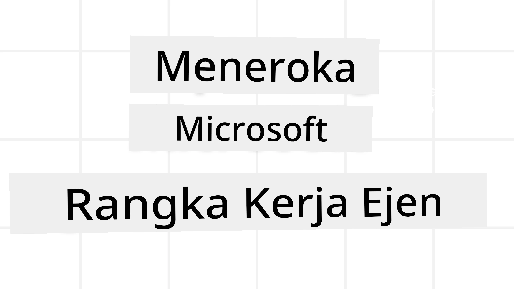
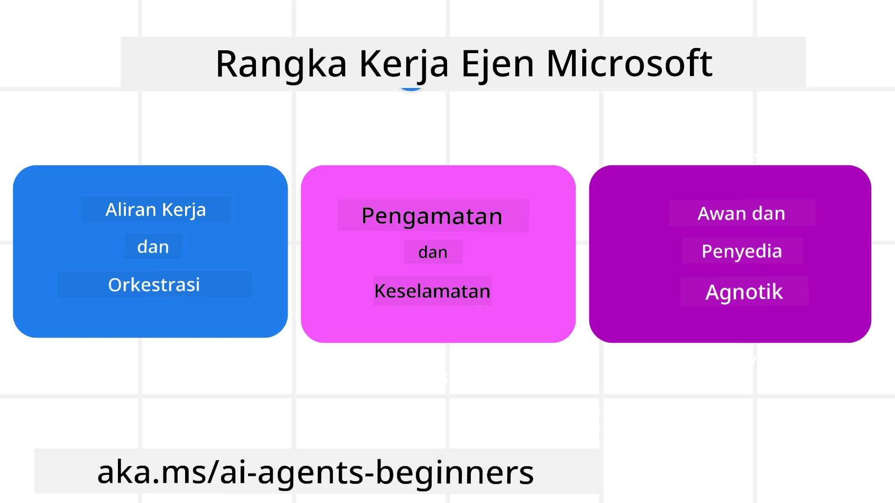
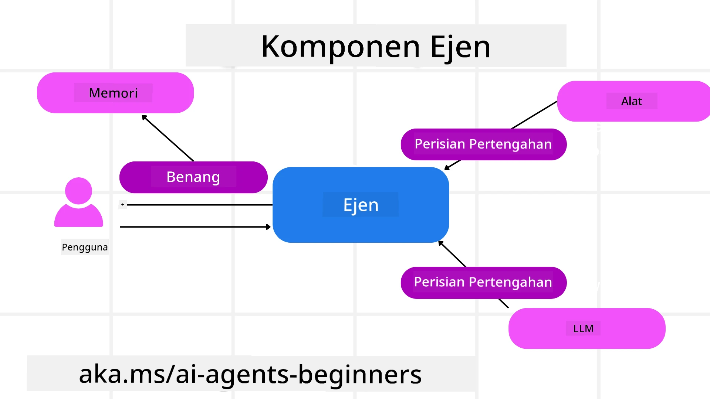

# Meneroka Microsoft Agent Framework



### Pengenalan

Pelajaran ini akan merangkumi:

- Memahami Microsoft Agent Framework: Ciri Utama dan Nilai  
- Meneroka Konsep Utama Microsoft Agent Framework
- Corak MAF Lanjutan: Aliran Kerja, Middleware, dan Memori

## Matlamat Pembelajaran

Selepas menamatkan pelajaran ini, anda akan tahu cara untuk:

- Membangun Ejen AI Sedia Produksi menggunakan Microsoft Agent Framework
- Menerapkan ciri teras Microsoft Agent Framework ke Kes Penggunaan Ejen anda
- Menggunakan corak lanjutan termasuk aliran kerja, middleware, dan keterlihatan

## Contoh Kod 

Contoh kod untuk [Microsoft Agent Framework (MAF)](https://aka.ms/ai-agents-beginners/agent-framework) boleh didapati dalam repositori ini di bawah fail `xx-python-agent-framework` dan `xx-dotnet-agent-framework`.

## Memahami Microsoft Agent Framework



[Microsoft Agent Framework (MAF)](https://aka.ms/ai-agents-beginners/agent-framework) adalah rangka kerja sehenti Microsoft untuk membina ejen AI. Ia menawarkan fleksibiliti untuk menangani pelbagai jenis kes penggunaan ejen yang dilihat dalam persekitaran produksi dan penyelidikan termasuk:

- **Orkestra Ejen Berurutan** dalam senario yang memerlukan aliran kerja langkah demi langkah.
- **Orkestra Serentak** dalam senario di mana ejen perlu melengkapkan tugasan pada masa yang sama.
- **Orkestra Sembang Berkumpulan** dalam senario di mana ejen boleh bekerjasama dalam satu tugasan.
- **Orkestra Penyerahan** dalam senario di mana ejen menyerahkan tugasan satu sama lain apabila subtugasan selesai.
- **Orkestra Magnetik** dalam senario di mana ejen pengurus mencipta dan mengubah senarai tugasan serta mengendalikan koordinasi subejen untuk menyelesaikan tugasan.

Untuk menyampaikan Ejen AI dalam Produksi, MAF juga memasukkan ciri untuk:

- **Keterlihatan** melalui penggunaan OpenTelemetry di mana setiap tindakan Ejen AI termasuk panggilan alat, langkah orkestra, aliran penalaran dan pemantauan prestasi melalui papan pemuka Microsoft Foundry.
- **Keselamatan** dengan mengehoskan ejen secara asli di Microsoft Foundry yang merangkumi kawalan keselamatan seperti akses berasaskan peranan, pengendalian data sulit dan keselamatan kandungan terbina dalam.
- **Ketahanan** kerana thread dan aliran kerja ejen boleh dijeda, disambung semula dan pulih daripada ralat yang membolehkan proses berjalan lebih lama.
- **Kawalan** kerana aliran kerja manusia dalam gelung disokong di mana tugasan ditandakan sebagai memerlukan kelulusan manusia.

Microsoft Agent Framework juga berfokus pada kebolehkaitan dengan:

- **Bebas Awan** - Ejen boleh dijalankan dalam kontena, di lokasi, dan merentas pelbagai awan yang berbeza.
- **Bebas Penyedia** - Ejen boleh dicipta melalui SDK pilihan anda termasuk Azure OpenAI dan OpenAI
- **Menggabungkan Standard Terbuka** - Ejen boleh menggunakan protokol seperti Agent-to-Agent(A2A) dan Model Context Protocol (MCP) untuk mencari dan menggunakan ejen dan alat lain.
- **Pemalam dan Penyambung** - Sambungan boleh dibuat ke perkhidmatan data dan memori seperti Microsoft Fabric, SharePoint, Pinecone dan Qdrant.

Mari kita lihat bagaimana ciri-ciri ini diterapkan kepada beberapa konsep teras Microsoft Agent Framework.

## Konsep Utama Microsoft Agent Framework

### Ejen



**Mewujudkan Ejen**

Penciptaan ejen dilakukan dengan mentakrifkan perkhidmatan inferens (Pembekal LLM), satu
set arahan untuk Ejen AI ikuti, dan `nama` yang ditetapkan:

```python
agent = AzureOpenAIChatClient(credential=AzureCliCredential()).create_agent( instructions="You are good at recommending trips to customers based on their preferences.", name="TripRecommender" )
```

Kod di atas menggunakan `Azure OpenAI` tetapi ejen boleh dicipta menggunakan pelbagai perkhidmatan termasuk `Microsoft Foundry Agent Service`:

```python
AzureAIAgentClient(async_credential=credential).create_agent( name="HelperAgent", instructions="You are a helpful assistant." ) as agent
```

API `Respons`, `ChatCompletion` dari OpenAI

```python
agent = OpenAIResponsesClient().create_agent( name="WeatherBot", instructions="You are a helpful weather assistant.", )
```

```python
agent = OpenAIChatClient().create_agent( name="HelpfulAssistant", instructions="You are a helpful assistant.", )
```

atau [MiniMax](https://platform.minimaxi.com/), yang menyediakan API serasi OpenAI dengan tetingkap konteks besar (sehingga 204K token):

```python
agent = OpenAIChatClient(base_url="https://api.minimax.io/v1", api_key=os.environ["MINIMAX_API_KEY"], model_id="MiniMax-M3").create_agent( name="HelpfulAssistant", instructions="You are a helpful assistant.", )
```

atau ejen jauh menggunakan protokol A2A:

```python
agent = A2AAgent( name=agent_card.name, description=agent_card.description, agent_card=agent_card, url="https://your-a2a-agent-host" )
```

**Menjalankan Ejen**

Ejen dijalankan menggunakan kaedah `.run` atau `.run_stream` untuk respons bukan penstriman atau penstriman.

```python
result = await agent.run("What are good places to visit in Amsterdam?")
print(result.text)
```

```python
async for update in agent.run_stream("What are the good places to visit in Amsterdam?"):
    if update.text:
        print(update.text, end="", flush=True)

```

Setiap pelaksanaan ejen juga boleh mempunyai pilihan untuk menyesuaikan parameter seperti `max_tokens` yang digunakan oleh ejen, `alat` yang boleh dipanggil oleh ejen, dan juga `model` itu sendiri yang digunakan untuk ejen tersebut.

Ini berguna dalam kes di mana model atau alat tertentu diperlukan untuk melengkapkan tugasan pengguna.

**Alat**

Alat boleh didefinisikan semasa mendefinisikan ejen:

```python
def get_attractions( location: Annotated[str, Field(description="The location to get the top tourist attractions for")], ) -> str: """Get the top tourist attractions for a given location.""" return f"The top attractions for {location} are." 


# Apabila membuat ChatAgent secara langsung

agent = ChatAgent( chat_client=OpenAIChatClient(), instructions="You are a helpful assistant", tools=[get_attractions]

```

dan juga semasa menjalankan ejen:

```python

result1 = await agent.run( "What's the best place to visit in Seattle?", tools=[get_attractions] # Alat disediakan hanya untuk larian ini )
```

**Thread Ejen**

Thread Ejen digunakan untuk mengendalikan perbualan berbilang pusingan. Thread boleh dicipta samada:

- Menggunakan `get_new_thread()` yang membolehkan thread disimpan dari masa ke masa
- Mencipta thread secara automatik semasa menjalankan ejen dan hanya membiarkan thread berlangsung sepanjang pelaksanaan semasa.

Untuk mencipta thread, kodnya ialah:

```python
# Cipta utas baru.
thread = agent.get_new_thread() # Jalankan ejen dengan utas tersebut.
response = await agent.run("Hello, I am here to help you book travel. Where would you like to go?", thread=thread)

```

Anda kemudian boleh menserialkan thread untuk disimpan bagi kegunaan kemudian:

```python
# Cipta utas baru.
thread = agent.get_new_thread() 

# Jalankan ejen dengan utas.

response = await agent.run("Hello, how are you?", thread=thread) 

# Serikan utas untuk penyimpanan.

serialized_thread = await thread.serialize() 

# Nyahserikan keadaan utas selepas memuatkan dari penyimpanan.

resumed_thread = await agent.deserialize_thread(serialized_thread)
```

**Middleware Ejen**

Ejen bertindak balas dengan alat dan LLM untuk melengkapkan tugasan pengguna. Dalam beberapa senario, kita mahu melaksanakan atau menjejak interaksi di antara ini. Middleware ejen membolehkan kita melakukan ini melalui:

*Middleware Fungsi*

Middleware ini membolehkan kita melaksanakan tindakan antara ejen dan fungsi/alat yang dipanggil. Contoh penggunaan adalah apabila anda mahu melakukan log pada panggilan fungsi.

Dalam kod di bawah `next` menentukan sama ada middleware seterusnya atau fungsi sebenar harus dipanggil.

```python
async def logging_function_middleware(
    context: FunctionInvocationContext,
    next: Callable[[FunctionInvocationContext], Awaitable[None]],
) -> None:
    """Function middleware that logs function execution."""
    # Pra-pemprosesan: Log sebelum pelaksanaan fungsi
    print(f"[Function] Calling {context.function.name}")

    # Teruskan ke middleware seterusnya atau pelaksanaan fungsi
    await next(context)

    # Pasca-pemprosesan: Log selepas pelaksanaan fungsi
    print(f"[Function] {context.function.name} completed")
```

*Middleware Sembang*

Middleware ini membolehkan kita melaksanakan atau merekod tindakan antara ejen dan permintaan pada LLM .

Ini mengandungi maklumat penting seperti `mesej` yang dihantar ke perkhidmatan AI.

```python
async def logging_chat_middleware(
    context: ChatContext,
    next: Callable[[ChatContext], Awaitable[None]],
) -> None:
    """Chat middleware that logs AI interactions."""
    # Pra-pemprosesan: Log sebelum panggilan AI
    print(f"[Chat] Sending {len(context.messages)} messages to AI")

    # Teruskan ke middleware atau perkhidmatan AI seterusnya
    await next(context)

    # Pasca-pemprosesan: Log selepas maklum balas AI
    print("[Chat] AI response received")

```

**Memori Ejen**

Seperti yang diterangkan dalam pelajaran `Memori Ejen`, memori adalah elemen penting untuk membolehkan ejen beroperasi merentas konteks yang berbeza. MAF menawarkan beberapa jenis memori yang berbeza:

*Penyimpanan Dalam Memori*

Ini adalah memori yang disimpan dalam thread semasa runtime aplikasi.

```python
# Buat benang baru.
thread = agent.get_new_thread() # Jalankan agen dengan benang tersebut.
response = await agent.run("Hello, I am here to help you book travel. Where would you like to go?", thread=thread)
```

*Mesej Kekal*

Memori ini digunakan apabila menyimpan sejarah perbualan merentas sesi yang berbeza. Ia ditakrifkan menggunakan `chat_message_store_factory` :

```python
from agent_framework import ChatMessageStore

# Cipta stor mesej tersuai
def create_message_store():
    return ChatMessageStore()

agent = ChatAgent(
    chat_client=OpenAIChatClient(),
    instructions="You are a Travel assistant.",
    chat_message_store_factory=create_message_store
)

```

*Memori Dinamik*

Memori ini ditambah ke konteks sebelum ejen dijalankan. Memori ini boleh disimpan dalam perkhidmatan luaran seperti mem0:

```python
from agent_framework.mem0 import Mem0Provider

# Menggunakan Mem0 untuk keupayaan memori lanjutan
memory_provider = Mem0Provider(
    api_key="your-mem0-api-key",
    user_id="user_123",
    application_id="my_app"
)

agent = ChatAgent(
    chat_client=OpenAIChatClient(),
    instructions="You are a helpful assistant with memory.",
    context_providers=memory_provider
)

```

**Keterlihatan Ejen**


Kebolehpantauan penting untuk membina sistem agen yang boleh dipercayai dan mudah diselenggara. MAF berintegrasi dengan OpenTelemetry untuk menyediakan penjejakan dan meter bagi kebolehpantauan yang lebih baik.

```python
from agent_framework.observability import get_tracer, get_meter

tracer = get_tracer()
meter = get_meter()
with tracer.start_as_current_span("my_custom_span"):
    # lakukan sesuatu
    pass
counter = meter.create_counter("my_custom_counter")
counter.add(1, {"key": "value"})
```

### Aliran Kerja

MAF menawarkan aliran kerja yang merupakan langkah yang telah ditetapkan untuk melengkapkan tugas dan termasuk ejen AI sebagai komponen dalam langkah-langkah tersebut.

Aliran kerja terdiri daripada komponen-komponen yang berbeza yang membolehkan kawalan aliran yang lebih baik. Aliran kerja juga membolehkan **orkestrasi multi-ejen** dan **penandaan semula** untuk menyimpan keadaan aliran kerja.

Komponen teras dalam aliran kerja adalah:

**Pelaksana**

Pelaksana menerima mesej input, melaksanakan tugas yang ditugaskan, dan kemudian menghasilkan mesej output. Ini menggerakkan aliran kerja ke hadapan ke arah melengkapkan tugas yang lebih besar. Pelaksana boleh menjadi ejen AI atau logik tersuai.

**Sisi**

Sisi digunakan untuk menentukan aliran mesej dalam aliran kerja. Ini boleh:

*Sisi Terus* - Sambungan satu-ke-satu yang ringkas antara pelaksana:

```python
from agent_framework import WorkflowBuilder

builder = WorkflowBuilder()
builder.add_edge(source_executor, target_executor)
builder.set_start_executor(source_executor)
workflow = builder.build()
```

*Sisi Bersyarat* - Diaktifkan selepas syarat tertentu dipenuhi. Contohnya, apabila bilik hotel tidak tersedia, pelaksana boleh mencadangkan pilihan lain.

*Sisi Tukar-ke-kes* - Menghala mesej kepada pelaksana yang berbeza berdasarkan syarat yang ditentukan. Contohnya, jika pelanggan perjalanan mempunyai akses keutamaan dan tugasan mereka akan diuruskan melalui aliran kerja lain.

*Sisi Fan-out* - Menghantar satu mesej kepada pelbagai sasaran.

*Sisi Fan-in* - Mengumpul pelbagai mesej dari pelaksana yang berbeza dan menghantar kepada satu sasaran.

**Peristiwa**

Untuk menyediakan kebolehpantauan yang lebih baik ke dalam aliran kerja, MAF menawarkan peristiwa terbina dalam untuk pelaksanaan termasuk:

- `WorkflowStartedEvent`  - Pelaksanaan aliran kerja bermula
- `WorkflowOutputEvent` - Aliran kerja menghasilkan output
- `WorkflowErrorEvent` - Aliran kerja menghadapi ralat
- `ExecutorInvokeEvent`  - Pelaksana mula memproses
- `ExecutorCompleteEvent`  -  Pelaksana selesai memproses
- `RequestInfoEvent` - Satu permintaan dikeluarkan

## Corak Lanjutan MAF

Bahagian di atas merangkumi konsep utama Microsoft Agent Framework. Apabila anda membina ejen yang lebih kompleks, berikut adalah beberapa corak lanjutan yang perlu dipertimbangkan:

- **Komposisi Middleware**: Rangkai beberapa pengendali middleware (log, pengesahan, had kadar) menggunakan fungsi dan middleware sembang untuk kawalan terperinci ke atas tingkah laku ejen.
- **Penandaan Semula Aliran Kerja**: Gunakan peristiwa aliran kerja dan penyerialan untuk menyimpan dan menyambung semula proses ejen yang berjalan lama.
- **Pemilihan Alat Dinamik**: Gabungkan RAG ke atas penerangan alat dengan pendaftaran alat MAF untuk membentangkan hanya alat yang relevan bagi setiap pertanyaan.
- **Penyerahan Multi-Ejen**: Gunakan sisi aliran kerja dan penghalaan bersyarat untuk mengorkestrasi penyerahan antara ejen khusus.

## Menjalankan Ejen LangChain / LangGraph pada Microsoft Foundry

Microsoft Agent Framework adalah **antara muka berkerangka** — anda tidak terhad kepada ejen yang ditulis dengan MAF. Jika anda sudah mempunyai ejen yang dibina dengan **LangChain** atau **LangGraph**, anda boleh menjalankannya sebagai **ejen yang dihoskan Microsoft Foundry** supaya Foundry menguruskan masa jalan, sesi, penalaan skala, identiti, dan titik hujung protokol untuk anda, sementara logik ejen anda kekal dalam LangGraph.

Ini dilakukan dengan pakej `langchain_azure_ai.agents.hosting`, yang mendedahkan graf LangGraph terkompilasi melalui protokol yang sama yang digunakan oleh ejen dihoskan Foundry.

**1. Pasang extra hosting:**

```bash
pip install -U "langchain-azure-ai[hosting]>=1.2.4" azure-identity
```

Extra `hosting` memasang perpustakaan protokol Foundry: `azure-ai-agentserver-responses` (titik hujung `/responses` yang serasi dengan OpenAI) dan `azure-ai-agentserver-invocations` (titik hujung `/invocations` generik).

**2. Pilih protokol hosting:**

| Protokol | Kelas Host | Titik Hujung | Gunakan bila |
|----------|-----------|----------|----------|
| **Responses** | `ResponsesHostServer` | `/responses` | Anda mahukan sembang yang serasi OpenAI, penstriman, sejarah respons, dan penjalinan perbualan — lalai yang disyorkan untuk ejen perbualan. |
| **Invocations** | `InvocationsHostServer` | `/invocations` | Anda memerlukan bentuk JSON tersuai, titik hujung gaya webhook, atau pemprosesan bukan perbualan. |

Oleh kerana **API Responses adalah API utama untuk pembangunan gaya ejen di Foundry**, mulakan dengan `ResponsesHostServer` untuk kebanyakan ejen.

**3. Konfigurkan pembolehubah persekitaran** (`az login` dahulu supaya `DefaultAzureCredential` dapat mengesahkan):

```bash
export FOUNDRY_PROJECT_ENDPOINT="https://<resource>.services.ai.azure.com/api/projects/<project>"
export FOUNDRY_MODEL_NAME="gpt-4.1"
```

Apabila ejen dijalankan kemudian sebagai ejen dihoskan dalam Foundry, platform secara automatik menyuntik `FOUNDRY_PROJECT_ENDPOINT`.

**4. Dedahkan ejen LangGraph melalui protokol Responses:**

```python
import os

from azure.ai.projects import AIProjectClient
from azure.identity import DefaultAzureCredential, get_bearer_token_provider
from langchain.agents import create_agent
from langchain_openai import ChatOpenAI
from langchain_azure_ai.agents.hosting import ResponsesHostServer

_AZURE_AI_SCOPE = "https://ai.azure.com/.default"


def build_chat_model() -> ChatOpenAI:
    project_endpoint = os.environ["FOUNDRY_PROJECT_ENDPOINT"].rstrip("/")
    deployment = os.environ.get("FOUNDRY_MODEL_NAME", "gpt-4.1")
    credential = DefaultAzureCredential()
    project = AIProjectClient(endpoint=project_endpoint, credential=credential)
    openai_client = project.get_openai_client()
    token_provider = get_bearer_token_provider(credential, _AZURE_AI_SCOPE)

    # ChatOpenAI di sini mensasarkan titik akhir OpenAI-kompatibel (Responses) projek Foundry.
    return ChatOpenAI(
        model=deployment,
        base_url=str(openai_client.base_url),
        api_key=token_provider,
    )


def main() -> None:
    graph = create_agent(build_chat_model(), tools=[])
    port = int(os.environ.get("PORT", "8088"))
    ResponsesHostServer(graph).run(port=port)


if __name__ == "__main__":
    main()
```

Jalankan secara tempatan dengan `python main.py`, kemudian hantar permintaan Responses ke `http://localhost:8088/responses`.

**Tingkah laku utama:**

- **Perbualan**: Pelanggan menyambung perbualan dengan memasukkan `previous_response_id` atau ID `conversation`. Jika graf anda dikompilasi dengan penanda semula LangGraph, Foundry mengikat keadaan perbualan ke penanda semula itu (gunakan penanda semula tahan lama dalam produksi; `MemorySaver` sesuai untuk ujian tempatan).
- **Manusia dalam gelung**: Jika graf anda menggunakan LangGraph `interrupt()`, `ResponsesHostServer` memaparkan gangguan yang tertunda sebagai item `function_call` / `mcp_approval_request` Responses, dan pelanggan menyambung dengan `function_call_output` / `mcp_approval_response` yang sepadan.
- **Menyebarkan ke Foundry**: Gunakan Azure Developer CLI — `azd ext install azure.ai.agents`, `azd ai agent init -m <manifest>`, `azd ai agent run` (tempatan, memerlukan Docker), kemudian `azd provision` dan `azd deploy`. Penyebaran ejen dihoskan memerlukan peranan **Pengurus Projek Foundry**.

Versi boleh dijalankan contoh ini boleh didapati di [code-samples/14-langchain-hosted-agent.py](../../../14-microsoft-agent-framework/code-samples/14-langchain-hosted-agent.py). Untuk panduan penuh (protokol Invocations, skema permintaan tersuai, dan penyelesaian masalah), lihat [Host LangGraph agents as Foundry hosted agents](https://learn.microsoft.com/azure/foundry/how-to/develop/langchain-hosted-agents).

## Contoh Kod 

Contoh kod untuk Microsoft Agent Framework boleh didapati dalam repositori ini di bawah fail `xx-python-agent-framework` dan `xx-dotnet-agent-framework`.

## Ada Soalan Lagi Mengenai Microsoft Agent Framework?

Sertai [Microsoft Foundry Discord](https://discord.com/invite/ATgtXmAS5D) untuk berjumpa dengan pelajar lain, menghadiri waktu pejabat dan mendapatkan jawapan untuk soalan AI Agents anda.

---

<!-- CO-OP TRANSLATOR DISCLAIMER START -->
**Penafian**:
Dokumen ini telah diterjemahkan menggunakan perkhidmatan terjemahan AI [Co-op Translator](https://github.com/Azure/co-op-translator). Walaupun kami berusaha untuk ketepatan, sila ambil maklum bahawa terjemahan automatik mungkin mengandungi kesilapan atau ketidaktepatan. Dokumen asal dalam bahasa asalnya harus dianggap sebagai sumber yang sahih. Untuk maklumat penting, terjemahan oleh manusia profesional adalah disyorkan. Kami tidak bertanggungjawab terhadap sebarang salah faham atau salah tafsir yang timbul daripada penggunaan terjemahan ini.
<!-- CO-OP TRANSLATOR DISCLAIMER END -->