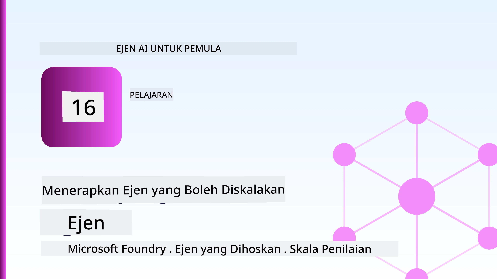
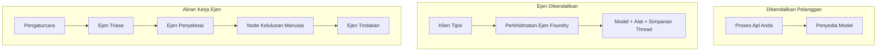
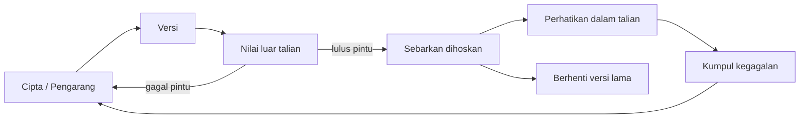
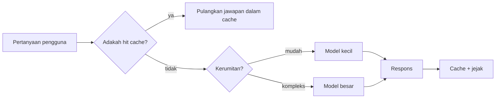
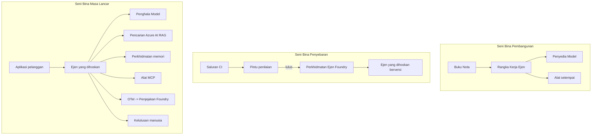

# Menggubal Ejen Skala dengan Microsoft Foundry



Sehingga titik ini dalam kursus, anda telah membina ejen yang berjalan pada komputer riba anda, di dalam buku nota, dikendalikan oleh `az login` dan beberapa pembolehubah persekitaran. Itu adalah cara yang tepat untuk belajar. Ia bukan cara yang tepat untuk menjalankan ejen yang bergantung pada ribuan pelanggan pada jam 3 pagi.

Pelajaran ini mengenai jurang antara "ia berfungsi pada mesin saya" dan "ia berfungsi, dengan boleh dipercayai dan berpatutan, dalam produksi." Kami menutup jurang itu menggunakan **Microsoft Foundry** dan **Microsoft Foundry Agent Service**, dan kami melakukannya dengan membina ejen sokongan pelanggan sebenar yang mempunyai alat, pengambilan, memori, penilaian, dan pemantauan.

## Pengenalan

Pelajaran ini akan merangkumi:

- Perbezaan antara **ejen prototaip** dan **ejen terpasang**, dan mengapa peralihan ini kebanyakannya mengenai segala sesuatu *sekitar* model.
- **Corak penggubalan** untuk ejen: hos pelanggan, hos perkhidmatan (Ejen Terhos), dan diuruskan aliran kerja.
- **Kitar hayat ejen** pada Microsoft Foundry — cipta, versi, gubal, nila, perhati, bersara.
- **Strategi penskalaan**: penghalaan model, caching, kebersamaan, dan reka bentuk tanpa keadaan.
- **Kebolehlihat** dengan OpenTelemetry dan penjejakan Foundry.
- **Pengoptimuman kos** melalui pemilihan model, penghalaan, dan pintu pagar penilaian.
- **Pertimbangan perusahaan**: tadbir urus, kelulusan manusia, dan menjalankan pelayan MCP dengan selamat dalam produksi.

## Matlamat Pembelajaran

Setelah menyelesaikan pelajaran ini, anda akan tahu cara:

- Memilih corak penggubalan yang betul untuk beban kerja ejen tertentu.
- Menggubal ejen ke Microsoft Foundry Agent Service supaya ia versi, diurus, dan boleh diperhatikan.
- Memasang instrumen untuk penjejakan dan menyambungkan saluran penilaian yang berjalan sebelum setiap pelepasan.
- Mengaplikasi penghalaan model dan caching untuk mengekalkan latensi dan kos terkawal pada skala.
- Menambah pintu kelulusan manusia untuk tindakan berisiko tinggi dan mengintegrasikan pelayan MCP dengan cara yang selamat untuk produksi.

## Prasyarat

Pelajaran ini mengandaikan anda telah menyelesaikan pelajaran-pelajaran sebelumnya dan selesa dengan:

- Membina ejen dengan [Microsoft Agent Framework](../14-microsoft-agent-framework/README.md) (Pelajaran 14).
- [Penggunaan Alat](../04-tool-use/README.md) (Pelajaran 4) dan [Agentic RAG](../05-agentic-rag/README.md) (Pelajaran 5).
- [Memori Ejen](../13-agent-memory/README.md) (Pelajaran 13) dan [Protokol Agentik / MCP](../11-agentic-protocols/README.md) (Pelajaran 11).
- [Kebolehlihat dan Penilaian](../10-ai-agents-production/README.md) (Pelajaran 10) — pelajaran ini dibina langsung di atasnya.

Anda juga memerlukan:

- **Langganan Azure** dan **projek Microsoft Foundry** dengan sekurang-kurangnya satu model sembang terpasang.
- **Azure CLI** yang disahkan (`az login`).
- Python 3.12+ dan pakej dalam repositori [`requirements.txt`](../../../requirements.txt).

## Dari Prototaip ke Produksi: Apa yang Sebenarnya Berubah

Ejen prototaip dan ejen produksi berkongsi gelung teras yang sama — berfikir, panggil alat, balas. Apa yang berubah adalah segala sesuatu di sekeliling gelung itu. Model mungkin 20% dari ejen produksi; 80% lagi adalah rangka operasi.

| Kebimbangan | Prototaip | Produksi |
| --- | --- | --- |
| **Hosting** | Berjalan di buku nota anda | Berjalan sebagai perkhidmatan terhos, versi dan dilancarkan |
| **Identiti** | Token `az login` anda | Identiti terurus dengan RBAC berkepenjangan |
| **Negeri** | Dalam memori, hilang semula mula | Diwakilkan (penyimpanan benang, perkhidmatan memori) |
| **Kegagalan** | Anda melihat jejak kesilapan | Cubaan semula, fallback, surat mati, amaran |
| **Kos** | "Beberapa sen" | Dipantau setiap permintaan, dialihkan, dicache, dianggarkan |
| **Kualiti** | Anda lihat output secara kasar | Dinilai secara automatik sebelum setiap pelancaran |
| **Kepercayaan** | Anda meluluskan setiap tindakan | Polisi + manusia dalam gelung untuk tindakan berisiko |

Ingatkan jadual ini. Setiap seksyen di bawah memetakan kepada satu baris ini.

## Corak Penggubalan Ejen

Terdapat tiga corak yang akan anda gunakan, sering dalam gabungan.

### 1. Ejen Hos Pelanggan

Objek ejen berada di dalam proses aplikasi *anda*. Kod anda memanggil penyedia model secara langsung; gelung pemikiran berjalan dalam perkhidmatan anda. Ini adalah apa yang telah dilakukan setiap pelajaran sebelum ini.

- **Gunakan ia apabila** anda memerlukan kawalan penuh ke atas gelung, perisian pertengahan tersuai, atau anda menyematkan ejen dalam backend sedia ada.
- **Pertukaran**: anda mengurus penskalaan, negeri, dan ketahanan sendiri.

### 2. Ejen Terhos (Foundry Agent Service)

Ejen didaftarkan sebagai sumber dalam Microsoft Foundry. Foundry menghoskan gelung pemikiran, menyimpan benang perbualan, menguatkuasakan keselamatan kandungan dan RBAC, dan menjadikan ejen kelihatan dalam portal Foundry. Aplikasi anda menjadi klien nipis yang mencipta benang dan membaca balasan.

- **Gunakan ia apabila** anda mahukan ketahanan, kebolehlihat terbina dalam, tadbir urus, dan permukaan operasi yang lebih kecil.
- **Pertukaran**: kawalan tahap rendah kurang dengan pertukaran runtime yang diurus.

### 3. Aliran Kerja Ejen

Beberapa ejen (dan alat) disusun dalam grafik dengan aliran kawalan eksplisit — langkah berurutan, cabang, nod kelulusan manusia, dan penanda cek tahan lama yang boleh menjeda dan menyambung semula. Ini adalah keupayaan **Aliran Kerja** Microsoft Agent Framework yang digunakan pada skala penggubalan.

- **Gunakan ia apabila** satu tugas melibatkan beberapa ejen khusus atau memerlukan langkah kelulusan di tengah.
- **Pertukaran**: lebih banyak bahagian bergerak; memerlukan kebolehlihatan tahap orkestrasi.



## Kitar Hayat Ejen pada Microsoft Foundry

Menggubal ejen bukan sekali `push`. Ia adalah gelung, dan kelihatan sangat seperti kitaran pelepasan perisian kerana itulah sebenarnya.



Idea utama, dibawa dari [Pelajaran 10](../10-ai-agents-production/README.md): **penilaian luar talian adalah pintu pagar, bukan selepas fikir.** Versi ejen baru tidak dihantar melainkan ia memenuhi ambang penilaian anda. Kebolehlihat dalam talian kemudian mengembalikan kegagalan dunia sebenar ke set ujian luar talian anda. Itulah keseluruhan gelung.

## Strategi Penskalaan

Penskalaan ejen berbeza daripada penskalaan API web tanpa negeri, kerana setiap permintaan boleh mencetuskan berbilang panggilan model dan alat yang mahal. Empat teknik membawa beban terbesar.

**Pengendalian permintaan tanpa negeri.** Jangan simpan negeri per pengguna dalam memori proses anda. Kekalkan benang perbualan dalam stor benang Foundry atau perkhidmatan memori supaya mana-mana instans boleh mengendalikan mana-mana permintaan. Ini membolehkan anda skala secara mendatar — tambah instans, tiada sesi melekit.

**Penghalaan model.** Tidak semua permintaan memerlukan model paling berkuasa (dan paling mahal) anda. Hantar permintaan mudah — klasifikasi niat, jawapan fakta pendek — ke model kecil dan pantas, dan simpan model besar untuk pemikiran sebenar. **Penghala Model** Foundry boleh melakukannya untuk anda, atau anda boleh melaksanakan pengklasifikasi ringan sendiri. Anda akan bina versi DIY dalam makmal.

**Caching balasan.** Banyak pertanyaan sokongan adalah duplikat hampir ("bagaimana saya reset kata laluan saya?"). Cache jawapan kepada soalan biasa dan hidangkan tanpa mengakses model sama sekali. Walaupun kadar cache sederhana secara signifikan mengurangkan kos dan latensi.

**Kebersamaan dan tekanan belakang.** Penyedia model mempunyai had kadar. Hadkan kebersamaan anda, gunakan cubaan semula dengan pesongan eksponen, dan gagal dengan sopan (balasan "kami sedang mengendalikannya" yang beratur mengalahkan ralat 500).



## Kebolehlihat dalam Produksi

Anda tidak boleh mengendalikan apa yang anda tidak nampak. Seperti yang diliputi dalam Pelajaran 10, Microsoft Agent Framework mengeluarkan jejak **OpenTelemetry** secara asli — setiap panggilan model, invokasi alat, dan langkah orkestrasi menjadi julat. Dalam produksi, anda eksport julat tersebut ke Microsoft Foundry (atau mana-mana backend OTel-kompatibel) supaya anda boleh:

- Jejak aduan pelanggan tunggal dari hujung ke hujung merentasi setiap panggilan model dan alat.
- Memerhati latensi p50/p95 dan kos bagi setiap permintaan dari masa ke masa.
- Memberi amaran pada lonjakan kadar ralat dan anomali kos sebelum pengguna anda (atau pasukan kewangan anda) perasan.

```python
from agent_framework.observability import get_tracer

tracer = get_tracer()

with tracer.start_as_current_span("support_request") as span:
    span.set_attribute("customer.tier", "enterprise")
    span.set_attribute("routed.model", "gpt-5-nano")
    # pelaksanaan agen dijejak secara automatik di dalam julat ini
```

Atribut seperti `customer.tier` dan `routed.model` adalah apa yang menukar tembok jejak menjadi soalan boleh dijawab ("adakah pelanggan perusahaan dihantar ke model kecil terlalu kerap?").

## Pengoptimuman Kos

Kos dalam ejen produksi didominasi oleh token. Tiga tuas, menurut kesan:

1. **Saiz yang betul untuk model.** Model kecil yang lulus pintu pagar penilaian anda hampir selalu lebih murah daripada model besar yang juga lulus. Gunakan penilaian untuk *membuktikan* model kecil cukup baik daripada berasumsi menggunakan model terbesar sebagai langkah berjaga-jaga.
2. **Penghalaan mengikut kerumitan.** Seperti di atas — bayar harga model besar hanya untuk permintaan yang memerlukan pemikiran model besar.
3. **Cache secara agresif.** Panggilan model yang paling murah adalah panggilan yang anda tidak pernah buat.

Pintu pagar penilaian dan kawalan kos adalah disiplin yang sama dilihat dari dua sudut: penilaian memberitahu *tahap kualiti*, penghalaan dan caching memastikan anda sedekat mungkin dengan *kos* tahap itu.

## Pertimbangan Penggubalan Perusahaan

**Tadbir urus.** Ejen Terhos mewarisi RBAC Foundry, keselamatan kandungan, dan log audit. Berikan setiap ejen identiti terurus dengan keizinan paling sedikit yang diperlukan — akses baca sahaja ke pangkalan ilmu, akses berkepenjangan ke API tiket, tiada lebih.

**Manusia dalam gelung.** Beberapa tindakan terlalu penting untuk diautomasi sepenuhnya — mengeluarkan bayaran balik, memadam akaun, merujuk kepada pasukan undang-undang. Microsoft Agent Framework menyokong alat **perlukan kelulusan**: ejen mencadangkan tindakan, pelaksanaan berhenti, manusia meluluskan atau menolak, dan aliran kerja disambung semula. Anda nampak primitif ini dalam [Pelajaran 6](../06-building-trustworthy-agents/README.md); di sini anda menggubalnya.

**MCP dalam produksi.** [MCP](../11-agentic-protocols/README.md) membolehkan ejen anda menggunakan alat luaran melalui antara muka standard. Dalam produksi, anggap setiap pelayan MCP sebagai sempadan tidak dipercayai: pin versi pelayan, jalankan dengan identiti berkepenjangan, sahkan outputnya, dan jangan dedahkan rahsia kepadanya. Pelayan MCP adalah kebergantungan, dan kebergantungan dipatch, diaudit, dan hadkan kadar.



Ketiga diagram itu — pembangunan, penggubalan, runtime — adalah ejen yang sama pada tiga peringkat hidupnya. Makmal berikut akan membimbing anda membinanya.

## Makmal Praktikal: Ejen Sokongan Pelanggan Sedia Produksi

Buka [`code_samples/16-python-agent-framework.ipynb`](./code_samples/16-python-agent-framework.ipynb) dan kerjakan dari mula hingga habis. Anda akan menyusun **ejen sokongan pelanggan Contoso** dengan setiap kebimbangan produksi disambungkan:

1. **Panggilan alat** — lihat status pesanan dan buka tiket sokongan.
2. **RAG** — jawap soalan polisi dari pangkalan ilmu (Azure AI Search, dengan fallback dalam memori supaya buku nota berjalan tanpa sumber Search).
3. **Memori** — ingat pelanggan sepanjang pusingan perbualan.
4. **Penghalaan model** — pengklasifikasi kerumitan menghala setiap permintaan ke model kecil atau besar.
5. **Caching balasan** — soalan berulang dihidangkan dari cache.
6. **Kelulusan manusia** — bayaran balik di atas ambang berhenti untuk tandatangan manusia.
7. **Saluran penilaian** — set ujian kecil luar talian menilai ejen dan bertindak sebagai pintu pagar pelepasan.
8. **Kebolehlihat** — penjejakan OpenTelemetry di sekitar setiap permintaan.

### Panduan

Buku nota diatur supaya setiap kebimbangan produksi adalah seksyen boleh jalankan dan berdiri sendiri. Jantungnya adalah pengendali permintaan penghalaan-dan-caching:

```python
async def handle_support_request(query: str, customer_id: str) -> str:
    # 1. Hidangkan dari cache apabila boleh.
    cached = response_cache.get(normalize(query))
    if cached:
        return cached

    # 2. Lalukan mengikut kerumitan untuk mengawal kos.
    model = "gpt-5-nano" if is_simple(query) else "gpt-5-mini"

    # 3. Jalankan ejen di dalam span jejak untuk pemerhatian.
    with tracer.start_as_current_span("support_request") as span:
        span.set_attribute("routed.model", model)
        span.set_attribute("customer.id", customer_id)
        response = await support_agent.run(query, model=model)

    # 4. Cache dan pulangkan.
    response_cache.set(normalize(query), response.text)
    return response.text
```

Pintu pagar penilaian yang menjaga pelepasan kelihatan seperti ini:

```python
async def evaluation_gate(agent, test_cases, threshold: float = 0.8) -> bool:
    passed = 0
    for case in test_cases:
        result = await agent.run(case["input"])
        if score_response(result.text, case["expected"]) >= 0.8:
            passed += 1
    pass_rate = passed / len(test_cases)
    print(f"Evaluation pass rate: {pass_rate:.0%} (gate: {threshold:.0%})")
    return pass_rate >= threshold  # hanya terapkan jika pintu gerbang lulus
```

Baca setiap baris — buku nota mengekalkan primitif ini sengaja kecil supaya tiada yang tersembunyi di belakang panggilan rangka kerja.

## Mengesahkan Ejen Terpasang dengan Ujian Asap

Pintu pagar penilaian di atas berjalan *luar talian* terhadap objek ejen anda. Setelah ejen digubal sebagai Ejen Terhos, anda memerlukan satu lagi pemeriksaan, yang lebih murah: **adakah titik hujung yang dipasang benar-benar memberi jawapan?**

Menggubal dengan "berjaya" hanya membuktikan pesawat kawalan menerima definisi — ia tidak membuktikan ejen memberi jawapan. Kekurangan kebergantungan, penghalaan model yang salah, atau sambungan tamat boleh menyebabkan gubal hijau yang tidak memberi apa-apa. **Ujian asap** menangkap itu dalam beberapa saat, pada setiap gubal, tanpa kos penilaian penuh.

Repositori ini menghantar saluran ujian asap siap guna dibina di atas GitHub Action [AI Smoke Test](https://github.com/marketplace/actions/ai-smoke-test):

- **Katalog** — [`tests/lesson-16-smoke-tests.json`](../../../tests/lesson-16-smoke-tests.json) mengandungi petunjuk dan pernyataan untuk ejen sokongan Contoso (jawapan polisi berpangkalan, lihat pesanan, kekal berfokus, dan kesinambungan benang multi-turn). Katalog untuk ejen pelajaran lain juga ada di sampingnya — lihat [`tests/README.md`](../tests/README.md).
- **Aliran Kerja** — [`.github/workflows/smoke-test.yml`](../../../.github/workflows/smoke-test.yml) log masuk dengan Azure OIDC dan POST setiap petunjuk ke titik hujung Responses ejen, gagal tugas jika ada pernyataan gagal.

```yaml
- name: Smoke-test hosted agent
  uses: JFolberth/ai-smoketest@v1
  with:
    project_endpoint: ${{ inputs.project_endpoint }}
    agent_name: ContosoSupportAgent
    tests_file: tests/lesson-16-smoke-tests.json
```


Jalankan ia dari tab **Actions** setelah ejen anda dikerahkan, dengan memberikan titik hujung projek Foundry dan nama ejen anda. Identiti federasi memerlukan peranan **Azure AI User** pada skop projek Foundry. Fikirkan lapisan-lapisan ini seperti piramid: ujian asap (boleh dicapai dan memberi respons?) dijalankan pada setiap penerapan, penilaian luar talian (cukup baik untuk dihantar?) dijalankan sebelum promosi, dan penilaian dalam talian (bagaimana ia berfungsi dalam keadaan sebenar?) dijalankan secara berterusan.

## Semakan Pengetahuan

Uji pemahaman anda sebelum beralih ke tugasan.

**1. Anggaran berapa banyak daripada agen pengeluaran adalah "model," dan apa selebihnya?**

<details>
<summary>Jawapan</summary>

Model adalah minoriti dalam sistem — sering disebut sekitar 20%. Selebihnya ialah kerangka operasi: hos dan versi, identiti dan RBAC, keadaan yang dieksternalkan, pengendalian kegagalan, penjejakan kos, penilaian, dan kawalan manusia-dalam-lintasan. Bergerak ke produksi kebanyakannya tentang membina segala-galanya *di sekitar* kitaran penalaran.
</details>

**2. Bilakah anda akan memilih Hosted Agent berbanding agen yang dihoskan oleh pelanggan?**

<details>
<summary>Jawapan</summary>

Apabila anda mahukan runtime yang diurus dengan ketahanan terbina dalam (utas yang berterusan dan boleh disambung semula), kebolehlihatan, keselamatan kandungan, dan RBAC, serta anda sanggup menukar sedikit kawalan tingkat rendah atas kitaran penalaran untuk mengurangkan permukaan operasi. Ejen yang dihoskan klien adalah lebih baik apabila anda memerlukan kawalan penuh ke atas kitaran atau menyematkan ejen dalam backend sedia ada.
</details>

**3. Kenapa agen yang boleh diskalakan mesti tanpa keadaan dalam memori prosesnya sendiri?**

<details>
<summary>Jawapan</summary>

Supaya mana-mana contoh boleh mengendalikan mana-mana permintaan, yang membolehkan skala secara mendatar tanpa perlu sesi melekat. Keadaan perbualan bagi setiap pengguna dieksternalkan ke stor utas atau perkhidmatan memori. Jika keadaan tinggal dalam memori proses, anda akan kehilangannya semasa mula semula dan tidak boleh mengagihkan beban dengan bebas.
</details>

**4. Masalah apa yang diselesaikan oleh pengarahan model, dan bagaimana ia berkaitan dengan penilaian?**

<details>
<summary>Jawapan</summary>

Pengarahan menghantar permintaan mudah ke model yang kecil, murah, dan pantas serta mengekalkan model besar untuk penalaran sebenar, mengawal kedua-dua kelewatan dan kos. Ia berkaitan dengan penilaian kerana penilaian adalah apa yang *membuktikan* model kecil itu cukup baik untuk satu kelas permintaan — pengarahan tanpa penilaian hanya meneka.
</details>

**5. Apakah "pintu gerbang penilaian" dan di manakah ia terletak dalam kitaran hayat?**

<details>
<summary>Jawapan</summary>

Pintu gerbang penilaian menjalankan set ujian luar talian pada versi ejen baru dan menghalang penerapan melainkan kadar lulus melepasi ambang. Ia terletak di antara "versi" dan "terapkan" dalam kitaran hayat, menjadikan kualiti sebagai prasyarat untuk pelepasan dan bukan sesuatu yang anda periksa selepas penghantaran.
</details>

**6. Kenapa pelayan MCP harus dianggap sebagai sempadan tidak dipercayai dalam produksi?**

<details>
<summary>Jawapan</summary>

Kerana ia adalah kebergantungan luar yang dipanggil oleh ejen anda. Anda harus menetapkan versi, menjalankannya dengan identiti yang dihadkan, memvalidasi outputnya, mengehadkan kadar, dan tidak pernah dedahkan rahsia kepada ia — disiplin sama yang anda gunakan untuk kebergantungan pihak ketiga. Outputnya mengalir ke dalam penalaran ejen anda, jadi kepercayaan tanpa pengesahan adalah risiko keselamatan.
</details>

**7. Perubahan tunggal yang biasanya memberi impak terbesar pada kos agen produksi, dan kenapa?**

<details>
<summary>Jawapan</summary>

Saiz model yang tepat — menggunakan model terkecil yang masih lulus pintu gerbang penilaian anda. Kos didominasi oleh token, dan model lebih kecil yang memenuhi piawaian kualiti hampir selalu lebih murah daripada model yang lebih besar. Caching dan pengarahan kemudian mengurangkan kos lagi, tetapi memilih model asas yang tepat mempunyai kesan pertama yang terbesar.
</details>

**8. Peranan apa yang dimainkan oleh atribut span seperti `customer.tier` dan `routed.model` dalam kebolehlihatan?**

<details>
<summary>Jawapan</summary>

Mereka mengubah jejak mentah menjadi soalan perniagaan yang boleh dijawab. Tanpa atribut, anda hanya ada satu tembok span; dengan atribut, anda boleh bertanya "adakah pelanggan perusahaan terlalu kerap diarahkan ke model kecil?" atau "model mana mengendalikan permintaan paling perlahan kami?" Atribut adalah cara anda memotong telemetri menurut dimensi yang penting untuk operasi anda.
</details>

## Tugasan

Ambil agen sokongan pelanggan dari makmal dan kukuhkan untuk senario khusus: **agen sokongan bil langganan untuk syarikat SaaS.**

Penyerahan anda harus:

1. **Gantikan alatan** dengan yang berkaitan dengan bil: `get_subscription_status`, `get_invoice`, dan `issue_credit` (kredit >$50 memerlukan kelulusan manusia).
2. **Tambah tiga dokumen RAG** yang merangkumi polisi bayaran balik syarikat, kitaran bil, dan polisi pembatalan.
3. **Kembangkan set penilaian** sekurang-kurangnya lapan kes, termasuk sekurang-kurangnya dua yang *sepatutnya* mencetuskan laluan kelulusan manusia, dan sahkan pintu gerbang penilaian anda betul lulus atau gagal.
4. **Tambah satu laporan kos**: selepas menjalankan sepuluh pertanyaan bercampur melalui ejen, cetak berapa banyak yang menggunakan model kecil, model besar, dan berapa yang dihidangkan dari cache.

Tulis perenggan ringkas (dalam sel markdown) menerangkan peraturan pengarahan model yang anda pilih dan bagaimana anda akan mengesahkannya dengan trafik sebenar. Tiada jawapan tunggal yang betul — anda dinilai berdasarkan sama ada kebimbangan produksi disatukan secara koheren.

## Ringkasan

Dalam pelajaran ini anda mengalihkan ejen dari prototaip ke produksi dengan Microsoft Foundry:

- Lompatan ke produksi terutamanya tentang **kerangka operasi** di sekeliling model — penghosan, identiti, keadaan, pengendalian kegagalan, kos, kualiti, dan kepercayaan.
- Anda belajar tiga **corak penerapan** — klien-dihoskan, Hosted Agents, dan Aliran Kerja Agen — dan bila setiap satunya sesuai.
- Anda lalui **kitaran hayat ejen**, di mana penilaian luar talian **berfungsi sebagai pintu gerbang pelepasan** dan kebolehlihatan dalam talian memberi maklum balas kegagalan ke set ujian.
- Anda guna **strategi penskalaan** — reka bentuk tanpa keadaan, pengarahan model, caching, dan kebersamaan had — dan mengaitkannya dengan **pengoptimuman kos**.
- Anda sambungkan **kawalan perusahaan**: RBAC, kelulusan manusia-dalam-lintasan, dan integrasi MCP yang selamat untuk produksi.
- Anda bina **ejen sokongan pelanggan siap produksi** yang menggabungkan semua kebimbangan ini dalam kod yang boleh dijalankan.

Pelajaran seterusnya mengambil perjalanan berlawanan: bukannya menskala ejen ke awan, anda akan membawa mereka *turun* ke mesin pembangun tunggal dan menjalankannya sepenuhnya secara tempatan.

## Sumber Tambahan

- <a href="https://learn.microsoft.com/azure/ai-foundry/what-is-azure-ai-foundry" target="_blank">Dokumentasi Microsoft Foundry</a>
- <a href="https://learn.microsoft.com/azure/ai-foundry/agents/overview" target="_blank">Gambaran Keseluruhan Perkhidmatan Ejen Microsoft Foundry</a>
- <a href="https://learn.microsoft.com/en-us/agent-framework/overview/?wt.mc_id=youtube_26688_organicsocial_reactor&pivots=programming-language-python" target="_blank">Rangka Kerja Ejen Microsoft</a>
- <a href="https://learn.microsoft.com/azure/ai-foundry/concepts/model-router" target="_blank">Pengarah Model dalam Microsoft Foundry</a>
- <a href="https://learn.microsoft.com/azure/search/search-what-is-azure-search" target="_blank">Carian Azure AI</a>
- <a href="https://opentelemetry.io/" target="_blank">OpenTelemetry</a>
- <a href="https://github.com/marketplace/actions/ai-smoke-test" target="_blank">Tindakan GitHub AI Smoke Test</a>
- <a href="https://modelcontextprotocol.io/" target="_blank">Protokol Konteks Model (MCP)</a>

## Pelajaran Sebelumnya

[Membina Ejen Penggunaan Komputer (CUA)](../15-browser-use/README.md)

## Pelajaran Seterusnya

[Mewujudkan Ejen AI Tempatan](../17-creating-local-ai-agents/README.md)

---

<!-- CO-OP TRANSLATOR DISCLAIMER START -->
**Penafian**:
Dokumen ini telah diterjemahkan menggunakan perkhidmatan terjemahan AI [Co-op Translator](https://github.com/Azure/co-op-translator). Walaupun kami berusaha untuk ketepatan, sila ambil maklum bahawa terjemahan automatik mungkin mengandungi kesilapan atau ketidaktepatan. Dokumen asal dalam bahasa asalnya harus dianggap sebagai sumber yang sahih. Untuk maklumat penting, terjemahan oleh manusia profesional adalah disyorkan. Kami tidak bertanggungjawab terhadap sebarang salah faham atau salah tafsir yang timbul daripada penggunaan terjemahan ini.
<!-- CO-OP TRANSLATOR DISCLAIMER END -->