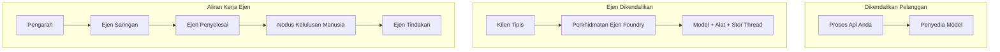
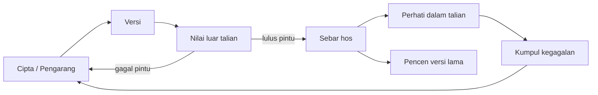
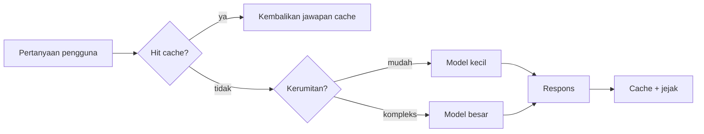
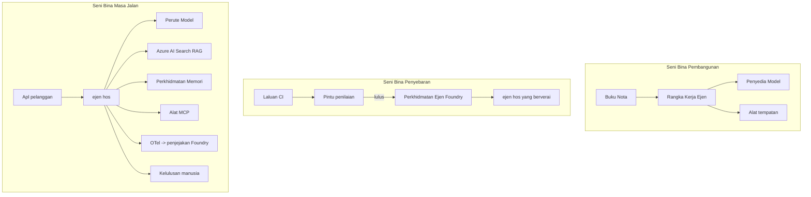

# Menyebarkan Ejen Skala Besar dengan Microsoft Foundry


Sehingga ke titik ini dalam kursus, anda telah membina ejen yang berjalan di laptop anda, di dalam notebook, dipacu oleh `az login` dan beberapa pembolehubah persekitaran. Itulah cara yang betul untuk belajar. Ia bukan cara yang betul untuk menjalankan ejen yang bergantung kepada ribuan pelanggan pada pukul 3 pagi.

Pelajaran ini mengenai jurang antara "ia berfungsi pada mesin saya" dan "ia berfungsi, dengan boleh dipercayai dan mampu milik, dalam pengeluaran." Kami menutup jurang itu menggunakan **Microsoft Foundry** dan **Microsoft Foundry Agent Service**, dan kami melakukannya dengan membina ejen sokongan pelanggan sebenar yang mempunyai alat, pengambilan, memori, penilaian, dan pemantauan.

## Pengenalan

Pelajaran ini akan merangkumi:

- Perbezaan antara **ejen prototaip** dan **ejen yang disebarkan**, dan mengapa peralihan itu kebanyakannya mengenai segala-galanya *di sekeliling* model.
- **Corak penyebaran** untuk ejen: hos-pelanggan, hos-perkhidmatan (Ejen Berhos), dan yang dikawal alir kerja.
- **Kitaran hayat ejen** di Microsoft Foundry — cipta, versi, sebar, nilaikan, perhatikan, bersara.
- **Strategi penskalaan**: penghalaan model, pengkasan, serentak, dan reka bentuk tanpa status.
- **Pengamatan** dengan OpenTelemetry dan penjejakan Foundry.
- **Pengoptimuman kos** melalui pemilihan model, penghalaan, dan pintu penilaian.
- **Pertimbangan perusahaan**: tadbir urus, kelulusan manusia, dan menjalankan pelayan MCP dengan selamat dalam pengeluaran.

## Matlamat Pembelajaran

Selepas menamatkan pelajaran ini, anda akan mengetahui cara untuk:

- Memilih corak penyebaran yang betul untuk beban kerja ejen yang diberikan.
- Menyebarkan ejen ke Microsoft Foundry Agent Service supaya ia mempunyai versi, dikawal, dan boleh diperhatikan.
- Menginstrumen ejen untuk penjejakan dan menyambungkan saluran penilaian yang berjalan sebelum setiap keluaran.
- Menerapkan penghalaan model dan pengkasan untuk memastikan kelewatan dan kos terkawal pada skala besar.
- Menambah pintu kelulusan manusia untuk tindakan berisiko tinggi dan mengintegrasikan pelayan MCP dengan cara yang selamat untuk pengeluaran.

## Prasyarat

Pelajaran ini mengandaikan anda telah menamatkan pelajaran sebelumnya dan selesa dengan:

- Membina ejen dengan [Microsoft Agent Framework](../14-microsoft-agent-framework/README.md) (Pelajaran 14).
- [Penggunaan Alat](../04-tool-use/README.md) (Pelajaran 4) dan [Agentic RAG](../05-agentic-rag/README.md) (Pelajaran 5).
- [Memori Ejen](../13-agent-memory/README.md) (Pelajaran 13) dan [Protokol Agentic / MCP](../11-agentic-protocols/README.md) (Pelajaran 11).
- [Pengamatan dan Penilaian](../10-ai-agents-production/README.md) (Pelajaran 10) — pelajaran ini dibina terus dari situ.

Anda juga memerlukan:

- **Langganan Azure** dan **projek Microsoft Foundry** dengan sekurang-kurangnya satu model sembang yang disebarkan.
- **Azure CLI** yang diautentikasi (`az login`).
- Python 3.12+ dan pakej dalam repositori [`requirements.txt`](../../../requirements.txt).

## Dari Prototaip ke Pengeluaran: Apa yang Sebenarnya Berubah

Ejen prototaip dan ejen pengeluaran berkongsi litar teras yang sama — berfikir, panggil alat, jawab. Apa yang berubah ialah segala-galanya di sekeliling litar itu. Model mungkin adalah 20% dari ejen pengeluaran; 80% lagi adalah kerangka operasi.

| Kebimbangan | Prototaip | Pengeluaran |
| --- | --- | --- |
| **Penghosan** | Berjalan di notebook anda | Berjalan sebagai perkhidmatan hos, versi dan dilancarkan secara berperingkat |
| **Identiti** | Token `az login` anda | Identiti terurus dengan RBAC terbatas |
| **Keadaan** | Dalam memori, hilang apabila dihidupkan semula | Disimpan di luar (penyimpan benang, perkhidmatan memori) |
| **Kegagalan** | Anda melihat jejak ralat | Cuba semula, fallback, dead-letter, amaran |
| **Kos** | "Beberapa sen saja" | Dipantau setiap permintaan, dihalakan, dikemas, dianggarkan |
| **Kualiti** | Anda menilai output | Dinilai secara automatik sebelum setiap keluaran |
| **Kepercayaan** | Anda meluluskan setiap tindakan | Polisi + manusia dalam gelung untuk tindakan berisiko |

Ingat jadual ini. Setiap seksyen di bawah memetakan ke salah satu baris ini.

## Corak Penyebaran Ejen

Terdapat tiga corak yang anda akan gunakan, sering dalam gabungan.

### 1. Ejen Hos Pelanggan

Objek ejen hidup di dalam proses aplikasi *anda*. Kod anda memanggil penyedia model secara langsung; litar berfikir berjalan dalam perkhidmatan anda. Ini adalah apa yang dilakukan setiap pelajaran sebelumnya.

- **Gunakan apabila** anda memerlukan kawalan penuh atas litar, middleware tersuai, atau anda menyematkan ejen dalam backend yang sudah ada.
- **Pertukaran**: anda memiliki penskalaan, keadaan, dan ketahanan sendiri.

### 2. Ejen Berhos (Foundry Agent Service)

Ejen didaftarkan sebagai sumber dalam Microsoft Foundry. Foundry menghoskan litar berfikir, menyimpan benang, menguatkuasakan keselamatan kandungan dan RBAC, dan menjadikan ejen kelihatan dalam portal Foundry. Aplikasi anda menjadi pelanggan nipis yang mencipta benang dan membaca respons.

- **Gunakan apabila** anda mahukan ketahanan, kebolehpantauan terbina dalam, tadbir urus, dan permukaan operasi yang lebih kecil.
- **Pertukaran**: kurang kawalan tahap rendah sebagai pertukaran untuk runtime yang diuruskan.

### 3. Aliran Kerja Ejen

Pelbagai ejen (dan alat) disusun menjadi graf dengan aliran kawalan yang jelas — langkah berurutan, cabang, nod kelulusan manusia, dan penanda tahan yang boleh berhenti dan disambung semula. Ini adalah keupayaan Microsoft Agent Framework **Aliran Kerja** yang digunakan pada skala penyebaran.

- **Gunakan apabila** satu tugas merangkumi beberapa ejen khusus atau memerlukan langkah kelulusan di tengah.
- **Pertukaran**: lebih banyak bahagian bergerak; memerlukan kebolehpantauan tahap orkestrasi.



## Kitaran Hayat Ejen di Microsoft Foundry

Menyebarkan ejen bukan sekadar satu kali `push`. Ia adalah satu litar, dan ia kelihatan seperti kitaran keluaran perisian kerana itulah yang sebenarnya.



Idea utama, dibawa dari [Pelajaran 10](../10-ai-agents-production/README.md): **penilaian luar talian adalah pintu, bukan selepas fikir.** Versi ejen baru tidak dihantar melainkan ia melepasi ambang penilaian anda. Kebolehpantauan dalam talian kemudiannya memberi maklum balas kegagalan dunia sebenar ke dalam set ujian luar talian anda. Itu adalah keseluruhan litar.

## Strategi Penskalaan

Penskalaan ejen berbeza dari penskalaan API web tanpa status, kerana setiap permintaan boleh mencetuskan banyak panggilan model dan alat yang mahal. Empat teknik menanggung sebahagian besar beban.

**Pengendalian permintaan tanpa status.** Jangan simpan keadaan per pengguna dalam memori proses anda. Simpan benang perbualan dalam stor benang Foundry atau perkhidmatan memori supaya mana-mana instans boleh mengendalikan mana-mana permintaan. Ini membolehkan anda skala secara mendatar — tambah instans, tiada sesi melekit.

**Penghalaan model.** Tidak setiap permintaan memerlukan model paling berupaya (dan paling mahal) anda. Halakan permintaan mudah — klasifikasi niat, jawapan fakta pendek — kepada model kecil dan pantas, dan simpan model besar untuk pemikiran sebenar. **Penghala Model** Foundry boleh melakukan ini untuk anda, atau anda boleh melaksanakan pengelasan ringan sendiri. Anda akan membina versi DIY dalam makmal.

**Pengkasan respons.** Banyak pertanyaan sokongan hampir serupa ("bagaimana saya tetapkan semula kata laluan?"). Sediakan jawapan untuk soalan lazim dan hidangkan tanpa menghubungi model langsung. Walaupun kadar hentaman cache sederhana mengurangkan kos dan kelewatan dengan ketara.

**Serentak dan tekanan belakang.** Penyedia model mempunyai had kadar. Hadkan serentak anda, gunakan cubaan semula dengan peningkatan eksponen, dan gagal dengan anggun (respons "kami sedang mengendalikannya" beratur lebih baik dari 500).



## Kebolehpantauan dalam Pengeluaran

Anda tidak boleh mengendalikan apa yang anda tidak dapat lihat. Seperti yang dibincangkan dalam Pelajaran 10, Microsoft Agent Framework mengeluarkan jejak **OpenTelemetry** secara asli — setiap panggilan model, pemanggilan alat, dan langkah orkestrasi menjadi ruang lingkup. Dalam pengeluaran anda mengeksport ruang lingkup itu ke Microsoft Foundry (atau mana-mana backend yang serasi OTel) supaya anda boleh:

- Jejak aduan pelanggan secara menyeluruh merentasi setiap panggilan model dan alat.
- Pantau kelewatan p50/p95 dan kos setiap permintaan dari masa ke masa.
- Amaran pada lonjakan kadar ralat dan anomali kos sebelum pengguna anda (atau pasukan kewangan anda) perasan.

```python
from agent_framework.observability import get_tracer

tracer = get_tracer()

with tracer.start_as_current_span("support_request") as span:
    span.set_attribute("customer.tier", "enterprise")
    span.set_attribute("routed.model", "gpt-5-nano")
    # pelaksanaan ejen dikesan secara automatik dalam julat ini
```

Atribut seperti `customer.tier` dan `routed.model` menukar dinding jejak menjadi soalan yang boleh dijawab ("adakah pelanggan perusahaan dialihkan terlalu kerap ke model kecil?").

## Pengoptimuman Kos

Kos dalam ejen pengeluaran didominasi oleh token. Tiga tuil, mengikut kesan:

1. **Saizkan model dengan betul.** Model kecil yang melepasi pintu penilaian anda hampir pasti lebih murah daripada model besar yang juga melepasi. Gunakan penilaian untuk *membuktikan* model kecil cukup baik dan bukan secara lalai pilih model terbesar kerana berhati-hati.
2. **Halakan berdasarkan kerumitan.** Seperti di atas — bayar harga model besar hanya untuk permintaan yang memerlukan pemikiran model besar.
3. **Kemas cache secara agresif.** Panggilan model paling murah ialah yang tidak pernah anda buat.

Pintu penilaian dan kawalan kos adalah disiplin yang sama dilihat dari dua sudut: penilaian memberitahu anda *lantai kualiti*, penghalaan dan pengkasan menjaga anda sekurang-kurangnya serendah *kos* lantai itu.

## Pertimbangan Penyebaran Perusahaan

**Tadbir urus.** Ejen Berhos mewarisi RBAC, keselamatan kandungan, dan logging audit Foundry. Berikan setiap ejen identiti terurus dengan keistimewaan paling rendah yang diperlukan — akses baca sahaja ke pangkalan pengetahuan, akses terhad ke API tiket, tiada lebih.

**Manusia dalam gelung.** Beberapa tindakan terlalu penting untuk diautomasikan terus — mengeluarkan bayaran balik, memadam akaun, meningkatkan kepada pasukan undang-undang. Microsoft Agent Framework menyokong alat **perlu kelulusan**: ejen mencadangkan tindakan, pelaksanaan berhenti, manusia meluluskan atau menolak, dan alir kerja disambung semula. Anda telah melihat primitif dalam [Pelajaran 6](../06-building-trustworthy-agents/README.md); di sini anda menyebarkannya.

**MCP dalam pengeluaran.** [MCP](../11-agentic-protocols/README.md) membolehkan ejen anda menggunakan alat luaran melalui antara muka standard. Dalam pengeluaran, anggap setiap pelayan MCP sebagai sempadan yang tidak dipercayai: pin versi pelayan, jalankan dengan identiti terbatas, sahkan outputnya, dan jangan dedahkan rahsia kepadanya. Pelayan MCP adalah pergantungan, dan pergantungan menerima tampalan, diaudit, dan had kadar.



Tiga rajah itu — pembangunan, penyebaran, runtime — adalah ejen yang sama pada tiga tahap kehidupannya. Makmal yang berikut membimbing anda membinanya.

## Makmal Praktikal: Ejen Sokongan Pelanggan Sedia Pengeluaran

Buka [`code_samples/16-python-agent-framework.ipynb`](./code_samples/16-python-agent-framework.ipynb) dan kerjakan dari awal hingga akhir. Anda akan menyusun **ejen sokongan pelanggan Contoso** dengan setiap kebimbangan pengeluaran dipasang:

1. **Panggilan alat** — semak status pesanan dan buka tiket sokongan.
2. **RAG** — jawab soalan polisi dari pangkalan pengetahuan (Azure AI Search, dengan fallback dalam memori supaya notebook berjalan tanpa sumber Search).
3. **Memori** — ingat pelanggan sepanjang giliran perbualan.
4. **Penghalaan model** — pengelasan kerumitan menghalakan setiap permintaan ke model kecil atau besar.
5. **Pengkasan respons** — soalan berulang disajikan dari cache.
6. **Kelulusan manusia** — bayaran balik di atas ambang berhenti untuk tandatangan manusia.
7. **Saluran penilaian** — set ujian luar talian kecil menilai ejen dan bertindak sebagai pintu keluaran.
8. **Kebolehpantauan** — penjejakan OpenTelemetry di setiap permintaan.

### Panduan Langkah demi Langkah

Notebook disusun supaya setiap kebimbangan pengeluaran adalah seksyen berdiri sendiri yang boleh dijalankan. Intinya ialah pengendali permintaan penghalaan-plus-pengkasan:

```python
async def handle_support_request(query: str, customer_id: str) -> str:
    # 1. Hidangkan dari cache bila boleh.
    cached = response_cache.get(normalize(query))
    if cached:
        return cached

    # 2. Lalukan mengikut kerumitan untuk mengawal kos.
    model = "gpt-5-nano" if is_simple(query) else "gpt-5-mini"

    # 3. Jalankan ejen dalam jejak masa untuk keterlihatan.
    with tracer.start_as_current_span("support_request") as span:
        span.set_attribute("routed.model", model)
        span.set_attribute("customer.id", customer_id)
        response = await support_agent.run(query, model=model)

    # 4. Cache dan pulangkan.
    response_cache.set(normalize(query), response.text)
    return response.text
```

Pintu penilaian yang menjaga keluaran kelihatan seperti ini:

```python
async def evaluation_gate(agent, test_cases, threshold: float = 0.8) -> bool:
    passed = 0
    for case in test_cases:
        result = await agent.run(case["input"])
        if score_response(result.text, case["expected"]) >= 0.8:
            passed += 1
    pass_rate = passed / len(test_cases)
    print(f"Evaluation pass rate: {pass_rate:.0%} (gate: {threshold:.0%})")
    return pass_rate >= threshold  # hanya deploy jika pintu lulus
```

Baca setiap baris — notebook menjaga primitif sengaja kecil supaya tiada yang tersembunyi di belakang panggilan rangka kerja.

## Mengesahkan Ejen yang Disebar dengan Ujian Asap

Pintu penilaian di atas dijalankan *luar talian* terhadap objek ejen anda. Setelah ejen disebarkan sebagai Ejen Berhos, anda memerlukan satu lagi pemeriksaan yang lebih murah: **adakah titik hujung yang disebarkan benar-benar menjawab?**

Menyebarkan "berjaya" hanya membuktikan pesawat kawalan menerima definisi — ia tidak membuktikan ejen memberi respons. Kekurangan pergantungan, penghalaan model yang salah, atau sambungan tamat boleh meninggalkan penyebaran hijau yang tidak mengembalikan apa-apa. **Ujian asap** menangkap itu dalam beberapa saat, pada setiap penyebaran, tanpa kos penilaian penuh.

Repositori ini membekalkan saluran ujian asap yang sedia digunakan dibina pada [AI Smoke Test](https://github.com/marketplace/actions/ai-smoke-test) GitHub Action:

- **Katalog** — [`tests/lesson-16-smoke-tests.json`](../../../tests/lesson-16-smoke-tests.json) mengandungi arahan dan pernyataan untuk ejen sokongan Contoso (jawapan polisi berasaskan fakta, carian pesanan, kekal dalam topik, dan kesinambungan benang pelbagai giliran). Katalog untuk ejen pelajaran lain berada di sebelah — lihat [`tests/README.md`](../tests/README.md).
- **Aliran kerja** — [`.github/workflows/smoke-test.yml`](../../../.github/workflows/smoke-test.yml) log masuk dengan Azure OIDC dan POST setiap arahan ke titik hujung Respons ejen, gagal tugasan jika terdapat kegagalan apa-apa pernyataan.

```yaml
- name: Smoke-test hosted agent
  uses: JFolberth/ai-smoketest@v1
  with:
    project_endpoint: ${{ inputs.project_endpoint }}
    agent_name: ContosoSupportAgent
    tests_file: tests/lesson-16-smoke-tests.json
```


Jalankan ia dari tab **Actions** setelah ejen anda diterapkan, dengan membekalkan titik akhir projek Foundry dan nama ejen anda. Identiti persekutuan memerlukan peranan **Azure AI User** pada skop projek Foundry. Fikirkan lapisan-lapisan ini seperti piramid: ujian asap (boleh dicapai dan memberi respons?) dijalankan pada setiap penerapan, penilaian luar talian (cukup baik untuk dihantar?) dijalankan sebelum kenaikan tahap, dan penilaian dalam talian (bagaimana prestasinya dalam persekitaran sebenar?) dijalankan secara berterusan.

## Pemeriksaan Pengetahuan

Uji pemahaman anda sebelum beralih ke tugasan.

**1. Anggaran berapa besar bahagian agen produksi adalah "model," dan apa selebihnya?**

<details>
<summary>Jawapan</summary>

Model adalah minoriti dalam sistem — selalunya dikatakan sekitar 20%. Selebihnya adalah kerangka operasi: hosting dan versi, identiti dan RBAC, keadaan yang dipisah, pengendalian kegagalan, pengesanan kos, penilaian, dan kawalan manusia-dalam-silikon. Peralihan ke produksi kebanyakannya mengenai membina segala-galanya *sekitar* gelung penalaran.
</details>

**2. Bilakah anda memilih Hosted Agent berbanding agen yang dihoskan oleh klien?**

<details>
<summary>Jawapan</summary>

Apabila anda mahukan masa jalan terurus dengan ketahanan terbina dalam (benang yang berterusan dan boleh disambung semula), kebolehamatan, keselamatan kandungan, dan RBAC, dan anda sanggup mengorbankan sebahagian kawalan rendah ke atas gelung penalaran untuk mengurangkan kawasan operasi. Klien-di-host lebih sesuai apabila anda memerlukan kawalan penuh atas gelung tersebut atau menyemat agen dalam backend sedia ada.
</details>

**3. Mengapa agen yang boleh diskala mesti tidak menyimpan keadaan dalam memori proses sendiri?**

<details>
<summary>Jawapan</summary>

Supaya mana-mana instans dapat mengendalikan sebarang permintaan, yang membolehkan penskalaan mendatar tanpa sesi lekatan. Keadaan perbualan bagi setiap pengguna dipisahkan ke stor benang atau servis memori. Jika keadaan disimpan dalam memori proses, anda akan kehilangannya apabila dimulakan semula dan tidak boleh mengagihkan beban secara bebas.
</details>

**4. Masalah apa yang diselesaikan oleh penatalan model, dan bagaimana ia berkaitan dengan penilaian?**

<details>
<summary>Jawapan</summary>

Penatalan menghantar permintaan mudah ke model kecil, murah dan cepat dan mengekalkan model besar untuk penalaran sebenar, mengawal kedua-dua latensi dan kos. Ia berkaitan dengan penilaian kerana penilaian adalah yang *membuktikan* model kecil cukup baik untuk satu kelas permintaan — penatalan tanpa penilaian adalah meneka.
</details>

**5. Apakah itu "pintu masuk penilaian" dan di manakah ia dalam kitaran hayat?**

<details>
<summary>Jawapan</summary>

Pintu masuk penilaian menjalankan set ujian luar talian terhadap versi agen baru dan menghalang penerapan melainkan kadar lulus melepasi ambang tertentu. Ia berada di antara "versi" dan "terapan" dalam kitaran hayat, menjadikan kualiti sebagai syarat terlebih dahulu untuk keluaran dan bukan sesuatu yang diperiksa selepas penghantaran.
</details>

**6. Mengapa pelayan MCP harus dianggap sebagai sempadan yang tidak dipercayai dalam produksi?**

<details>
<summary>Jawapan</summary>

Kerana ia adalah kebergantungan luaran yang dipanggil oleh agen anda. Anda harus menetapkan versinya, menjalankannya dengan identiti terhad, mengesahkan outputnya, menghadkan kadar, dan tidak pernah mendedahkan rahsia kepadanya — disiplin yang sama yang anda gunakan pada mana-mana kebergantungan pihak ketiga. Outputnya memasuki penalaran agen anda, jadi kepercayaan tanpa pengesahan adalah risiko keselamatan.
</details>

**7. Perubahan tunggal manakah biasanya memberi impak terbesar pada kos agen produksi, dan mengapa?**

<details>
<summary>Jawapan</summary>

Memilih saiz model yang betul — menggunakan model terkecil yang masih lulus pintu masuk penilaian anda. Kos didominasi oleh token, dan model yang lebih kecil yang memenuhi piawaian kualiti hampir selalu lebih murah daripada yang besar. Caching dan penatalan kemudian mengurangkan kos lebih lanjut, tetapi memilih model asas yang betul mempunyai kesan utama tahap pertama paling besar.
</details>

**8. Peranan apakah atribut span seperti `customer.tier` dan `routed.model` dalam kebolehamatan?**

<details>
<summary>Jawapan</summary>

Ia mengubah jejak mentah menjadi soalan perniagaan yang boleh dijawab. Tanpa atribut anda hanya mempunyai tembok span; dengan atribut anda boleh bertanya "adakah pelanggan perusahaan terlalu kerap diarahkan ke model kecil?" atau "model manakah mengendalikan permintaan paling perlahan kami?" Atribut adalah bagaimana anda memotong telemetri mengikut dimensi yang penting untuk operasi anda.
</details>

## Tugasan

Ambil ejen sokongan pelanggan daripada makmal dan kukuhkan ia untuk satu senario khusus: **ejen sokongan bil langganan untuk sebuah syarikat SaaS.**

Penyerahan anda harus:

1. **Gantikan alat-alat** dengan yang relevan untuk pengebilan: `get_subscription_status`, `get_invoice`, dan `issue_credit` (kredit lebih RM50 memerlukan kelulusan manusia).
2. **Tambah tiga dokumen RAG** yang merangkumi dasar bayaran balik syarikat, kitaran bil, dan dasar pembatalan.
3. **Perluas set penilaian** kepada sekurang-kurangnya lapan kes, termasuk sekurang-kurangnya dua yang *sepatutnya* mencetuskan laluan kelulusan manusia, dan sahkan pintu masuk penilaian anda lulus atau gagal dengan betul.
4. **Tambah satu laporan kos**: selepas menjalankan sepuluh pertanyaan campuran melalui ejen, cetak berapa banyak yang pergi ke model kecil, berapa banyak ke model besar, dan berapa banyak yang dilayani dari cache.

Tulis satu perenggan ringkas (dalam sel markdown) yang menerangkan peraturan penatalan model mana yang anda pilih dan bagaimana anda akan mengesahkannya dengan trafik sebenar. Tiada jawapan tunggal yang betul — anda dinilai berdasarkan sama ada kebimbangan produksi disambungkan secara koheren.

## Ringkasan

Dalam pelajaran ini anda telah memindahkan agen dari prototaip ke produksi menggunakan Microsoft Foundry:

- Lompat ke produksi lebih banyak berkisar pada **kerangka operasi** di sekeliling model — hosting, identiti, keadaan, pengendalian kegagalan, kos, kualiti, dan kepercayaan.
- Anda pelajari tiga **corak penerapan** — klien-hosted, Hosted Agents, dan Agent Workflows — dan bila setiap satu sesuai.
- Anda menelusuri **kitaran hayat agen**, di mana penilaian luar talian **berfungsi sebagai pintu masuk pelepasan** dan kebolehamatan dalam talian menghantar balik kegagalan ke set ujian.
- Anda gunakan **strategi penskalaan** — reka bentuk tanpa keadaan, penatalan model, caching, dan senggaraan terhad — dan menghubungkannya ke **pengoptimuman kos**.
- Anda sambungkan **kawalan perusahaan**: RBAC, kelulusan manusia-dalam-silikon, dan integrasi MCP yang selamat untuk produksi.
- Anda bina **agen sokongan pelanggan sedia produksi** yang mengikat setiap satu kebimbangan ini bersama dalam kod yang boleh dijalankan.

Pelajaran seterusnya mengambil perjalanan berlawanan: bukannya menskala agen ke awan, anda akan membawanya *turun* ke satu mesin pembangun dan menjalankannya sepenuhnya secara tempatan.

## Sumber Tambahan

- <a href="https://learn.microsoft.com/azure/ai-foundry/what-is-azure-ai-foundry" target="_blank">Dokumentasi Microsoft Foundry</a>
- <a href="https://learn.microsoft.com/azure/ai-foundry/agents/overview" target="_blank">Gambaran Keseluruhan Perkhidmatan Ejen Microsoft Foundry</a>
- <a href="https://learn.microsoft.com/en-us/agent-framework/overview/?wt.mc_id=youtube_26688_organicsocial_reactor&pivots=programming-language-python" target="_blank">Rangka Kerja Ejen Microsoft</a>
- <a href="https://learn.microsoft.com/azure/ai-foundry/concepts/model-router" target="_blank">Penatal Model dalam Microsoft Foundry</a>
- <a href="https://learn.microsoft.com/azure/search/search-what-is-azure-search" target="_blank">Azure AI Search</a>
- <a href="https://opentelemetry.io/" target="_blank">OpenTelemetry</a>
- <a href="https://github.com/marketplace/actions/ai-smoke-test" target="_blank">AI Smoke Test GitHub Action</a>
- <a href="https://modelcontextprotocol.io/" target="_blank">Model Context Protocol (MCP)</a>

## Pelajaran Sebelumnya

[Membina Ejen Penggunaan Komputer (CUA)](../15-browser-use/README.md)

## Pelajaran Seterusnya

[Mencipta Ejen AI Tempatan](../17-creating-local-ai-agents/README.md)

---

<!-- CO-OP TRANSLATOR DISCLAIMER START -->
**Penafian**:
Dokumen ini telah diterjemahkan menggunakan perkhidmatan terjemahan AI [Co-op Translator](https://github.com/Azure/co-op-translator). Walaupun kami berusaha untuk ketepatan, sila ambil maklum bahawa terjemahan automatik mungkin mengandungi kesilapan atau ketidaktepatan. Dokumen asal dalam bahasa asalnya harus dianggap sebagai sumber yang sahih. Untuk maklumat penting, terjemahan oleh manusia profesional adalah disyorkan. Kami tidak bertanggungjawab terhadap sebarang salah faham atau salah tafsir yang timbul daripada penggunaan terjemahan ini.
<!-- CO-OP TRANSLATOR DISCLAIMER END -->