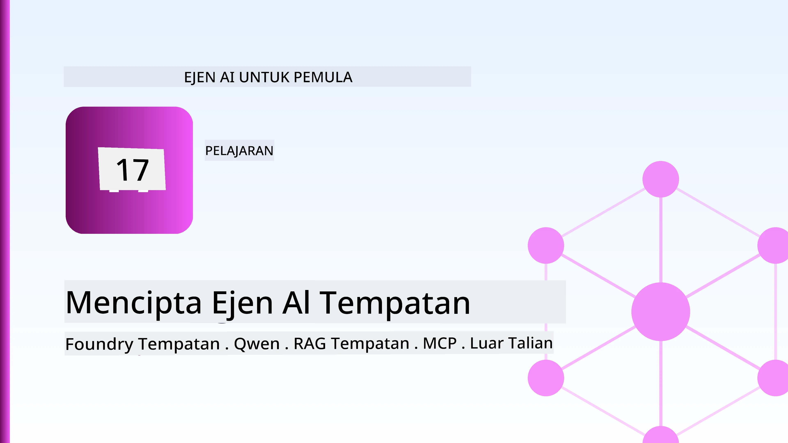
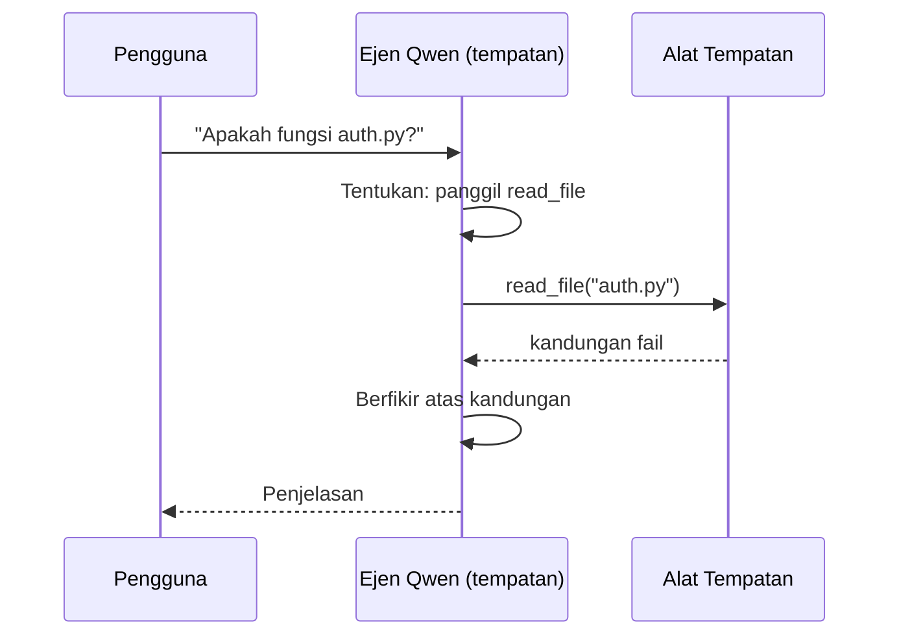
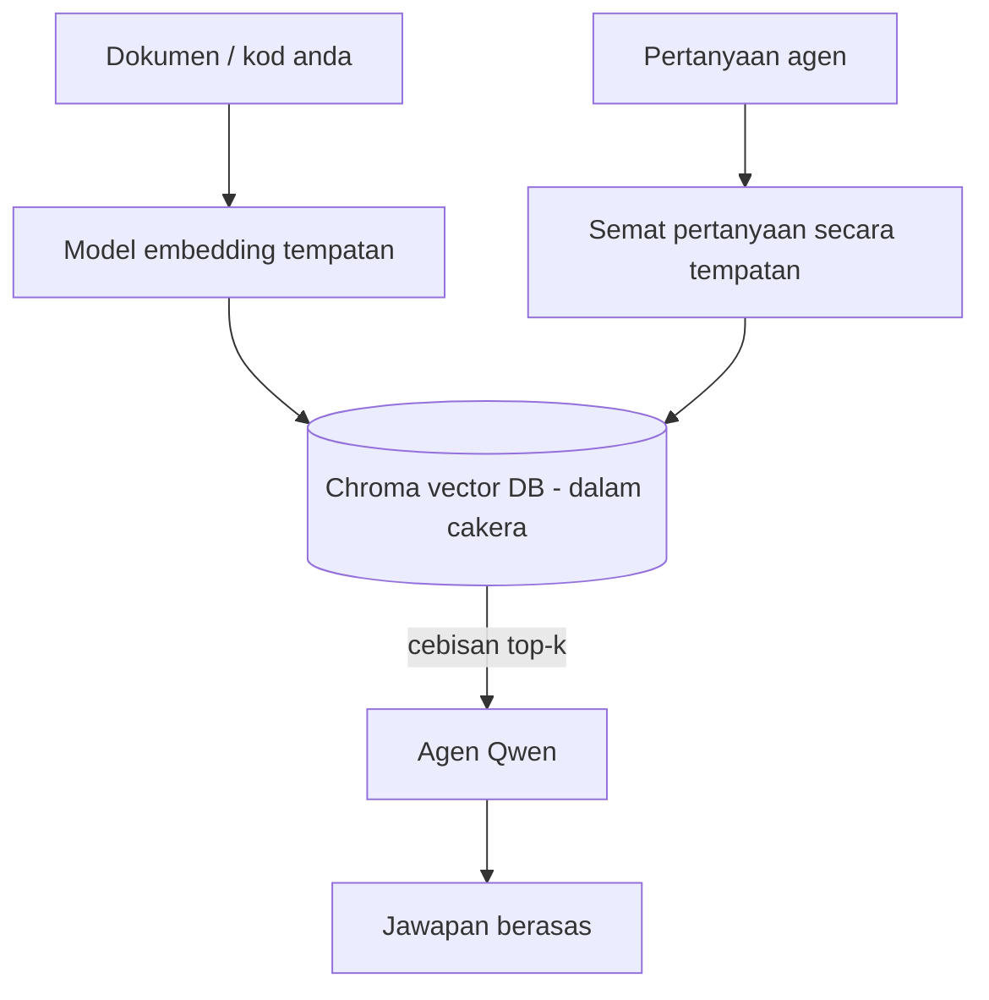

# Membuat Ejen AI Tempatan Menggunakan Microsoft Foundry Local dan Qwen



Pelajaran sebelumnya meningkatkan skala ejen ke *awan*. Pelajaran ini menurunkannya ke mesin tunggal. Pada akhirnya anda akan memiliki pembantu kejuruteraan yang berfungsi yang membuat alasan, memanggil alat, membaca fail anda, dan mencari dokumentasi anda — **tanpa satu panggilan inferens awan pun.**

Mengapa anda mahu itu? Tiga sebab yang sering muncul dalam kerja kejuruteraan sebenar:

- **Privasi.** Kod dan dokumen tidak pernah meninggalkan mesin. Tiada arahan, tiada petikan, tiada data pelanggan melintasi sempadan rangkaian.
- **Kos.** Inferens tempatan tidak mempunyai bil per-token. Anda boleh berulang sepanjang hari dengan harga elektrik.
- **Luar talian.** Di dalam pesawat, di fasiliti selamat, atau semasa gangguan, ejen masih berfungsi.

Yang perlu diingat ialah anda menukar model awan termaju kepada **Model Bahasa Kecil (SLM)** yang berjalan pada CPU, GPU, atau NPU anda. Pelajaran ini tentang membina ejen yang *baik* dalam kekangan itu daripada berpura-pura kekangan itu tidak wujud.

## Pengenalan

Pelajaran ini akan merangkumi:

- **Model Bahasa Kecil (SLM)** — apa itu, di mana ia cemerlang, dan di mana ia tidak.
- **Microsoft Foundry Local** — satu runtime yang memuat turun dan memberikan model di peranti melalui **API yang serasi dengan OpenAI**.
- **Model panggilan fungsi Qwen** — SLM yang menghasilkan panggilan alat dengan boleh dipercayai, yang membolehkan ejen tempatan (bukan sekadar sembang tempatan).
- **Alat tempatan, RAG tempatan, dan MCP tempatan** — memberikan kemampuan kepada ejen tanpa awan.
- **Corak hibrid** — bila hendak kekal tempatan dan bila hendak mencapai awan.

## Matlamat Pembelajaran

Selepas melengkapkan pelajaran ini, anda akan tahu bagaimana untuk:

- Terangkan pertukaran kompromi SLM dan pilih kes penggunaan ejen tempatan yang sesuai.
- Menyediakan model Qwen secara tempatan dengan Foundry Local dan sambung kepadanya melalui titik akhir yang serasi OpenAI.
- Membina ejen pemanggil alat yang berjalan sepenuhnya pada stesen kerja anda.
- Menambah RAG tempatan ke atas dokumen anda sendiri menggunakan pangkalan data vektor tempatan (Chroma).
- Sambungkan ejen ke pelayan MCP tempatan dan fahami tentang reka bentuk hibrid tempatan/awan.

## Prasyarat

Pelajaran ini menganggap anda telah melengkapkan pelajaran terdahulu dan selesa dengan:

- [Penggunaan Alat](../04-tool-use/README.md) (Pelajaran 4) dan [Agentic RAG](../05-agentic-rag/README.md) (Pelajaran 5).
- [Protokol Agentik / MCP](../11-agentic-protocols/README.md) (Pelajaran 11).
- [Rangka Kerja Ejen Microsoft](../14-microsoft-agent-framework/README.md) (Pelajaran 14).

Anda juga memerlukan:

- Stesen kerja pembangun. **8 GB RAM adalah minimum yang realistik**; 16 GB+ adalah selesa. GPU atau NPU membantu tetapi tidak diwajibkan.
- **Microsoft Foundry Local** dipasang (lihat bahagian penyediaan di bawah).
- Python 3.12+ dan pakej dalam repositori [`requirements.txt`](../../../requirements.txt), serta `foundry-local-sdk`, `openai`, dan `chromadb` untuk pelajaran ini.

## Model Bahasa Kecil: Alat Yang Sesuai untuk Kerja Tempatan

Model awan termaju mempunyai beratus-ratus bilion parameter dan pusat data di belakangnya. SLM mempunyai beberapa bilion parameter dan perlu muat dalam RAM komputer riba anda. Perbezaan itu menetapkan jangkaan yang jelas.

**SLM cemerlang dalam:**

- Tugas berstruktur dan terhad — pengelasan, pengekstrakan, ringkasan dokumen yang diketahui.
- **Panggilan alat** — memutuskan fungsi mana untuk dipanggil dan dengan argumen apa.
- Penukaran cepat, murah, dan peribadi pada data anda sendiri.

**SLM kurang kuat dalam:**

- Penalaran terbuka, multi-langkah merentas konteks besar.
- Pengetahuan dunia yang luas (mereka melihat kurang, dan lupa lebih banyak).

Strategi yang menang untuk ejen tempatan adalah: **biar SLM menguruskan, dan biar alat melakukan kerja berat.** Model tidak perlu *tahu* kod anda — ia perlu tahu bila untuk memanggil `read_file` dan `search_docs`. Itu terus sesuai dengan kekuatan SLM.


## Microsoft Foundry Local

**Microsoft Foundry Local** adalah runtime ringan yang memuat turun, mengurus, dan memberikan model sepenuhnya pada mesin anda. Ciri paling penting untuk kita adalah ia menyediakan **titik akhir HTTP yang serasi dengan OpenAI** — yang bermaksud SDK OpenAI dan klien OpenAI Rangka Kerja Ejen Microsoft berfungsi dengannya hanya dengan menukar `base_url`. Semua yang anda pelajari tentang membina ejen terus digunakan; hanya titik akhir berubah dari awan ke `localhost`.

Foundry Local juga memilih binaan model terbaik untuk perkakasan anda secara automatik — binaan CPU, binaan CUDA/GPU, atau binaan NPU — jadi anda tidak perlu mengoptimumkan setiap mesin secara manual.

### Penyediaan

Pasang Foundry Local (lihat [dokumentasi](https://learn.microsoft.com/azure/ai-foundry/foundry-local/) untuk OS anda), kemudian sahkan ia berfungsi:

```bash
# Pasang (contoh; ikut dokumentasi untuk platform anda)
winget install Microsoft.FoundryLocal      # Windows
# brew install microsoft/foundrylocal/foundrylocal   # macOS

# Muat turun dan jalankan model Qwen, kemudian mulakan perkhidmatan tempatan
foundry model run qwen2.5-7b-instruct
foundry service status
```

Setelah perkhidmatan berjalan anda mempunyai titik akhir serasi OpenAI secara tempatan (biasanya `http://localhost:PORT/v1`). Notebook menggunakan `foundry-local-sdk` untuk menemui titik akhir secara automatik, jadi anda tidak perlu mengekodkan nombor port secara keras.

## Panggilan Fungsi Qwen: Mengapa Ia Penting

Ejen hanya ejen jika ia boleh memanggil alat. Banyak SLM boleh bersembang tetapi menghasilkan panggilan alat yang tidak boleh dipercayai dan cacat. Model **Qwen** dilatih untuk panggilan fungsi dan menghasilkan struktur panggilan alat yang teratur konsisten — yang menjadikan model sembang tempatan menjadi *ejen* tempatan.

Alirannya adalah gelung panggilan alat standard yang anda sudah tahu, hanya dijalankan pada peranti:



## RAG Tempatan

Carian dokumentasi adalah tempat ejen tempatan menunjukkan nilai mereka. Daripada mengharap SLM menghafal dokumen rangka kerja anda, anda menanam dokumen tersebut ke dalam **pangkalan data vektor tempatan** dan membiarkan ejen mengambil potongan berkaitan mengikut permintaan.

Kami menggunakan **Chroma**, sebuah stor vektor terbenam yang berjalan dalam proses tanpa pelayan yang perlu dikendalikan. Aliran adalah sepenuhnya tempatan: model penanaman tempatan → vektor tempatan → pemulihan tempatan → SLM tempatan.



Ini adalah corak Agentic RAG yang sama dari Pelajaran 5 — satu-satunya perubahan ialah semua komponen berjalan pada mesin anda.

## Pelayan MCP Tempatan

[MCP](../11-agentic-protocols/README.md) adalah pengangkutan, bukan perkhidmatan awan. Pelayan MCP boleh berjalan sebagai proses tempatan pada `stdio`, menyediakan alat kepada ejen anda melalui protokol standard. Ini membolehkan anda menggunakan kembali ekosistem pelayan MCP yang berkembang — akses sistem fail, operasi git, pertanyaan pangkalan data — sepenuhnya luar talian.

Posisi keselamatan berbeza daripada awan, tetapi tidak tiada: pelayan MCP tempatan masih berjalan dengan kebenaran pengguna anda, jadi hadkan apa yang boleh diaksesnya (direktori projek, bukan seluruh folder rumah anda) dan anggap outputnya sebagai input untuk disahkan.

## Corak Hibrid Awan-dan-Tempatan

Utamakan tempatan tidak bermakna hanya tempatan. Sistem matang lalukan berdasarkan kepekaan dan kesukaran:

| Situasi | Di mana ia berjalan |
| --- | --- |
| Kod/Data sensitif, atau luar talian | **SLM Tempatan** |
| Tugas mudah dan terhad | **SLM Tempatan** (murah, cepat) |
| Penalaran multi-langkah sukar pada data tidak sensitif | **Model awan** |
| Semuanya semasa gangguan | **SLM Tempatan** (penurunan kualiti yang terurus) |

Ini mencerminkan idea **penghalaan model** dari Pelajaran 16 — kecuali salah satu "model" itu kini adalah mesin anda sendiri. Reka bentuk yang kukuh beralih kepada tempatan apabila awan tidak tersedia, supaya ejen menurunkan kualiti secara terkawal dan bukan gagal sepenuhnya.


## Makmal Amali: Pembantu Kejuruteraan Tempatan

Buka [`code_samples/17-local-agent-foundry-local.ipynb`](./code_samples/17-local-agent-foundry-local.ipynb) dan ikuti langkah demi langkah. Anda akan membina **pembantu kejuruteraan tempatan** yang berjalan sepenuhnya di stesen kerja anda dan boleh:

1. **Memanggil alat** — melalui panggilan fungsi Qwen melalui Foundry Local.
2. **Melaksanakan operasi fail tempatan** — menyenaraikan dan membaca fail dalam direktori projek.
3. **Menganalisis kod** — melaporkan metrik asas pada fail sumber.
4. **Mencari dokumentasi** — RAG tempatan ke atas folder dokumen dengan Chroma.
5. **Menggunakan MCP** — sambungkan ke pelayan MCP tempatan (dengan langkauan terurus jika tiada yang dikonfigurasi).

Tiada inferens awan digunakan pada mana-mana titik.

### Penjelasan

Pembantu menyambung ke Foundry Local melalui titik akhir yang serasi OpenAI, jadi kod ejen hampir sama dengan pelajaran awan — hanya klien berubah:

```python
from foundry_local import FoundryLocalManager
from openai import OpenAI

# Foundry Local menemui/muat turun model dan memberi kami titik akhir tempatan.
manager = FoundryLocalManager(\"qwen2.5-7b-instruct\")
client = OpenAI(base_url=manager.endpoint, api_key=manager.api_key)  # api_key adalah tempat letak tempatan
```

Alat-alatnya adalah fungsi Python biasa yang dikhususkan kepada direktori projek:

```python
def read_file(path: str) -> str:
    \"\"\"Read a file, but only inside the sandboxed project directory.\"\"\"
    full = (PROJECT_ROOT / path).resolve()
    if PROJECT_ROOT not in full.parents and full != PROJECT_ROOT:
        return \"Access denied: path is outside the project directory.\"
    return full.read_text(encoding=\"utf-8\")
```

Perhatikan pemeriksaan sandbox — walaupun secara tempatan, alat yang membaca laluan sewenang-wenangnya adalah risiko. Notebook memastikan setiap alat terhad kepada akar projek tunggal.

## Semakan Pengetahuan

Uji pemahaman anda sebelum beralih ke tugasan.

**1. Berikan dua sebab konkrit untuk menjalankan ejen secara tempatan dan bukan di awan.**

<details>
<summary>Jawapan</summary>

Mana-mana dua dari: **privasi** (kod dan data tidak pernah meninggalkan mesin), **kos** (tiada bil inferens per-token), dan **keupayaan luar talian** (berfungsi tanpa rangkaian — dalam pesawat, di fasiliti selamat, atau semasa gangguan). Sekatan regulatori/pematuhan yang melarang penghantaran data keluar peranti adalah pendorong biasa kepada sebab privasi.
</details>

**2. Apakah pembahagian kerja yang disyorkan antara SLM dan alatnya dalam ejen tempatan, dan mengapa?**

<details>
<summary>Jawapan</summary>

Biarkan SLM **mengatur** (memutuskan alat mana dipanggil dan dengan argumen apa) dan biarkan **alat melakukan kerja berat** (membaca fail, mengambil dokumen, mengira hasil). SLM kuat dalam keputusan terhad seperti pemilihan alat tetapi lemah dalam pengetahuan luas dan penalaran panjang multi-langkah, jadi bergantung pada alat memainkan kekuatan mereka.
</details>

**3. Apa yang membolehkan semula kod ejen awan digunakan dengan Foundry Local?**

<details>
<summary>Jawapan</summary>

Foundry Local menyediakan **titik akhir HTTP yang serasi dengan OpenAI**. SDK OpenAI dan klien OpenAI Rangka Kerja Ejen berfungsi dengannya hanya dengan menukar `base_url` (dan menggunakan kunci API tempat letak tempatan). Semua kod ejen yang lain kekal sama.
</details>

**4. Kenapa kita menggunakan model panggilan fungsi Qwen khusus dan bukannya mana-mana SLM?**

<details>
<summary>Jawapan</summary>

Kerana ejen mesti menghasilkan **panggilan alat** yang boleh dipercayai dan teratur. Banyak SLM boleh bersembang tetapi mengeluarkan struktur panggilan alat yang cacat atau tidak konsisten. Model Qwen dilatih untuk panggilan fungsi dan menghasilkan panggilan alat yang konsisten, yang menjadikan model sembang tempatan menjadi ejen tempatan yang berfungsi.
</details>

**5. Dalam aliran RAG tempatan, komponen mana yang berjalan pada mesin?**

<details>
<summary>Jawapan</summary>

Kesemuanya: model penanaman, pangkalan data vektor (Chroma, pada cakera), langkah pemulihan, dan SLM. Dokumen ditanam secara tempatan, disimpan secara tempatan, diambil secara tempatan, dan dibuat alasan oleh model tempatan — tiada komponen yang menyentuh awan.
</details>

**6. Pelayan MCP tempatan berjalan pada mesin anda. Adakah ia serta-merta selamat? Apakah langkah berjaga-jaga yang masih perlu diambil?**

<details>
<summary>Jawapan</summary>

Tidak. Pelayan MCP tempatan berjalan dengan kebenaran pengguna anda, jadi ia boleh mengakses apa sahaja yang anda boleh. Hadkan ia kepada apa yang diperlukan (contohnya, direktori projek sahaja, bukan seluruh folder rumah anda) dan anggap outputnya sebagai input untuk disahkan sebelum bertindak.
</details>

**7. Terangkan peraturan laluan hibrid yang munasabah yang termasuk model tempatan.**

<details>
<summary>Jawapan</summary>

Lalukan permintaan sensitif atau luar talian ke SLM tempatan; lalukan tugasan mudah terhad ke SLM tempatan untuk kelajuan dan kos; lalukan penalaran multi-langkah sukar pada data tidak sensitif ke model awan; dan kembali kepada SLM tempatan jika awan tidak tersedia supaya ejen menurunkan kualiti secara terkawal dan tidak gagal. Ini adalah penghalaan model (Pelajaran 16) dengan mesin tempatan sebagai salah satu model.
</details>

**8. Apakah anggaran minimum RAM yang realistik untuk menjalankan ejen tempatan dalam pelajaran ini, dan apa kelebihan lebih RAM?**

<details>
<summary>Jawapan</summary>

Kira-kira **8 GB** adalah minimum yang realistik; 16 GB+ adalah selesa. RAM lebih banyak membolehkan anda menjalankan model yang lebih besar dan lebih mampu serta menyimpan lebih banyak konteks dalam memori. GPU atau NPU mempercepat inferens tetapi tidak diwajibkan — Foundry Local memilih binaan CPU apabila tiada pemecut tersedia.
</details>

## Tugasan

Kembangkan pembantu kejuruteraan tempatan menjadi **penilai dokumentasi tempatan** untuk projek kecil pilihan anda (gunakan salah satu folder pelajaran dalam repositori ini jika anda suka).

Penyerahan anda harus:

1. **Indeks folder dokumen/kod sebenar** ke dalam Chroma (sekurang-kurangnya lima fail).
2. **Tambah alat `find_todos`** yang mengimbas projek untuk komen `TODO`/`FIXME` dan mengembalikannya dengan fail dan nombor baris — dengan pemeriksaan sandbox yang sama seperti `read_file`.

3. **Tanya agen tiga soalan** yang memaksanya untuk menggabungkan alat: satu soalan RAG tulen, satu yang memerlukan membaca fail tertentu, dan satu yang memerlukan mencari TODO.
4. **Ukur masa**: catat masa bagi setiap satu daripada tiga respons tersebut dalam sel markdown. Komen sama ada kelewatan adalah boleh diterima untuk aliran kerja yang anda rancangkan.

Kemudian tulis perenggan pendek mengenai **apa yang anda akan alihkan ke awan dan apa yang anda akan simpan secara tempatan** untuk penilai ini, dan mengapa. Anda dinilai berdasarkan sama ada komponen tempatan disambungkan dengan betul dan sama ada pemikiran hibrid anda adalah tepat — bukan berdasarkan kualiti model.

## Ringkasan

Dalam pelajaran ini anda membina agen yang berjalan sepenuhnya pada mesin anda sendiri:

- **SLMs** menukar keluasan untuk privasi, kos, dan operasi luar talian — dan menyerlah apabila mereka **mengorkestrakan alat** daripada membawa semua pengetahuan itu sendiri.
- **Foundry Local** menyajikan model pada peranti di belakang **endpoint yang serasi OpenAI**, jadi kod agen awan anda boleh dipindah dengan satu baris perubahan.
- **Model pemanggil fungsi Qwen** menjadikan panggilan alat tempatan yang boleh dipercayai — dan oleh itu *agen* tempatan — mungkin.
- **RAG tempatan** (Chroma) dan **MCP tempatan** memberi kebolehan kepada agen tanpa meninggalkan mesin.
- **Corak hibrid** membolehkan anda menghala mengikut sensitiviti dan kesukaran, dengan tempatan sebagai pilihan sandaran yang elegan.

Ini melengkapkan lengkung penyebaran: Pelajaran 16 membesarkan agen ke dalam Microsoft Foundry, dan pelajaran ini mengecilkan mereka ke satu stesen kerja. Pelajaran seterusnya membincangkan tentang memastikan agen yang disebarkan kekal selamat.

## Sumber Tambahan

- <a href="https://learn.microsoft.com/azure/ai-foundry/foundry-local/" target="_blank">Dokumentasi Microsoft Foundry Local</a>
- <a href="https://learn.microsoft.com/azure/ai-foundry/what-is-azure-ai-foundry" target="_blank">Dokumentasi Microsoft Foundry</a>
- <a href="https://learn.microsoft.com/en-us/agent-framework/overview/?wt.mc_id=youtube_26688_organicsocial_reactor&pivots=programming-language-python" target="_blank">Microsoft Agent Framework</a>
- <a href="https://qwen.readthedocs.io/en/latest/framework/function_call.html" target="_blank">Dokumentasi pemanggilan fungsi Qwen</a>
- <a href="https://modelcontextprotocol.io/" target="_blank">Model Context Protocol (MCP)</a>
- <a href="https://docs.trychroma.com/" target="_blank">Pangkalan data vektor Chroma</a>

## Pelajaran Sebelumnya

[Menyebarkan Agen Berskala](../16-deploying-scalable-agents/README.md)

## Pelajaran Seterusnya

[Mengamankan Agen AI](../18-securing-ai-agents/README.md)

---

<!-- CO-OP TRANSLATOR DISCLAIMER START -->
**Penafian**:
Dokumen ini telah diterjemahkan menggunakan perkhidmatan terjemahan AI [Co-op Translator](https://github.com/Azure/co-op-translator). Walaupun kami berusaha untuk ketepatan, sila ambil maklum bahawa terjemahan automatik mungkin mengandungi kesilapan atau ketidaktepatan. Dokumen asal dalam bahasa asalnya harus dianggap sebagai sumber yang sahih. Untuk maklumat penting, terjemahan oleh manusia profesional adalah disyorkan. Kami tidak bertanggungjawab terhadap sebarang salah faham atau salah tafsir yang timbul daripada penggunaan terjemahan ini.
<!-- CO-OP TRANSLATOR DISCLAIMER END -->