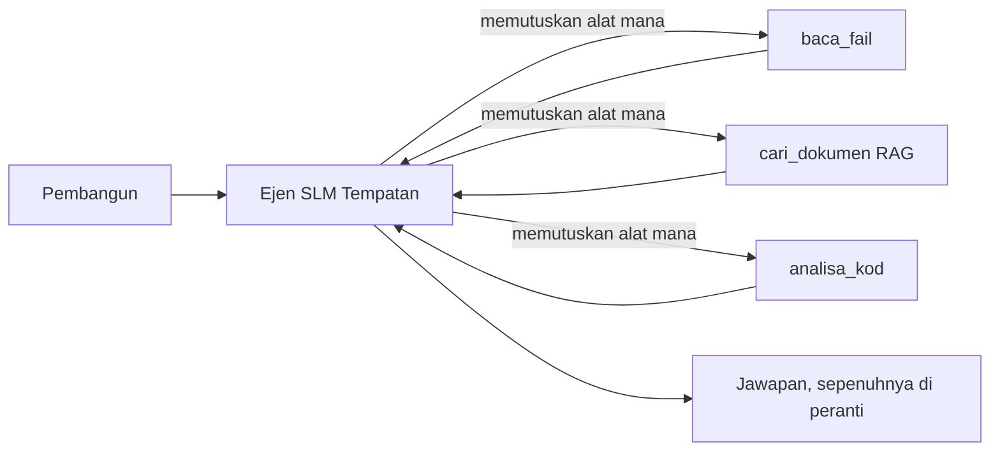
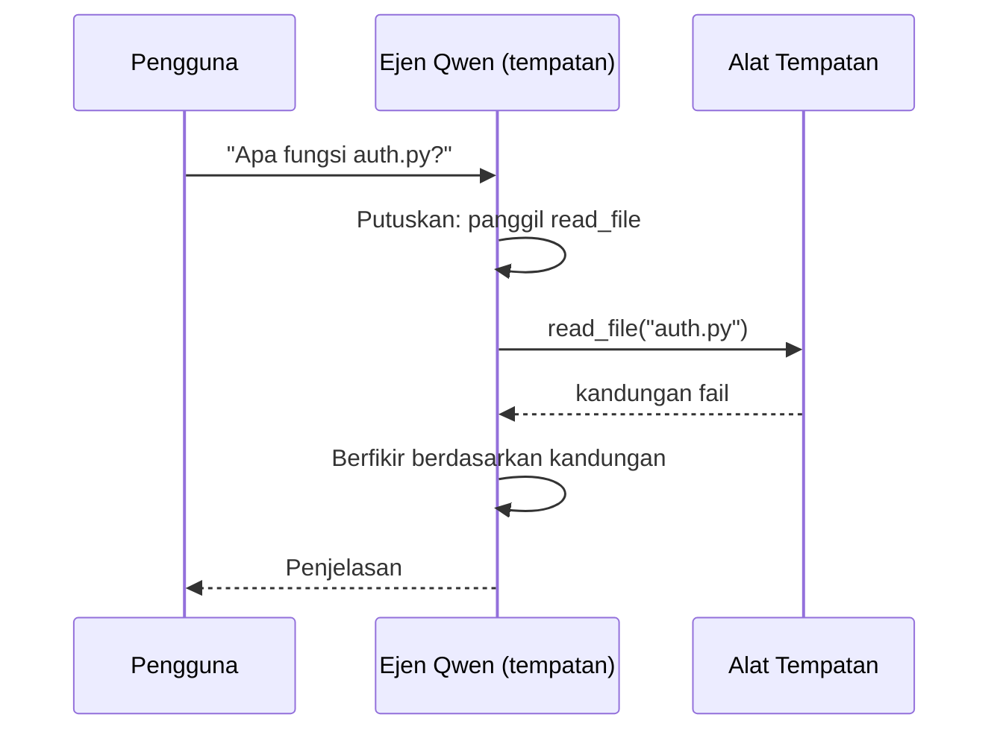
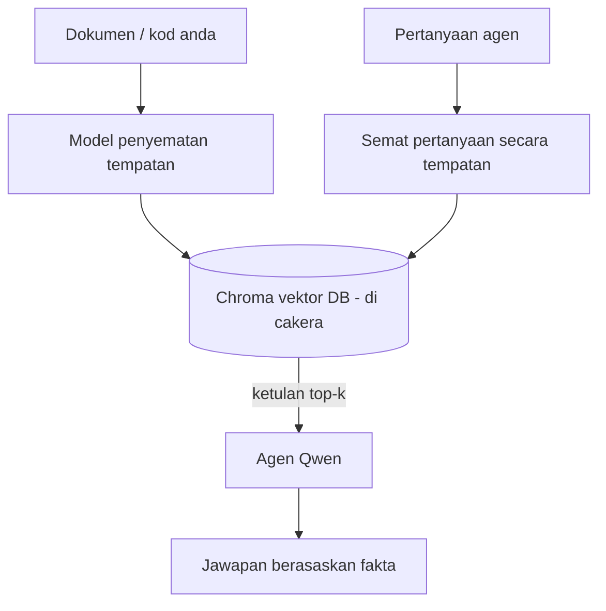
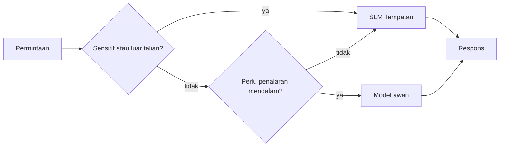

# Mewujudkan Ejen AI Tempatan Menggunakan Microsoft Foundry Local dan Qwen


Pelajaran sebelum ini membesarkan ejen ke awan. Pelajaran ini membawanya turun ke satu mesin. Pada akhirnya anda akan mempunyai pembantu kejuruteraan berfungsi yang membuat penalaran, memanggil alat, membaca fail anda, dan mencari dokumentasi anda — **tanpa sebarang panggilan inferens awan.**

Mengapa anda mahu itu? Tiga sebab yang sering timbul dalam kerja kejuruteraan sebenar:

- **Privasi.** Kod dan dokumen tidak pernah meninggalkan mesin. Tiada arahan, tiada petikan, tiada data pelanggan melintasi sempadan rangkaian.
- **Kos.** Inferens tempatan tidak mempunyai bil per-token. Anda boleh ulang sepanjang hari dengan harga elektrik sahaja.
- **Luar talian.** Di dalam kapal terbang, dalam fasiliti selamat, atau semasa gangguan, ejen masih berfungsi.

Kekurangannya ialah anda menukar model awan hadapan kepada **Model Bahasa Kecil (SLM)** yang dijalankan di CPU, GPU, atau NPU anda. Pelajaran ini mengenai membina ejen yang *baik* dalam kekangan itu daripada berpura-pura kekangan itu tidak wujud.

## Pengenalan

Pelajaran ini akan merangkumi:

- **Model Bahasa Kecil (SLMs)** — apa itu, di mana ia cemerlang, dan di mana ia tidak.
- **Microsoft Foundry Local** — runtime yang memuat turun dan menyajikan model di peranti melalui **API setanding OpenAI**.
- **Model panggilan fungsi Qwen** — SLM yang menghasilkan panggilan alat dengan boleh dipercayai, yang menjadikan ejen tempatan (*agents*) (bukan hanya sembang tempatan) menjadi mungkin.
- **Alat tempatan, RAG tempatan, dan MCP tempatan** — memberi keupayaan kepada ejen tanpa awan.
- **Corak hibrid** — bila untuk menyimpan sesuatu secara tempatan dan bila untuk mencapai awan.

## Matlamat Pembelajaran

Selepas melengkapkan pelajaran ini, anda akan tahu bagaimana untuk:

- Terangkan pertukaran SLM dan pilih kes penggunaan ejen tempatan yang sesuai.
- Menyajikan model Qwen secara tempatan dengan Foundry Local dan menyambung kepadanya melalui titik akhir setanding OpenAI.
- Membina ejen panggilan alat yang berjalan sepenuhnya pada stesen kerja anda.
- Menambah RAG tempatan ke atas dokumen anda sendiri menggunakan pangkalan data vektor tempatan (Chroma).
- Sambungkan ejen ke pelayan MCP tempatan dan buat penalaran tentang reka bentuk hibrid tempatan/awan.

## Prasyarat

Pelajaran ini mengandaikan anda telah menamatkan pelajaran sebelumnya dan selesa dengan:

- [Penggunaan Alat](../04-tool-use/README.md) (Pelajaran 4) dan [Agentic RAG](../05-agentic-rag/README.md) (Pelajaran 5).
- [Protokol Agentic / MCP](../11-agentic-protocols/README.md) (Pelajaran 11).
- [Rangka Agent Microsoft](../14-microsoft-agent-framework/README.md) (Pelajaran 14).

Anda juga memerlukan:

- Stesen kerja pembangun. **8 GB RAM adalah minimum realistik**; 16 GB+ selesa. GPU atau NPU membantu tetapi tidak diperlukan.
- **Microsoft Foundry Local** dipasang (lihat bahagian persediaan di bawah).
- Python 3.12+ dan pakej dalam repositori [`requirements.txt`](../../../requirements.txt), serta `foundry-local-sdk`, `openai`, dan `chromadb` untuk pelajaran ini.

## Model Bahasa Kecil: Alat Yang Sesuai Untuk Kerja Tempatan

Model awan hadapan mempunyai ratusan bilion parameter dan pusat data di belakangnya. SLM mempunyai beberapa bilion parameter dan harus muat dalam RAM komputer riba anda. Perbezaan itu menetapkan jangkaan yang jelas.

**SLM bagus untuk:**

- Tugasan berstruktur dan terhad — klasifikasi, pengekstrakan, ringkasan dokumen yang diketahui.
- **Panggilan alat** — memutuskan fungsi mana yang dipanggil dan dengan hujah apa.
- Iterasi pantas, murah, dan peribadi pada data anda sendiri.

**SLM lemah pada:**

- Penalaran terbuka tanpa batas, multi-hop melintasi konteks besar.
- Pengetahuan dunia luas (mereka melihat kurang, dan lupa lebih).

Strategi menang bagi ejen tempatan adalah: **biarkan SLM mengatur, dan biarkan alat yang melakukan kerja berat.** Model tidak perlu *tahu* kod asas anda — ia perlu tahu bila memanggil `read_file` dan `search_docs`. Itu tepat pada kekuatan SLM.



## Microsoft Foundry Local

**Microsoft Foundry Local** ialah runtime ringan yang memuat turun, mengurus, dan menyajikan model sepenuhnya di mesin anda. Ciri paling penting bagi kita ialah ia mendedahkan **titik akhir HTTP setanding OpenAI** — bermakna SDK OpenAI dan klien OpenAI Rangka Agen Microsoft berfungsi dengannya hanya dengan menukar `base_url`. Semua yang anda pelajari tentang membina ejen terus digunakan; hanya titik akhir berpindah dari awan ke `localhost`.

Foundry Local juga memilih binaan terbaik model untuk perkakasan anda secara automatik — binaan CPU, binaan CUDA/GPU, atau binaan NPU — jadi anda tidak perlu mengoptimumkan secara manual per mesin.

### Persediaan

Pasang Foundry Local (lihat [dokumentasi](https://learn.microsoft.com/azure/ai-foundry/foundry-local/) untuk OS anda), kemudian sahkan ia berfungsi:

```bash
# Pasang (contoh; ikut dokumentasi untuk platform anda)
winget install Microsoft.FoundryLocal      # Windows
# brew install microsoft/foundrylocal/foundrylocal   # macOS

# Muat turun dan jalankan model Qwen, kemudian mulakan perkhidmatan setempat
foundry model run qwen2.5-7b-instruct
foundry service status
```

Setelah perkhidmatan berjalan, anda mempunyai titik akhir setempat dan setanding OpenAI (biasanya `http://localhost:PORT/v1`). Buku nota menggunakan `foundry-local-sdk` untuk mengesan titik akhir secara automatik, jadi anda tidak perlu menetapkan port secara statik.

## Panggilan Fungsi Qwen: Mengapa Ia Penting

Ejen hanyalah ejen jika ia boleh memanggil alat. Banyak SLM boleh berbual tetapi menghasilkan panggilan alat yang tidak boleh dipercayai dan tidak teratur. Model **Qwen** dilatih untuk panggilan fungsi dan mengeluarkan struktur panggilan alat yang terbentuk dengan baik secara konsisten — yang menjadikan model sembang tempatan menjadi *ejen* tempatan.

Alirannya adalah gelung panggilan alat standard yang anda sudah tahu, cuma berjalan di peranti:



## RAG Tempatan

Carian dokumentasi ialah tempat ejen tempatan menunjukkan kelebihan mereka. Daripada berharap SLM menghafal dokumen rangka kerja anda, anda selitkan dokumen itu ke dalam **pangkalan data vektor tempatan** dan biarkan ejen mengambil serpihan yang berkaitan mengikut permintaan.

Kami menggunakan **Chroma**, penyimpan vektor terbina dalam yang berjalan dalam proses tanpa pelayan untuk diurus. Saluran sepenuhnya tempatan: model selitan tempatan → vektor tempatan → pengambilan tempatan → SLM tempatan.



Ini adalah corak Agentic RAG yang sama dari Pelajaran 5 — perubahan satu-satunya ialah setiap komponen berjalan pada mesin anda.

## Pelayan MCP Tempatan

[MCP](../11-agentic-protocols/README.md) ialah transportasi, bukan perkhidmatan awan. Pelayan MCP boleh berjalan sebagai proses tempatan pada `stdio`, mendedahkan alat kepada ejen anda melalui protokol standard. Ini membolehkan anda menggunakan semula ekosistem pelayan MCP yang berkembang — akses sistem fail, operasi git, pertanyaan pangkalan data — sepenuhnya luar talian.

Pendekatan keselamatan berbeza dari awan, tetapi tidak tiada: pelayan MCP tempatan masih berjalan dengan kebenaran pengguna anda, jadi hadkan ia pada apa yang boleh disentuh (direktori projek, bukan keseluruhan folder rumah anda) dan anggap outputnya sebagai input untuk disahkan.

## Corak Hibrid Awan-dan-Tempatan

Utama tempatan tidak bermakna hanya tempatan. Sistem matang menghala berdasarkan kepekaan dan kesukaran:

| Situasi | Tempat dijalankan |
| --- | --- |
| Kod/data sensitif, atau luar talian | **SLM Tempatan** |
| Tugasan mudah terhad | **SLM Tempatan** (murah, pantas) |
| Penalaran multi-hop sukar pada data tidak sensitif | **Model Awan** |
| Segala-galanya semasa gangguan | **SLM Tempatan** (degradasi bertahap) |

Ini mencerminkan idea **perutean model** dari Pelajaran 16 — kecuali salah satu "model" kini merupakan mesin anda sendiri. Reka bentuk yang kukuh kembali kepada lokal apabila awan tidak tersedia, maka ejen menurun kualiti secara berperingkat dan tidak gagal terus.



## Lab Praktikal: Pembantu Kejuruteraan Tempatan

Buka [`code_samples/17-local-agent-foundry-local.ipynb`](./code_samples/17-local-agent-foundry-local.ipynb) dan ikuti. Anda akan membina **pembantu kejuruteraan tempatan** yang berjalan sepenuhnya pada stesen kerja anda dan boleh:

1. **Memanggil alat** — melalui panggilan fungsi Qwen melalui Foundry Local.
2. **Melakukan operasi fail tempatan** — senaraikan dan baca fail dalam direktori projek.
3. **Menganalisis kod** — laporkan metrik asas pada fail sumber.
4. **Mencari dokumentasi** — RAG tempatan ke atas folder dokumen dengan Chroma.
5. **Menggunakan MCP** — sambungkan ke pelayan MCP tempatan (dengan lompatan anggun jika tiada dikonfigurasi).

Tiada inferens awan digunakan pada mana-mana masa.

### Panduan

Pembantu menyambung ke Foundry Local melalui titik akhir setanding OpenAI, jadi kod ejen hampir sama dengan pelajaran awan — hanya klien berubah:

```python
from foundry_local import FoundryLocalManager
from openai import OpenAI

# Foundry Local menemui/muat turun model dan memberi kami titik akhir tempatan.
manager = FoundryLocalManager(\"qwen2.5-7b-instruct\")
client = OpenAI(base_url=manager.endpoint, api_key=manager.api_key)  # api_key adalah tempat letak tempatan
```

Alat adalah fungsi Python biasa yang dihadkan kepada direktori projek:

```python
def read_file(path: str) -> str:
    \"\"\"Read a file, but only inside the sandboxed project directory.\"\"\"
    full = (PROJECT_ROOT / path).resolve()
    if PROJECT_ROOT not in full.parents and full != PROJECT_ROOT:
        return \"Access denied: path is outside the project directory.\"
    return full.read_text(encoding=\"utf-8\")
```

Perhatikan pemeriksaan ruang pasir — walaupun secara tempatan, alat yang membaca laluan sewenang-wenangnya adalah risiko. Buku nota memastikan setiap alat dihadkan kepada satu akar projek.

## Semakan Pengetahuan

Uji pemahaman anda sebelum bergerak ke tugasan.

**1. Berikan dua sebab konkrit untuk menjalankan ejen secara tempatan dan bukan di awan.**

<details>
<summary>Jawapan</summary>

Mana-mana dua daripada: **privasi** (kod dan data tidak pernah meninggalkan mesin), **kos** (tiada bil inferens per-token), dan **keupayaan luar talian** (berfungsi tanpa rangkaian — dalam kapal terbang, dalam fasiliti selamat, atau semasa gangguan). Sekatan peraturan/pematuhan yang menghalang penghantaran data dari peranti adalah pendorong biasa sebab privasi.
</details>

**2. Apakah pembahagian kerja yang disyorkan antara SLM dan alatnya dalam ejen tempatan, dan mengapa?**

<details>
<summary>Jawapan</summary>

Biarkan SLM **mengatur** (memilih alat untuk dipanggil dan hujahnya) dan biarkan **alat melakukan kerja berat** (membaca fail, mendapatkan dokumen, mengira hasil). SLM kuat dalam keputusan terhad seperti pemilihan alat tetapi lemah pada pengetahuan luas dan penalaran multi-hop panjang, jadi bergantung pada alat menyokong kekuatannya.
</details>

**3. Apa yang membolehkan kod ejen awan digunakan semula dengan Foundry Local?**

<details>
<summary>Jawapan</summary>

Foundry Local mendedahkan **titik akhir HTTP setanding OpenAI**. SDK OpenAI dan klien OpenAI Rangka Agen berfungsi dengannya hanya dengan menukar `base_url` (dan menggunakan kunci API tempat letak setempat). Segalanya dalam kod ejen kekal sama.
</details>

**4. Kenapa kita khusus menggunakan model panggilan fungsi Qwen dan bukan mana-mana SLM?**

<details>
<summary>Jawapan</summary>

Kerana ejen mesti menghasilkan **panggilan alat** yang boleh dipercayai dan terbentuk dengan baik. Banyak SLM boleh berbual tetapi mengeluarkan struktur panggilan alat yang tidak teratur atau tidak konsisten. Model Qwen dilatih untuk panggilan fungsi dan menghasilkan panggilan alat yang konsisten, menjadikan model sembang tempatan menjadi ejen tempatan yang berfungsi.
</details>

**5. Dalam saluran RAG tempatan, komponen manakah yang berjalan pada mesin?**

<details>
<summary>Jawapan</summary>

Kesemuanya: model selitan, pangkalan data vektor (Chroma, di cakera), langkah pengambilan, dan SLM. Dokumen diselit secara tempatan, disimpan secara tempatan, diambil secara tempatan, dan dinalar oleh model tempatan — tiada komponen menyentuh awan.
</details>

**6. Pelayan MCP tempatan berjalan pada mesin anda. Adakah itu menjadikannya selamat secara automatik? Apakah langkah berjaga-jaga yang masih perlu anda ambil?**

<details>
<summary>Jawapan</summary>

Tidak. Pelayan MCP tempatan berjalan dengan kebenaran pengguna anda, jadi ia boleh menyentuh apa sahaja yang anda boleh. Hadkan ia pada apa yang diperlukan (contohnya, satu direktori projek dan bukan keseluruhan folder rumah anda) dan anggap outputnya sebagai input untuk disahkan sebelum bertindak.
</details>

**7. Huraikan peraturan perutean hibrid yang masuk akal yang melibatkan model tempatan.**

<details>
<summary>Jawapan</summary>

Hantar permintaan sensitif atau luar talian ke SLM tempatan; hantar tugasan mudah terhad ke SLM tempatan untuk kelajuan dan kos; hantar penalaran multi-hop yang sukar pada data tidak sensitif ke model awan; dan kembali kepada SLM tempatan jika awan tidak tersedia supaya ejen menurun dengan baik dan tidak gagal terus. Ini adalah perutean model (Pelajaran 16) dengan mesin tempatan sebagai salah satu model.
</details>

**8. Apakah angka minimum RAM realistik untuk menjalankan ejen tempatan dalam pelajaran ini, dan apa yang lebih RAM berikan anda?**

<details>
<summary>Jawapan</summary>

Sekitar **8 GB** adalah minimum realistik; 16 GB+ selesa. Lebih RAM membolehkan anda menjalankan model yang lebih besar dan lebih berkuasa serta menyimpan lebih banyak konteks dalam memori. GPU atau NPU mempercepatkan inferens tetapi tidak diperlukan — Foundry Local memilih binaan CPU bila tiada pemecut tersedia.
</details>

## Tugasan

Luaskan pembantu kejuruteraan tempatan menjadi **penilai dokumentasi tempatan** untuk projek kecil pilihan anda (gunakan salah satu folder pelajaran dalam repo ini jika mahu).

Penyerahan anda harus:

1. **Indeks sebuah folder dokumen/kod sebenar** ke dalam Chroma (sekurang-kurangnya lima fail).
2. **Tambah alat `find_todos`** yang mengimbas projek untuk komen `TODO`/`FIXME` dan mengembalikannya dengan fail dan nombor baris — mengekalkan pemeriksaan ruang pasir yang sama seperti `read_file`.

3. **Tanya ejen tiga soalan** yang memaksanya menggabungkan alat: satu soalan RAG tulen, satu yang memerlukan membaca fail tertentu, dan satu yang memerlukan mencari TODO.
4. **Ukur masa**: masa setiap tiga jawapan dan catatkan dalam sel markdown. Beri komen sama ada kelewatan itu boleh diterima untuk aliran kerja yang anda inginkan.

Kemudian tulis satu perenggan ringkas tentang **apa yang anda akan pindahkan ke awan dan apa yang anda akan simpan secara tempatan** untuk pemeriksa ini, dan kenapa. Anda dinilai berdasarkan sama ada komponen tempatan disambungkan dengan betul dan sama ada penalaran hibrid anda kukuh — bukan pada kualiti model.

## Ringkasan

Dalam pelajaran ini anda membina ejen yang berjalan sepenuhnya di mesin anda sendiri:

- **SLM** menukar keluasan untuk privasi, kos, dan operasi luar talian — dan bersinar apabila mereka **mengatur alat** daripada memikul semua pengetahuan sendiri.
- **Foundry Local** menyediakan model pada peranti di belakang **endpoint yang serasi OpenAI**, jadi kod ejen awan anda boleh dipindahkan dengan satu perubahan baris.
- **Model panggilan fungsi Qwen** membolehkan panggilan alat tempatan yang boleh dipercayai — dan oleh itu *ejen* tempatan — menjadi mungkin.
- **RAG tempatan** (Chroma) dan **MCP tempatan** memberi keupayaan kepada ejen tanpa meninggalkan mesin.
- **Corak hibrid** membolehkan anda menghala mengikut kepekaan dan kesukaran, dengan tempatan sebagai pilihan mundur yang anggun.

Ini melengkapkan lengkung penyebaran: Pelajaran 16 meningkat skala ejen ke Microsoft Foundry, dan pelajaran ini menurunkan skala ke stesen kerja tunggal. Pelajaran seterusnya membahas tentang menjaga ejen yang disebarkan agar selamat.

## Sumber Tambahan

- <a href="https://learn.microsoft.com/azure/ai-foundry/foundry-local/" target="_blank">Dokumentasi Microsoft Foundry Local</a>
- <a href="https://learn.microsoft.com/azure/ai-foundry/what-is-azure-ai-foundry" target="_blank">Dokumentasi Microsoft Foundry</a>
- <a href="https://learn.microsoft.com/en-us/agent-framework/overview/?wt.mc_id=youtube_26688_organicsocial_reactor&pivots=programming-language-python" target="_blank">Rangka Kerja Ejen Microsoft</a>
- <a href="https://qwen.readthedocs.io/en/latest/framework/function_call.html" target="_blank">Dokumentasi panggilan fungsi Qwen</a>
- <a href="https://modelcontextprotocol.io/" target="_blank">Protokol Konteks Model (MCP)</a>
- <a href="https://docs.trychroma.com/" target="_blank">Pangkalan data vektor Chroma</a>

## Pelajaran Sebelumnya

[Menyebarkan Ejen Skala Besar](../16-deploying-scalable-agents/README.md)

## Pelajaran Seterusnya

[Mengamankan Ejen AI](../18-securing-ai-agents/README.md)

---

<!-- CO-OP TRANSLATOR DISCLAIMER START -->
**Penafian**:
Dokumen ini telah diterjemahkan menggunakan perkhidmatan terjemahan AI [Co-op Translator](https://github.com/Azure/co-op-translator). Walaupun kami berusaha untuk ketepatan, sila ambil maklum bahawa terjemahan automatik mungkin mengandungi kesilapan atau ketidaktepatan. Dokumen asal dalam bahasa asalnya harus dianggap sebagai sumber yang sahih. Untuk maklumat penting, terjemahan oleh manusia profesional adalah disyorkan. Kami tidak bertanggungjawab terhadap sebarang salah faham atau salah tafsir yang timbul daripada penggunaan terjemahan ini.
<!-- CO-OP TRANSLATOR DISCLAIMER END -->