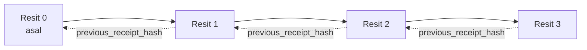

[Watch the lesson video: Menjamin Ejen AI dengan Resit Kriptografi](https://youtu.be/PLACEHOLDER_VIDEO_ID)

> _(Video pelajaran dan thumbnail akan ditambah oleh pasukan kandungan Microsoft selepas penggabungan, mengikut pola pelajaran 14 / 15.)_

# Menjamin Ejen AI dengan Resit Kriptografi

## Pengenalan

Pelajaran ini akan merangkumi:

- Mengapa jejak audit untuk ejen AI penting untuk pematuhan, penyahpepijatan, dan kepercayaan.
- Apa itu resit kriptografi dan bagaimana ia berbeza dari baris log tanpa tandatangan.
- Cara menghasilkan resit bertandatangan untuk panggilan alat ejen dalam Python biasa.
- Cara mengesahkan resit secara luar talian dan mengesan pengubahan.
- Cara menghubungkan resit supaya penghapusan atau penyusunan semula satu resit memecahkan rantai.
- Apa yang resit buktikan dan apa yang secara jelas ia tidak buktikan.

## Matlamat Pembelajaran

Selepas melengkapkan pelajaran ini, anda akan tahu cara untuk:

- Mengenal pasti mod kegagalan yang mendorong kepapatan kriptografi untuk tindakan ejen.
- Menghasilkan resit bertandatangan Ed25519 ke atas muatan JSON kanonik.
- Mengesahkan resit secara bebas hanya menggunakan kunci awam penandatangan.
- Mengesan pengubahan dengan menjalankan semula pengesahan pada resit yang diubah.
- Membina urutan resit berantai hash dan menerangkan mengapa rantai itu penting.
- Mengenal pasti sempadan antara apa yang resit buktikan (atribusi, integriti, susunan) dan apa yang tidak (ketepatan tindakan, kewajaran polisi).

## Masalah: Jejak Audit Ejen Anda

Bayangkan anda telah melancarkan ejen AI untuk Contoso Travel. Ejen membaca permintaan pelanggan, memanggil API penerbangan untuk melihat pilihan, dan menempah tempat duduk bagi pihak pelanggan. Suku terakhir, ejen memproses 50,000 tempahan.

Hari ini seorang juruaudit tiba. Mereka bertanya soalan mudah: "Tunjukkan apa yang ejen anda lakukan."

Anda menyerahkan fail log anda. Juruaudit melihatnya dan bertanya soalan lebih sukar: "Bagaimana saya tahu log ini tidak disunting?"

Ini adalah masalah jejak audit. Kebanyakan pelancaran ejen hari ini bergantung pada:

- **Log aplikasi**: ditulis oleh ejen itu sendiri, boleh disunting oleh sesiapa yang mempunyai akses sistem fail.
- **Perkhidmatan log awan**: jelas menunjukkan pengubahan di peringkat platform tetapi hanya jika juruaudit mempercayai pengendali platform.
- **Log transaksi pangkalan data**: sesuai untuk perubahan pangkalan data tetapi tidak untuk panggilan alat sewenang-wenangnya.

Tiada satu pun yang boleh menjawab soalan juruaudit tanpa memerlukan juruaudit mempercayai seseorang (anda, penyedia awan anda, vendor pangkalan data anda). Untuk kegunaan dalaman, kepercayaan itu biasanya boleh diterima. Untuk beban kerja yang dikawal selia (kewangan, penjagaan kesihatan, apa sahaja yang tertakluk kepada Akta AI EU), ia tidak.

Resit kriptografi menyelesaikan masalah ini dengan menjadikan setiap tindakan ejen boleh disahkan secara bebas. Juruaudit tidak perlu mempercayai anda. Mereka hanya perlukan kunci awam anda dan resit itu sendiri.

## Apa Itu Resit Kriptografi?

Resit adalah objek JSON yang merekodkan apa yang ejen lakukan, ditandatangani dengan tandatangan digital.


Resit minimal kelihatan seperti ini:

```json
{
  "type": "agent.tool_call.v1",
  "agent_id": "contoso-travel-bot",
  "tool_name": "lookup_flights",
  "tool_args_hash": "sha256:a3f9c1...",
  "result_hash": "sha256:7b2e1d...",
  "policy_id": "contoso-travel-policy-v3",
  "timestamp": "2026-04-25T14:30:00Z",
  "sequence": 47,
  "previous_receipt_hash": "sha256:9d4e6a...",
  "signature": {
    "alg": "EdDSA",
    "sig": "c5af83...",
    "public_key": "8f3b2c..."
  }
}
```

Tiga sifat menjalankan tugasnya:

1. **Tandatangan**. Resit ditandatangani oleh pintu masuk ejen menggunakan kunci peribadi Ed25519. Sesiapa dengan kunci awam yang sepadan boleh mengesahkan tandatangan secara luar talian. Pengubahan mana-mana medan membatalkan tandatangan.

2. **Pengkodan kanonik**. Sebelum menandatangani, resit diserialisasikan menggunakan Skema Kanonikal JSON (JCS, RFC 8785). Ini memastikan dua pelaksanaan yang menghasilkan resit logik sama menghasilkan output identik pada aras bait. Tanpa kanonisasi, penyerial JSON yang berbeza akan menghasilkan tandatangan berbeza untuk kandungan yang sama.

3. **Rantai hash**. Medan `previous_receipt_hash` menghubungkan setiap resit dengan yang sebelumnya. Menghapuskan atau menyusun semula resit memecahkan setiap resit selepasnya. Pengubahan menjadi jelas pada aras rantai meskipun tandatangan individu dibypass.

Sifat-sifat ini bersama memberikan tiga jaminan:

- **Atribusi**: kunci ini menandatangani kandungan ini.
- **Integriti**: kandungan tidak berubah sejak tandatangan.
- **Susunan**: resit ini datang selepas resit itu dalam rantai.

## Menghasilkan Resit dalam Python

Anda tidak perlu perpustakaan khas untuk menghasilkan resit. Primitif kriptografi banyak tersedia dan logiknya adalah beberapa puluh baris Python.

Latihan praktikal dalam `code_samples/18-signed-receipts.ipynb` membimbing langkah penuh. Versi ringkas:

```python
import json
import hashlib
import base64
from nacl import signing
from jcs import canonicalize  # RFC 8785 JSON kanonik

def b64url_nopad(data: bytes) -> str:
    return base64.urlsafe_b64encode(data).decode("ascii").rstrip("=")

def sha256_canonical(obj) -> str:
    """SHA-256 of a Python object's JCS-canonical JSON form."""
    return f"sha256:{hashlib.sha256(canonicalize(obj)).hexdigest()}"

# Jana atau muatkan kunci tandatangan (dalam pengeluaran, simpan dalam peti kunci)
signing_key = signing.SigningKey.generate()
verify_key = signing_key.verify_key

# Bina muatan resit (belum tandatangan)
tool_args = {"origin": "SYD", "destination": "LAX"}
tool_result = [{"flight": "QF11", "price": 1850, "stops": 0}]

payload = {
    "type": "agent.tool_call.v1",
    "agent_id": "contoso-travel-bot",
    "tool_name": "lookup_flights",
    "tool_args_hash": sha256_canonical(tool_args),
    "result_hash": sha256_canonical(tool_result),
    "policy_id": "contoso-travel-policy-v3",
    "timestamp": "2026-04-25T14:30:00Z",
    "sequence": 0,
    "previous_receipt_hash": None,
}

# Kanonikkan, hash, tandatangan.
canonical_bytes = canonicalize(payload)
message_hash = hashlib.sha256(canonical_bytes).digest()
signature_bytes = signing_key.sign(message_hash).signature

# Lampirkan objek tandatangan berstruktur.
receipt = {
    **payload,
    "signature": {
        "alg": "EdDSA",
        "sig": b64url_nopad(signature_bytes),
        "public_key": b64url_nopad(bytes(verify_key)),
    },
}
```

Itulah keseluruhan saluran penandatanganan. Latihan dalam buku nota membimbing setiap langkah.

## Pengesahan Resit dan Pengesanan Pengubahan

Pengesahan adalah operasi songsang:

```python
import base64
import hashlib
from nacl import signing
from nacl.exceptions import BadSignatureError
from jcs import canonicalize

def b64url_decode(s: str) -> bytes:
    padding = "=" * ((4 - len(s) % 4) % 4)
    return base64.urlsafe_b64decode(s + padding)

def verify_receipt(receipt: dict) -> bool:
    # Tandatangan adalah objek berstruktur: {"alg", "sig", "public_key"}.
    sig_obj = receipt.get("signature")
    if not sig_obj or sig_obj.get("alg") != "EdDSA":
        return False

    # Sediakan semula muatan yang sebenarnya ditandatangani (semua kecuali tandatangan).
    payload = {k: v for k, v in receipt.items() if k != "signature"}

    canonical_bytes = canonicalize(payload)
    message_hash = hashlib.sha256(canonical_bytes).digest()

    try:
        verify_key = signing.VerifyKey(b64url_decode(sig_obj["public_key"]))
        verify_key.verify(message_hash, b64url_decode(sig_obj["sig"]))
        return True
    except BadSignatureError:
        return False
```

Fungsi ini mengambil resit dan mengembalikan `True` jika tandatangan sah, `False` jika tidak. Tiada panggilan rangkaian, tiada kebergantungan perkhidmatan, tiada kepercayaan kepada pihak ketiga diperlukan.

Untuk melihat pengesanan pengubahan berfungsi, buku nota membimbing:

1. Menghasilkan resit sah dan mengesahkannya.
2. Mengubah satu bait medan `tool_args_hash`.
3. Menjalankan semula pengesahan dan melihat ia gagal.

Ini demonstrasi praktikal bahawa resit jelas menunjukkan pengubahan: sebarang pengubahan, walaupun kecil, memecahkan tandatangan.

## Merantai Resit untuk Ejen Multi-Langkah

Satu resit bertandatangan melindungi satu tindakan. Rantai resit melindungi satu urutan.



Setiap resit merekod hash resit sebelum itu. Untuk menghapuskan resit 2 secara senyap, penyerang perlu sama ada:

- Mengubah medan `previous_receipt_hash` resit 3 (memecahkan tandatangan resit 3), ATAU
- Memalsukan tandatangan baru pada resit 3 yang diubah (memerlukan kunci peribadi ejen).

Jika kunci peribadi disimpan dalam peti kunci perkakasan dan anda menerbitkan kunci awam dengan setiap resit, kedua-dua serangan ini tidak boleh dilakukan tanpa dikesan.

Buku nota membimbing:

1. Membina rantai tiga resit.
2. Mengesahkan setiap `previous_receipt_hash` sepadan dengan hash sebenar resit sebelumnya.
3. Mengubah satu resit di tengah dan melihat rantai pecah tepat pada titik itu.

Ini cara anda menghasilkan jejak audit yang boleh disahkan oleh juruaudit luar tanpa perlu mempercayai anda.

## Apa yang Resit Buktikan (dan Apa yang Tidak)

Ini adalah bahagian paling penting pelajaran ini. Resit kuat tetapi kekuatannya terbatas.

**Resit membuktikan tiga perkara:**

1. **Atribusi**: kunci tertentu menandatangani muatan tertentu.
2. **Integriti**: muatan tidak berubah sejak tandatangan.
3. **Susunan**: resit ini datang selepas resit itu dalam rantai hash.

**Resit TIDAK membuktikan:**

1. **Ketepatan**: bahawa tindakan ejen adalah tindakan yang betul. Resit boleh ditandatangani untuk jawapan yang salah sama bersih seperti untuk jawapan yang betul.
2. **Pematuhan polisi**: bahawa polisi yang dirujuk dalam `policy_id` benar-benar dinilai, atau ia akan membenarkan tindakan ini jika diperiksa. Resit merekod apa yang dinyatakan, bukan apa yang dikuatkuasakan.
3. **Identiti selain kunci**: resit berkata "kunci ini menandatangani kandungan ini." Ia tidak berkata "manusia ini meluluskan ini." Menghubungkan kunci kepada orang atau organisasi memerlukan infrastruktur identiti berasingan (direktori, daftar kunci awam, dll.).
4. **Kebenaran input**: jika ejen menerima prompt yang dimanipulasi dan bertindak berdasarkan itu, resit merekod tindakan dengan jujur. Resit berada selepas pengesahan input, bukan pengganti untuknya.

Sempadan ini penting kerana dua sebab:

- Ia memberitahu apa kegunaan resit: menjadikan tingkah laku ejen boleh diaudit dan jelas menunjukkan pengubahan, walaupun merentas sempadan organisasi.
- Ia memberitahu lapisan tambahan yang anda masih perlukan: pengesahan input (Pelajaran 6), penguatkuasaan polisi (diringkaskan di bawah), dan infrastruktur identiti (di luar skop pelajaran ini).

Kesilapan biasa ialah menganggap "kami ada resit" bermaksud "kami dikawal selia." Tidak. Resit adalah asas. Tadbir urus adalah sistem yang anda bina di atasnya.

## Rujukan Pengeluaran

Kod Python dalam pelajaran ini sengaja minimal supaya anda boleh membaca setiap baris dan faham apa yang berlaku. Dalam pengeluaran, anda ada dua pilihan:

1. **Bina terus pada primitif kriptografi.** 50 baris yang anda lihat di atas sudah mencukupi untuk banyak penggunaan. PyNaCl (Ed25519) dan pakej `jcs` (JSON kanonik) adalah perpustakaan yang dikekalkan dan diaudit dengan baik.

2. **Gunakan perpustakaan resit pengeluaran.** Beberapa projek sumber terbuka melaksanakan corak yang sama dengan ciri tambahan (putaran kunci, pengesahan berkelompok, pengedaran Set JWK, integrasi dengan enjin polisi):
   - Format resit yang digunakan dalam pelajaran ini mengikuti Draf Internet IETF (`draft-farley-acta-signed-receipts`) yang sedang dalam proses standard.
   - Microsoft Agent Governance Toolkit menggabungkan resit dengan keputusan polisi Cedar; lihat Tutorial 33 dalam repositori itu untuk contoh menyeluruh.
   - Pakej `protect-mcp` (npm) dan `@veritasacta/verify` (npm) menyediakan pelaksanaan Node untuk penandatanganan dan pengesahan luar talian resit, bertujuan membalut mana-mana pelayan MCP dengan jejak audit yang jelas menunjukkan pengubahan.
   - **[nobulex](https://github.com/arian-gogani/nobulex)** SDK Python (`pip install nobulex`) menyediakan corak tandatangan Ed25519 + JCS yang sama dalam Python dengan integrasi LangChain dan CrewAI, termasuk vektor ujian silang dan peta pematuhan disumbang menerusi [OWASP PR #2210](https://github.com/OWASP/CheatSheetSeries/pull/2210).

Keputusan antara membina sendiri dan menggunakan perpustakaan adalah sama seperti memilih antara menulis perpustakaan JWT sendiri dan menggunakan yang sudah diuji: kedua-duanya munasabah; perpustakaan menjimatkan masa dan mengurangkan permukaan audit; pendekatan dari awal memaksa anda faham setiap primitif. Pelajaran ini mengajar jalan dari awal supaya anda ada asas untuk mana-mana pilihan.

## Ujian Pengetahuan

Uji pemahaman anda sebelum meneruskan latihan praktikal.

**1. Resit ditandatangani dengan kunci ed25519 peribadi ejen. Juruaudit hanya ada kunci awam. Boleh juruaudit sahkan resit secara luar talian?**

<details>
<summary>Jawapan</summary>

Boleh. Pengesahan Ed25519 hanya memerlukan kunci awam dan bait yang ditandatangani. Tiada panggilan rangkaian, tiada kebergantungan perkhidmatan. Ini sifat yang menjadikan resit berguna dalam situasi audit berudara terasing, berbilang organisasi, atau kurang kepercayaan.
</details>

**2. Penyerang mengubah medan `policy_id` dalam resit untuk mendakwa ia dikawal selia oleh polisi yang lebih membenarkan. Tandatangan adalah atas muatan asal. Apa berlaku semasa pengesahan?**

<details>
<summary>Jawapan</summary>

Pengesahan gagal. Tandatangan dikira atas bait kanonik muatan asal; mengubah mana-mana medan mengubah bait kanonik, yang menukar hash SHA-256, menyebabkan tandatangan tidak sah. Penyerang perlu kunci peribadi untuk menghasilkan tandatangan baru, yang mereka tiada.
</details>

**3. Kenapa resit termasuk `tool_args_hash` dan `result_hash` dan bukannya argumen dan hasil mentah?**

<details>
<summary>Jawapan</summary>

Dua sebab. Pertama, resit mungkin perlu diarkib atau dihantar di persekitaran di mana pendedahan kandungan mentah (PII, data perniagaan) adalah masalah. Hash menjadikan resit kecil dan kandungan peribadi; juruaudit mengesahkan hash sepadan dengan salinan berasingan kandungan sebenar. Kedua, hash mempunyai saiz tetap; resit dengan hash terhad saiz tanpa mengira saiz input dan output.
</details>

**4. Medan `previous_receipt_hash` menghubungkan setiap resit dengan penerusnya. Jika penyerang menghapus satu resit dari tengah rantai secara senyap, apa yang menjadi tidak sah?**

<details>
<summary>Jawapan</summary>

Setiap resit selepas yang dipadam. Medan `previous_receipt_hash` mereka tidak lagi sepadan dengan rantai sebenar (kerana resit yang dirujuk tidak wujud, atau rantai kini menunjuk kepada penerus berbeza). Untuk menyembunyikan pemadaman, penyerang perlu menandatangani semula setiap resit kemudian, yang memerlukan kunci peribadi.
</details>

**5. Resit disahkan dengan bersih. Adakah itu membuktikan tindakan ejen betul, wajar, atau patuh polisi?**

<details>
<summary>Jawapan</summary>

Tidak. Resit sah membuktikan tiga perkara: atribusi (kunci ini menandatangani kandungan ini), integriti (kandungan tidak berubah), dan susunan (resit ini datang selepas yang itu). Ia TIDAK membuktikan tindakan itu betul, polisi dalam `policy_id` benar-benar dinilai, atau ejen mengikuti setiap peraturan. Resit menjadikan tingkah laku ejen boleh diaudit, bukan semestinya betul. Ini sempadan paling penting dalam pelajaran.
</details>

## Latihan Praktikal

Buka `code_samples/18-signed-receipts.ipynb` dan lengkapkan semua empat bahagian:

1. **Bahagian 1**: Tandatangani resit pertama anda dan sahkan.
2. **Bahagian 2**: Ubah resit dan perhatikan pengesahan gagal.
3. **Bahagian 3**: Bina rantai tiga resit dan sahkan integriti rantai.
4. **Bahagian 4**: Gunakan corak pada ejen yang dibina dengan Microsoft Agent Framework: bungkus panggilan alat dalam penandatanganan resit, kemudian sahkan resit secara bebas.
**Cabaran lanjutan 1:** sambungkan skema resit dengan medan tambahan pilihan anda sendiri (contohnya, ID permintaan untuk penjejakan), kemaskini logik penandatanganan kanonik untuk memasukkannya, dan sahkan bahawa resit masih boleh melalui pengesahan. Kemudian ubah medan tersebut selepas menandatangani dan sahkan pengesahan gagal. Ini memaksa anda memahami bagaimana setiap bait pengekodan kanonik menyumbang kepada tandatangan.

**Cabaran lanjutan 2:** SHA-256 hash dua resit anda bersama-sama (satukan bait kanonik mereka dalam urutan deterministik) dan tanamkan hasil digest sebagai medan baru pada resit ketiga sebelum menandatanganinya. Sahkan bahawa ketiga-tiga resit masih boleh melalui pengesahan bulat. Anda baru sahaja membina bukti inklusi satu langkah: sesiapa yang memegang resit ketiga boleh membuktikan dua resit pertama wujud pada masa ia ditandatangani, tanpa perlu mendedahkan kandungannya. Ini adalah corak yang digunakan oleh resit pendedahan selektif pada skala besar (komitmen Merkle, RFC 6962).

## Kesimpulan

Resit kriptografi memberi ejen AI jejak audit yang:

- **Boleh disahkan secara bebas**: mana-mana pihak dengan kunci awam boleh mengesahkannya, tanpa pergantungan perkhidmatan.
- **Bukti manipulasi jelas**: apa-apa pengubahsuaian membatalkan tandatangan.
- **Boleh dibawa**: resit adalah fail JSON kecil; ia boleh diarkib, dihantar, dan disahkan di mana-mana.
- **Mengikut piawaian**: dibina atas Ed25519 (RFC 8032), JCS (RFC 8785), dan SHA-256, semua primitif yang meluas digunakan.

Mereka bukan pengganti untuk pengesahan input, penguatkuasaan dasar, atau infrastruktur identiti. Mereka adalah asas untuk lapisan-lapisan tersebut. Apabila anda menggunakan ejen dalam beban kerja yang dikawal selia, aliran kerja pelbagai organisasi, atau sebarang keadaan di mana auditor masa depan tidak boleh dianggap mempercayai anda, resit adalah cara anda menjadikan jejak audit jujur.

Pengajaran paling penting: resit membuktikan siapa berkata apa, bila. Mereka tidak membuktikan bahawa apa yang dikatakan itu benar atau betul. Pegang perbezaan itu dengan ketat. Ia adalah bezanya antara sistem asal-usul yang jujur dan yang mengelirukan.

## Senarai Semak Pengeluaran

Apabila anda bersedia untuk melangkah dari pelajaran ini ke penerapan ejen yang ditandatangani resit dalam persekitaran sebenar:

- [ ] **Pindahkan kunci tandatangan dari komputer riba pembangun.** Gunakan Azure Key Vault, AWS KMS, atau modul keselamatan perkakasan. Kunci peribadi yang menandatangani resit anda tidak boleh disimpan dalam kawalan sumber atau dalam teks biasa pada mesin aplikasi.
- [ ] **Terbitkan kunci awam pengesahan.** Auditor memerlukannya untuk pengesahan luar talian. Corak standard adalah Set JWK di URL yang dikenali (RFC 7517), contohnya `https://your-org.example.com/.well-known/agent-keys.json`.
- [ ] **Pukat rantaian secara luaran.** Secara berkala tulis hash kepala rantaian terkini ke log ketelusan (Sigstore Rekor, pihak berkuasa masa RFC 3161, atau sistem dalaman kedua) supaya pihak luar dapat mengesahkan "rantaian ini wujud pada masa ini."
- [ ] **Simpan resit secara tidak boleh diubah.** Penyimpanan blob hanya tambah (Azure Storage dengan polisi ketidakubahan, AWS S3 Object Lock) mencegah orang dalam menulis semula sejarah di lapisan penyimpanan.
- [ ] **Tentukan tempoh penyimpanan.** Banyak rejim pematuhan memerlukan penyimpanan berbilang tahun. Rancang pertumbuhan resit (setiap resit ~500 bait; ejen yang membuat 10K panggilan setiap hari menghasilkan ~1.8 GB setahun).
- [ ] **Dokumentasikan apa yang resit tidak liputi.** Resit membuktikan atribusi, integriti, dan urutan. Buku panduan anda harus secara jelas menyenaraikan kawalan tambahan apa (pengesahan input, penguatkuasaan dasar, had kadar, infrastruktur identiti) yang berada bersama resit dalam posisi tadbir urus anda.

### Ada Soalan Lagi tentang Menjamin Ejen AI?

Sertai [Microsoft Foundry Discord](https://aka.ms/ai-agents/discord) untuk berjumpa pelajar lain, hadir waktu pejabat, dan dapatkan jawapan untuk soalan Ejen AI anda.

## Melangkaui Pelajaran Ini

Pelajaran ini merangkumi tandatangan resit tunggal dan urutan rantai hash. Primitif yang sama membentuk beberapa corak lebih maju yang mungkin anda temui apabila posisi tadbir urus anda matang:

- **Pendedahan selektif.** Apabila medan resit terikat secara berdikari (pokok Merkle gaya RFC 6962), anda boleh mendedahkan medan tertentu kepada auditor tertentu dan membuktikan yang lain tidak berubah tanpa mendedahkannya. Berguna apabila resit yang sama perlu memenuhi audit menyeluruh (yang mahukan kelengkapan) dan peraturan pengurangan data seperti GDPR (yang mahukan auditor melihat sekurang-kurangnya mungkin).
- **Pembatalan resit.** Jika kunci tandatangan dikompromi, anda perlukan cara menandakan semua resit yang ditandatangani oleh kunci itu sebagai tidak boleh dipercayai dari suatu masa ke hadapan. Corak standard: kunci tandatangan jangka pendek plus senarai pembatalan diterbitkan, atau log ketelusan dengan catatan pembatalan.
- **Resit tandatangan dua arah / berpisah.** Sesetengah pelaksanaan memisahkan muatan yang ditandatangani kepada separuh pra-pelaksanaan (`authorization_*`) dan pasca-pelaksanaan (`result_*`) dengan tandatangan bebas, berguna apabila keputusan kebenaran dan hasil yang diperhatikan dihasilkan oleh pelakon berlainan atau pada masa berlainan. Ini boleh ditambah di atas format resit yang diajar dalam pelajaran ini.
- **Komposisi muatan.** Resit menandatangani apa sahaja bait yang anda letakkan dalam `result_hash`. Muatan dunia sebenar sering lebih kaya daripada hanya hasil panggilan alat tunggal: pertimbangan pra-keputusan (ramalan model, pilihan yang dipertimbangkan, bukti dan kesempurnaannya, sikap risiko, rantai akauntabiliti, hasil pintu kawalan) semuanya boleh wujud dalam muatan, ditandatangani oleh satu resit. Ini mengekalkan format resit minimal sambil membenarkan skema muatan berkembang mengikut domain.
- **Pematuhan lintas pelaksanaan.** Pelbagai pelaksanaan bebas format resit yang sama (Python, TypeScript, Rust, Go) mengesahkan silang terhadap vektor ujian bersama. Jika anda membina pelaksanaan anda sendiri, pengesahan terhadap vektor diterbitkan mengesahkan keserasian wayar.
- **Migrasi pasca-kuantum.** Ed25519 banyak digunakan hari ini tetapi tidak tahan kuantum. Format resit bersifat algoritma-lentur: medan `signature.alg` boleh membawa `ML-DSA-65` (standard tandatangan pasca-kuantum NIST) apabila anda perlu migrasi. Rancang tempoh peralihan di mana resit ditanda dua kali.

## Sumber Tambahan

- <a href="https://datatracker.ietf.org/doc/draft-farley-acta-signed-receipts/" target="_blank">IETF Internet-Draft: Resit Keputusan Ditandatangani untuk Kawalan Akses Mesin-ke-Mesin</a>
- <a href="https://learn.microsoft.com/azure/ai-studio/responsible-use-of-ai-overview" target="_blank">Gambaran Keseluruhan AI Bertanggungjawab (Azure AI)</a>
- <a href="https://datatracker.ietf.org/doc/html/rfc8032" target="_blank">RFC 8032: Algoritma Tandatangan Digital Edwards-Curve (EdDSA)</a>
- <a href="https://datatracker.ietf.org/doc/html/rfc8785" target="_blank">RFC 8785: Skema Kanonik JSON (JCS)</a>
- <a href="https://datatracker.ietf.org/doc/html/rfc6962" target="_blank">RFC 6962: Ketelusan Sijil</a> (pembinaan pokok Merkle yang digunakan oleh resit pendedahan selektif)
- <a href="https://github.com/microsoft/agent-governance-toolkit/blob/main/docs/tutorials/33-offline-verifiable-receipts.md" target="_blank">Microsoft Agent Governance Toolkit, Tutorial 33: Resit Keputusan Verifikasi Luar Talian</a>
- <a href="https://github.com/ScopeBlind/agent-governance-testvectors" target="_blank">Vektor ujian pematuhan lintas pelaksanaan</a> untuk format resit yang digunakan dalam pelajaran ini (Apache-2.0)
- <a href="https://pynacl.readthedocs.io/" target="_blank">Dokumentasi PyNaCl</a> (Ed25519 dalam Python)

## Pelajaran Sebelumnya

[Membina Ejen Penggunaan Komputer (CUA)](../15-browser-use/README.md)

## Pelajaran Seterusnya

_(Akan ditentukan oleh penyelia kurikulum)_

---

<!-- CO-OP TRANSLATOR DISCLAIMER START -->
**Penafian**:
Dokumen ini telah diterjemahkan menggunakan perkhidmatan terjemahan AI [Co-op Translator](https://github.com/Azure/co-op-translator). Walaupun kami berusaha untuk ketepatan, sila ambil maklum bahawa terjemahan automatik mungkin mengandungi kesilapan atau ketidaktepatan. Dokumen asal dalam bahasa asalnya harus dianggap sebagai sumber yang sahih. Untuk maklumat penting, terjemahan oleh manusia profesional adalah disyorkan. Kami tidak bertanggungjawab terhadap sebarang salah faham atau salah tafsir yang timbul daripada penggunaan terjemahan ini.
<!-- CO-OP TRANSLATOR DISCLAIMER END -->