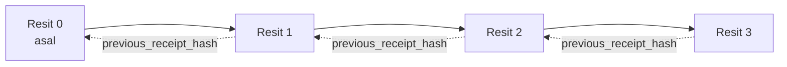

[Watch the lesson video: Menyediakan Ejen AI dengan Resit Kriptografi](https://youtu.be/PLACEHOLDER_VIDEO_ID)

> _(Video pelajaran dan gambar kecil akan ditambah oleh pasukan kandungan Microsoft selepas penggabungan, mengikut corak pelajaran 14 / 15.)_

# Menyediakan Ejen AI dengan Resit Kriptografi

## Pengenalan

Pelajaran ini akan merangkumi:

- Kenapa jejak audit untuk ejen AI penting untuk pematuhan, penyahpepijatan, dan kepercayaan.
- Apa itu resit kriptografi dan bagaimana ia berbeza daripada baris log yang tidak ditandatangani.
- Cara menghasilkan resit bertandatangan untuk panggilan alat ejen dalam Python biasa.
- Cara mengesahkan resit secara luar talian dan mengesan penyuntingan.
- Cara mengikat resit supaya membuang atau menyusun semula satu akan merosakkan rantai.
- Apa yang dibuktikan oleh resit dan apa yang jelas tidak dibuktikan.

## Matlamat Pembelajaran

Selepas menamatkan pelajaran ini, anda akan tahu cara untuk:

- Mengenal pasti mod kegagalan yang mendorong asal usul kriptografi bagi tindakan ejen.
- Menghasilkan resit yang ditandatangani Ed25519 ke atas muatan JSON kanonik.
- Mengesahkan resit secara bebas menggunakan hanya kunci awam penandatangan.
- Mengesan penyuntingan dengan menjalankan pengesahan semula ke atas resit yang diubah.
- Membina urutan resit berantai hash dan menerangkan mengapa rantai itu penting.
- Mengenal pasti sempadan antara apa yang resit buktikan (atribusi, integriti, susunan) dan apa yang tidak (ketepatan tindakan, kesahihan polisi).

## Masalah: Jejak Audit Ejen Anda

Bayangkan anda telah mengerahkan ejen AI untuk Contoso Travel. Ejen membaca permintaan pelanggan, memanggil API penerbangan untuk mencari pilihan, dan menempah tempat duduk bagi pihak pelanggan. Suku terakhir lalu, ejen memproses 50,000 tempahan.

Hari ini seorang juruaudit tiba. Mereka bertanya soalan mudah: "Tunjukkan apa yang ejen anda lakukan."

Anda menyerahkan fail log anda. Juruaudit melihatnya dan bertanya soalan yang lebih sukar: "Bagaimana saya tahu log ini tidak diedit?"

Ini adalah masalah jejak audit. Kebanyakan penyebaran ejen hari ini bergantung kepada:

- **Log aplikasi**: ditulis oleh ejen itu sendiri, boleh disunting oleh sesiapa yang mempunyai akses sistem fail.
- **Perkhidmatan log awan**: boleh dikesan penyuntingannya pada tahap platform tetapi hanya jika juruaudit mempercayai pengendali platform.
- **Log transaksi pangkalan data**: sesuai untuk perubahan pangkalan data tetapi tidak untuk panggilan alat sebarang jenis.

Tiada satu pun yang boleh menjawab soalan juruaudit tanpa memerlukan juruaudit mempercayai seseorang (anda, penyedia awan anda, vendor pangkalan data anda). Untuk penggunaan dalaman, kepercayaan tersebut biasanya boleh diterima. Untuk beban kerja terkawal (kewangan, penjagaan kesihatan, apa sahaja tertakluk kepada Akta AI EU), ia tidak boleh.

Resit kriptografi menyelesaikan ini dengan menjadikan setiap tindakan ejen boleh disahkan secara bebas. Juruaudit tidak perlu mempercayai anda. Mereka hanya perlu kunci awam anda dan resit itu sendiri.

## Apa Itu Resit Kriptografi?

Resit adalah objek JSON yang merekodkan apa yang ejen lakukan, ditandatangani dengan tandatangan digital.


Resit minimum kelihatan seperti ini:

```json
{
  "type": "agent.tool_call.v1",
  "agent_id": "contoso-travel-bot",
  "tool_name": "lookup_flights",
  "tool_args_hash": "sha256:a3f9c1...",
  "result_hash": "sha256:7b2e1d...",
  "policy_id": "contoso-travel-policy-v3",
  "timestamp": "2026-04-25T14:30:00Z",
  "sequence": 47,
  "previous_receipt_hash": "sha256:9d4e6a...",
  "signature": {
    "alg": "EdDSA",
    "sig": "c5af83...",
    "public_key": "8f3b2c..."
  }
}
```

Tiga sifat yang menjalankan kerja:

1. **Tandatangan**. Resit ditandatangani oleh pintu masuk ejen menggunakan kunci peribadi Ed25519. Sesiapa yang mempunyai kunci awam sepadan boleh mengesahkan tandatangan itu secara luar talian. Penyuntingan mana-mana medan akan membatalkan tandatangan.

2. **Pengekodan kanonik**. Sebelum menandatangani, resit diseriaknakan menggunakan Skema Kanonifikasi JSON (JCS, RFC 8785). Ini memastikan dua pelaksanaan yang menghasilkan resit logik yang sama menghasilkan output yang sama tepat. Tanpa kanonikifikasi, serializer JSON berbeza akan menghasilkan tandatangan berbeza untuk kandungan sama.

3. **Rantai hash**. Medan `previous_receipt_hash` menghubungkan setiap resit kepada resit sebelumnya. Mengeluarkan atau menyusun semula satu resit akan merosakkan setiap resit selepasnya. Penyuntingan menjadi jelas pada tahap rantai walaupun tandatangan individu dimintas.

Ketiga-tiga sifat ini memberikan tiga jaminan:

- **Atribusi**: kunci ini menandatangani kandungan ini.
- **Integriti**: kandungan tidak berubah sejak ditandatangani.
- **Susunan**: resit ini datang selepas resit itu dalam rantai.

## Menghasilkan Resit dalam Python

Anda tidak memerlukan perpustakaan khas untuk menghasilkan resit. Primitif kriptografi tersedia meluas dan logiknya hanya beberapa baris Python.

Latihan secara langsung dalam `code_samples/18-signed-receipts.ipynb` menerangkan alur penuh. Versi ringkasnya:

```python
import json
import hashlib
import base64
from nacl import signing
from jcs import canonicalize  # JSON kanonik RFC 8785

def b64url_nopad(data: bytes) -> str:
    return base64.urlsafe_b64encode(data).decode("ascii").rstrip("=")

def sha256_canonical(obj) -> str:
    """SHA-256 of a Python object's JCS-canonical JSON form."""
    return f"sha256:{hashlib.sha256(canonicalize(obj)).hexdigest()}"

# Jana atau muatkan kunci tandatangan (dalam pengeluaran, simpan dalam peti kunci)
signing_key = signing.SigningKey.generate()
verify_key = signing_key.verify_key

# Bina muatan resit (belum ada tandatangan)
tool_args = {"origin": "SYD", "destination": "LAX"}
tool_result = [{"flight": "QF11", "price": 1850, "stops": 0}]

payload = {
    "type": "agent.tool_call.v1",
    "agent_id": "contoso-travel-bot",
    "tool_name": "lookup_flights",
    "tool_args_hash": sha256_canonical(tool_args),
    "result_hash": sha256_canonical(tool_result),
    "policy_id": "contoso-travel-policy-v3",
    "timestamp": "2026-04-25T14:30:00Z",
    "sequence": 0,
    "previous_receipt_hash": None,
}

# Kanonikan, hash, tandatangan.
canonical_bytes = canonicalize(payload)
message_hash = hashlib.sha256(canonical_bytes).digest()
signature_bytes = signing_key.sign(message_hash).signature

# Lampirkan objek tandatangan berstruktur.
receipt = {
    **payload,
    "signature": {
        "alg": "EdDSA",
        "sig": b64url_nopad(signature_bytes),
        "public_key": b64url_nopad(bytes(verify_key)),
    },
}
```

Itu keseluruhan laluan penandatanganan. Latihan dalam notebook menerangkan setiap langkah.

## Mengesahkan Resit dan Mengesan Penyuntingan

Pengesahan adalah operasi songsang:

```python
import base64
import hashlib
from nacl import signing
from nacl.exceptions import BadSignatureError
from jcs import canonicalize

def b64url_decode(s: str) -> bytes:
    padding = "=" * ((4 - len(s) % 4) % 4)
    return base64.urlsafe_b64decode(s + padding)

def verify_receipt(receipt: dict) -> bool:
    # Tandatangan adalah objek berstruktur: {"alg", "sig", "public_key"}.
    sig_obj = receipt.get("signature")
    if not sig_obj or sig_obj.get("alg") != "EdDSA":
        return False

    # Bangunkan semula muatan yang sebenarnya ditandatangani (semua kecuali tandatangan).
    payload = {k: v for k, v in receipt.items() if k != "signature"}

    canonical_bytes = canonicalize(payload)
    message_hash = hashlib.sha256(canonical_bytes).digest()

    try:
        verify_key = signing.VerifyKey(b64url_decode(sig_obj["public_key"]))
        verify_key.verify(message_hash, b64url_decode(sig_obj["sig"]))
        return True
    except BadSignatureError:
        return False
```

Fungsi ini mengambil resit dan mengembalikan `True` jika tandatangan sah, `False` jika tidak. Tiada panggilan rangkaian, tiada kebergantungan perkhidmatan, tiada kepercayaan diperlukan kepada mana-mana pihak ketiga.

Untuk melihat pengesanan penyuntingan berfungsi, notebook terangkan:

1. Menghasilkan resit sah dan mengesahkan ia sah.
2. Mengubah satu bait medan `tool_args_hash`.
3. Menjalankan semula pengesahan dan melihat ia gagal.

Ini adalah demonstrasi praktikal bahawa resit boleh dikesan penyuntingannya: sebarang pengubahsuaian, walaupun kecil, merosakkan tandatangan.

## Mengikat Rantai Resit untuk Ejen Multi-Langkah

Satu resit bertandatangan melindungi satu tindakan. Rantai resit melindungi satu urutan.



Setiap resit merekod hash resit sebelumnya. Untuk mengeluarkan resit 2 tanpa dikesan, penyerang perlu sama ada:

- Mengubah medan `previous_receipt_hash` resit 3 (merosakkan tandatangan resit 3), ATAU
- Memalsu tandatangan baru ke atas resit 3 yang diubah (memerlukan kunci peribadi ejen).

Jika kunci peribadi disimpan dalam peti kunci perkakasan dan anda menerbitkan kunci awam bersama setiap resit, kedua-dua serangan tersebut tidak mungkin berlaku tanpa dikesan.

Notebook menerangkan:

1. Membina rantai tiga resit.
2. Mengesahkan bahawa medan `previous_receipt_hash` setiap resit sepadan dengan hash sebenar resit sebelumnya.
3. Menyunting satu resit di tengah dan melihat rantai terputus tepat pada titik itu.

Inilah cara anda menghasilkan jejak audit yang boleh disahkan juruaudit luar tanpa perlu mempercayai anda.

## Apa yang Resit Buktikan (dan Apa yang Tidak)

Ini adalah bahagian paling penting pelajaran ini. Resit sangat kuat tapi kuasanya terhad.

**Resit membuktikan tiga perkara:**

1. **Atribusi**: kunci tertentu menandatangani muatan tertentu.
2. **Integriti**: muatan tidak berubah sejak ditandatangani.
3. **Susunan**: resit ini datang selepas resit yang lain dalam rantai hash.

**Resit TIDAK membuktikan:**

1. **Ketepatan**: tindakan ejen adalah tindakan yang betul. Resit boleh ditandatangani untuk jawapan salah sama bersihnya seperti untuk jawapan betul.
2. **Pematuhan polisi**: polisi yang dirujuk dalam `policy_id` benar-benar dinilai, atau bahawa ia akan membenarkan tindakan ini jika diperiksa. Resit merekod apa yang dituntut, bukan apa yang dikuatkuasakan.
3. **Identiti selain kunci**: resit berkata "kunci ini menandatangani kandungan ini." Ia tidak berkata "manusia ini membenarkan ini." Menghubungkan kunci kepada orang atau organisasi memerlukan infrastruktur identiti berasingan (direktori, daftar kunci awam, dsb.).
4. **Kebenaran input**: jika ejen menerima arahan yang dimanipulasi dan bertindak ke atasnya, resit merekod tindakan dengan setia. Resit adalah selepas pengesahan input, bukan pengganti padanya.

Sempadan ini penting untuk dua sebab:

- Ia memberitahu apa kegunaan resit: menjadikan tingkah laku ejen audit-able dan mudah dikesan penyelewengan, walaupun merentasi sempadan organisasi.
- Ia memberitahu lapisan tambahan yang masih anda perlukan: pengesahan input (Pelajaran 6), penguatkuasaan polisi (diringkaskan di bawah), dan infrastruktur identiti (di luar skop pelajaran ini).

Kesilapan biasa ialah menganggap "kami ada resit" bermaksud "kami diperintah." Tidak begitu. Resit adalah asas. Tadbir urus adalah sistem yang anda bina di atasnya.

## Rujukan Pengeluaran

Kod Python dalam pelajaran ini sengaja minimum supaya anda boleh baca setiap baris dan faham apa yang berlaku. Dalam pengeluaran, anda ada dua pilihan:

1. **Terus bina atas primitif kriptografi.** 50 baris yang anda lihat di atas sudah cukup untuk banyak kes penggunaan. PyNaCl (Ed25519) dan pakej `jcs` (JSON kanonik) adalah perpustakaan yang diselenggara dan diaudit dengan baik.

2. **Gunakan perpustakaan resit pengeluaran.** Beberapa projek sumber terbuka melaksanakan corak sama dengan ciri tambahan (rotasi kunci, pengesahan berkelompok, pengedaran JWK Set, integrasi dengan enjin polisi):
   - Format resit yang digunakan dalam pelajaran ini mengikuti Draf Internet IETF (`draft-farley-acta-signed-receipts`) yang kini dalam proses piawaian.
   - Microsoft Agent Governance Toolkit menggabungkan resit dengan keputusan polisi berdasar Cedar; lihat Tutorial 33 dalam repositori itu untuk contoh menyeluruh.
   - Pakej `protect-mcp` (npm) dan `@veritasacta/verify` (npm) menyediakan pelaksanaan Node bagi penandatanganan resit dan pengesahan luar talian, bertujuan untuk membalut mana-mana pelayan MCP dengan jejak audit yang mudah dikesan penyuntingannya.

Keputusan antara membina sendiri dan guna perpustakaan serupa dengan keputusan menulis perpustakaan JWT sendiri versus guna perpustakaan yang telah diuji: kedua-duanya munasabah; perpustakaan menjimatkan masa dan mengurangkan kawasan audit; cara-bina-sendiri memaksa anda faham setiap primitif. Pelajaran ini mengajar jalan cara-bina-sendiri supaya anda ada asas untuk mana-mana pilihan.

## Semak Pengetahuan

Uji kefahaman anda sebelum beralih ke latihan praktikal.

**1. Resit ditandatangani menggunakan kunci peribadi Ed25519 ejen. Juruaudit hanya ada kunci awam. Boleh juruaudit mengesahkan resit secara luar talian?**

<details>
<summary>Jawapan</summary>

Boleh. Pengesahan Ed25519 hanya memerlukan kunci awam dan bait bertandatangan. Tiada panggilan rangkaian, tiada kebergantungan perkhidmatan. Ini sifat yang menjadikan resit berguna dalam keadaan audit berpisah udara, pelbagai organisasi, atau kepercayaan rendah.
</details>

**2. Penyerang mengubah medan `policy_id` dalam resit untuk mendakwa ia dikawal oleh polisi lebih permisif. Tandatangan itu dibuat ke atas muatan asal. Apa berlaku semasa pengesahan?**

<details>
<summary>Jawapan</summary>

Pengesahan gagal. Tandatangan dikira ke atas bait kanonik muatan asal; mengubah mana-mana medan mengubah bait kanonik, yang mengubah hash SHA-256, menyebabkan tandatangan tidak sah. Penyerang perlu kunci peribadi untuk menghasilkan tandatangan sah baru, yang mereka tidak ada.
</details>

**3. Kenapa resit memasukkan `tool_args_hash` dan `result_hash` dan bukan hujah dan keputusan mentah?**

<details>
<summary>Jawapan</summary>

Dua sebab. Pertama, resit mungkin perlu diarkib atau dihantar dalam persekitaran di mana mendedahkan kandungan mentah (PII, data perniagaan) adalah masalah. Hash menjaga resit kecil dan kandungan peribadi; juruaudit mengesahkan hash sepadan dengan salinan kandungan sebenar yang disimpan berasingan. Kedua, hash berukuran tetap; resit dengan hash terhad saiznya tanpa mengira besar input dan output.
</details>

**4. Medan `previous_receipt_hash` menghubungkan setiap resit kepada pendahulunya. Jika penyerang memadam satu resit secara senyap dari tengah rantai, apa yang menjadi tidak sah?**

<details>
<summary>Jawapan</summary>

Setiap resit selepas yang dipadam. Medan `previous_receipt_hash` mereka tidak sepadan dengan rantai sebenar (kerana resit dirujuk tidak wujud lagi, atau rantai kini tunjuk ke pendahulu berbeza). Untuk menyembunyikan pemadaman, penyerang perlu menandatangani semula setiap resit kemudian, yang memerlukan kunci peribadi.
</details>

**5. Resit mengesahkan dengan bersih. Adakah itu membuktikan tindakan ejen betul, sah, atau patuh polisi?**

<details>
<summary>Jawapan</summary>

Tidak. Resit sah membuktikan tiga perkara: atribusi (kunci ini menandatangani ini), integriti (kandungan tidak berubah), dan susunan (resit ini datang selepas yang lain). Ia TIDAK membuktikan tindakan betul, bahawa polisi `policy_id` benar menilai, atau ejen ikut setiap peraturan. Resit menjadikan tingkah laku ejen audit-able, tidak semestinya betul. Ini sempadan paling penting dalam pelajaran.
</details>

## Latihan Praktikal

Buka `code_samples/18-signed-receipts.ipynb` dan lengkapkan keempat-empat bahagian:

1. **Bahagian 1**: Tandatangani resit pertama anda dan sahkan ia.
2. **Bahagian 2**: Ubah suai resit dan perhatikan pengesahan gagal.
3. **Bahagian 3**: Bina rantai tiga resit dan sahkan integriti rantai.
4. **Bahagian 4**: Gunakan corak ini pada ejen yang dibina dengan Microsoft Agent Framework: bungkus panggilan alat dalam penandatanganan resit, kemudian sahkan resit secara bebas.

**Cabaran lanjutan 1:** lanjutkan skema resit dengan medan tambahan pilihan anda (contohnya, ID permintaan untuk penjejakan), kemas kini logik penandatanganan kanonik untuk memasukkannya, dan sahkan resit masih melalui pengesahan. Kemudian ubah medan selepas tandatangan dan sahkan pengesahan gagal. Ini memaksa anda faham bagaimana setiap bait pengekodan kanonik menyumbang kepada tandatangan.
**Cabaran regangan 2:** SHA-256-hash dua resit anda bersama-sama (gabungkan bait kanonik mereka dalam susunan deterministik) dan tanamkan digest yang terhasil sebagai medan baharu pada resit ketiga sebelum menandatanganinya. Sahkan bahawa ketiga-tiga resit masih boleh diproses dua hala. Anda baru sahaja membina bukti kemasukan satu langkah: sesiapa yang memegang resit ketiga boleh membuktikan dua resit pertama wujud pada masa ia ditandatangani, tanpa perlu mendedahkan kandungannya. Ini adalah corak yang digunakan oleh resit pendedahan selektif pada skala besar (komitmen Merkle, RFC 6962).

## Kesimpulan

Resit kriptografi memberikan ejen AI jejak audit yang:

- **Boleh disahkan secara bebas**: mana-mana pihak dengan kunci awam boleh mengesahkan, tiada kebergantungan perkhidmatan.
- **Bukti pengubahsuaian**: sebarang pengubahsuaian membatalkan tandatangan.
- **Boleh dibawa kemana-mana**: resit adalah fail JSON yang kecil; ia boleh diarkib, dipindahkan, dan disahkan di mana-mana sahaja.
- **Mematuhi piawaian**: dibina di atas Ed25519 (RFC 8032), JCS (RFC 8785), dan SHA-256, semua primitif yang digunakan secara meluas.

Ia bukan pengganti untuk pengesahan input, penguatkuasaan dasar, atau infrastruktur identiti. Ia adalah asas bagi lapisan-lapisan tersebut. Apabila anda melancarkan ejen ke dalam beban kerja terkawal, aliran kerja pelbagai organisasi, atau mana-mana tetapan di mana juruaudit masa depan tidak boleh dianggap mempercayai anda, resit adalah cara untuk memastikan jejak audit jujur.

Pengajaran yang paling penting: resit membuktikan siapa yang berkata apa, bila. Ia tidak membuktikan bahawa apa yang dikatakan adalah benar atau tepat. Pegang perbezaan itu dengan erat. Ia adalah perbezaan antara sistem asal-usul yang jujur dan yang mengelirukan.

## Senarai Semak Pengeluaran

Apabila anda bersedia untuk melangkah dari pelajaran ini kepada pelancaran ejen yang ditandatangani resit dalam persekitaran sebenar:

- [ ] **Pindahkan kunci tandatangan dari komputer riba pembangun.** Gunakan Azure Key Vault, AWS KMS, atau modul keselamatan perkakasan. Kunci peribadi yang menandatangani resit anda tidak boleh hidup dalam kawalan sumber atau dalam teks biasa pada mesin aplikasi.
- [ ] **Terbitkan kunci awam pengesahan.** Juruaudit memerlukannya untuk pengesahan luar talian. Corak standard ialah JWK Set pada URL yang diketahui (RFC 7517), contohnya `https://your-org.example.com/.well-known/agent-keys.json`.
- [ ] **Muatkan rantaian secara luaran.** Secara berkala tulis hash kepala rantaian terkini ke log ketelusan (Sigstore Rekor, kewibawaan cap masa RFC 3161, atau sistem dalaman kedua) supaya pihak luar boleh mengesahkan "rantai ini wujud pada masa ini."
- [ ] **Simpan resit secara kekal.** Penyimpanan blok tambah-sahaja (Azure Storage dengan polisi ketidakbolehubahan, AWS S3 Object Lock) menghalang orang dalam daripada menulis semula sejarah pada tahap penyimpanan.
- [ ] **Tentukan penjagaan.** Banyak rejim pematuhan memerlukan penjagaan berbilang tahun. Rancang pertumbuhan resit (setiap resit sekitar 500 bait; ejen yang membuat 10K panggilan sehari menghasilkan sekitar 1.8 GB setahun).
- [ ] **Dokumentasikan apa yang tidak diliputi oleh resit.** Resit membuktikan keterkaitan, integriti, dan susunan. Buku panduan anda harus secara eksplisit menyenaraikan kawalan tambahan apa (pengesahan input, penguatkuasaan dasar, had kadar, infrastruktur identiti) yang berada bersama resit dalam kedudukan tadbir urus anda.

### Ada Soalan Lebih Lanjut tentang Menyediakan Ejen AI?

Sertai [Microsoft Foundry Discord](https://aka.ms/ai-agents/discord) untuk bertemu dengan pelajar lain, menghadiri waktu pejabat, dan mendapatkan jawapan kepada soalan Ejen AI anda.

## Di Luar Pelajaran Ini

Pelajaran ini merangkumi penandatanganan resit tunggal dan urutan rantaian hash. Primitif yang sama membentuk beberapa corak lanjutan yang mungkin anda temui apabila kedudukan tadbir urus anda matang:

- **Pendedahan selektif.** Apabila medan resit ditetapkan secara bebas (pohon Merkle gaya RFC 6962), anda boleh mendedahkan medan tertentu kepada juruaudit tertentu dan membuktikan selebihnya tidak berubah tanpa mendedahkannya. Berguna apabila resit yang sama perlu memenuhi audit menyeluruh (yang mahukan kesempurnaan) dan peraturan peminimuman data seperti GDPR (yang mahu juruaudit melihat seberapa sedikit yang perlu).
- **Pembatalan resit.** Jika kunci tandatangan dikompromi, anda perlu cara untuk menanda semua resit yang ditandatangani oleh kunci itu sebagai tidak dipercayai dari titik masa ke hadapan. Corak standard: kunci tandatangan jangka pendek dan senarai pembatalan yang diterbitkan, atau log ketelusan dengan entri pembatalan.
- **Resit tandatangan dwipihak / terpisah.** Sesetengah pelaksanaan memisah beban tandatangan kepada separuh pra-pelaksanaan (`authorization_*`) dan pasca-pelaksanaan (`result_*`) dengan tandatangan bebas, berguna apabila keputusan kebenaran dan hasil yang diperhatikan dihasilkan oleh pelaku berbeza atau pada masa berlainan. Ini ditambah secara selari di atas format resit yang diajar dalam pelajaran ini.
- **Komposisi beban.** Resit menyegel bait apa sahaja yang anda masukkan dalam `result_hash`. Beban dunia sebenar sering lebih kaya daripada hasil panggilan alat tunggal: pertimbangan pra-keputusan (ramalan model, pilihan yang dipertimbangkan, bukti dan kesempurnaannya, kedudukan risiko, rantai akauntabiliti, hasil pintu masuk) boleh semua hidup dalam beban, disegel oleh satu resit. Ini mengekalkan format resit minimum sambil membolehkan skema beban berkembang domain demi domain.
- **Keserasian lintas pelaksanaan.** Pelbagai pelaksanaan bebas format resit yang sama (Python, TypeScript, Rust, Go) saling mengesahkan menggunakan vektor ujian berkongsi. Jika anda membina pelaksanaan sendiri, mengesahkan dengan vektor yang diterbitkan mengesahkan keserasian sambungan.
- **Migrasi pasca-kuantum.** Ed25519 digunakan secara meluas hari ini tetapi bukan tahan kuantum. Format resit adalah algoritma-agil: medan `signature.alg` boleh membawa `ML-DSA-65` (standard tandatangan pasca-kuantum NIST) apabila anda perlu berpindah. Rancang tempoh peralihan di mana resit ditandatangani dua kali.

## Sumber Tambahan

- <a href="https://datatracker.ietf.org/doc/draft-farley-acta-signed-receipts/" target="_blank">IETF Internet-Draft: Resit Keputusan Bertandatangan untuk Kawalan Akses Mesin-ke-Mesin</a>
- <a href="https://learn.microsoft.com/azure/ai-studio/responsible-use-of-ai-overview" target="_blank">Gambaran Keseluruhan AI Bertanggungjawab (Azure AI)</a>
- <a href="https://datatracker.ietf.org/doc/html/rfc8032" target="_blank">RFC 8032: Algoritma Tandatangan Digital Edwards-Curve (EdDSA)</a>
- <a href="https://datatracker.ietf.org/doc/html/rfc8785" target="_blank">RFC 8785: Skim Kanoniku JSON (JCS)</a>
- <a href="https://datatracker.ietf.org/doc/html/rfc6962" target="_blank">RFC 6962: Ketelusan Sijil</a> (pembinaan pohon Merkle yang digunakan oleh resit pendedahan selektif)
- <a href="https://github.com/microsoft/agent-governance-toolkit/blob/main/docs/tutorials/33-offline-verifiable-receipts.md" target="_blank">Pakej Alat Tadbir Ejen Microsoft, Tutorial 33: Resit Keputusan Boleh Diperiksa Luar Talian</a>
- <a href="https://github.com/ScopeBlind/agent-governance-testvectors" target="_blank">Vektor ujian keserasian lintas pelaksanaan</a> untuk format resit yang digunakan dalam pelajaran ini (Apache-2.0)
- <a href="https://pynacl.readthedocs.io/" target="_blank">Dokumentasi PyNaCl</a> (Ed25519 dalam Python)

## Pelajaran Sebelumnya

[Menjadi Ejen Penggunaan Komputer (CUA)](../15-browser-use/README.md)

## Pelajaran Seterusnya

_(Akan ditentukan oleh penyelenggara kurikulum)_

---

<!-- CO-OP TRANSLATOR DISCLAIMER START -->
**Penafian**:
Dokumen ini telah diterjemahkan menggunakan perkhidmatan terjemahan AI [Co-op Translator](https://github.com/Azure/co-op-translator). Walaupun kami berusaha untuk ketepatan, sila ambil maklum bahawa terjemahan automatik mungkin mengandungi kesilapan atau ketidaktepatan. Dokumen asal dalam bahasa asalnya harus dianggap sebagai sumber yang sahih. Untuk maklumat penting, terjemahan oleh manusia profesional adalah disyorkan. Kami tidak bertanggungjawab terhadap sebarang salah faham atau salah tafsir yang timbul daripada penggunaan terjemahan ini.
<!-- CO-OP TRANSLATOR DISCLAIMER END -->