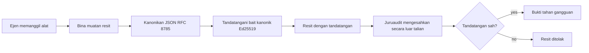
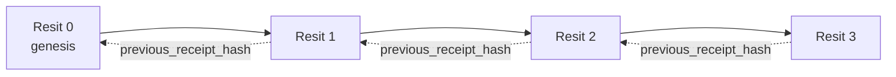

[Tonton video pelajaran: Mengamankan Ejen AI dengan Resit Kriptografi](https://youtu.be/PLACEHOLDER_VIDEO_ID)

> _(Video pelajaran dan thumbnail akan ditambah oleh pasukan kandungan Microsoft selepas penggabungan, mengikut corak pelajaran 14 / 15.)_

# Mengamankan Ejen AI dengan Resit Kriptografi

## Pengenalan

Pelajaran ini akan merangkumi:

- Mengapa jejak audit untuk ejen AI penting untuk pematuhan, debugging, dan kepercayaan.
- Apa itu resit kriptografi dan bagaimana ia berbeza daripada baris log tanpa tandatangan.
- Cara menghasilkan resit yang ditandatangani untuk panggilan alat ejen menggunakan Python biasa.
- Cara mengesahkan resit secara luar talian dan mengesan pengubahan.
- Cara menyusun rantaian resit supaya penghapusan atau penyusunan semula satu resit memecahkan rantaian.
- Apa yang resit buktikan dan apa yang mereka tidak buktikan secara eksplisit.

## Matlamat Pembelajaran

Selepas melengkapkan pelajaran ini, anda akan tahu cara:

- Mengenal pasti mod kegagalan yang memotivasi asal-usul kriptografi untuk tindakan ejen.
- Menghasilkan resit yang ditandatangani Ed25519 ke atas muatan JSON kanonik.
- Mengesahkan resit secara bebas menggunakan hanya kunci awam penandatangan.
- Mengesan pengubahan dengan menjalankan semula pengesahan pada resit yang diubah.
- Membina urutan resit yang dihubungkan dengan hash dan menerangkan mengapa rantaian itu penting.
- Mengenali sempadan antara apa yang resit buktikan (atribusi, integriti, susunan) dan apa yang mereka tidak buktikan (ketepatan tindakan, kesahihan polisi).

## Masalah: Jejak Audit Ejen Anda

Bayangkan anda telah melancarkan ejen AI untuk Contoso Travel. Ejen itu membaca permintaan pelanggan, memanggil API penerbangan untuk menyemak pilihan, dan menempah tempat duduk bagi pihak pelanggan. Suku tahun lepas, ejen memproses 50,000 tempahan.

Hari ini seorang juruaudit tiba. Mereka bertanya soalan mudah: "Tunjukkan apa yang ejen anda lakukan."

Anda menyerahkan fail log anda. Juruaudit melihatnya dan bertanya soalan lebih sukar: "Bagaimana saya tahu log ini tidak disunting?"

Ini adalah masalah jejak audit. Kebanyakan pelancaran ejen hari ini bergantung pada:

- **Log aplikasi**: ditulis oleh ejen itu sendiri, boleh disunting oleh sesiapa sahaja yang mempunyai akses sistem fail.
- **Perkhidmatan log awan**: sukar diubah di peringkat platform tetapi hanya jika juruaudit mempercayai operator platform.
- **Log transaksi pangkalan data**: sesuai untuk perubahan pangkalan data tetapi tidak untuk panggilan alat sewenang-wenangnya.

Tiada satu pun daripadanya dapat menjawab soalan juruaudit tanpa memerlukan juruaudit mempercayai seseorang (anda, penyedia awan anda, vendor pangkalan data anda). Untuk kegunaan dalaman, kepercayaan itu sering boleh diterima. Untuk beban kerja yang dikawal selia (kewangan, penjagaan kesihatan, apa sahaja yang tertakluk kepada Akta AI EU), ia tidak boleh.

Resit kriptografi menyelesaikan ini dengan menjadikan setiap tindakan ejen boleh disahkan secara bebas. Juruaudit tidak perlu mempercayai anda. Mereka hanya memerlukan kunci awam anda dan resit itu sendiri.

## Apa Itu Resit Kriptografi?

Resit adalah objek JSON yang merekodkan apa yang dilakukan ejen, ditandatangani dengan tandatangan digital.


```mermaid
flowchart LR
    A[Ejen memanggil alat] --> B[Bina muatan resit]
    B --> C[Kanonikan JSON RFC 8785]
    C --> E[Tandatangani bait kanonik Ed25519]
    E --> F[Resit dengan tandatangan]
    F --> G[Juruaudit mengesahkan secara luar talian]
    G --> H{Tandatangan sah?}
    H -- yes --> I[Bukti tahan gangguan]
    H -- no --> J[Resit ditolak]
```

Resit minimum kelihatan seperti ini:

```json
{
  "type": "agent.tool_call.v1",
  "agent_id": "contoso-travel-bot",
  "tool_name": "lookup_flights",
  "tool_args_hash": "sha256:a3f9c1...",
  "result_hash": "sha256:7b2e1d...",
  "policy_id": "contoso-travel-policy-v3",
  "timestamp": "2026-04-25T14:30:00Z",
  "sequence": 47,
  "previous_receipt_hash": "sha256:9d4e6a...",
  "signature": {
    "alg": "EdDSA",
    "sig": "c5af83...",
    "public_key": "8f3b2c..."
  }
}
```

Tiga ciri melakukan tugas:

1. **Tandatangan**. Resit ditandatangani oleh pintu masuk ejen menggunakan kunci peribadi Ed25519. Sesiapa yang mempunyai kunci awam yang sepadan boleh mengesahkan tandatangan itu secara luar talian. Pengubahan mana-mana medan membatalkan tandatangan.

2. **Pengekodan kanonik**. Sebelum menandatangani, resit diserikan menggunakan Skim Kanonikal JSON (JCS, RFC 8785). Ini memastikan dua implementasi yang menghasilkan resit logik yang sama menghasilkan output byte yang sama. Tanpa kanonisasi, penyerial JSON yang berbeza akan menghasilkan tandatangan berbeza untuk kandungan yang sama.

3. **Rantaian hash**. Medan `previous_receipt_hash` mengaitkan setiap resit dengan yang sebelum itu. Menghapus atau menyusun semula sebuah resit memecahkan semua resit yang datang selepasnya. Pengubahan menjadi nyata pada peringkat rantaian walaupun tandatangan individu diatasi.

Bersama-sama ciri-ciri ini menyediakan tiga jaminan:

- **Atribusi**: kunci ini menandatangani kandungan ini.
- **Integriti**: kandungan tidak berubah sejak ditandatangani.
- **Susunan**: resit ini datang selepas resit itu dalam rantai.

## Menghasilkan Resit dalam Python

Anda tidak memerlukan perpustakaan khas untuk menghasilkan resit. Primitif kriptografi tersedia secara meluas dan logiknya hanya beberapa puluh baris Python.

Latihan amali dalam `code_samples/18-signed-receipts.ipynb` menerangkan seluruh aliran. Versi ringkas:

```python
import json
import hashlib
import base64
from nacl import signing
from jcs import canonicalize  # JSON kanonik RFC 8785

def b64url_nopad(data: bytes) -> str:
    return base64.urlsafe_b64encode(data).decode("ascii").rstrip("=")

def sha256_canonical(obj) -> str:
    """SHA-256 of a Python object's JCS-canonical JSON form."""
    return f"sha256:{hashlib.sha256(canonicalize(obj)).hexdigest()}"

# Jana atau muatkan kekunci tandatangan (dalam pengeluaran, simpan dalam peti kekunci)
signing_key = signing.SigningKey.generate()
verify_key = signing_key.verify_key

# Bina muatan resit (belum ada tandatangan)
tool_args = {"origin": "SYD", "destination": "LAX"}
tool_result = [{"flight": "QF11", "price": 1850, "stops": 0}]

payload = {
    "type": "agent.tool_call.v1",
    "agent_id": "contoso-travel-bot",
    "tool_name": "lookup_flights",
    "tool_args_hash": sha256_canonical(tool_args),
    "result_hash": sha256_canonical(tool_result),
    "policy_id": "contoso-travel-policy-v3",
    "timestamp": "2026-04-25T14:30:00Z",
    "sequence": 0,
    "previous_receipt_hash": None,
}

# Kanonikan dan tandatangani bait JCS secara langsung. PureEdDSA menghash secara dalaman.
canonical_bytes = canonicalize(payload)
signature_bytes = signing_key.sign(canonical_bytes).signature

# Lampirkan objek tandatangan berstruktur.
receipt = {
    **payload,
    "signature": {
        "alg": "EdDSA",
        "sig": b64url_nopad(signature_bytes),
        "public_key": b64url_nopad(bytes(verify_key)),
    },
}
```

Itulah keseluruhan saluran penandatanganan. Latihan dalam buku nota menerangkan setiap langkah.

## Mengesahkan Resit dan Mengesan Pengubahan

Pengesahan adalah operasi songsang:

```python
import base64
import hashlib
from nacl import signing
from nacl.exceptions import BadSignatureError
from jcs import canonicalize

def b64url_decode(s: str) -> bytes:
    padding = "=" * ((4 - len(s) % 4) % 4)
    return base64.urlsafe_b64decode(s + padding)

def verify_receipt(receipt: dict) -> bool:
    # Tandatangan adalah objek berstruktur: {"alg", "sig", "public_key"}.
    sig_obj = receipt.get("signature")
    if not sig_obj or sig_obj.get("alg") != "EdDSA":
        return False

    # Bina semula muatan yang sebenarnya ditandatangani (semua kecuali tandatangan).
    payload = {k: v for k, v in receipt.items() if k != "signature"}

    canonical_bytes = canonicalize(payload)

    try:
        verify_key = signing.VerifyKey(b64url_decode(sig_obj["public_key"]))
        verify_key.verify(canonical_bytes, b64url_decode(sig_obj["sig"]))
        return True
    except BadSignatureError:
        return False
```

Fungsi ini mengambil resit dan mengembalikan `True` jika tandatangan sah, `False` jika tidak. Tiada panggilan rangkaian, tiada pergantungan perkhidmatan, tiada keperluan mempercayai pihak ketiga.

Untuk melihat pengesanan pengubahan beraksi, buku nota menerangkan:

1. Menghasilkan resit sah dan mengesahkan ia benar.
2. Mengubah satu bait dalam medan `tool_args_hash`.
3. Menjalankan semula pengesahan dan melihat ia gagal.

Demonstrasi praktikal ini menunjukkan resit sukar diubah: sebarang pengubahan, walau sekecil mana, memecahkan tandatangan.

## Menyusun Rantaian Resit untuk Ejen Berbilang Langkah

Satu resit bertandatangan melindungi satu tindakan. Rantaian resit melindungi satu urutan.


```mermaid
flowchart LR
    R0[Resit 0<br/>genesis] --> R1[Resit 1]
    R1 --> R2[Resit 2]
    R2 --> R3[Resit 3]
    R1 -. previous_receipt_hash .-> R0
    R2 -. previous_receipt_hash .-> R1
    R3 -. previous_receipt_hash .-> R2
```

Setiap resit merekodkan hash resit sebelumnya. Untuk membuang resit ke-2 secara senyap, penyerang perlu:

- Mengubah medan `previous_receipt_hash` resit ke-3 (memecahkan tandatangan resit ke-3), ATAU
- Memalsu tandatangan baharu pada resit yang diubah ke-3 (memerlukan kunci peribadi ejen).

Jika kunci peribadi disimpan dalam peti kekunci perkakasan dan anda menerbitkan kunci awam dengan setiap resit, kedua-dua serangan itu tidak boleh dilakukan tanpa dikesan.

Buku nota menerangkan:

1. Membina rantaian tiga resit.
2. Mengesahkan bahawa setiap `previous_receipt_hash` pada resit sepadan dengan hash sebenar resit sebelumnya.
3. Mengubah satu resit di tengah dan melihat rantaian putus tepat pada titik itu.

Inilah cara anda menghasilkan jejak audit yang juruaudit luar boleh sahkan tanpa mempercayai anda.

## Apa Yang Resit Buktikan (dan Apa Yang Mereka Tidak)

Ini adalah bahagian paling penting dalam pelajaran ini. Resit adalah berkuasa tetapi kuasanya terhad.

**Resit membuktikan tiga perkara:**

1. **Atribusi**: kunci tertentu menandatangani muatan tertentu.
2. **Integriti**: muatan tidak berubah sejak ditandatangani.
3. **Susunan**: resit ini datang selepas resit lain dalam rantai hash.

**Resit TIDAK membuktikan:**

1. **Ketepatan**: bahawa tindakan ejen adalah tindakan yang betul. Resit boleh ditandatangani untuk jawapan salah sama bersihnya seperti jawapan betul.
2. **Pematuhan polisi**: bahawa polisi yang dirujuk dalam `policy_id` benar-benar dinilai, atau bahawa ia akan membenarkan tindakan ini jika diperiksa. Resit merekodkan apa yang didakwa, bukan apa yang dikuatkuasakan.
3. **Identiti selain kunci**: resit mengatakan "kunci ini menandatangani kandungan ini." Ia tidak mengatakan "manusia ini meluluskan ini." Menghubungkan kunci dengan orang atau organisasi memerlukan infrastruktur identiti berasingan (direktori, daftar kunci awam, dan sebagainya).
4. **Kebenaran input**: jika ejen menerima arahan yang diubahsuai dan bertindak atasnya, resit merekodkan tindakan itu dengan setia. Resit adalah selepas pengesahan input, bukan pengganti untuknya.

Sempadan ini penting untuk dua sebab:

- Ia memberitahu anda untuk apa resit berguna: menjadikan tingkah laku ejen boleh diaudit dan sukar diubah, walaupun merentas sempadan organisasi.
- Ia memberitahu anda lapisan tambahan apa yang anda masih perlukan: pengesahan input (Pelajaran 6), penguatkuasaan polisi (diringkaskan di bawah), dan infrastruktur identiti (tidak dibincangkan dalam pelajaran ini).

Kesalahan biasa adalah menganggap bahawa "kami mempunyai resit" bermakna "kami dikuasai." Ia tidak. Resit adalah asas. Tadbir urus adalah sistem yang anda bina di atasnya.

## Membuktikan Manusia Meluluskan Tindakan Tepat

Item 3 di atas adalah sewajarnya satu seksyen sendiri: resit tindakan mengatakan "kunci ini menandatangani kandungan ini," tidak pernah "manusia meluluskan ini." Untuk tindakan risiko tinggi (refund, penghapusan, pindahan wang), rangka kerja tadbir urus semakin memerlukan kenyataan yang hilang itu, dan ia boleh dihasilkan dengan primitif yang sama yang sudah anda bina dalam pelajaran ini.

Buku nota susulan `code_samples/human-authorization-receipts.ipynb` menambah satu jenis resit kedua, `human.approval.v1`, dalam bentuk sampul yang sama seperti resit pelajaran (muatan bertipe ditandatangani oleh Ed25519 ke atas bait JCS kanoniknya, dengan objek `signature` di luar bait yang ditandatangani). Seorang pelulus bernama menandatangani **tindakan kanonik penuh dan imbasan (digest)nya** sebelum pelaksanaan; resit tindakan ejen membawa **imbasan tindakan yang sama** dan `parent_approval_ref`, `receipt_hash` kelulusan tersebut, konvensi yang sama dengan `previous_receipt_hash` dalam rantai yang anda bina di atas. Satu `verify_chain` menyemak kedua-dua artifak di bawah **daftar kunci penetapan berasingan** (kunci pelulus berbanding kunci ejen), jadi laluan kod dikongsi tetapi pihak berkuasa tidak.

Ciri yang diperoleh, dinyatakan dengan berhati-hati: *manusia meluluskan tindakan tepat ini, dan ejen melaksanakan tepat tindakan yang diluluskan itu.* Peraturan penolakan dalam buku nota yang menjadikan ciri itu nyata dan bukan hanya pernyataan:

- set klasik: pengubahan, pentadbir keliru, main balik, kunci palsu di mana-mana, input yang cacat;
- **kuasa lapuk**: tandatangan yang masih disahkan, ditolak juga kerana versi polisi berubah, kunci pelulus dikeluarkan dari daftar penetapan, atau kelulusan tamat tempoh sebelum pelaksanaan;
- **penggantian imbasan**: resit tindakan sah yang menunjuk pada kelulusan *sebenar* yang mengikat tindakan kanonik yang *berbeza*.

Setiap kegagalan menolak dengan sebab berbeza, jadi juruaudit membaca penolakan boleh mengetahui sama ada kuasa lapuk atau tindakan yang dilaksanakan berubah. Peraturan buku nota: kelulusan bertandatangan bukan kuasa dengan sendirinya. Kuasa wujud hanya jika kedua-dua resit masih mengikat kepada tindakan kanonik yang sama pada masa pelaksanaan. Resit kelulusan manusia adalah komposisi pendidikan yang ditakrifkan oleh pelajaran ini, bukan jenis resit yang ditakrifkan oleh `draft-farley-acta-signed-receipts`.

## Rujukan Pengeluaran

Kod Python dalam pelajaran ini sengaja minimal supaya anda boleh membaca setiap baris dan memahami dengan tepat apa yang sedang berlaku. Dalam pengeluaran, anda ada dua pilihan:

1. **Bina terus atas primitif kriptografi.** 50 baris yang anda lihat di atas mencukupi untuk banyak kes penggunaan. PyNaCl (Ed25519) dan pakej `jcs` (JSON kanonik) adalah perpustakaan yang diselenggara dan diaudit dengan baik.

2. **Gunakan perpustakaan resit pengeluaran.** Beberapa projek sumber terbuka melaksanakan corak yang sama dengan ciri tambahan (putaran kunci, pengesahan kelompok, pengedaran Set JWK, integrasi dengan enjin polisi):
   - Saluran penandatanganan menggunakan konvensyen JCS dan skop-tandatangan dalam Draf Internet IETF bebas ([`draft-farley-acta-signed-receipts`](https://datatracker.ietf.org/doc/draft-farley-acta-signed-receipts/), semakan 02). Resit pendidikan rata pelajaran ini berbeza dengan sampul `{payload, signature}` draf dan tidak ditampilkan sebagai pelaksanaan yang mematuhi. Draf menerbitkan suite pematuhan berkongsi ([agent-governance-testvectors](https://github.com/ScopeBlind/agent-governance-testvectors)) untuk implementasi yang mensasarkan format wayarnya.
   - Microsoft Agent Governance Toolkit menggabungkan resit dengan keputusan polisi berasaskan Cedar; lihat Tutorial 33 dalam repositori itu untuk contoh hujung-ke-hujung.
   - Pakej `protect-mcp` (npm) dan `@veritasacta/verify` (npm) menyediakan pelaksanaan Node pengesahan resit bertandatangan dan luar talian, bertujuan untuk membungkus mana-mana pelayan MCP dengan jejak audit yang sukar diubah, termasuk aliran tahan-untuk-pengesahan dimana tindakan yang dijeda mengeluarkan resit kelulusan yang diikat ke imbasan tindakan itu (disokong WebAuthn dalam aliran desktop), corak resit kelulusan yang sama seperti buku nota kuasa manusia di atas.
   - SDK Python **[nobulex](https://github.com/arian-gogani/nobulex)** (`pip install nobulex`) menyediakan corak penandatanganan Ed25519 + JCS yang sama dengan integrasi LangChain dan CrewAI, termasuk vektor ujian silang yang diterbitkan dan pemetaan pematuhan yang disumbangkan melalui [OWASP PR #2210](https://github.com/OWASP/CheatSheetSeries/pull/2210).

Keputusan antara membina sendiri atau menggunakan perpustakaan mencerminkan keputusan antara menulis perpustakaan JWT sendiri dan menggunakan yang telah diuji: kedua-duanya munasabah; perpustakaan menjimatkan masa dan mengurangkan permukaan audit; pendekatan dari awal memaksa anda memahami setiap primitif. Pelajaran ini mengajar laluan dari awal supaya anda ada asas untuk kedua-dua pilihan.

## Ujian Pengetahuan

Uji pemahaman anda sebelum beralih ke latihan praktikal.

**1. Resit ditandatangani dengan kunci peribadi Ed25519 ejen. Juruaudit hanya mempunyai kunci awam. Bolehkah juruaudit mengesahkan resit secara luar talian?**

<details>
<summary>Jawapan</summary>

Ya. Pengesahan Ed25519 hanya memerlukan kunci awam dan bait yang ditandatangani. Tiada panggilan rangkaian, tiada pergantungan perkhidmatan. Ini adalah ciri yang menjadikan resit berguna dalam tetapan audit yang terputus rangkaian, berbilang organisasi, atau kurang dipercayai.
</details>

**2. Penyerang mengubah medan `policy_id` resit untuk mendakwa ia dikawal oleh polisi yang lebih longgar. Tandatangan adalah atas muatan asal. Apa yang berlaku semasa pengesahan?**

<details>
<summary>Jawapan</summary>


Pengesahan gagal. Tandatangan dikira ke atas bait kanonik bagi muatan asal; mengubah mana-mana medan akan mengubah bait tersebut, yang menyebabkan tandatangan menjadi tidak sah. Penyerang perlu mempunyai kunci peribadi untuk menghasilkan tandatangan sah yang baru, yang mereka tidak miliki.
</details>

**3. Mengapakah resit termasuk `tool_args_hash` dan `result_hash` dan bukannya argumen mentah dan hasil?**

<details>
<summary>Jawapan</summary>

Dua sebab. Pertama, resit mungkin perlu diarkibkan atau dihantar dalam persekitaran di mana pendedahan kandungan mentah (PII, data perniagaan) adalah masalah. Penghashan memastikan resit kecil dan kandungan peribadi; juruaudit mengesahkan bahawa hash sepadan dengan salinan kandungan sebenar yang disimpan secara berasingan. Kedua, hash mempunyai saiz tetap; resit dengan hash mempunyai saiz yang terhad tanpa mengira betapa besar input dan outputnya.
</details>

**4. Medan `previous_receipt_hash` menghubungkan setiap resit dengan pendahulunya. Jika penyerang diam-diam memadam satu resit dari tengah-tengah rantai, apa yang menjadi tidak sah?**

<details>
<summary>Jawapan</summary>

Setiap resit yang datang selepas resit yang dipadamkan. Medan `previous_receipt_hash` mereka tidak lagi sepadan dengan rantai sebenar (kerana resit yang dirujuknya sudah tidak wujud, atau rantai sekarang menunjuk ke pendahulu yang berbeza). Untuk menyembunyikan pemadaman itu, penyerang perlu menandatangani semula setiap resit yang berikutnya, yang memerlukan kunci peribadi.
</details>

**5. Resit disahkan dengan bersih. Adakah itu membuktikan tindakan ejen itu betul, tepat, atau mematuhi polisi?**

<details>
<summary>Jawapan</summary>

Tidak. Resit sah membuktikan tiga perkara: atribusi (kunci ini menandatangani kandungan ini), integriti (kandungan tidak berubah), dan susunan (resit ini datang selepas resit itu). Ia TIDAK membuktikan bahawa tindakan itu betul, bahawa polisi yang dinamakan dalam `policy_id` benar-benar dinilai, atau bahawa ejen mengikut setiap peraturan. Resit menjadikan tingkah laku ejen boleh diaudit, tidak semestinya betul. Ini adalah sempadan yang paling penting dalam pelajaran ini.
</details>

## Latihan Praktikal

Buka `code_samples/18-signed-receipts.ipynb` dan lengkapkan keempat-empat bahagian:

1. **Bahagian 1**: Tandatangani resit pertama anda dan sahkan ia.
2. **Bahagian 2**: Ubah suai resit itu dan lihat pengesahan gagal.
3. **Bahagian 3**: Bina rantai tiga resit dan sahkan integriti rantai.
4. **Bahagian 4**: Terapkan corak kepada ejen yang dibina dengan Microsoft Agent Framework: bungkus panggilan alat dalam tandatangan resit, kemudian sahkan resit secara bebas.

**Cabaran lanjutan 1:** luaskan skema resit dengan medan tambahan pilihan anda sendiri (contohnya, ID permintaan untuk penjejakan), kemaskini logik tandatangan kanonik untuk memasukkannya, dan sahkan resit masih boleh dilalui melalui pengesahan. Kemudian ubah medan itu selepas penandatanganan dan sahkan pengesahan gagal. Ini memaksa anda memahami bagaimana setiap bait kod kanonik menyumbang kepada tandatangan.

**Cabaran lanjutan 2:** SHA-256 hash dua resit anda bersama-sama (gabungkan bait kanoniknya dalam susunan deterministik) dan sematkan digest yang dihasilkan sebagai medan baru pada resit ketiga sebelum menandatanganinya. Sahkan ketiga-tiga resit masih boleh dilalui. Anda baru sahaja membina bukti inklusi satu langkah: sesiapa yang memegang resit ketiga boleh membuktikan dua yang pertama wujud pada masa ia ditandatangani, tanpa perlu mendedahkan kandungannya. Ini adalah corak yang digunakan oleh resit pendedahan selektif pada skala besar (komitmen Merkle, RFC 6962).

## Kesimpulan

Resit kriptografi memberikan ejen AI jejak audit yang:

- **Boleh disahkan secara bebas**: mana-mana pihak dengan kunci awam boleh mengesahkan, tanpa kebergantungan perkhidmatan.
- **Bukti pengubahsuaian**: sebarang pengubahsuaian membatalkan tandatangan.
- **Boleh dibawa ke mana-mana**: resit adalah fail JSON kecil; ia boleh diarkibkan, dihantar, dan disahkan di mana-mana.
- **Selaras dengan piawaian**: dibina di atas Ed25519 (RFC 8032), JCS (RFC 8785), dan SHA-256, semua primitif yang banyak digunakan.

Ia bukan pengganti untuk pengesahan input, penguatkuasaan polisi, atau infrastruktur identiti. Ia adalah asas untuk lapisan-lapisan tersebut. Apabila anda menyebarkan ejen ke dalam beban kerja yang dikawal selia, aliran kerja pelbagai organisasi, atau apa-apa persekitaran di mana juruaudit masa depan tidak boleh dipercayai, resit adalah bagaimana anda menjadikan jejak audit jujur.

Pengajaran paling penting: resit membuktikan siapa berkata apa, bila. Ia tidak membuktikan bahawa apa yang dikatakan itu benar atau betul. Pegang perbezaan itu dengan ketat. Ia adalah perbezaan antara sistem asal yang jujur dan sistem yang mengelirukan.

## Senarai Semak Pengeluaran

Apabila anda bersedia untuk tamat dari pelajaran ini untuk menyebarkan ejen bertandatangan resit dalam persekitaran sebenar:

- [ ] **Pindahkan kunci tandatangan daripada komputer riba pembangun.** Gunakan Azure Key Vault, AWS KMS, atau modul keselamatan perkakasan. Kunci peribadi yang menandatangani resit anda tidak boleh disimpan dalam kawalan sumber atau dalam plaintext di mesin aplikasi.
- [ ] **Terbitkan kunci awam pengesahan.** Juruaudit memerlukannya untuk mengesahkan secara luar talian. Corak standard ialah Set JWK di URL yang dikenali (RFC 7517), contohnya, `https://your-org.example.com/.well-known/agent-keys.json`.
- [ ] **Tanam pautan rantai di luar.** Secara berkala tulis hash kepala rantai terkini ke log ketelusan (Sigstore Rekor, kuasa cap waktu RFC 3161, atau sistem dalaman kedua) supaya pihak luar dapat mengesahkan "rantai ini wujud pada masa ini."
- [ ] **Simpan resit secara tidak boleh diubah suai.** Penyimpanan blob append-only (Azure Storage dengan polisi ketidakberubahan, AWS S3 Object Lock) menghalang orang dalam mengubah sejarah di lapisan penyimpanan.
- [ ] **Putuskan penyimpanan.** Banyak rejim pematuhan memerlukan penyimpanan berbilang tahun. Rancang untuk pertumbuhan resit (setiap resit ~500 bait; ejen yang membuat 10K panggilan sehari menghasilkan ~1.8 GB setahun).
- [ ] **Dokumentasikan apa yang tidak diliputi oleh resit.** Resit membuktikan atribusi, integriti, dan susunan. Buku panduan anda harus secara jelas menyenaraikan kawalan tambahan apa (pengesahan input, penguatkuasaan polisi, had kadar, infrastruktur identiti) yang berdampingan dengan resit dalam kedudukan tadbir urus anda.

### Ada Lagi Soalan tentang Mengamankan Ejen AI?

Sertai [Microsoft Foundry Discord](https://aka.ms/ai-agents/discord) untuk bertemu dengan pelajar lain, menghadiri waktu pejabat, dan mendapatkan jawapan bagi soalan Ejen AI anda.

## Melebihi Pelajaran Ini

Pelajaran ini meliputi penandatanganan resit tunggal dan urutan rantaian hash. Primitif yang sama membentuk beberapa corak lanjutan yang mungkin anda temui apabila kedudukan tadbir urus anda matang:

- **Pendedahan selektif.** Apabila medan resit berkomitmen secara bebas (pokok Merkle gaya RFC 6962), anda boleh mendedahkan medan tertentu kepada juruaudit tertentu dan membuktikan baki tidak berubah tanpa mendedahkannya. Berguna apabila resit yang sama perlu memenuhi audit menyeluruh (yang mahukan kesempurnaan) dan peraturan pengurangan data seperti GDPR (yang mahu juruaudit melihat sekurang-kurangnya yang diperlukan).
- **Pembatalan resit.** Jika kunci tandatangan dikompromi, anda perlu cara untuk menandakan semua resit yang ditandatangani oleh kunci itu sebagai tidak dipercayai dari titik masa ke hadapan. Corak standard: kunci tandatangan jangka pendek ditambah senarai pembatalan diterbitkan, atau log ketelusan dengan entri pembatalan.
- **Resit tandatangan dua hala / terpisah.** Sesetengah pelaksanaan memisahkan muatan yang ditandatangani kepada separuh pra-pelaksanaan (`authorization_*`) dan separuh pasca-pelaksanaan (`result_*`) dengan tandatangan bebas, berguna apabila keputusan kebenaran dan hasil yang diperhatikan dihasilkan oleh pelaku atau masa berbeza. Ini membentuk secara tambahan di atas format resit yang diajar dalam pelajaran ini.
- **Komposisi muatan.** Resit menyegel apa sahaja bait yang anda letakkan dalam `result_hash`. Muatan dunia sebenar sering kali lebih kaya daripada satu hasil panggilan alat: pertimbangan pra-keputusan (ramalan model, pilihan dipertimbangkan, bukti dan kesempurnaannya, kedudukan risiko, rantai akauntabiliti, hasil pintu pagar) boleh hidup dalam muatan itu, disegel oleh satu resit tunggal. Ini mengekalkan format resit minimal sambil membenarkan skema muatan berkembang mengikut domain.
- **Pemadanan pelaksanaan silang.** Pelaksanaan bebas berbilang bagi format resit yang sama (Python, TypeScript, Rust, Go) saling sahkan terhadap vektor ujian yang dikongsi. Jika anda membina pelaksanaan sendiri, mengesahkan terhadap vektor diterbitkan mengesahkan keserasian wayar.
- **Migrasi pasca-kuantum.** Ed25519 banyak digunakan hari ini tetapi bukan tahan kuantum. Format resit adalah algoritma-agil: medan `signature.alg` boleh mengangkut `ML-DSA-65` (standard tandatangan pasca-kuantum NIST) apabila anda perlu migrasi. Rancang tempoh peralihan di mana resit ditandatangani dwi.

## Sumber Tambahan

- <a href="https://datatracker.ietf.org/doc/draft-farley-acta-signed-receipts/" target="_blank">IETF Internet-Draft: Resit Keputusan Bertandatangan untuk Kawalan Akses Mesin ke Mesin</a>
- <a href="https://learn.microsoft.com/azure/ai-studio/responsible-use-of-ai-overview" target="_blank">Gambaran Keseluruhan AI Bertanggungjawab (Azure AI)</a>
- <a href="https://datatracker.ietf.org/doc/html/rfc8032" target="_blank">RFC 8032: Algoritma Tandatangan Digital Kurva Edwards (EdDSA)</a>
- <a href="https://datatracker.ietf.org/doc/html/rfc8785" target="_blank">RFC 8785: Skema Kanonikal JSON (JCS)</a>
- <a href="https://datatracker.ietf.org/doc/html/rfc6962" target="_blank">RFC 6962: Ketelusan Sijil</a> (Pembinaan pokok Merkle yang digunakan oleh resit pendedahan selektif)
- <a href="https://github.com/microsoft/agent-governance-toolkit/blob/main/docs/tutorials/33-offline-verifiable-receipts.md" target="_blank">Microsoft Agent Governance Toolkit, Tutorial 33: Resit Keputusan yang Boleh Disahkan Luar Talian</a>
- <a href="https://github.com/ScopeBlind/agent-governance-testvectors" target="_blank">Vektor ujian pemadanan pelaksanaan silang</a> untuk format resit yang digunakan dalam pelajaran ini (Apache-2.0)
- <a href="https://pynacl.readthedocs.io/" target="_blank">Dokumentasi PyNaCl</a> (Ed25519 dalam Python)

## Pelajaran Sebelumnya

[Mencipta Ejen AI Tempatan](../17-creating-local-ai-agents/README.md)

---

<!-- CO-OP TRANSLATOR DISCLAIMER START -->
**Penafian**:
Dokumen ini telah diterjemahkan menggunakan perkhidmatan terjemahan AI [Co-op Translator](https://github.com/Azure/co-op-translator). Walaupun kami berusaha untuk ketepatan, sila ambil maklum bahawa terjemahan automatik mungkin mengandungi kesilapan atau ketidaktepatan. Dokumen asal dalam bahasa asalnya harus dianggap sebagai sumber yang sahih. Untuk maklumat penting, terjemahan oleh manusia profesional adalah disyorkan. Kami tidak bertanggungjawab terhadap sebarang salah faham atau salah tafsir yang timbul daripada penggunaan terjemahan ini.
<!-- CO-OP TRANSLATOR DISCLAIMER END -->