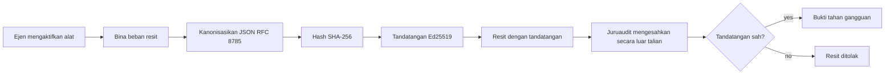
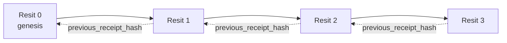

[Tonton video pelajaran: Memastikan Ejen AI dengan Resit Kriptografi](https://youtu.be/PLACEHOLDER_VIDEO_ID)

> _(Video pelajaran dan gambar kecil akan ditambah oleh pasukan kandungan Microsoft selepas penggabungan, mengikut corak pelajaran 14 / 15.)_

# Memastikan Ejen AI dengan Resit Kriptografi

## Pengenalan

Pelajaran ini akan merangkumi:

- Mengapa jejak audit untuk ejen AI penting untuk pematuhan, penyahpepijatan, dan kepercayaan.
- Apa itu resit kriptografi dan bagaimana ia berbeza daripada baris log tanpa tandatangan.
- Cara menghasilkan resit bertandatangan untuk panggilan alat ejen dalam Python biasa.
- Cara mengesahkan resit secara luar talian dan mengesan pengubahan.
- Cara mengaitkan resit supaya membuang atau menyusun semula satu akan memecahkan rantai.
- Apa yang dibuktikan resit dan apa yang secara jelas tidak dibuktikan oleh resit.

## Matlamat Pembelajaran

Selepas menamatkan pelajaran ini, anda akan tahu bagaimana untuk:

- Kenal pasti mod kegagalan yang memotivasikan ketulenan kriptografi untuk tindakan ejen.
- Menghasilkan resit yang ditandatangani Ed25519 ke atas muatan JSON kanonik.
- Mengesahkan resit secara bebas dengan hanya menggunakan kunci awam penandatangan.
- Mengesan pengubahan dengan menjalankan semula pengesahan pada resit yang diubah suai.
- Membina rentetan resit berantai hash dan menjelaskan mengapa rantai itu penting.
- Mengenali sempadan antara apa yang resit buktikan (atribusi, integriti, urutan) dan apa yang ia tidak buktikan (ketepatan tindakan, keteguhan polisi).

## Masalah: Jejak Audit Ejen Anda

Bayangkan anda telah menyebarkan ejen AI untuk Contoso Travel. Ejen tersebut membaca permintaan pelanggan, memanggil API penerbangan untuk mencari pilihan, dan menempah tempat duduk bagi pihak pelanggan. Suku tahun lepas, ejen tersebut memproses 50,000 tempahan.

Hari ini seorang juruaudit tiba. Mereka bertanya soalan mudah: "Tunjukkan apa yang ejen anda buat."

Anda menyerahkan fail log anda. Juruaudit melihatnya dan bertanya soalan yang lebih sukar: "Bagaimana saya tahu log-log ini tidak diedit?"

Ini adalah masalah jejak audit. Kebanyakan penyebaran ejen hari ini bergantung pada:

- **Log aplikasi**: ditulis oleh ejen itu sendiri, boleh diedit oleh sesiapa yang mempunyai akses sistem fail.
- **Perkhidmatan log awan**: sukar diubah pada peringkat platform tetapi hanya jika juruaudit mempercayai pengendali platform.
- **Log transaksi pangkalan data**: sesuai untuk perubahan pangkalan data tetapi bukan untuk panggilan alat sewenang-wenangnya.

Tiada satu pun daripada ini boleh menjawab soalan juruaudit tanpa memerlukan juruaudit mempercayai seseorang (anda, penyedia awan anda, vendor pangkalan data anda). Untuk kegunaan dalaman, kepercayaan itu biasanya boleh diterima. Untuk beban kerja yang dikawal selia (kewangan, penjagaan kesihatan, apa-apa yang tertakluk kepada Akta AI EU), ia tidak boleh diterima.

Resit kriptografi menyelesaikan ini dengan menjadikan setiap tindakan ejen boleh disahkan secara bebas. Juruaudit tidak perlu mempercayai anda. Mereka hanya memerlukan kunci awam anda dan resit itu sendiri.

## Apa itu Resit Kriptografi?

Resit adalah objek JSON yang merekod apa yang dilakukan oleh ejen, ditandatangani dengan tandatangan digital.


```mermaid
flowchart LR
    A[Ejen mengaktifkan alat] --> B[Bina beban resit]
    B --> C[Kanonisasikan JSON RFC 8785]
    C --> D[Hash SHA-256]
    D --> E[Tandatangan Ed25519]
    E --> F[Resit dengan tandatangan]
    F --> G[Juruaudit mengesahkan secara luar talian]
    G --> H{Tandatangan sah?}
    H -- yes --> I[Bukti tahan gangguan]
    H -- no --> J[Resit ditolak]
```

Resit minimum kelihatan seperti ini:

```json
{
  "type": "agent.tool_call.v1",
  "agent_id": "contoso-travel-bot",
  "tool_name": "lookup_flights",
  "tool_args_hash": "sha256:a3f9c1...",
  "result_hash": "sha256:7b2e1d...",
  "policy_id": "contoso-travel-policy-v3",
  "timestamp": "2026-04-25T14:30:00Z",
  "sequence": 47,
  "previous_receipt_hash": "sha256:9d4e6a...",
  "signature": {
    "alg": "EdDSA",
    "sig": "c5af83...",
    "public_key": "8f3b2c..."
  }
}
```

Tiga sifat melakukan kerja ini:

1. **Tandatangan**. Resit ditandatangani oleh pintu masuk ejen menggunakan kunci peribadi Ed25519. Sesiapa dengan kunci awam yang sepadan boleh mengesahkan tandatangan tersebut secara luar talian. Pengubahan pada mana-mana medan membatalkan tandatangan.

2. **Pengekodan kanonik**. Sebelum menandatangani, resit diserialkan menggunakan Skim Kanonikal JSON (JCS, RFC 8785). Ini memastikan dua pelaksanaan yang menghasilkan resit logik yang sama menghasilkan output yang sama byte. Tanpa kanonikal, penserial JSON yang berbeza akan menghasilkan tandatangan yang berbeza untuk kandungan yang sama.

3. **Rantaian hash**. Medan `previous_receipt_hash` mengaitkan setiap resit dengan yang sebelumnya. Mengeluarkan atau menyusun semula resit akan memecahkan setiap resit selepasnya. Pengubahan menjadi terlihat pada peringkat rantai walaupun tandatangan individu diabaikan.

Bersama-sama sifat ini memberikan tiga jaminan:

- **Atribusi**: kunci ini menandatangani kandungan ini.
- **Integriti**: kandungan tidak berubah sejak penandatanganan.
- **Urutan**: resit ini datang selepas resit itu dalam rantai.

## Menghasilkan Resit dalam Python

Anda tidak memerlukan perpustakaan khas untuk menghasilkan resit. Primitif kriptografi tersedia secara meluas dan logiknya beberapa puluh baris Python.

Latihan praktikal dalam `code_samples/18-signed-receipts.ipynb` menerangkan keseluruhan proses. Versi ringkas:

```python
import json
import hashlib
import base64
from nacl import signing
from jcs import canonicalize  # RFC 8785 JSON kanonik

def b64url_nopad(data: bytes) -> str:
    return base64.urlsafe_b64encode(data).decode("ascii").rstrip("=")

def sha256_canonical(obj) -> str:
    """SHA-256 of a Python object's JCS-canonical JSON form."""
    return f"sha256:{hashlib.sha256(canonicalize(obj)).hexdigest()}"

# Hasilkan atau muatkan kunci tandatangan (dalam pengeluaran, simpan dalam peti kunci)
signing_key = signing.SigningKey.generate()
verify_key = signing_key.verify_key

# Bina muatan resit (belum tandatangan)
tool_args = {"origin": "SYD", "destination": "LAX"}
tool_result = [{"flight": "QF11", "price": 1850, "stops": 0}]

payload = {
    "type": "agent.tool_call.v1",
    "agent_id": "contoso-travel-bot",
    "tool_name": "lookup_flights",
    "tool_args_hash": sha256_canonical(tool_args),
    "result_hash": sha256_canonical(tool_result),
    "policy_id": "contoso-travel-policy-v3",
    "timestamp": "2026-04-25T14:30:00Z",
    "sequence": 0,
    "previous_receipt_hash": None,
}

# Kanonikkan, hash, tandatangan.
canonical_bytes = canonicalize(payload)
message_hash = hashlib.sha256(canonical_bytes).digest()
signature_bytes = signing_key.sign(message_hash).signature

# Lampirkan objek tandatangan berstruktur.
receipt = {
    **payload,
    "signature": {
        "alg": "EdDSA",
        "sig": b64url_nopad(signature_bytes),
        "public_key": b64url_nopad(bytes(verify_key)),
    },
}
```

Itulah keseluruhan saluran penandatanganan. Latihan dalam buku nota menerangkan setiap langkah.

## Mengesahkan Resit dan Mengesan Pengubahan

Pengesahan adalah operasi songsang:

```python
import base64
import hashlib
from nacl import signing
from nacl.exceptions import BadSignatureError
from jcs import canonicalize

def b64url_decode(s: str) -> bytes:
    padding = "=" * ((4 - len(s) % 4) % 4)
    return base64.urlsafe_b64decode(s + padding)

def verify_receipt(receipt: dict) -> bool:
    # Tandatangan adalah objek berstruktur: {"alg", "sig", "public_key"}.
    sig_obj = receipt.get("signature")
    if not sig_obj or sig_obj.get("alg") != "EdDSA":
        return False

    # Bina semula muatan yang sebenarnya ditandatangani (semua kecuali tandatangan).
    payload = {k: v for k, v in receipt.items() if k != "signature"}

    canonical_bytes = canonicalize(payload)
    message_hash = hashlib.sha256(canonical_bytes).digest()

    try:
        verify_key = signing.VerifyKey(b64url_decode(sig_obj["public_key"]))
        verify_key.verify(message_hash, b64url_decode(sig_obj["sig"]))
        return True
    except BadSignatureError:
        return False
```

Fungsi ini mengambil resit dan mengembalikan `True` jika tandatangan sah, `False` jika tidak. Tiada panggilan rangkaian, tiada pergantungan perkhidmatan, tiada keperluan kepercayaan kepada pihak ketiga.

Untuk melihat pengesanan pengubahan berfungsi, buku nota menerangkan:

1. Menghasilkan resit yang sah dan mengesahkannya.
2. Mengubah satu bait dalam medan `tool_args_hash`.
3. Menjalankan semula pengesahan dan melihat ia gagal.

Ini adalah demonstrasi praktikal bahawa resit sukar diubah: apa-apa pengubahan, sekecil mana sekalipun, memecahkan tandatangan.

## Mengaitkan Resit untuk Ejen Berbilang Langkah

Satu resit bertandatangan melindungi satu tindakan. Rantai resit melindungi satu urutan.


```mermaid
flowchart LR
    R0[Resit 0<br/>genesis] --> R1[Resit 1]
    R1 --> R2[Resit 2]
    R2 --> R3[Resit 3]
    R1 -. previous_receipt_hash .-> R0
    R2 -. previous_receipt_hash .-> R1
    R3 -. previous_receipt_hash .-> R2
```

Setiap resit merekod hash resit sebelumnya. Untuk membuang resit 2 secara senyap, penyerang perlu sama ada:

- Mengubah medan `previous_receipt_hash` resit 3 (memecahkan tandatangan resit 3), ATAU
- Memalsukan tandatangan baru pada resit 3 yang diubah (memerlukan kunci peribadi ejen).

Jika kunci peribadi berada dalam peti besi kunci perkakasan dan anda menerbitkan kunci awam dengan setiap resit, kedua-dua serangan ini tidak dapat dilakukan tanpa dikesan.

Buku nota menerangkan:

1. Membina rantai tiga resit.
2. Mengesahkan setiap `previous_receipt_hash` resit sepadan dengan hash resit sebelumnya.
3. Mengubah satu resit di tengah dan melihat rantai itu putus tepat di titik itu.

Ini adalah cara anda menghasilkan jejak audit yang boleh disahkan oleh juruaudit luaran tanpa mempercayai anda.

## Apa yang Resit Buktikan (dan Apa yang Mereka Tidak Buktikan)

Ini adalah bahagian paling penting dalam pelajaran ini. Resit sangat berkuasa tetapi kuasanya ada hadnya.

**Resit membuktikan tiga perkara:**

1. **Atribusi**: kunci tertentu menandatangani muatan tertentu.
2. **Integriti**: muatan tidak berubah sejak penandatanganan.
3. **Urutan**: resit ini datang selepas resit itu dalam rantai hash.

**Resit TIDAK membuktikan:**

1. **Ketepatan**: bahawa tindakan ejen adalah tindakan yang betul. Resit boleh ditandatangani untuk jawapan yang salah sama bersih seperti untuk jawapan yang betul.
2. **Pematuhan polisi**: bahawa polisi yang dirujuk dalam `policy_id` sebenarnya telah dinilai, atau bahawa ia akan membenarkan tindakan ini jika diperiksa. Resit merekod apa yang didakwa, bukan apa yang dikuatkuasakan.
3. **Identiti selain kunci**: resit berkata "kunci ini menandatangani kandungan ini." Ia tidak berkata "manusia ini memberi kebenaran." Mengaitkan kunci kepada individu atau organisasi memerlukan infrastruktur identiti berasingan (direktori, daftar kunci awam, dsb).
4. **Kebenaran input**: jika ejen menerima arahan yang telah diubah suai dan bertindak ke atasnya, resit merekod tindakan tersebut dengan setia. Resit adalah selepas pengesahan input, bukan pengganti pengesahan tersebut.

Sempadan ini penting untuk dua sebab:

- Ia memberitahu anda apa yang resit berguna untuk: menjadikan tingkah laku ejen boleh diaudit dan sukar diubah, bahkan merentas sempadan organisasi.
- Ia memberitahu anda lapisan tambahan yang masih anda perlukan: pengesahan input (Pelajaran 6), penguatkuasaan polisi (sedikit disentuh di bawah), dan infrastruktur identiti (di luar skop pelajaran ini).

Kesilapan biasa adalah menganggap bahawa "kami mempunyai resit" bermaksud "kami diperintah." Ia tidak. Resit adalah asas. Pentadbiran adalah sistem yang anda bina di atasnya.

## Rujukan Pengeluaran

Kod Python dalam pelajaran ini sengaja minima supaya anda boleh membaca setiap baris dan memahami dengan tepat apa yang berlaku. Dalam pengeluaran, anda ada dua pilihan:

1. **Bina terus menggunakan primitif kriptografi.** 50 baris yang anda lihat di atas sudah memadai untuk banyak kes penggunaan. PyNaCl (Ed25519) dan pakej `jcs` (JSON kanonik) adalah perpustakaan yang diselenggara dengan baik dan diaudit.

2. **Gunakan perpustakaan resit pengeluaran.** Beberapa projek sumber terbuka melaksanakan corak yang sama dengan ciri tambahan (pusingan kunci, pengesahan kelompok, pengedaran JWK Set, integrasi dengan enjin polisi):
   - Format resit yang digunakan dalam pelajaran ini mengikuti Draf Internet IETF (`draft-farley-acta-signed-receipts`) yang sedang dalam proses piawaian.
   - Perkakas Tadbir Urus Ejen Microsoft menyusun resit dengan keputusan polisi berasaskan Cedar; lihat Tutorial 33 dalam repositori itu untuk contoh hujung-ke-hujung.
   - Pakej `protect-mcp` (npm) dan `@veritasacta/verify` (npm) menyediakan pelaksanaan Node untuk penandatanganan resit dan pengesahan luar talian, bertujuan untuk membungkus mana-mana pelayan MCP dengan jejak audit sukar diubah.
   - SDK Python **[nobulex](https://github.com/arian-gogani/nobulex)** (`pip install nobulex`) menyediakan corak penandatanganan Ed25519 + JCS yang sama dalam Python dengan integrasi LangChain dan CrewAI, termasuk vektor ujian silang yang diterbitkan dan pemetaan pematuhan yang disumbang melalui [OWASP PR #2210](https://github.com/OWASP/CheatSheetSeries/pull/2210).

Keputusan antara membina sendiri dan menggunakan perpustakaan mirip dengan keputusan antara menulis perpustakaan JWT anda sendiri dan menggunakan yang telah diuji: kedua-duanya munasabah; perpustakaan menjimatkan masa dan mengurangkan permukaan audit; pendekatan dari awal memaksa anda memahami setiap primitif. Pelajaran ini mengajar laluan dari awal supaya anda mempunyai asas untuk mana-mana pilihan.

## Semakan Pengetahuan

Uji pemahaman anda sebelum ke latihan amali.

**1. Resit ditandatangani dengan kunci peribadi Ed25519 ejen. Juruaudit hanya mempunyai kunci awam. Bolehkah juruaudit mengesahkan resit secara luar talian?**

<details>
<summary>Jawapan</summary>

Ya. Pengesahan Ed25519 hanya memerlukan kunci awam dan bait bertandatangan. Tiada panggilan rangkaian, tiada pergantungan perkhidmatan. Ini adalah sifat yang membuat resit berguna dalam persekitaran audit tanpa sambungan, pelbagai organisasi, atau kepercayaan rendah.
</details>

**2. Penyerang mengubah medan `policy_id` resit untuk mendakwa ia dikawal oleh polisi yang lebih longgar. Tandatangan adalah ke atas muatan asal. Apa yang berlaku semasa pengesahan?**

<details>
<summary>Jawapan</summary>

Pengesahan gagal. Tandatangan dikira ke atas bait kanonik muatan asal; mengubah mana-mana medan mengubah bait kanonik, yang mengubah hash SHA-256, yang menjadikan tandatangan tidak sah. Penyerang perlu kunci peribadi untuk menghasilkan tandatangan sah baru, yang mereka tidak ada.
</details>

**3. Mengapa resit memasukkan `tool_args_hash` dan `result_hash` dan bukannya argumen mentah dan hasilnya?**

<details>
<summary>Jawapan</summary>

Dua sebab. Pertama, resit mungkin perlu diarkibkan atau dihantar dalam persekitaran di mana kebocoran kandungan mentah (PII, data perniagaan) adalah masalah. Penghashan menjadikan resit kecil dan kandungan peribadi; juruaudit mengesahkan hash sepadan dengan salinan kandungan sebenar yang disimpan berasingan. Kedua, hash mempunyai saiz tetap; resit dengan hash terhad saiznya tidak kira saiz input dan output.
</details>

**4. Medan `previous_receipt_hash` mengaitkan setiap resit dengan pendahulunya. Jika penyerang secara senyap membuang satu resit dari tengah rantai, apa yang menjadi tidak sah?**

<details>
<summary>Jawapan</summary>

Setiap resit yang datang selepas resit yang dibuang. Medan `previous_receipt_hash` mereka tidak lagi sepadan dengan rantai sebenarnya (kerana resit yang dirujuk tidak wujud atau rantai kini menunjuk ke pendahulu yang berbeza). Untuk menyembunyikan penghapusan, penyerang perlu menandatangani semula setiap resit kemudian, yang memerlukan kunci peribadi.
</details>

**5. Resit disahkan dengan bersih. Adakah itu membuktikan tindakan ejen adalah betul, teguh, atau mematuhi polisi?**

<details>
<summary>Jawapan</summary>

Tidak. Resit yang sah membuktikan tiga perkara: atribusi (kunci ini menandatangani kandungan ini), integriti (kandungan tidak berubah), dan urutan (resit ini datang selepas resit itu). Ia TIDAK membuktikan tindakan itu betul, bahawa polisi bernama dalam `policy_id` sebenarnya dinilai, atau bahawa ejen mengikuti setiap peraturan. Resit menjadikan tingkah laku ejen boleh diaudit, bukan semestinya betul. Ini adalah sempadan paling penting dalam pelajaran.
</details>

## Latihan Amali

Buka `code_samples/18-signed-receipts.ipynb` dan lengkapkan keempat-empat bahagian:

1. **Bahagian 1**: Tandatangani resit pertama anda dan sahkan ia.
2. **Bahagian 2**: Ubah suai resit dan perhatikan pengesahan gagal.
3. **Bahagian 3**: Bina rantai tiga resit dan sahkan integriti rantai.
4. **Bahagian 4**: Gunakan corak pada ejen yang dibina dengan Rangka Kerja Ejen Microsoft: balut panggilan alat dalam penandatanganan resit, kemudian sahkan resit secara bebas.


**Cabaran lanjutan 1:** kembangkan skema resit dengan medan tambahan pilihan anda sendiri (contohnya, ID permintaan untuk penjejakan), kemas kini logik penandatanganan kanonik untuk memasukkannya, dan sahkan bahawa resit masih boleh melalui pengesahan. Kemudian ubah medan selepas penandatanganan dan pastikan pengesahan gagal. Ini memaksa anda memahami bagaimana setiap bait pengekodan kanonik menyumbang kepada tandatangan.

**Cabaran lanjutan 2:** Hash SHA-256 dua resit anda bersama-sama (gabungkan bait kanonik mereka dalam susunan deterministik) dan sematkan digest hasilnya sebagai medan baru pada resit ketiga sebelum menandatanganinya. Sahkan bahawa ketiga-tiga resit masih boleh melalui pengesahan. Anda baru sahaja membina bukti inklusi satu langkah: sesiapa yang memiliki resit ketiga boleh membuktikan dua resit pertama wujud pada masa ia ditandatangani, tanpa perlu mendedahkan kandungannya. Ini adalah corak yang digunakan oleh resit pendedahan terpilih secara besar-besaran (Komitmen Merkle, RFC 6962).

## Kesimpulan

Resit kriptografi memberikan agen AI jejak audit yang:

- **Boleh disahkan secara bebas**: mana-mana pihak dengan kunci awam boleh mengesahkan, tanpa pergantungan perkhidmatan.
- **Kebal daripada pengubahan**: sebarang pengubahsuaian membatalkan tandatangan.
- **Mudah alih**: resit ialah fail JSON kecil; ia boleh diarkib, dihantar, dan disahkan di mana-mana.
- **Selaras piawaian**: dibina atas Ed25519 (RFC 8032), JCS (RFC 8785), dan SHA-256, semua pratimat yang digunakan secara meluas.

Ia bukan pengganti untuk pengesahan input, penguatkuasaan dasar, atau infrastruktur identiti. Ia adalah asas untuk lapisan-lapisan tersebut. Apabila anda melaksanakan agen ke dalam beban kerja yang diatur, aliran kerja pelbagai organisasi, atau mana-mana persekitaran di mana juruaudit masa depan tidak boleh menganggap mempercayai anda, resit adalah cara anda memastikan jejak audit jujur.

Pengajaran paling penting: resit membuktikan siapa yang berkata apa, bila. Ia tidak membuktikan bahawa apa yang dikata itu benar atau betul. Pegang perbezaan itu erat. Ia adalah perbezaan antara sistem asal yang jujur dan yang mengelirukan.

## Senarai Semak Penghasilan

Apabila anda sudah bersedia untuk beralih daripada pelajaran ini kepada melaksanakan agen yang ditandatangani resit dalam persekitaran sebenar:

- [ ] **Pindahkan kunci penandatanganan dari komputer riba pembangun.** Gunakan Azure Key Vault, AWS KMS, atau modul keselamatan perkakasan. Kunci peribadi yang menandatangani resit anda tidak boleh pernah disimpan dalam kawalan sumber atau sebagai teks biasa pada mesin aplikasi.
- [ ] **Terbitkan kunci awam pengesahan.** Juruaudit memerlukannya untuk mengesahkan secara luar talian. Corak standard ialah Set JWK pada URL yang diketahui (RFC 7517), contohnya, `https://your-org.example.com/.well-known/agent-keys.json`.
- [ ] **Pautkan rantai secara luaran.** Secara berkala tulis hash kepala rantai terkini ke log ketelusan (Sigstore Rekor, RFC 3161 pihak berkuasa waktu cap, atau sistem dalaman kedua) supaya pihak luar boleh mengesahkan "rantai ini wujud pada masa ini."
- [ ] **Simpan resit secara tidak berubah.** Penyimpanan blob tambah sahaja (Azure Storage dengan polisi ketidakberubahan, AWS S3 Object Lock) menghalang dalaman dari menulis semula sejarah pada lapisan penyimpanan.
- [ ] **Tentukan pengekalan.** Banyak rejim pematuhan memerlukan pengekalan bertahun-tahun. Rancang untuk pertumbuhan resit (setiap resit kira-kira 500 bait; agen yang membuat 10K panggilan sehari menghasilkan kira-kira 1.8 GB setahun).
- [ ] **Dokumentasikan apa yang resit tidak liputi.** Resit membuktikan atribusi, integriti, dan susunan. Buku panduan anda harus secara eksplisit menyenaraikan kawalan tambahan apa (pengesahan input, penguatkuasaan dasar, pembatasan kadar, infrastruktur identiti) yang berdampingan dengan resit dalam postur tadbir urus anda.

### Ada Soalan Lagi tentang Memastikan Keselamatan Agen AI?

Sertai [Microsoft Foundry Discord](https://aka.ms/ai-agents/discord) untuk bertemu dengan pelajar lain, menghadiri waktu pejabat, dan dapatkan soalan Agen AI anda dijawab.

## Selepas Pelajaran Ini

Pelajaran ini merangkumi penandatanganan resit tunggal dan urutan rantai hash. Pratimat yang sama membina beberapa corak lebih maju yang mungkin anda temui apabila postur tadbir urus anda matang:

- **Pendedahan terpilih.** Apabila medan resit diikat secara bebas (pohon Merkle gaya RFC 6962), anda boleh mendedahkan medan tertentu kepada juruaudit tertentu dan membuktikan yang lain tidak berubah tanpa mendedahkan mereka. Berguna apabila resit yang sama perlu memenuhi audit menyeluruh (yang mahu kelengkapannya) dan peraturan peminimalan data seperti GDPR (yang mahu juruaudit melihat sesedikit mungkin).
- **Pembatalan resit.** Jika kunci penandatanganan dikompromi, anda perlu cara menandakan semua resit yang ditandatangani oleh kunci itu sebagai tidak dipercayai dari satu titik masa ke hadapan. Corak standard: kunci penandatanganan jangka pendek serta senarai pembatalan yang diterbitkan, atau log ketelusan dengan entri pembatalan.
- **Resit tanda tangan dua hala / berkongsi.** Beberapa pelaksanaan membahagi muatan yang ditandatangani kepada separuh pre-pelaksanaan (`authorization_*`) dan post-pelaksanaan (`result_*`) dengan tandatangan bebas, berguna apabila keputusan kebenaran dan hasil yang diperhatikan dihasilkan oleh pelaku berbeza atau pada masa berbeza. Ini menambah atas format resit yang diajar dalam pelajaran ini.
- **Komposisi muatan.** Resit menyegel apa sahaja bait yang anda letakkan di `result_hash`. Muatan dunia sebenar sering lebih kaya daripada satu hasil panggilan alat: penyelesaian pra-keputusan (ramalan model, pilihan dipertimbangkan, bukti dan kelengkapannya, sikap risiko, rantai akauntabiliti, hasil pintu pagar) boleh semuanya berada dalam muatan, disegel oleh satu resit tunggal. Ini memastikan format resit minimal sambil membenarkan skema muatan berkembang domain demi domain.
- **Pemenuhan rentas pelaksanaan.** Beberapa pelaksanaan bebas bagi format resit yang sama (Python, TypeScript, Rust, Go) mengesahkan silang terhadap vektor ujian bersama. Jika anda membina pelaksanaan anda sendiri, pengesahan terhadap vektor diterbitkan mengesahkan keserasian wayar.
- **Migrasi pasca-kuantum.** Ed25519 digunakan secara meluas hari ini tetapi tidak tahan kuantum. Format resit adalah algoritma-cekap: medan `signature.alg` boleh membawa `ML-DSA-65` (standard tandatangan pasca-kuantum NIST) apabila anda perlu bermigrasi. Rancang tempoh peralihan di mana resit ditandatangani berganda.

## Sumber Tambahan

- <a href="https://datatracker.ietf.org/doc/draft-farley-acta-signed-receipts/" target="_blank">IETF Internet-Draft: Resit Keputusan Bertandatangan untuk Kawalan Akses Mesin-ke-Mesin</a>
- <a href="https://learn.microsoft.com/azure/ai-studio/responsible-use-of-ai-overview" target="_blank">Gambaran Keseluruhan AI Bertanggungjawab (Azure AI)</a>
- <a href="https://datatracker.ietf.org/doc/html/rfc8032" target="_blank">RFC 8032: Algoritma Tandatangan Digital Lengkung-Edwards (EdDSA)</a>
- <a href="https://datatracker.ietf.org/doc/html/rfc8785" target="_blank">RFC 8785: Skema Kanonikalisasi JSON (JCS)</a>
- <a href="https://datatracker.ietf.org/doc/html/rfc6962" target="_blank">RFC 6962: Ketelusan Sijil</a> (Pembinaan pohon Merkle digunakan oleh resit pendedahan terpilih)
- <a href="https://github.com/microsoft/agent-governance-toolkit/blob/main/docs/tutorials/33-offline-verifiable-receipts.md" target="_blank">Perkakas Tadbir Urus Agen Microsoft, Tutorial 33: Resit Keputusan Boleh Disahkan Luar Talian</a>
- <a href="https://github.com/ScopeBlind/agent-governance-testvectors" target="_blank">Vektor ujian pemenuhan rentas pelaksanaan</a> untuk format resit yang digunakan dalam pelajaran ini (Apache-2.0)
- <a href="https://pynacl.readthedocs.io/" target="_blank">Dokumentasi PyNaCl</a> (Ed25519 dalam Python)

## Pelajaran Sebelumnya

[Membina Agen Penggunaan Komputer (CUA)](../15-browser-use/README.md)

---

<!-- CO-OP TRANSLATOR DISCLAIMER START -->
**Penafian**:
Dokumen ini telah diterjemahkan menggunakan perkhidmatan terjemahan AI [Co-op Translator](https://github.com/Azure/co-op-translator). Walaupun kami berusaha untuk ketepatan, sila ambil maklum bahawa terjemahan automatik mungkin mengandungi kesilapan atau ketidaktepatan. Dokumen asal dalam bahasa asalnya harus dianggap sebagai sumber yang sahih. Untuk maklumat penting, terjemahan oleh manusia profesional adalah disyorkan. Kami tidak bertanggungjawab terhadap sebarang salah faham atau salah tafsir yang timbul daripada penggunaan terjemahan ini.
<!-- CO-OP TRANSLATOR DISCLAIMER END -->