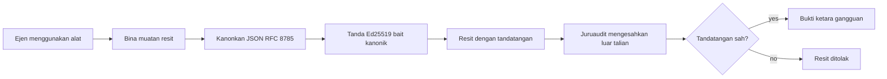
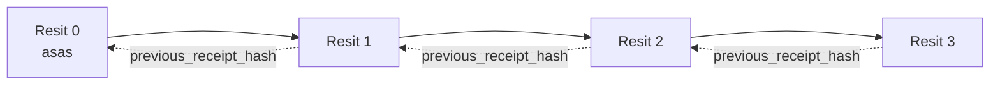

[Tonton video pelajaran: Memastikan Ejen AI dengan Resit Kriptografi](https://youtu.be/PLACEHOLDER_VIDEO_ID)

> _(Video pelajaran dan gambar kecil akan ditambah oleh pasukan kandungan Microsoft selepas gabungan, mengikut corak pelajaran 14 / 15.)_

# Memastikan Ejen AI dengan Resit Kriptografi

## Pengenalan

Pelajaran ini akan merangkumi:

- Mengapa jejak audit untuk ejen AI penting untuk pematuhan, penyahpepijatan, dan kepercayaan.
- Apa itu resit kriptografi dan bagaimana ia berbeza daripada baris log yang tidak ditandatangani.
- Bagaimana menghasilkan resit yang ditandatangani untuk panggilan alat ejen dalam Python biasa.
- Bagaimana mengesahkan resit di luar talian dan mengesan pengubahan.
- Bagaimana mengaitkan resit supaya memadam atau menyusun semula satu resit akan memutuskan rantai.
- Apa yang dibuktikan oleh resit dan apa yang secara eksplisit tidak dibuktikan.

## Matlamat Pembelajaran

Selepas melengkapkan pelajaran ini, anda akan tahu bagaimana untuk:

- Kenal pasti mod kegagalan yang memotivasi asal-usul kriptografi bagi tindakan ejen.
- Menghasilkan resit yang ditandatangani Ed25519 ke atas muatan JSON kanonik.
- Mengesahkan resit secara bebas menggunakan hanya kunci awam penandatangan.
- Mengesan pengubahan dengan menjalankan pengesahan semula pada resit yang diubah suai.
- Membina urutan resit berantai hash dan menerangkan mengapa rantai itu penting.
- Mengenal pasti sempadan antara apa yang dibuktikan oleh resit (atribut, integriti, susunan) dan apa yang tidak (ketepatan tindakan, ketegasan polisi).

## Masalah: Jejak Audit Ejen Anda

Bayangkan anda telah melancarkan ejen AI untuk Contoso Travel. Ejen itu membaca permintaan pelanggan, memanggil API penerbangan untuk mencari pilihan, dan menempah tempat duduk bagi pihak pelanggan. Suku tahun lepas, ejen itu memproses 50,000 tempahan.

Hari ini seorang juruaudit tiba. Mereka bertanya soalan mudah: "Tunjukkan apa yang ejen anda lakukan."

Anda menyerahkan fail log anda. Juruaudit melihatnya dan bertanya soalan yang lebih sukar: "Bagaimana saya tahu log ini tidak diedit?"

Inilah masalah jejak audit. Kebanyakan pelaksanaan ejen hari ini bergantung pada:

- **Log aplikasi**: ditulis oleh ejen itu sendiri, boleh diedit oleh sesiapa yang mempunyai akses sistem fail.
- **Perkhidmatan log awan**: jelas tidak boleh diubah di peringkat platform tetapi hanya jika juruaudit mempercayai pengendali platform.
- **Log transaksi pangkalan data**: sesuai untuk perubahan pangkalan data tetapi tidak untuk panggilan alat sewenang-wenangnya.

Tiada satu pun yang boleh menjawab soalan juruaudit tanpa memerlukan juruaudit mempercayai seseorang (anda, penyedia awan anda, vendor pangkalan data anda). Untuk kegunaan dalaman, kepercayaan itu sering boleh diterima. Untuk beban kerja yang dikawal selia (kewangan, penjagaan kesihatan, apa-apa yang tertakluk kepada Akta AI EU), ia tidak boleh diterima.

Resit kriptografi menyelesaikan ini dengan menjadikan setiap tindakan ejen dapat disahkan secara bebas. Juruaudit tidak perlu mempercayai anda. Mereka hanya memerlukan kunci awam anda dan resit itu sendiri.

## Apa itu Resit Kriptografi?

Resit adalah objek JSON yang merekodkan apa yang dilakukan oleh ejen, ditandatangani dengan tandatangan digital.


```mermaid
flowchart LR
    A[Ejen menggunakan alat] --> B[Bina muatan resit]
    B --> C[Kanonkan JSON RFC 8785]
    C --> E[Tanda Ed25519 bait kanonik]
    E --> F[Resit dengan tandatangan]
    F --> G[Juruaudit mengesahkan luar talian]
    G --> H{Tandatangan sah?}
    H -- yes --> I[Bukti ketara gangguan]
    H -- no --> J[Resit ditolak]
```

Resit minimum kelihatan seperti ini:

```json
{
  "type": "agent.tool_call.v1",
  "agent_id": "contoso-travel-bot",
  "tool_name": "lookup_flights",
  "tool_args_hash": "sha256:a3f9c1...",
  "result_hash": "sha256:7b2e1d...",
  "policy_id": "contoso-travel-policy-v3",
  "timestamp": "2026-04-25T14:30:00Z",
  "sequence": 47,
  "previous_receipt_hash": "sha256:9d4e6a...",
  "signature": {
    "alg": "EdDSA",
    "sig": "c5af83...",
    "public_key": "8f3b2c..."
  }
}
```

Tiga sifat melakukan kerja:

1. **Tandatangan**. Resit ditandatangani oleh pintu masuk ejen menggunakan kunci persendirian Ed25519. Sesiapa sahaja yang mempunyai kunci awam yang sepadan boleh mengesahkan tandatangan itu di luar talian. Pengubahan pada mana-mana medan akan mengesahkan tandatangan itu tidak sah.

2. **Pengekodan kanonik**. Sebelum menandatangani, resit diserialkan menggunakan Skema Kanonikasi JSON (JCS, RFC 8785). Ini memastikan bahawa dua pelaksanaan menghasilkan resit logik yang sama menghasilkan output yang sama secara bita. Tanpa kanonikasi, pelbagai serializer JSON menghasilkan tandatangan berbeza untuk kandungan yang sama.

3. **Rantaian hash**. Medan `previous_receipt_hash` mengaitkan setiap resit kepada resit sebelumnya. Memadam atau menyusun semula resit menyebabkan setiap resit selepasnya rosak. Pengubahan menjadi jelas pada peringkat rantai walaupun tandatangan individu dibypass.

Bersama-sama sifat ini menyediakan tiga jaminan:

- **Atribut**: kunci ini menandatangani kandungan ini.
- **Integriti**: kandungan tidak berubah sejak penandatanganan.
- **Susunan**: resit ini datang selepas resit lain dalam rantai.

## Menghasilkan Resit dalam Python

Anda tidak perlu perpustakaan khas untuk menghasilkan resit. Primitif kriptografi luas tersedia dan logiknya beberapa puluh baris Python.

Latihan praktikal dalam `code_samples/18-signed-receipts.ipynb` menerangkan aliran penuh. Versi ringkas:

```python
import json
import hashlib
import base64
from nacl import signing
from jcs import canonicalize  # JSON kanonik RFC 8785

def b64url_nopad(data: bytes) -> str:
    return base64.urlsafe_b64encode(data).decode("ascii").rstrip("=")

def sha256_canonical(obj) -> str:
    """SHA-256 of a Python object's JCS-canonical JSON form."""
    return f"sha256:{hashlib.sha256(canonicalize(obj)).hexdigest()}"

# Hasilkan atau muatkan kunci tandatangan (dalam produksi, simpan di peti kunci)
signing_key = signing.SigningKey.generate()
verify_key = signing_key.verify_key

# Bina muatan resit (belum ada tandatangan)
tool_args = {"origin": "SYD", "destination": "LAX"}
tool_result = [{"flight": "QF11", "price": 1850, "stops": 0}]

payload = {
    "type": "agent.tool_call.v1",
    "agent_id": "contoso-travel-bot",
    "tool_name": "lookup_flights",
    "tool_args_hash": sha256_canonical(tool_args),
    "result_hash": sha256_canonical(tool_result),
    "policy_id": "contoso-travel-policy-v3",
    "timestamp": "2026-04-25T14:30:00Z",
    "sequence": 0,
    "previous_receipt_hash": None,
}

# Kanonikan dan tandatangani bait JCS secara langsung. PureEdDSA menghash secara dalaman.
canonical_bytes = canonicalize(payload)
signature_bytes = signing_key.sign(canonical_bytes).signature

# Lampirkan objek tandatangan berstruktur.
receipt = {
    **payload,
    "signature": {
        "alg": "EdDSA",
        "sig": b64url_nopad(signature_bytes),
        "public_key": b64url_nopad(bytes(verify_key)),
    },
}
```

Itulah seluruh saluran penandatanganan. Latihan dalam buku nota menerangkan setiap langkah.

## Mengesahkan Resit dan Mengesan Pengubahan

Pengesahan adalah operasi songsang:

```python
import base64
import hashlib
from nacl import signing
from nacl.exceptions import BadSignatureError
from jcs import canonicalize

def b64url_decode(s: str) -> bytes:
    padding = "=" * ((4 - len(s) % 4) % 4)
    return base64.urlsafe_b64decode(s + padding)

def verify_receipt(receipt: dict) -> bool:
    # Tandatangan adalah objek berstruktur: {"alg", "sig", "public_key"}.
    sig_obj = receipt.get("signature")
    if not sig_obj or sig_obj.get("alg") != "EdDSA":
        return False

    # Bina semula muatan yang sebenarnya telah ditandatangani (semua kecuali tandatangan).
    payload = {k: v for k, v in receipt.items() if k != "signature"}

    canonical_bytes = canonicalize(payload)

    try:
        verify_key = signing.VerifyKey(b64url_decode(sig_obj["public_key"]))
        verify_key.verify(canonical_bytes, b64url_decode(sig_obj["sig"]))
        return True
    except BadSignatureError:
        return False
```

Fungsi ini menerima resit dan mengembalikan `True` jika tandatangan sah, `False` jika tidak. Tiada panggilan rangkaian, tiada kebergantungan perkhidmatan, tiada kepercayaan diperlukan pada pihak ketiga.

Untuk melihat pengesanan pengubahan berfungsi, buku nota menerangkan:

1. Menghasilkan resit sah dan mengesahkan ia sah.
2. Mengubah satu bait medan `tool_args_hash`.
3. Menjalankan semula pengesahan dan melihat gagal.

Ini adalah demonstrasi praktikal bahawa resit tidak boleh diubah suai: sebarang pengubahan, sekecil mana pun, memecahkan tandatangan.

## Mengaitkan Resit untuk Ejen Multi-Langkah

Satu resit yang ditandatangani melindungi satu tindakan. Rantai resit melindungi urutan tindakan.


```mermaid
flowchart LR
    R0[Resit 0<br/>asas] --> R1[Resit 1]
    R1 --> R2[Resit 2]
    R2 --> R3[Resit 3]
    R1 -. previous_receipt_hash .-> R0
    R2 -. previous_receipt_hash .-> R1
    R3 -. previous_receipt_hash .-> R2
```

Setiap resit merekod hash resit sebelumnya. Untuk membuang resit 2 tanpa kesan, penyerang perlu:

- Mengubah medan `previous_receipt_hash` resit 3 (memecahkan tandatangan resit 3), ATAU
- Memalsukan tandatangan baru pada resit 3 yang diubah suai (memerlukan kunci persendirian ejen).

Jika kunci persendirian di dalam peti besi kunci perkakasan dan anda menerbitkan kunci awam bersama setiap resit, kedua-dua serangan itu tidak mungkin tanpa dikesan.

Buku nota menerangkan:

1. Membina rantai tiga resit.
2. Mengesahkan bahawa `previous_receipt_hash` setiap resit sepadan dengan hash sebenar resit sebelum itu.
3. Mengubah suai satu resit di tengah dan melihat rantai rosak tepat pada titik itu.

Begitulah cara menghasilkan jejak audit yang juruaudit luaran boleh sahkan tanpa perlu mempercayai anda.

## Apa yang Dibuktikan oleh Resit (dan Apa yang Tidak)

Ini adalah bahagian paling penting dalam pelajaran ini. Resit sangat berkuasa tetapi kuasanya terhad.

**Resit membuktikan tiga perkara:**

1. **Atribut**: kunci tertentu menandatangani muatan tertentu.
2. **Integriti**: muatan tidak berubah sejak ditandatangani.
3. **Susunan**: resit ini datang selepas resit itu dalam rantai hash.

**Resit TIDAK membuktikan:**

1. **Ketepatan**: tindakan ejen adalah tindakan yang betul. Resit boleh ditandatangani walaupun untuk jawapan yang salah sama bersih seperti untuk jawapan yang betul.
2. **Pematuhan polisi**: polisi yang dirujuk dalam `policy_id` benar-benar dinilai, atau ia akan membenarkan tindakan ini jika diperiksa. Resit merekod apa yang diklaim, bukan apa yang dikuatkuasakan.
3. **Identiti selain kunci**: resit berkata "kunci ini menandatangani kandungan ini." Ia tidak berkata "manusia ini membenarkan ini." Mengaitkan kunci kepada seseorang memerlukan infrastruktur identiti berasingan (direktori, daftar kunci awam, dsb.).
4. **Kebenaran input**: jika ejen menerima arahan yang dimanipulasi dan bertindak atasnya, resit merekod tindakan itu dengan setia. Resit adalah selepas pengesahan input, bukan pengganti untuknya.

Sempadan ini penting atas dua sebab:

- Ia memberitahu anda apa kegunaan resit: menjadikan tingkah laku ejen dapat diaudit dan tidak boleh diubah suai, walaupun merentasi sempadan organisasi.
- Ia memberitahu anda lapisan tambahan yang anda perlukan: pengesahan input (Pelajaran 6), penguatkuasaan polisi (dibincangkan secara ringkas di bawah), dan infrastruktur identiti (di luar skop pelajaran ini).

Kesilapan biasa adalah menganggap bahawa "kami ada resit" bermaksud "kami diatur." Tidak begitu. Resit adalah asas. Tadbir urus adalah sistem yang anda bina di atasnya.

## Membuktikan Manusia Meluluskan Tindakan Tepat

Perkara 3 di atas layak mendapat bahagian sendiri: resit tindakan berkata "kunci ini menandatangani kandungan ini," bukan "manusia ini meluluskan ini." Untuk tindakan berisiko tinggi (bayaran balik, pemadaman, pemindahan wang), rangka kerja tadbir urus semakin memerlukan kenyataan hilang itu, dan ia boleh dihasilkan dengan primitif yang sama yang anda bina dalam pelajaran ini.

Buku nota sambungan `code_samples/human-authorization-receipts.ipynb` menambah jenis resit kedua, `human.approval.v1`, dalam bentuk sampul yang sama seperti resit pelajaran (muatan bertipe yang ditandatangani oleh Ed25519 ke atas bait JCS kanoniknya, dengan objek `signature` di luar bait yang ditandatangani). Sebuah pelulus bernama menandatangani **tindakan kanonik penuh dan digest-nya** sebelum pelaksanaan; resit tindakan ejen membawa **digest tindakan yang sama** dan `parent_approval_ref`, `receipt_hash` bagi kelulusan itu, konvensyen yang sama seperti `previous_receipt_hash` dalam rantai yang anda bina tadi. Satu `verify_chain` memeriksa kedua-dua artefak di bawah **daftar kunci terpin pin** yang berasingan (kunci pelulus vs kunci ejen), jadi laluan kod dikongsi tetapi pihak berkuasa tidak pernah berkongsi.

Sifat yang dibeli ini, dinyatakan dengan teliti: *manusia meluluskan tindakan tepat ini, dan ejen melaksanakan tepat tindakan yang diluluskan itu.* Ciri penolakan dalam buku nota menjadikan sifat ini nyata dan bukan sekadar dakwaan:

- set klasik: pengubahan, penipu kelirukan, ulang siar, kunci palsu di kedua belah pihak, input cacat;
- **kuasa lapuk**: tandatangan yang masih mengesahkan, ditolak juga kerana versi polisi bergerak, kunci pelulus diputar keluar dari daftar pin, atau kelulusan tamat tempoh sebelum pelaksanaan;
- **penggantian digest**: resit tindakan yang sah ditandatangani menunjuk kepada kelulusan *sebenar* yang mengikat tindakan kanonik *berbeza*.

Setiap kegagalan menolak dengan sebab yang berbeza, jadi juruaudit membaca penolakan boleh tahu sama ada kuasa menjadi lapuk atau perubahan tindakan dilaksanakan. Peraturan yang diajar buku nota: kelulusan bertandatangan bukan kuasa itu sendiri. Kuasa hanya wujud jika kedua-dua resit masih mengikat kepada tindakan kanonik yang sama pada masa pelaksanaan. Resit kelulusan manusia adalah komposisi pendidikan yang didefinisikan oleh pelajaran ini, bukan jenis resit yang didefinisikan oleh `draft-farley-acta-signed-receipts`.

## Rujukan Pengeluaran

Kod Python dalam pelajaran ini memang minimal supaya anda boleh baca setiap baris dan faham dengan tepat apa yang berlaku. Dalam pengeluaran, anda mempunyai dua pilihan:

1. **Bina terus menggunakan primitif kriptografi.** 50 baris yang anda lihat tadi mencukupi untuk banyak kes penggunaan. PyNaCl (Ed25519) dan pakej `jcs` (JSON kanonik) adalah perpustakaan yang dikekalkan dan diaudit dengan baik.

2. **Gunakan perpustakaan resit pengeluaran.** Beberapa projek sumber terbuka melaksanakan corak yang sama dengan ciri tambahan (putaran kunci, pengesahan kelompok, pengedaran Set JWK, integrasi dengan enjin polisi):
   - Saluran penandatanganan menggunakan konvensyen JCS dan lingkungan tandatangan dalam Draf Internet IETF bebas ([`draft-farley-acta-signed-receipts`](https://datatracker.ietf.org/doc/draft-farley-acta-signed-receipts/), semakan 02). Resit pendidikan pelajaran ini berbeza daripada sampul `{payload, signature}` draf dan tidak disajikan sebagai pelaksanaan yang mematuhi. Draf menerbitkan suite kepatuhan bersama ([agent-governance-testvectors](https://github.com/ScopeBlind/agent-governance-testvectors)) untuk pelaksanaan yang menyasarkan format kawatnya.
   - Microsoft Agent Governance Toolkit menggabungkan resit dengan keputusan polisi berasaskan Cedar; lihat Tutorial 33 dalam repositori itu untuk contoh menyeluruh.
   - Pakej `protect-mcp` (npm) dan `@veritasacta/verify` (npm) menyediakan pelaksanaan Node bagi menandatangani resit dan pengesahan luar talian, bertujuan untuk membungkus mana-mana pelayan MCP dengan jejak audit yang boleh dikesan dan tidak boleh diubah, termasuk aliran tahan untuk tandatangan bersama di mana tindakan yang dijeda mengeluarkan resit kelulusan yang terikat kepada digest tindakan (disokong WebAuthn dalam aliran desktop), corak resit kelulusan yang sama seperti buku nota kebenaran manusia di atas.
   - SDK Python **[nobulex](https://github.com/arian-gogani/nobulex)** (`pip install nobulex`) menyediakan corak penandatanganan Ed25519 + JCS yang sama dalam Python dengan integrasi LangChain dan CrewAI, termasuk vektor ujian persilangan yang diterbitkan dan peta pematuhan yang disumbangkan melalui [OWASP PR #2210](https://github.com/OWASP/CheatSheetSeries/pull/2210).

Keputusan antara membina sendiri dan menggunakan perpustakaan adalah sama seperti memutuskan antara menulis perpustakaan JWT anda sendiri dan menggunakan yang telah diuji: kedua-duanya munasabah; perpustakaan menjimatkan masa dan mengurangkan permukaan audit; pendekatan dari awal memaksa anda memahami setiap primitif. Pelajaran ini mengajar laluan dari awal supaya anda ada asas untuk kedua-dua pilihan.

## Ujian Pengetahuan

Uji pemahaman anda sebelum beralih ke latihan praktik.

**1. Resit ditandatangani dengan kunci persendirian Ed25519 ejen. Juruaudit hanya mempunyai kunci awam. Bolehkah juruaudit mengesahkan resit di luar talian?**

<details>
<summary>Jawapan</summary>

Ya. Pengesahan Ed25519 hanya memerlukan kunci awam dan bait yang ditandatangani. Tiada panggilan rangkaian, tiada kebergantungan perkhidmatan. Ini adalah sifat yang menjadikan resit berguna dalam tetapan audit terputus rangkaian, antara organisasi, atau rendah kepercayaan.
</details>

**2. Penyerang mengubah medan `policy_id` resit untuk mendakwa ia diatur oleh polisi yang lebih permisif. Tandatangan itu adalah ke atas muatan asal. Apa yang berlaku semasa pengesahan?**

<details>
<summary>Jawapan</summary>


Pengesahan gagal. Tandatangan dikira berdasarkan bait kanonik bagi payload asal; mengubah mana-mana medan mengubah bait tersebut, yang menyebabkan tandatangan menjadi tidak sah. Penyerang perlu mempunyai kunci peribadi untuk menghasilkan tandatangan sah yang baru, yang mana mereka tidak miliki.
</details>

**3. Mengapa resit termasuk `tool_args_hash` dan `result_hash` dan bukannya argumen mentah dan hasil?**

<details>
<summary>Jawapan</summary>

Dua sebab. Pertama, resit mungkin perlu diarkibkan atau dihantar dalam persekitaran di mana kebocoran kandungan mentah (PII, data perniagaan) menjadi masalah. Penghashan memastikan resit kecil dan kandungan kekal peribadi; juruaudit mengesahkan bahawa hash tersebut sepadan dengan salinan berasingan kandungan sebenar. Kedua, hash mempunyai saiz tetap; resit dengan hash adalah terhad saiznya tanpa mengira besar input dan output.
</details>

**4. Medan `previous_receipt_hash` menghubungkan setiap resit dengan resit sebelumnya. Jika penyerang secara senyap memadamkan sebuah resit dari tengah rantai, apakah yang menjadi tidak sah?**

<details>
<summary>Jawapan</summary>

Setiap resit yang datang selepas resit yang dipadam. Medan `previous_receipt_hash` mereka tidak lagi sepadan dengan rantai sebenar (kerana resit yang dirujuk sudah tidak wujud, atau rantai kini menunjuk ke pendahulu yang berbeza). Untuk menyembunyikan pemadaman, penyerang perlu menandatangani semula setiap resit kemudian, yang memerlukan kunci peribadi.
</details>

**5. Resit disahkan dengan bersih. Adakah itu membuktikan tindakan agen adalah betul, sah, atau mematuhi polisi?**

<details>
<summary>Jawapan</summary>

Tidak. Resit yang sah membuktikan tiga perkara: atribusi (kunci ini menandatangani kandungan ini), integriti (kandungan tidak berubah), dan susunan (resit ini datang selepas resit itu). Ia TIDAK membuktikan bahawa tindakan itu betul, bahawa polisi yang dinamakan dalam `policy_id` benar-benar dinilai, atau agen mengikuti setiap peraturan. Resit menjadikan tingkah laku agen boleh diaudit, bukan semestinya betul. Ini adalah sempadan paling penting dalam pelajaran ini.
</details>

## Latihan Amali

Buka `code_samples/18-signed-receipts.ipynb` dan lengkapkan semua empat bahagian:

1. **Bahagian 1**: Tandatangani resit pertama anda dan sahkan ia.
2. **Bahagian 2**: Manipulasikan resit dan perhatikan pengesahan gagal.
3. **Bahagian 3**: Bina rantai tiga resit dan sahkan integriti rantai.
4. **Bahagian 4**: Terapkan corak kepada agen yang dibina dengan Microsoft Agent Framework: balut panggilan alat dalam penandatanganan resit, kemudian sahkan resit secara bebas.

**Cabaran lanjutan 1:** kembangkan skema resit dengan medan tambahan pilihan anda sendiri (contohnya, ID permintaan untuk penjejakan), kemaskini logik penandatanganan kanonik untuk menyertakannya, dan sahkan resit masih boleh melalui proses pengesahan. Kemudian ubah medan tersebut selepas penandatanganan dan sahkan pengesahan gagal. Ini memaksa anda memahami bagaimana setiap bait kod kanonik menyumbang kepada tandatangan.

**Cabaran lanjutan 2:** SHA-256 hash dua resit anda bersama-sama (gabungkan bait kanoniknya dalam susunan deterministik) dan sematkan hasil digest sebagai medan baru pada resit ketiga sebelum menandatangannya. Sahkan ketiga-tiga resit masih boleh diproses. Anda baru sahaja membina bukti inklusi satu langkah: sesiapa yang memegang resit ketiga boleh membuktikan dua pertama wujud pada masa ia ditandatangani, tanpa perlu mendedahkan kandungannya. Ini adalah corak yang digunakan oleh resit dedahan selektif secara meluas (komitmen Merkle, RFC 6962).

## Kesimpulan

Resit kriptografi memberikan agen AI satu jejak audit yang:

- **Boleh disahkan secara bebas**: mana-mana pihak dengan kunci awam boleh mengesahkan, tanpa kebergantungan perkhidmatan.
- **Bukti manipulasi**: apa-apa pengubahsuaian membatalkan tandatangan.
- **Boleh dibawa ke mana-mana**: resit adalah fail JSON kecil; ia boleh diarkib, dihantar, dan disahkan di mana-mana.
- **Selaras piawaian**: dibina atas Ed25519 (RFC 8032), JCS (RFC 8785), dan SHA-256, kesemua primitif yang digunakan secara meluas.

Ia bukan pengganti bagi validasi input, penguatkuasaan polisi, atau infrastruktur identiti. Ia adalah asas untuk lapisan tersebut. Apabila anda menggunakan agen dalam beban kerja terkawal, aliran kerja pelbagai organisasi, atau mana-mana persekitaran di mana auditor masa depan tidak boleh dianggap mempercayai anda, resit adalah bagaimana anda menjadikan jejak audit jujur.

Pokok pangkal yang paling penting: resit membuktikan siapa yang berkata apa, bila. Ia tidak membuktikan bahawa apa yang dikatakan adalah benar atau betul. Pegang bezanya dengan ketat. Ia adalah perbezaan antara sistem asal-usul yang jujur dan yang mengelirukan.

## Senarai Semak Produksi

Apabila anda bersedia untuk melangkah dari pelajaran ini ke penerapan agen dengan tandatangan resit dalam persekitaran sebenar:

- [ ] **Pindahkan kunci penandatanganan dari komputer pembangun.** Gunakan Azure Key Vault, AWS KMS, atau modul keselamatan perkakasan. Kunci peribadi yang menandatangani resit anda tidak boleh disimpan dalam kawalan sumber atau dalam teks jelas pada mesin aplikasi.
- [ ] **Terbitkan kunci awam untuk pengesahan.** Juruaudit memerlukannya untuk pengesahan luar talian. Corak standard ialah Set JWK pada URL terkenal (RFC 7517), contohnya `https://your-org.example.com/.well-known/agent-keys.json`.
- [ ] **Cangkuk rantai secara luaran.** Secara berkala tulis hash kepala rantai terkini ke log ketelusan (Sigstore Rekor, kuasa masa RFC 3161, atau sistem dalaman kedua) supaya pihak luar boleh mengesahkan "rantai ini wujud pada masa ini."
- [ ] **Simpan resit secara kekal.** Simpanan blob hanya tambah (Azure Storage dengan polisi ketidakbolehubahan, AWS S3 Object Lock) menghalang orang dalaman dari menulis semula sejarah pada lapisan simpanan.
- [ ] **Tentukan penyimpanan.** Banyak rejim pematuhan memerlukan penyimpanan berbilang tahun. Rancang pertumbuhan resit (setiap resit ~500 bait; agen yang membuat 10K panggilan sehari menghasilkan ~1.8 GB setahun).
- [ ] **Dokumentasikan apa yang tidak diliputi oleh resit.** Resit membuktikan atribusi, integriti, dan susunan. Buku panduan anda perlu menyenaraikan secara jelas kawalan tambahan (validasi input, penguatkuasaan polisi, had kadar, infrastruktur identiti) yang berada bersama resit dalam sikap tadbir urus anda.

### Ada Soalan Lagi tentang Mengamankan Agen AI?

Sertai [Microsoft Foundry Discord](https://aka.ms/ai-agents/discord) untuk bertemu dengan pelajar lain, menghadiri waktu pejabat, dan dapatkan soalan Agen AI anda dijawab.

## Selepas Pelajaran Ini

Pelajaran ini meliputi penandatanganan satu resit dan rangkaian hash berantai. Primitif yang sama membentuk beberapa corak lebih maju yang mungkin anda temui apabila sikap tadbir urus anda matang:

- **Dedahan selektif.** Apabila medan resit dikomitkan secara bebas (pokok Merkle gaya RFC 6962), anda boleh mendedahkan medan tertentu kepada juruaudit tertentu dan membuktikan selebihnya tidak berubah tanpa mendedahkannya. Berguna apabila resit yang sama perlu memenuhi audit menyeluruh (yang mahukan kelengkapan) dan peraturan pengurangan data seperti GDPR (yang mahukan juruaudit melihat sesedikit mungkin).
- **Pembatalan resit.** Jika kunci penandatanganan terjejas, anda perlu cara untuk menandakan semua resit yang ditandatangani dengan kunci itu sebagai tidak dipercayai dari satu masa ke hadapan. Corak standard: kunci penandatanganan berumur pendek ditambah senarai pembatalan diterbitkan, atau log ketelusan dengan entri pembatalan.
- **Resit tandatangan dwihala / pecah.** Beberapa pelaksanaan memecah payload yang ditandatangani kepada dua bahagian pra-pelaksanaan (`authorization_*`) dan pasca-pelaksanaan (`result_*`) dengan tandatangan bebas, berguna apabila keputusan kebenaran dan hasil yang diperhatikan dihasilkan oleh pelaku berbeza atau pada masa berbeza. Ini membentuk tambahan di atas format resit yang diajar dalam pelajaran ini.
- **Komposisi payload.** Resit menutup bait apapun yang anda letakkan di `result_hash`. Payload dunia sebenar sering lebih kaya daripada hasil panggilan alat tunggal: pertimbangan pra-keputusan (ramalan model, pilihan dipertimbangkan, bukti dan kelengkapannya, sikap risiko, rantai akauntabiliti, keputusan pintu gerbang) boleh kesemuanya dimasukkan dalam payload, ditutup oleh satu resit. Ini mengekalkan format resit minimal sambil membenarkan skema payload berkembang domain demi domain.
- **Keserasian pelaksanaan pelbagai.** Pelbagai pelaksanaan bebas bagi format resit yang sama (Python, TypeScript, Rust, Go) saling mengesahkan dengan vektor ujian berkongsi. Jika anda membina pelaksanaan anda sendiri, pengesahan terhadap vektor yang diterbitkan mengesahkan keserasian wayar.
- **Migrasi pasca-kuantum.** Ed25519 digunakan secara meluas hari ini tetapi tidak tahan kuantum. Format resit bersifat algoritma-agile: medan `signature.alg` boleh membawa `ML-DSA-65` (standard tandatangan pasca-kuantum NIST) apabila anda perlu migrasi. Rancang tempoh peralihan di mana resit ditandatangani dwi.

## Sumber Tambahan

- <a href="https://datatracker.ietf.org/doc/draft-farley-acta-signed-receipts/" target="_blank">IETF Internet-Draft: Resit Keputusan Bertandatangan untuk Kawalan Akses Mesin-ke-Mesin</a>
- <a href="https://learn.microsoft.com/azure/ai-studio/responsible-use-of-ai-overview" target="_blank">Gambaran Keseluruhan AI Bertanggungjawab (Azure AI)</a>
- <a href="https://datatracker.ietf.org/doc/html/rfc8032" target="_blank">RFC 8032: Algoritma Tandatangan Digital Kurva Edwards (EdDSA)</a>
- <a href="https://datatracker.ietf.org/doc/html/rfc8785" target="_blank">RFC 8785: Skema Kanonik JSON (JCS)</a>
- <a href="https://datatracker.ietf.org/doc/html/rfc6962" target="_blank">RFC 6962: Ketelusan Sijil</a> (Pembinaan pokok Merkle digunakan oleh resit dedahan selektif)
- <a href="https://github.com/microsoft/agent-governance-toolkit/blob/main/docs/tutorials/33-offline-verifiable-receipts.md" target="_blank">Toolkit Tadbir Urus Agen Microsoft, Tutorial 33: Resit Keputusan Boleh Disahkan Luar Talian</a>
- <a href="https://github.com/ScopeBlind/agent-governance-testvectors" target="_blank">Vektor ujian keserasian pelaksanaan silang</a> untuk format resit yang digunakan dalam pelajaran ini (Apache-2.0)
- <a href="https://pynacl.readthedocs.io/" target="_blank">Dokumentasi PyNaCl</a> (Ed25519 dalam Python)

## Pelajaran Sebelumnya

[Mewujudkan Agen AI Tempatan](../17-creating-local-ai-agents/README.md)

---

<!-- CO-OP TRANSLATOR DISCLAIMER START -->
**Penafian**:
Dokumen ini telah diterjemahkan menggunakan perkhidmatan terjemahan AI [Co-op Translator](https://github.com/Azure/co-op-translator). Walaupun kami berusaha untuk ketepatan, sila ambil maklum bahawa terjemahan automatik mungkin mengandungi kesilapan atau ketidaktepatan. Dokumen asal dalam bahasa asalnya harus dianggap sebagai sumber yang sahih. Untuk maklumat penting, terjemahan oleh manusia profesional adalah disyorkan. Kami tidak bertanggungjawab terhadap sebarang salah faham atau salah tafsir yang timbul daripada penggunaan terjemahan ini.
<!-- CO-OP TRANSLATOR DISCLAIMER END -->