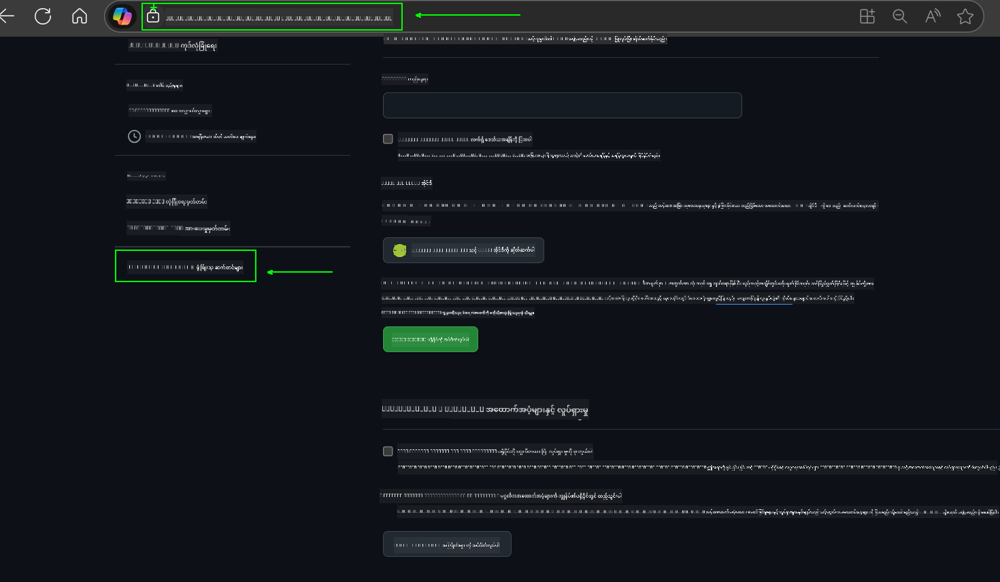
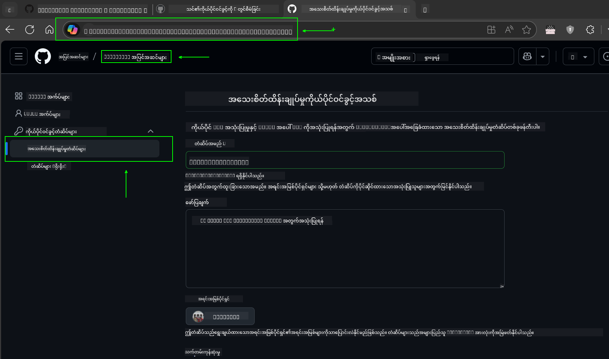
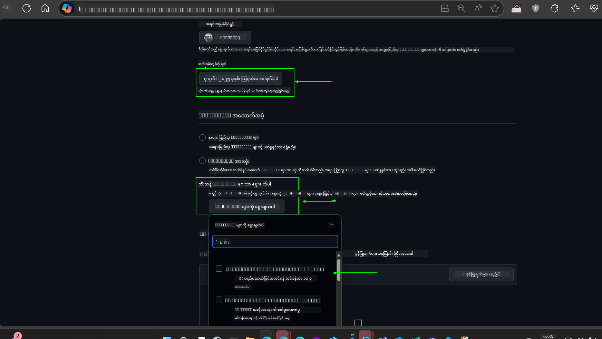
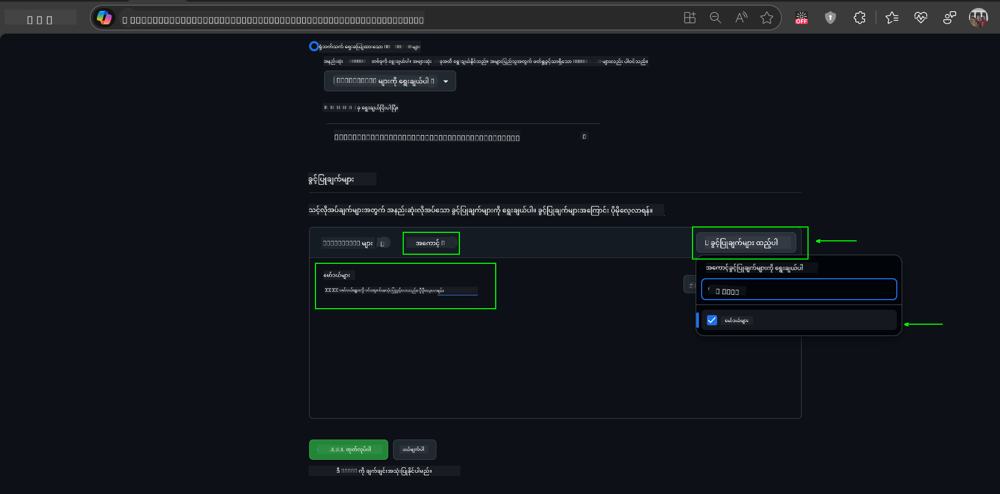
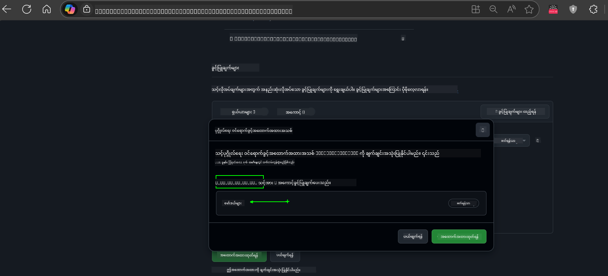
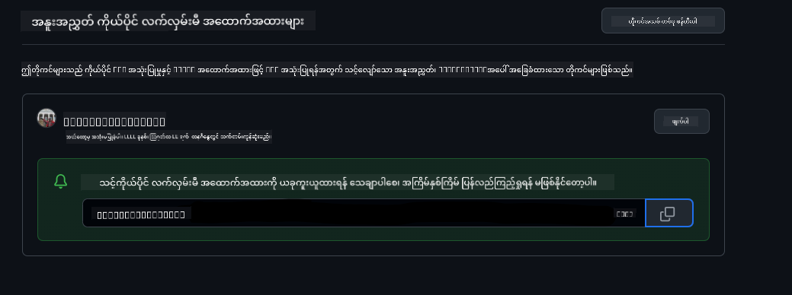
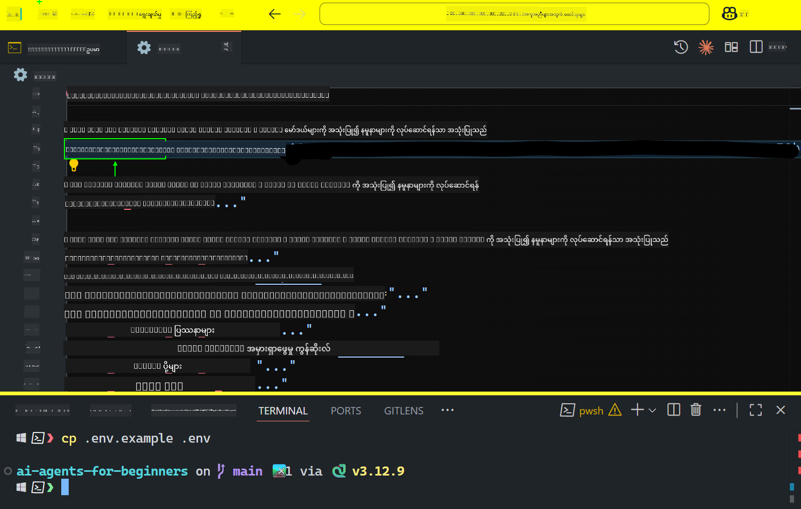

<!--
CO_OP_TRANSLATOR_METADATA:
{
  "original_hash": "c55b973b1562abf5aadf6a4028265ac5",
  "translation_date": "2025-08-30T09:35:31+00:00",
  "source_file": "00-course-setup/README.md",
  "language_code": "my"
}
-->
# သင်တန်း စတင်ခြင်း

## နိဒါန်း

ဒီသင်ခန်းစာမှာ သင်တန်းရဲ့ ကုဒ်နမူနာတွေကို ဘယ်လိုလုပ်ဆောင်ရမယ်ဆိုတာကို ဖော်ပြပေးမှာပါ။

## အခြား သင်ယူသူတွေနဲ့ ပူးပေါင်းပြီး အကူအညီရယူပါ

သင့်ရဲ့ repo ကို clone လုပ်ဖို့မစတင်မီ [AI Agents For Beginners Discord channel](https://aka.ms/ai-agents/discord) ကို join လုပ်ပါ။ ဒီမှာ သင်တန်းဆိုင်ရာ အကူအညီရယူနိုင်သလို၊ သင်တန်းအကြောင်းမေးမြန်းနိုင်ပြီး အခြား သင်ယူသူတွေနဲ့ ဆက်သွယ်နိုင်ပါတယ်။

## ဒီ Repo ကို Clone သို့မဟုတ် Fork လုပ်ပါ

စတင်ရန်အတွက် GitHub Repository ကို clone သို့မဟုတ် fork လုပ်ပါ။ ဒါက သင့်ကိုယ်ပိုင် သင်တန်းအကြောင်းအရာကို ရရှိစေပြီး ကုဒ်တွေကို လုပ်ဆောင်၊ စမ်းသပ်၊ ပြင်ဆင်နိုင်စေမှာပါ။

ဒါကို လင့်ခ်ကို နှိပ်ပြီး လုပ်ဆောင်နိုင်ပါတယ်။


## ကုဒ်ကို လုပ်ဆောင်ခြင်း

ဒီသင်တန်းမှာ AI Agents တည်ဆောက်ဖို့ လက်တွေ့အတွေ့အကြုံရရှိစေမယ့် Jupyter Notebooks များ ပါဝင်ပါတယ်။

ကုဒ်နမူနာတွေမှာ အောက်ပါအတိုင်း အသုံးပြုထားပါတယ် -

**GitHub အကောင့်လိုအပ်သည် - အခမဲ့**:

1) Semantic Kernel Agent Framework + GitHub Models Marketplace (semantic-kernel.ipynb) အဖြစ် သတ်မှတ်ထားသည်။
2) AutoGen Framework + GitHub Models Marketplace (autogen.ipynb) အဖြစ် သတ်မှတ်ထားသည်။

**Azure Subscription လိုအပ်သည်**:
3) Azure AI Foundry + Azure AI Agent Service (azureaiagent.ipynb) အဖြစ် သတ်မှတ်ထားသည်။

သုံးစွဲသူအနေဖြင့် သုံးမျိုးလုံးကို စမ်းသပ်ကြည့်ရန် အကြံပြုပါသည်။ သင့်အတွက် အကောင်းဆုံးဖြစ်မယ့် နမူနာကို ရွေးချယ်နိုင်ပါသည်။

သင်ရွေးချယ်မည့် နည်းလမ်းအပေါ်မူတည်ပြီး အောက်ပါ setup လုပ်ငန်းစဉ်များကို လိုက်နာရပါမည်။

## လိုအပ်ချက်များ

- Python 3.12+
  - **မှတ်ချက်**: Python3.12 မရှိပါက သင့်စက်တွင် Python3.12 ကို ထည့်သွင်းပါ။ ထို့နောက် requirements.txt ဖိုင်မှ သင့် version များကို သေချာစေရန် python3.12 ကို အသုံးပြု၍ venv တစ်ခု ဖန်တီးပါ။
- GitHub အကောင့် - GitHub Models Marketplace ကို အသုံးပြုရန်
- Azure Subscription - Azure AI Foundry ကို အသုံးပြုရန်
- Azure AI Foundry အကောင့် - Azure AI Agent Service ကို အသုံးပြုရန်

ဒီ repository ရဲ့ root မှာ `requirements.txt` ဖိုင်ကို ထည့်သွင်းထားပြီး ကုဒ်နမူနာများကို လုပ်ဆောင်ရန် လိုအပ်သော Python packages များ ပါဝင်သည်။

ဤဖိုင်ကို terminal မှာ အောက်ပါ command ဖြင့် ထည့်သွင်းနိုင်သည် -

```bash
pip install -r requirements.txt
```

Python virtual environment တစ်ခု ဖန်တီးခြင်းအား အကြံပြုပါသည်။ ဒါက conflicts များနှင့် ပြဿနာများကို ရှောင်ရှားနိုင်စေပါသည်။

## VSCode ကို စနစ်တကျ ပြင်ဆင်ပါ
VSCode မှာ သင့် Python version မှန်ကန်မှုကို သေချာစေပါ။


## GitHub Models ကို အသုံးပြုရန် Setup လုပ်ခြင်း

### အဆင့် ၁: GitHub Personal Access Token (PAT) ကို ရယူပါ

ဒီသင်တန်းမှာ GitHub Models Marketplace ကို အသုံးပြုထားပြီး သင် AI Agents တည်ဆောက်ဖို့ အသုံးပြုမည့် Large Language Models (LLMs) များကို အခမဲ့ရယူနိုင်ပါသည်။

GitHub Models ကို အသုံးပြုရန် [GitHub Personal Access Token](https://docs.github.com/en/authentication/keeping-your-account-and-data-secure/managing-your-personal-access-tokens) တစ်ခု ဖန်တီးရန် လိုအပ်ပါသည်။

ဒါကို သင့် GitHub အကောင့်မှလုပ်ဆောင်နိုင်ပါသည်။

[Principle of Least Privilege](https://docs.github.com/en/get-started/learning-to-code/storing-your-secrets-safely) ကို လိုက်နာပါ။ Token ကို သင့်သင်တန်းကုဒ်နမူနာများကို လုပ်ဆောင်ရန် လိုအပ်သော ခွင့်ပြုချက်များသာ ပေးပါ။

1. **Developer settings** မှာ `Fine-grained tokens` ကို ရွေးပါ။
   

    ထို့နောက် `Generate new token` ကို ရွေးပါ။

    

2. Token ရဲ့ ရည်ရွယ်ချက်ကို ဖော်ပြနိုင်မယ့် အမည်တစ်ခု ထည့်သွင်းပါ။

    🔐 Token သက်တမ်း အကြံပြုချက်

    အကြံပြုသက်တမ်း: ၃၀ ရက်
    ပိုမိုလုံခြုံမှုအတွက် ၇ ရက်လိုမျိုး ပိုတိုသော သက်တမ်းကို ရွေးချယ်နိုင်ပါတယ် 🛡️
    သင့်သင်တန်းကို အချိန်မီပြီးမြောက်စေဖို့ အကောင်းဆုံးနည်းလမ်းတစ်ခုပါ 🚀။

    

3. Token ရဲ့ scope ကို သင့် fork repository အတွက်သာ ကန့်သတ်ပါ။

    

4. Token ရဲ့ ခွင့်ပြုချက်များကို ကန့်သတ်ပါ။ **Permissions** အောက်မှ **Account** tab ကို နှိပ်ပြီး "+ Add permissions" ကို နှိပ်ပါ။ Dropdown တစ်ခု ပေါ်လာပါမည်။ **Models** ကို ရှာပြီး အမှန်ခြစ်ပေးပါ။
    

5. Token ကို ဖန်တီးမည့်အချိန်တွင် လိုအပ်သော ခွင့်ပြုချက်များကို စစ်ဆေးပါ။ 

6. Token ကို ဖန်တီးမည့်အချိန်တွင် သင့် token ကို password manager vault တစ်ခုလိုမျိုး လုံခြုံသောနေရာတွင် သိမ်းဆည်းရန် သေချာပါ။ Token ကို ဖန်တီးပြီးနောက် ပြန်လည်ကြည့်ရှုရန် မရနိုင်တော့ပါ။ 

သင်ဖန်တီးထားသော token ကို ကူးယူပါ။ ဒီသင်တန်းတွင် ပါဝင်သော `.env` ဖိုင်တွင် ထည့်သွင်းပါ။

### အဆင့် ၂: `.env` ဖိုင်ကို ဖန်တီးပါ

`.env` ဖိုင်ကို ဖန်တီးရန် terminal မှာ အောက်ပါ command ကို ရိုက်ထည့်ပါ။

```bash
cp .env.example .env
```

ဒီ command က example ဖိုင်ကို ကူးယူပြီး `.env` ဖိုင်ကို သင့် directory တွင် ဖန်တီးပေးပါမည်။ ထို့နောက် environment variables များအတွက် တန်ဖိုးများကို ဖြည့်သွင်းပါ။

သင့် token ကို `.env` ဖိုင်တွင် `GITHUB_TOKEN` field တွင် ထည့်သွင်းပါ။


ဒီအချိန်မှာ သင့်သင်တန်းရဲ့ ကုဒ်နမူနာများကို လုပ်ဆောင်နိုင်ပါပြီ။

## Azure AI Foundry နှင့် Azure AI Agent Service ကို အသုံးပြုရန် Setup လုပ်ခြင်း

### အဆင့် ၁: Azure Project Endpoint ကို ရယူပါ

Azure AI Foundry တွင် hub နှင့် project တစ်ခု ဖန်တီးရန် လိုအပ်သော လမ်းညွှန်ချက်များကို [Hub resources overview](https://learn.microsoft.com/en-us/azure/ai-foundry/concepts/ai-resources) တွင် ကြည့်ရှုပါ။

Project တစ်ခု ဖန်တီးပြီးနောက် သင့် project အတွက် connection string ကို ရယူရန် လိုအပ်ပါသည်။

ဒါကို Azure AI Foundry portal တွင် သင့် project ရဲ့ **Overview** စာမျက်နှာမှ ရယူနိုင်ပါသည်။


### အဆင့် ၂: `.env` ဖိုင်ကို ဖန်တီးပါ

`.env` ဖိုင်ကို ဖန်တီးရန် terminal မှာ အောက်ပါ command ကို ရိုက်ထည့်ပါ။

```bash
cp .env.example .env
```

ဒီ command က example ဖိုင်ကို ကူးယူပြီး `.env` ဖိုင်ကို သင့် directory တွင် ဖန်တီးပေးပါမည်။ ထို့နောက် environment variables များအတွက် တန်ဖိုးများကို ဖြည့်သွင်းပါ။

သင့် token ကို `.env` ဖိုင်တွင် `PROJECT_ENDPOINT` field တွင် ထည့်သွင်းပါ။

### အဆင့် ၃: Azure တွင် လော့ဂ်အင် ဝင်ပါ

လုံခြုံရေးအတွက် [keyless authentication](https://learn.microsoft.com/azure/developer/ai/keyless-connections?tabs=csharp%2Cazure-cli?WT.mc_id=academic-105485-koreyst) ကို အသုံးပြုပါ။

Terminal ကို ဖွင့်ပြီး `az login --use-device-code` command ကို အသုံးပြု၍ Azure အကောင့်တွင် လော့ဂ်အင် ဝင်ပါ။

လော့ဂ်အင်ပြီးနောက် terminal တွင် သင့် subscription ကို ရွေးချယ်ပါ။

## အပိုဆောင်း Environment Variables - Azure Search နှင့် Azure OpenAI

Agentic RAG သင်ခန်းစာ - Lesson 5 - တွင် Azure Search နှင့် Azure OpenAI ကို အသုံးပြုထားသော နမူနာများ ပါဝင်သည်။

ဒီနမူနာများကို လုပ်ဆောင်လိုပါက `.env` ဖိုင်တွင် အောက်ပါ environment variables များကို ထည့်သွင်းရန် လိုအပ်ပါသည် -

### Overview Page (Project)

- `AZURE_SUBSCRIPTION_ID` - **Overview** စာမျက်နှာမှ **Project details** ကို စစ်ဆေးပါ။
- `AZURE_AI_PROJECT_NAME` - **Overview** စာမျက်နှာ၏ ထိပ်ဆုံးတွင် ရှာပါ။
- `AZURE_OPENAI_SERVICE` - **Overview** စာမျက်နှာမှ **Included capabilities** tab တွင် ရှာပါ။

### Management Center

- `AZURE_OPENAI_RESOURCE_GROUP` - **Management Center** ၏ **Overview** စာမျက်နှာမှ **Project properties** တွင် ရှာပါ။
- `GLOBAL_LLM_SERVICE` - **Connected resources** အောက်တွင် ရှာပါ။

### Models + Endpoints Page

- `AZURE_OPENAI_EMBEDDING_DEPLOYMENT_NAME` - သင့် embedding model ကို ရွေးချယ်ပြီး model details မှ **Deployment name** ကို မှတ်သားပါ။
- `AZURE_OPENAI_CHAT_DEPLOYMENT_NAME` - သင့် chat model ကို ရွေးချယ်ပြီး model details မှ **Deployment name** ကို မှတ်သားပါ။

### Azure Portal

- `AZURE_OPENAI_ENDPOINT` - Azure portal တွင် သင့် resource group အောက်မှ AI Services resource name ကို ရှာပါ။
- `AZURE_OPENAI_API_KEY` - Keys and Endpoint စာမျက်နှာမှ KEY 1 သို့မဟုတ် KEY 2 ကို ကူးယူပါ။
- `AZURE_SEARCH_SERVICE_ENDPOINT` - Azure AI Search resource ၏ **Overview** စာမျက်နှာမှ ရှာပါ။
- `AZURE_SEARCH_API_KEY` - **Settings** > **Keys** မှ primary သို့မဟုတ် secondary admin key ကို ကူးယူပါ။

### External Webpage

- `AZURE_OPENAI_API_VERSION` - [API version lifecycle](https://learn.microsoft.com/en-us/azure/ai-services/openai/api-version-deprecation#latest-ga-api-release) စာမျက်နှာမှ **Latest GA API release** ကို ကြည့်ရှုပါ။

### Keyless Authentication ကို ပြင်ဆင်ပါ

သင့် credentials များကို hardcode မလုပ်ဘဲ Azure OpenAI နှင့် keyless connection ကို အသုံးပြုပါ။ `DefaultAzureCredential` ကို import ပြုလုပ်ပြီး `DefaultAzureCredential` function ကို later call ပြုလုပ်ပါ။

```python
from azure.identity import DefaultAzureCredential, InteractiveBrowserCredential
```

## ပြဿနာတစ်ခုခု ရှိပါသလား?

ဒီ setup ကို လုပ်ဆောင်ရာတွင် ပြဿနာတစ်ခုခု ရှိပါက, ကျွန်တော်တို့ရဲ့ Discord channel တွင် ဝင်ရောက်ပြီး အကူအညီရယူနိုင်ပါတယ်။

## နောက်သင်ခန်းစာ

သင့်သင်တန်းရဲ့ ကုဒ်နမူနာများကို လုပ်ဆောင်ရန် အဆင်သင့်ဖြစ်ပါပြီ။ AI Agents အကြောင်းပိုမိုလေ့လာရင်း ပျော်ရွှင်ပါစေ!

[AI Agents နှင့် Agent အသုံးပြုမှုများကို နိဒါန်း](../01-intro-to-ai-agents/README.md)

---

**အကြောင်းကြားချက်**:  
ဤစာရွက်စာတမ်းကို AI ဘာသာပြန်ဝန်ဆောင်မှု [Co-op Translator](https://github.com/Azure/co-op-translator) ကို အသုံးပြု၍ ဘာသာပြန်ထားပါသည်။ ကျွန်ုပ်တို့သည် တိကျမှုအတွက် ကြိုးစားနေသော်လည်း၊ အလိုအလျောက် ဘာသာပြန်မှုများတွင် အမှားများ သို့မဟုတ် မတိကျမှုများ ပါဝင်နိုင်သည်ကို သတိပြုပါ။ မူရင်းစာရွက်စာတမ်းကို ၎င်း၏ မူရင်းဘာသာစကားဖြင့် အာဏာတရားရှိသော အရင်းအမြစ်အဖြစ် ရှုလေ့လာသင့်ပါသည်။ အရေးကြီးသော အချက်အလက်များအတွက် လူက ဘာသာပြန်မှု ဝန်ဆောင်မှုကို အသုံးပြုရန် အကြံပြုပါသည်။ ဤဘာသာပြန်မှုကို အသုံးပြုခြင်းမှ ဖြစ်ပေါ်လာသော အလွဲအလွဲအချော်များ သို့မဟုတ် အနားလွဲမှုများအတွက် ကျွန်ုပ်တို့သည် တာဝန်မယူပါ။