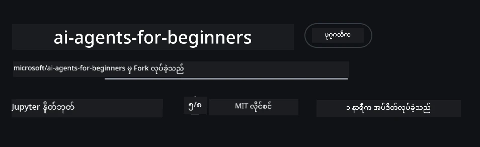
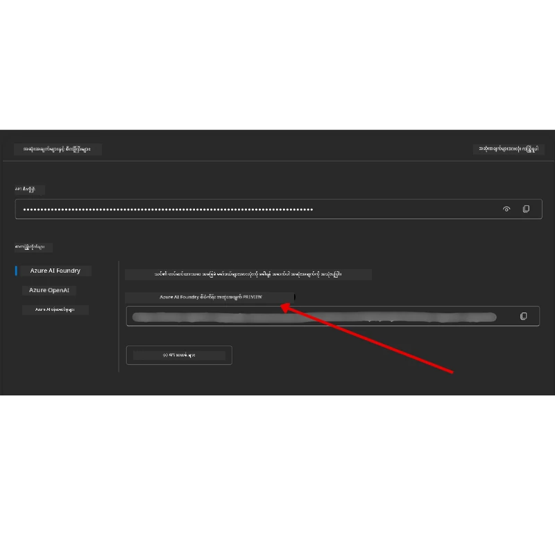

# သင်တန်း ပြင်ဆင်ခြင်း

## မိတ်ဆက်

ဒီသင်ခန်းစာတွင် သင်တန်း၏ ကုဒ် နမူနာများကို လည်ပတ်စေခြင်း (run) နည်းလမ်းများကို ဖော်ပြပေးပါမည်။

## အခြား သင်ယူသူများနှင့် ပူးပေါင်း၍ အကူအညီ ရယူပါ

repo ကို clone လုပ်ရန် စတင်မလုပ်မီ၊ စက်တင်ဖြေရှင်းခြင်း သို့မဟုတ် သင်ခန်းစာအကြောင်း မေးခွန်းများအတွက် အကူအညီရရန် သို့မဟုတ် အခြား သင်ယူသူများနှင့် ချိတ်ဆက်ရန် [AI Agents For Beginners Discord channel](https://aka.ms/ai-agents/discord) ကို လက်တွဲဝင်ပါ။

## ဒီ Repo ကို Clone သို့မဟုတ် Fork လုပ်ခြင်း

စတင်ရန် GitHub Repository ကို clone သို့မဟုတ် fork လုပ်ပါ။ ဒါက သင့်ကိုယ်ပိုင် သင်ခန်းစာ ပစ္စည်းကောင်းကို ဖန်တီးပေးမယ်၊ ထို့နောက် ကုဒ်ကို လည်ပတ်၊ စမ်းသပ်၊ ပြင်ဆင်နိုင်ပါပြီ။

This can be done by clicking the link to <a href="https://github.com/microsoft/ai-agents-for-beginners/fork" target="_blank">repo ကို fork လုပ်ပါ</a>

You should now have your own forked version of this course in the following link:



### Shallow Clone (workshop / Codespaces အတွက် အကြံပြု)

  > အလုံးစုံ repository သမိုင်းကြောင်းနှင့် ဖိုင်အားလုံးကို ဒေါင်းလုတ်ယူခဲ့လျှင် ကြီးမားနိုင်သည် (~3 GB)။ သင်သည် workshop တက်ရောက်နေသော်လည်း သို့မဟုတ် သင်ခန်းစာ ဖိုလ်ဒါအနည်းငယ်သာလိုအပ်သော်လည်း၊ shallow clone (သို့) sparse clone သည် သမိုင်းကြောင်းကို အတိုချုပ်ခြင်း သို့မဟုတ် blobs များကို ရှောင်ကြဉ်ခြင်းဖြင့် ဒေါင်းလုတ်အများစုကို ရှောင်ရှားပေးနိုင်သည်။

#### Quick shallow clone — သမိုင်းကြောင်းကျစ်လစ်စွာ၊ ဖိုင်အားလုံး

Replace `<your-username>` in the below commands with your fork URL (or the upstream URL if you prefer).

To clone only the latest commit history (small download):

```bash|powershell
git clone --depth 1 https://github.com/<your-username>/ai-agents-for-beginners.git
```

To clone a specific branch:

```bash|powershell
git clone --depth 1 --branch <branch-name> https://github.com/<your-username>/ai-agents-for-beginners.git
```

#### Partial (sparse) clone — ဖိုင်များ၏ blob များကိုအနည်းဆုံး + ရွေးချယ်ထားသည့် ဖိုလ်ဒါများသာ

This uses partial clone and sparse-checkout (requires Git 2.25+ and recommended modern Git with partial clone support):

```bash|powershell
git clone --depth 1 --filter=blob:none --sparse https://github.com/<your-username>/ai-agents-for-beginners.git
```

Traverse into the repo folder:

```bash|powershell
cd ai-agents-for-beginners
```

Then specify which folders you want (example below shows two folders):

```bash|powershell
git sparse-checkout set 00-course-setup 01-intro-to-ai-agents
```

After cloning and verifying the files, if you only need files and want to free space (no git history), please delete the repository metadata (💀irreversible — you will lose all Git functionality: no commits, pulls, pushes, or history access).

```bash
# zsh/bash
rm -rf .git
```

```powershell
# ပါဝါရှဲလ်
Remove-Item -Recurse -Force .git
```

#### GitHub Codespaces အသုံးပြုခြင်း (ဒေါင်းလုတ်ကြီးများကို ရှောင်ရန် အကြံပြု)

- [GitHub UI](https://github.com/codespaces) မှ ဒီ repo အတွက် Codespace အသစ်တစ်ခု ဖန်တီးပါ။  

- Codespace အသစ်ထဲရှိ terminal တွင် အထက်ပါ shallow/sparse clone အမိန့်များအနက် တစ်ခုကို run လုပ်၍ လိုအပ်သည့် သင်ခန်းစာ ဖိုလ်ဒါများကို Codespace workspace ထဲသို့သာ ယူပါ။
- ရွေးချယ်စရာ: Codespaces အတွင်း clone ပြုလုပ်ပြီးနောက် .git ကို ဖယ်ရှား၍ အပိုစပေ့စ် (space) ပြန်လည်ရယူနိုင်သည် (အထက်ပါ ဖယ်ရှားချက် အမိန့်များကို ကြည့်ပါ)။
- မှတ်ချက်: repo ကို Codespaces ထဲသို့ တိုက်ရိုက် ဖွင့်လိုပါက (clone တစ်ခုမရှိဘဲ) Codespaces သည် devcontainer ပတ်ဝန်းကျင်ကို တည်ဆောက်ပေးမည်ဖြစ်ပြီး မလိုအပ်သည့် အရာများကိုလည်း provision ပြုလုပ်နိုင်သည်။ သစ် fres Codespace ထဲတွင် shallow copy တစ်ခု clone လုပ်ခြင်းသည် disk အသုံးပြုမှုအပေါ် ပိုမိုထိန်းချုပ်နိုင်စေသည်။

#### အကြံပြုချက်များ

- တည်းဖြတ်/commit ပြုရန် ဆလိုလျှင် clone URL ကို အမြဲသင့်၏ fork URL ဖြင့် လဲရန် မမေ့ပါနဲ့။
- အလယ်ပိုင်းတွင် ပိုမိုသမိုင်းကြောင်း သို့မဟုတ် ဖိုင်များလိုအပ်လာလျှင်၊ ၎င်းတို့ကို fetch လုပ်နိုင်ပြီး sparse-checkout ကို ပြင်ဆင်၍ အပို ဖိုလ်ဒါများထည့်နိုင်ပါသည်။

## ကုဒ် လည်ပတ်ခြင်း

ဒီသင်တန်းတွင် ရှိသော Jupyter Notebooks အစုလိုက်ကို လည်ပတ်စေပြီး AI Agents တည်ဆောက်မှုကို လက်တွင်ကျကျ လေ့လာနိုင်စေပါသည်။

The code samples use **Microsoft Agent Framework (MAF)** with the `AzureAIProjectAgentProvider`, which connects to **Azure AI Agent Service V2** (the Responses API) through **Microsoft Foundry**.

All Python notebooks are labelled `*-python-agent-framework.ipynb`.

## လိုအပ်ချက်များ

- Python 3.12+
  - **NOTE**: သင်တွင် Python3.12 မတပ်ဆင်ထားပါက ထည့်သွင်းပေးပါ။  ပြီးနောက် requirements.txt ဖိုင်မှ မှန်ကန်သော ဗားရှင်းများ ထည့်သွင်းရန် python3.12 နှင့် သင့် venv ကို ဖန်တီးပါ။
  
    >ဥပမာ

    Python venv ဖိုလ်ဒါကို ဖန်တီးပါ:

    ```bash|powershell
    python -m venv venv
    ```

    Then activate venv environment for:

    ```bash
    # zsh/bash
    source venv/bin/activate
    ```
  
    ```dos
    # Command Prompt for Windows
    venv\Scripts\activate
    ```

- .NET 10+: .NET ကို အသုံးပြုထားသည့် sample ကုဒ်များအတွက် [.NET 10 SDK](https://dotnet.microsoft.com/download/dotnet/10.0) သို့မဟုတ် ထို့နောက် ဗားရှင်းတစ်ခုကို ထည့်သွင်းထားပါ။ ပြီးနောက် သင့်ထည့်သွင်းထားသော .NET SDK ဗားရှင်းကို စစ်ဆေးပါ:

    ```bash|powershell
    dotnet --list-sdks
    ```

- **Azure CLI** — အထောက်အပံ့အဖြစ် အထောက်အထားအတွက် လိုအပ်ပါသည်။ [aka.ms/installazurecli](https://aka.ms/installazurecli) မှ ထည့်သွင်းပါ။
- **Azure Subscription** — Microsoft Foundry နှင့် Azure AI Agent Service သို့ ဝင်ရောက်အသုံးပြုရန် လိုအပ်ပါသည်။
- **Microsoft Foundry Project** — တပ်ဆင်ထားသော model (ဥပမာ `gpt-4o`) ပါသော project တစ်ခု လိုအပ်ပါသည်။ အောက်တွင် [Step 1](../../../00-course-setup) ကိုကြည့်ပါ။

ဒီ repository ၏ ရင်းမြစ်ထဲတွင် ကုဒ်နမူနာများကို လည်ပတ်ရန် လိုအပ်သော Python package များအားလုံးပါရှိသည့် `requirements.txt` ဖိုင်ကို ထည့်သွင်းထားပါသည်။

သင်သည် အောက်ပါ အမိန့်ကို repository ဟောင်း၏ ရှေ့ဆုံးမှာ ပြေး၍ ၎င်းများကို ထည့်သွင်းနိုင်ပါသည်။

```bash|powershell
pip install -r requirements.txt
```

ကြုံတွေ့မှုများနှင့် ပြဿနာများရှောင်ရန် Python virtual environment တစ်ခု ဖန်တီးရန် အကြံပြုပါတယ်။

## VSCode ပြင်ဆင်ခြင်း

VSCode မှာ သင့် အသုံးပြုမည့် Python ဗားရှင်းမှန်ကန်ကြောင်း သေချာစေရန် သတိပြုပါ။


## Microsoft Foundry နှင့် Azure AI Agent Service ကို ပြင်ဆင်ပါ

### အဆင့် 1: Microsoft Foundry Project တည်ဆောက်ခြင်း

notebooks များကို run ဖို့ Azure AI Foundry တွင် **hub** နှင့် **project** တို့ရှိပြီး deployed model တစ်ခုထည့်ထားရမည်။

1. သင့် Azure အကောင့်ဖြင့် [ai.azure.com](https://ai.azure.com) သို့ ဝင်ရောက်ပါ။
2. **hub** တစ်ခု ဖန်တီးပါ (သို့မဟုတ် ရှိပြီးသားကို အသုံးပြုပါ)။ ကြည့်ရန်: [Hub resources overview](https://learn.microsoft.com/azure/ai-foundry/concepts/ai-resources)။
3. hub အတွင်းတွင် **project** တစ်ခု ဖန်တီးပါ။
4. **Models + Endpoints** → **Deploy model** မှ model တစ်ခု (ဥပမာ `gpt-4o`) ကို တပ်ဆင်ပါ။

### အဆင့် 2: သင့် Project Endpoint နှင့် Model Deployment Name ကို ရယူခြင်း

Microsoft Foundry portal မှ သင့် project ထဲမှ:

- **Project Endpoint** — **Overview** စာမျက်နှာသို့ သွား၍ endpoint URL ကို ကော်ပီယူပါ။



- **Model Deployment Name** — **Models + Endpoints** သို့သွား၍ သင်တပ်ဆင်ထားသည့် model ကို ရွေးပါ၊ ထိုအခါ **Deployment name** ကို မှတ်ထားပါ (ဥပမာ `gpt-4o`)။

### အဆင့် 3: `az login` ဖြင့် Azure သို့ အကောင့်ဝင်ပါ

All notebooks use **`AzureCliCredential`** for authentication — no API keys to manage. ၎င်းသည် Azure CLI မှတဆင့် သင့်အကောင့်ဖြင့် လော့ဂ်အင်ထားရမည်။

1. **Azure CLI ကို ထည့်သွင်းပါ** (မရှိသေးလျှင်): [aka.ms/installazurecli](https://aka.ms/installazurecli)

2. **Sign in** ပြုလုပ်ရန် အောက်ပါအတိုင်း ရိုက်ထည့်ပါ:

    ```bash|powershell
    az login
    ```

    Or if you're in a remote/Codespace environment without a browser:

    ```bash|powershell
    az login --use-device-code
    ```

3. **Subscription နေရာရွေးရန်** မေးပါက သင့် Foundry project ပါဝင်သော subscription ကို ရွေးပါ။

4. **Sign in ဖြစ်နေသည်ကို အတည်ပြုရန်**:

    ```bash|powershell
    az account show
    ```

> **ဘာကြောင့် `az login`?** Notebooks များသည် `azure-identity` package ထဲမှ `AzureCliCredential` ကို အသုံးပြု၍ authentication ပြုလုပ်သည်။ ၎င်းက သင့် Azure CLI session က credential များကို ပေးသောကြောင့် `.env` ဖိုင်ထဲတွင် API keys သို့မဟုတ် secret မလိုတော့ပါ။ ၎င်းသည် [လုံခြုံရေးအကောင်းဆုံး လုပ်ထုံးလုပ်နည်း](https://learn.microsoft.com/azure/developer/ai/keyless-connections) တစ်ခုဖြစ်သည်။

### အဆင့် 4: သင့် `.env` ဖိုင်ကို ဖန်တီးပါ

ဥပမာ ဖိုင်ကို ကော်ပီလုပ်ပါ:

```bash
# zsh/bash
cp .env.example .env
```

```powershell
# ပါဝါရှဲလ်
Copy-Item .env.example .env
```

`.env` ကို ဖွင့်ပြီး အောက်ပါ အချက်အလက်နှစ်ခုကို ဖြည့်ပါ:

```env
AZURE_AI_PROJECT_ENDPOINT=https://<your-project>.services.ai.azure.com/api/projects/<your-project-id>
AZURE_AI_MODEL_DEPLOYMENT_NAME=gpt-4o
```

| Variable | Where to find it |
|----------|-----------------|
| `AZURE_AI_PROJECT_ENDPOINT` | Foundry portal → သင့် project → **Overview** စာမျက်နှာ |
| `AZURE_AI_MODEL_DEPLOYMENT_NAME` | Foundry portal → **Models + Endpoints** → သင့်တပ်ဆင်ထားသော model ၏ name |

ဒါဆိုရင် အများစုသော သင်ခန်းစာများအတွက် ပြီးပါပြီ။ Notebooks များသည် သင့် `az login` အစက်အပြောက်မှ အလိုအလျောက် authentication ပြုလုပ်ပါမည်။

### အဆင့် 5: Python Dependencies များ ထည့်သွင်းပါ

```bash|powershell
pip install -r requirements.txt
```

ဤအလုပ်ကို မကြာမီဖန်တီးထားသည့် virtual environment အတွင်းတွင် run လုပ်ရန် အကြံပြုပါသည်။

## Lesson 5 အတွက် ထပ်မံ ပြင်ဆင်ချက် (Agentic RAG)

Lesson 5 တွင် retrieval-augmented generation အတွက် **Azure AI Search** ကို အသုံးပြုပါသည်။ ထို သင်ခန်းစာကို run ပြုလုပ်ရန် စီစဉ်ပါက `.env` ဖိုင်တွင် အောက်ပါ variable များကို ထည့်ပါ:

| Variable | Where to find it |
|----------|-----------------|
| `AZURE_SEARCH_SERVICE_ENDPOINT` | Azure portal → သင့် **Azure AI Search** resource → **Overview** → URL |
| `AZURE_SEARCH_API_KEY` | Azure portal → သင့် **Azure AI Search** resource → **Settings** → **Keys** → primary admin key |

## Lesson 6 နှင့် Lesson 8 အတွက် ထပ်မံ ပြင်ဆင်ချက် (GitHub Models)

Lesson 6 နှင့် 8 အချို့သော notebook များသည် Azure AI Foundry အစား **GitHub Models** ကို အသုံးပြုသည်။ ထိုနမူနာများကို run မည်ဆိုလျင် `.env` ဖိုင်ထဲ သို့ အောက်ပါ variable များကို ထည့်ပါ:

| Variable | Where to find it |
|----------|-----------------|
| `GITHUB_TOKEN` | GitHub → **Settings** → **Developer settings** → **Personal access tokens** |
| `GITHUB_ENDPOINT` | Use `https://models.inference.ai.azure.com` (default value) |
| `GITHUB_MODEL_ID` | အသုံးပြုမည့် model အမည် (ဥပမာ `gpt-4o-mini`) |

## Lesson 8 အတွက် ထပ်မံ ပြင်ဆင်ချက် (Bing Grounding Workflow)

Lesson 8 အတွင်း conditional workflow notebook သည် Azure AI Foundry မှတဆင့် **Bing grounding** ကို အသုံးပြုသည်။ ထိုနမူနာကို run မည်ဆိုလျင် `.env` ဖိုင်ထဲ သို့ အောက်ပါ variable ကို ထည့်ပါ:

| Variable | Where to find it |
|----------|-----------------|
| `BING_CONNECTION_ID` | Azure AI Foundry portal → သင့် project → **Management** → **Connected resources** → သင့် Bing connection → connection ID ကို ကော်ပီယူပါ |

## ပြဿနာဖြေရှင်းခြင်း

### macOS တွင် SSL Certificate အတည်ပြုမှု အမှားများ

macOS တွင် အောက်ပါ အမှားတူသလို တဖြည်းဖြည်း ဖြစ်လာနိုင်ပါက:

```plaintext
ssl.SSLCertVerificationError: [SSL: CERTIFICATE_VERIFY_FAILED] certificate verify failed: self-signed certificate in certificate chain
```

ဒါဟာ macOS အပေါ် Python တွင် system SSL certificates များကို အလိုအလျောက် ယုံကြည်မှု သတ်မှတ်ပေးခြင်း မရှိသော သိသာသော ပြဿနာတစ်ခုဖြစ်သည်။ အောက်ပါ ဖြေရှင်းနည်းများကို အဆင့်လိုက် ကြိုးစားကြည့်ပါ။

**Option 1: Python Install Certificates script ကို chạy လုပ်ပါ (အကြံပြု)**

```bash
# 3.XX ကို သင်တပ်ဆင်ထားသော Python ဗားရှင်း (ဥပမာ 3.12 သို့မဟုတ် 3.13) ဖြင့် အစားထိုးပါ:
/Applications/Python\ 3.XX/Install\ Certificates.command
```

**Option 2: သင့် notebook တွင် `connection_verify=False` ကို အသုံးပြုပါ (GitHub Models notebooks များအတွက်သာ)**

Lesson 6 notebook (`06-building-trustworthy-agents/code_samples/06-system-message-framework.ipynb`) တွင် comment ထားသော workaround တစ်ခုပါပြီးဖြစ်သည်။ client တည်ဆောက်ရာတွင် `connection_verify=False` ကို uncomment လုပ်ပါ:

```python
client = ChatCompletionsClient(
    endpoint=endpoint,
    credential=AzureKeyCredential(token),
    connection_verify=False,  # လက်မှတ် အမှားများ ကြုံရပါက SSL အတည်ပြုမှုကို ပိတ်ပါ
)
```

> **⚠️ Warning:** SSL verification ကို ပိတ်ထားခြင်း (`connection_verify=False`) သည် certificate အတည်ပြုပေးမှုကို ကျော်လွှားသဖြင့် လုံခြုံရေးအားနည်းစေပါသည်။ ဤနည်းလမ်းကို ဖွံ့ဖြိုးရေးပတ်ဝန်းကျင်များတွင် ယာယီအဖြစ်သာ အသုံးချပါ၊ production တွင် မသုံးရ။ 

**Option 3: `truststore` ကို ထည့်သွင်း၍ အသုံးပြုပါ**

```bash
pip install truststore
```

ထို့နောက် network call မပြုမီ သင့် notebook သို့မဟုတ် script ထိပ်တွင် အောက်ပါကို ထည့်ပါ:

```python
import truststore
truststore.inject_into_ssl()
```

## တစ်နေရာမှာ ခက်ခဲနေပါသလား?

ဤ setup ကို run လုပ်ရာတွင် မည်သည့်ပြဿနာမျိုးရှိပါက ကျွန်တော်တို့၏ <a href="https://discord.gg/kzRShWzttr" target="_blank">Azure AI Community Discord</a> သို့ ဝင်ရောက်မေးမြန်းပါ သို့မဟုတ် <a href="https://github.com/microsoft/ai-agents-for-beginners/issues?WT.mc_id=academic-105485-koreyst" target="_blank">issue တစ်ခု ဖန်တီးပါ</a>။

## နောက်တန်း သင်ခန်းစာ

ယခု သင်သည် ဒီသင်တန်း၏ ကုဒ်များကို လည်ပတ်ရန် အဆင်သင့်ဖြစ်ပါပြီ။ AI Agents ကမ္ဘာအကြောင်းကို ပိုမိုလေ့လာကာ ပျော်ရွှင်စွာ သင်ယူပါ။

[AI Agents နှင့် Agent အသုံးချမှု မိတ်ဆက်](../01-intro-to-ai-agents/README.md)

---

<!-- CO-OP TRANSLATOR DISCLAIMER START -->
တာဝန်ပယ်ချက်:
ဤစာရွက်စာတမ်းကို AI ဘာသာပြန်ဝန်ဆောင်မှုဖြစ်သည့် [Co-op Translator](https://github.com/Azure/co-op-translator) မှ အသုံးပြု၍ ဘာသာပြန်ထားပါသည်။ ကျွန်ုပ်တို့သည် မှန်ကန်မှုအတွက် ကြိုးစားပါသော်လည်း အလိုအလျောက် ဘာသာပြန်ချက်များတွင် အမှားများ သို့မဟုတ် မှားယွင်းချက်များ ပါနိုင်ကြောင်း သတိပြုပါ။ မူလစာတမ်းကို မူလဘာသာဖြင့်သာ အတည်ပြုထားသည့် ထိမ်းသိမ်းချက်အနေဖြင့် ယူဆသင့်သည်။ အရေးကြီးသော အချက်အလက်များအတွက် မူရင်းစာတမ်းအပေါ် အခြေခံ၍ ပရော်ဖက်ရှင်နယ် လူ ဘာသာပြန်ကို အကြံပြုပါသည်။ ဤဘာသာပြန်ချက်ကို အသုံးပြုခြင်းကြောင့် ကပ်လျက်ဖြစ်ပေါ်လာနိုင်သည့် နားမလည်မှုများ သို့မဟုတ် အဓိပ္ပာယ်မမှန်ကြောင်းများအတွက် ကျွန်ုပ်တို့သည် တာဝန်မယူပါ။
<!-- CO-OP TRANSLATOR DISCLAIMER END -->