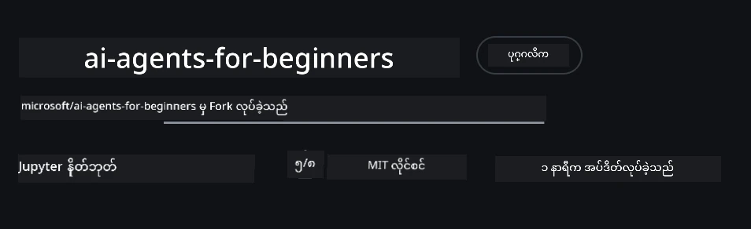
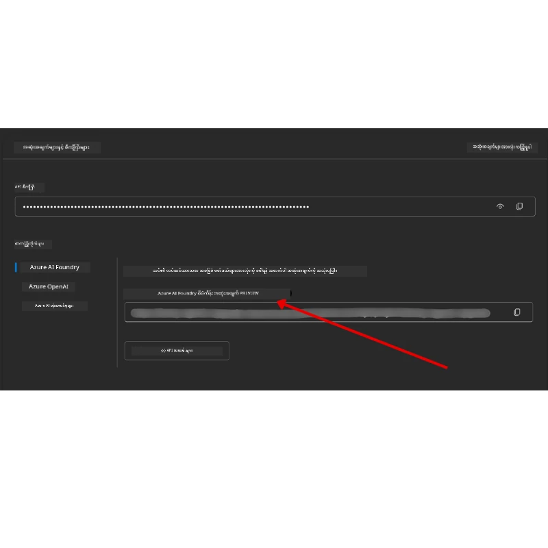

# သင်တန်းစတင်ခြင်း

## နိဒါန်း

ဤသင်ခန်းစာတွင် သင်တန်း၏ ကုတ် ဥပမာများကို မည်သို့Runရမည်ကို ဖော်ပြပေးမည်ဖြစ်သည်။

## အခြားလေ့လာသူများနှင့် ပူးပေါင်းကူညီမှု ရယူခြင်း

သင်၏ repo ကို cloneမပြုမီ [AI Agents For Beginners Discord channel](https://aka.ms/ai-agents/discord) တွင် ပါဝင်၍ စတင်ချိန်းဆိုခြင်း၊ သင်တန်းနှင့်ဆိုင်သော မေးခွန်းများ ကူညီတောင်းခံခြင်း သို့မဟုတ် အခြားလေ့လာသူများနှင့် ဆက်သွယ်နိုင်ပါသည်။

## ဤ Repo ကို Clone သို့မဟုတ် Fork ပြုလုပ်ခြင်း

စတင်ရန် GitHub Repository ကို clone သို့မဟုတ် fork ပြုလုပ်ပါ။ ဤကဏ္ဍသည် သင်၏ ကိုယ်ပိုင်သင်တန်းပစ္စည်းဗားရှင်း ဖြစ်သွားမည်ဟု ဆိုလိုပြီးcode များကို run၊ စမ်းသပ်၊ ပြင်ဆင်နိုင်မည်ဖြစ်ပါသည်။

ထိုဖြစ်စဉ်က <a href="https://github.com/microsoft/ai-agents-for-beginners/fork" target="_blank">repo ကို fork ပြုလုပ်ရန်</a> လင့်ခ်ကို နှိပ်ခြင်းဖြင့် ပြုလုပ်နိုင်သည်။

သင်တွင် ယခုအတွက် သင်၏ကိုယ်ပိုင် forked ဘားရှင်း ရှိသောအကြောင်းကို အောက်ပါလင့်ခ်တွင် ကြည့်ရှုနိုင်ပါသည်။



### Shallow Clone (အလုပ်ရုံ / Codespaces များအတွက် အကြံပြု)

  > ဒီ repository တစ်ခုလုံးသည် အပြည့်အဝမှတ်တမ်း စုဆောင်းချက်နှင့်ဖိုင်များအားလုံးနှင့်အတူ ဒေါင်းလုပ်ပြုလုပ်သောအခါ ကြီးမားနိုင်သည် (~3 GB)။ သင်သည် အလုပ်ရုံသို့ တက်စားသပိတ်ဖြစ်ပါက သို့မဟုတ် သင်တန်းဖိုင် အေသးစိတ် folder အနည်းငယ်သာ လိုအပ်ပါက သမားရိုးကျမဟုတ်သော shallow clone (သို့မဟုတ် sparse clone) ကိုသုံးပြီး ဒေါင်းလုပ်အများအပြားကို ကျော်ဖြတ်နိုင်ပါသည်။

#### အလျင်အမြန် shallow clone — သမားရိုးကျမဟုတ်သောမှတ်တမ်း အနည်းငယ်၊ ဖိုင်အားလုံးပါဝင်သည်

အောက်ပါ command များတွင် `<your-username>` ကို သင်၏ fork URL (သို့မဟုတ် မူလ repo URL) နှင့် အစားထိုးပါ။

နောက်ဆုံး commit သိုင်းမှတ်တမ်းသာ clone ပြုလုပ်ရန် (ဒေါင်းလုပ် အနည်းငယ်):

```bash|powershell
git clone --depth 1 https://github.com/<your-username>/ai-agents-for-beginners.git
```

မိမိလိုသော branch ကို clone ပြုလုပ်ရန်:

```bash|powershell
git clone --depth 1 --branch <branch-name> https://github.com/<your-username>/ai-agents-for-beginners.git
```

#### အပိုင်းအစ (sparse) clone — blob အနည်းငယ် + folder များ ရွေးချယ်ပြီးသာ

ဒါက partial clone နှင့် sparse-checkout အသုံးပြုထားပြီး Git 2.25+ (နှင့် partial clone ပံ့ပိုးတဲ့ မော်ဒန် Git) လိုအပ်သည်:

```bash|powershell
git clone --depth 1 --filter=blob:none --sparse https://github.com/<your-username>/ai-agents-for-beginners.git
```

repo folder ထဲသို့ ဝင်ပါ။

```bash|powershell
cd ai-agents-for-beginners
```

ပြီးတော့ သင်လိုချင်သော folder များကို သတ်မှတ်ပါ။ ဥပမာမှာ folder နှစ်ခုပါဝင်သည်။

```bash|powershell
git sparse-checkout set 00-course-setup 01-intro-to-ai-agents
```

Clone ပြီးပြည့်စုံမှုစစ်ဆေးပြီးနောက် ဖိုင်များသာလိုသည့်အခါ နေရာပေးရန် (Git မှတ်တမ်း မလိုသောအခါ) repository metadata များကို ဖျက်ပစ်ပါ (💀ပြန်လည်မရနိုင်— Git တို့ commit, pull, push, မှတ်တမ်းအားလုံး မသုံးနိုင်တော့ပါ)။

```bash
# zsh/bash
rm -rf .git
```

```powershell
# PowerShell
Remove-Item -Recurse -Force .git
```

#### GitHub Codespaces အသုံးပြုခြင်း (ဒေသစွန်းဒေါင်းလုပ်ကြီးများကိုတားဆီးရန် အကြံပြု)

- [GitHub UI](https://github.com/codespaces) မှ တဆင့် ဤ repo အတွက် Codespace အသစ်ဖန်တီးပါ။

- Codespace အသစ်ထဲတွင် terminal မှာ အပေါ်တွင် ရှိသည့် shallow/sparse clone command များကို Run ပြီး သင်လိုသည့် lesson folder များကို Codespace workspace သို့ ယူပါ။
- ရွေးချယ်နိုင်သည်- Codespaces အတွင်း clone ပြုပြီးနောက် .git ဖိုင်ကို ဖယ်ရှားကာ နေရာဖြည့်နိုင်သည် (အပေါ်တွင်ဖော်ပြသည့် ဖျက်ပစ် command များကို ကြည့်ပါ)။
- မှတ်ချက်- Codespaces မှ repo ကို တိုက်ရိုက်ဖွင့်လိုပါက (clone အပိုမလုပ်ပဲ) Codespaces သည် devcontainer အပြင်အဆင်ကို ပြုလုပ်ပေးမည်ဖြစ်ပြီး သင်လိုအပ်သည်ထက်ပို၍ provision လုပ်နိုင်သည်။ အသစ် Codespace တွင် shallow clone တစ်ခုတည်းလုပ်ခြင်းသည် disk အသုံးပြုမှုကို ထိန်းချုပ်ရာတွင် ပို၍ ထိရောက်သည်။

#### အကြံပြုချက်များ

- အမြဲတမ်း clone URL ကို သင့် fork URL ဖြင့် အစားထိုးပါက အယ်ဒီတ်/ commit ပြုလုပ်နိုင်သည်။
- အရင်က မရှိသေးသော မှတ်တမ်းများသို့မဟုတ် ဖိုင်များ လိုအပ်ပါက fetch လုပ်၍ sparse-checkout ကို ပြန်ပြင်၍ folder များ ပေါင်းပါ။

## ကုတ်များကို Run ပြုလုပ်ခြင်း

ဤသင်တန်းတွင် AI Agents တည်ဆောက်မှုကို လက်တွေ့ထ tactile နားလည်နိုင်ရန် Jupyter Notebooks အစဉ်ကို ပေးသည်။

Code samples များတွင် **Microsoft Agent Framework (MAF)** နှင့် `FoundryChatClient` ကို အသုံးပြုထားပြီး ဒါက **Microsoft Foundry Agent Service V2** (Responses API) နှင့် **Microsoft Foundry** မှတဆင့်ချိတ်ဆက်သည်။

Python notebook အားလုံးကို `*-python-agent-framework.ipynb` ဟူ၍ အမှတ်အသားပြုထားသည်။

## လိုအပ်ချက်များ

- Python 3.12+
  - **မှတ်ချက်**: သင်တွင် Python3.12 မထည့်သွင်းရသေးလျှင် ထည့်သွင်းပါ။ ထို့နောက် python3.12 ဖြင့် venv ဖန်တီးပြီး requirements.txt မှ version ကိုမှန်ကန်စွာ ထည့်သွင်းပါ။
  
    >ဥပမာ

    Python venv directory ဖန်တီးခြင်း:

    ```bash|powershell
    python -m venv venv
    ```

    ထို့နောက် venv environment ကို အသက်သွင်းပါ:

    ```bash
    # zsh/bash
    source venv/bin/activate
    ```
  
    ```dos
    # Command Prompt for Windows
    venv\Scripts\activate
    ```

- .NET 10+: .NET အသုံးပြုသော ဥပမာများအတွက် [.NET 10 SDK](https://dotnet.microsoft.com/download/dotnet/10.0) သို့မဟုတ် နောက်ထပ် version ကို 설치ပါ။ ထို့နောက် သင့် .NET SDK version ကိုစစ်ဆေးပါ။

    ```bash|powershell
    dotnet --list-sdks
    ```

- **Azure CLI** — အတည်ပြုမှုအတွက် လိုအပ်သည်။ [aka.ms/installazurecli](https://aka.ms/installazurecli) မှ 설치ပါ။
- **Azure Subscription** — Microsoft Foundry နှင့် Microsoft Foundry Agent Service အသုံးပြုခွင့်ရရှိရန်။
- **Microsoft Foundry Project** — Model ဖြန့်ချိထားသည့် project (ဥပမာ `gpt-4o`)။ [Step 1](#အဆင့်-၁-microsoft-foundry-project-ဖန်တီးခြင်း) တွင် ကြည့်ပါ။

ဤ repo ၏ root တွင် လိုအပ်သော Python package များအားလုံးပါဝင်သော `requirements.txt` ဖိုင် ပါရှိသည်။

terminal တွင် repository root မှ အောက်ပါ command ဖြင့်ထည့်သွင်းနိုင်သည်။

```bash|powershell
pip install -r requirements.txt
```

conflict မဖြစ်စေရန် Python virtual environment တစ်ခု ဖန်တီးရန် အကြံပြုသည်။

## VSCode ကို စတင်ချိန်းခြင်း

VSCode တွင်မှန်ကန်သော Python version ကို သုံးနေရန် သေချာပါစေ။


## Microsoft Foundry နှင့် Microsoft Foundry Agent Service ကို သတ်မှတ်ခြင်း

### အဆင့် ၁: Microsoft Foundry Project ဖန်တီးခြင်း

notebooks များကို run ရန် Microsoft Foundry **hub** နှင့် **project** တစ်ခုတွင် မော်ဒယ်တင်ထားရမည်။

1. [ai.azure.com](https://ai.azure.com) သို့သွားပြီး သင့် Azure အကောင့်ဖြင့် Sign in ဝင်ပါ။
2. **hub** အသစ်ဖန်တီးပါ (သို့မဟုတ် ရှိပြီးသား hub ကိုအသုံးပြုပါ။) [Hub resources overview](https://learn.microsoft.com/azure/ai-foundry/concepts/ai-resources) ကိုကြည့်ပါ။
3. hub ထဲတွင် **project** တစ်ခု ဖန်တီးပါ။
4. **Models + Endpoints** မှ မော်ဒယ် တင်၍ (ဥပမာ `gpt-4o`) **Deploy model** လုပ်ပါ။

### အဆင့် ၂: Project Endpoint နှင့် မော်ဒယ် deployment အမည် ရယူခြင်း

Microsoft Foundry portal တွင် project မှ:

- **Project Endpoint** — **Overview** စာမျက်နှာသို့ သွားပြီး endpoint URL ကို ကူးယူပါ။



- **Model Deployment Name** — **Models + Endpoints** သို့သွားပြီး တင်ထားသော မော်ဒယ်ကို ရွေးပါ၊ **Deployment name** (ဥပမာ `gpt-4o`) ကို မှတ်သားပါ။

### အဆင့် ၃: Azure CLI ဖြင့် `az login` လုပ်၍ Sign in ဝင်ပါ။

notebook အားလုံးသည် **`AzureCliCredential`** ကို authentication အတွက် သုံးသည် — API key မလိုအပ်ပါ။ Azure CLI မှတဆင့် sign in ဝင်ရန် လိုအပ်သည်။

1. **Azure CLI 설치 မလုပ်ရသေးလျှင် 설치ပါ**: [aka.ms/installazurecli](https://aka.ms/installazurecli)

2. **Sign in** ပြုလုပ်ရန်အတွက်:

    ```bash|powershell
    az login
    ```

    ဒါမှမဟုတ် browser မပါသော remote/Codespace များတွင်:

    ```bash|powershell
    az login --use-device-code
    ```

3. **Subscription ရွေးချယ်ပါ** — နှင့် သင့် Foundry project ပါဝင်သော subscription ကို ရွေးချယ်ပါ။

4. **Sign in ဖြစ်ကြောင်း သေချာစေပါ**:

    ```bash|powershell
    az account show
    ```

> **`az login` အသုံးပြုသည့် အကြောင်း**: notebooks များသည် `azure-identity` package ၏ `AzureCliCredential` ကို သုံးသည်။ သင်၏ Azure CLI session က credentials ကို ပေးသည်။ `.env` ဖိုင်တွင် API keys သို့မဟုတ် secrets မလိုတော့ပါ။ ၎င်းသည် [လုံခြုံရေးအကောင်းဆုံး လုပ်ထုံးလုပ်နည်း](https://learn.microsoft.com/azure/developer/ai/keyless-connections) ဖြစ်သည်။

### အဆင့် ၄: သင့် `.env` ဖိုင် ဖန်တီးပါ

ဥပမာဖိုင်ကို ကူးယူပါ။

```bash
# zsh/bash
cp .env.example .env
```

```powershell
# PowerShell
Copy-Item .env.example .env
```

`.env` ဖိုင်ကို ဖွင့်ပြီး အောက်ပါတန်ဖိုးနှစ်ခုကို ဖြည့်ပါ။

```env
AZURE_AI_PROJECT_ENDPOINT=https://<your-project>.services.ai.azure.com/api/projects/<your-project-id>
AZURE_AI_MODEL_DEPLOYMENT_NAME=gpt-4o
```

| Variable | ဘယ်မှာ ရှာမလဲ |
|----------|-----------------|
| `AZURE_AI_PROJECT_ENDPOINT` | Foundry portal → သင့် project → **Overview** စာမျက်နှာ |
| `AZURE_AI_MODEL_DEPLOYMENT_NAME` | Foundry portal → **Models + Endpoints** → တင်ထားသော မော်ဒယ်အမည် |

သင်တန်းများအတွက် အများစုအောင်သည်။ notebooks များသည် သင့် `az login` session ဖြင့် အလိုအလျောက် သက်မှတ်သွားမည်။

### အဆင့် ၅: Python Dependencies install ပြုလုပ်ပါ

```bash|powershell
pip install -r requirements.txt
```

ယခင်က ဖန်တီးထားသော virtual environment အတွင်းသို့ ပြုလုပ်ရန် အကြံပြုသည်။

## Lesson 5 (Agentic RAG) အတွက် ထပ်ဆောင်းစီမံခြင်း

Lesson 5 တွင် **Azure AI Search** ကို retrieval-augmented generation အတွက် အသုံးပြုသည်။ ထိုသင်ခန်းစာကို run မည်ဆိုပါက အောက်ပါ variable များကို `.env` ဖိုင်တွင် ထည့်ပါ။

| Variable | ဘယ်မှာ ရှာမလဲ |
|----------|-----------------|
| `AZURE_SEARCH_SERVICE_ENDPOINT` | Azure portal → သင့် **Azure AI Search** resource → **Overview** → URL |
| `AZURE_SEARCH_API_KEY` | Azure portal → သင့် **Azure AI Search** resource → **Settings** → **Keys** → primary admin key |

## Lesson 6 နှင့် 8 တွင် Azure OpenAI ကိုတိုက်ရိုက် ခေါ်ယူသည့် အတွက် ထပ်ဆောင်းစီမံချက်များ

Lesson 6 နှင့် 8 ၏ တချို့ notebook များတွင် Microsoft Foundry project ကို ဖြတ်သွား၍ **Azure OpenAI** ကို တိုက်ရိုက် (Responses API ကို အသုံးပြုကာ) ခေါ်ယူသည်။ အဆိုပါ sample များမှာ ယခင် GitHub Models ကို သုံးခဲ့ပြီး (July 2026 တွင် လျော့ချနိုင်သည်) Responses API ကို မထောက်ပံ့တော့ပါ။ ထို sample များကို run မည်ဆိုလျှင် အောက်ပါ variables များကို `.env` ဖိုင်တွင် ထည့်ပါ။

| Variable | ဘယ်မှာ ရှာမလဲ |
|----------|-----------------|
| `AZURE_OPENAI_ENDPOINT` | Azure portal → သင့် **Azure OpenAI** resource → **Keys and Endpoint** → Endpoint (ဥပမာ `https://<your-resource>.openai.azure.com`) |
| `AZURE_OPENAI_DEPLOYMENT` | Responses API အထောက်အပံ့ ရှိသော တင်ထားသော မော်ဒယ်အမည် (ဥပမာ `gpt-4o-mini`) |
| `AZURE_OPENAI_API_KEY` | ရွေးချယ်စရာ — `az login`/Entra ID  မဟုတ် key-based authentication သုံးပါကသာ |

> Responses API သည် တည်ငြိမ်သော `/openai/v1/` endpoint ကိုသုံးပြီး `api-version` မလိုအပ်ပါ။ Keyless Entra ID authentication အသုံးပြုရန် `az login` ဖြင့် sign in ဝင်ပါ။

## အခြားပံ့ပိုးသူ: MiniMax (OpenAI-Compatible)

[MiniMax](https://platform.minimaxi.com/) သည် OpenAI-compatible API ဖြင့် (အကြီးစားကွန်တက်စ် 204K token အထိ) မော်ဒယ်များကို ထောက်ပံ့သည်။ Microsoft Agent Framework ၏ `OpenAIChatClient` သည် OpenAI-Compatible endpoint များနှင့် လုပ်ဆောင်နိုင်သဖြင့် Azure OpenAI သို့မဟုတ် OpenAI အစား MiniMax ကို Drop-in နည်းဖြင့် အသုံးပြုနိုင်သည်။

`.env` ဖိုင်၌ အောက်ပါ variables များထည့်ပါ။

| Variable | ဘယ်မှာ ရှာမလဲ |
|----------|-----------------|
| `MINIMAX_API_KEY` | [MiniMax Platform](https://platform.minimaxi.com/) → API Keys |
| `MINIMAX_BASE_URL` | `https://api.minimax.io/v1` (ပုံမှန်တန်ဖိုး) |
| `MINIMAX_MODEL_ID` | အသုံးပြုမည့် မော်ဒယ်အမည် (ဥပမာ `MiniMax-M3`) |

**မော်ဒယ်များ ဥပမာ**: `MiniMax-M3` (အကြံပြု), `MiniMax-M2.7`, `MiniMax-M2.7-highspeed` (အမြန်ဆုံး ဖြေကြားချက်များ)။ မော်ဒယ်အမည်များနှင့် ရရှိနိုင်မှုသည် စာရင်းချိန်အလိုက် နှင့် အကောင့် သို့မဟုတ် ဒေသအလိုက် မတူနိုင်ပါသည် — [MiniMax Platform](https://platform.minimaxi.com/) တွင် လက်ရှိစာရင်းကို စစ်ဆေးပါ။ `MiniMax-M3` သို့မဟုတ် ရရှိနိုင်စေရန် မဟုတ်လျှင် မိမိ ဆက်သွယ်ခွင့် ရှိသောမော်ဒယ်ကို `MINIMAX_MODEL_ID` တွင်ထားပါ (ဥပမာ `MiniMax-M2.7`)။

`OpenAIChatClient` သုံးသော code sample များ (ဥပမာ Lesson 14 hotel booking workflow) သည် `MINIMAX_API_KEY` များရှိပါကအလိုအလျောက် သင့် MiniMax configuration ကို လက်ခံပြီး အသုံးပြုပါမည်။

## အခြားပံ့ပိုးသူ: Foundry Local (မော်ဒယ်များကို စက်ပေါ်တွင် စစ်ဆေးရန်)

[Foundry Local](https://foundrylocal.ai) သည် လိုက်ယက်စက်ပေါ်တွင် မော်ဒယ်များဒေါင်းလုပ်၊ စီမံခန့်ခွဲ၊ OpenAI-compatible API  ဖြင့် ဝန်ဆောင်မှုပေးသည့် lightweight runtime ဖြစ်သည်။ မိုးကောင်းကင်၊ Azure subscription၊ API key မလိုပါ။ offline ဖွံ့ဖြိုးတိုးတက်မှုအတွက်၊ cloud ကုန်ကျစရိတ် မဖြစ်စေ၊ ဒေတာကို စက်ပေါ်တွင်သိမ်းဆည်းလိုပါက အခြားကောင်းမွန်သော ရွေးချယ်မှုဖြစ်သည်။

Microsoft Agent Framework ၏ `OpenAIChatClient` သည် OpenAI-compatible endpoint သုံးကြောင်း Foundry Local သည် Azure OpenAI အစား local အနေဖြင့် အသုံးပြုနိုင်သည်။

**၁. Foundry Local ကို 설치ပါ**

```bash
# Windows
winget install Microsoft.FoundryLocal

# macOS
brew install foundrylocal
```

**၂. မော်ဒယ်ဒေါင်းလုပ် ပြီး run ပါ** (local service ကိုလည်း စတင်သည်):

```bash
foundry model list          # အသုံးပြုနိုင်သော မော်ဒယ်များကို ကြည့်ပါ
foundry model run phi-4-mini
```

**၃. local endpoint ကို ရှာဖွေရန် Python SDK ကို 설치ပါ:**

```bash
pip install foundry-local-sdk
```

**၄. Microsoft Agent Framework ၏ local model ကို ရည်ညွှန်းပါ:**

```python
from foundry_local import FoundryLocalManager
from agent_framework.openai import OpenAIChatClient

# မော်ဒယ်ကို ဒေါင်းလုပ်လုပ်ပြီး (လိုအပ်ပါက) ဒေသတွင်းမှ ဆာဗ်ပေးပြီးနောက်၊ endpoint/port ကို ရှာဖွေသည်။
manager = FoundryLocalManager("phi-4-mini")

chat_client = OpenAIChatClient(
    base_url=manager.endpoint,      # ဥပမာ http://localhost:<port>/v1
    api_key=manager.api_key,        # Foundry Local အတွက် အမြဲ "မလိုအပ်ပါ" ဖြစ်သည်။
    model_id=manager.get_model_info("phi-4-mini").id,
)

agent = chat_client.as_agent(
    name="LocalAgent",
    instructions="You are a helpful assistant running fully on-device.",
)
```

> **မှတ်ချက်:** Foundry Local သည် OpenAI-compatible **Chat Completions** endpoint ကို ပေးသည်။ local ဖွံ့ဖြိုးမှုနှင့် offline အခြေအနေများအတွက် အသုံးပြုပါ။ အပြည့်အစုံ **Responses API** feature များ (ပြောဆိုချက် စိတ်ခံစားမှု များ၊ tool ထက်ထိန်းချုပ်မှုများ၊ agent-style ဖွံ့ဖြိုးမှု) လိုပါက **Azure OpenAI** သို့မဟုတ် **Microsoft Foundry** project ကို အသုံးပြုရန် Lesson များတွင် ပြထားသည်။ [Foundry Local ကုဒ်စာရွက်စာတမ်း](https://foundrylocal.ai) တွင် ယခင်မော်ဒယ်စာရင်းနှင့် ပလက်ဖောင်း ပံ့ပိုးမှုကို ကြည့်ရှုနိုင်ပါသည်။

## Lesson 8 အတွက် ထပ်ဆောင်းစီမံခြင်း (Bing Grounding Workflow)


အခန်း ၈ မှ ရှိ conditional workflow notebook သည် Microsoft Foundry မှတဆင့် **Bing grounding** ကို အသုံးပြုသည်။ ထိုနမူနာကို ပြေးရန် စီစဉ်ပါက သင်၏ `.env` ဖိုင်တွင် ဤ variable ကို ထည့်သွင်းပါ။

| Variable | ရှာဖွေသည့်နေရာ |
|----------|-----------------|
| `BING_CONNECTION_ID` | Microsoft Foundry portal → သင့် project → **Management** → **Connected resources** → သင့် Bing connection → connection ID ကို ကူးယူပါ |

## ပြဿနာဖြေရှင်းခြင်း

### macOS ပေါ်တွင် SSL လက်မှတ် စစ်ဆေးမှု အမှားများ

သင် macOS တွင် အောက်ပါအမှားကို ကြုံတွေ့ပါက-

```plaintext
ssl.SSLCertVerificationError: [SSL: CERTIFICATE_VERIFY_FAILED] certificate verify failed: self-signed certificate in certificate chain
```

၎င်းသည် macOS တွင် Python အတွက် သက်ဆိုင်ရာ system SSL လက်မှတ်များကို အလိုအလျောက် ယုံကြည်မထားခြင်း ဖြစ်ပြီး သိသာတဲ့ ပြဿနာတစ်ခုဖြစ်သည်။ အောက်ပါဖြေရှင်းနည်းများကို အဆင့်လိုက် စမ်းကြည့်ပါ။

**ရွေးချယ်စရာ ၁: Python ရဲ့ Install Certificates စာရေးစက်ကို လည်ပတ်ပါ (အကြံပြု)**

```bash
# သင်တပ်ဆင်ထားသော Python ဗားရှင်း (ဥပမာ၊ 3.12 သို့ 3.13) ဖြင့် 3.XX နေရာကို သွားလဲပါ။
/Applications/Python\ 3.XX/Install\ Certificates.command
```

**ရွေးချယ်စရာ ၂: သင်၏ notebook တွင် `connection_verify=False` ကို အသုံးပြုပါ (GitHub Models notebooks များအတွက်သာ)**

အခန်း ၆ မှ notebook (`06-building-trustworthy-agents/code_samples/06-system-message-framework.ipynb`) တွင် အဆိုပါ workaround ကို မှတ်ချက်ထဲသို့ ထည့်ထားပြီးဖြစ်သည်။ client ဖန်တီးရာတွင် `connection_verify=False` ကို မှတ်ချက်ဖွင့်ပါ။

```python
client = ChatCompletionsClient(
    endpoint=endpoint,
    credential=AzureKeyCredential(token),
    connection_verify=False,  # လက်မှတ်အမှားများကြုံတွေ့ပါက SSL စစ်ဆေးမှုကို ပိတ်ထားပါ။
)
```

> **⚠️ သတိပေးချက်:** SSL verification ကို ပိတ်ထားခြင်း (`connection_verify=False`) သည် လက်မှတ် စစ်ဆေးမှုကို ကျော်သွားခြင်းဖြင့် လုံခြုံမှုကို လျော့နည်းစေပါသည်။ ဤနည်း ကို ဖွံ့ဖြိုးတိုးတတ်သော အခြေအနေများတွင်သာ ယာယီ ဖြေရှင်းနည်းအဖြစ် သုံးပါ၊ ထုတ်လုပ်မှုတွင် မသုံးရ။

**ရွေးချယ်စရာ ၃: `truststore` ကို ထည့်သွင်း၍ အသုံးပြုပါ**

```bash
pip install truststore
```

ထို့နောက် သင်၏ notebook သို့မဟုတ် script ၏ ထိပ်တွင် (network ခေါ်ဆိုမှု မပြုမီ) အောက်ပါကို ထည့်သွင်းပါ။

```python
import truststore
truststore.inject_into_ssl()
```

## ဘယ်နေရာမှာ တစ်ထပ်တည်း ပိတ်မိသလဲ?

ဤ setup ကို ပြေးရာတွင် ပြဿနာများရှိပါက <a href="https://discord.gg/kzRShWzttr" target="_blank">Azure AI Community Discord</a> သို့လာရောက်ပါ၊ သို့မဟုတ် <a href="https://github.com/microsoft/ai-agents-for-beginners/issues?WT.mc_id=academic-105485-koreyst" target="_blank">issue တစ်ခုဖန်တီးပါ</a>။

## နောက်ထပ် အခန်း

သင်အဆိုပါ သင်တန်းအတွက် ကုဒ်ကို ပြေးဖို့ အဆင်သင့်ဖြစ်ပါပြီ။ AI Agents ကမ္ဘာအကြောင်း ပိုမိုသိသာစေပြီး လေ့လာမှု ပျော်ရွှင်ပါစေ။

[Introduction to AI Agents and Agent Use Cases](../01-intro-to-ai-agents/README.md)

---

<!-- CO-OP TRANSLATOR DISCLAIMER START -->
**ပြောကြားချက်**
ဤစာတမ်းကို AI ဘာသာပြန်ဝန်ဆောင်မှု [Co-op Translator](https://github.com/Azure/co-op-translator) အသုံးပြု၍ ဘာသာပြန်ထားပါသည်။ ကျွန်ုပ်တို့သည် တိကျမှန်ကန်မှုအတွက် ကြိုးပမ်းနေသော်လည်း၊ စက်ကိရိယာဘာသာပြန်ခြင်းများတွင် အမှားများ သို့မဟုတ် မှားယွင်းချက်များ ပါဝင်နိုင်ကြောင်း သတိပြုပါရန် လိုအပ်ပါသည်။ မူလစာတမ်းကို မူရင်းဘာသာဖြင့်သာ ယုံကြည်စိတ်ချရသော အချက်အလက်အဖြစ် သတ်မှတ်သင့်သည်။ အရေးကြီးသည့် သတင်းအချက်အလက်များအတွက် ပရော်ဖက်ရှင်နယ် လူသားဘာသာပြန်သူဝန်ဆောင်မှုကို အကြံပြုပါသည်။ ဤဘာသာပြန်ချက်ကို အသုံးပြုခြင်းမှ ဖြစ်ပေါ်လာသော နားလည်မှုကွာခြားမှုများ သို့မဟုတ် မမှန်ကန်သော အသုံးပြုမှုများအတွက် ကျွန်ုပ်တို့ တာဝန်မခံပါ။
<!-- CO-OP TRANSLATOR DISCLAIMER END -->